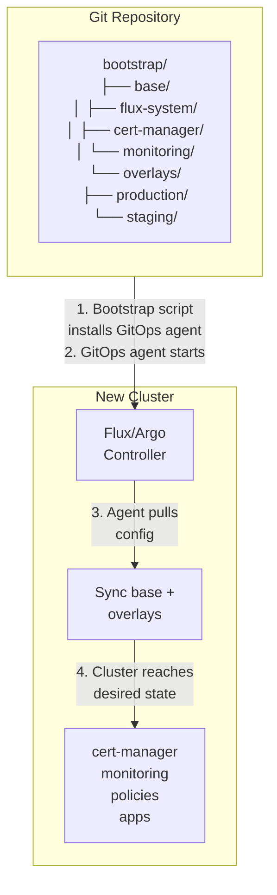
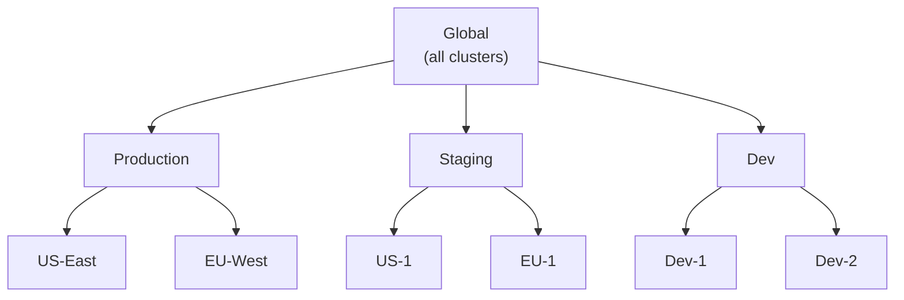
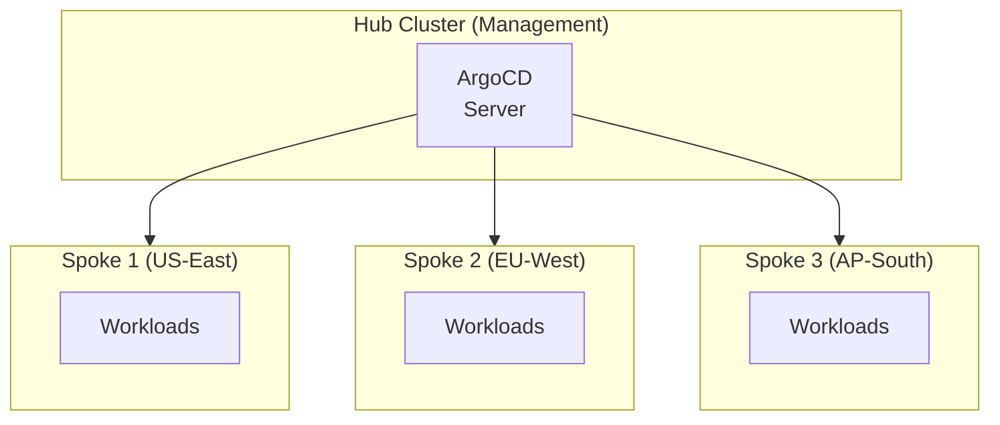
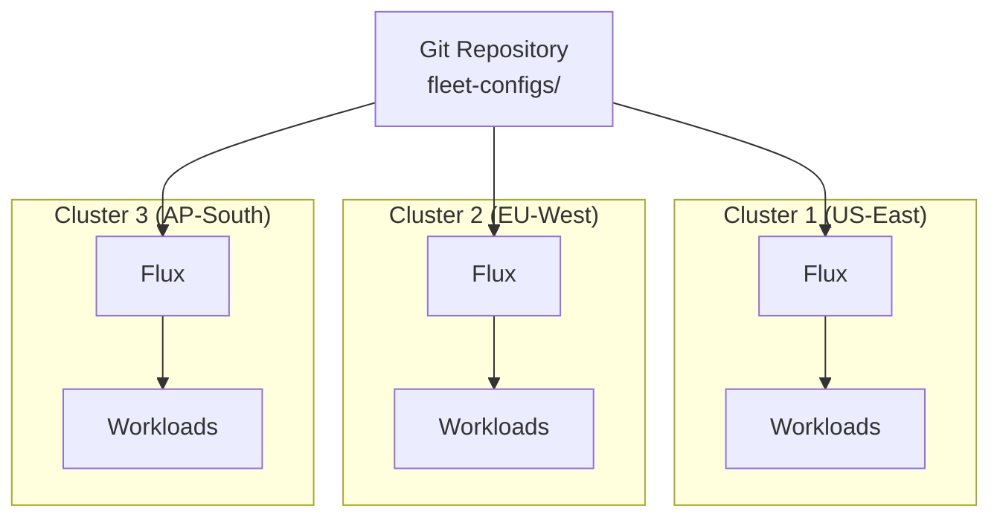
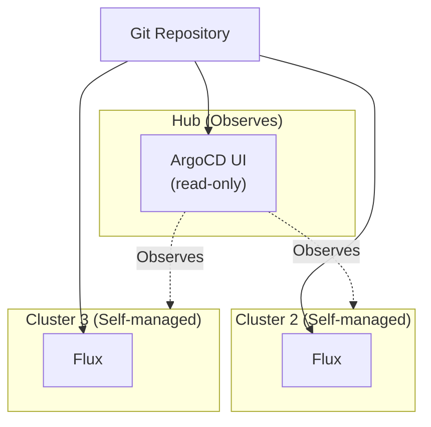

> **Discipline Module** | Complexity: `[COMPLEX]` | Time: 55-65 min

## Prerequisites

Before starting this module:
- **Required**: [Module 3.1: What is GitOps?](../module-3.1-what-is-gitops/) — GitOps fundamentals
- **Required**: [Module 3.2: Repository Strategies](../module-3.2-repository-strategies/) — Repository structure
- **Required**: [Module 3.5: Secrets in GitOps](../module-3.5-secrets/) — Secret management patterns
- **Recommended**: Experience managing at least one Kubernetes cluster with GitOps

---

## What You'll Be Able to Do

After completing this module, you will be able to:

- **Design multi-cluster GitOps architectures that manage dozens of clusters from a single control plane**
- **Implement fleet management patterns using Argo CD ApplicationSets or Flux Kustomization controllers**
- **Build cluster-specific configuration overlays that customize shared baselines per environment or region**
- **Evaluate multi-cluster sync strategies to handle network partitions and cluster-level failures gracefully**

## Why This Module Matters

Single-cluster GitOps is just the beginning. Real organizations run dozens—sometimes hundreds—of clusters across different regions, environments, and cloud providers. Managing them individually doesn't scale.

**Multi-cluster GitOps** extends declarative configuration management to entire fleets. Instead of manually configuring each cluster, you define policies once and let GitOps propagate them everywhere. A security patch? One commit updates 200 clusters. New compliance requirement? Define it centrally, inherit everywhere.

Without multi-cluster GitOps, you'll drown in configuration drift, inconsistent deployments, and operational overhead that grows linearly with each new cluster.

---

## 1. The Multi-Cluster Challenge

### Why Multiple Clusters?

Organizations run multiple clusters for many legitimate reasons:

**Isolation**
```
Production workloads    → Production cluster
Development teams       → Dev cluster
Security-sensitive apps → Isolated cluster
```

**Geography**
```
US customers    → us-east-1 cluster
EU customers    → eu-west-1 cluster (GDPR)
APAC customers  → ap-southeast-1 cluster
```

**Tenancy**
```
Team A → Dedicated cluster
Team B → Dedicated cluster
Shared → Platform services cluster
```

**Blast Radius**
```
Critical systems    → High-availability cluster
Experimental        → Best-effort cluster
```

### The N×M Problem

> **Stop and think**: If you manage 20 clusters and deploy 10 microservices per cluster, you suddenly have 200 configurations. How would you roll out a critical security update across all 20 clusters simultaneously without automation?

With multiple clusters, configuration complexity explodes:

```
Single cluster:
  - 1 cluster × 50 apps = 50 configurations

Multi-cluster:
  - 10 clusters × 50 apps = 500 configurations
  - 10 clusters × 50 apps × 3 environments = 1,500 configurations
```

Without structure, this becomes unmanageable:

```
❌ What happens without multi-cluster GitOps:

Day 1: "I'll just copy the YAML to cluster-2"
Day 30: "Which cluster has the old version?"
Day 90: "Why is this policy different in eu-west?"
Day 180: "Who changed this? When? In which cluster?"
```

### Configuration Categories

Not all configurations are equal across clusters:

```yaml
# Global - Same everywhere
cluster-policies:
  - network-policies/deny-all-default
  - security/pod-security-standards
  - monitoring/datadog-agent

# Environment-specific - Varies by env
environment-config:
  production:
    replicas: 10
    resources: high
  staging:
    replicas: 2
    resources: low

# Cluster-specific - Unique per cluster
cluster-config:
  us-east-1:
    region: us-east-1
    storage-class: gp3
  eu-west-1:
    region: eu-west-1
    storage-class: gp3-eu
```

---

## 2. Fleet Management Patterns

### What is Fleet Management?

Fleet management treats clusters as cattle, not pets. Instead of individually managing each cluster, you define desired state for groups of clusters and let automation handle the rest.

```
Traditional approach:
  kubectl apply -f policy.yaml --context cluster-1
  kubectl apply -f policy.yaml --context cluster-2
  kubectl apply -f policy.yaml --context cluster-3
  ... (repeat for N clusters)

Fleet management approach:
  git commit -m "Add policy to all production clusters"
  # GitOps propagates to 200 clusters automatically
```

### Fleet Management Tools

**Rancher Fleet**
```yaml
# fleet.yaml - Define targeting rules
apiVersion: fleet.cattle.io/v1alpha1
kind: GitRepo
metadata:
  name: my-apps
  namespace: fleet-default
spec:
  repo: https://github.com/org/fleet-configs
  branch: main
  paths:
    - apps/
  targets:
    - name: production
      clusterSelector:
        matchLabels:
          env: production
    - name: staging
      clusterSelector:
        matchLabels:
          env: staging
```

**ArgoCD ApplicationSets**
```yaml
# Generate Application for each cluster
apiVersion: argoproj.io/v1alpha1
kind: ApplicationSet
metadata:
  name: platform-services
spec:
  generators:
    - clusters:
        selector:
          matchLabels:
            env: production
  template:
    metadata:
      name: '{{name}}-platform'
    spec:
      project: default
      source:
        repoURL: https://github.com/org/platform
        targetRevision: main
        path: 'clusters/{{name}}'
      destination:
        server: '{{server}}'
        namespace: platform
```

**Flux Multi-Tenancy**
```yaml
# Kustomization targeting specific cluster
apiVersion: kustomize.toolkit.fluxcd.io/v1
kind: Kustomization
metadata:
  name: platform-config
  namespace: flux-system
spec:
  sourceRef:
    kind: GitRepository
    name: fleet-configs
  path: ./platform
  prune: true
  postBuild:
    substituteFrom:
      - kind: ConfigMap
        name: cluster-vars  # Cluster-specific values
```

### Cluster Grouping Strategies

**By Environment**
```
clusters/
├── production/
│   ├── us-prod-1/
│   ├── us-prod-2/
│   └── eu-prod-1/
├── staging/
│   └── staging-1/
└── development/
    ├── dev-1/
    └── dev-2/
```

**By Region**
```
clusters/
├── us-east/
│   ├── prod/
│   └── staging/
├── eu-west/
│   ├── prod/
│   └── staging/
└── ap-south/
    ├── prod/
    └── staging/
```

**By Team/Tenant**
```
clusters/
├── platform-team/
│   └── shared-services/
├── team-payments/
│   ├── payments-prod/
│   └── payments-staging/
└── team-inventory/
    ├── inventory-prod/
    └── inventory-staging/
```

---

## 3. Cluster Bootstrapping

### The Bootstrapping Problem

New clusters start empty. How do you go from bare Kubernetes to a fully-configured, GitOps-managed cluster?

**Manual bootstrapping (Don't do this)**:
```bash
# Day 1: Manual setup
kubectl apply -f https://github.com/argoproj/argo-cd/manifests/install.yaml
kubectl apply -f argocd-config.yaml
kubectl apply -f applications.yaml

# Day 30: "What was the exact sequence again?"
# Day 60: "Why doesn't the new cluster match the others?"
```

**Automated bootstrapping (Do this)**:
```bash
# One command sets up everything
./bootstrap.sh cluster-name production us-east-1
# GitOps agent installs → Pulls config → Cluster matches desired state
```

### Bootstrap Architecture



### Flux Bootstrap

```bash
# Bootstrap a new cluster with Flux
flux bootstrap github \
  --owner=my-org \
  --repository=fleet-configs \
  --branch=main \
  --path=clusters/production/us-east-1 \
  --personal

# This command:
# 1. Installs Flux controllers
# 2. Creates GitRepository source pointing to your repo
# 3. Creates Kustomization pointing to cluster path
# 4. Commits Flux manifests back to repo
```

**Bootstrap directory structure**:
```
clusters/
└── production/
    └── us-east-1/
        ├── flux-system/           # Flux components (auto-generated)
        │   ├── gotk-components.yaml
        │   ├── gotk-sync.yaml
        │   └── kustomization.yaml
        ├── infrastructure.yaml    # Infrastructure Kustomization
        └── apps.yaml              # Applications Kustomization
```

**Infrastructure Kustomization**:
```yaml
# clusters/production/us-east-1/infrastructure.yaml
apiVersion: kustomize.toolkit.fluxcd.io/v1
kind: Kustomization
metadata:
  name: infrastructure
  namespace: flux-system
spec:
  interval: 10m
  sourceRef:
    kind: GitRepository
    name: flux-system
  path: ./infrastructure/production
  prune: true
  wait: true  # Wait for infrastructure before apps
```

### ArgoCD App-of-Apps Bootstrap

```yaml
# Root application that manages all other applications
apiVersion: argoproj.io/v1alpha1
kind: Application
metadata:
  name: root
  namespace: argocd
spec:
  project: default
  source:
    repoURL: https://github.com/org/fleet-configs
    targetRevision: main
    path: clusters/production/us-east-1
  destination:
    server: https://kubernetes.default.svc
    namespace: argocd
  syncPolicy:
    automated:
      prune: true
      selfHeal: true
```

**What the root app deploys**:
```yaml
# clusters/production/us-east-1/kustomization.yaml
apiVersion: kustomize.config.k8s.io/v1beta1
kind: Kustomization
resources:
  # Infrastructure apps (deployed first)
  - ../../base/infrastructure/cert-manager.yaml
  - ../../base/infrastructure/external-secrets.yaml
  - ../../base/infrastructure/monitoring.yaml

  # Platform apps (after infrastructure)
  - ../../base/platform/ingress-nginx.yaml
  - ../../base/platform/policy-engine.yaml

  # Workload apps (last)
  - apps/
```

### Zero-Touch Provisioning

> **Pause and predict**: If a GitOps controller is configured to automatically provision new clusters, what happens if the targeting rules are too broad (e.g., matching `env: *`)? Could a test configuration accidentally overwrite production?

The ultimate goal: clusters that configure themselves on creation.

```yaml
# Cluster API + GitOps = Zero-touch provisioning
apiVersion: cluster.x-k8s.io/v1beta1
kind: Cluster
metadata:
  name: production-us-east-2
  labels:
    env: production
    region: us-east
  annotations:
    # GitOps bootstrap on cluster creation
    fleet.cattle.io/managed: "true"
    argocd.argoproj.io/sync-wave: "0"
spec:
  clusterNetwork:
    services:
      cidrBlocks: ["10.96.0.0/12"]
    pods:
      cidrBlocks: ["192.168.0.0/16"]
  infrastructureRef:
    apiVersion: infrastructure.cluster.x-k8s.io/v1beta1
    kind: AWSCluster
    name: production-us-east-2
```

When Cluster API creates the cluster, the GitOps controller automatically:
1. Detects the new cluster
2. Matches it against targeting rules
3. Bootstraps it with the appropriate configuration

---

## 4. Configuration Inheritance

### The Inheritance Problem

Without inheritance, you duplicate configuration everywhere:

```
❌ Configuration duplication:

clusters/us-east-prod/
  ├── cert-manager.yaml        # Copy 1
  ├── monitoring.yaml          # Copy 1
  └── network-policy.yaml      # Copy 1

clusters/us-west-prod/
  ├── cert-manager.yaml        # Copy 2 (identical!)
  ├── monitoring.yaml          # Copy 2 (identical!)
  └── network-policy.yaml      # Copy 2 (identical!)

clusters/eu-west-prod/
  ├── cert-manager.yaml        # Copy 3 (identical!)
  ├── monitoring.yaml          # Copy 3 (identical!)
  └── network-policy.yaml      # Copy 3 (identical!)

# When cert-manager needs updating:
# - Find all 47 copies
# - Update each one
# - Miss 3 copies
# - Wonder why 3 clusters are broken
```

### Inheritance Hierarchy

**Design a clear hierarchy**:


**What each level provides**:
```yaml
# Global (inherited by everyone)
global:
  - pod-security-policies
  - network-policies/deny-all
  - monitoring/datadog-agent
  - security/falco

# Environment (inherited by env clusters)
production:
  - high-availability-settings
  - strict-resource-quotas
  - pagerduty-integration

staging:
  - relaxed-resource-quotas
  - slack-integration

# Cluster (specific to one cluster)
us-east-prod:
  - region: us-east-1
  - storage-class: gp3
  - ingress-domain: us.example.com
```

### Implementing Inheritance with Kustomize

**Directory structure**:
```
config/
├── base/                          # Global configs
│   ├── security/
│   │   ├── network-policies.yaml
│   │   └── pod-security.yaml
│   ├── monitoring/
│   │   ├── prometheus.yaml
│   │   └── grafana.yaml
│   └── kustomization.yaml
│
├── environments/
│   ├── production/                # Production overlay
│   │   ├── patches/
│   │   │   ├── high-replicas.yaml
│   │   │   └── strict-limits.yaml
│   │   └── kustomization.yaml
│   └── staging/                   # Staging overlay
│       ├── patches/
│       │   └── relaxed-limits.yaml
│       └── kustomization.yaml
│
└── clusters/
    ├── us-east-prod/              # Cluster-specific
    │   ├── cluster-vars.yaml      # Variables
    │   └── kustomization.yaml     # Inherits from production
    └── eu-west-prod/
        ├── cluster-vars.yaml
        └── kustomization.yaml
```

**Base kustomization**:
```yaml
# config/base/kustomization.yaml
apiVersion: kustomize.config.k8s.io/v1beta1
kind: Kustomization
resources:
  - security/network-policies.yaml
  - security/pod-security.yaml
  - monitoring/prometheus.yaml
  - monitoring/grafana.yaml
```

**Environment overlay**:
```yaml
# config/environments/production/kustomization.yaml
apiVersion: kustomize.config.k8s.io/v1beta1
kind: Kustomization
resources:
  - ../../base
patches:
  - path: patches/high-replicas.yaml
  - path: patches/strict-limits.yaml
commonLabels:
  environment: production
```

**Cluster-specific kustomization**:
```yaml
# config/clusters/us-east-prod/kustomization.yaml
apiVersion: kustomize.config.k8s.io/v1beta1
kind: Kustomization
resources:
  - ../../environments/production
configMapGenerator:
  - name: cluster-config
    literals:
      - CLUSTER_NAME=us-east-prod
      - REGION=us-east-1
      - STORAGE_CLASS=gp3
patches:
  - target:
      kind: Ingress
    patch: |
      - op: replace
        path: /spec/rules/0/host
        value: us.example.com
```

### Variable Substitution

**Flux post-build substitution**:
```yaml
# Kustomization with variable substitution
apiVersion: kustomize.toolkit.fluxcd.io/v1
kind: Kustomization
metadata:
  name: apps
  namespace: flux-system
spec:
  sourceRef:
    kind: GitRepository
    name: fleet-configs
  path: ./apps
  postBuild:
    substitute:
      CLUSTER_NAME: us-east-prod
      REGION: us-east-1
    substituteFrom:
      - kind: ConfigMap
        name: cluster-vars
      - kind: Secret
        name: cluster-secrets
```

**Using variables in manifests**:
```yaml
# app-deployment.yaml
apiVersion: apps/v1
kind: Deployment
metadata:
  name: my-app
  labels:
    cluster: ${CLUSTER_NAME}
spec:
  template:
    spec:
      containers:
        - name: app
          env:
            - name: AWS_REGION
              value: ${REGION}
            - name: CLUSTER_NAME
              value: ${CLUSTER_NAME}
```

---

## 5. Hub-Spoke vs Mesh Topologies

### Hub-Spoke Pattern

In hub-spoke, a central management cluster controls all workload clusters:



**ArgoCD Hub-Spoke Configuration**:
```yaml
# Register spoke clusters with hub
apiVersion: v1
kind: Secret
metadata:
  name: spoke-us-east
  namespace: argocd
  labels:
    argocd.argoproj.io/secret-type: cluster
type: Opaque
stringData:
  name: spoke-us-east
  server: https://us-east.example.com:6443
  config: |
    {
      "bearerToken": "<token>",
      "tlsClientConfig": {
        "insecure": false,
        "caData": "<base64-ca>"
      }
    }
---
# ApplicationSet deploys to all spokes
apiVersion: argoproj.io/v1alpha1
kind: ApplicationSet
metadata:
  name: platform-services
spec:
  generators:
    - clusters: {}  # All registered clusters
  template:
    metadata:
      name: '{{name}}-platform'
    spec:
      source:
        repoURL: https://github.com/org/platform
        path: 'clusters/{{name}}'
      destination:
        server: '{{server}}'
```

**Pros of Hub-Spoke**:
- ✅ Single pane of glass
- ✅ Centralized access control
- ✅ Easier auditing
- ✅ Simpler secret management

**Cons of Hub-Spoke**:
- ❌ Hub is single point of failure
- ❌ Network connectivity required
- ❌ Latency for distant spokes
- ❌ Hub resource scaling challenges

### Mesh Pattern

> **Pause and predict**: In a Mesh topology, if the central Git repository goes offline for an hour, do the existing workload clusters crash, or do they continue to operate normally? Why?

In mesh, each cluster manages itself but syncs from a shared Git repository:



**Flux Mesh Configuration**:
```yaml
# Each cluster has its own Flux installation
# pointing to the same repo, different path

# Cluster 1 bootstrap:
flux bootstrap github \
  --path=clusters/us-east \
  ...

# Cluster 2 bootstrap:
flux bootstrap github \
  --path=clusters/eu-west \
  ...

# Cluster 3 bootstrap:
flux bootstrap github \
  --path=clusters/ap-south \
  ...
```

**Pros of Mesh**:
- ✅ No single point of failure
- ✅ Clusters operate independently
- ✅ Works across network boundaries
- ✅ Better for air-gapped environments

**Cons of Mesh**:
- ❌ No single pane of glass
- ❌ Harder to audit across fleet
- ❌ Duplicate controller resources
- ❌ Consistency verification challenges

### Hybrid Approach

Many organizations use hybrid: hub for visibility, mesh for resilience.



**Implementation**:
```yaml
# Hub cluster - Read-only observation
apiVersion: argoproj.io/v1alpha1
kind: Application
metadata:
  name: observe-cluster-2
spec:
  source:
    repoURL: https://github.com/org/fleet-configs
    path: clusters/cluster-2
  destination:
    server: https://cluster-2:6443
  syncPolicy:
    automated: false  # Don't sync, just observe
```

---

## 6. War Story: "The Cluster That Forgot Its Identity"

**The Setup**: A fintech company managed 40 clusters across 4 regions with ArgoCD hub-spoke. Each cluster had slightly different configurations based on regional compliance requirements.

**The Crisis**: After a routine hub upgrade, cluster bootstrap templates got mixed up. Three EU clusters received US configurations, violating GDPR data residency requirements. Customer data started flowing to incorrect regions.

**The Investigation**:
```yaml
# What went wrong:
# ApplicationSet generator matched on "env: production"
# but didn't differentiate by region

# Before (broken):
generators:
  - clusters:
      selector:
        matchLabels:
          env: production

# All production clusters got same config!
```

**The Fix**:
```yaml
# After (correct):
generators:
  - matrix:
      generators:
        - clusters:
            selector:
              matchLabels:
                env: production
                region: us
        - list:
            elements:
              - config: us
  - matrix:
      generators:
        - clusters:
            selector:
              matchLabels:
                env: production
                region: eu
        - list:
            elements:
              - config: eu
              - compliance: gdpr
```

**Additional safeguards**:
```yaml
# Cluster identity validation
apiVersion: v1
kind: ConfigMap
metadata:
  name: cluster-identity
  namespace: kube-system
data:
  CLUSTER_NAME: "eu-west-prod-1"
  REGION: "eu-west"
  COMPLIANCE: "gdpr"
---
# Admission webhook validates deployments match cluster identity
apiVersion: admissionregistration.k8s.io/v1
kind: ValidatingWebhookConfiguration
metadata:
  name: cluster-identity-validator
webhooks:
  - name: validate.cluster.identity
    admissionReviewVersions: ["v1"]
    sideEffects: None
    clientConfig:
      service:
        name: identity-validator
        namespace: kube-system
    rules:
      - operations: ["CREATE", "UPDATE"]
        apiGroups: ["apps", ""]
        apiVersions: ["v1"]
        resources: ["deployments", "configmaps"]
```

**The Lesson**: Multi-cluster GitOps requires explicit cluster identity management. Never assume cluster labels are sufficient—validate identity at multiple layers, and test cluster targeting with dry-runs before applying to production fleets.

**The Aftermath**: The company implemented:
1. Mandatory cluster identity ConfigMaps
2. Pre-sync validation hooks
3. Regional isolation in ApplicationSet generators
4. Compliance drift detection alerts

---

## Did You Know?

1. **Netflix operates over 500 microservices** across thousands of cloud instances. Their deployment platform Spinnaker was born from the need to manage deployments at this scale—GitOps tools like ArgoCD and Flux learned from these lessons.

2. **Google's Borg system** (Kubernetes' predecessor) managed millions of containers across thousands of machines using a configuration language called BCL. Kubernetes' declarative YAML approach was inspired by lessons learned from Borg's configuration management at scale.

3. **Rancher Fleet can manage up to 1 million clusters** according to their design goals. While few organizations need that scale, it demonstrates how fleet management tooling has evolved beyond simple multi-cluster to true hyperscale.

4. **The Kubernetes Multi-Cluster SIG** is actively developing standards for fleet management, including the Cluster Inventory API and Work API, aiming to make multi-cluster a first-class citizen in the Kubernetes ecosystem.

---

## Common Mistakes

| Mistake | Why It's Wrong | What To Do Instead |
|---------|----------------|-------------------|
| No cluster identity | Can't differentiate clusters | Define explicit identity ConfigMaps |
| Flat configuration structure | No inheritance, everything duplicated | Design clear base/overlay hierarchy |
| Hub without redundancy | Single point of failure | Multi-hub or hybrid approach |
| Bootstrapping manually | Inconsistent clusters | Automated zero-touch provisioning |
| No targeting validation | Wrong config to wrong cluster | Pre-sync validation webhooks |
| Treating all clusters equally | Ignoring compliance/region needs | Explicit cluster grouping strategies |

---

## Quiz

Test your understanding of multi-cluster GitOps:

### Question 1
Your organization's platform team manages 50 production clusters across three regions. A critical CVE in a widely used ingress controller is announced, requiring an immediate update to version 1.35.2. Instead of manually applying the patch or running a script loop across 50 contexts, what is the correct GitOps strategy to roll out this patch everywhere at once?

<details>
<summary>Show Answer</summary>

**Answer**: 
To patch all 50 clusters efficiently, you should commit the updated ingress controller version to the base or global configuration directory in your Git repository. Because all production clusters inherit from this common base, the GitOps controllers (like Argo CD or Flux) running in or managing each cluster will automatically detect the new commit. They will then independently pull the updated manifests and reconcile their local cluster state. This approach ensures absolute consistency across the entire fleet and leaves an unambiguous audit trail showing exactly when the patch was rolled out globally. If any issues arise, a simple revert of that single commit will downgrade all 50 clusters back to the previous known-good state.

</details>

### Question 2
You are tasked with designing the GitOps architecture for a defense contractor operating heavily air-gapped data centers with unreliable network links between sites. You are debating whether to use a Hub-Spoke or a Mesh topology for fleet management. Which topology is the better choice for this environment, and how do the core differences between the two dictate your decision?

<details>
<summary>Show Answer</summary>

**Answer**: 
In this scenario, a Mesh topology is the superior choice due to the unreliable network links and air-gapped nature of the data centers. In a Hub-Spoke topology, a central management cluster pushes configurations to all workload clusters, which creates a single point of failure and heavily relies on continuous network connectivity from the hub to every spoke. A Mesh topology, by contrast, deploys an independent GitOps controller in every single cluster, allowing each one to pull configurations directly from a local or mirrored Git repository. Because each cluster is self-managed, intermittent network drops between data centers will not disrupt a cluster's ability to maintain its desired state or reconcile local changes. This decentralized approach maximizes resilience and autonomy at the cost of centralized visibility.

</details>

### Question 3
The development team just requested a new dedicated test cluster in the `eu-west-1` region. You want to ensure that the moment the infrastructure is provisioned, the cluster automatically installs all required security policies, monitoring agents, and the ingress controller without any human intervention. How does the concept of zero-touch provisioning achieve this seamless handoff between infrastructure and GitOps?

<details>
<summary>Show Answer</summary>

**Answer**: 
Zero-touch provisioning bridges the gap between infrastructure creation and software configuration by treating cluster bootstrapping as an automated, declarative process. First, an Infrastructure-as-Code tool like Cluster API or Terraform creates the raw Kubernetes cluster, attaching specific identity labels (e.g., region or environment). As part of the infrastructure provisioning script or user-data, a GitOps controller is installed and configured to point at the central fleet repository. Once the controller starts, it matches the cluster's identity against the repository's targeting rules and immediately pulls down the base configurations, platform tools, and environment-specific overlays. This automated handoff guarantees that the cluster is fully compliant and operational before any workload developers are even granted access, completely eliminating configuration drift on day one.

</details>

### Question 4
All 10 of your staging clusters inherit from a shared `staging` Kustomize overlay that deploys version 2.40.0 of Prometheus. However, the data science team needs to test a new feature in Prometheus 2.45.0 exclusively on their dedicated staging cluster (`data-science-staging-1`) without affecting the other 9 clusters. How do you implement this exception in your configuration hierarchy?

<details>
<summary>Show Answer</summary>

**Answer**: 
To implement this targeted exception, you should apply a cluster-specific override within the configuration repository hierarchy rather than modifying the shared environment base. You navigate to the cluster-specific directory (`clusters/data-science-staging-1`) and add a Kustomize patch or image override that explicitly targets the Prometheus deployment. Because this directory inherits from the `staging` base, Kustomize will process the shared configurations first, and then apply the cluster-specific patch to replace the version tag with 2.45.0. This strategy satisfies the data science team's requirement locally while ensuring the other 9 staging clusters continue to run the standard 2.40.0 version. It also cleanly isolates the experimental change in Git, making it easy to track, review, and eventually revert when the test concludes.

</details>

---

## Hands-On Exercise: Multi-Cluster GitOps Setup

### Objective
Design and implement a multi-cluster GitOps configuration for a hypothetical organization with clusters across multiple environments and regions.

### Scenario
You're architecting GitOps for a company with:
- 3 environments: dev, staging, production
- 2 regions: us-east, eu-west
- Total: 6 clusters (1 per environment-region combination)

### Prerequisites
- A Git repository
- Kustomize installed locally
- Optional: kind for local testing

### Part 1: Design the Repository Structure

Create the following directory structure:

```bash
mkdir -p fleet-config/{base,environments,clusters}
mkdir -p fleet-config/base/{security,monitoring,networking}
mkdir -p fleet-config/environments/{dev,staging,production}
mkdir -p fleet-config/clusters/{dev-us-east,dev-eu-west,staging-us-east,staging-eu-west,prod-us-east,prod-eu-west}
```

### Part 2: Create Base Configuration

```yaml
# fleet-config/base/security/network-policy.yaml
apiVersion: networking.k8s.io/v1
kind: NetworkPolicy
metadata:
  name: default-deny-all
  namespace: default
spec:
  podSelector: {}
  policyTypes:
    - Ingress
    - Egress
---
# fleet-config/base/monitoring/namespace.yaml
apiVersion: v1
kind: Namespace
metadata:
  name: monitoring
  labels:
    purpose: observability
---
# fleet-config/base/kustomization.yaml
apiVersion: kustomize.config.k8s.io/v1beta1
kind: Kustomization
resources:
  - security/network-policy.yaml
  - monitoring/namespace.yaml
commonLabels:
  managed-by: gitops
```

### Part 3: Create Environment Overlays

```yaml
# fleet-config/environments/production/kustomization.yaml
apiVersion: kustomize.config.k8s.io/v1beta1
kind: Kustomization
resources:
  - ../../base
commonLabels:
  environment: production
commonAnnotations:
  security.policy/level: strict
patches:
  - patch: |
      - op: add
        path: /metadata/labels/critical
        value: "true"
    target:
      kind: Namespace
---
# fleet-config/environments/staging/kustomization.yaml
apiVersion: kustomize.config.k8s.io/v1beta1
kind: Kustomization
resources:
  - ../../base
commonLabels:
  environment: staging
---
# fleet-config/environments/dev/kustomization.yaml
apiVersion: kustomize.config.k8s.io/v1beta1
kind: Kustomization
resources:
  - ../../base
commonLabels:
  environment: dev
```

### Part 4: Create Cluster-Specific Configuration

```yaml
# fleet-config/clusters/prod-us-east/kustomization.yaml
apiVersion: kustomize.config.k8s.io/v1beta1
kind: Kustomization
resources:
  - ../../environments/production
commonLabels:
  cluster: prod-us-east
  region: us-east
configMapGenerator:
  - name: cluster-identity
    namespace: kube-system
    literals:
      - CLUSTER_NAME=prod-us-east
      - REGION=us-east-1
      - ENVIRONMENT=production
---
# fleet-config/clusters/prod-eu-west/kustomization.yaml
apiVersion: kustomize.config.k8s.io/v1beta1
kind: Kustomization
resources:
  - ../../environments/production
commonLabels:
  cluster: prod-eu-west
  region: eu-west
configMapGenerator:
  - name: cluster-identity
    namespace: kube-system
    literals:
      - CLUSTER_NAME=prod-eu-west
      - REGION=eu-west-1
      - ENVIRONMENT=production
      - COMPLIANCE=gdpr
```

### Part 5: Validate Inheritance

```bash
# Build and verify each cluster configuration
for cluster in prod-us-east prod-eu-west staging-us-east staging-eu-west dev-us-east dev-eu-west; do
  echo "=== Cluster: $cluster ==="
  kustomize build fleet-config/clusters/$cluster | head -50
  echo ""
done
```

### Part 6: Create ApplicationSet (Optional - for ArgoCD users)

```yaml
# fleet-config/applicationset.yaml
apiVersion: argoproj.io/v1alpha1
kind: ApplicationSet
metadata:
  name: cluster-configs
  namespace: argocd
spec:
  generators:
    - list:
        elements:
          - cluster: prod-us-east
            server: https://prod-us-east.example.com:6443
          - cluster: prod-eu-west
            server: https://prod-eu-west.example.com:6443
          - cluster: staging-us-east
            server: https://staging-us-east.example.com:6443
          - cluster: staging-eu-west
            server: https://staging-eu-west.example.com:6443
          - cluster: dev-us-east
            server: https://dev-us-east.example.com:6443
          - cluster: dev-eu-west
            server: https://dev-eu-west.example.com:6443
  template:
    metadata:
      name: '{{cluster}}-config'
    spec:
      project: default
      source:
        repoURL: https://github.com/org/fleet-config
        targetRevision: main
        path: 'clusters/{{cluster}}'
      destination:
        server: '{{server}}'
      syncPolicy:
        automated:
          prune: true
          selfHeal: true
```

### Success Criteria
- [ ] All 6 cluster configurations build successfully with kustomize
- [ ] Production clusters inherit strict security labels
- [ ] Each cluster has unique identity ConfigMap
- [ ] GDPR compliance label appears only on EU clusters
- [ ] Base configuration changes would propagate to all clusters

### Bonus Challenge
Add a new component (e.g., cert-manager) to the base configuration and verify it would be deployed to all clusters while allowing production clusters to use a different version.

---

## Current Landscape

### Fleet Management Tools

| Tool | Approach | Best For |
|------|----------|----------|
| **ArgoCD ApplicationSets** | Generator-based templating | Teams already using ArgoCD |
| **Rancher Fleet** | GitOps-native fleet manager | Large-scale fleet management |
| **Flux + Kustomize** | Per-cluster controllers | Decentralized, resilient fleets |
| **Cluster API** | Infrastructure as Code | Cluster lifecycle management |
| **Crossplane** | Control plane composition | Platform teams building abstractions |

### Comparison

**ArgoCD ApplicationSets**
- Pros: Powerful generators, good UI, mature ecosystem
- Cons: Hub dependency, complex generator syntax

**Rancher Fleet**
- Pros: Purpose-built for fleet management, good targeting
- Cons: Rancher ecosystem dependency, learning curve

**Flux Multi-Cluster**
- Pros: True GitOps, no hub required, resilient
- Cons: No single pane of glass without additional tooling

---

## Best Practices

1. **Start with clear cluster identity**
   - Every cluster must know what it is
   - Labels, ConfigMaps, and annotations for identity
   - Validate identity at deployment time

2. **Design inheritance before implementation**
   - Map out what's global, environment, cluster-specific
   - Document the hierarchy
   - Plan for exceptions

3. **Automate bootstrapping completely**
   - Zero manual steps after cluster creation
   - Test bootstrap process regularly
   - Version control bootstrap scripts

4. **Plan for failure**
   - Hub-spoke needs hub redundancy
   - Mesh needs coordination tooling
   - Test cluster isolation scenarios

5. **Implement progressive rollouts**
   - Don't update all clusters simultaneously
   - Canary cluster strategy
   - Automated rollback on failures

---

## Further Reading

- [ArgoCD ApplicationSets Documentation](https://argo-cd.readthedocs.io/en/stable/operator-manual/applicationset/)
- [Flux Multi-Tenancy Guide](https://fluxcd.io/flux/guides/multi-tenancy/)
- [Rancher Fleet Documentation](https://fleet.rancher.io/)
- [GitOps at Scale - Weaveworks](https://www.weave.works/blog/gitops-at-scale)
- [Cluster API Book](https://cluster-api.sigs.k8s.io/)

---

## Summary

Multi-cluster GitOps extends declarative configuration management from individual clusters to entire fleets. Key concepts:

- **Fleet management** treats clusters as cattle, enabling one-commit-updates-all
- **Cluster bootstrapping** automates the journey from empty cluster to production-ready
- **Configuration inheritance** eliminates duplication through base/overlay hierarchies
- **Hub-spoke vs mesh** topologies offer different trade-offs between centralization and resilience
- **Cluster identity** is fundamental—every cluster must know what it is

The goal is simple: manage 100 clusters as easily as 1.

---

## Next Steps

Congratulations! You've completed the GitOps Discipline track. You now understand:
- GitOps principles and patterns
- Repository organization strategies
- Environment promotion workflows
- Drift detection and remediation
- Secrets management in GitOps
- Multi-cluster fleet management

**Recommended next tracks**:
- **DevSecOps Discipline**: Integrate security into your GitOps pipelines
- **GitOps Toolkit**: Deep dive into ArgoCD, Flux, and related tools
- **Platform Engineering Discipline**: Build self-service platforms using GitOps