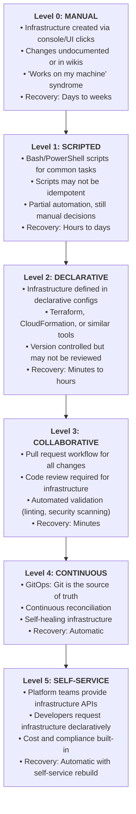
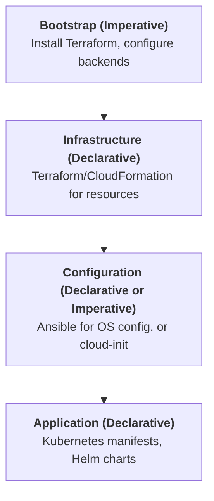
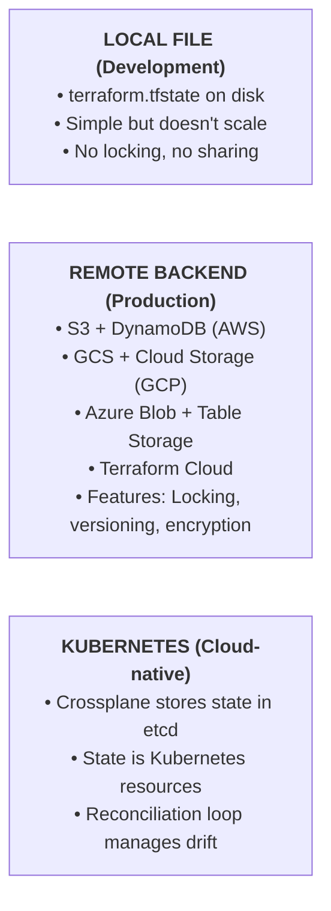
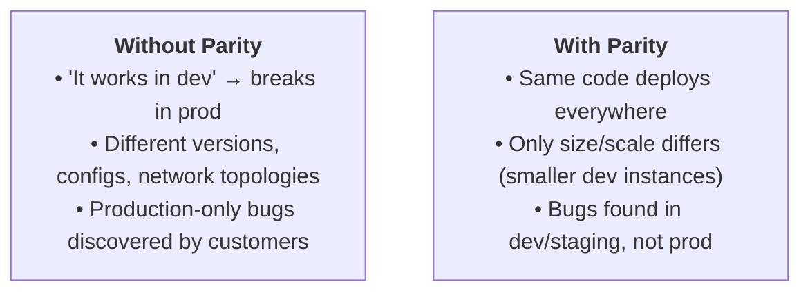

> **Complexity**: `[MEDIUM]`
>
> **Time to Complete**: 35-40 minutes
>
> **Prerequisites**: [Module 1: Infrastructure as Code](/prerequisites/modern-devops/module-1.1-infrastructure-as-code/)
>
> **Track**: Platform Engineering - IaC Discipline

---

**January 2019. A Fortune 500 financial services company attempts to migrate to the cloud and discovers their infrastructure is completely undocumented.**

The migration team opened tickets to understand the existing infrastructure. The responses were alarming: "I think Dave set that up, but he left two years ago." "That server? No idea what it does, but don't touch it." "We call it the mystery box—it's been running for seven years."

Three months into the migration, they'd mapped only 40% of their infrastructure. The rest existed as tribal knowledge, scattered scripts, and "just SSH in and check" procedures. **The migration that was budgeted for 18 months took 4 years and cost $340 million over budget.**

The post-mortem was brutal: "We didn't have infrastructure. We had accumulated technical debt shaped like servers."

Meanwhile, their competitor—a company half their size—completed a similar migration in 8 months. The difference? Every piece of infrastructure existed as code. Every change was version-controlled. Every environment could be recreated from scratch in hours.

This module teaches Infrastructure as Code fundamentals: not just the tools, but the principles, patterns, and maturity journey that separates organizations drowning in infrastructure chaos from those who treat infrastructure as a competitive advantage.

---

## What You'll Be Able to Do

After completing this module, you will be able to:

- **Design Infrastructure as Code workflows that treat infrastructure definitions as versioned, tested software**
- **Implement Terraform or Pulumi projects with proper state management and backend configuration**
- **Evaluate IaC tool choices — Terraform, Pulumi, Crossplane, CDK — against your team's skills and requirements**
- **Build modular IaC repositories with reusable components and clear dependency management**

## Why This Module Matters

Infrastructure as Code isn't just about automation—it's about treating infrastructure with the same rigor as application code. Version control. Code review. Testing. Continuous integration. These practices transformed software development. IaC brings them to infrastructure.

Understanding IaC fundamentals helps you:
- Design infrastructure that's reproducible and auditable
- Choose the right tools for your organization's maturity level
- Build patterns that scale from startup to enterprise
- Avoid the "snowflake server" antipattern that kills agility

---

## What You'll Learn

- The IaC maturity model and where your organization fits
- Declarative vs imperative approaches and when to use each
- State management concepts that apply across all tools
- Version control strategies for infrastructure
- Environment parity and promotion patterns
- Common antipatterns and how to avoid them

---

## Part 1: The IaC Maturity Model

### 1.1 The Five Levels of IaC Maturity



> **Stop and think**: If your organization currently relies on manual UI clicks to provision servers, what is the single most critical risk you face during a disaster recovery scenario?

### 1.2 Assessing Your Organization

#### Reproducibility
**Q: Can you recreate your production environment from scratch?**
- **Level 0**: "No, we'd have to figure it out as we go"
- **Level 2**: "Yes, but it takes a day of manual steps"
- **Level 4**: "Yes, terraform apply and wait 30 minutes"
- **Level 5**: "Yes, it's automatically recreated if destroyed"

#### Change Management
**Q: How do infrastructure changes get made?**
- **Level 0**: "Someone SSHs in and makes changes"
- **Level 1**: "We have scripts, but anyone can run them"
- **Level 3**: "All changes go through PR review"
- **Level 5**: "Developers request via API, platform provisions"

#### Drift Detection
**Q: Do you know if actual state matches desired state?**
- **Level 0**: "What's drift?"
- **Level 2**: "We run terraform plan occasionally"
- **Level 4**: "Continuous monitoring, alerts on drift"
- **Level 5**: "Auto-remediation brings state back"

#### Disaster Recovery
**Q: How long to recover from total infrastructure loss?**
- **Level 0**: "Weeks, if ever"
- **Level 2**: "Days—we'd need to debug the scripts"
- **Level 4**: "Hours—apply from Git"
- **Level 5**: "Minutes—auto-rebuild from state"

---

## Part 2: Declarative vs Imperative

### 2.1 Understanding the Paradigms

#### Imperative: "How to get there"
You specify the exact steps to achieve the desired state.

```bash
# Bash script (imperative)
aws ec2 run-instances --image-id ami-12345 --count 1
aws ec2 wait instance-running --instance-ids $INSTANCE_ID
aws ec2 create-tags --resources $INSTANCE_ID --tags Key=Name,Value=web
```
- **Problem:** What if instance already exists?
- **Problem:** What if it exists but with wrong tags?
- **Problem:** Running again creates ANOTHER instance!

#### Declarative: "What should exist"
You specify the desired end state. The tool figures out how.

```hcl
# Terraform (declarative)
resource "aws_instance" "web" {
  ami           = "ami-12345"
  instance_type = "t3.micro"
  tags = {
    Name = "web"
  }
}
```
- **Benefit:** Run multiple times, same result (idempotent)
- **Benefit:** Tool calculates delta from current state
- **Benefit:** Can show plan before applying

#### Comparison

| Feature | Imperative | Declarative |
|---------|------------|-------------|
| **Idempotent?** | Usually no | Yes |
| **Learning curve** | Lower | Higher |
| **Flexibility** | Maximum | Constrained |
| **Debugging** | Step-by-step | State comparison |
| **Rollback** | Manual | Often automatic |
| **Example tools** | Bash, Ansible* | Terraform, CloudFormation |

*\*Ansible can be both depending on how you use it*

> **Pause and predict**: If you run a declarative Terraform configuration twice without changing the code, what will happen? Why?

### 2.2 When to Use Each

#### Use Declarative When:
- ✓ Managing cloud infrastructure (VMs, networks, databases)
- ✓ State needs to be tracked over time
- ✓ Multiple people manage the same infrastructure
- ✓ You need drift detection
- ✓ Rollback capability is important

#### Use Imperative When:
- ✓ One-time migration scripts
- ✓ Complex conditional logic
- ✓ Bootstrapping before declarative tools work
- ✓ Emergency procedures
- ✓ Tasks that aren't infrastructure (data migration)

#### Hybrid Approach (Common in practice)



### 2.3 Configuration as Code (CaC) vs Infrastructure as Code (IaC)

You will sometimes see the term **Configuration as Code (CaC)** alongside IaC. They are related but distinct practices:

#### Infrastructure as Code (IaC)
- **Manages:** Servers, networks, databases, load balancers, DNS
- **Tools:** Terraform, Pulumi, CloudFormation, Crossplane
- **Scope:** "The platform your applications run on"
- **Example:** Provisioning an EKS cluster with 3 node groups

#### Configuration as Code (CaC)
- **Manages:** Application settings, feature flags, runtime config
- **Tools:** Ansible (config), ConfigMaps, Consul, LaunchDarkly
- **Scope:** "How your applications behave at runtime"
- **Example:** Setting log levels, enabling a feature flag, tuning connection pool sizes

#### Key Distinction
- **IaC answers:** "What infrastructure exists?"
- **CaC answers:** "How is the software on that infrastructure configured?"

In practice, they overlap. A Kubernetes ConfigMap is CaC (app settings), but the cluster it lives on is IaC. Both should be version-controlled, reviewed, and tested.

---

## Part 3: State Management Concepts

### 3.1 Why State Matters

Declarative IaC needs to know:
1. What SHOULD exist (your code)
2. What DOES exist (actual infrastructure)
3. What it CREATED before (state)

#### Why State Is Necessary
Without state, the tool can't know:
- Did I create this resource, or did someone else?
- What's the resource ID for updates/deletes?
- What was the previous configuration?

> **Code says:** "Create 3 servers"
> **Reality:** 3 servers exist
>
> **Without state:** Create 3 more? Or is this the same 3?
> **With state:** "I created these 3. IDs match. No changes."

#### State Storage Options



> **Stop and think**: Why is storing a Terraform state file on a single developer's local laptop a catastrophic risk for a team of five engineers?

### 3.2 State Locking and Consistency

#### Concurrent Access Problem

| Time | Alice | Bob |
|------|-------|-----|
| **T0** | Reads state | |
| **T1** | | Reads state (same) |
| **T2** | Plans: Add server | |
| **T3** | | Plans: Add server |
| **T4** | Applies: Creates srv-1 | |
| **T5** | | Applies: Creates srv-2 |
| **T6** | Writes state (srv-1) | |
| **T7** | | Writes state (srv-2) |

**Result:** State says srv-2 exists. srv-1 is ORPHANED (no state reference).

#### This Is Why Locking Exists

With state locking:

| Time | Alice | Bob |
|------|-------|-----|
| **T0** | Acquires lock ✓ | |
| **T1** | Reads state | |
| **T2** | | Tries lock: BLOCKED |
| **T3** | Plans, applies | |
| **T4** | Writes state | |
| **T5** | Releases lock | |
| **T6** | | Acquires lock ✓ |
| **T7** | | Reads UPDATED state |

**Result:** Both changes tracked correctly.

---

## Part 4: Version Control Strategies

### 4.1 Repository Structure Patterns

#### Monorepo (All infrastructure in one repo)
```text
infrastructure/
├── environments/
│   ├── dev/
│   │   ├── main.tf
│   │   └── terraform.tfvars
│   ├── staging/
│   └── prod/
├── modules/
│   ├── vpc/
│   ├── eks/
│   └── rds/
└── global/
    ├── iam/
    └── dns/
```
- ✓ Easy to share modules
- ✓ Single PR can update all environments
- ✓ Easier to maintain consistency
- ✗ Large blast radius
- ✗ Slower CI for unrelated changes

#### Polyrepo (Separate repos per component/team)
```text
repo: infra-networking
repo: infra-eks
repo: infra-databases
repo: team-alpha-infra
repo: team-beta-infra
```
- ✓ Clear ownership
- ✓ Independent release cycles
- ✓ Smaller blast radius
- ✗ Module versioning complexity
- ✗ Harder to maintain consistency
- ✗ Cross-repo changes are painful

#### Hybrid (Monorepo for platform, polyrepo for teams)
```text
repo: platform-infrastructure (platform team)
├── modules/       (shared modules)
├── networking/
├── kubernetes/
└── security/

repo: team-alpha-infra (team alpha)
├── uses modules from platform-infrastructure
└── team-specific resources

repo: team-beta-infra (team beta)
└── same pattern
```
- ✓ Balance of control and autonomy
- ✓ Platform team governs shared resources
- ✓ Teams own their infrastructure

### 4.2 Branching and Environment Promotion

#### Pattern 1: Directory per Environment
All environments in same repo, same branch.

```text
main branch:
├── dev/main.tf      ← Changes here first
├── staging/main.tf  ← Promoted after dev testing
└── prod/main.tf     ← Promoted after staging
```
**Workflow:**
1. PR changes to dev/
2. Test in dev
3. PR changes to staging/ (copy from dev)
4. Test in staging
5. PR changes to prod/ (copy from staging)

#### Pattern 2: Branch per Environment
Same code, different branches trigger different environments.

```text
main     → deploys to prod
staging  → deploys to staging
dev      → deploys to dev
```
**Workflow:**
1. PR to dev branch, merge, auto-deploys
2. PR from dev to staging, merge, auto-deploys
3. PR from staging to main, merge, auto-deploys

#### Pattern 3: GitOps with Environment Overlays
Base configuration with environment-specific patches.

```text
main branch:
├── base/
│   ├── main.tf      ← Shared configuration
│   └── variables.tf
└── overlays/
    ├── dev/         ← dev-specific values
    ├── staging/
    └── prod/
```
**Workflow:**
1. Change base/ for structural changes
2. Change overlays/ for environment-specific values
3. CI applies base + overlay for each environment

> **Pause and predict**: How might adopting a strict 'Directory per Environment' pattern impact the time it takes to promote an infrastructure change from development to production?

---

## Part 5: Environment Parity

### 5.1 The Parity Principle

"Dev, staging, and prod should be as similar as possible."

#### Why Parity Matters



#### What Should Be The Same
- ✓ Infrastructure architecture (same services, same layout)
- ✓ Software versions (OS, runtime, dependencies)
- ✓ Configuration structure (same keys, different values)
- ✓ Security controls (same policies, maybe relaxed in dev)
- ✓ Monitoring and logging (same metrics, different thresholds)

#### What Can Differ
- ✓ Scale (fewer nodes in dev)
- ✓ Instance sizes (smaller in dev)
- ✓ Redundancy (single AZ in dev, multi-AZ in prod)
- ✓ Data (synthetic in dev, real in prod)
- ✓ Secrets (different credentials per environment)

> **Stop and think**: If you hardcode an AWS instance type as `m5.large` directly in your main infrastructure code, how will this impact your ability to maintain environment parity across dev, staging, and production?

### 5.2 Implementing Parity with IaC

```hcl
# variables.tf - Define what varies
variable "environment" {
  description = "Environment name"
  type        = string
}

variable "instance_count" {
  description = "Number of instances"
  type        = number
}

variable "instance_type" {
  description = "EC2 instance type"
  type        = string
}

# main.tf - Same structure everywhere
resource "aws_instance" "app" {
  count         = var.instance_count
  ami           = data.aws_ami.app.id  # Same AMI
  instance_type = var.instance_type     # Different size

  tags = {
    Environment = var.environment
    ManagedBy   = "terraform"
  }
}
```

```hcl
# environments/dev.tfvars
environment    = "dev"
instance_count = 1
instance_type  = "t3.small"

# environments/staging.tfvars
environment    = "staging"
instance_count = 2
instance_type  = "t3.medium"

# environments/prod.tfvars
environment    = "prod"
instance_count = 6
instance_type  = "t3.large"
```

**SAME CODE, DIFFERENT SCALE**
```bash
terraform apply -var-file=environments/dev.tfvars
terraform apply -var-file=environments/staging.tfvars
terraform apply -var-file=environments/prod.tfvars
```

---

## Part 6: Common Antipatterns

### 6.1 Antipatterns to Avoid

- **Antipattern 1: Snowflake Servers**
  - **Problem:** Each server is manually configured, unique
  - **Symptom:** "Don't touch production—nobody knows how it works"
  - **Fix:** Immutable infrastructure. Rebuild, don't repair.
- **Antipattern 2: Configuration Drift**
  - **Problem:** Manual changes made outside IaC
  - **Symptom:** terraform plan shows unexpected changes
  - **Fix:** Continuous drift detection, block console access
- **Antipattern 3: Copy-Paste Infrastructure**
  - **Problem:** Duplicated code across environments
  - **Symptom:** 3 copies of the same Terraform, all slightly different
  - **Fix:** Modules with environment-specific variables
- **Antipattern 4: Monster Modules**
  - **Problem:** One module that does everything
  - **Symptom:** 5000-line main.tf, 45-minute terraform apply
  - **Fix:** Small, composable modules with single responsibility
- **Antipattern 5: State File Chaos**
  - **Problem:** State files checked into Git, or lost
  - **Symptom:** "Where's the state file?" or merge conflicts in .tfstate
  - **Fix:** Remote backend with locking from day one
- **Antipattern 6: Secret Sprawl**
  - **Problem:** Secrets in terraform.tfvars or plain text
  - **Symptom:** Credentials in Git history
  - **Fix:** Secret manager (Vault, AWS Secrets Manager) + references

> **Pause and predict**: If a developer manually SSHes into a server to fix a configuration file, what will happen the next time your Continuous (Level 4) IaC pipeline runs?

> **War Story: The $2.3 Million Snowflake Server**
>
> **March 2020. A logistics company's entire order processing system runs on one server that nobody understands.**
>
> The server had been running for 9 years. The original engineer had left. It ran a custom application with hand-tuned kernel parameters, undocumented cron jobs, and configuration scattered across 47 files.
>
> When the server's hardware failed, the recovery took 11 days. The team spent the first 3 days just figuring out what the server did. The next 5 days were spent recreating the configuration from memory and log archaeology. The final 3 days were debugging why the new server didn't work the same way.
>
> **The cost:**
> - $1.4 million in lost orders during the outage
> - $600K in expedited shipping to fulfill delayed orders
> - $300K in engineering overtime
>
> **The fix:** They spent 6 months converting everything to IaC. The server configuration is now 340 lines of Ansible. Recovery time: 47 minutes.

---

## Did You Know?

- **The term "Infrastructure as Code"** was popularized by Andrew Clay Shafer and Patrick Debois around 2008-2009, the same people who coined "DevOps." The concepts existed earlier, but the term crystallized the practice.

- **NASA's Mars missions** use IaC principles. Every configuration for flight software is version-controlled and reproducible. The Mars 2020 Perseverance rover's software deployment process influenced modern GitOps practices.

- **The US Department of Defense** mandates IaC for cloud deployments. Their Cloud Computing Security Requirements Guide (SRG) requires that "infrastructure configurations shall be defined in machine-readable formats and version controlled."

- **Terraform's state file format** hasn't fundamentally changed since 2014. The backward compatibility has been maintained across 10+ years and hundreds of releases—a testament to the importance of state management.

---

## Common Mistakes

| Mistake | Problem | Solution |
|---------|---------|----------|
| Starting with complex tools | Overwhelmed, abandoned | Start simple, grow maturity |
| No remote state from day one | Lost state, conflicts | Configure backend immediately |
| Manual changes "just this once" | Drift accumulates | Block console, require PRs |
| Not testing IaC changes | Broken prod deployments | Plan in CI, apply in CD |
| Hardcoded values everywhere | Can't reuse code | Variables and modules |
| Giant monolithic configs | Slow, risky changes | Small, focused modules |

---

## Quiz

1. **Your organization has adopted Terraform for all infrastructure provisioning. Every change to infrastructure requires a pull request, and an automated CI pipeline runs `terraform plan` to validate the changes. Once the pull request is approved and merged, a lead engineer manually triggers the `terraform apply` step in the pipeline. After an outage, the CTO mandates that you move from this current state to Level 4 (Continuous) maturity. What specific capabilities must you implement to achieve this goal, and how does it differ from your current setup?**
   <details>
   <summary>Answer</summary>

   To reach Level 4 (Continuous) maturity, you must implement continuous reconciliation and automated drift remediation, moving to a true GitOps model. Your current setup represents Level 3 (Collaborative), where changes are version-controlled and reviewed via pull requests, but applying those changes remains a discrete, semi-manual event. In a Level 4 environment, a software agent continuously monitors both the Git repository (the desired state) and the actual infrastructure environment. If it detects any differences—whether from a new commit or manual tampering—it automatically applies the necessary changes to bring the infrastructure back in line with the repository. This eliminates the need for manual apply triggers and provides self-healing capabilities against configuration drift.
   </details>

2. **A junior engineer on your team wrote a bash script that provisions three new EC2 instances using the AWS CLI. They ran the script twice by accident, resulting in six instances being created. They ask you why the company's Terraform configurations don't have this problem when applied multiple times. How do you explain the difference in behavior between their script and your Terraform code?**
   <details>
   <summary>Answer</summary>

   You would explain that Terraform uses a declarative model, while their bash script uses an imperative model. In a declarative system like Terraform, you define the desired end state (e.g., "there should be exactly three EC2 instances"). When the tool runs, it first compares the actual state of the infrastructure against this desired state, and only executes the necessary creation, modification, or deletion operations to bridge the gap. Because the bash script is imperative, it defines a series of explicit actions to perform ("create three instances") rather than an end state, causing those actions to execute blindly every time the script is invoked. This makes declarative tools inherently idempotent—meaning they can run multiple times with the same outcome—whereas imperative scripts require complex custom logic to achieve the same safety.
   </details>

3. **An organization has infrastructure deployed across three distinct environments (dev, staging, prod) with slight variations in each. Over the past year, these environments have experienced significant "configuration drift" because engineers maintain separate codebases for each environment, leading to unreliable production deployments. Design an IaC solution that solves this issue while preserving the necessary variations.**
   <details>
   <summary>Answer</summary>

   To solve configuration drift while maintaining environment parity, the organization should refactor their infrastructure code into reusable modules. A single module defines the core architectural structure and default configurations, ensuring that all environments share the exact same structural foundation. Individual environments (dev, staging, prod) then consume this common module while passing in environment-specific variables, such as instance sizes or replica counts. This pattern strictly parameterizes the allowed differences between environments, making it impossible for their core architectures to diverge. When engineers propose changes, they modify the shared module, allowing the CI/CD pipeline to detect drift by comparing plans across all environments simultaneously.
   </details>

4. **Two platform engineers, Alice and Bob, receive urgent tickets to scale up different components of your application. They both run `terraform apply` from their local laptops at the exact same time against the same remote state backend, but the backend's state locking mechanism has been accidentally disabled. What is the likely outcome of this concurrent execution, and how would state locking have prevented it?**
   <details>
   <summary>Answer</summary>

   Running concurrent infrastructure updates without state locking will likely result in orphaned resources and a corrupted state file. When both engineers execute their commands, their local Terraform processes simultaneously read the existing state and calculate their respective plans. As they apply the changes, whoever finishes writing to the remote state file last will overwrite the other's state changes, meaning the resources created by the first engineer will be completely untracked by Terraform. State locking prevents this race condition by ensuring that once Alice's process begins planning or applying, it requests and holds an exclusive lock on the remote backend. Bob's process would be blocked until Alice's operation completes and the lock is released, forcing Bob's run to evaluate its plan against the newly updated state.
   </details>

5. **Your company has 5 independent product teams and a central platform team. The CTO wants each product team to manage and deploy their own infrastructure autonomously, but the security team demands strict architectural guardrails. Compare monorepo vs polyrepo strategies for this scenario and explain which pattern you would recommend.**
   <details>
   <summary>Answer</summary>

   For this organization, a hybrid repository approach is the most effective choice. A pure monorepo would throttle the agility of the 5 separate teams by coupling their release cycles and creating a massive blast radius, while a pure polyrepo approach would make it extremely difficult for the central platform team to enforce security standards and share common architectural patterns. By implementing a hybrid strategy, the platform team can maintain a core repository for shared, versioned modules and centralized governance. The individual teams can then operate within their own independent polyrepos, consuming the platform team's approved modules to provision their team-specific infrastructure. This provides the development teams with high autonomy and independent deployment pipelines while ensuring that all provisioned resources adhere to the organization's baseline security and consistency requirements.
   </details>

6. **You have been hired as a Lead Platform Engineer at a company where all infrastructure is currently provisioned using custom Bash and PowerShell scripts (Maturity Level 1). The CTO has tasked you with bringing the organization to a Collaborative IaC model (Maturity Level 3) within six months. What foundational milestones must you prioritize in your roadmap to achieve this specific transition, and why are they necessary?**
   <details>
   <summary>Answer</summary>

   To successfully transition to Level 3, your roadmap must first prioritize the adoption of a declarative IaC tool and the establishment of shared remote state management. Without migrating away from imperative scripts to a declarative framework like Terraform, you cannot reliably track the desired state or manage complex dependencies. Once the baseline infrastructure is declared as code and safely stored in a remote backend with state locking, the next critical milestone is migrating all infrastructure changes into a version control system. Finally, you must implement a strict pull request workflow where all changes are peer-reviewed and automatically validated by a CI pipeline before being applied. This peer-review mechanism is the defining characteristic of Level 3 maturity, shifting infrastructure provisioning from individual isolated actions to a collaborative, auditable engineering process.
   </details>

7. **A developer with elevated access manually logs into the AWS console at 2:00 AM and changes the instance type of a production database to resolve a performance issue. The change is never documented, causing the next routine infrastructure deployment to fail unexpectedly. How would a Level 4 (Continuous) IaC environment handle this situation differently to prevent deployment failures?**
   <details>
   <summary>Answer</summary>

   In a Level 4 environment, the manual modification to the database would be treated as configuration drift and automatically remediated before it could cause a deployment failure. Level 4 maturity relies on continuous reconciliation, where an automated software agent constantly compares the actual state of the cloud environment against the desired state defined in the Git repository. When the developer manually changes the instance type in the console, the agent immediately detects that the actual infrastructure diverges from the version-controlled configuration. The agent would automatically revert the instance type back to the defined state without human intervention. This ensures that the infrastructure remains perfectly synchronized with the repository and prevents ad-hoc, out-of-band changes from accumulating into deployment-breaking drift.
   </details>

8. **Design an IaC workflow that supports the following strict requirements: (a) Multiple isolated environments, (b) High team autonomy, (c) Automated security guardrails, and (d) A comprehensive audit trail for compliance.**
   <details>
   <summary>Answer</summary>

   To satisfy these diverse requirements, you should implement a GitOps-driven workflow that combines modular architecture with automated pipeline checks. The architecture should be split between a central repository for platform-approved modules and individual team directories, granting teams the autonomy to manage their own configurations while enforcing the use of secure, standardized components. Every proposed change must pass through a strict CI/CD pipeline that executes automated formatting, linting, and security scans (such as Checkov) before generating a speculative plan. To satisfy the security guardrails and audit requirements, the pipeline must integrate a policy-as-code evaluation (like OPA) to block non-compliant changes, and require explicit peer approval before execution. This ensures that all modifications are fully auditable in the Git history and consistently evaluated against the organization's security posture before ever touching a production environment.

   ```mermaid
   flowchart TD
       subgraph GitRepository ["Git Repository"]
           M["<b>modules/</b> (Platform team owns)<br/>• vpc/ (Versioned, reviewed)<br/>• eks/ (Security embedded)<br/>• rds/"]
           T["<b>teams/</b> (Teams own their dirs)<br/>• alpha/dev/<br/>• alpha/prod/<br/>• beta/dev/<br/>• beta/prod/"]
       end
       
       subgraph Pipeline ["CI/CD Pipeline"]
           direction TB
           P1["1. Lint & Format (terraform fmt)"]
           P2["2. Security Scan (Checkov, tfsec)"]
           P3["3. Cost Estimate (Infracost)"]
           P4["4. Plan (terraform plan)"]
           P5["5. Policy Check (OPA/Sentinel)"]
           P6["6. Approval (required for prod)"]
           P7["7. Apply (terraform apply)"]
           P8["8. Audit Log (actions logged)"]
           
           P1 --> P2 --> P3 --> P4 --> P5 --> P6 --> P7 --> P8
       end

       GitRepository --> Pipeline
   ```
   </details>

---

## Hands-On Exercise

**Task**: Assess and plan your IaC maturity improvement.

**Part 1: Self-Assessment (10 minutes)**

Answer these questions about your current environment:

```bash
# Create assessment file
cat > iac-assessment.md << 'EOF'
# IaC Maturity Assessment

## Reproducibility
Q: Can you recreate production from scratch?
A: [ ] No / [ ] Days / [ ] Hours / [ ] Minutes / [ ] Automatic

## Change Management
Q: How do infrastructure changes happen?
A: [ ] SSH/Console / [ ] Scripts / [ ] IaC manual / [ ] IaC with PR / [ ] GitOps

## Drift Detection
Q: Do you detect configuration drift?
A: [ ] Never / [ ] Occasionally / [ ] Daily / [ ] Continuous / [ ] Auto-remediate

## Estimated Current Level: _____

## Target Level in 6 months: _____
EOF
```

**Part 2: Design Improvement Plan (15 minutes)**

Based on your assessment, create a plan:

```bash
cat > iac-improvement-plan.md << 'EOF'
# IaC Improvement Plan

## Current State
- Maturity Level:
- Main Pain Points:
  1.
  2.
  3.

## Target State (6 months)
- Target Maturity Level:
- Key Improvements:
  1.
  2.
  3.

## Quick Wins (First Month)
1. Set up remote state backend
2. Convert one service to IaC
3. Add terraform plan to CI

## Month 2-3 Goals
1.
2.

## Month 4-6 Goals
1.
2.

## Success Metrics
- [ ] All infrastructure in Git
- [ ] All changes via PR
- [ ] Recovery time < X hours
- [ ] Drift detected within X hours
EOF
```

**Part 3: Hands-On with Terraform (15 minutes)**

If you have Terraform installed, practice state concepts:

```bash
# Initialize with local state (for learning only)
mkdir -p iac-practice && cd iac-practice

cat > main.tf << 'EOF'
terraform {
  required_version = ">= 1.0"
}

resource "local_file" "example" {
  content  = "Hello, IaC!"
  filename = "${path.module}/hello.txt"
}
EOF

# Initialize and apply
terraform init
terraform plan
terraform apply -auto-approve

# Examine state
terraform state list
terraform state show local_file.example

# Make a change and see the plan
sed -i 's/Hello, IaC!/Hello, Infrastructure as Code!/' main.tf
terraform plan  # Notice it shows the change

# Apply the change
terraform apply -auto-approve

# Clean up
terraform destroy -auto-approve
```

**Success Criteria**:
- [ ] Completed self-assessment
- [ ] Created improvement plan with specific goals
- [ ] Understand state management concepts
- [ ] Can explain the difference between maturity levels

---

## Further Reading

- **"Infrastructure as Code"** by Kief Morris (O'Reilly). The definitive book on IaC principles and patterns.

- **"Terraform: Up & Running"** by Yevgeniy Brikman. Practical guide to Terraform with real-world examples.

- **"The Phoenix Project"** by Gene Kim. Novel that illustrates why IaC matters for organizational agility.

- **HashiCorp Learn** - learn.hashicorp.com. Free tutorials on Terraform from the creators.

---

## Key Takeaways

Before moving on, ensure you understand:

- [ ] **IaC maturity levels**: From manual (0) to self-service (5), and where your organization fits
- [ ] **Declarative vs imperative**: Declarative defines "what," imperative defines "how." Declarative is idempotent
- [ ] **State is critical**: State tracks what IaC created. Remote backends with locking are essential for teams
- [ ] **Version control is non-negotiable**: All infrastructure in Git, all changes via PR
- [ ] **Environment parity**: Same code, different variables. Minimize differences between dev/staging/prod
- [ ] **Avoid antipatterns**: Snowflakes, drift, copy-paste, giant modules, state chaos, secret sprawl
- [ ] **Start simple, grow maturity**: Don't jump to Level 5. Progress through levels intentionally
- [ ] **IaC is cultural**: Tools are easy; getting teams to embrace the workflow is hard

---

## Next Module

[Module 6.2: IaC Testing](../module-6.2-iac-testing/) - How to test infrastructure code before it reaches production.