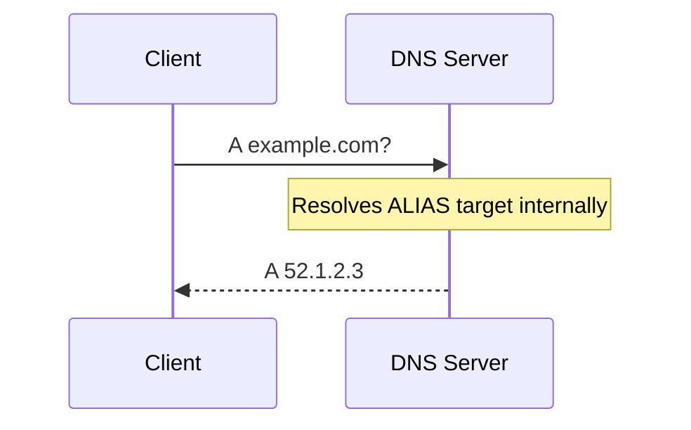

> **Complexity**: `[COMPLEX]`
>
> **Time to Complete**: 3 hours
>
> **Prerequisites**: Basic DNS (A/AAAA/CNAME records), Kubernetes Ingress concepts
>
> **Track**: Foundations — Advanced Networking

### What You'll Be Able to Do

After completing this module, you will be able to:

1. **Design** DNS architectures for global traffic management using weighted routing, geolocation policies, and health-checked failover
2. **Diagnose** DNS resolution failures by tracing queries through recursive resolvers, authoritative servers, and caching layers
3. **Implement** DNS-based service discovery patterns and explain their tradeoffs compared to service mesh alternatives
4. **Evaluate** DNS security risks (cache poisoning, DDoS amplification, hijacking) and apply DNSSEC, DoH, and split-horizon mitigations

---

**July 22, 2016. A routine configuration update at Dyn, one of the world's largest managed DNS providers, propagates a change to their Anycast network. Nothing unusual. But three months later, Dyn would learn a very different lesson about DNS at scale.**

On October 21, 2016, the Mirai botnet unleashed a massive DDoS attack against Dyn's infrastructure. Tens of millions of IP addresses, mostly from compromised IoT devices, flooded Dyn's DNS resolvers. The attack was devastating not because Dyn was careless, but because **DNS is the single most critical piece of internet infrastructure that almost everyone takes for granted**.

Twitter, GitHub, Netflix, Reddit, Spotify, The New York Times — all went dark. Not because their servers were down, but because nobody could look up their IP addresses. **It was like erasing every phone number from every phone book simultaneously.**

The Dyn attack exposed what infrastructure engineers already knew: DNS is the first thing that happens in every connection and the last thing anyone thinks about until it breaks. This module teaches you to think about DNS the way the engineers who keep the internet running do — as a globally distributed, latency-sensitive, security-critical system that demands deliberate architecture.

---

## Why This Module Matters

Every single request your application serves begins with a DNS lookup. Before TLS handshakes, before HTTP requests, before any application logic — the client must resolve a hostname to an IP address. If that resolution is slow, everything is slow. If it fails, nothing works.

At scale, DNS stops being a simple lookup table and becomes a global traffic management system. It decides which datacenter serves your users. It detects failures and reroutes traffic. It balances load across continents. It enforces security policies before a single packet reaches your infrastructure.

Yet most engineers treat DNS as "set it and forget it." They paste records into a web UI and wonder why their global application has mysterious latency spikes for users in certain regions, or why failover takes 20 minutes instead of 20 seconds.

> **The Air Traffic Control Analogy**
>
> Think of DNS like air traffic control. Every plane (request) needs to be told which runway (server) to land on. Good ATC considers weather (server health), fuel levels (client proximity), runway capacity (server load), and traffic patterns (routing policies). Bad ATC just assigns runways randomly and hopes for the best. DNS at scale is your application's ATC system.

---

## What You'll Learn

- Advanced DNS record types beyond A/AAAA/CNAME (ALIAS, ANAME, CAA, SRV)
- Anycast routing and why it matters for DNS
- Traffic management policies: latency-based, weighted, geolocation, failover
- DNSSEC: how it works and why adoption is still incomplete
- TTL tuning and the caching trap that catches everyone
- Hands-on: Building latency-based routing with health checks and failover

---

## Part 1: Beyond Basic DNS Records

### 1.1 The Record Types You Already Know

```text
BASIC DNS RECORDS — QUICK REVIEW
═══════════════════════════════════════════════════════════════

A RECORD
─────────────────────────────────────────────────────────────
Maps hostname -> IPv4 address

    app.example.com.   300   IN   A   203.0.113.10

AAAA RECORD
─────────────────────────────────────────────────────────────
Maps hostname -> IPv6 address

    app.example.com.   300   IN   AAAA   2001:db8::1

CNAME RECORD
─────────────────────────────────────────────────────────────
Maps hostname -> another hostname (alias)

    www.example.com.   300   IN   CNAME   app.example.com.

    WARNING: LIMITATION: CNAME cannot coexist with other records
        at the same name (RFC 1034). This means you CANNOT
        put a CNAME at the zone apex (example.com).

MX RECORD
─────────────────────────────────────────────────────────────
Maps hostname -> mail server (with priority)

    example.com.   300   IN   MX   10   mail.example.com.
    example.com.   300   IN   MX   20   backup.example.com.
```

### 1.2 Advanced Record Types for Scale

```text
ADVANCED DNS RECORDS
═══════════════════════════════════════════════════════════════

ALIAS / ANAME RECORD (Provider-Specific)
─────────────────────────────────────────────────────────────
Solves the "CNAME at zone apex" problem.

Problem:
    example.com.   CNAME   lb.cloud.com.    <- ILLEGAL per RFC
    example.com.   A       ???              <- Need dynamic IP

Solution: ALIAS/ANAME resolves at the DNS server level

    example.com.   ALIAS   lb.us-east-1.elb.amazonaws.com.

How it works:
    1. Client queries: example.com A?
    2. DNS server resolves lb.us-east-1.elb.amazonaws.com -> 52.1.2.3
    3. DNS server returns: example.com A 52.1.2.3
```



```text
    WARNING: NOT standardized. Called "ALIAS" (Route53, DNSimple),
        "ANAME" (PowerDNS, RFC draft), "CNAME flattening"
        (Cloudflare). Behavior varies by provider.

SRV RECORD
─────────────────────────────────────────────────────────────
Service discovery with port and priority.

Format: _service._protocol.name TTL IN SRV priority weight port target

    _http._tcp.example.com. 300 IN SRV 10 60 8080 web1.example.com.
    _http._tcp.example.com. 300 IN SRV 10 40 8080 web2.example.com.
    _http._tcp.example.com. 300 IN SRV 20  0 8080 backup.example.com.

    Priority 10 (lower = preferred): 60% to web1, 40% to web2
    Priority 20 (fallback): backup only if priority 10 fails

    Used by: Kubernetes services, LDAP, SIP, XMPP, MongoDB

CAA RECORD (Certificate Authority Authorization)
─────────────────────────────────────────────────────────────
Controls which CAs can issue certificates for your domain.

    example.com.  300  IN  CAA  0  issue  "letsencrypt.org"
    example.com.  300  IN  CAA  0  issuewild  "letsencrypt.org"
    example.com.  300  IN  CAA  0  iodef  "mailto:security@example.com"

    issue      -> Who can issue regular certs
    issuewild  -> Who can issue wildcard certs
    iodef      -> Where to report violations

    Since Sept 2017, CAs MUST check CAA before issuing.
    Missing CAA = any CA can issue (bad for security).

TXT RECORD (Verification & Policy)
─────────────────────────────────────────────────────────────
Free-form text, used heavily for verification and email auth.

    example.com. 300 IN TXT "v=spf1 include:_spf.google.com ~all"
    _dmarc.example.com. 300 IN TXT "v=DMARC1; p=reject; rua=..."
    google._domainkey.example.com. 300 IN TXT "v=DKIM1; k=rsa; p=..."

    SPF:   Which servers can send email for your domain
    DKIM:  Cryptographic email signing
    DMARC: What to do with failed SPF/DKIM checks
```

> **Pause and predict**: If a client queries an ALIAS record, what record type