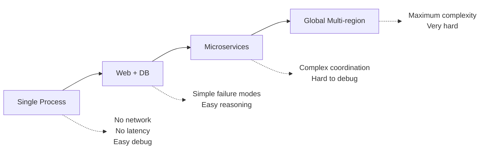
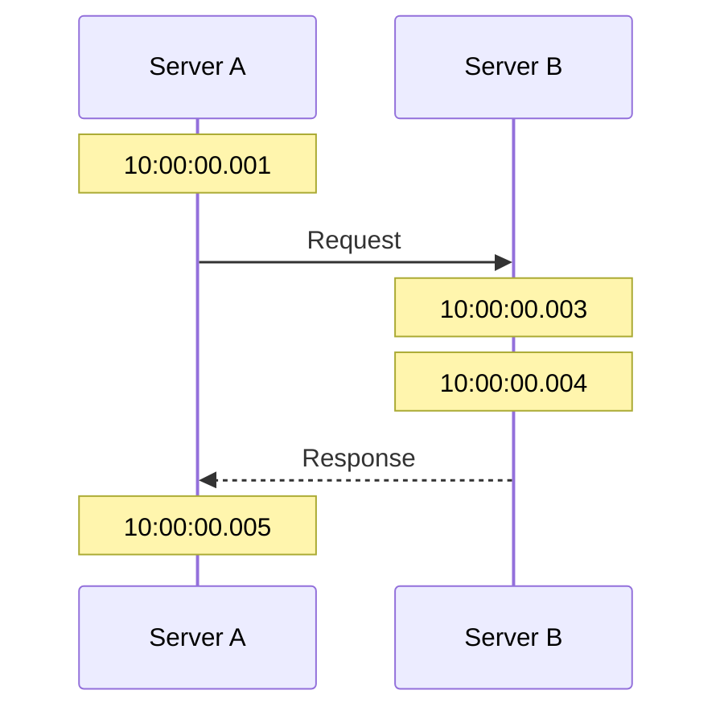
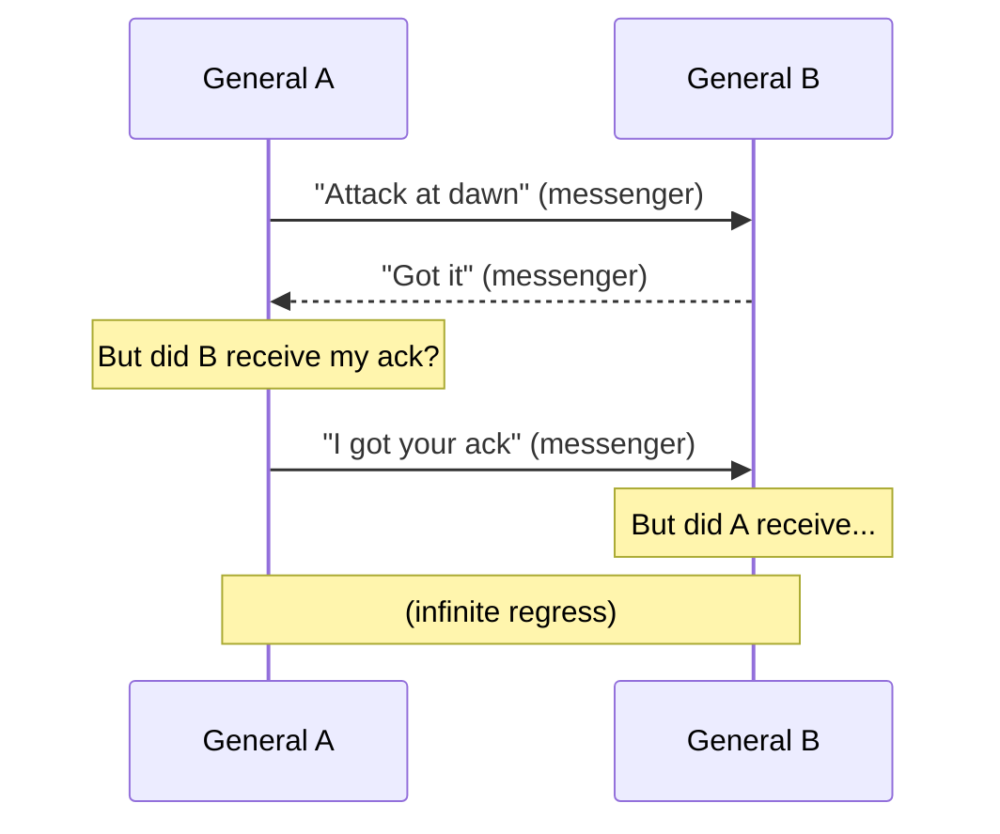
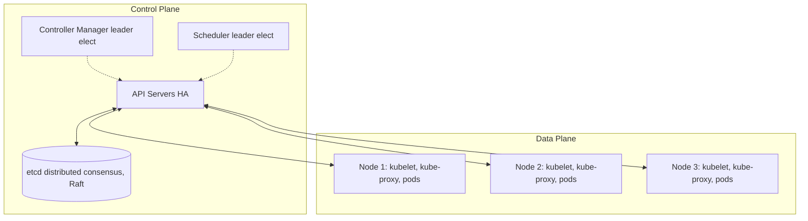

> **Complexity**: `[MEDIUM]`
>
> **Time to Complete**: 25-30 minutes
>
> **Prerequisites**: [Systems Thinking Track](/platform/foundations/systems-thinking/) (recommended)
>
> **Track**: Foundations

### What You'll Be Able to Do

After completing this module, you will be able to:

1. **Explain** the eight fallacies of distributed computing and identify where each manifests in real cloud-native architectures
2. **Analyze** a system's architecture to determine which components introduce distributed-system challenges (partial failure, network partitions, clock skew)
3. **Design** service boundaries that account for the inherent unreliability of network communication between components
4. **Evaluate** when a distributed architecture is justified versus when a simpler single-process design would be more reliable and maintainable

---

**February 28, 2017. Amazon Web Services experiences what would become one of the most costly outages in cloud computing history.**

A simple typo in a command to remove a small number of S3 servers accidentally removes a larger set of servers than intended. The servers being removed supported the S3 index and placement systems—the metadata layer that tracks where every object is stored.

**For the next 4 hours, S3 in US-East-1 was essentially offline.** But the real impact was just beginning. Hundreds of other AWS services depended on S3. Websites couldn't load images. Applications couldn't access configuration. CI/CD pipelines failed. The AWS status dashboard—itself hosted on S3—couldn't display that S3 was down.

The cascade revealed what most engineers knew but rarely confronted: **even the simplest web application is a distributed system**, with hidden dependencies, partial failures, and emergent behaviors that no single person fully understands.

**S&P 500 companies collectively lost an estimated $150 million during the outage.** And it all started because distributed systems don't behave like the single-machine programs most engineers learn to write.

This module teaches why distributed systems are fundamentally different—and why understanding their constraints is essential for building anything that scales.

---

## Why This Module Matters

Every modern system is distributed. The moment you have a web server talking to a database, you have a distributed system. The moment you deploy to the cloud, you're distributed across availability zones. The moment you scale beyond one machine, distribution becomes your reality.

But distributed systems don't behave like single machines. Things that were easy become hard. Things that were guaranteed become probabilistic. Assumptions that held for decades suddenly break. The sooner you understand why, the sooner you can design systems that actually work.

This module introduces the fundamental challenges of distributed systems—the laws of physics and logic that constrain what's possible, and the patterns that emerge when you can't escape them.

> **The Space Station Analogy**
>
> Imagine Mission Control in Houston talking to astronauts on the International Space Station. Messages take time to travel. Signals can be lost. The astronauts can't wait for permission before every action—they need autonomy. And Mission Control can't know the exact state of the station at any instant. Every distributed system faces the same challenges: latency, unreliability, and uncertainty about remote state.

---

## What You'll Learn

- What makes a system "distributed" (and why it matters)
- The fundamental challenges: latency, partial failure, no global clock
- The CAP theorem and what it really means
- Why distributed systems require different thinking
- How Kubernetes is a distributed system

---

## Part 1: Defining Distributed Systems

### 1.1 What is a Distributed System?

```text
DISTRIBUTED SYSTEM DEFINITION
═══════════════════════════════════════════════════════════════

A distributed system is one where:
- Components run on multiple networked computers
- Components coordinate by passing messages
- The system appears as a single coherent system to users

Leslie Lamport's definition:
"A distributed system is one in which the failure of a computer
you didn't even know existed can render your own computer unusable."

KEY PROPERTIES
─────────────────────────────────────────────────────────────
1. CONCURRENCY: Multiple things happen simultaneously
2. NO GLOBAL CLOCK: No single source of "now"
3. INDEPENDENT FAILURE: Parts can fail without others knowing
4. MESSAGE PASSING: Communication via network, not shared memory
```

### 1.2 Why Distribute?

```text
REASONS TO DISTRIBUTE
═══════════════════════════════════════════════════════════════

SCALABILITY
─────────────────────────────────────────────────────────────
One machine has limits. Need more capacity? Add more machines.

    Single server: 10,000 requests/sec max
    10 servers: 100,000 requests/sec
    100 servers: 1,000,000 requests/sec

AVAILABILITY
─────────────────────────────────────────────────────────────
One machine will fail. Multiple machines can cover for each other.

    Single server: Server dies → System dies
    Multiple servers: Server dies → Others handle load

LATENCY
─────────────────────────────────────────────────────────────
Physics limits speed. Put data closer to users.

    US user → US server: 20ms
    US user → Europe server: 100ms
    US user → Asia server: 200ms

ORGANIZATIONAL
─────────────────────────────────────────────────────────────
Different teams, different services, different deployment cycles.

    Monolith: One team, one deployment, everyone waits
    Microservices: Independent teams, independent deploys
```

### 1.3 The Distribution Spectrum



Most systems live in the middle—distributed enough to need the mental models, but not so distributed that nothing works.

> **Try This (2 minutes)**
>
> Think about a system you work with. Where does it fall on the spectrum?
>
> | Component | Runs Where | Communicates Via |
> |-----------|------------|------------------|
> | | | |
> | | | |
> | | | |
>
> Is it more distributed than you initially thought?

---

## Part 2: The Fundamental Challenges

### 2.1 Challenge #1: Latency

```text
LATENCY: THE SPEED OF LIGHT PROBLEM
═══════════════════════════════════════════════════════════════

In a single machine:
    Function call: ~1 nanosecond
    Memory access: ~100 nanoseconds

Across a network:
    Same datacenter: ~500 microseconds (500,000 ns)
    Cross-country: ~30 milliseconds (30,000,000 ns)
    Cross-ocean: ~100 milliseconds (100,000,000 ns)

IMPACT
─────────────────────────────────────────────────────────────
┌────────────────────────────────────────────────────────────┐
│                                                            │
│  Local call:     1 ns                                      │
│  Network call:   1,000,000 ns (1 ms)                      │
│                                                            │
│  That's 1,000,000x slower!                                │
│                                                            │
│  Design that works locally can be disastrous distributed. │
│                                                            │
│  Example: Loop with 100 database calls                    │
│    Local: 100 × 1ns = 100ns                               │
│    Network: 100 × 1ms = 100ms (user notices!)             │
│                                                            │
└────────────────────────────────────────────────────────────┘

LATENCY NUMBERS EVERY PROGRAMMER SHOULD KNOW
─────────────────────────────────────────────────────────────
L1 cache reference:                    0.5 ns
L2 cache reference:                      7 ns
Main memory reference:                 100 ns
SSD random read:                    16,000 ns   (16 μs)
Network round trip (same DC):      500,000 ns   (500 μs)
Disk seek:                       2,000,000 ns   (2 ms)
Network round trip (US→EU):    100,000,000 ns   (100 ms)
```

> **Stop and think**: If the speed of light is a hard physical limit on network latency, how can a global system like a Content Delivery Network (CDN) serve files to users worldwide in just a few milliseconds?

### 2.2 Challenge #2: Partial Failure

```text
PARTIAL FAILURE: THE UNRELIABILITY PROBLEM
═══════════════════════════════════════════════════════════════

In a single machine:
    Either the whole thing works, or the whole thing crashes.
    Failure is total and obvious.

In a distributed system:
    Part can fail while other parts continue.
    Failure can be partial, intermittent, or undetectable.

FAILURE MODES
─────────────────────────────────────────────────────────────
┌────────────────────────────────────────────────────────────┐
│                                                            │
│  CRASH FAILURE                                             │
│    Node stops responding entirely.                         │
│    At least you know it's dead.                           │
│                                                            │
│  OMISSION FAILURE                                          │
│    Messages lost. Did the server get my request?          │
│    Did it respond but I didn't receive?                   │
│                                                            │
│  TIMING FAILURE                                            │
│    Response came, but too slow. Did it timeout?           │
│    Did it complete? Is it still running?                  │
│                                                            │
│  BYZANTINE FAILURE                                         │
│    Component lies or behaves maliciously.                 │
│    Hardest to handle. Usually assume this won't happen.   │
│                                                            │
└────────────────────────────────────────────────────────────┘

THE FUNDAMENTAL UNCERTAINTY
─────────────────────────────────────────────────────────────
You send a request. No response. What happened?

    1. Request was lost in transit?
    2. Server crashed before processing?
    3. Server crashed after processing?
    4. Response was lost in transit?
    5. Server is just slow?

You cannot distinguish these cases from the client side.
This is fundamental. No protocol can solve it.
```

### 2.3 Challenge #3: No Global Clock



Which happened first? The request or the response?

Server A says: Request at 10:00:00.001, response at 10:00:00.005
Server B says: Request at 10:00:00.003, response at 10:00:00.004

Server B's clock is 2ms ahead. The timestamps are misleading.

**CONSEQUENCES**
- Can't use timestamps to order events across machines
- "Last write wins" requires agreeing on what "last" means
- Debugging is hard: logs from different servers don't align
- Need logical clocks (Lamport clocks, vector clocks) for ordering

> **War Story: The $12 Million Clock Skew Incident**
>
> **March 2018. A high-frequency trading firm discovers they've been losing money for months—not from bad trades, but from bad timestamps.**
>
> The firm operated trading servers in both New Jersey and Chicago. The servers used NTP to synchronize clocks, but NTP only guarantees accuracy within tens of milliseconds. The clocks had drifted 47ms apart.
>
> When a trade executed in Chicago triggered a hedge trade in New Jersey, the timestamps sometimes showed the hedge happening *before* the original trade. The reconciliation system, which used timestamps to order events, processed them wrong. Sometimes hedges were cancelled as "duplicate trades." Sometimes positions were calculated incorrectly.
>
> **Timeline of discovery:**
> - **Day 1**: Risk analyst notices P&L discrepancies in overnight reports
> - **Week 2**: Engineering traces problem to event ordering logic
> - **Week 3**: Clock drift identified as root cause
> - **Week 4**: Logical clocks implemented (Lamport timestamps)
> - **Month 2**: Full audit reveals $12 million in losses over 6 months
>
> **The fix**: The team replaced wall-clock ordering with Lamport timestamps. Every event now carries a logical clock value that increments with each operation. When server A sends a message to server B, it includes its clock value. Server B sets its clock to max(its_clock, received_clock) + 1. This guarantees that caused events always have higher timestamps than their causes—regardless of what the physical clocks say.
>
> **The lesson**: In distributed systems, "when" something happened is less important than "what caused what." Physical time is unreliable. Causal ordering is essential.

---

## Part 3: The CAP Theorem

### 3.1 Understanding CAP

```text
THE CAP THEOREM
═══════════════════════════════════════════════════════════════

In a distributed system, you can have at most TWO of:

    C - CONSISTENCY
        Every read receives the most recent write.
        All nodes see the same data at the same time.

    A - AVAILABILITY
        Every request receives a response.
        System is always operational.

    P - PARTITION TOLERANCE
        System continues operating despite network partitions.
        Messages between nodes can be lost or delayed.

THE CATCH
─────────────────────────────────────────────────────────────
Network partitions WILL happen. You don't get to choose.

So really, during a partition you choose between:
    CP: Consistent but unavailable during partition
    AP: Available but possibly inconsistent during partition

┌─────────────────────────────────────────────────────────────┐
│                                                             │
│     Normal operation: You can have all three!               │
│                                                             │
│     During partition: Choose C or A                         │
│                                                             │
│         CP: Reject requests to maintain consistency         │
│         AP: Accept requests, reconcile later                │
│                                                             │
└─────────────────────────────────────────────────────────────┘
```

### 3.2 CAP in Practice

```text
CAP TRADE-OFFS IN REAL SYSTEMS
═══════════════════════════════════════════════════════════════

CP SYSTEMS (Consistent, Partition-tolerant)
─────────────────────────────────────────────────────────────
During partition: Refuse some requests to maintain consistency

Examples:
    - Traditional RDBMS with synchronous replication
    - ZooKeeper
    - etcd (Kubernetes' brain)
    - MongoDB with majority write concern

Use when: Correctness matters more than availability
    - Financial transactions
    - Inventory systems
    - Coordination services

AP SYSTEMS (Available, Partition-tolerant)
─────────────────────────────────────────────────────────────
During partition: Accept requests, data may diverge

Examples:
    - Cassandra
    - DynamoDB (eventually consistent reads)
    - DNS
    - Caches

Use when: Availability matters more than immediate consistency
    - Shopping carts
    - Social media feeds
    - Metrics/logging

REALITY CHECK
─────────────────────────────────────────────────────────────
Most systems need BOTH consistency AND availability.
The choice is: which to sacrifice DURING a partition?

Partitions are rare but not rare enough to ignore.
Design for partition. Choose your trade-off deliberately.
```

### 3.3 Beyond CAP: PACELC

```text
PACELC: A MORE COMPLETE MODEL
═══════════════════════════════════════════════════════════════

CAP only talks about partitions. But what about normal operation?

PACELC: If Partition, then Availability vs Consistency,
        Else, Latency vs Consistency

┌─────────────────────────────────────────────────────────────┐
│                                                             │
│   During Partition (P):                                     │
│       Choose A (availability) or C (consistency)            │
│                                                             │
│   Else (normal operation):                                  │
│       Choose L (latency) or C (consistency)                 │
│                                                             │
│   PA/EL: Available during partition, low latency normally   │
│          (Cassandra, DynamoDB)                              │
│                                                             │
│   PC/EC: Consistent during partition, consistent normally   │
│          (Traditional RDBMS, etcd)                          │
│                                                             │
│   PA/EC: Available during partition, consistent normally    │
│          (Some configs of MongoDB)                          │
│                                                             │
└─────────────────────────────────────────────────────────────┘

This model acknowledges that even in normal operation,
you trade latency for consistency (synchronous replication)
or consistency for latency (asynchronous replication).
```

> **Try This (3 minutes)**
>
> For each scenario, which trade-off makes sense?
>
> | Scenario | During Partition | Why |
> |----------|------------------|-----|
> | Bank account balance | CP | Can't show wrong balance |
> | Social media likes count | AP | |
> | Kubernetes pod state | | |
> | Shopping cart | | |
> | DNS | | |

---

## Part 4: Distributed System Patterns

### 4.1 The Two Generals Problem



**IMPOSSIBILITY**
There is NO protocol that guarantees agreement if messages can be lost. This is proven mathematically impossible.

**IMPLICATIONS FOR DISTRIBUTED SYSTEMS**
You cannot guarantee that two nodes agree on anything if the network is unreliable. The best you can do:
- Increase probability (retries, acknowledgments)
- Accept uncertainty (eventual consistency)
- Use consensus protocols (Paxos, Raft) when possible

### 4.2 The Byzantine Generals Problem

```text
BYZANTINE GENERALS PROBLEM
═══════════════════════════════════════════════════════════════

Same as Two Generals, but worse:
    - Some generals might be traitors
    - Traitors send conflicting messages to different generals
    - Loyal generals must still reach agreement

THE CHALLENGE
─────────────────────────────────────────────────────────────
    General A: "Attack!"
    General B: "Attack!" (traitor, tells C "Retreat")
    General C: "Attack!"

    C receives: "Attack" from A, "Retreat" from B
    A receives: "Attack" from B (B lies), "Attack" from C

    How can A and C agree despite B's lies?

SOLUTION REQUIREMENTS
─────────────────────────────────────────────────────────────
To tolerate f Byzantine (lying) nodes, you need 3f + 1 total.

    1 traitor → need 4 generals
    2 traitors → need 7 generals

This is expensive! Most systems assume no Byzantine failures.

WHERE IT MATTERS
─────────────────────────────────────────────────────────────
- Blockchain (trustless networks)
- Safety-critical systems (aviation, medical)
- Systems where nodes might be compromised

Most internal systems assume nodes are honest but buggy.
They handle crash failures, not Byzantine failures.
```

### 4.3 Idempotency

```text
IDEMPOTENCY: SAFE TO RETRY
═══════════════════════════════════════════════════════════════

An operation is IDEMPOTENT if doing it multiple times
has the same effect as doing it once.

WHY IT MATTERS
─────────────────────────────────────────────────────────────
Request sent. Timeout. Did it succeed?

    If NOT idempotent: Dangerous to retry
        "Transfer $100" → Retry → $200 transferred!

    If idempotent: Safe to retry
        "Set balance to $100" → Retry → Still $100

IDEMPOTENT OPERATIONS
─────────────────────────────────────────────────────────────
✓ SET x = 5           (result is always 5)
✓ DELETE user 123     (can't delete twice)
✓ PUT /users/123      (creates or replaces)
✗ INCREMENT x         (adds more each time)
✗ POST /users         (creates new each time)
✗ TRANSFER $100       (transfers more each time)

MAKING OPERATIONS IDEMPOTENT
─────────────────────────────────────────────────────────────
Add a unique request ID. Server tracks completed requests.

    Client: "Transfer $100, request_id=abc123"
    Server: Checks if abc123 already processed
            If yes: Return cached result
            If no: Process, save result, return

    Client timeout → Retry with same abc123 → Safe!
```

> **Pause and predict**: If a network partition occurs between a mobile app and its backend API, what is the safest failure mode for a "transfer funds" operation?

---

## Part 5: Kubernetes as a Distributed System

### 5.1 Kubernetes Architecture



### 5.2 How Kubernetes Handles Distribution

```text
KUBERNETES DISTRIBUTED PATTERNS
═══════════════════════════════════════════════════════════════

CONSENSUS (etcd)
─────────────────────────────────────────────────────────────
etcd uses Raft consensus for strong consistency.
All cluster state lives in etcd.
Writes require majority agreement (quorum).

    3 etcd nodes: Can lose 1
    5 etcd nodes: Can lose 2

LEADER ELECTION
─────────────────────────────────────────────────────────────
Controller Manager and Scheduler use leader election.
Only one active at a time (avoid duplicate work).
If leader fails, another takes over.

    # Check current leader
    kubectl get leases -n kube-system

EVENTUAL CONSISTENCY (Controllers)
─────────────────────────────────────────────────────────────
Controllers reconcile desired vs actual state.
They're eventually consistent—changes propagate over time.

    You: "I want 3 replicas"
    Controller: Sees 2, creates 1
    Repeat until actual = desired

WATCH PATTERN
─────────────────────────────────────────────────────────────
Components watch etcd for changes, not poll.
Reduces load, provides near-real-time updates.

    kubelet watches for pod assignments
    Controller watches for resource changes
```

### 5.3 Kubernetes Failure Modes

```text
KUBERNETES FAILURE SCENARIOS
═══════════════════════════════════════════════════════════════

NODE FAILURE
─────────────────────────────────────────────────────────────
kubelet stops sending heartbeats.
Node marked "NotReady" after timeout (default 40s).
Pods rescheduled after tolerationSeconds (default 300s).

    Timeline:
    0s: Node dies
    40s: Node marked NotReady
    300s: Pods evicted, rescheduled elsewhere

ETCD QUORUM LOSS
─────────────────────────────────────────────────────────────
If majority of etcd nodes fail, cluster becomes read-only.
Existing pods keep running (kubelet cached state).
No new pods, no updates until quorum restored.

    3-node etcd: Lose 2 → Quorum lost
    5-node etcd: Lose 3 → Quorum lost

NETWORK PARTITION
─────────────────────────────────────────────────────────────
Nodes can't reach control plane.
Existing pods keep running (autonomous kubelet).
No new scheduling until connectivity restored.

Split-brain scenario:
    Partition A: Some nodes + some etcd
    Partition B: Other nodes + other etcd

    If neither has etcd quorum: Both read-only
    Kubernetes chooses consistency over availability (CP)

API SERVER FAILURE
─────────────────────────────────────────────────────────────
With multiple API servers, load balancer routes around failure.
kubectl commands may fail temporarily.
Pods keep running (kubelet operates independently).
```

> **Pause and predict**: If a network partition isolates a Kubernetes worker node from the control plane, what do you think happens to the pods running on that node? Will they be terminated, continue running, or pause?

---

## Did You Know?

- **The speed of light** limits distributed systems. A message from New York to London takes at least 28ms—the time light needs to travel through fiber. You can't engineer around physics.

- **Google's Spanner** uses atomic clocks and GPS to synchronize time across datacenters to within a few milliseconds. It's one of the few systems that can offer both strong consistency and global distribution.

- **The term "Byzantine fault"** comes from the Byzantine Generals Problem, named for the Byzantine Empire's reputation for complex political intrigue. In distributed systems, a Byzantine node is one that might behave arbitrarily—including lying.

- **Leslie Lamport's "Time, Clocks, and the Ordering of Events"** paper (1978) introduced logical clocks and is one of the most cited papers in computer science. Lamport later won the Turing Award partly for this work. The key insight: you don't need real time to order events—you just need to track causality ("happened before" relationships).

---

## Common Mistakes

| Mistake | Problem | Solution |
|---------|---------|----------|
| Ignoring network latency | Design works locally, fails distributed | Measure latency, batch requests |
| Assuming networks are reliable | No retry logic, no timeouts | Implement timeouts, retries, circuit breakers |
| Using wall-clock time for ordering | Clock skew causes wrong order | Use logical clocks or version vectors |
| Not designing for partial failure | One failure takes down everything | Bulkheads, graceful degradation |
| Synchronous everything | Latency compounds, cascade failures | Async where possible, queues |
| Ignoring CAP trade-offs | Surprised by behavior during partition | Choose trade-offs explicitly |

---

## Quiz

1. **You are designing a global e-commerce platform. During Black Friday, a database node in the EU region slows down, causing the US web servers to report timeout errors. Which fundamental challenge of distributed systems is primarily responsible for the difficulty in diagnosing whether the EU database actually processed the orders?**
   <details>
   <summary>Answer</summary>

   This scenario illustrates the challenge of partial failure and the fundamental uncertainty it creates. In a distributed system, a timeout or lost connection doesn't tell you what actually happened on the remote server. The EU database might have crashed before receiving the request, processed the request but failed to send the response, or it might just be running very slowly due to the high Black Friday load. Because the US web servers cannot distinguish between these states, they cannot safely assume the order failed without risking duplicate charges. This is why distributed systems require mechanisms like idempotent operations and unique request IDs to safely handle retries when partial failures occur.
   </details>

2. **A hospital's patient records system replicates data across three different buildings. A construction accident severs the fiber link to Building C, isolating it from the rest of the network. Doctors in Building C urgently need to update a patient's allergy information. Based on the CAP theorem, how should the system be designed to handle this partition, and why?**
   <details>
   <summary>Answer</summary>

   In this life-critical healthcare scenario, the system should be designed to prioritize Consistency over Availability (CP) during a network partition. If the isolated Building C accepts the allergy update while disconnected, it risks introducing conflicting medical records once the partition heals, which could lead to fatal medical errors if doctors in other buildings see outdated information. By choosing CP, the system would refuse the write request in Building C until connectivity is restored, ensuring that there is only ever one true, globally consistent state of the patient's records. While it is frustrating for the doctors to be unable to update the system immediately, preventing contradictory medical data is vastly more important than keeping the update function available at all times.
   </details>

3. **A financial trading application relies on system timestamps to determine the exact order of stock trades. Server A processes Trade X at 14:00:00.005 according to its clock. Server B processes Trade Y at 14:00:00.004 according to its clock. Later analysis proves Trade X actually triggered Trade Y. What distributed systems concept explains this discrepancy, and how should the system be redesigned?**
   <details>
   <summary>Answer</summary>

   This discrepancy is caused by the lack of a global clock and the inevitable clock skew that occurs between independent machines in a distributed system. Even if Server A and Server B synchronize via NTP, their physical clocks will drift apart by several milliseconds, making it impossible to rely on wall-clock time to determine the true sequence of events. Because Trade X caused Trade Y, the system must capture this causal relationship rather than relying on absolute time. The application should be redesigned to use logical clocks, such as Lamport timestamps or vector clocks, which increment a logical counter with every operation and pass that counter along with messages to guarantee that a cause always has a lower logical timestamp than its effect.
   </details>

4. **You deploy a new version of your application using `kubectl set image`. The API server accepts the request, but before the pods can be updated, the network connection between the control plane and the worker nodes goes down. What happens to the existing running pods, and which Kubernetes distributed system pattern does this demonstrate?**
   <details>
   <summary>Answer</summary>

   When the network partition occurs, the worker nodes are isolated from the control plane, but the `kubelet` on each node continues to operate autonomously using its locally cached state. The existing pods will continue running without interruption, continuing to serve traffic as long as they remain healthy. This demonstrates how Kubernetes embraces eventual consistency and partial failure tolerance by decoupling the control plane's desired state from the data plane's actual state. Once the partition heals, the controllers will reconnect, notice the discrepancy between the desired new image and the running pods, and resume rolling out the update until the cluster achieves the new desired state.
   </details>

5. **A microservice architecture processes user registrations by making 50 sequential database calls to various verification tables. Each database call takes 2ms of network transit time. Users are complaining that registration feels sluggish. What is the absolute minimum latency for a user request, and what architectural changes could solve this?**
   <details>
   <summary>Answer</summary>

   The absolute minimum latency for this request is 100ms (50 calls × 2ms per call), and this is before accounting for any actual processing time on the database or application servers. This compounding latency is a direct consequence of the physical limits of network communication. To improve this, the architecture needs to minimize network round trips by employing techniques like query batching, where the 50 calls are combined into a single payload. Alternatively, the application could use parallelization if the queries are independent, caching for frequently accessed verification data, or data denormalization to retrieve all necessary information in a single database lookup.
   </details>

6. **An automated billing service sends a "charge customer $50" request to a payment gateway but receives a network timeout error after 5 seconds instead of an acknowledgment. List the possible states of the transaction on the payment gateway, and explain why this uncertainty dictates how the billing service must be designed.**
   <details>
   <summary>Answer</summary>

   The transaction could be in several states: the request might have been lost in transit and never reached the gateway, the gateway might have crashed before processing it, the gateway might be processing it very slowly, or the gateway might have successfully processed the charge but the success response was lost in transit back to the billing service. This uncertainty is a fundamental property of distributed systems, famously illustrated by the Two Generals Problem, meaning the billing service can never definitively know the outcome from the timeout alone. Because of this, the billing service cannot simply retry the 'charge $50' command, as it risks double-charging the customer if the initial request actually succeeded. The system must be designed using idempotent operations, such as attaching a unique idempotency key (e.g., a transaction ID) to the request, allowing the payment gateway to recognize and safely ignore duplicate retry attempts.
   </details>

7. **Your company operates a critical Kubernetes cluster with a 5-node etcd cluster spread across three availability zones. During a severe storm, power is lost to two of the availability zones, taking three etcd nodes offline. What is the immediate impact on the Kubernetes cluster, and what actions can cluster administrators take?**
   <details>
   <summary>Answer</summary>

   Because the etcd cluster requires a majority quorum to function—which is 3 nodes for a 5-node cluster (floor(5/2) + 1)—losing three nodes means the cluster has lost quorum and can no longer agree on the state. As a result, etcd enters a read-only mode to protect data integrity, meaning the Kubernetes API server will reject any write requests, preventing the creation of new pods, deployments, or configuration changes. However, the existing pods on the surviving worker nodes will continue to run and serve traffic because the local kubelets operate autonomously. Cluster administrators cannot simply wait; they must either restore power to the failed nodes to regain quorum or perform a disaster recovery procedure by restoring an etcd snapshot to a newly provisioned cluster.
   </details>

8. **A global streaming platform maintains a "currently watching" counter for live events. During a network partition between the US and EU datacenters, the US region registers 10,000 new viewers and the EU region registers 5,000 new viewers. When the partition heals, the system automatically merges these into a total of 15,000 viewers. What CAP theorem trade-off did this system make, and why is it appropriate for this specific use case?**
   <details>
   <summary>Answer</summary>

   This system explicitly chose Availability over Consistency (AP) during the network partition. By allowing both the US and EU datacenters to continue accepting viewer updates independently, the platform ensured the counter feature remained available to users, even though the total count was temporarily inconsistent and globally inaccurate. Once the network partition healed, the system used a Conflict-free Replicated Data Type (CRDT), such as a grow-only counter, to mathematically merge the disparate states and achieve eventual consistency. This trade-off is highly appropriate for a 'currently watching' counter because users prioritize seeing the system work smoothly over having perfectly instantaneous global accuracy, whereas a CP approach would have frustratingly disabled the counter for half the world.
   </details>

---

## Hands-On Exercise

**Task**: Explore distributed system behavior in Kubernetes.

**Part 1: Observe Latency (10 minutes)**

Run a pod and measure API server latency:

```bash
# Create a test pod
kubectl run latency-test --image=busybox --command -- sleep 3600

# Time various operations
time kubectl get pod latency-test
time kubectl get pod latency-test -o yaml
time kubectl describe pod latency-test

# Compare to local operations
time cat /etc/hostname
```

Record your findings:

| Operation | Time | Notes |
|-----------|------|-------|
| kubectl get pod | | |
| kubectl describe | | |
| Local file read | | |

**Part 2: Observe Eventual Consistency (10 minutes)**

Watch a deployment scale:

```bash
# Create deployment
kubectl create deployment scale-test --image=nginx --replicas=1

# In terminal 1: Watch pods
kubectl get pods -w

# In terminal 2: Scale up rapidly
kubectl scale deployment scale-test --replicas=10

# Observe:
# - How long until all pods are Running?
# - Do pods appear in order?
# - What intermediate states do you see?
```

**Part 3: Simulate Partial Failure (10 minutes)**

If using kind or minikube with multiple nodes:

```bash
# List nodes
kubectl get nodes

# Cordon a node (no new pods)
kubectl cordon <node-name>

# Watch what happens to pods
kubectl get pods -o wide -w

# Uncordon
kubectl uncordon <node-name>
```

**Success Criteria**:
- [ ] Measured API server latency vs local operations
- [ ] Observed eventual consistency during scaling
- [ ] Understood intermediate states during changes
- [ ] (Optional) Observed behavior during node failure

---

## Further Reading

- **"Designing Data-Intensive Applications"** - Martin Kleppmann. The definitive guide to distributed systems concepts. Chapter 8 covers these fundamentals.

- **"Distributed Systems for Fun and Profit"** - Mikito Takada. Free online book covering distributed systems fundamentals.

- **"Time, Clocks, and the Ordering of Events in a Distributed System"** - Leslie Lamport. The foundational paper on logical clocks.

---

## Key Takeaways

Before moving on, ensure you understand:

- [ ] **The three fundamental challenges**: Latency (network is slow), partial failure (parts fail independently), no global clock (can't trust timestamps)
- [ ] **CAP theorem reality**: During a network partition, you choose consistency OR availability—not both. Most systems need both, so you choose which to sacrifice during failures
- [ ] **PACELC extension**: Even without partitions, you trade latency for consistency. Synchronous replication = consistent but slow. Async = fast but potentially stale
- [ ] **The Two Generals Problem**: You cannot guarantee agreement over unreliable networks. This is mathematically proven impossible
- [ ] **Idempotency is essential**: Design operations to be safe to retry. Use unique request IDs to detect duplicates
- [ ] **Kubernetes is CP**: It chooses consistency over availability during partitions. etcd requires quorum; without it, the cluster becomes read-only
- [ ] **Logical clocks > wall clocks**: Don't use timestamps to order events. Use Lamport clocks or vector clocks to track causality
- [ ] **Distribution is a spectrum**: A web server + database is distributed. Understanding where your system falls helps choose appropriate patterns

---

## Next Module

[Module 5.2: Consensus and Coordination](../module-5.2-consensus-and-coordination/) - How distributed systems agree on anything, and why it's so hard.