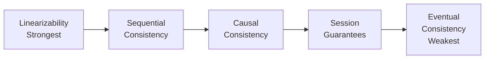
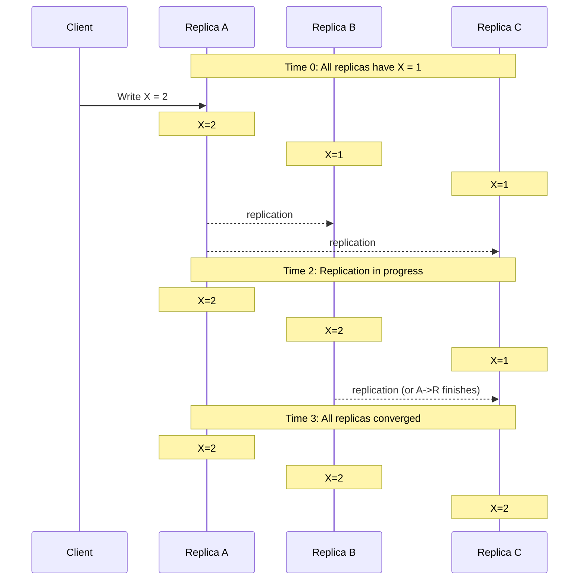
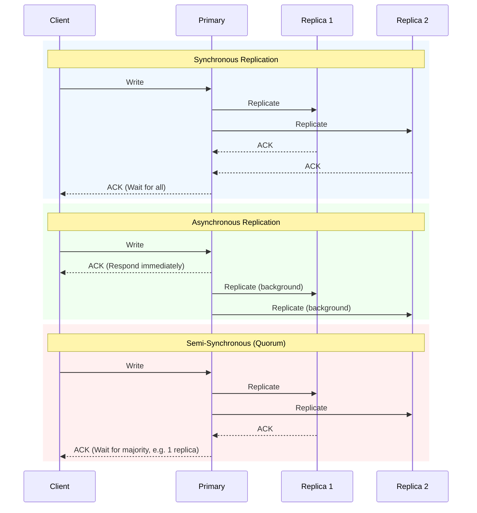
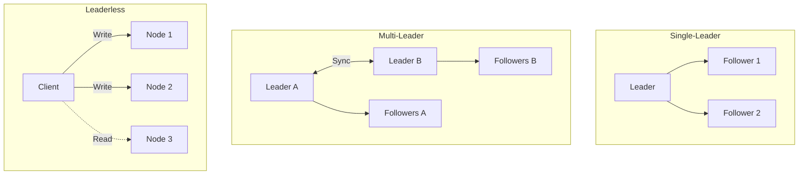
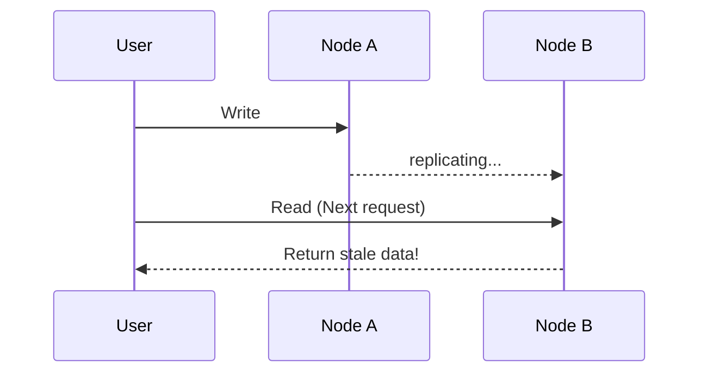

> **Complexity**: `[MEDIUM]`
>
> **Time to Complete**: 30-35 minutes
>
> **Prerequisites**: [Module 5.2: Consensus and Coordination](../module-5.2-consensus-and-coordination/)
>
> **Track**: Foundations

### What You'll Be Able to Do

After completing this module, you will be able to:

1. **Evaluate** the CAP Theorem trade-offs for a given distributed service and justify choosing eventual consistency over strong consistency (or vice versa).
2. **Design** eventually consistent data flows using conflict resolution strategies (last-write-wins, vector clocks, CRDTs) appropriate for the data model.
3. **Implement** read-your-writes and causal consistency guarantees on top of eventually consistent datastores when user experience demands it.
4. **Analyze** consistency anomalies in production to determine whether they indicate a design flaw or acceptable convergence delay.

---

## Why This Module Matters

December 26, 2012. Amazon's retail website experiences intermittent failures during the busiest shopping week of the year—and the root cause is surprisingly simple: they chose the wrong consistency model for their inventory system. Amazon's engineers had originally designed a strongly consistent inventory system. Every purchase required immediate confirmation from all database replicas before the customer saw "Order Confirmed." This worked perfectly at normal load, providing a flawless, real-time view of stock levels across the entire global infrastructure.

But on the day after Christmas, with millions of gift card recipients flooding the site, the synchronous replication became a severe bottleneck. Database replicas could not keep up with the distributed lock contention. Write latency spiked to over thirty seconds, and shopping carts started timing out. For forty-nine minutes, an estimated $66,000 per minute in potential revenue was lost—not because servers were offline, but because the system was waiting for perfect consistency that customers did not actually need.

The irony of the situation was profound: customers do not need to know the exact, global inventory count at the millisecond they click buy. They only need to know if they are permitted to purchase the item. Amazon's post-incident analysis led to a fundamental architecture shift. They mandated the use of eventual consistency everywhere possible, reserving strong consistency strictly for the final financial transaction. This module explores eventual consistency: what it means, when to use it, how to design for it, and the patterns that make it practical in high-scale environments.

---

## Part 1: The CAP Theorem and the Consistency Spectrum

### 1.1 The CAP Theorem Defined

To understand eventual consistency, we must first explicitly define the **CAP Theorem**. Formulated by computer scientist Eric Brewer, the CAP Theorem dictates that any distributed data store can provide only two of the following three guarantees simultaneously:

1. **Consistency (C)**: Every read receives the most recent write or an error. In a perfectly consistent system, all nodes see the exact same data at the exact same time.
2. **Availability (A)**: Every request receives a non-error response, regardless of the individual health of the nodes. However, there is no guarantee that the response contains the most recent write.
3. **Partition Tolerance (P)**: The system continues to operate despite an arbitrary number of messages being dropped or delayed by the network between nodes.

In modern distributed architectures, network partitions are inevitable. Hardware fails, connections drop, and latency spikes. Therefore, Partition Tolerance is not optional; it is a physical reality of the network. This forces architects to choose between Consistency and Availability during a partition:
- Choosing **CP (Consistency + Partition Tolerance)** means shutting down nodes that cannot synchronize, thereby compromising availability to prevent stale reads.
- Choosing **AP (Availability + Partition Tolerance)** means allowing nodes to serve potentially stale data, thereby compromising strict consistency to keep the system online.

Eventual consistency is the deliberate architectural choice of Availability over strict Consistency.

### 1.2 The Consistency Spectrum

Consistency is not a binary choice between "perfect" and "broken." It exists on a spectrum of guarantees provided by the distributed system.



- **Linearizability (Strongest)**: Operations appear to execute atomically at a single point in time. All clients see operations in real-time order. Systems like etcd and Google Spanner provide this, but at the cost of high latency and reduced availability during network partitions.
- **Sequential Consistency**: Operations appear in some total order consistent with the program order. The real-time aspect is relaxed, but every client agrees on the sequence of events.
- **Causal Consistency**: Causally related operations are seen in order. Concurrent operations may be seen in any order. If writing Y depends on reading X, everyone who sees Y must have also seen X.
- **Session Consistency**: Within a single user session, a client sees a consistent view of the database. This provides guarantees like read-your-writes and monotonic reads.
- **Eventual Consistency (Weakest)**: Only guarantees eventual convergence. There are no ordering guarantees for concurrent operations. This offers the maximum availability and the lowest possible latency.

---

## Part 2: Understanding Eventual Consistency

### 2.1 Defining Eventual Convergence

**Eventual Consistency** is formally defined as: *"If no new updates are made to a given data item, eventually all accesses to that item will return the last updated value."*

The key properties are:
1. **Eventual Convergence**: All replicas will eventually reach the identical state. 
2. **No Temporal Guarantee**: There is no mathematical bound on how long convergence takes. It could be milliseconds under normal conditions, or minutes during a severe network partition.
3. **Stale Reads**: Clients may read old values during the propagation phase. Two different clients querying two different replicas simultaneously might see entirely different data.



> **Stop and think**: If eventual consistency means data can be stale, how long is "eventually"? What factors might delay convergence in a real network?

### 2.2 Trade-offs of Eventual Consistency

Opting for eventual consistency drastically changes the performance profile of your application.

**Advantages:**
- **Lower Latency**: Writes can be acknowledged immediately by a single node without waiting for network coordination.
- **Higher Availability**: The system can continue accepting reads and writes even if the majority of the network is partitioned.
- **Scalability**: Nodes can operate highly independently, making horizontal scaling much simpler.

**Disadvantages:**
- **Application Complexity**: Developers must write code that gracefully handles stale data and unexpected state transitions.
- **Conflict Resolution**: Because nodes accept writes independently, concurrent updates to the same record will create data conflicts that must be programmatically resolved.

---

## Part 3: Replication Strategies

### 3.1 Synchronous vs Asynchronous Replication

How data moves between nodes defines the consistency boundary of the system.



> **Pause and predict**: If you use asynchronous replication and the primary node crashes before replicating to followers, what happens to the most recent writes?

- **Synchronous**: The write blocks until all replicas acknowledge the update. This guarantees strong consistency but introduces high latency. If one replica is slow, the entire system slows down.
- **Asynchronous**: The write returns success the moment the primary node persists the data. This provides ultra-low latency, but if the primary fails before background replication occurs, data is permanently lost.
- **Semi-Synchronous (Quorum)**: The write blocks until a specific subset (usually a majority) of nodes acknowledge the update. This offers a tunable middle ground between latency and durability.

### 3.2 Topologies: Leader and Leaderless

Replication can be organized into different architectural topologies, each handling conflicts differently.



- **Single-Leader**: All writes route to one primary node. This simplifies conflict resolution (the leader dictates the order of operations) but creates a severe bottleneck for write-heavy workloads.
- **Multi-Leader**: Multiple nodes can accept writes, often deployed across different geographic regions to minimize latency. This requires complex bidirectional synchronization and guaranteed conflict resolution logic, as two regions might update the same record simultaneously.
- **Leaderless**: Any node can accept a write. Clients typically write to multiple nodes simultaneously and read from multiple nodes simultaneously. Conflicts are resolved at read-time by the client or a coordinating proxy.

### 3.3 Consistency Tuning and Quorums

In quorum-based systems (like Cassandra or DynamoDB), consistency is tunable on a per-request basis using three variables:
- **N**: Total number of replicas storing the data.
- **W**: Write quorum (number of nodes that must acknowledge a write).
- **R**: Read quorum (number of nodes that must respond to a read).

```mermaid
flowchart LR
    subgraph Strong Consistency W+R > N
        W[Write] --> A1[Node A]
        W --> B1[Node B]
        A1 -.->|overlap| R[Read]
        B1 -.-> R
    end
    subgraph Eventual Consistency W+R <= N
        W2[Write] --> A2[Node A]
        B2[Node B] -.->|no overlap| R2[Read]
    end
```

To guarantee strong consistency, you must ensure that read and write operations always overlap. The formula is `W + R > N`. If you write to 2 out of 3 nodes, and read from 2 out of 3 nodes, physics guarantees that at least one node in your read group possesses the latest write.

Setting `W + R <= N` results in Eventual Consistency. This is faster and more fault-tolerant, but allows stale reads if the read hits the nodes that missed the write.

---

## Part 4: Conflict Resolution and Vector Clocks

### 4.1 The Inevitability of Conflicts

When availability is prioritized, conflicts are unavoidable. They primarily occur due to:
1. **Concurrent Writes**: Two users modify the same data attribute at the exact same millisecond.
2. **Network Partitions**: A connection severs between Data Center A and Data Center B. Both centers continue accepting localized writes. When the connection heals, the divergent datasets must be reconciled.
3. **Offline Mode**: A mobile application allows local edits while in an airplane. Upon reconnecting, those edits conflict with server-side changes made by other users.

> **Pause and predict**: If a system uses "Last-Write-Wins" (LWW) based on timestamps, what happens if two servers have their system clocks out of sync by 5 minutes?

### 4.2 Conflict Resolution Strategies

When divergent data merges, the system must decide which data survives.

- **Last-Write-Wins (LWW)**: The system discards all updates except the one with the highest wall-clock timestamp. It is simple but highly prone to data loss, especially if servers suffer from clock drift.
- **Merge Functions**: The system provides conflicting values to custom business logic. For example, merging two shopping cart arrays by taking the union of both lists.
- **Operational Transformation (OT)**: The system mathematically transforms operations based on concurrent state changes. This is heavily utilized in collaborative text editors to adjust character index insertions dynamically.

### 4.3 Version Vectors

To reliably detect conflicts without relying on fragile system clocks, distributed databases use **Version Vectors**. A version vector is an array of counters, maintaining a specific index for every node in the cluster.

When Node A updates a record, it increments its own counter: `[NodeA: 1, NodeB: 0]`.
When Node B independently updates the same record, it increments its counter: `[NodeA: 0, NodeB: 1]`.

When these nodes synchronize, the system compares the vectors. If one vector has equal or higher values across every single node index, it strictly dominates, meaning it is a newer revision. However, if the vectors show independent increments (Node A is higher in its slot, Node B is higher in its slot), the system mathematically proves a concurrent write occurred. A conflict is flagged for programmatic resolution.

### 4.4 War Story: The $8.2 Million Shopping Cart Bug

**Black Friday 2018. A major electronics retailer discovers their shopping carts are "eating" high-value items—and the timing couldn't be worse.**

The company had implemented eventually consistent shopping carts using last-write-wins (LWW) conflict resolution. The theory was sound: shopping carts are a classic eventual consistency use case. But the implementation had a fatal flaw.

**The bug**: When a user added an item on their phone, then added a different item on their laptop before the phone's write replicated, the laptop's write included only its local cart state. Last-write-wins meant the phone's item disappeared.

**Timeline of the disaster:**
- **Wednesday before Black Friday**: QA notices occasional "missing item" reports but can't reproduce.
- **Black Friday 6:00 AM**: Doors open, traffic spikes 40x normal.
- **Black Friday 8:15 AM**: Customer complaints surge—"I added a TV but it's gone".
- **Black Friday 9:00 AM**: Engineering traces bug to LWW conflict resolution.
- **Black Friday 10:30 AM**: Hotfix deployed—all cart writes now merge (union) instead of replace.
- **Black Friday 6:00 PM**: Final tally: 127,000 carts affected, 23,000 abandoned purchases.

**The cost:**
- $4.8 million in lost sales (abandoned carts with high-value items).
- $2.1 million in emergency discounts to affected customers.
- $1.3 million in overtime engineering and customer service.

**The fix**: The team replaced their cart data structure with a CRDT-style design:
```javascript
// Before: Single value, LWW
cart = {items: ["tv", "laptop"]}  
// After: OR-Set style, merges correctly
cart = {
  adds: {"tv": uuid1, "laptop": uuid2},
  removes: {}
}  
```

**The lesson**: Eventual consistency requires thinking about conflict resolution at design time, not after the bug reports come in. "Last-write-wins" is almost never what you actually want for user data.

---

## Part 5: Practical Consistency Patterns and CRDTs

### 5.1 Read-Your-Writes Guarantees

Even in an eventually consistent architecture, the minimum acceptable baseline for user experience is often "Read-Your-Writes." If a user updates their profile and refreshes the page, they expect to see the new data immediately, regardless of replication lag.



**Implementation Solutions:**
1. **Sticky Sessions**: Load balancers route all requests from a specific user to the exact same node that processed their writes. 
2. **Version-Based Reads**: The client application remembers the version number of its last write. Subsequent read requests include an "at least version V" header. If the serving node is lagging, it blocks the read until background replication catches up to version V.

### 5.2 Monotonic Reads

Monotonic reads guarantee that once a user has observed a specific state of the system, they will never observe an older, stale state on subsequent requests. Time must never appear to go backwards.

> **Stop and think**: How would a jarring "rewind in state" (like seeing a deleted item reappear temporarily) affect user trust in an application?

Achieving this typically requires enforcing session affinity or passing high-watermark version tokens in client cookies, ensuring the backend rejects any read operation from a node trailing the client's known timeline.

### 5.3 Causal Consistency

Causal consistency ensures that operations logically dependent on one another are ordered correctly across all replicas. For example, if Alice posts "I got a promotion!" and Bob comments "Congratulations!", Bob's comment has a causal dependency on Alice's post. 

Without causal consistency tracking, replication lag could cause a third user to see the comment before the original post arrives. To prevent this, data payloads include dependency arrays. A replica receiving Bob's comment will hold it in a suppressed queue until Alice's post successfully replicates locally, preserving logical sanity for end users.

### 5.4 Conflict-Free Replicated Data Types (CRDTs)

**Conflict-Free Replicated Data Types (CRDTs)** are specialized data structures mathematically guaranteed to merge seamlessly across distributed nodes without human intervention or data loss. They rely on operations being commutative (order does not matter), associative (grouping does not matter), and idempotent (repeating the operation is safe).

**Common CRDT Implementations:**
- **G-Counter (Grow-only counter)**: Every node maintains its own local counter. To read the total value, the system sums the mathematical `max()` of all individual node counters. No increments are ever lost during concurrent updates.
- **PN-Counter (Positive-Negative counter)**: Consists of two internal G-Counters—one tracking increments, one tracking decrements. The true value is the total increments minus the total decrements.
- **OR-Set (Observed-Remove set)**: Allows adding and removing items continuously. Every addition is tagged with a unique cryptographic UUID. Removing an item means tombstoning its specific UUID. This allows nodes to deterministically resolve concurrent adds and removes of the same item name.

---

## Did You Know?

- Amazon's shopping cart was one of the first famous eventually consistent systems. Their 2007 Dynamo paper showed how eventual consistency enables high availability and became the blueprint for Cassandra, Riak, and DynamoDB.
- Conflict-Free Replicated Data Types (CRDTs) were independently discovered multiple times. The mathematical foundations existed long before distributed systems, but applying them directly to database replication was a major breakthrough formalized in 2011.
- The global Domain Name System (DNS) is eventually consistent by design. When you update a DNS record, it can take up to 48 hours for the Time-To-Live (TTL) caches to propagate worldwide, yet the internet functions reliably because most applications tolerate stale routing data.
- Figma utilizes CRDTs to power its real-time collaborative design engine. Multiple designers can edit the same file simultaneously, and their changes merge automatically without conflicts, ensuring no work is ever overwritten during concurrent edits.

---

## Common Mistakes

| Mistake | Problem | Solution |
|---------|---------|----------|
| Assuming immediate consistency | Read stale data, confused users | Implement read-your-writes |
| Last-write-wins without thought | Silent data loss | Use merge functions or CRDTs |
| Ignoring conflict resolution | Conflicts surface as bugs later | Design conflict strategy upfront |
| Clock-based ordering | Clock skew causes wrong order | Use logical clocks or version vectors |
| No causal ordering | Comments before posts, replies before questions | Track causality explicitly |
| Over-engineering consistency | Complexity without benefit | Start eventual, add consistency where needed |

---

## Hands-On Exercise

**Task**: Explore eventual consistency behavior and conflict resolution mechanics.

**Task 1: Environment Setup & Strong Consistency Observation**
Run the following commands to create and modify a ConfigMap, observing how Kubernetes (which uses strongly consistent etcd) handles reads immediately after writes. Note: Kubernetes commands require a cluster running v1.35+.

```bash
# Create a ConfigMap
kubectl create configmap test-data --from-literal=value=1

# Immediately read from different nodes
# (Results may vary based on your cluster setup)
kubectl get configmap test-data -o jsonpath='{.data.value}'

# Update the ConfigMap
kubectl patch configmap test-data -p '{"data":{"value":"2"}}'

# Read again immediately - you should see consistent results
# (Kubernetes uses etcd with strong consistency)
```
<details>
<summary>Solution & Explanation</summary>
Because Kubernetes v1.35+ relies on etcd, which implements the Raft consensus algorithm, writes are strongly consistent. The read operation immediately following the patch will reliably return "2". You will not observe eventual consistency or stale reads here, setting a baseline for contrast.
</details>

**Task 2: Prepare Conflict Scenarios**
Create two separate YAML files representing concurrent edits to the same ConfigMap.

```yaml
# Create two versions of a ConfigMap in different files
# version-a.yaml
apiVersion: v1
kind: ConfigMap
metadata:
  name: conflict-test
data:
  setting: "value-from-A"

# version-b.yaml
apiVersion: v1
kind: ConfigMap
metadata:
  name: conflict-test
data:
  setting: "value-from-B"
```
<details>
<summary>Solution & Explanation</summary>
You have prepared two manifests targeting the exact same resource (`conflict-test`). In a distributed system lacking strict locking, multiple actors might submit these changes to the control plane simultaneously.
</details>

**Task 3: Trigger and Analyze Last-Write-Wins**
Apply both versions rapidly to simulate a concurrent write or network partition resolution.

```bash
# Apply version A
kubectl apply -f version-a.yaml

# Quickly apply version B
kubectl apply -f version-b.yaml

# Which value won?
kubectl get configmap conflict-test -o jsonpath='{.data.setting}'

# Kubernetes uses last-write-wins (based on resourceVersion)
```
<details>
<summary>Solution & Explanation</summary>
Kubernetes handles conflict collisions using a form of Last-Write-Wins (LWW) based on the `resourceVersion` state and the sequence of API processing. The second command overwrites the first, and the value will predictably be "value-from-B". The data from version A is silently discarded, demonstrating the high risk of LWW in collaborative architectures.
</details>

**Task 4: Design a CRDT Counter Architecture**
On paper, design a distributed "like" counter for a cluster with 3 regional nodes. Users can route requests to any node. How do you structure the data to prevent lost increments when the nodes synchronize?
<details>
<summary>Solution & Explanation</summary>
You should design a G-Counter (Grow-only Counter). Each of the 3 nodes must maintain a map tracking only its own local increments (e.g., `NodeA: 5, NodeB: 0, NodeC: 2`). When nodes synchronize, the merge function takes the mathematical `max()` for each node's key. The total like count is the sum of these maximums. Because operations are commutative and associative, no concurrent increments are ever lost or overwritten.
</details>

**Success Criteria**:
- [ ] Successfully executed ConfigMap creation and patching
- [ ] Observed strong consistency guarantees within Kubernetes v1.35+
- [ ] Simulated a concurrent write conflict
- [ ] Analyzed the data loss inherent in Last-Write-Wins resolution
- [ ] Architected a theoretical CRDT to prevent such data loss

---

## Quiz

1. **You are designing a globally distributed user profile service for a social media app. You choose eventual consistency to keep latency low. When explaining the system guarantees to the product manager, what exactly are you promising about the data state?**
   <details>
   <summary>Answer</summary>
   Eventual consistency guarantees two things: first, that if no new updates occur, all replicas will eventually converge to identical data. Second, there will be no permanent data loss for acknowledged writes. It does NOT guarantee when convergence happens (it could take milliseconds or minutes) or what intermediate stale states a user might read during propagation. Ultimately, you are promising that the system will prioritize availability over returning the strict, globally real-time correct data on every read.
   </details>

2. **Two users in a collaborative document editor are working offline. User A changes the title to "Draft 1", and User B changes it to "Final Draft". When both reconnect, the system uses version vectors to detect a conflict. How does this mechanism identify that neither change should automatically overwrite the other?**
   <details>
   <summary>Answer</summary>
   Version vectors track the causal history of data rather than wall-clock time. Each node maintains a counter array representing the updates it has seen. When User A and User B edit offline, they both fork from the same baseline version vector, incrementing their own local node counter without seeing the other's increment. Upon reconnecting, the system compares their vectors and finds that neither vector strictly dominates the other across all elements. Because neither has seen the other's operation, the system flags it as a true concurrent write conflict requiring a merge strategy.
   </details>

3. **You are migrating a distributed "like" counter for a video streaming service from a simple integer column to a CRDT (G-Counter). How does the mathematical structure of the CRDT guarantee that concurrent "likes" from different regions will merge perfectly without dropping counts?**
   <details>
   <summary>Answer</summary>
   A G-Counter CRDT works by having every node independently track only its own increments in a local variable, rather than mutating a shared global integer. Because the merge function uses the mathematical `max()` operation across each node's array of counts, the operations become commutative, associative, and idempotent. This means the order in which region synchronizations arrive doesn't matter, and applying the same sync payload twice won't duplicate counts. By eliminating the need to lock and modify a single scalar value, concurrent increments merge safely and deterministically without data loss.
   </details>

4. **Your e-commerce architecture review board is debating the consistency models for two microservices: the Product Catalog and the Payment Ledger. What consistency models should you apply to each, and why?**
   <details>
   <summary>Answer</summary>
   The Product Catalog should use Eventual Consistency, while the Payment Ledger requires Strong Consistency. For the catalog, high availability and low read latency are critical for user experience; if a user sees stale pricing or an old image for a few seconds, the business impact is minimal. Conversely, the payment ledger handles financial state, where correctness is absolutely critical. A stale read on a payment ledger could result in double-charging or shipping goods without confirmed payment. This makes the latency costs of strong consistency, such as waiting for quorum or consensus, an acceptable and necessary trade-off.
   </details>

5. **Your database cluster has 5 nodes (N=5). You are deploying a new microservice that requires high availability for reads, but writes must be strictly strongly consistent. What read (R) and write (W) quorum values should you configure, and how does this affect system latency during a node failure?**
   <details>
   <summary>Answer</summary>
   For strict strong consistency, you must satisfy the quorum rule `W + R > N`. To prioritize high availability and fast reads, you should set `R=1` and `W=5`. By reading from just 1 node, read latency is extremely low, but writing requires an acknowledgement from all 5 nodes to guarantee overlap. The major drawback is fault tolerance: if even a single node goes down, your write operations will block or fail entirely. This configuration heavily penalizes write latency and write availability to ensure readers never wait and always see the latest data.
   </details>

6. **A social media platform stores user posts with eventual consistency. User A posts "Hello", then immediately comments "First!" on their own post. Another user B refreshes their feed and sees the comment "First!" but not the original "Hello" post. What specific consistency property is violated, and how would you architecturally prevent it?**
   <details>
   <summary>Answer</summary>
   This scenario violates **Causal Consistency**, as a dependent event (the comment) was made visible before its cause (the original post). This happens when the comment replicates to a secondary node faster than the post itself. To prevent this, you should implement explicit causal dependency tracking. The comment object would include the post ID in a dependencies list (e.g., `deps: [post_id]`), and the receiving replica would hold the comment in a pending state, refusing to serve it to clients until the required parent post has successfully replicated locally.
   </details>

7. **You're implementing a collaborative document editor. User A inserts "Hello" at position 0. User B inserts "World" at position 0 (concurrently, before seeing A's edit). After syncing, what mechanism prevents the document state from being scrambled or losing data?**
   <details>
   <summary>Answer</summary>
   Systems prevent this using either Operational Transformation (OT) or Replicated Growable Array CRDTs. If using OT, when User A receives B's operation, the system algorithmically transforms the index of B's insert to account for the length of "Hello", shifting it so both strings are preserved. If using a CRDT, every inserted character is assigned a unique, immutable ID (comprising a timestamp and node ID) rather than relying on absolute indices. Because the edits are anchored to surrounding character IDs, they will sort deterministically across all clients, resulting in either "HelloWorld" or "WorldHello" consistently everywhere without data loss.
   </details>

8. **You are monitoring a distributed cache system that uses a G-Counter CRDT to track video page views across 3 regional nodes. The G-Counter has the following state across the nodes. Calculate the total count. Then, Node B handles 5 more page views locally and subsequently syncs with Node A. What is Node A's new state, and why does this prevent data loss?**
   ```text
   Node A: {A: 10, B: 3, C: 7}
   Node B: {A: 8,  B: 3, C: 5}
   Node C: {A: 10, B: 2, C: 7}
   ```
   <details>
   <summary>Answer</summary>
   The true total count initially is the sum of the maximums of each component across all nodes: `max(10,8,10) + max(3,3,2) + max(7,5,7) = 10 + 3 + 7 = 20`. When Node B increments its local counter by 5, its state becomes `{A: 8, B: 8, C: 5}`. When Node B synchronizes this new vector to Node A, the merge function independently takes the highest known value for each node's key. Node A's state updates to `{A: max(10,8), B: max(3,8), C: max(7,5)}`, resulting in `{A: 10, B: 8, C: 7}`. This mathematical max function ensures increments are safely merged without duplication, preserving the operations from both regions.
   </details>

---

## Key Takeaways

Before moving on, ensure you understand:

- [ ] **The CAP Theorem**: You cannot have both strict Consistency and full Availability during a network Partition. Eventual consistency is the architectural choice of AP over CP.
- [ ] **Eventual consistency guarantee**: If updates stop, all replicas converge to the same state. No bound on "when"—but usually milliseconds in practice.
- [ ] **The consistency spectrum**: Linearizability → Sequential → Causal → Session → Eventual. Stronger means more latency and less availability.
- [ ] **Quorum math**: `W + R > N` for strong consistency. Tuning W and R fundamentally trades consistency for performance.
- [ ] **Replication trade-offs**: Synchronous is strong but slow. Asynchronous is fast but eventual. Multi-leader is available but causes conflicts.
- [ ] **Conflict resolution strategies**: Last-write-wins (simple, lossy), merge functions (semantic), version vectors (detect conflicts), CRDTs (conflict-free by design).
- [ ] **CRDTs eliminate conflicts**: Commutative, associative, and idempotent operations. Examples include G-Counter, PN-Counter, and OR-Set. Use them when available, but note their limited expressiveness.
- [ ] **Read-your-writes is essential**: Even with eventual consistency, users should see their own updates. Implement via sticky sessions, quorum reads, or version tracking.
- [ ] **Design for conflict upfront**: "Last-write-wins" is almost never what you want for complex user data.

---

## Track Complete: Distributed Systems

Congratulations! You've completed the Distributed Systems foundation. You now understand:

- Why distribution is hard: latency, partial failure, no global clock.
- Consensus: how nodes agree, and when you absolutely need it.
- Eventual consistency: when immediate agreement isn't necessary and how to scale.
- Conflict resolution: handling concurrent updates intelligently.

**Where to go from here:**

| Your Interest | Next Track |
|---------------|------------|
| Platform building | [Platform Engineering Discipline](/platform/disciplines/core-platform/platform-engineering/) |
| Reliability | [SRE Discipline](/platform/disciplines/core-platform/sre/) |
| Kubernetes deep dive | [CKA Certification](/k8s/cka/) |
| Observability tools | [Observability Toolkit](/platform/toolkits/observability-intelligence/observability/) |

---

## Foundations Complete!

You've now completed all five Foundations tracks:

| Track | Key Takeaway |
|-------|--------------|
| Systems Thinking | See the whole system, not just components |
| Reliability Engineering | Design for failure, measure what matters |
| Observability Theory | Understand through metrics, logs, traces |
| Security Principles | Defense in depth, least privilege, secure defaults |
| Distributed Systems | Consensus when needed, eventual when possible |

These foundations prepare you for the Disciplines and Toolkits tracks, where you'll apply these concepts to real-world practices and tools.

*"A distributed system is one in which the failure of a computer you didn't even know existed can render your own computer unusable."* — Leslie Lamport

---

### Key Links
- [Module 5.2: Consensus and Coordination](../module-5.2-consensus-and-coordination/)
- [Platform Engineering Discipline](/platform/disciplines/core-platform/platform-engineering/)
- [SRE Discipline](/platform/disciplines/core-platform/sre/)
- [CKA Certification](/k8s/cka/)
- [Observability Toolkit](/platform/toolkits/observability-intelligence/observability/)