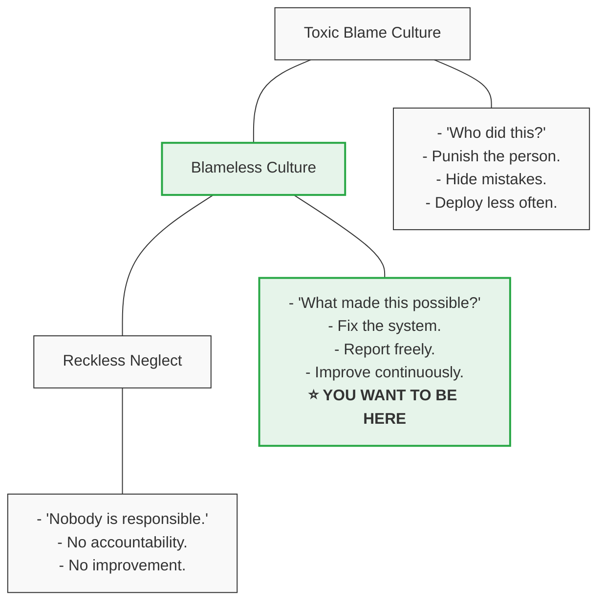
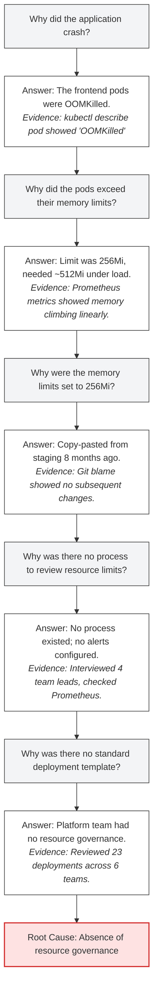
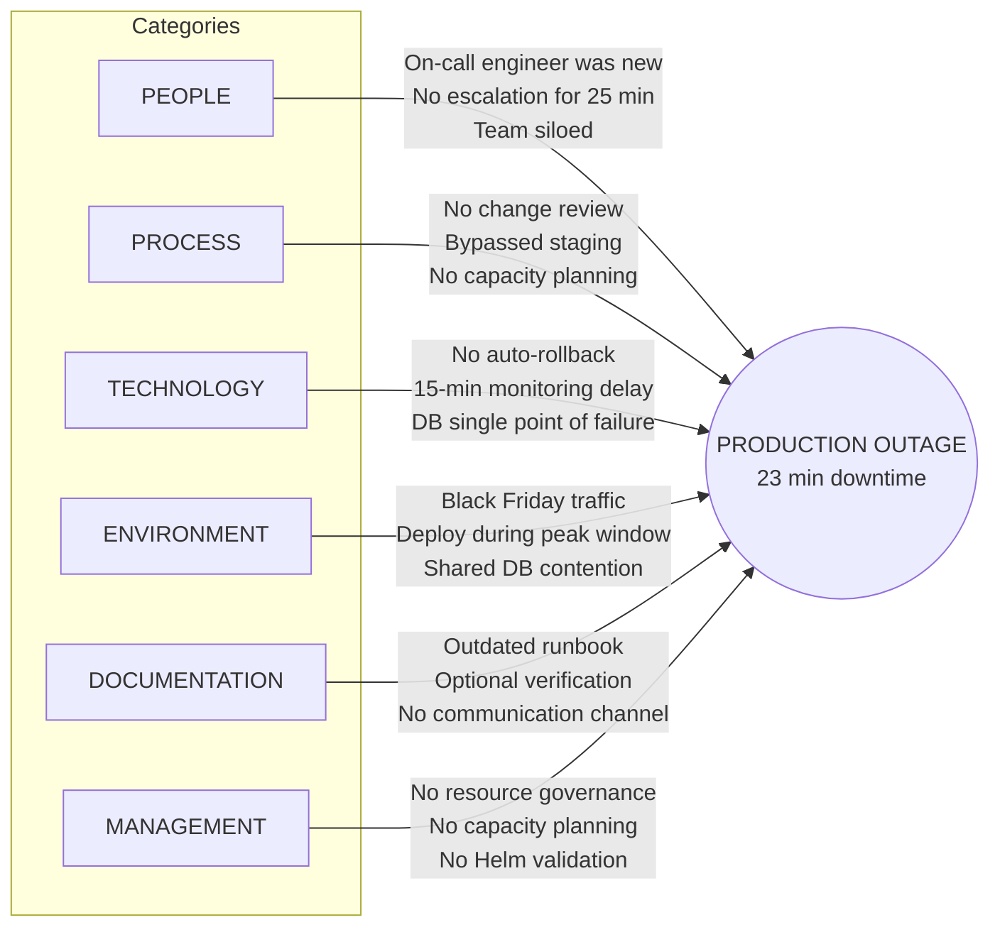
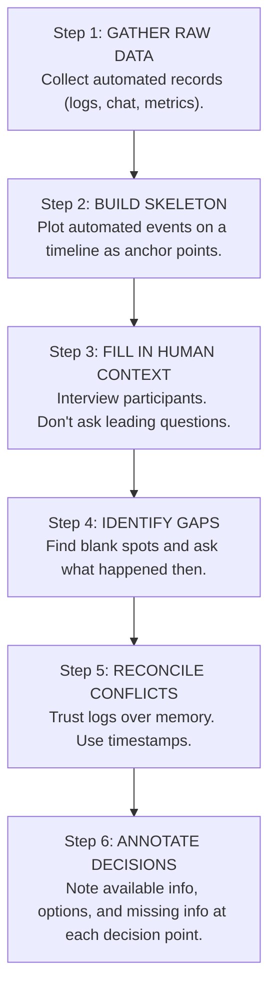
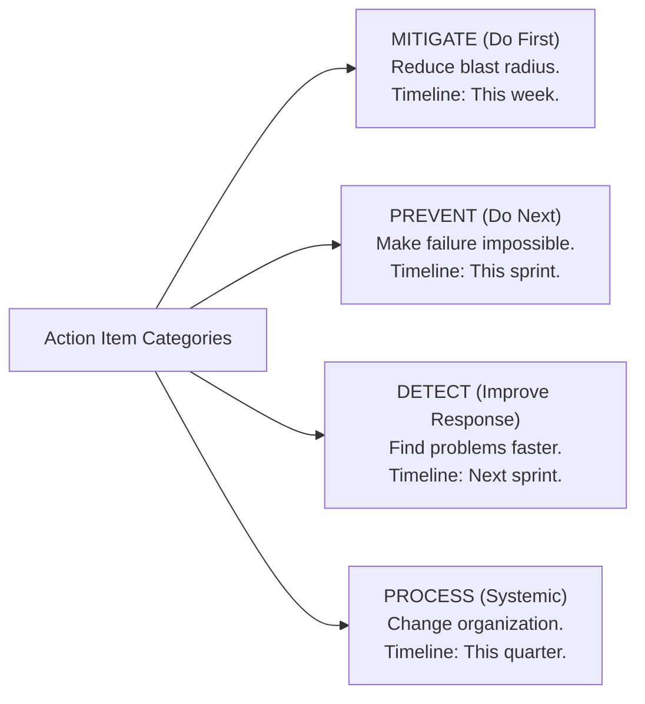

> **Complexity**: `[MEDIUM]` | **Time**: 2 hours | **Prerequisites**: [Module 1.1: Incident Command](../module-1.1-incident-command/)

### What You'll Be Able to Do

After completing this module, you will be able to:

1. **Design** a blameless postmortem process that surfaces systemic causes rather than assigning individual fault
2. **Apply** root cause analysis techniques (5 Whys, fault tree analysis, contributing factors) to move beyond surface-level incident explanations
3. **Build** postmortem documents that produce actionable follow-up items with clear ownership, priority, and deadlines
4. **Evaluate** whether a postmortem culture is genuinely blameless by identifying signs of blame avoidance, defensive writing, and missing systemic insights

---

## Why This Module Matters

*Two companies. Same failure. Two completely different outcomes.*

**Company A** had a bad Tuesday. A senior engineer deployed a config change that took down their payment processing for 38 minutes. $380,000 in lost revenue. In the postmortem meeting the next day, the VP of Engineering opened with: "So, who pushed the bad config?" The room went cold. The engineer who'd made the change turned red. The meeting became an interrogation. Why didn't you test it? Why didn't you catch it? Why didn't you follow the process?

That engineer --- one of the best on the team --- quit six weeks later. But something worse happened first: every other engineer on the team started deploying less frequently. They added more manual review steps. They slowed down. Incident reports became exercises in self-defense. People stopped volunteering for on-call. Within a year, their deployment frequency dropped 70%, and their mean time to recovery *tripled* --- because nobody wanted to touch anything, and nobody was honest in postmortems anymore.

**Company B** had the exact same failure. Same class of config error, same kind of outage, similar revenue impact. Their postmortem opened differently: "We had a 43-minute outage yesterday. Let's understand what happened and what made it possible."

They discovered the config change wasn't the root cause --- it was the *trigger*. The real causes were: no validation layer for config changes, no canary deployment for config rollouts, no automated rollback when error rates spiked, and a deployment pipeline that allowed changes to bypass staging. The engineer who pushed the config did exactly what the system allowed and encouraged. The system was broken, not the person.

Within three months, Company B had automated config validation, canary deployments for all config changes, and an auto-rollback system that caught similar issues in under 90 seconds. They shared the postmortem across the entire engineering org. Two other teams found similar gaps in their own pipelines and fixed them proactively.

**The difference wasn't talent. It wasn't tools. It was philosophy.**

Company A asked "who." Company B asked "why." Company A got silence and fear. Company B got systemic improvement and a more resilient organization.

This module teaches you how to be Company B --- every single time.

> **Stop and think**: How would your current team react to a $380k outage? Would the immediate focus be on identifying the person who pushed the button, or analyzing the system that allowed the button to be pushed?

---

## What You'll Learn

- Why "human error" is never the root cause (and what actually is)
- How to build a culture where honesty is safe and expected
- The 5 Whys technique applied to real Kubernetes failures
- Ishikawa (Fishbone) diagrams for systematic cause analysis
- How to reconstruct an accurate incident timeline
- Writing action items that actually get done
- How to distribute learnings so the whole organization benefits
- The complete anatomy of a great postmortem document

---

## Part 1: The Philosophy of Blameless Culture

### Human Error Is a Symptom, Not a Root Cause

This is the single most important idea in this entire module. Read it twice:

**Human error is a symptom of a system that made the error possible, likely, or inevitable.**

When an engineer fat-fingers a production command, the question isn't "why did they make a mistake?" Humans make mistakes. That's not a finding --- it's a species-level characteristic. The question is: *why did the system allow a fat-fingered command to reach production?*

Consider this progression:

```mermaid
graph TD
    subgraph "Blame-Focused Thinking"
        B1["Sarah deleted the production database."] --> B2["Root Cause: Sarah made an error."]
        B2 --> B3["Action Item: Tell Sarah to be more careful."]
        B3 --> B4["Next incident: Someone else deletes something."]
        B4 --> B5["Repeat forever."]
    end

    subgraph "Systems-Focused Thinking"
        S1["The production database was deleted via a manual command."] --> S2["Why was a manual command possible?"]
        S2 --> S3["Why was there no confirmation step?"]
        S3 --> S4["Why was there no RBAC preventing delete?"]
        S4 --> S5["Why was production accessible from a dev terminal?"]
        S5 --> S6["Root Cause: Insufficient access controls and missing safety mechanisms."]
        S6 --> S7["Action Items: RBAC policies, confirmation gates, separate prod access, automated backups."]
        S7 --> S8["That class of failure can never happen again."]
    end
```



The systems-focused approach doesn't just prevent *this* incident from recurring --- it prevents an entire *class* of incidents. That's the difference between fixing a bug and fixing an architecture.

### The Accountability Paradox

Here's the part that makes managers uncomfortable: **blameless does not mean accountable-less**.

People are still responsible for their actions. If an engineer deliberately sabotages production, that's a different conversation entirely (and probably an HR one). Blameless culture is about recognizing that in the vast majority of incidents, people were doing their best with the information and tools they had at the time.

The key mental model is **local rationality**: at the moment the person made the decision, it seemed like the right thing to do given what they knew. Your job in the postmortem is to understand *why* it seemed right --- not to judge them with the benefit of hindsight.



Blameless culture means:
- **People report incidents honestly** because they know they won't be punished for being honest
- **Contributing factors are identified systemically** because the goal is to fix the system, not the person
- **Accountability exists at the system level** --- if a process is broken, the owner of that process is accountable for fixing it
- **Individuals are accountable for participating** in postmortems honestly and following through on action items

### Sidney Dekker and the "Just Culture" Framework

Sidney Dekker, a researcher in human factors and safety science, developed the concept of "Just Culture" that underpins modern blameless postmortems. His key insight:

> "The single greatest impediment to error prevention is that we punish people for making mistakes."

Dekker's framework distinguishes between:

| Behavior | Description | Appropriate Response |
|----------|-------------|---------------------|
| **Human error** | Unintentional slip or mistake | Console, learn, fix the system |
| **At-risk behavior** | Conscious choice, risk not recognized | Coach, remove incentives for risk |
| **Reckless behavior** | Conscious disregard of known risk | Remedial or disciplinary action |

The vast majority of incidents (>95%) fall into the first two categories. When your postmortem process assumes the worst about people, you lose the honesty you need to find the real causes.

---

## Part 2: The 5 Whys Technique

### How It Works

The 5 Whys is the simplest root cause analysis technique. You start with the problem and ask "why?" repeatedly until you reach a systemic cause. The number 5 is a guideline, not a rule --- sometimes you need 3, sometimes you need 7.

The technique was developed by Sakichi Toyoda and used at Toyota during the evolution of their manufacturing processes. It sounds childishly simple. It is. That's what makes it powerful.

> **Pause and predict**: If you only ask "Why" 2 or 3 times during an incident review, what kind of action items do you think you will typically end up with?

### The Rules

1. **Start with a specific, observable problem** --- not a vague complaint
2. **Each "why" must be answered with a fact** --- not speculation
3. **Avoid jumping to conclusions** --- let the chain unfold naturally
4. **Stop when you reach something you can change** --- a process, a policy, a system design
5. **Never stop at a person** --- if your answer is "because John did X," ask why John was in a position to do X

### Real Kubernetes Example: The Cascading Pod Crash

Let's walk through a real scenario:

**Problem**: Production e-commerce application crashed during Black Friday, causing 23 minutes of downtime and $156,000 in lost sales.



**Root Cause**: Absence of resource governance --- no standard templates, no review processes, no resource-pressure alerting, no capacity planning for peak events.

**Notice what the root cause is NOT**: "Someone set the wrong memory limit." That's a symptom. The root cause is the organizational gap that made it *inevitable* that someone, somewhere, would have the wrong limits.

### When 5 Whys Fails

The 5 Whys is a great starting tool, but it has limitations:

| Limitation | Problem | Mitigation |
|-----------|---------|------------|
| **Single thread** | Real incidents have multiple contributing factors; 5 Whys only follows one chain | Branch into multiple chains at each "why" |
| **Confirmation bias** | Analysts tend to follow the chain that confirms their initial hypothesis | Have multiple people do independent 5 Whys |
| **Stops too early** | Teams stop at a convenient answer rather than the systemic cause | Always ask "can I dig one level deeper?" |
| **Hindsight bias** | Knowledge of the outcome biases the analysis | Focus on what was known *at the time* |
| **Oversimplification** | Complex failures rarely have a single root cause | Combine with Fishbone diagrams |

For complex incidents, use 5 Whys as a warmup, then move to more structured techniques.

---

## Part 3: Ishikawa (Fishbone) Diagrams

### What They Are

An Ishikawa diagram (also called a fishbone diagram or cause-and-effect diagram) is a structured way to brainstorm and categorize the many contributing factors to an incident. It was developed by Kaoru Ishikawa in 1968 at the University of Tokyo, originally for manufacturing quality control.

Unlike the 5 Whys, which follows a single thread, the fishbone diagram captures the full landscape of contributing factors across multiple categories.

### The Standard Categories

For software engineering incidents, use these six categories:



### How to Build One

**Step 1**: Write the problem (effect) on the right side. Be specific --- "23-minute outage of payment processing" not "things broke."

**Step 2**: Draw the main "spine" --- the horizontal line pointing to the effect.

**Step 3**: Add category branches. For each category, brainstorm contributing factors.

**Step 4**: For each factor, ask "what contributed to *this*?" and add sub-branches.

**Step 5**: Look for patterns. Which category has the most factors? Where do factors from different categories interact?

### Translating Fishbone into Action

The power of the fishbone diagram is that it reveals *clusters* of contributing factors. When you see that "Process" has 5 branches and "Technology" has 2, that tells you something important: this was primarily a process failure that technology happened to expose.

Prioritize action items by addressing the categories with the densest clusters of contributing factors first. A single process improvement might address 4 branches on the fishbone, while a technology fix might only address 1.

---

## Part 4: Timeline Reconstruction

### Why Timelines Matter

The timeline is the backbone of every postmortem. Without an accurate timeline, you're doing root cause analysis on a fictional story. Every other section of the postmortem depends on the timeline being right.

A good timeline answers three questions:
1. **What happened?** (observable events, not interpretations)
2. **When did it happen?** (precise timestamps, not "around lunchtime")
3. **Who knew what, when?** (information flow during the incident)

### Building the Timeline

**Sources of truth** (in order of reliability):

1. **Automated logs and metrics** --- timestamps are exact, no human memory bias
2. **Chat transcripts** (Slack, Teams) --- real-time communication with timestamps
3. **Alerting system records** --- when alerts fired, acknowledged, resolved
4. **Deployment/CI logs** --- when changes were deployed
5. **Human recollection** --- least reliable, most biased, but captures context

**The process**:



> **Stop and think**: What is the most reliable source of truth in your current organization? If an incident happened today, how quickly could you pull exact timestamps from your logs?

### Example Timeline Entry Format

Good timeline entries are factual, specific, and include the source:

```text
TIMELINE: Payment Processing Outage (2025-11-28)
══════════════════════════════════════════════════

All times UTC. Sources: [PD] PagerDuty, [SL] Slack,
[PM] Prometheus, [K8] Kubernetes events, [GH] GitHub,
[HR] Human recollection.

09:14  [GH] PR #4521 merged: update frontend memory limits
            from 512Mi to 256Mi (intended for staging only)
09:17  [GH] CI pipeline triggered, all tests pass (no
            resource-limit validation in pipeline)
09:22  [K8] ArgoCD syncs changes to production cluster
09:22  [K8] Rolling update begins. New pods start with
            256Mi memory limit.
09:24  [PM] Memory usage of new pods at 78% of limit
            (no alert configured below 90%)
09:31  [PM] First pod hits 256Mi limit
09:31  [K8] Pod frontend-7d4b8c6f9-x2k4p OOMKilled
09:31  [K8] Kubernetes restarts pod (CrashLoopBackOff begins)
09:32  [PM] Error rate crosses 5% threshold
09:32  [PD] ALERT: "Frontend error rate > 5%" fires
            Routed to on-call engineer (Alex, week 2 on team)
09:35  [SL] Alex in #incidents: "Looking at frontend errors,
            seeing OOMKilled pods"
09:37  [HR] Alex checks recent deployments but doesn't
            connect PR #4521 to the issue (PR title didn't
            mention production)
09:38  [SL] Alex: "Restarting affected pods"
09:39  [K8] Manual pod restart. Pods come up, immediately
            start consuming memory at the same rate.
09:41  [K8] Restarted pods OOMKilled again
09:43  [SL] Alex: "Restarts aren't helping. Escalating."
09:44  [PD] Alex pages senior engineer (Jordan)
09:47  [SL] Jordan joins #incidents
09:49  [SL] Jordan: "Checking resource limits... these were
            changed today. Reverting."
09:51  [GH] Revert PR #4528 merged
09:53  [K8] ArgoCD syncs revert. Rolling update begins.
09:55  [PM] New pods stable at ~45% memory usage
09:55  [PD] Error rate drops below threshold. Alert resolves.

TOTAL DURATION: 33 minutes (09:22 detection-worthy event
                to 09:55 resolution)
TOTAL DETECTION TIME: 10 minutes (09:22 to 09:32)
TOTAL RESPONSE TIME: 23 minutes (09:32 to 09:55)
```

### Common Timeline Mistakes

- **Using local times without timezone** --- always use UTC, note local times parenthetically if helpful
- **Mixing facts with interpretations** --- "pod crashed" is a fact; "pod crashed because of the bad deploy" is an interpretation (save that for analysis)
- **Omitting "nothing happened" periods** --- if nobody did anything for 15 minutes, that *is* the timeline; the gap itself is a finding
- **Retroactive editing** --- don't clean up the timeline to make people look better; the raw truth is more valuable

---

## Part 5: Writing Effective Action Items

### The Graveyard of Good Intentions

Here's a dirty secret about postmortems: **most action items never get completed**.

Google's SRE team studied their own postmortem process and found that action items without clear owners and deadlines had a completion rate under 30%. Items assigned to "the team" were completed less than 15% of the time. The postmortem report got written, everyone felt good about the process, and then... nothing changed.

An incomplete action item is worse than no action item at all. It creates the *illusion* of improvement while leaving the actual vulnerability in place. The next incident hits the same gap, and now you've had two postmortems about the same problem. That's how teams lose faith in the postmortem process entirely.

### SMART Action Items

Every action item must be:

| Criterion | Bad Example | Good Example |
|-----------|-------------|--------------|
| **Specific** | "Improve monitoring" | "Add Prometheus alert for pod memory usage > 80% of limit on all production namespaces" |
| **Measurable** | "Make deployments safer" | "Add config validation step to CI pipeline that rejects resource limit changes without `env:` label verification" |
| **Assignable** | "Team should fix this" | "Owner: @jordan. Reviewer: @alex." |
| **Realistic** | "Rewrite the entire deployment system" | "Add `conftest` policy check to existing ArgoCD pipeline" |
| **Time-bound** | "Do this soon" | "Complete by 2025-12-15. Check-in at next week's team standup." |

> **Pause and predict**: Look at the last three action items your team created. How many of them were actually completed on time? If the answer is zero, which SMART criteria were they missing?

### The Action Item Template

```yaml
# Action Item Format
- id: PI-2025-038-03
  title: "Add memory usage alerting for all production pods"
  description: |
    Create Prometheus alerting rules that fire when any production
    pod's memory usage exceeds 80% of its configured limit for
    more than 5 minutes. Alert should route to the owning team's
    PagerDuty service.
  priority: P1  # P1=this sprint, P2=next sprint, P3=this quarter
  owner: jordan @company.com
  reviewer: platform-team @company.com
  deadline: 2025-12-15
  status: open  # open, in_progress, completed, wont_fix
  tracking: JIRA-4521
  verification: |
    - [ ] Alert rule deployed to production Prometheus
    - [ ] Test alert fires correctly in staging
    - [ ] PagerDuty routing confirmed for 3 teams
    - [ ] Runbook updated with response steps
  related_incidents:
    - PI-2025-032  # Previous incident with same contributing factor
```

### Categorizing Action Items

Not all action items are created equal. Categorize them to help prioritize:



### Following Up

Action items without follow-up are wishes, not plans.

Establish a tracking cadence:
- **Weekly**: Review open P1 items in team standup
- **Bi-weekly**: Review all open items in team retrospective
- **Monthly**: Engineering leadership reviews completion rates across teams
- **Quarterly**: Analyze trends --- which categories of action items keep recurring?

If the same type of action item appears in 3+ postmortems, that's a signal that you have a systemic gap that individual action items can't fix. Time to escalate to a project or initiative.

---

## Part 6: Distributing and Institutionalizing Learnings

### The Learning Distribution Problem

You wrote a great postmortem. Thorough analysis. Clear action items. The team that was involved learned a ton.

Now here's the question: **did the other 15 teams in your organization learn anything?**

In most companies, the answer is no. Postmortems get filed in a wiki, maybe announced in a Slack channel, and forgotten. Six months later, a completely different team makes the exact same mistake because they never saw the postmortem from the team that already learned this lesson.

This is the learning distribution problem, and solving it is just as important as writing the postmortem in the first place.

### Strategies That Work

**1. Postmortem Reading Clubs**

Monthly sessions where the engineering org reviews the most interesting postmortems from the past month. Not a status meeting --- a learning session. Pick 2-3 postmortems, have the authors present, and discuss:
- "Could this happen to us?"
- "Do we have the same gaps?"
- "What can we adopt from their action items?"

This is extremely effective. Teams hear about failures they'd never have encountered otherwise, and the social element makes the learning stick.

**2. Weekly Postmortem Digest**

A curated email or Slack post summarizing recent postmortems in 2-3 sentences each, with links to the full documents. Think of it as a "newspaper" for organizational learning. Keep it short --- people won't read a wall of text, but they'll scan 5 bullet points.

**3. Failure Pattern Libraries**

Over time, you'll notice that the same patterns cause incidents across different teams. Document these as pattern entries:

```text
FAILURE PATTERN: Resource Limit Drift
═══════════════════════════════════════════

Description: Resource limits set at deployment time are never
             updated to match actual usage patterns, leading
             to OOMKills or CPU throttling under load.

Occurred in: PI-2025-038, PI-2025-032, PI-2024-188

Detection:   Compare allocated vs actual resource usage.
             Look for pods consistently using >70% of limits.

Prevention:  - Automated resource recommendations (VPA)
             - Quarterly resource review process
             - Alerts at 80% of resource limit

Affected teams: payments, search, recommendations
```

**4. Onboarding Integration**

New engineers should read the 5-10 most impactful postmortems from the past year as part of onboarding. This teaches them more about how systems actually fail than any architectural document ever could.

**5. Pre-Mortem Exercises**

The inverse of a postmortem: before launching a new service or making a major change, the team imagines it's 3 months from now and things went wrong. "What's the postmortem we'd write?" This surfaces risks proactively and creates action items *before* the incident.

### Measuring Learning Effectiveness

How do you know if your postmortem process is actually making the organization better?

| Metric | What It Tells You | Target |
|--------|-------------------|--------|
| **Repeat incident rate** | Are the same failures happening again? | < 5% of incidents are repeats |
| **Action item completion rate** | Are you following through? | > 85% completed on time |
| **Time to postmortem** | Are you writing them while memory is fresh? | < 5 business days after incident |
| **Postmortem participation** | Are the right people involved? | All key responders + relevant stakeholders |
| **Cross-team action items** | Are you addressing systemic issues? | > 20% of items involve another team |
| **Mean time between similar incidents** | Is the gap growing? | Increasing quarter over quarter |

---

## Part 7: Good Postmortem vs. Bad Postmortem

Let's look at the same incident documented two different ways.

### The Bad Postmortem

```text
POSTMORTEM: Website Down
Date: March 15, 2025
Duration: ~1 hour

What happened:
Dave deployed a bad config change that broke the website. It was
down for about an hour. We lost some money.

Root cause:
Dave didn't test his changes before deploying.

Action items:
- Dave needs to be more careful
- We should test things more
- Maybe add some monitoring

Lessons learned:
Don't deploy on Fridays.
```

What's wrong with this? Let me count the ways:

- **Blames an individual** ("Dave deployed a bad config")
- **Vague timeline** ("about an hour")
- **Root cause is a person** ("Dave didn't test")
- **Action items are useless** ("be more careful" is not actionable)
- **No severity or impact data**
- **No timeline of events**
- **No contributing factors analysis**
- **No ownership on action items**
- **Lesson learned is a superstition** ("don't deploy on Fridays")

### The Good Postmortem

```text
POSTMORTEM: PI-2025-012 --- Production Frontend Outage
══════════════════════════════════════════════════════════

Date: March 15, 2025
Severity: SEV-1
Duration: 48 minutes (14:21 - 15:09 UTC)
Author: Morgan (Incident Commander)
Reviewed by: Platform team, Frontend team, SRE team

IMPACT
──────
- 48 minutes of complete frontend unavailability
- ~12,400 users affected (based on typical traffic patterns)
- Estimated revenue impact: $34,000
- 3 SLA violations triggered for enterprise customers
- Trust impact: 142 support tickets filed

SUMMARY
───────
A configuration change to the frontend Ingress rules was
deployed to production without passing through the staging
environment. The change contained a regex error in the path
matching rules that caused the Ingress controller to reject
all incoming requests. The error was not caught because the
CI pipeline did not validate Ingress configurations, and the
deployment path allowed staging to be bypassed.

TIMELINE
────────
14:02 [GH]  PR #892 merged: "Update Ingress path routing"
14:05 [CI]  Pipeline passes (no Ingress validation step)
14:08 [K8]  ArgoCD syncs to production (staging skip was
            possible due to missing environment gate)
14:15 [K8]  Ingress controller reloads with new config
14:15 [K8]  NGINX returns 503 for all frontend routes
14:21 [PM]  Error rate alert fires (6-minute delay due to
            alert evaluation interval)
14:24 [PD]  On-call engineer (Casey) paged
14:26 [SL]  Casey: "Investigating 503s on frontend"
14:31 [SL]  Casey: "Ingress config looks wrong. Checking
            recent changes."
14:35 [SL]  Casey: "Found bad regex in Ingress. PR #892.
            Reverting."
14:38 [GH]  Revert PR #895 merged
14:42 [K8]  ArgoCD syncs revert to production
14:45 [K8]  Ingress controller reloads with reverted config
14:45 [PM]  503 errors stop. Traffic recovering.
15:09 [PM]  All metrics return to normal baseline.

CONTRIBUTING FACTORS
────────────────────
1. [PROCESS] CI pipeline had no Ingress configuration
   validation step. NGINX config errors were not caught
   before deployment.

2. [PROCESS] The deployment pipeline allowed changes to
   skip the staging environment. No gate enforced
   staging deployment before production.

3. [TECHNOLOGY] Alert evaluation interval was 6 minutes,
   adding delay to detection. For a total outage, this
   should trigger within 1 minute.

4. [TECHNOLOGY] ArgoCD was configured for auto-sync to
   production, meaning merged PRs deployed immediately
   with no manual approval gate.

5. [ENVIRONMENT] Change was deployed during peak traffic
   hours. No deployment freeze policy existed for
   high-traffic periods.

6. [DOCUMENTATION] No runbook existed for "complete
   frontend outage" scenario. Casey had to investigate
   from scratch.

ROOT CAUSE ANALYSIS (5 Whys)
────────────────────────────
Q1: Why was the frontend unavailable?
A1: The Ingress controller rejected all requests due to
    an invalid regex in the path matching rules.

Q2: Why did an invalid regex reach production?
A2: The CI pipeline did not validate Ingress configurations
    against the NGINX config parser.

Q3: Why was there no validation in the pipeline?
A3: Ingress resources were treated as "simple YAML" and only
    validated for Kubernetes schema compliance, not for NGINX
    configuration correctness.

Q4: Why could the change skip staging?
A4: The ArgoCD ApplicationSet did not enforce a promotion
    workflow (staging → production). Any merged change
    deployed directly to all environments simultaneously.

Q5: Why was there no deployment promotion workflow?
A5: When ArgoCD was adopted 6 months ago, the team chose
    speed over safety. A promotion workflow was on the
    roadmap but never prioritized.

Root Cause: Missing deployment safety mechanisms --- no
config validation, no staging gate, no promotion workflow.

ACTION ITEMS
────────────
P1 (This Sprint):
  [AI-1] Add nginx -t validation step to CI pipeline for
         all Ingress resource changes.
         Owner: @casey | Deadline: March 22
         Verification: Pipeline fails on invalid NGINX config.

  [AI-2] Reduce alert evaluation interval to 30 seconds for
         5xx error rates in production.
         Owner: @monitoring-team | Deadline: March 19
         Verification: Test alert fires within 1 minute of
         threshold breach.

P2 (Next Sprint):
  [AI-3] Implement ArgoCD promotion workflow: staging must be
         healthy for 15 minutes before production sync.
         Owner: @jordan | Deadline: April 5
         Verification: PR deployed to staging only. Manual
         promotion required for production.

  [AI-4] Create runbook for "complete frontend outage" scenario.
         Owner: @casey | Deadline: April 1
         Verification: Runbook reviewed by 2 team members.

P3 (This Quarter):
  [AI-5] Implement deployment freeze policy for top-5 traffic
         hours. Deployments during these windows require
         explicit approval from team lead.
         Owner: @engineering-lead | Deadline: May 1

  [AI-6] Audit all ArgoCD applications for auto-sync to
         production without promotion gates.
         Owner: @jordan | Deadline: April 15

LESSONS LEARNED
───────────────
1. "Simple" Kubernetes resources (Ingress, ConfigMaps) can
   cause total outages. They deserve the same validation
   rigor as application code.

2. Speed-over-safety tradeoffs accumulate. The decision to
   skip a promotion workflow 6 months ago felt reasonable
   at the time. The cost was paid in this incident.

3. Auto-sync to production is a loaded gun. Convenient when
   things go right. Catastrophic when they don't.

WHAT WENT WELL
──────────────
- Casey identified the root cause within 9 minutes of being
  paged. Good investigative instincts.
- Revert was clean and fast (7 minutes from decision to
  resolution).
- Incident was communicated clearly in #incidents channel.
```

The difference is stark. The good postmortem is longer, yes --- but every line serves a purpose. It teaches the organization something. It produces actionable improvements. And it does all of this without blaming anyone.

---

## Part 8: Complete Postmortem Template

Use this template for your own postmortems. Copy it, adapt it, make it yours --- but don't skip sections.

```markdown
# Postmortem: [ID] --- [Title]

**Date**: YYYY-MM-DD
**Severity**: SEV-1 / SEV-2 / SEV-3
**Duration**: X minutes/hours (HH:MM - HH:MM UTC)
**Author**: [Incident Commander or designated author]
**Status**: Draft / In Review / Final
**Reviewed by**: [List of teams/individuals]

---

## Impact

- Duration of user-facing impact
- Number of users/customers affected
- Revenue impact (if measurable)
- SLA/SLO violations triggered
- Data loss (if any)
- Reputational impact

## Summary

[2-3 paragraph narrative of what happened. Written for someone
who wasn't involved. No blame, no jargon without explanation.]

## Timeline

[Chronological events with timestamps, sources, and actors.
All times in UTC.]

| Time (UTC) | Source | Event |
|------------|--------|-------|
| HH:MM | [source] | Event description |

## Contributing Factors

[Numbered list. Each factor tagged with category:
PEOPLE, PROCESS, TECHNOLOGY, ENVIRONMENT, DOCUMENTATION,
MANAGEMENT]

## Root Cause Analysis

[5 Whys or Fishbone diagram. Show your work.]

## Action Items

### P1 --- This Sprint
| ID | Action | Owner | Deadline | Status |
|----|--------|-------|----------|--------|

### P2 --- Next Sprint
| ID | Action | Owner | Deadline | Status |
|----|--------|-------|----------|--------|

### P3 --- This Quarter
| ID | Action | Owner | Deadline | Status |
|----|--------|-------|----------|--------|

## Lessons Learned

[Numbered list of insights. Focus on things that surprised
the team or challenged assumptions.]

## What Went Well

[Credit good work during the incident. Reinforce behaviors
you want to see repeated.]

## What Could Be Improved

[Process gaps observed during incident response itself,
separate from the technical root cause.]

## Supporting Data

[Links to dashboards, graphs, logs, Slack threads, alerts.
Include screenshots of key metrics during the incident.]
```

---

## War Story: The $2.3 Million Postmortem That Never Happened

*Based on a real incident at a mid-size fintech company. Details changed to protect the guilty.*

In 2023, a fintech company processing $400M in annual payments experienced a cascading database failure during their busiest month. A routine schema migration locked a critical table for 3 hours and 17 minutes. Payment processing was completely down. $2.3 million in transactions failed. Enterprise clients started making phone calls to the CEO.

The CTO called an emergency meeting. "I want to know who approved this migration during business hours."

The DBA who ran the migration was mortified. Their manager started drafting a PIP (Performance Improvement Plan). The postmortem meeting was scheduled, then cancelled. Then rescheduled. Then cancelled again. Nobody wanted to be in that room.

Instead, the CTO sent an email: "The migration issue has been addressed. We've updated the process. Let's move forward."

No postmortem was ever written.

Seven weeks later, a different team ran a different migration on a different database. Same pattern --- locking migration during business hours. This time it was "only" 48 minutes and $180,000. But it was the exact same class of failure.

The DBA from the first incident had quit by then. They took all the context about what went wrong and how to prevent it with them. The second team had never heard about the first incident. They didn't even know there was a process update --- because the "updated process" was an email that their manager had filed and forgotten.

Total cost of not doing the postmortem: **$2.3M (first incident) + $180K (second incident) + senior DBA replacement cost (~$45K in recruiting fees) + immeasurable trust damage with enterprise clients**.

Total cost of doing the postmortem: **4 hours of engineering time, a Confluence page, and three JIRA tickets**.

The math isn't hard.

---

## Did You Know?

> **Fact 1**: Google publishes many of their postmortems externally in a book called *"SRE: How Google Runs Production Systems."* Chapter 15 is dedicated entirely to postmortem culture. They found that teams which conducted blameless postmortems had **40% fewer recurring incidents** than teams that didn't.

> **Fact 2**: The aviation industry pioneered blameless incident analysis in the 1970s with the Aviation Safety Reporting System (ASRS). Pilots who report safety incidents voluntarily receive **immunity from disciplinary action**. This single policy change is credited with preventing thousands of accidents. Software engineering borrowed the concept 40 years later.

> **Fact 3**: Etsy was one of the first tech companies to build a formal blameless postmortem culture, led by John Allspaw. They published a study showing that their median time-to-resolution decreased by **28% over 18 months** after implementing blameless postmortems --- not because engineers got faster, but because the same failures stopped happening.

> **Fact 4**: The term "root cause" is somewhat misleading. Complex system failures almost never have a single root cause. The field of safety science has largely moved toward the term **"contributing factors"** to acknowledge that incidents result from the interaction of multiple conditions, not a single cause. When you hear "root cause analysis," think "contributing factors analysis."

---

## Common Mistakes

| Mistake | Why It Happens | Better Approach |
|---------|---------------|-----------------|
| **Stopping at "human error"** | It's satisfying to find someone to blame; it feels like an answer | Ask "what made this error possible?" Human error is where the analysis *starts*, not where it ends |
| **Writing action items as "be more careful"** | Teams confuse awareness with prevention | Action items must change the system: add a gate, automate a check, create a constraint. If a human has to "remember" to do something, you haven't fixed it |
| **Postmortem delayed beyond 5 days** | "We'll do it when things calm down" --- they never calm down | Schedule the postmortem within 48 hours of resolution. Memory degrades exponentially. Day-of details become "I think it was something like..." within a week |
| **No follow-up on action items** | Writing the postmortem feels like the work is done | Track action items in your sprint board alongside feature work. Review completion rates monthly. Treat incomplete action items as tech debt |
| **Only the incident commander writes it** | Seems efficient; one person just documents everything | Multiple perspectives catch things the IC missed. Contributors should review and add their own sections, especially the timeline |
| **Skipping "What Went Well"** | Postmortems feel like they should focus on problems | Reinforcing good behaviors is just as important as fixing bad ones. If the on-call engineer made a great escalation call, say so. People repeat recognized behavior |
| **Treating the postmortem as a compliance exercise** | Management requires it; team goes through the motions | Make postmortems genuinely useful: share learnings broadly, celebrate the best ones, track improvements that came from them. If postmortems feel pointless, the format or culture needs work |
| **Confusing triggers with causes** | The trigger is visible and recent; the causes are hidden and old | The deploy that broke things is the trigger. The missing validation, absent review process, and lack of testing are the causes. Always dig past the trigger |

---

## Quiz

Test your understanding of blameless postmortems and root cause analysis.

**Question 1**: An engineer accidentally deletes a production ConfigMap, causing an outage. In a blameless postmortem, what is the correct way to frame the root cause?

<details>
<summary>Show Answer</summary>

The root cause is NOT "Engineer X deleted the ConfigMap." The root cause is the system conditions that made this possible: lack of RBAC preventing deletion, no confirmation step for destructive operations, missing backup/restore procedures, and absence of GitOps (where the ConfigMap would be reconciled automatically from a Git source of truth). Blaming the engineer terminates the investigation before any systemic vulnerabilities are addressed, guaranteeing that another engineer will eventually make the same mistake. The blameless framing focuses entirely on the environment: "A production ConfigMap was deleted via a manual kubectl command. Contributing factors include: unrestricted RBAC permissions, no admission controller preventing destructive operations on critical resources, and the ConfigMap not being managed through GitOps." By framing it this way, you naturally generate action items that will permanently eliminate this class of failure.
</details>

**Question 2**: Your 5 Whys analysis arrives at "because the engineer was tired and made a mistake" at the third "Why." Is this a valid stopping point? Why or why not?

<details>
<summary>Show Answer</summary>

No, this is never a valid stopping point because "tired and made a mistake" is a human condition, not a systemic cause that the organization can effectively control. If you stop here, your only possible action item is "tell people to get more sleep," which is completely unenforceable and does not prevent future outages. Instead, you must continue asking why the system allowed a fatigued human to cause an outage without interference. Why was the engineer overloaded, and why was there no automated safety net or peer review for production changes? You must keep digging until you reach a process, policy, or system design that can be permanently altered to remove the hazard entirely.
</details>

**Question 3**: You are leading a postmortem for a database migration that locked a table and caused an outage. You need to assign an action item to improve deployment safety. Which of the following is the most effective action item to write down?

A) "Improve our deployment process"
B) "Add a canary deployment step to the CI/CD pipeline that routes 5% of traffic to new pods for 10 minutes before full rollout. Owner: @jordan. Deadline: April 15."
C) "The team should test more before deploying"
D) "Fix the monitoring so this doesn't happen again"

<details>
<summary>Show Answer</summary>

Option B is the correct choice because it meets all the criteria of a SMART action item. An action item is only effective if it is Specific, Measurable, Assignable, Realistic, and Time-bound. Vague action items like options A, C, or D cannot be systematically tracked, have no clear completion state, and are almost never actually implemented by teams. By defining exactly what will be built (a canary deployment step), who specifically owns it (@jordan), and when it is due (April 15), you create accountability. This level of rigor ensures the systemic vulnerability is actually closed before another incident can exploit it.
</details>

**Question 4**: During a postmortem, a developer states: "The root cause of the outage was that the memory limit was updated to 256Mi in the PR." How should you, as the incident commander, address this statement in the context of triggers vs. root causes?

<details>
<summary>Show Answer</summary>

You should gently explain that the PR update is a trigger, not the root cause, because fixing the PR only resolves this specific instance of the issue. A trigger is simply the proximate event that set the failure in motion, much like a match starting a fire. The true root causes are the systemic conditions that allowed the match to be struck in the first place, such as missing CI/CD validation, lack of staging environments, or absent resource governance. If you stop your analysis at the trigger, you will leave the underlying vulnerabilities exposed for the next deployment. Addressing the systemic root cause ensures that you prevent the entire class of incidents from ever occurring again.
</details>

**Question 5**: Your engineering organization has been rigorously writing blameless postmortems for six months, yet the overall mean time between similar incidents is decreasing. What systemic failures in the postmortem process could cause this, and how would you intervene?

<details>
<summary>Show Answer</summary>

When a mature postmortem process fails to improve reliability, the breakdown is almost always in the follow-through rather than the documentation itself. The most likely reason is that action items are being written but never prioritized against feature work, meaning the known vulnerabilities remain wide open. Another major factor is that action items might be addressing shallow symptoms rather than automating or fixing the systemic root causes. Additionally, there is often a learning distribution problem where only the team that experienced the outage learns from it, allowing other teams to repeat the exact same mistake. Addressing this requires enforcing action item completion during sprint planning and establishing a culture of reading and sharing postmortems across organizational boundaries.
</details>

**Question 6**: You're facilitating a postmortem and a senior manager keeps asking "who approved this change?" and "why didn't anyone catch this?" How do you redirect the conversation to maintain a blameless culture?

<details>
<summary>Show Answer</summary>

The most effective way to handle this is to redirect the focus from individuals to the systems and processes surrounding them. You can reframe their question by saying, "That's a great question about our approval process; let's explore what our automated gates currently require and where they might be missing." Alternatively, you can apply the substitution test by asking the room, "If a different engineer had been making this change, would our system have stopped them?" By acknowledging the manager's intent to find accountability but shifting the focus to systemic accountability, you preserve the psychological safety of the blameless postmortem. If a manager consistently demands individual blame despite these redirections, you must have a private conversation later to explain how blame culture ultimately hides the very data they need to improve reliability.
</details>

---

## Hands-On Exercise: Rewrite a Blame-Heavy Postmortem

### Scenario

You've been asked to review and rewrite the following postmortem that was written by another team. It's full of blame, vague action items, and missing analysis. Your job is to transform it into a proper blameless postmortem with systemic focus.

### The Original (Flawed) Postmortem

```text
POSTMORTEM: Service Outage, January 12

Summary:
On January 12, Kevin pushed a Helm chart update to production
that had a typo in the values.yaml file. This caused all 24
replicas of the order-service to crash. Kevin should have tested
this in staging first but he skipped it because he was rushing to
meet a deadline. The outage lasted 2 hours and affected all
customers. Sarah from the platform team was on-call but she took
20 minutes to respond to the page because she was at lunch. When
she finally got to it, she didn't know how to roll back a Helm
release because she's new and nobody trained her.

Root Cause:
Kevin's typo in values.yaml and Sarah's slow response.

Action Items:
1. Kevin needs to be more careful with YAML
2. Sarah needs Helm training
3. We should probably add some tests
4. Don't rush deployments

Lessons Learned:
Test your code before deploying.
```

### Your Assignment

Rewrite this postmortem using the template from Part 8. You must:

1. **Remove all blame language** --- refer to roles and systems, not individuals
2. **Build a plausible timeline** --- invent reasonable timestamps and sequence of events based on the narrative
3. **Conduct a 5 Whys analysis** --- dig from the typo down to systemic causes
4. **Draw a fishbone diagram** --- identify contributing factors across all categories
5. **Write 6+ SMART action items** --- with owners (use role names), deadlines, and verification criteria
6. **Add a "What Went Well" section** --- find at least 2 things that went right
7. **Create a learning distribution plan** --- how will the org learn from this?

### Success Criteria

Your rewritten postmortem should:

- [ ] Contain zero references to individuals by name in the root cause or contributing factors
- [ ] Have a minute-by-minute timeline with at least 12 entries
- [ ] Include a 5 Whys analysis that reaches a systemic root cause (not a person)
- [ ] Include a fishbone diagram with at least 3 categories populated
- [ ] Have 6+ action items that are all SMART
- [ ] Include impact data (estimate user count, revenue, SLA violations)
- [ ] Have a learning distribution plan with at least 3 specific activities
- [ ] Pass the "substitution test" --- if different people had been involved, would the analysis change? It shouldn't.

### Bonus Challenge

After rewriting the postmortem, write a 5-sentence email to the original author explaining *why* you changed what you changed, without making them feel attacked. Practice the same blameless philosophy in your feedback that you're applying to the postmortem itself.

---

## Summary

Blameless postmortems are not about being soft on failure. They're about being *smart* about failure. When people feel safe reporting and analyzing mistakes, you get honest data. When you have honest data, you can fix the real problems. When you fix the real problems, the system gets stronger. When the system gets stronger, incidents decrease. When incidents decrease, everyone sleeps better.

The alternative --- blame, punishment, and fear --- produces exactly one outcome: silence. And silence is the most dangerous failure mode of all, because you can't fix what you can't see.

**Key takeaways**:

1. Human error is a symptom, never the root cause. Always dig deeper.
2. The 5 Whys technique is simple and powerful, but watch for single-thread bias.
3. Fishbone diagrams capture the full landscape of contributing factors.
4. Timelines must be built from automated sources first, human memory second.
5. Action items must be SMART --- or they'll never get done.
6. The postmortem isn't done when it's written. It's done when the learnings are distributed and the action items are complete.
7. Measure your postmortem process. If the same incidents keep recurring, something in the process is broken.

---

> **Next Module**: [Module 1.3: Effective On-Call](../module-1.3-oncall/) --- Design on-call rotations that don't burn out your team, build runbooks that actually help at 3 AM, and create escalation paths that work under pressure.