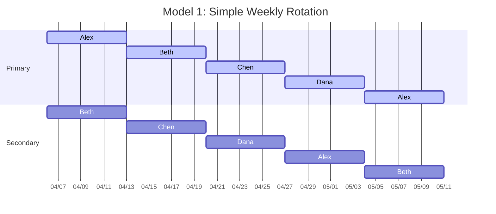
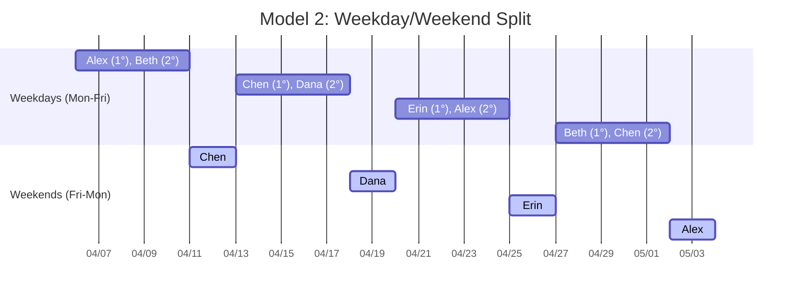
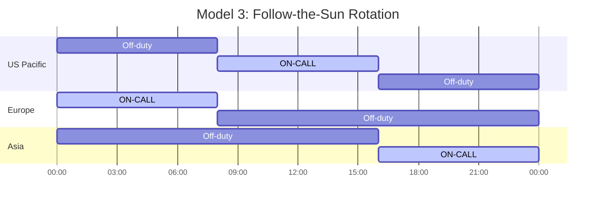
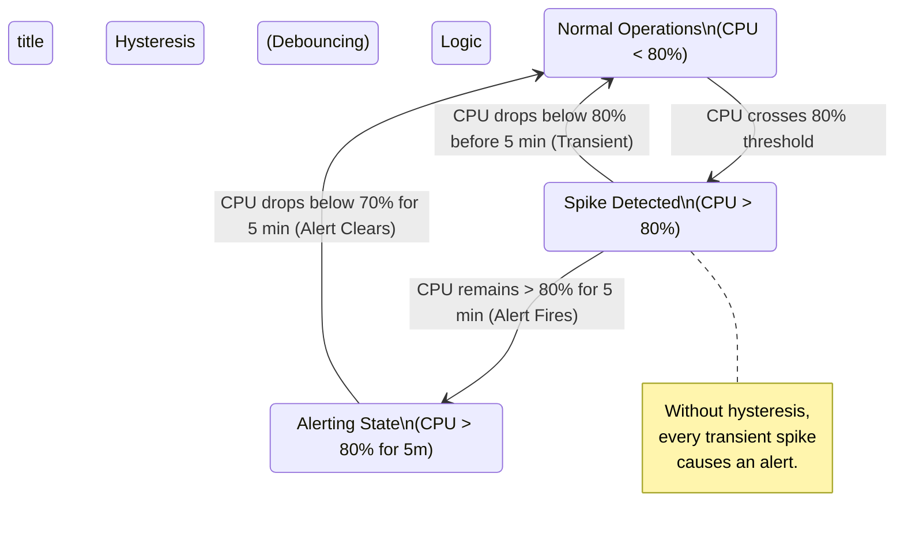
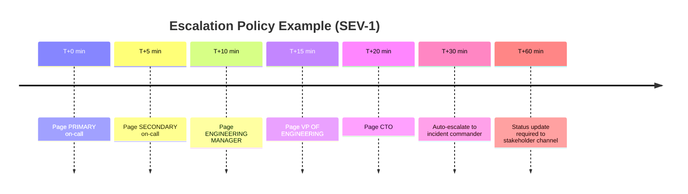
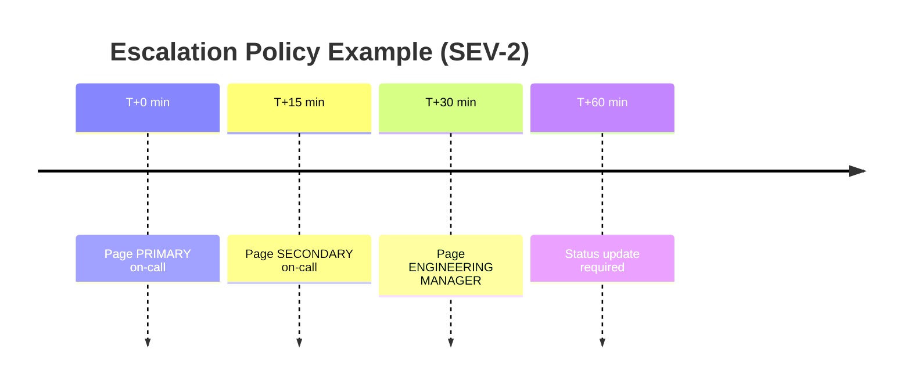
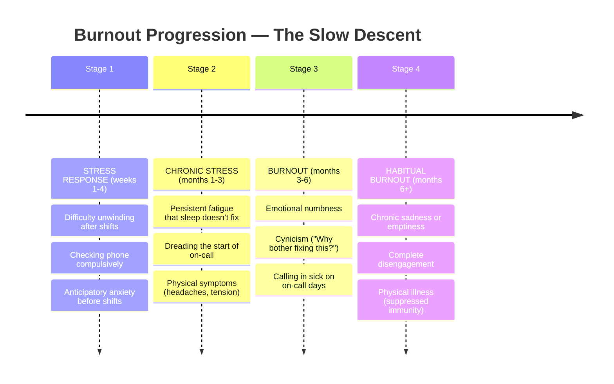
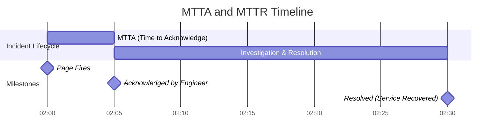

> **Complexity**: `[MEDIUM]`
>
> **Time to Complete**: 2 hours
>
> **Prerequisites**: None
>
> **Track**: Foundations

### What You'll Be Able to Do

After completing this module, you will be able to:

1. **Design** on-call rotations that distribute load fairly, provide adequate rest, and include clear escalation paths
2. **Evaluate** alert quality by identifying noisy, non-actionable, and duplicate alerts that contribute to on-call burnout
3. **Implement** on-call health metrics (pages per shift, time-to-acknowledge, interrupt frequency) that make burnout risk visible to leadership
4. **Apply** sustainable on-call practices including runbook-driven response, toil budgets, and compensation models that retain experienced engineers

---

## The Engineer Who Stopped Sleeping

**March, 2019. A mid-size fintech company in Austin, Texas.**

Priya had been a backend engineer for three years. She was good at her job—reliable, sharp, the kind of person who could read a stack trace like a bedtime story. When the team transitioned to a microservices architecture and needed to staff an on-call rotation, she volunteered. She was proud of the systems she'd built. Who better to keep them running at night?

The first month was fine. Two pages, both legitimate, both resolved in under fifteen minutes. She told herself: *this isn't so bad.*

By month three, the architecture had grown. New services. New dependencies. New failure modes nobody had anticipated. The alerts started coming in clusters—three, four, five per night. Some were real. Most were not. A disk usage alert firing at 62% on a threshold of 60%. A health check flapping because a downstream service had a 200ms cold start. A "critical" alert for a batch job that wasn't actually needed until morning.

Priya stopped sleeping through the night. She started sleeping with her phone on her chest, volume at maximum. She developed a Pavlovian anxiety response to her ringtone—even hearing a similar sound in a grocery store would spike her heart rate. She stopped exercising. She stopped cooking. She ate takeout at her desk and skipped team lunches because she needed to nap.

Her manager noticed the dark circles. "You doing okay?" he asked.

"Fine," she said. Engineers are trained to fix things, not admit they're broken.

By month six, Priya put in her two weeks' notice. She didn't have another job lined up. She just couldn't do it anymore. The company lost one of its best engineers—not because of compensation, not because of career growth, not because of a toxic culture. Because they let bad on-call practices grind her into dust.

> **Stop and think**: What organizational failures led to Priya's resignation? Was it just the volume of alerts, or did the lack of systemic feedback loops play a larger role?

> **The Hidden Cost of Bad On-Call**
>
> What Priya's company thought they saved:
> - $0 (no on-call tooling investment, no rotation redesign)
>
> What Priya's company actually lost:
> - Recruiting her replacement: ~$25,000
> - Ramp-up time for new hire (6 months): ~$75,000 in reduced output
> - Knowledge that walked out the door: Priceless (and unrecoverable)
> - Team morale damage: 2 more resignations followed
>
> **TOTAL: $100,000+ and a mass attrition event**

Priya's story isn't rare. It's the norm at companies that treat on-call as an afterthought. This module exists to make sure you never build—or tolerate—an on-call system that destroys people.

---

## Why This Module Matters

On-call is the frontline of production reliability. Every modern software organization that runs 24/7 services needs humans in the loop when automation fails. That is an engineering reality.

But on-call is also a *human* system. It involves sleep deprivation, interrupted personal time, cognitive load under pressure, and the slow accumulation of stress that—left unchecked—turns into clinical burnout. That is a *human* reality.

The best engineering organizations understand both realities simultaneously. They design on-call rotations with the same rigor they apply to system architecture: clear ownership, well-defined escalation paths, measurable quality, and continuous improvement. They treat alert noise the way they treat technical debt—as something to be measured, budgeted, and systematically reduced.

The worst organizations throw a PagerDuty license at the problem and call it done.

This module teaches you to build on-call systems that are both *effective* (incidents get resolved quickly) and *humane* (the people doing the work don't burn out). These goals are not in tension. In fact, they reinforce each other: well-rested engineers with low-noise alerts resolve incidents faster than exhausted engineers drowning in false positives.

> **The Firefighter Analogy**
>
> Professional fire departments don't make firefighters respond to every car alarm in the city. They have dispatch systems that filter signal from noise, clear escalation procedures, mandatory rest periods, and structured shift rotations. A fire department that paged every firefighter for every alarm would collapse within a week.
>
> Your on-call rotation is no different. The tools, the processes, the human factors—they all need to be engineered deliberately.

---

## Did You Know?

- **Google's SRE book reports** that an on-call engineer should receive no more than **2 events per 12-hour shift** on average. More than that, and incident quality degrades because the responder is constantly context-switching instead of deeply investigating each issue.

- **Sleep deprivation equivalent**: After 17-19 hours without sleep, cognitive performance drops to the equivalent of a **blood alcohol concentration of 0.05%**. After 24 hours, it's equivalent to **0.10%**—legally drunk in every US state. When you page someone at 3 AM who went to bed at midnight, you're asking a person with impaired judgment to make production decisions.

- **Alert fatigue kills people—literally.** In healthcare, the Joint Commission found that **72-99% of clinical alarms are false positives**, and alarm fatigue has been directly linked to patient deaths. The same psychology applies to software alerts: when most pages are noise, engineers learn to ignore them—including the real ones.

- **The cost of an interrupted night**: Research from the University of Tel Aviv shows that even a **single night of fragmented sleep** (woken twice for 10-15 minutes) produces cognitive impairment equivalent to getting only **4 hours of total sleep**. It's not just the total time lost—it's the disruption of sleep cycles that does the damage.

---

## Structuring Healthy On-Call Rotations

A well-designed rotation answers five questions: **who**, **when**, **how long**, **with what support**, and **with what compensation**. Let's work through each.

### Rotation Models


*Best for: Small teams (4-6 people), single timezone. Pros: Simple, predictable. Cons: Full week is exhausting, weekends are consumed.*


*Best for: Teams that want to protect weekends, 5-8 people. Pros: Weekend rotation is separate and can be compensated differently. Cons: Handoff friction at boundaries.*


*Best for: Distributed teams across 2-3 timezones. Pros: Nobody gets paged at night (Gold Standard). Cons: Requires hiring globally.*

### Primary / Secondary Model

Every rotation should have at least two tiers:

| Role | Responsibility | Escalation Timing |
|------|---------------|-------------------|
| **Primary** | First responder. Gets paged immediately. Expected to acknowledge within 5-15 minutes. | N/A — they're first. |
| **Secondary** | Backup. Gets paged if primary doesn't acknowledge within the SLA. Also available for consultation. | 10-15 min after primary page |
| **Escalation Manager** | Engineering manager or senior IC. Gets paged if both primary and secondary fail, or if incident severity is high enough. | 15-30 min, or immediately for SEV-1 |

The secondary role is not just a safety net for missed pages. It serves three critical functions:

1. **Coverage gaps**: Primary needs a doctor's appointment, a school pickup, a shower.
2. **Consultation**: Primary is investigating but needs a second pair of eyes.
3. **Psychological safety**: Knowing someone has your back reduces the anxiety of being on-call.

### Rotation Length and Frequency

| Duration | Assessment | Notes |
|----------|------------|-------|
| **24 hours** | Too short | Constant handoffs destroy context. |
| **3 days** | Awkward | Scheduling overlaps with weekends unpredictably. |
| **1 week** | ✅ **Ideal** | Industry standard. Long enough for context, short enough to not burn out. Most teams use this. |
| **2 weeks** | Too long | Only acceptable for low-page services (< 1 page/day average). Exhausting for high-volume. |

**Minimum Team Size for Healthy Rotation:**
- **4 people**: On-call every 4th week → MINIMUM viable (borderline)
- **5 people**: On-call every 5th week → Acceptable
- **6 people**: On-call every 6th week → Good
- **8 people**: On-call every 8th week → ✅ Ideal

> **Rule of Thumb**: No one should be on-call more than one week out of every four. Google's SRE practice targets a maximum of one week in every three to four.

---

## Alert Fatigue: The Silent Killer

Alert fatigue is what happens when an on-call engineer receives so many alerts that they stop treating each one as meaningful. It's not laziness—it's a well-documented psychological phenomenon. The human brain literally cannot sustain a high-alert state indefinitely. It adapts by lowering its response threshold. The alerts become background noise.

This is how real incidents get missed. Not because nobody was on-call, but because the person on-call had been conditioned by weeks of false positives to assume the next page is also noise.

> **Pause and predict**: If you lower the threshold for a CPU alert to be "safer" and catch issues earlier, what psychological effect will that ultimately have on the on-call engineer?

### Measuring Signal-to-Noise Ratio

Every on-call team should track this metric:

**SNR = (Actionable Alerts / Total Alerts) × 100%**

Where "Actionable" means:
- Required human intervention
- Would have caused user impact if not addressed
- Was NOT a duplicate of another alert
- Was NOT a transient blip that self-resolved

**Benchmarks:**
- **< 30% SNR**: CRITICAL. Your team is drowning. Stop everything and fix alerting before it causes a real incident (or a resignation).
- **30-50% SNR**: Poor. Significant noise. Dedicate sprint time to alert hygiene.
- **50-70% SNR**: Acceptable. Normal for growing systems. Continuous improvement needed.
- **70-90% SNR**: Good. Your alerting is healthy. Keep iterating.
- **> 90% SNR**: Excellent. You might be under-alerting (double-check coverage), but likely you're doing a great job.

### Systematically Reducing Noise

Reducing alert noise is not a one-time project. It's a continuous discipline. Here's a framework:

**Step 1: Classify every alert from the past 30 days.**

Put each alert into one of these buckets:

| Category | Definition | Action |
|----------|-----------|--------|
| **True Positive, Actionable** | Real problem, needed human fix | Keep this alert. Tune thresholds if needed. |
| **True Positive, Self-Healing** | Real problem, but system recovered automatically | Convert to a non-paging notification. Review why auto-healing isn't trusted enough to not alert. |
| **False Positive** | Alert fired, but nothing was actually wrong | Fix the detection logic, raise thresholds, add hysteresis. |
| **Duplicate** | Same incident triggered multiple alerts | Deduplicate at the source. Group related alerts. |
| **Informational** | Not a problem, just a status change | Remove from paging entirely. Move to a dashboard or log. |

**Step 2: Apply the ICE framework to prioritize fixes.**

For each noisy alert, score it on three dimensions (1-10 each):

- **I**mpact: How much on-call pain does this alert cause?
- **C**onfidence: How sure are you that the fix will work?
- **E**ase: How easy is the fix to implement?

Multiply all three. Fix the highest-scoring alerts first.

**Step 3: Implement hysteresis (debouncing).**

A shocking number of false positive alerts come from momentary threshold crossings:



**Step 4: Group correlated alerts.**

When a database goes down, you don't need 47 alerts for every service that depends on it. You need one alert that says "database is down" and a suppression rule that silences downstream symptoms for a defined window.

**BAD: Alert storm from a single root cause**
```text
03:14:22  CRITICAL  payment-service: connection timeout to postgres
03:14:23  CRITICAL  order-service: connection timeout to postgres
03:14:23  WARNING   inventory-service: high error rate
03:14:24  CRITICAL  user-service: connection timeout to postgres
03:14:25  CRITICAL  notification-service: unhandled exception
... (38 more alerts over next 5 minutes)

Engineer's phone: *vibrating continuously for 5 minutes straight*
```

**GOOD: Root cause detection with suppression**
```text
03:14:22  CRITICAL  postgres-primary: connection refused (port 5432)
          ↳ Suppressing 44 downstream dependency alerts for 15 minutes
          ↳ Runbook: https://wiki.internal/runbooks/postgres-connection

Engineer's phone: *one page, one runbook link, clear root cause*
```

---

## Paging Etiquette

Not everything deserves a page. A page is a statement that says: "This problem is urgent enough to interrupt a human's life right now." That is a high bar, and it should be treated as one.

### When to Page

| Page-Worthy | Why |
|------------|-----|
| User-facing service is down or severely degraded | Direct user impact right now |
| Data loss is occurring or imminent | Irreversible damage in progress |
| Security breach detected | Active threat requires immediate response |
| SLO error budget burn rate is critical | Will breach SLO within hours at current rate |
| Automated remediation has failed | The safety net is gone |

### When NOT to Page

| Not Page-Worthy | What to Do Instead |
|-----------------|-------------------|
| Disk at 72% (threshold 70%) | Non-paging alert. Create a ticket. It can wait until morning. |
| A single 5xx error in the last hour | Log it. Investigate during business hours if pattern emerges. |
| Non-production environment is down | Slack notification to the team channel. Fix during work hours. |
| A batch job that runs daily failed once | Auto-retry. Alert only if it fails 3 consecutive times. |
| A dependency is slow but within SLO | Dashboard warning. No page. |
| Certificate expires in 30 days | Ticket. This is planned work, not an emergency. |
| CPU spike that lasted 45 seconds | Don't even notify. This is normal. |

### Escalation Policies

A well-designed escalation policy has clear timing, clear ownership, and an explicit "stop" condition:





**SEVERITY 3 (Minor issue, no user impact):**
- Slack notification to `#oncall` channel.
- Auto-create Jira ticket. No page. Address during next business day.

**SEVERITY 4 (Cosmetic, informational):**
- Log only. Review in weekly alert triage meeting.

### The "Two Pizza Rule" for Pages

Before you create a new paging alert, ask these three questions:

1. **If this fires at 3 AM, will the engineer need to take action right now?** If no, it's not a page.
2. **If the engineer ignores this until morning, will something irreversible happen?** If no, it's not a page.
3. **Can this be auto-remediated?** If yes, auto-remediate first, page only if auto-remediation fails.

If you cannot answer "yes" to at least one of the first two questions, the alert should be a non-paging notification, a ticket, or a dashboard metric—not a page.

---

## Runbooks: Your 3 AM Best Friend

A runbook is a document that tells an on-call engineer exactly what to do when a specific alert fires. Good runbooks are the difference between a 5-minute resolution and a 45-minute panicked investigation.

> **Stop and think**: Why is it dangerous to have a single "Subject Matter Expert" as the sole escalation path listed in a runbook? What happens when they go on vacation?

### What Makes a Good Runbook

The person reading your runbook is sleep-deprived, stressed, and possibly looking at a system they haven't touched in months. Write for that person.

**Principles:**

- **Start with impact.** What is broken and who is affected? This determines urgency.
- **Give the most common fix first.** 80% of the time, the solution is the same thing. Put it at the top.
- **Include exact commands.** Not "restart the service" but the actual command to copy-paste.
- **Include rollback steps.** If the fix makes things worse, how do you undo it?
- **Link to dashboards.** The engineer needs to see the state of the system, not hunt for it.
- **Keep it under 2 pages.** If it's longer, the runbook is trying to cover too many scenarios. Split it.

### Runbook Template

```markdown
# Runbook: [Alert Name]

**Last Updated**: YYYY-MM-DD
**Owner**: [Team Name]
**Severity**: [1/2/3]

## What Is Happening
[1-2 sentences. What triggered this alert and what is the user impact?]

## Quick Diagnosis
1. Check [Dashboard Link] — is the service actually down or is this a false positive?
2. Check [Dependency Status Page] — is a dependency causing this?
3. Check recent deployments: `kubectl rollout history deployment/[name] -n [namespace]`

## Most Common Fix
[Step-by-step instructions for the fix that works 80% of the time]

### Commands
```bash
# Step 1: Verify the problem
kubectl get pods -n production -l app=payment-service

# Step 2: Check logs for the root cause
kubectl logs -n production -l app=payment-service --tail=100 --since=10m

# Step 3: Apply the fix (most common: restart the pods)
kubectl rollout restart deployment/payment-service -n production

# Step 4: Verify recovery
kubectl rollout status deployment/payment-service -n production
```

## If That Doesn't Work
[Second-tier investigation steps. Less common causes.]

## Rollback
[How to undo what you just did if it made things worse.]

## Escalation
- If unresolved after 30 minutes, escalate to: [Name/Team]
- Subject matter expert: [Name, contact info]

## History
| Date | What Happened | Resolution |
|------|--------------|------------|
| 2025-01-15 | OOM kill due to memory leak in v2.3.1 | Rolled back to v2.3.0 |
| 2024-11-02 | Connection pool exhaustion | Increased pool size to 50 |
```

### Runbook Anti-Patterns

| Anti-Pattern | Why It's Bad | Fix |
|-------------|-------------|-----|
| "Investigate and resolve" | That's the whole job, not a runbook | Write specific diagnostic steps |
| Outdated commands that don't work | Worse than no runbook—wastes precious time | Review runbooks quarterly |
| Assumes deep system knowledge | The person reading this might be new | Explain context, don't assume |
| No dashboard links | Engineer wastes 5 minutes finding the right dashboard | Embed direct links |
| 10-page novel | Nobody reads a novel at 3 AM | Keep it under 2 pages |
| "Ask [person]" as the only step | That person is on vacation. Now what? | Document what that person knows |

---

## Recognizing Burnout

Burnout isn't dramatic. It doesn't announce itself with a bang. It creeps in slowly—a little less enthusiasm here, a little more cynicism there—until one day a great engineer quietly puts in their notice and everyone is shocked.

The World Health Organization classifies burnout as an **occupational phenomenon** resulting from "chronic workplace stress that has not been successfully managed." It has three dimensions:

1. **Exhaustion**: Physical and emotional depletion
2. **Cynicism**: Mental distancing from work, negativity, detachment
3. **Reduced efficacy**: Feeling incompetent, unproductive, like nothing you do matters

> **Pause and predict**: What is typically the first observable behavioral sign that a highly engaged engineer is entering the early stages of burnout?

### Warning Signs

**In Yourself:**



**In Your Teammates:**

Watch for these behavioral changes—they're often more visible to others than to the person experiencing them:

- Someone who used to participate in design discussions goes silent
- Increasing sarcasm or negativity about the product, the company, or the work itself
- Decline in code review quality (approving everything without comment)
- Missed meetings or chronic tardiness (especially from someone who was previously punctual)
- Responses like "whatever you think is best" to decisions they would have previously had strong opinions about
- Taking more sick days, especially around on-call rotations

### What to Do About It

**If you're burning out:**

1. **Name it.** Burnout thrives in silence. Tell your manager, a trusted colleague, or at minimum, write it down for yourself. "I think I'm burning out" is not weakness—it's the first step toward fixing the problem.
2. **Quantify the problem.** Track your pages per shift, hours of sleep lost, false positive rate. Data turns "I'm struggling" into "the system is broken, here's the proof."
3. **Set a boundary.** It's okay to say "I need to skip this rotation" or "I need a lighter week." The system should accommodate human limits, not the other way around.
4. **Escalate if needed.** If your manager dismisses your concerns, go to their manager. If the culture punishes people for raising on-call issues, that culture is the bug.

**If you're a manager:**

1. **Track on-call health metrics** (covered below). Don't wait for people to tell you there's a problem—measure it proactively.
2. **Mandate rest after bad shifts.** If someone was up from 2-5 AM on an incident, they should not be expected to be productive the next day. Build this into policy, not just culture.
3. **Rotate people off before they break.** If someone has had three bad weeks in a row (bad meaning high page volume), swap them out of the rotation for the next cycle.
4. **Fix the system, not the person.** When an engineer complains about on-call, the right response is never "just deal with it." It's "let's look at the data and figure out what's broken."

---

## Advocating for Reliability Work

One of the hardest parts of reducing on-call pain is getting organizational buy-in. Reducing alert noise, writing runbooks, fixing flaky alerts—this is important work, but it doesn't ship features. In many organizations, it's invisible. Here's how to make the business case.

### Speaking the Language of Business

Engineers make a mistake when they frame reliability work in technical terms. "We need to deduplicate our alerting pipeline and implement hysteresis on threshold-based monitors" means nothing to a product manager or a VP.

Instead, translate to business impact:

**BEFORE (Technical framing — nobody outside engineering cares):**
> "We need to reduce alert noise and improve our runbook coverage."

**AFTER (Business framing — everyone cares):**
> "Last quarter, our on-call team received 847 pages. 73% were false positives that required no action. That's 618 unnecessary wake-ups.
>
> We've calculated that this noise:
> - Increased our mean time to respond to REAL incidents by 340% (because engineers stopped trusting alerts)
> - Contributed to 2 engineer departures (exit interviews cited on-call stress), costing ~$200K in recruiting and ramp-up
> - Resulted in 3 incidents where the actual page was ignored for 20+ minutes because it looked like another false positive
>
> We're proposing 3 weeks of engineering time to reduce false positives by 60%. Based on our analysis, this will:
> - Reduce MTTR by ~40% (faster response to real incidents)
> - Save ~$150K/year in reduced attrition risk
> - Improve customer experience (fewer prolonged outages)"

### The Toil Budget

Google's SRE model says that **no more than 50% of an SRE's time should be spent on toil**—repetitive, manual, automatable work that scales linearly with service size. On-call noise is toil. Alert tuning is reducing toil.

Frame reliability work as a toil investment:

- **Measure current toil**: How many hours per week does your team spend on on-call-related tasks that could be automated or eliminated?
- **Quantify the opportunity cost**: Those hours are not being spent on feature work, automation, or system improvements.
- **Propose a toil budget**: "We will allocate 20% of sprint capacity to toil reduction, and we'll measure progress by tracking pages-per-shift and false positive rate."

---

## On-Call Compensation and Fairness

On-call work is work. It constrains your freedom, disrupts your sleep, and creates stress. It should be compensated, and the compensation model should be transparent and fair.

### Common Compensation Models

| Model | How It Works | Pros | Cons |
|-------|-------------|------|------|
| **Flat stipend** | Fixed amount per on-call shift (e.g., $500/week) | Simple, predictable | Doesn't account for bad weeks vs. quiet weeks |
| **Per-page bonus** | Additional pay for each page received (e.g., $50/page) | Directly compensates for disruption | Can create perverse incentive to NOT fix noisy alerts |
| **Time-off-in-lieu** | Comp day after an on-call week, extra day after high-page weeks | Addresses the core problem (rest) | Can be hard to schedule |
| **Combined** | Flat stipend + comp time after bad shifts | Best of both worlds | More complex to administer |
| **Nothing** | "It's part of the job" | Easy for the company | Breeds resentment, drives attrition. Don't do this. |

### Fairness Principles

- **Equal distribution**: Everyone on the rotation takes the same number of shifts per quarter. Track this. If someone always "swaps away" from weekends or holidays, that's unfair to the people who cover.
- **Holiday premium**: On-call on Christmas, Thanksgiving, New Year's, or other major holidays should carry extra compensation (typically 1.5-2x the normal rate).
- **Opt-out with trade-offs**: Some companies allow senior ICs to opt out of on-call entirely, usually with a compensation adjustment. This is fine if it's transparent.
- **New hire ramp**: Don't throw new hires into on-call rotation in their first month. Give them a "shadow" rotation first where they observe but aren't primary.

---

## On-Call Metrics

You can't improve what you don't measure. These are the metrics every on-call team should track:

### Core Metrics



**METRIC 1: MTTA (Mean Time to Acknowledge)**
- **Definition**: Average time from page firing to engineer acknowledging.
- **Good**: < 5 minutes
- **Okay**: 5-15 minutes
- **Bad**: > 15 minutes (means pages are being ignored or missed)

**METRIC 2: MTTR (Mean Time to Resolve)**
- **Definition**: Average time from page firing to incident resolved.
- **Good**: < 30 minutes (depends heavily on service complexity)

**METRIC 3: PAGES PER SHIFT**
- **Definition**: Total pages received during one on-call shift.
- **Google's guidance**: ≤ 2 events per 12-hour on-call shift
- **Red line**: > 2 per day sustained = rotation is unhealthy

**METRIC 4: FALSE POSITIVE RATE**
- **Definition**: % of pages that required no action.
- **Target**: < 30%
- **Red line**: > 50% = alert configuration is broken

### Tracking and Review Cadence

| Activity | Frequency | Who |
|----------|-----------|-----|
| On-call handoff (current issues, context transfer) | Every rotation change | Incoming + outgoing on-call |
| Alert triage (review all pages from past week) | Weekly | On-call engineer + team lead |
| On-call health review (metrics dashboard) | Monthly | Engineering manager + team |
| Rotation fairness audit (shifts per person, holiday coverage) | Quarterly | Engineering manager |
| Full alert audit (classify all alerts, prune stale ones) | Bi-annually | Whole team |

---

## Tools: PagerDuty, Opsgenie, and Grafana OnCall

Three tools dominate the on-call management space. Here's an honest comparison.

| Feature | PagerDuty | Opsgenie (Atlassian) | Grafana OnCall |
|---------|-----------|---------------------|----------------|
| **Pricing** | Expensive ($21-49/user/month) | Mid-range ($9-35/user/month), free tier available | Free (open source), paid Grafana Cloud option |
| **Scheduling** | Excellent. Mature, flexible, handles complex rotations well | Good. Solid scheduling with Atlassian integration | Good. Improving rapidly. Tight Grafana integration |
| **Escalation policies** | Best-in-class. Highly customizable | Good. Covers most use cases | Good. Covers standard patterns |
| **Integrations** | 700+ integrations. If a tool exists, PagerDuty integrates with it | 200+ integrations. Strong Jira/Confluence/Atlassian ecosystem | Native Grafana/Prometheus/Loki. Growing ecosystem |
| **Analytics** | Strong. MTTA/MTTR dashboards, trend analysis | Good. Basic analytics, better with Atlassian Analytics | Basic but improving. Leverage Grafana dashboards for custom analytics |
| **Mobile app** | Excellent. Fast, reliable, well-designed | Good. Functional, occasionally sluggish | Basic. Newer, fewer features |
| **Best for** | Large orgs with complex requirements and budget | Atlassian-heavy shops (Jira, Confluence) | Teams already using Grafana stack, budget-conscious orgs |
| **Biggest weakness** | Cost. Gets expensive at scale quickly | Can feel clunky outside Atlassian ecosystem | Less mature for complex scheduling needs |

**Bottom line**: PagerDuty is the industry standard but pricey. Opsgenie is a solid choice if you're already in the Atlassian ecosystem. Grafana OnCall is the best option if you want open source, already use Grafana, or are cost-sensitive. All three will get the job done.

---

## War Story: The Alert That Cried Wolf

**Setting**: A Series B e-commerce startup, 2022. Team of 12 engineers, 6 in on-call rotation.

The company had a "better safe than sorry" alerting philosophy. Every metric that *could* indicate a problem had an alert. CPU over 60%? Alert. Memory over 70%? Alert. Request latency over 200ms? Alert. Error rate over 0.1%? Alert. Disk over 50%? Alert.

The result: **an average of 14 pages per on-call shift per day.** Engineers would acknowledge alerts from muscle memory, glance at the dashboard for 10 seconds, see nothing obviously broken, and go back to what they were doing. The median time spent investigating each alert was under 30 seconds.

On a Tuesday evening, the primary database began running out of connections. The connection pool was leaking slowly—a bug introduced in a deployment two days earlier that only manifested under sustained load. The monitoring system fired the alert: `postgres-connections: pool utilization at 92%`.

The on-call engineer acknowledged it in 4 seconds. Glanced at the dashboard. Connections were high but the service was responding. "Probably another false positive," she thought. She closed the alert.

Forty-five minutes later, the connection pool hit 100%. Every request to the database started timing out. The checkout flow went down entirely. For 23 minutes, no customer could complete a purchase.

The post-incident review revealed:

- The connection pool alert had fired **47 times in the previous month**. Every single time, it was a transient spike that resolved on its own.
- The on-call engineer had developed a completely rational response: ignore it, it always resolves.
- But this time, it didn't resolve. And the 23-minute outage cost approximately **$180,000 in lost revenue** during a promotional event.

**The fix was not to blame the engineer.** The fix was to acknowledge that the alerting system had trained her to ignore alerts. The team spent three weeks:

1. Classifying every alert from the past quarter (1,247 total pages)
2. Deleting 340 alerts entirely (informational, never actionable)
3. Converting 289 alerts from paging to non-paging notifications
4. Adding hysteresis to 156 alerts (5-minute sustained thresholds)
5. Creating 12 runbooks for the most common actionable alerts

After the cleanup: **average pages per shift dropped from 14/day to 1.8/day.** MTTA for real incidents dropped from 12 minutes to 3 minutes. The team went from dreading on-call to describing it as "mostly boring." That's exactly what good on-call should feel like.

---

## Common Mistakes

| Mistake | Why It Happens | What to Do Instead |
|---------|---------------|-------------------|
| Alerting on every possible metric | "Better safe than sorry" mentality | Alert only on symptoms visible to users. Monitor everything else, but don't page on it. |
| No secondary on-call | Team is too small / nobody thought about it | Even a 2-person team should have secondary. The primary needs to know someone has their back. |
| Same person always takes holiday shifts | "Volunteers" system results in the same person every time | Track holiday shifts in a spreadsheet. Rotate them explicitly. Make it visibly fair. |
| No runbooks for critical alerts | "We'll figure it out" / "The person who wrote it knows" | Create a runbook for every paging alert. Make it a launch requirement for new services. |
| Treating on-call complaints as weakness | Toxic "just deal with it" culture | On-call complaints are bug reports about your system. Triage them like any other bug. |
| Never auditing alert quality | Alerts accumulate like barnacles—nobody removes the old ones | Schedule quarterly alert audits. If an alert hasn't fired in 6 months, question whether it's needed. |
| Paging for non-production environments | Someone set up alerts before environments were separated | Separate alerting pipelines by environment. Never page for staging/dev issues. |
| No handoff process between rotations | Incoming on-call has no context on ongoing issues | 15-minute handoff meeting or async document at every rotation change. Transfer context, not just responsibility. |

---

## Quiz

Test your understanding of on-call best practices:

**Question 1:** Your team receives an average of 8 pages per 12-hour on-call shift. According to Google's SRE guidance, what should you do?

<details>
<summary>Show Answer</summary>

Google's SRE book recommends a maximum of **2 events per 12-hour shift** to maintain high incident response quality. At 8 pages per shift, your team is receiving four times the recommended volume, which significantly impairs their ability to deeply investigate issues. You should **immediately prioritize alert noise reduction** by classifying recent alerts, adding hysteresis to threshold-based alerts, and deduplicating correlated events. This is not optional improvement work; at this high volume, alert fatigue is actively making your team less reliable and heavily increasing the risk of burnout.
</details>

**Question 2:** An alert fires at 2:30 AM for "disk usage at 73% on staging server (threshold: 70%)." What's wrong with this alert configuration?

<details>
<summary>Show Answer</summary>

There are multiple fundamental flaws with this alert configuration. First, it targets a staging environment, which should never generate after-hours pages because it does not directly impact customers or production integrity. Staging issues should be routed to non-paging notifications and addressed during normal business hours. Second, the threshold of 73% disk usage is far too tight and does not represent an immediate emergency requiring human intervention at 2:30 AM. A more appropriate approach would be a non-paging warning at 80%, with a critical page reserved for 90% or higher on production systems, configured with a sustained duration to filter out transient spikes.
</details>

**Question 3:** Your team's signal-to-noise ratio (SNR) for on-call alerts is 35%. What does this mean, and how would you classify the health of your alerting system?

<details>
<summary>Show Answer</summary>

An SNR of 35% indicates that only 35% of the pages your team receives require actual human intervention to prevent or resolve user impact. The remaining 65% consists of false positives, duplicates, or informational alerts that train engineers to ignore their pagers over time. This state is classified as "Poor" and indicates a system where engineers are spending the vast majority of their emotional energy on noise rather than signal. To restore the health of the alerting system, you must dedicate immediate sprint capacity to alert hygiene, eliminating useless notifications until the SNR returns to the target of 70% or higher.
</details>

**Question 4:** An engineer on your team has been on-call for three weeks in a row to cover for teammates who are on vacation. They tell you "it's fine, I don't mind." Should you take this at face value?

<details>
<summary>Show Answer</summary>

**No.** You absolutely should not take this statement at face value. Engineers are culturally conditioned to push through exhaustion and minimize their own struggles, leading them to hide early symptoms of burnout. Three consecutive weeks of on-call introduces severe, compounding fatigue that disrupts sleep cycles and heavily degrades cognitive performance, regardless of the individual's stated willingness. As a manager or team lead, you must intervene by removing them from the rotation for the next several cycles and ensuring standard vacation coverage does not severely destabilize the remaining team members.
</details>

**Question 5:** You're writing a runbook for a critical alert. Your first instruction line says "Investigate the issue and determine root cause." What's wrong with this?

<details>
<summary>Show Answer</summary>

The instruction "Investigate the issue and determine root cause" is entirely unhelpful because it describes the overarching goal rather than the specific actions required to achieve it. A responder reading a runbook at 3 AM is likely sleep-deprived and operating under immense cognitive load, making vague directives actively harmful to incident resolution times. A high-quality runbook must provide concrete, step-by-step diagnostic instructions tailored to the specific alert. It should immediately direct the engineer to the correct dashboard, provide exact CLI commands to copy and paste, and outline the specific rollback or mitigation procedures that resolve the problem 80% of the time.
</details>

**Question 6:** Your company pays no on-call compensation. When you raise this with leadership, they say "on-call is part of the job description." How would you make a business case for on-call compensation?

<details>
<summary>Show Answer</summary>

To effectively advocate for on-call compensation, you must translate the human cost of uncompensated labor into tangible financial risks that leadership understands. Begin by highlighting the extreme cost of engineer attrition; replacing a single senior engineer easily costs upwards of $100,000 in recruiting fees, ramp-up time, and lost institutional knowledge. Frame the lack of compensation as a competitive disadvantage, noting that the broader market standardizes on-call pay, meaning your best engineers will inevitably be poached by organizations that value their off-hours time. Finally, present a concrete proposal demonstrating that an annual budget of $30,000 for a rotation stipend is a fraction of the cost of replacing just one burned-out engineer, making it a highly effective insurance policy for team stability.
</details>

---

## Hands-On Exercise: On-Call Alert Analysis

### Scenario

You've just been promoted to tech lead and inherited ownership of your team's on-call rotation. Your first task: analyze last week's alert data and build a case for improving alerting quality.

Below is the raw alert log from a week of PagerDuty data. Your job is to calculate key metrics, identify the noisiest alerts, and draft a formal proposal to improve signal-to-noise ratio.

### Sample Data: Week of March 10-16, 2026

```text
PAGERDUTY ALERT LOG — Team: checkout-platform
═══════════════════════════════════════════════════════════════════════════════

ID    Time                Severity  Alert Name                              Ack     Resolved  Action Taken
───   ──────────────────  ────────  ──────────────────────────────────────  ──────  ────────  ──────────────────────────────────────
A001  Mon 03/10 02:14 AM  CRIT      checkout-svc: HTTP 5xx rate > 1%       4 min   38 min    Rolled back deploy v2.8.3 → v2.8.2
A002  Mon 03/10 02:17 AM  WARN      payment-gw: latency p99 > 2s          6 min   38 min    Resolved with A001 (same root cause)
A003  Mon 03/10 06:45 AM  CRIT      cart-svc: pod CrashLoopBackOff        3 min   12 min    OOM — increased memory limit
A004  Mon 03/10 09:12 AM  WARN      staging-db: disk usage 72%            14 min  14 min    No action — staging, self-resolved
A005  Mon 03/10 14:30 PM  WARN      checkout-svc: CPU > 65%               8 min   8 min     No action — transient spike
A006  Tue 03/11 03:33 AM  WARN      checkout-svc: CPU > 65%               11 min  11 min    No action — transient spike
A007  Tue 03/11 03:47 AM  WARN      checkout-svc: CPU > 65%               18 min  18 min    No action — transient spike
A008  Tue 03/11 10:05 AM  CRIT      payment-gw: connection timeout to     5 min   52 min    Payment provider outage — enabled
                                     stripe-api                                               failover to backup processor
A009  Tue 03/11 10:08 AM  CRIT      checkout-svc: HTTP 5xx rate > 1%      3 min   52 min    Resolved with A008 (downstream dep)
A010  Tue 03/11 10:09 AM  WARN      order-svc: queue depth > 1000         4 min   55 min    Resolved with A008 (downstream dep)
A011  Tue 03/11 22:15 PM  WARN      checkout-svc: CPU > 65%               9 min   9 min     No action — transient spike
A012  Wed 03/12 01:02 AM  WARN      cart-svc: HTTP error rate > 0.5%      7 min   7 min     No action — single retry storm, cleared
A013  Wed 03/12 07:30 AM  WARN      staging-checkout: pod restart         22 min  22 min    No action — staging env
A014  Wed 03/12 11:45 AM  WARN      checkout-svc: CPU > 65%               12 min  12 min    No action — transient spike
A015  Wed 03/12 15:20 PM  CRIT      inventory-svc: database connection    2 min   8 min     Connection pool exhausted — restarted
                                     pool exhausted                                           pods
A016  Thu 03/13 00:30 AM  WARN      checkout-svc: CPU > 65%               15 min  15 min    No action — transient spike
A017  Thu 03/13 04:15 AM  WARN      checkout-svc: CPU > 65%               19 min  19 min    No action — transient spike
A018  Thu 03/13 08:00 AM  INFO      cert-expiry: TLS cert expires in      45 min  45 min    Created ticket INFRA-2847
                                     28 days
A019  Thu 03/13 13:10 PM  WARN      payment-gw: latency p99 > 2s          6 min   21 min    Investigated — traced to slow DB
                                                                                              query, added index
A020  Fri 03/14 01:45 AM  WARN      checkout-svc: CPU > 65%               20 min  20 min    No action — transient spike
A021  Fri 03/14 06:30 AM  CRIT      checkout-svc: HTTP 5xx rate > 1%      3 min   15 min    Redis connection timeout — restarted
                                                                                              Redis cluster
A022  Fri 03/14 06:33 AM  WARN      cart-svc: HTTP error rate > 0.5%      4 min   15 min    Resolved with A021 (same root cause)
A023  Fri 03/14 10:00 AM  WARN      staging-db: disk usage 74%            30 min  30 min    No action — staging
A024  Sat 03/15 03:20 AM  WARN      checkout-svc: CPU > 65%               25 min  25 min    No action — transient spike
A025  Sat 03/15 09:45 AM  WARN      checkout-svc: CPU > 65%               13 min  13 min    No action — transient spike
A026  Sat 03/15 16:00 PM  CRIT      order-svc: consumer lag > 10000       5 min   35 min    Kafka partition rebalance — restarted
                                                                                              consumers
A027  Sun 03/16 02:10 AM  WARN      checkout-svc: CPU > 65%               22 min  22 min    No action — transient spike
A028  Sun 03/16 11:30 AM  WARN      cart-svc: HTTP error rate > 0.5%      7 min   7 min     No action — transient blip
```

### Tasks

**Task 1: Calculate Key Metrics**

Using the data above, calculate:

1. **Total pages for the week**: Count all alerts
2. **MTTA (Mean Time to Acknowledge)**: Average of all acknowledgment times
3. **MTTR (Mean Time to Resolve)**: Average of all resolution times
4. **Pages per day**: Total pages / 7 days
5. **False Positive Rate**: Alerts requiring no action / Total alerts
6. **Signal-to-Noise Ratio**: Actionable alerts / Total alerts

**Task 2: Identify the Top 3 Noisiest Alerts**

Group alerts by name/type. Which three alert types generated the most pages? For each one, determine:

- How many times it fired
- How many were actionable
- What the actionable rate is

**Task 3: Draft an Improvement Proposal**

Write a formal proposal (as if presenting to your engineering manager) to silence or demote three specific alerts. For each alert, specify:

- The current state (paging behavior, frequency, actionable rate)
- Your proposed change (delete, demote to non-paging, adjust threshold, add hysteresis)
- The expected impact on pages-per-week

### Expected Answers

<details>
<summary>Show Task 1 Answer</summary>

**Total pages**: 28

**MTTA**: Sum of all ack times: (4+6+3+14+8+11+18+5+3+4+9+7+22+12+2+15+19+45+6+20+3+4+30+25+13+5+22+7) = 362 minutes / 28 alerts = **12.9 minutes**

**MTTR**: Sum of all resolve times: (38+38+12+14+8+11+18+52+52+55+9+7+22+12+8+15+19+45+21+20+15+15+30+25+13+35+22+7) = 672 minutes / 28 alerts = **24.0 minutes**

**Pages per day**: 28 / 7 = **4.0 pages/day** (above the recommended max of 2/day)

**False Positive / No Action Required**: A004, A005, A006, A007, A011, A012, A013, A014, A016, A017, A018, A020, A023, A024, A025, A027, A028 = 17 alerts

But we should also classify differently:
- **Actionable (required human intervention to fix a real problem)**: A001, A003, A008, A015, A019, A021, A026 = 7 alerts
- **Duplicate/downstream (resolved by fixing another alert)**: A002, A009, A010, A022 = 4 alerts
- **No action / false positive / transient**: A004, A005, A006, A007, A011, A012, A013, A014, A016, A017, A018, A020, A023, A024, A025, A027, A028 = 17 alerts

**False Positive Rate**: 17 / 28 = **60.7%** (Poor — well above the 30% target)

**Signal-to-Noise Ratio**: 7 truly actionable / 28 total = **25.0%** (Critical — below the 30% threshold)

Even including duplicates as "related to real incidents": 11 / 28 = 39.3% — still Poor.
</details>

<details>
<summary>Show Task 2 Answer</summary>

**Noisiest Alert #1: `checkout-svc: CPU > 65%`**
- Fired: **11 times** (A005, A006, A007, A011, A014, A016, A017, A020, A024, A025, A027)
- Actionable: **0 times** (all were transient spikes, no action taken)
- Actionable rate: **0%**
- Accounts for 39% of all pages this week

**Noisiest Alert #2: `staging-*` alerts (staging-db, staging-checkout)**
- Fired: **3 times** (A004, A013, A023)
- Actionable: **0 times** (staging environment, no production impact)
- Actionable rate: **0%**
- Should never have been paging alerts in the first place

**Noisiest Alert #3: `cart-svc: HTTP error rate > 0.5%`**
- Fired: **3 times** (A012, A022, A028)
- Actionable: **0 times** as standalone (A022 was a downstream duplicate of A021)
- Actionable rate: **0%** (for standalone fires)
- The 0.5% threshold is too sensitive—catching transient retry storms
</details>

<details>
<summary>Show Task 3 Answer — Sample Proposal</summary>

---

**TO**: Engineering Manager
**FROM**: [Your Name], Tech Lead
**RE**: On-Call Alert Noise Reduction — Immediate Action Required

**Summary**: Last week, our on-call rotation received 28 pages with a signal-to-noise ratio of 25% (critical threshold: 30%). Only 7 pages required actual human intervention. I'm proposing three changes that will eliminate approximately 17 pages per week (61% reduction) with zero risk to production reliability.

---

**Change 1: Silence `checkout-svc: CPU > 65%`**

- Current state: Paging alert, fired 11 times last week, **zero** were actionable
- Root cause: Threshold (65%) is too low and has no hysteresis. Normal traffic spikes regularly hit 70-75% for brief periods.
- Proposal: Raise threshold to 85% sustained for 5 minutes. Convert current 65% threshold to a non-paging Grafana dashboard annotation.
- Expected impact: **-11 pages/week**
- Risk: None. We've never needed to take action on CPU below 85%.

**Change 2: Remove all staging environment paging alerts**

- Current state: Staging alerts (`staging-db`, `staging-checkout`) are routed to the same PagerDuty service as production. Fired 3 times last week, **zero** were actionable.
- Proposal: Create a separate PagerDuty service for staging (non-paging). Route staging alerts to a `#staging-alerts` Slack channel. No pages for staging, ever.
- Expected impact: **-3 pages/week**
- Risk: None. Staging issues do not affect customers.

**Change 3: Adjust `cart-svc: HTTP error rate > 0.5%` threshold and add deduplication**

- Current state: Paging alert at 0.5% error rate, no deduplication with upstream alerts. Fired 3 times last week, **zero** standalone actionable cases.
- Proposal: Raise threshold to 2% sustained for 3 minutes. Add suppression rule: if `checkout-svc` or `payment-gw` has an active incident, suppress `cart-svc` error rate alerts (downstream dependency).
- Expected impact: **-3 pages/week**
- Risk: Minimal. A 2% sustained error rate is a meaningful threshold; 0.5% catches normal jitter.

**Combined Expected Impact**:
- Current pages/week: 28
- Eliminated: 17
- Projected pages/week: **11** (61% reduction)
- Projected pages/day: **1.6** (below Google's recommended 2/day)
- Projected SNR: 7/11 = **63.6%** (up from 25%, now in "Acceptable" range)

**Implementation time**: 1 engineering day.

---
</details>

### Success Criteria

You've completed this exercise successfully if:

- [ ] Your MTTA and MTTR calculations match the expected answers (within rounding)
- [ ] You correctly identified `checkout-svc: CPU > 65%` as the noisiest alert
- [ ] You correctly identified staging alerts as never-actionable
- [ ] Your proposal includes specific threshold changes (not vague "fix alerting")
- [ ] Your proposal quantifies the expected impact (projected pages/week reduction)
- [ ] Your proposal frames the case in terms a non-technical manager can understand

---

## Current Landscape

| Tool | Category | Why It Matters |
|------|----------|---------------|
| [PagerDuty](https://www.pagerduty.com/) | Incident management | Industry standard for on-call scheduling and alerting |
| [Opsgenie](https://www.atlassian.com/software/opsgenie) | Incident management | Strong Atlassian integration, competitive pricing |
| [Grafana OnCall](https://grafana.com/oss/oncall/) | Incident management | Open-source, native Grafana integration |
| [Rootly](https://rootly.com/) | Incident management | Slack-native incident management |
| [incident.io](https://incident.io/) | Incident management | Modern incident lifecycle management |
| [Prometheus Alertmanager](https://prometheus.io/docs/alerting/latest/alertmanager/) | Alert routing | Open-source alert deduplication, grouping, and routing |

## Best Practices

1. **No alert without a runbook.** Every paging alert should link to a runbook. If you can't write a runbook for it, question whether it should be a page.
2. **Measure alert quality, not just alert coverage.** Having 500 alerts is not better than having 50 if 450 of them are noise.
3. **Treat on-call as a first-class engineering concern.** Dedicate sprint time to alert hygiene, runbook maintenance, and toil reduction.
4. **Mandate rest after incidents.** A formal policy of "if you were up past midnight on an incident, take the next morning off" costs almost nothing and prevents burnout.
5. **Make on-call data visible.** Dashboards showing pages-per-shift, MTTA, MTTR, and false positive rate should be visible to the whole engineering org, including leadership.

## Further Reading

- **Books**: *Site Reliability Engineering* (Google) — Chapters 11 (Being On-Call), 28 (Accelerating SREs to On-Call), and 29 (Dealing with Interrupts)
- **Books**: *The Phoenix Project* (Gene Kim) — A novel that illustrates how unplanned work (including bad on-call) destroys engineering velocity
- **Books**: *Burnout: The Secret to Unlocking the Stress Cycle* (Emily and Amelia Nagoski) — Not tech-specific, but the best book on understanding and recovering from burnout
- **Paper**: "Alarm Fatigue: A Patient Safety Concern" (AACN Advanced Critical Care) — Healthcare research on alarm fatigue directly applicable to software alerting
- **Talk**: "Life of an On-Call Engineer" (PagerDuty Summit) — Practical talk on building sustainable on-call practices
- **Guide**: [PagerDuty Incident Response Guide](https://response.pagerduty.com/) — Free, comprehensive guide to incident management

---

## Next Module

Continue your engineering leadership journey with **[Module 1.4: Architecture Decision Records](../module-1.4-adrs/)** — learn how to document technical decisions so your team stops re-debating the same choices every quarter.

---

> **Remember**: On-call is not a badge of honor. It's not a rite of passage. It's a critical operational function that deserves the same engineering rigor as your production architecture. The goal is not to have engineers who can endure terrible on-call—it's to build on-call systems so well-designed that they're almost boring. If your on-call rotation is exciting, something is broken.