> **Complexity**: `[MEDIUM]`
>
> **Time to Complete**: 50-60 minutes
>
> **Prerequisites**: [Reliability Engineering Track](/platform/foundations/reliability-engineering/) (recommended)
>
> **Track**: Foundations

### What You'll Be Able to Do

After completing this comprehensive theoretical module, you will be well-equipped to execute the following critical engineering tasks:

1. **Compare** observability tooling approaches (logs-first, metrics-first, traces-first) and rigorously justify the optimal starting point based on specific architectural needs and failure domains.
2. **Diagnose** the critical limitations and inherent blind spots of traditional monitoring paradigms when applied to highly distributed, high-cardinality production environments.
3. **Evaluate** a software system's observability maturity by assessing whether on-call engineers can empirically answer novel questions about emergent system behavior without deploying new code or altering configuration.
4. **Design** an overarching observability strategy that actively enables the debugging of unknown-unknowns rather than simply triggering alerts based on predefined, anticipated failure conditions.
5. **Implement** the foundational principles of mathematical control theory to modern software architecture to ensure internal application state can always be inferred directly from external telemetry outputs.

---

> **Pause and predict**: If all your dashboard metrics are green but customers are reporting massive failures, where does the fault lie? Is it the system, the dashboard, or the questions the dashboard was designed to answer?

## The Dashboard That Showed Green While the Company Lost Millions

March 2017. Amazon Web Services. 9:37 AM Pacific Time.

The senior site reliability engineer's primary operations dashboard shows absolutely nothing wrong. CPU utilization across the vast fleet of servers is completely normal. Memory consumption is well within strictly established baselines. The aggregate error rate sits at a very comfortable 0.02 percent. Network throughput is perfectly stable. All the visual indicators are green, and every aggregate metric is precisely where historical trends dictate it should be.

But the incident escalation phone will not stop ringing. Customer support tickets are flooding the queue at an unprecedented rate.

"The S3 web console will not load for any of our administrators."
"Our application's static assets are returning continuous 404 Not Found errors."
"The entirety of the us-east-1 region seems completely broken and unresponsive."

The on-call engineer stares at the dashboard in disbelief, slowly realizing it is actively lying to him. Every single metric says "fine" while half the internet is effectively offline. 

Here is the technical reality of what actually occurred: An engineer executed a well-established, routine automation script intended to gracefully remove a small number of S3 billing subsystem servers for maintenance. A subtle typo in the script's execution parameters caused vastly more servers to be forcefully removed from the network than intended. The billing subsystem—which was strictly dependent on those specific hardware resources—immediately started failing to process internal validation requests. S3's core index subsystem, in turn, could not query the billing subsystem to verify account standing and authorization. Consequently, S3 nodes safely locked down and could not serve any requested objects to external clients.

Thousands of major websites went dark immediately. Massive, global platforms like Slack, Quora, and Trello became entirely unavailable to their millions of users. The cascading, systemic outage lasted for four grueling hours before engineers could unravel the dependency chain and restore capacity. The estimated financial impact was staggering: $150 to $160 million in direct revenue losses across the affected businesses worldwide.

The fundamental problem during this massive incident was not a lack of data; it was the nature of the questions the dashboard was capable of answering. All the monitoring metrics were meticulously designed to answer a single variation of a predefined question: "Is this specific hardware component okay?" None of the tooling was capable of answering the actual question the engineers needed: "Why are customers experiencing total failure while our infrastructure graphs show complete health?" 

This incident perfectly encapsulates the critical difference between monitoring and observability. The S3 team possessed world-class monitoring capabilities. Every server accurately reported its local health. Every metric was collected, indexed, and visualized. But they could not dynamically interrogate the telemetry to discover that the relationship between subsystems was fundamentally broken. They could confirm the individual trees were green, but they could not see the forest was actively burning. 

This historic incident fundamentally changed how modern engineering organizations approach incident response. It catalyzed a massive industry shift toward distributed tracing, rich request correlation, and the capability to ask ad-hoc questions engineers had never anticipated needing to ask when they built the system.

## Why This Module Matters

Consider the standard on-call scenario. It is 3:00 AM. The pager alerts the on-call engineer: "High latency detected in the checkout path." The engineer opens the primary dashboard. Everything looks perfectly fine. Application CPU is normal. Database memory is normal. The aggregate error rate is extremely low. But user support is escalating critical complaints. Something is fundamentally wrong, and nobody can see what it is.

This scenario highlights the dangerous gap between **monitoring** and **observability**. Monitoring tells you when predefined things go wrong. Observability empowers you to understand exactly why your system is behaving the way it is—even when you completely failed to predict the specific failure mode in advance.

**THE MONITORING TRAP**

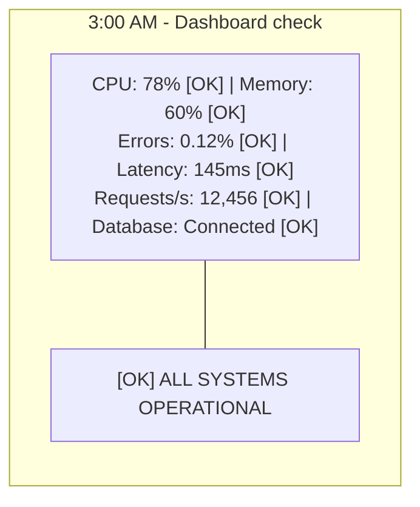

```text
3:05 AM - Slack channel

Support: "Users reporting checkout failures"
Support: "12 tickets in the last 5 minutes"
Support: "All from premium users?"

Engineer: "Dashboard shows everything green..."
Engineer: "Let me check logs..."
Engineer: "3.2 million log lines in the last hour"
Engineer: "Can't search by user ID"
Engineer: "Can't correlate across services"
Engineer: "I have no idea what's happening"
```

The production dashboard answered every single question it was explicitly designed to answer.
It fundamentally could not answer the only question that actually mattered.

In complex, highly distributed systems, you cannot possibly anticipate every failure state. You must build systems that allow operators to ask brand new, highly specific questions without requiring them to deploy new code or wait for new telemetry to be collected.

> **The Car Dashboard Analogy**
>
> A traditional car dashboard represents monitoring: it shows predefined metrics (speed, fuel level, engine temperature). But when something complex and weird happens—a strange, intermittent grinding noise or a vibration at exactly 65 miles per hour—the dashboard provides absolutely zero help. A master mechanic equipped with an advanced OBD-II diagnostic tool possesses observability: they can probe the vehicle's computer, trace specific sensor connections, read raw data streams in real-time, and discover exactly what is wrong without knowing in advance what specific part they needed to look for.

---

## Part 1: Monitoring vs. Observability Deep Dive

### 1.1 What is Monitoring?

**Monitoring** is the rigid practice of collecting predefined metrics and triggering automated alerts when those metrics cross established thresholds. It is inherently reactive and based entirely on historical assumptions about how a system will break.

**TRADITIONAL MONITORING WORKFLOW**
You define strictly in advance:
- What specifically to measure (CPU utilization, memory consumption, HTTP 500 error rate)
- What constitutes "normal" behavior (CPU remains under 80 percent)
- When exactly to trigger an alert (CPU exceeds 80 percent for 5 consecutive minutes)

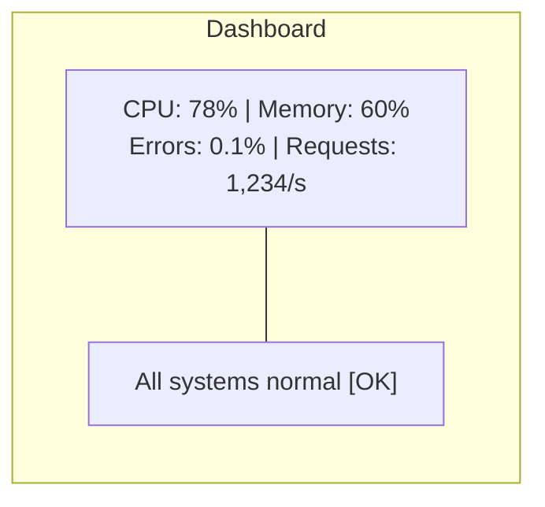

Monitoring exclusively answers the question: "Are the specific things I decided to watch still operating within their predefined healthy parameters?"

**Monitoring works exceptionally well when:**
- You know exactly what components can fail.
- System failures strictly match known historical patterns.
- The underlying architecture is relatively simple and tightly coupled.
- You are tracking physical hardware limits (disk space, network bandwidth).

### 1.2 What is Observability?

**Observability** is a fundamental property of a system. It is the ability to thoroughly understand a system's internal state solely by examining its external outputs—without needing to know in advance what specific problem you are looking for.

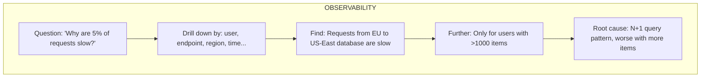

Observability empowers engineers to confidently answer: "Why is the system behaving this particular way right now?"

### 1.3 The Key Differences Outlined

To truly grasp the paradigm shift, we must contrast the operational realities of both approaches directly.

| Aspect | Monitoring | Observability |
|--------|------------|---------------|
| Questions | Predefined | Ad-hoc, exploratory |
| Approach | "Is X okay?" | "Why is this happening?" |
| Failure modes | Known in advance | Discovered during investigation |
| Data | Aggregated metrics | High-cardinality, detailed |
| Investigation | Dashboard → Runbook | Explore → Hypothesize → Verify |

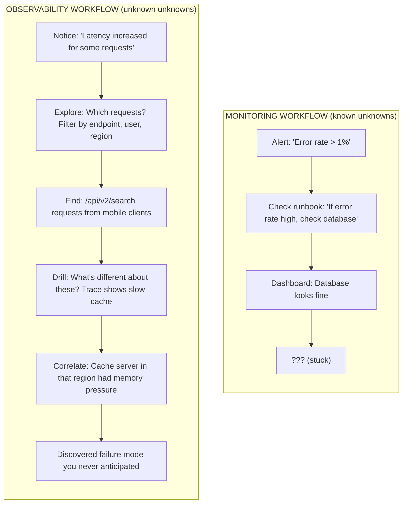

When relying solely on monitoring, an engineer hitting a dead end in a runbook is completely blind. With observability, the engineer possesses the data fidelity necessary to pivot their investigation instantly, following the trail of evidence wherever it leads.

---

> **Stop and think**: Why might adding a `user_id` tag to every log line be incredibly useful for debugging, but adding a `user_id` label to a Prometheus metric be potentially disastrous?

## Part 2: Why Traditional Monitoring Fails in Modern Contexts

### 2.1 The Cardinality Problem

Traditional monitoring systems heavily aggregate data to radically reduce storage costs and optimize query speeds. However, aggressive aggregation systematically destroys the very details required to debug complex issues.

**THE CARDINALITY PROBLEM EXPLAINED**

Imagine your application processes 1 million requests per hour. Your traditional monitoring dashboard shows:
- Average response latency: 100ms [OK]
- 99th percentile (p99) latency: 500ms [OK]
- Aggregate HTTP error rate: 0.5% [OK]

From a high-level operational perspective, everything looks perfectly fine! The system is green. But mathematical reality dictates that 0.5 percent of 1 million requests means 5,000 specific users had a terrible, broken experience.

What aggregate monitoring CANNOT possibly tell you:
- Which specific users experienced the failures?
- Which API endpoints were involved in the failed requests?
- What precise characteristics did those failed requests have in common?
- Why were those requests handled differently than the successful ones?

To answer these questions, you require high-cardinality dimensions. Cardinality refers to the number of unique values a specific data dimension can contain.

High-cardinality dimensions absolutely necessary for modern debugging include:
- `user_id` (potentially millions of unique values)
- `request_id` (billions of unique values)
- `trace_id` (billions of unique values)
- `customer_tenant_id`
- Exact combination of endpoint + parameters
- Geographic region + device type + OS version
- Specific combinations of active feature flags

Traditional time-series databases (like basic Prometheus setups) structurally cannot handle high cardinality. Every unique combination of labels creates a brand new time series in memory. Tracking a million user IDs would instantly crash the monitoring infrastructure due to memory exhaustion. You need an event-based observability platform to handle this scale of detail.

### 2.2 The Unknown Unknowns

You can only write monitoring rules for failures you can actively anticipate. However, complex, highly distributed systems fail in completely unexpected, novel ways.

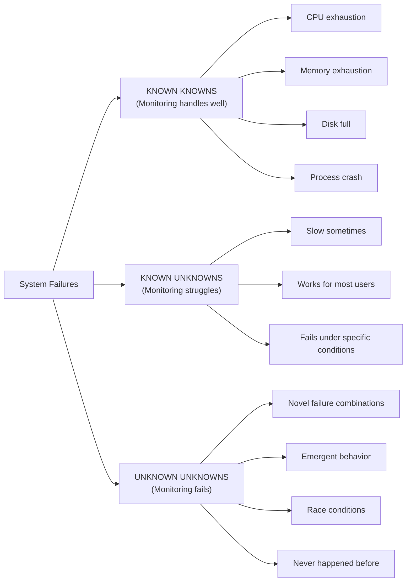

Observability empowers you to investigate "unknown unknowns" because you retain the raw, high-fidelity event data necessary to ask questions you did not think to ask when you initially architected the system.

### 2.3 Distributed System Complexity

Monitoring paradigms were originally designed for monolithic architectures. Distributed systems fundamentally break those old assumptions.

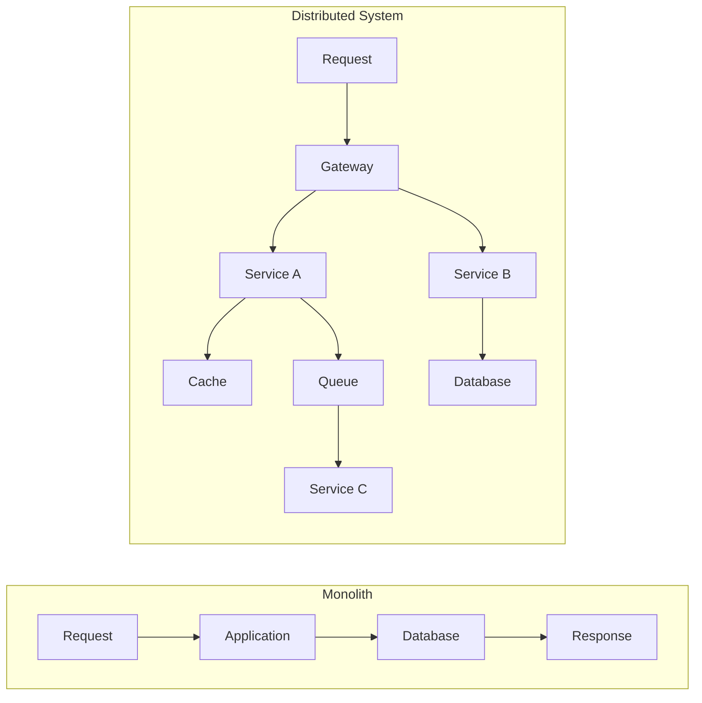

In a monolith, if a request fails, you can open a single log file, locate the stack trace, and understand exactly what happened. In a distributed microservices environment, a single user click might traverse an API gateway, invoke six different microservices, place a message on an asynchronous queue, and query three disparate databases. If the request fails, there is no single stack trace. The evidence is fragmented across dozens of servers. Distributed systems absolutely demand distributed observability.

---

## Part 3: The Observability Equation

### 3.1 Control Theory Origins

The term "observability" is not merely an industry buzzword; it is a rigorous mathematical concept derived from control theory, formally introduced by engineer Rudolf E. Kálmán in 1960.

In classical control theory, observability is a strict mathematical property of a dynamic system. It defines whether you can determine the complete internal state of a system entirely from its external outputs over a specific period.

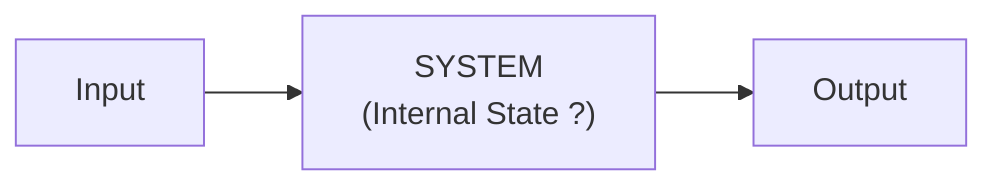

The fundamental equation is: Given the known inputs and the observed outputs, can we definitively deduce the internal state of the black box?

- **OBSERVABLE**: Yes. The outputs contain sufficient fidelity and detail that we know exactly what the system is doing internally. (Example: A car's speedometer output accurately reflects the vehicle's internal velocity state).
- **NOT OBSERVABLE**: No. The internal state is obfuscated or hidden from the outputs. (Example: A black box software application that outputs "Error 500" regardless of whether the database crashed, the disk filled up, or a null pointer exception occurred).

### 3.2 Software Observability

When applied to modern software engineering, observability translates to a very specific capability: **can you understand exactly why your software system is behaving the way it is in production, solely by examining the telemetry it emits?**

If an engineer has to SSH into a production server, attach a live debugger, or deploy a code hotfix just to add more logging to figure out why a bug is happening, the system is fundamentally NOT observable.

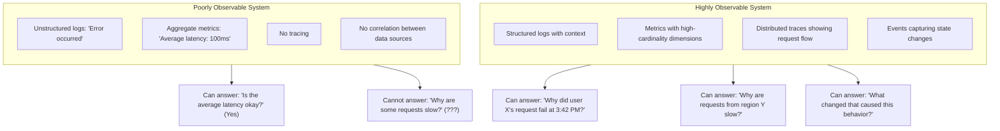

### 3.3 Properties of Observable Systems

A system does not become observable simply because you purchased a specific vendor's tool. Observability requires architectural commitment to specific data properties.

| Property | What It Means | Example |
|----------|---------------|---------|
| **High cardinality** | Many unique dimension values | `user_id`, not just "users" |
| **High dimensionality** | Many dimensions to slice by | user, endpoint, region, version, feature_flag |
| **Correlation** | Can connect data across sources | Trace ID links logs, metrics, traces |
| **Context preservation** | Details not aggregated away | Full request details, not just averages |
| **Queryability** | Can ask arbitrary questions | "Show me requests where X AND Y AND Z" |

---

## Part 4: The Observability Mindset

### 4.1 From "Know What's Wrong" to "Understand Behavior"

Achieving observability is as much a cultural and mindset shift as it is a technological one. Engineering teams must transition away from attempting to predict failure and instead focus on ensuring the system can always explain itself.

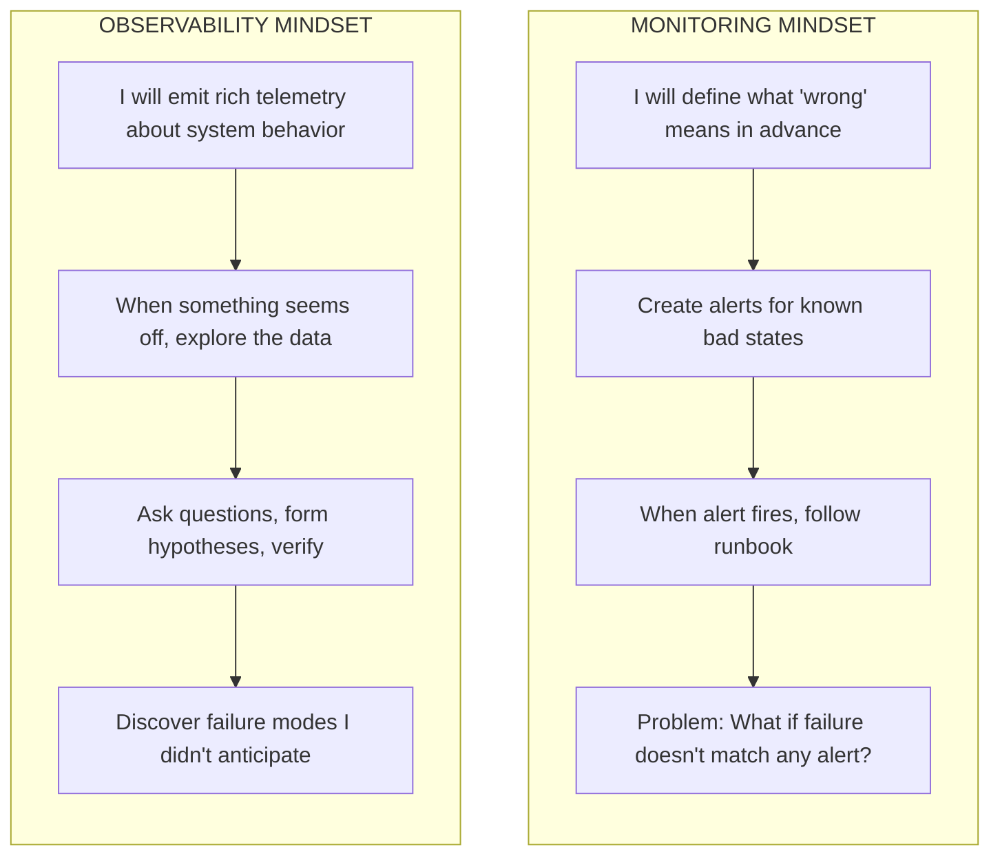

### 4.2 Exploration Over Dashboards

**DASHBOARD (monitoring)**
Dashboards provide fixed, rigid views of predefined metrics. They are excellent for keeping an eye on known important signals, but they are terrible for investigating completely new problems because they offer no drill-down capability into high-cardinality data.

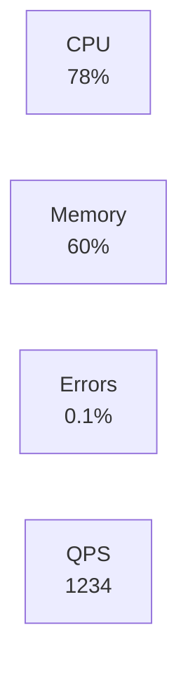

If these four dials do not clearly illuminate the root cause of the incident, the responding engineer is completely stuck.

**EXPLORATION (observability)**
Observability relies on a flexible, ad-hoc query interface designed for active investigation. This interface is optimized for slicing, dicing, and pivoting data to discover unknown correlations.

```text
> show requests where latency > 500ms
  → 5,234 requests (2.1%)

> group by endpoint
  → /api/search: 4,891 (94%)

> filter endpoint=/api/search, group by user_tier
  → premium: 12, free: 4,879

> Hypothesis: Free tier hitting rate limits?
```

### 4.3 Questions Observability Enables

With high-fidelity observability data, incident responders can confidently ask powerful questions during an ongoing crisis:

1. **"Why is this specific, individual request slow?"** - Analyzing the exact execution path rather than guessing based on fleet averages.
2. **"What do all these failing requests have in common?"** - Instant pattern discovery (e.g., they all share a specific geographic origin or device type).
3. **"What changed in the environment recently?"** - Deep correlation with deployment events, infrastructure configuration changes, or external dependency failures.
4. **"Is this a brand new failure mode?"** - Immediate historical comparison against baselines dating back weeks or months.
5. **"Exactly who is affected?"** - Precise impact scoping to inform customer communications and prioritize fixes based on business value.
6. **"What else is affected?"** - Rapid blast radius discovery to ensure cascading failures are intercepted before they compromise the entire platform.

> **War Story: The 5% Mystery That Cost Millions**
>
> **2019. A Major E-commerce Platform. Black Friday Weekend.**
>
> The site reliability team was highly confident heading into the busiest shopping day of the year. Their dashboards showed average latency across the platform holding steady at 180ms—well within their stringent Service Level Objectives (SLOs). The global error rate sat at 0.3%—an excellent metric for peak traffic. But customer support tickets began pouring in relentlessly: "Checkout won't complete." "The payment page hangs forever." "Your site is completely unusable."
>
> Initially, the engineering team dismissed the reports as user perception issues or isolated localized network problems. Their numbers looked fantastic. Leadership started questioning if the support team was exaggerating the severity.
>
> Then, a senior product manager arrived with damning business data: the cart abandonment rate at the final step had abruptly spiked 340%. Real customers were leaving without completing purchases. Revenue was actively hemorrhaging.
>
> **Day 1**: Engineers realized their metrics were blind to the issue. They scrambled to implement and deploy high-cardinality observability telemetry. Within two hours of the new data flowing, they discovered the truth: 5.2% of checkout requests were taking over 8 seconds to resolve—but this massive latency only applied to users matching a very specific profile.
>
> **Day 2**: Armed with queryable data, they drilled down ruthlessly. The affected users shared three distinct traits: (1) Their accounts were older than 2 years, (2) They were using the Safari web browser, and (3) They were physically connecting from the US East Coast.
>
> **Day 3**: The root cause was definitively isolated. A marketing feature flag, recently enabled for "loyal customers" (defined as accounts older than 2 years), actively triggered a new, experimental recommendation engine during checkout. That specific engine made a synchronous, blocking network call to a third-party analytics API. Safari's stricter internal browser timeouts exposed the systemic latency that Google Chrome was silently masking. Furthermore, the third-party API server was located exclusively in the US West region, adding an unavoidable 40ms round-trip time penalty specifically for East Coast users, pushing the total request time just over Safari's threshold.
>
> **Financial Impact**:
> - Directly lost revenue during the Black Friday window: $2.3 Million
> - Projected customer churn from frustrated loyal users: Estimated $8 Million annually
> - The actual technical fix took exactly 20 minutes to implement once found (simply disabling the feature flag).
>
> **The Lesson**: The team's traditional monitoring was technically flawless but operationally useless. Average latency was perfect. p99 latency was good. Error rates were great. But aggressive mathematical aggregation completely hid the severe pain of their most valuable, loyal customers. True, high-cardinality observability revealed the intricate, interconnected failure mode that aggregate metrics simply could not see.

---

## Part 5: Comparing Observability Tooling Approaches

When architecting a comprehensive observability strategy, engineering organizations frequently struggle with determining exactly where to begin their implementation journey. The industry standard provides three distinct primary data types—often conceptually referred to as the three pillars—which are logs, metrics, and traces. 

While a highly mature, elite engineering organization will seamlessly integrate and correlate all three data types, the stark reality of engineering bandwidth, budget constraints, and operational overhead means you must intelligently prioritize your initial rollout. Selecting the right starting point requires rigorously evaluating your specific architectural needs, identifying your primary failure domains, and understanding your organizational capacity. 

A fundamental mismatch between your underlying system architecture and your chosen tooling approach will inevitably result in exorbitant infrastructure costs and practically zero investigative value during an incident. You must align your tools with your pain points.

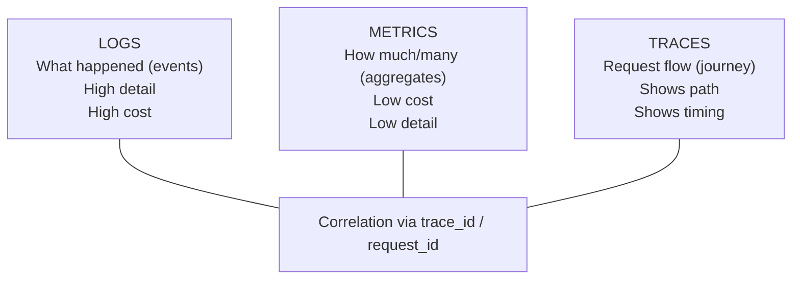

### The Metrics-First Approach

A metrics-first approach prioritizes the massive collection of numerical time-series data to deeply understand the aggregate health and performance of a system. Industry-standard tools like Prometheus and Grafana dominate this specific space. Metrics are incredibly cheap to store, transport, and query over long periods because they deliberately discard the underlying transactional context in favor of strict mathematical aggregation. You can comfortably track the CPU usage, memory consumption, and network throughput of 10,000 Kubernetes pods for fractions of a cent per day.

**Architectural Fit:** This approach is the definitively optimal starting point for infrastructure-heavy environments, bare-metal provisioning platforms, vast Kubernetes administrative clusters, or massive fleets of stateless background workers where individual request context is substantially less important than aggregate throughput and resource saturation. If your primary failure domain consists of hardware exhaustion, network interface saturation, or highly predictable cyclic scaling challenges, a metrics-first approach provides the absolute highest immediate return on investment.

**The Drawback:** When a specific, high-value customer complains about a slow API request, a metrics-first approach is virtually useless for finding that needle in the haystack. It only tells you the overall size, weight, and general health of the haystack itself.

### The Logs-First Approach

A logs-first approach prioritizes the robust emission, transportation, and indexing of discrete, timestamped system events (now almost exclusively formatted as structured JSON). Toolchains like the ELK stack (Elasticsearch, Logstash, Kibana) or enterprise solutions like Splunk are the traditional heavyweights here. Logs provide incredibly deep, granular context. A well-structured JSON log line can contain the specific user ID, the exact database query executed, a full error stack trace, and the precise state of the application's memory at that exact microsecond.

**Architectural Fit:** This is unequivocally the ideal starting point for legacy monolithic applications, modern macro-services, or systems characterized by a small number of very thick, complex services. In a monolith architecture, a single user request rarely leaves the main process boundary. This means a single, well-structured application log file contains the complete, uninterrupted narrative of any failure. If you operate a large, centralized application, investing heavily in structured logging (and powerful log aggregation and search) will yield immediate, profound debugging superpowers.

**The Drawback:** Logs are notoriously expensive to transport, index, and retain long-term. In a highly distributed, deeply decoupled microservices environment, a single user action might seamlessly generate 500 individual log lines scattered across 40 different virtual machines. Making sense of that fragmented narrative without extremely sophisticated correlation techniques is nearly impossible.

### The Traces-First Approach

A traces-first approach focuses aggressively on tracking the complete lifecycle of a single request as it dynamically traverses across network boundaries, queues, and multiple discrete microservices. Using open standards like OpenTelemetry and specialized backends like Jaeger or Honeycomb, tracing injects a unique, globally identifiable context header at the network edge and propagates it downstream through every single component.

**Architectural Fit:** This is the strictly mandatory starting point for deep microservice architectures, complex serverless environments, or heavily decoupled event-driven systems. When an application is composed of dozens or hundreds of independent, networked services, massive failures rarely occur because a single service crashed in isolation. They occur because Service A timed out waiting for Service D, which was rate-limited by Service F due to a cascading retry storm. Distributed tracing is the only viable approach that visually maps these intricate causal relationships and accurately highlights cross-boundary network latency bottlenecks.

**The Drawback:** Implementing comprehensive tracing requires explicitly modifying application code across the entire fleet to properly propagate context headers. This can be politically difficult and technically challenging in large organizations burdened with legacy codebases, divergent language stacks, or highly siloed development teams.

### Justifying Your Starting Point

To design a truly effective observability strategy, you must conduct a ruthless audit of your architecture and organizational pain points. 
- If you are undertaking a lift-and-shift of a massive legacy monolith, do not start with distributed tracing; mandate structured logging first to gain visibility into the monolith's behavior. 
- If you are responsible for managing a vast Kubernetes platform serving untrusted third-party workloads, prioritize a metrics-first rollout to ensure absolute cluster stability and node health. 
- If you are architecting a greenfield microservices application, you must mandate distributed tracing from day one, injecting OpenTelemetry SDKs before the service graph becomes too complex and tangled to instrument retroactively.

---

> **Stop and think**: If you were forced to choose only one of the three pillars (logs, metrics, or traces) to start improving a complex distributed system, which one would give you the highest immediate return on investment for debugging?

## Did You Know?

- **Honeycomb** (a leading observability company) was founded in 2016 on the core architectural principle that high-cardinality data is absolutely essential for modern debugging. Traditional monitoring tools couldn't handle millions of unique dimension values without crashing, so they built entirely new datastore systems optimized specifically for it.
- **Google's Dapper paper**, published to the industry in 2010, formally introduced the concept of distributed tracing to the wider engineering world. It detailed exactly how Google traces massive requests across thousands of internal services to understand emergent behavior. This groundbreaking paper directly inspired open-source projects like Zipkin, Jaeger, and eventually the OpenTelemetry standard.
- **The term "pillars"** (referring to logs, metrics, and traces) has been heavily criticized by observability practitioners since around 2018. Industry leaders like Charity Majors argue they are not independent pillars, but rather different views of the exact same underlying events. The rigid "pillar" framing often leads engineering teams to erroneously treat them as separate silos instead of deeply integrated data streams.
- **Twitter famously utilized a "Fail Whale"** error page during massive, cascading outages in its early days (around 2008). The engineering team couldn't effectively debug their rapidly expanding distributed issues because they fundamentally lacked observability—they possessed basic monitoring, but couldn't answer the crucial question of "why." This painful operational reality drove major, urgent investments in distributed tracing infrastructure that later influenced the entire tech industry.

---

## Common Mistakes

The path to true observability is fraught with organizational and technical pitfalls. Avoid these common anti-patterns.

| Mistake | Problem | Solution |
|---------|---------|----------|
| "We have dashboards, we're observable" | Dashboards are monitoring, not observability | Add queryable, high-cardinality data |
| Logging without structure | Can't query, can't correlate | Structured JSON logs with context |
| No request/trace IDs | Can't follow requests across services | Generate IDs at edge, propagate everywhere |
| Aggregating too early | Lose detail needed for debugging | Store raw events, aggregate at query time |
| Treating pillars as silos | Can't correlate logs, metrics, traces | Use common identifiers (`trace_id`) |
| Only instrumenting your code | Miss database, cache, external calls | Instrument at boundaries too |

---

## Quiz

Test your deep comprehension of observability theory and its practical application in complex engineering scenarios.

1. **You are the lead engineer for a new microservices platform. The VP of Engineering asks you to justify spending time implementing OpenTelemetry instead of just relying on the existing Prometheus setup that alerts on high CPU and memory. How do you explain the fundamental difference in what these approaches allow you to do during an incident?**
   <details>
   <summary>Answer</summary>

   Monitoring, like the existing Prometheus setup, is designed to answer predefined questions such as whether CPU or memory has crossed a known threshold. It tells you that something is wrong based on conditions you anticipated and planned for. Observability, on the other hand, allows you to ask arbitrary questions after the fact when an unknown issue occurs. When a novel failure mode happens in your new microservices platform, observability lets you explore the rich telemetry to understand why it is happening, even if you never predicted that specific failure scenario.
   </details>

2. **Your e-commerce checkout service has 10 endpoints and runs in 3 regions. Your team decides to add `user_id` (representing 1 million active users) as a label to your Prometheus metrics so you can track per-user latency. Two hours later, your Prometheus server crashes from out-of-memory errors. What caused this, and why do traditional metrics systems fail in this scenario?**
   <details>
   <summary>Answer</summary>

   Traditional metrics systems store time-series data where every unique combination of labels creates an entirely new time series in memory and on disk. By adding a high-cardinality dimension like `user_id` with 1 million distinct values, the number of time series exploded from 30 (10 endpoints × 3 regions) to 30 million. Storage, memory, and query costs grow linearly with this cardinality, quickly overwhelming the system's capacity. To handle this, true observability tools store raw events rather than pre-aggregated series, computing the aggregations only when a query is executed.
   </details>

3. **During a post-mortem, a senior architect mentions that the incident was hard to debug because the system "isn't fully observable in the control theory sense." The team had to deploy a hotfix just to add more logging to figure out what was wrong. How does the control theory definition of observability explain why this system failed the test?**
   <details>
   <summary>Answer</summary>

   In control theory, a system is considered observable if you can determine its complete internal state entirely by examining its external outputs, without needing to open the black box. Applied to software, this means your system should emit enough rich telemetry (logs, metrics, and traces) that you can understand why it is behaving a certain way without needing to modify it. Because the team had to add new instrumentation and deploy a hotfix to understand the system's state, the external outputs were inherently insufficient. Therefore, the system was not fully observable, forcing engineers to alter the system just to ask new questions.
   </details>

4. **You are migrating a legacy monolithic application to a Kubernetes cluster running 15 distinct microservices. The legacy app was easily debugged using a single application log file and local stack traces. A developer complains that debugging the new architecture takes hours. Why does the shift to distributed systems make traditional debugging inadequate, requiring a true observability strategy?**
   <details>
   <summary>Answer</summary>

   In a monolith, a single request is handled by one process, meaning a single stack trace or log file can usually tell the whole story of a failure. In a distributed system, a single request touches multiple services across different machines, destroying the single stack trace and scattering logs everywhere. Failures in distributed systems are often emergent, resulting from the complex interactions between services rather than a single broken component. Without observability practices like distributed tracing and cross-service correlation via shared IDs, engineers cannot reconstruct the request path, making it nearly impossible to diagnose these emergent failures.
   </details>

5. **Your payment gateway processes 1 million transactions daily. The dashboard shows an average latency of 150ms and a p99 latency of 400ms, which the team considers acceptable. However, customer support reports that 0.5% of requests take more than 5 seconds, causing timeouts. Calculate how many users experience this extreme latency daily, and explain why the monitoring dashboard completely missed them.**
   <details>
   <summary>Answer</summary>

   Out of 1 million daily requests, 0.5% translates to 5,000 users experiencing extreme latency every single day. The monitoring dashboard missed this because traditional aggregation metrics hide the outliers at the extreme tail. The average latency is heavily skewed by the 99.5% of fast requests, and the p99 metric only captures the boundary of the 99th percentile, remaining blind to the behavior of the top 1%. Without high-cardinality observability data to drill into that specific 0.5%, the monitoring system will continue to report that everything is fine while thousands of users suffer silently.
   </details>

6. **Your SaaS platform is expanding globally. You currently have 50 endpoints and operate in 10 regions, serving 2 million users. A junior developer proposes tracking the exact performance of every user by adding `user_id` as a label in your traditional time-series database. Calculate the resulting number of time series, and explain why this approach will cripple your monitoring infrastructure.**
   <details>
   <summary>Answer</summary>

   Multiplying 50 endpoints by 10 regions and 2 million users results in 1 billion distinct time series being generated. Traditional time-series databases like Prometheus are designed to handle millions of series, not billions, because each series consumes active memory and storage resources. Attempting to track 1 billion series would require astronomical amounts of memory, degrade query performance to a halt, and likely crash the infrastructure immediately. This is why tracking per-user performance requires an event-based observability platform that computes aggregates on demand rather than storing pre-aggregated series for every possible label combination.
   </details>

7. **A newly hired SRE looks at the company's toolchain and says, "We have Prometheus for metrics, Grafana for dashboards, and the ELK stack for logs. We are fully observable." You know that during the last outage, it took four hours to trace a single failing transaction across three services. How do you explain to the SRE the difference between having observability tools and actually achieving observability?**
   <details>
   <summary>Answer</summary>

   Having a specific set of tools does not automatically grant a system the property of observability. Observability is defined by what you can discover and understand about your system's behavior, not the brands of software you have installed. In this case, the inability to trace a single transaction across services in under four hours proves the system lacks correlation, such as shared trace IDs linking logs and metrics. While tools like Prometheus and ELK can be components of an observable system, without high-cardinality data, structured logging, and distributed tracing, they are merely functioning as fragmented monitoring tools.
   </details>

8. **Revisit the 2017 AWS S3 outage where an automation script removed too many servers, breaking the billing subsystem and consequently S3's index subsystem. During the 4-hour outage, the monitoring dashboards showed all individual servers as healthy. If the engineers had possessed a modern observability platform, what specific questions would they have been able to ask to quickly uncover the root cause?**
   <details>
   <summary>Answer</summary>

   With a modern observability platform, the engineers would have been able to ask exploratory questions like "What dependencies are failing for the S3 index subsystem?" or "What systemic changes occurred immediately prior to the error spike?" They could have queried the telemetry to see that while individual servers were healthy, the requests between the index and billing subsystems were timing out or failing across the board. Furthermore, they could have asked "What is the exact blast radius of the affected requests?", allowing them to trace the failure back to the specific automation script that removed the crucial instances, rather than blindly trusting the aggregate green health checks. This capability to interrogate the system's active connections would have drastically reduced the 4-hour mean time to resolution (MTTR) by pinpointing the issue's origin instantly.
   </details>

---

## Key Takeaways

```text
OBSERVABILITY ESSENTIALS CHECKLIST
═══════════════════════════════════════════════════════════════════════════════

UNDERSTANDING THE DIFFERENCE
[ ] Monitoring answers predefined questions ("Is CPU > 80%?")
[ ] Observability enables unknown questions ("Why are THESE requests slow?")
[ ] Dashboards showing green doesn't mean users are happy

THE CARDINALITY IMPERATIVE
[ ] Traditional metrics aggregate away the details you need
[ ] High cardinality (user_id, request_id) is essential for debugging
[ ] 5% of users having problems is 50,000 users at 1M requests/day

DISTRIBUTED SYSTEM REALITY
[ ] No single stack trace shows the full picture
[ ] Logs scattered across machines need correlation (trace_id)
[ ] Failures emerge from interactions, not individual components

THE OBSERVABILITY MINDSET
[ ] Emit rich telemetry, explore when problems arise
[ ] Form hypotheses, verify with data
[ ] Discover failure modes you didn't anticipate

STARTING THE JOURNEY
[ ] Structured logging with context (user_id, request_id)
[ ] Propagate trace IDs through all services
[ ] Enable ad-hoc queries, not just predefined dashboards
```

---

## Hands-On Exercise

**Task**: Rigorously evaluate the genuine observability maturity of a software system you actively operate or contribute to.

**Part 1: Current State Assessment**

Fill out this precise observability scorecard based on empirical reality, not future roadmap plans:

| Capability | Score (0-3) | Notes |
|------------|-------------|-------|
| **Structured logging** | | 0=none, 1=some, 2=most, 3=all |
| **Request IDs propagated** | | 0=none, 1=some services, 2=most, 3=all |
| **Distributed tracing** | | 0=none, 1=basic, 2=detailed, 3=comprehensive |
| **High-cardinality queries** | | 0=can't, 1=limited, 2=some, 3=any dimension |
| **Cross-service correlation** | | 0=manual, 1=partial, 2=mostly automated, 3=seamless |
| **Ad-hoc investigation** | | 0=impossible, 1=painful, 2=possible, 3=easy |

**Total: ___/18**

Interpretation Guide:
- 0-6: Monitoring only. You have major observability gaps and are highly vulnerable to unknown-unknowns.
- 7-12: Partial observability. You can debug some issues but will struggle with complex distributed failures.
- 13-18: Good observability. You can confidently investigate and resolve most novel issues efficiently.

**Part 2: Strategic Gap Analysis**

For your lowest-scoring capabilities identified above, complete the following strategic breakdown:

| Capability | Current State | What's Missing | First Step to Improve |
|------------|---------------|----------------|----------------------|
| | | | |
| | | | |
| | | | |

**Part 3: Practical Investigation Scenario Simulation**

Imagine this extremely common operational scenario occurs during your shift:
> "Multiple users report that the checkout page is intermittently slow, but your primary application dashboard shows completely normal latency averages."

Document the exact technical steps you would take to investigate this within your current system constraints:

1. What specific dashboard or log index would you look at first?
2. What ad-hoc questions would you attempt to answer to narrow the scope?
3. What critical telemetry data would you need to find the root cause that you might not actually have available?
4. At what precise point would you likely get stuck relying entirely on your current toolchain?

**Success Criteria Checklist**:
- [ ] Scorecard comprehensively completed with an honest, empirical assessment of current capabilities.
- [ ] At least two critical observability gaps identified with actionable, technical improvement steps.
- [ ] The simulated investigation scenario clearly demonstrates a deep understanding of the fundamental differences between a monitoring mindset and an observability mindset.
- [ ] Explicitly identified at least one critical data telemetry gap in the current operational system that prevents tracking unknown-unknowns.

---

## Further Reading

- **"Observability Engineering"** - Charity Majors, Liz Fong-Jones, George Miranda. The definitive industry text detailing core observability concepts, cultural shifts, and technical practices.
- **"Distributed Systems Observability"** - Cindy Sridharan. An excellent free ebook covering the profound necessity of observability specifically within highly distributed systems.
- **"Dapper, a Large-Scale Distributed Systems Tracing Infrastructure"** - The seminal Google engineering paper that fundamentally introduced distributed tracing to the wider industry.

---

## Next Module

[Module 3.2: The Three Pillars](../module-3.2-the-three-pillars/) - Prepare for a technical deep dive into logs, metrics, and traces—uncovering exactly what each data type provides, where they fall short, and how they must be correlated together to achieve true observability in production environments.