> **Complexity**: `[MEDIUM]`
>
> **Time to Complete**: 30-35 minutes
>
> **Prerequisites**: [Reliability Engineering Track](/platform/foundations/reliability-engineering/) (recommended)
>
> **Track**: Foundations

### What You'll Be Able to Do

After completing this module, you will be able to:

1. **Explain** why observability differs fundamentally from monitoring and when each approach is appropriate
2. **Evaluate** a system's observability maturity by assessing whether engineers can answer novel questions about system behavior without deploying new code
3. **Design** an observability strategy that enables debugging unknown-unknowns rather than only alerting on predefined failure conditions
4. **Compare** observability tooling approaches (metrics-first, logs-first, traces-first) and justify the right starting point for a given architecture

---

> **Pause and predict**: If all your dashboard metrics are green but customers are reporting massive failures, where does the fault lie? Is it the system, the dashboard, or the questions the dashboard was designed to answer?

## The Dashboard That Showed Green While the Company Lost Millions

**March 2017. Amazon Web Services. 9:37 AM Pacific Time.**

The senior engineer's dashboard shows nothing wrong. CPU utilization: normal. Memory: normal. Error rate: 0.02%. Network: stable. All the lines are green. Every metric within threshold.

But the phone won't stop ringing.

"The S3 console won't load."
"Our static assets are 404ing."
"Entire us-east-1 seems broken."

The engineer stares at the dashboard. It's lying to him. Everything says "fine" while half the internet is on fire.

Here's what happened: An engineer ran an automation script to remove a small number of S3 servers. A typo caused far more servers to be removed than intended. The billing subsystem—dependent on those servers—started failing. S3's index subsystem couldn't query billing. S3 couldn't serve any objects.

Thousands of websites went dark. Major platforms like Slack, Quora, and Trello became unavailable. The outage lasted 4 hours.

**Cost**: Estimated $150-160 million in losses across affected businesses.

**The dashboard problem**: All the metrics were designed to answer "Is this specific thing okay?" None could answer "Why are customers screaming while our graphs show green?"

This is the difference between **monitoring** and **observability**.

Monitoring asks: "Is X within threshold?"
Observability asks: "Why is the system behaving this way?"

The S3 team had world-class monitoring. Every server reported health. Every metric was collected. But they couldn't see that the *relationship* between systems was broken. They could see the trees were green; they couldn't see the forest was on fire.

**This incident changed how AWS thinks about observability.** They invested heavily in distributed tracing, request correlation, and the ability to ask questions they hadn't anticipated needing to ask.

---

## Why This Module Matters

It's 3 AM. The on-call engineer's phone buzzes: "High latency detected." The dashboard opens. Everything looks... fine. CPU is normal. Memory is normal. Error rate is low. But users are complaining. Something is wrong, and nobody can see what.

This is the gap between **monitoring** and **observability**. Monitoring tells you when predefined things go wrong. Observability lets you understand why your system is behaving the way it is—even when you didn't predict the failure mode in advance.

**THE MONITORING TRAP**

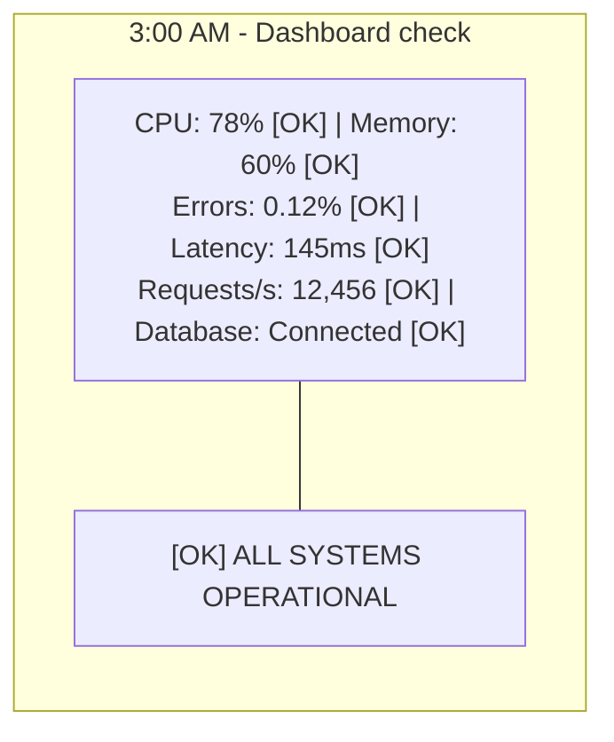

```text
3:05 AM - Slack channel

Support: "Users reporting checkout failures"
Support: "12 tickets in the last 5 minutes"
Support: "All from premium users?"

Engineer: "Dashboard shows everything green..."
Engineer: "Let me check logs..."
Engineer: "3.2 million log lines in the last hour"
Engineer: "Can't search by user ID"
Engineer: "Can't correlate across services"
Engineer: "I have no idea what's happening"
```

The dashboard answered every question it was designed to answer.
It couldn't answer the question that mattered.

In complex distributed systems, you can't anticipate every failure. You need systems that let you ask new questions without deploying new code.

> **The Car Dashboard Analogy**
>
> A car dashboard is monitoring: it shows predefined metrics (speed, fuel, temperature). But when something weird happens—a strange noise, intermittent vibration—the dashboard doesn't help. A mechanic with diagnostic tools has observability: they can probe the system, trace connections, and discover what's wrong without knowing in advance what to look for.

---

## What You'll Learn

- The difference between monitoring and observability
- Where observability came from (control theory)
- The observability equation: can you understand internal state from external outputs?
- Why traditional monitoring fails for distributed systems
- The mindset shift required for observability

---

## Part 1: Monitoring vs. Observability

### 1.1 What is Monitoring?

**Monitoring** is collecting predefined metrics and alerting when they cross thresholds.

**TRADITIONAL MONITORING**
You define in advance:
- What to measure (CPU, memory, error rate)
- What's normal (CPU < 80%)
- When to alert (CPU > 80% for 5 minutes)

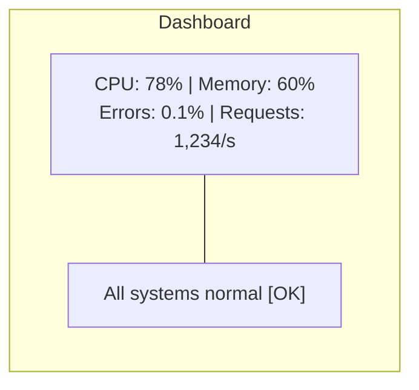

Monitoring answers: "Are the things I decided to watch okay?"

**Monitoring works when:**
- You know what can go wrong
- Failures match known patterns
- Systems are relatively simple

### 1.2 What is Observability?

**Observability** is the ability to understand a system's internal state by examining its outputs—without knowing in advance what you're looking for.

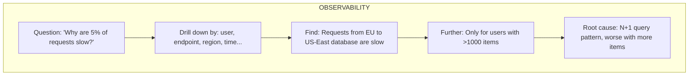

Observability answers: "Why is the system behaving this way?"

### 1.3 The Key Difference

| Aspect | Monitoring | Observability |
|--------|------------|---------------|
| Questions | Predefined | Ad-hoc, exploratory |
| Approach | "Is X okay?" | "Why is this happening?" |
| Failure modes | Known in advance | Discovered during investigation |
| Data | Aggregated metrics | High-cardinality, detailed |
| Investigation | Dashboard → Runbook | Explore → Hypothesize → Verify |

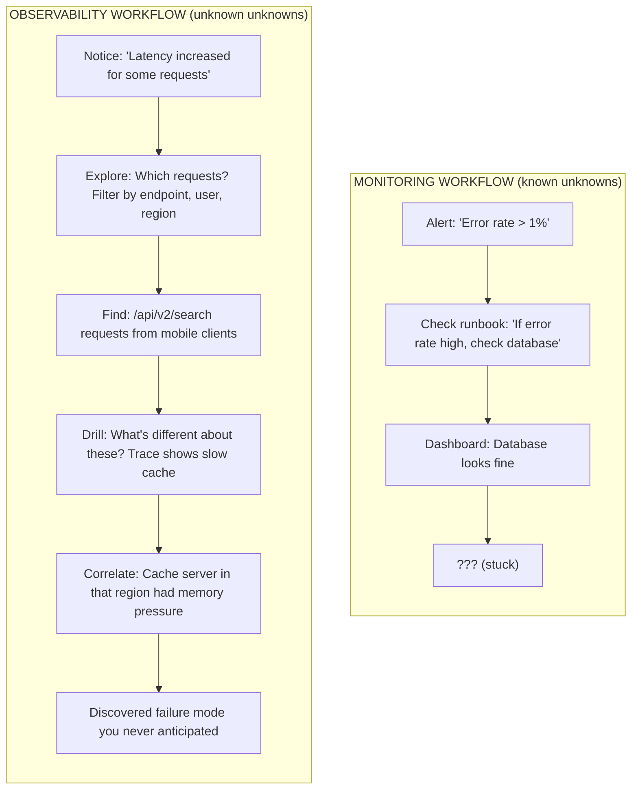

> **Did You Know?**
>
> The term "observability" comes from control theory, coined by Rudolf Kálmán in 1960. In control theory, a system is "observable" if you can determine its complete internal state from its outputs. Software adopted this concept because modern distributed systems are too complex to monitor every internal state directly.

---

> **Stop and think**: Why might adding a `user_id` tag to every log line be incredibly useful for debugging, but adding a `user_id` label to a Prometheus metric be potentially disastrous?

## Part 2: Why Monitoring Isn't Enough

### 2.1 The Cardinality Problem

Traditional monitoring aggregates data to reduce storage. But aggregation hides details.

**THE CARDINALITY PROBLEM**

You have 1 million requests. Monitoring shows:
- Average latency: 100ms [OK]
- p99 latency: 500ms [OK]
- Error rate: 0.5% [OK]

Everything looks fine! But 5,000 users had terrible experience.

What monitoring CAN'T tell you:
- Which users?
- Which endpoints?
- What did those requests have in common?
- Why were they different?

High-cardinality dimensions you need:
- `user_id` (millions of values)
- `request_id` (billions of values)
- `trace_id` (billions of values)
- endpoint + parameters
- geographic region
- device type
- feature flags enabled

Traditional metrics can't handle this. You need observability.

### 2.2 The Unknown Unknowns

You can only monitor what you anticipate. But complex systems fail in unexpected ways.

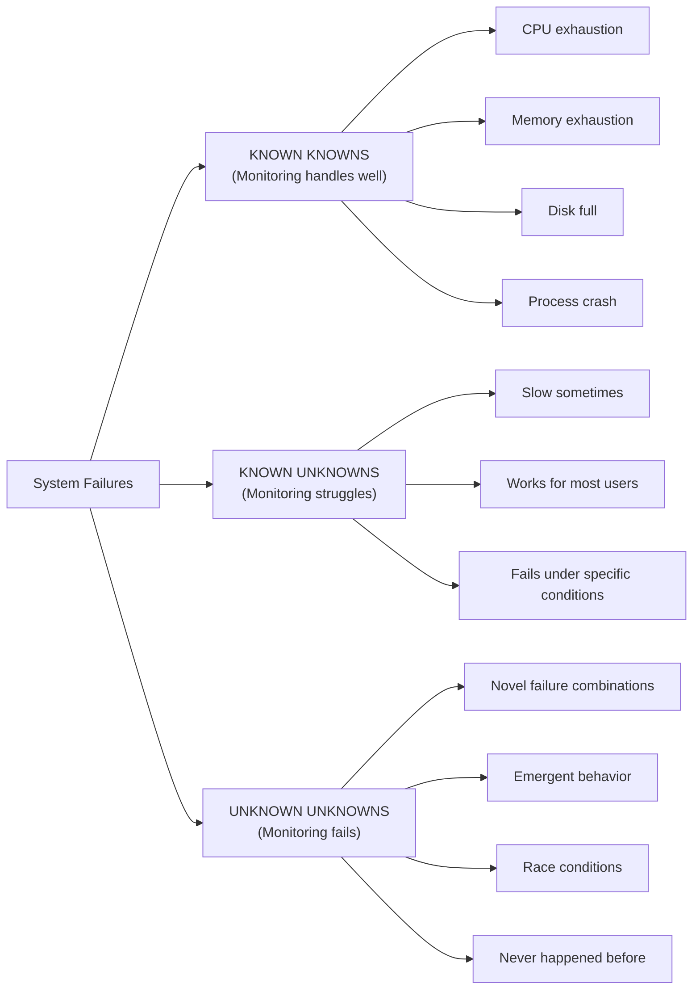

Observability lets you investigate unknown unknowns because you can ask questions you didn't think to ask in advance.

### 2.3 Distributed System Complexity

Monitoring was designed for monoliths. Distributed systems need more:

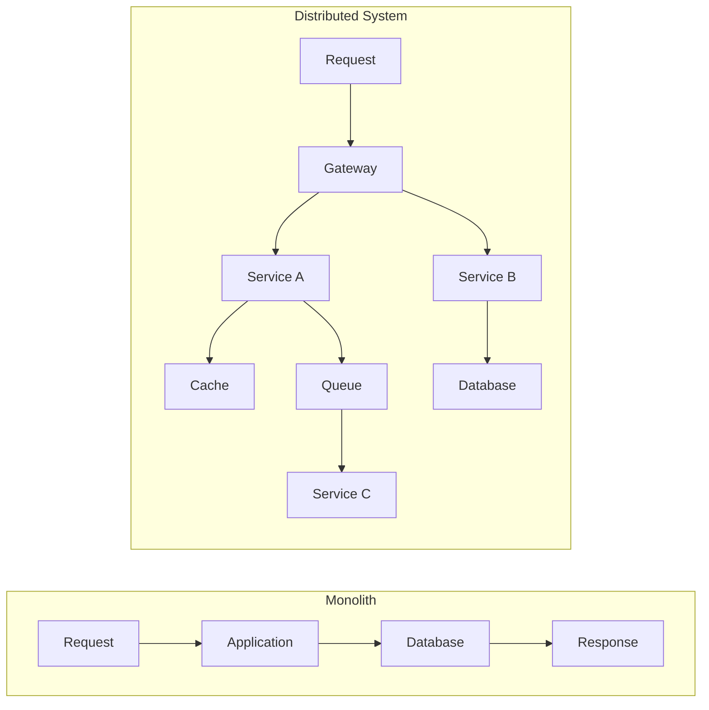

Distributed systems need distributed observability.

> **Try This (2 minutes)**
>
> Think about a recent debugging session. Did you:
> - Follow a runbook? (Monitoring mindset)
> - Explore and ask questions? (Observability mindset)
> - Get stuck because you couldn't see enough? (Gap between the two)

---

## Part 3: The Observability Equation

### 3.1 Control Theory Origins

In control theory, **observability** is a mathematical property: can you determine the internal state of a system from its external outputs?

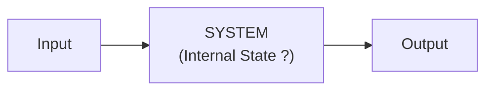

Question: Given the outputs, can we know the internal state?

- **OBSERVABLE**: Yes, outputs tell us everything we need (e.g., A car's speedometer output tells you internal velocity state)
- **NOT OBSERVABLE**: Internal state is hidden from outputs (e.g., A black box that outputs the same value regardless of input)

### 3.2 Software Observability

Applied to software, observability means: **can you understand why your system is behaving the way it is, just by examining telemetry?**

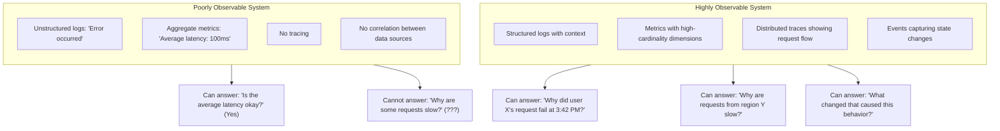

### 3.3 Properties of Observable Systems

| Property | What It Means | Example |
|----------|---------------|---------|
| **High cardinality** | Many unique dimension values | `user_id`, not just "users" |
| **High dimensionality** | Many dimensions to slice by | user, endpoint, region, version, feature_flag |
| **Correlation** | Can connect data across sources | Trace ID links logs, metrics, traces |
| **Context preservation** | Details not aggregated away | Full request details, not just averages |
| **Queryability** | Can ask arbitrary questions | "Show me requests where X AND Y AND Z" |

> **Try This (2 minutes)**
>
> Pick a recent production issue. Could you have answered these questions with your current tools?
>
> | Question | Could You Answer It? |
> |----------|---------------------|
> | "Show me all requests from user X in the last hour" | Yes / No / Partially |
> | "What do the slowest 1% of requests have in common?" | Yes / No / Partially |
> | "Which version of the code handled this request?" | Yes / No / Partially |
> | "What other requests were happening at the same time?" | Yes / No / Partially |
>
> Each "No" reveals an observability gap.

---

## Part 4: The Observability Mindset

### 4.1 From "Know What's Wrong" to "Understand Behavior"

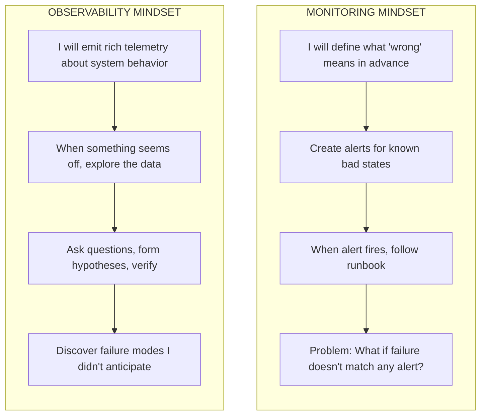

### 4.2 Exploration Over Dashboards

**DASHBOARD (monitoring)**
Fixed views of predefined metrics. Good for known important signals, bad for investigating new problems.

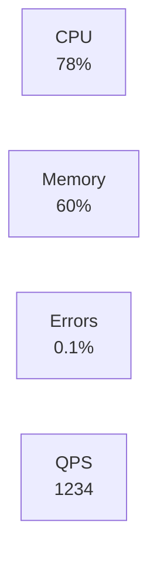

If these don't show the problem, you're stuck.

**EXPLORATION (observability)**
Query interface for ad-hoc investigation. Good for discovering unknown issues.
```text
> show requests where latency > 500ms
  → 5,234 requests (2.1%)

> group by endpoint
  → /api/search: 4,891 (94%)

> filter endpoint=/api/search, group by user_tier
  → premium: 12, free: 4,879

> Hypothesis: Free tier hitting rate limits?
```

### 4.3 Questions Observability Enables

With good observability, you can ask:

1. **"Why is this specific request slow?"** - Not averages, this one request
2. **"What do failing requests have in common?"** - Pattern discovery
3. **"What changed?"** - Correlation with deploys, config, external factors
4. **"Is this new?"** - Historical comparison
5. **"Who is affected?"** - Impact scoping
6. **"What else is affected?"** - Blast radius discovery

> **War Story: The 5% Mystery That Cost Millions**
>
> **2019. A Major E-commerce Platform. Black Friday Weekend.**
>
> The site reliability team was confident. Dashboards showed average latency at 180ms—well within SLO. Error rate sat at 0.3%—excellent. But customer support tickets kept flooding in: "Checkout won't complete." "Payment page hangs forever." "Your site is unusable."
>
> The team dismissed it as user perception. The numbers looked great. Leadership started questioning if support was exaggerating.
>
> Then a product manager showed up with data: abandoned cart rate had spiked 340%. Customers were leaving without buying. Revenue was hemorrhaging.
>
> **Day 1**: Engineers added high-cardinality observability. Within 2 hours, they discovered 5.2% of checkout requests took over 8 seconds—but only for users matching a specific pattern.
>
> **Day 2**: They drilled down. Affected users had: (1) accounts older than 2 years, (2) Safari browser, (3) connecting from US East Coast.
>
> **Day 3**: Root cause found. A feature flag enabled for "loyal customers" (accounts >2 years) triggered a new recommendation engine. That engine made a synchronous call to a third-party API. Safari's stricter timeouts exposed latency that Chrome masked. The API server was in US West, adding 40ms RTT for East Coast users.
>
> **Financial Impact**:
> - Lost revenue during Black Friday: $2.3M
> - Customer churn from frustrated loyal customers: estimated $8M annually
> - Fix took 20 minutes once they found it (disable feature flag)
>
> **The Lesson**: Their monitoring was technically excellent. Average latency? Perfect. p99? Good. Error rate? Great. But averages hid the pain of their most valuable customers. High-cardinality observability revealed what aggregate metrics couldn't see.

---

> **Stop and think**: If you were forced to choose only one of the three pillars (logs, metrics, or traces) to start improving a complex distributed system, which one would give you the highest immediate return on investment for debugging?

## Part 5: Building Toward Observability

### 5.1 The Three Pillars (Preview)

Observability is built on three complementary data types:

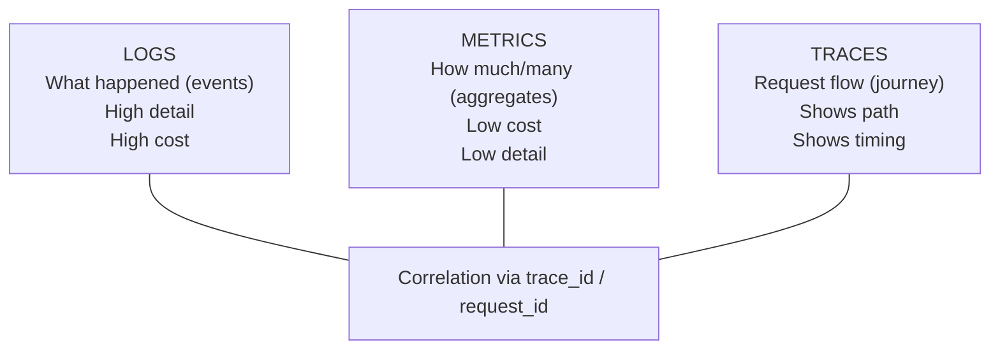

We'll explore each pillar in detail in Module 3.2.

### 5.2 Starting the Journey

You don't need to build everything at once. Start with:

1. **Structured logging** - Add context to logs (`user_id`, `request_id`)
2. **Request IDs** - Generate unique IDs that flow through all services
3. **Meaningful metrics** - Beyond CPU/memory, measure what matters to users
4. **Correlation** - Link logs, metrics, and traces with shared IDs

> **Try This (3 minutes)**
>
> Evaluate your current system:
>
> | Question | Yes/No |
> |----------|--------|
> | Can you trace a single request through all services? | |
> | Can you filter logs by user_id? | |
> | Can you see which users are affected by an issue? | |
> | Can you ask questions you didn't pre-define? | |
>
> Each "No" is an observability gap.

---

## Did You Know?

- **Honeycomb** (observability company) was founded on the principle that high-cardinality data is essential. Traditional monitoring tools couldn't handle millions of unique values, so they built new systems optimized for it.

- **Google's Dapper** paper (2010) introduced distributed tracing to the industry. It showed how Google traces requests across thousands of services to understand behavior. This paper inspired Zipkin, Jaeger, and eventually OpenTelemetry.

- **The term "pillars"** (logs, metrics, traces) has been criticized by observability practitioners. Charity Majors argues they're not pillars but rather different views of the same events. The "pillar" framing can lead teams to treat them as separate silos instead of integrated data.

- **Twitter famously had a "Fail Whale"** page during outages in its early days. The engineering team couldn't debug distributed issues because they lacked observability—they had monitoring but couldn't answer "why." This drove major investments in distributed tracing that later influenced the industry.

---

## Common Mistakes

| Mistake | Problem | Solution |
|---------|---------|----------|
| "We have dashboards, we're observable" | Dashboards are monitoring, not observability | Add queryable, high-cardinality data |
| Logging without structure | Can't query, can't correlate | Structured JSON logs with context |
| No request/trace IDs | Can't follow requests across services | Generate IDs at edge, propagate everywhere |
| Aggregating too early | Lose detail needed for debugging | Store raw events, aggregate at query time |
| Treating pillars as silos | Can't correlate logs, metrics, traces | Use common identifiers (`trace_id`) |
| Only instrumenting your code | Miss database, cache, external calls | Instrument at boundaries too |

---

## Quiz

1. **You are the lead engineer for a new microservices platform. The VP of Engineering asks you to justify spending time implementing OpenTelemetry instead of just relying on the existing Prometheus setup that alerts on high CPU and memory. How do you explain the fundamental difference in what these approaches allow you to do during an incident?**
   <details>
   <summary>Answer</summary>

   Monitoring, like the existing Prometheus setup, is designed to answer predefined questions such as whether CPU or memory has crossed a known threshold. It tells you that something is wrong based on conditions you anticipated and planned for. Observability, on the other hand, allows you to ask arbitrary questions after the fact when an unknown issue occurs. When a novel failure mode happens in your new microservices platform, observability lets you explore the rich telemetry to understand why it is happening, even if you never predicted that specific failure scenario.
   </details>

2. **Your e-commerce checkout service has 10 endpoints and runs in 3 regions. Your team decides to add `user_id` (representing 1 million active users) as a label to your Prometheus metrics so you can track per-user latency. Two hours later, your Prometheus server crashes from out-of-memory errors. What caused this, and why do traditional metrics systems fail in this scenario?**
   <details>
   <summary>Answer</summary>

   Traditional metrics systems store time-series data where every unique combination of labels creates an entirely new time series in memory and on disk. By adding a high-cardinality dimension like `user_id` with 1 million distinct values, the number of time series exploded from 30 (10 endpoints × 3 regions) to 30 million. Storage, memory, and query costs grow linearly with this cardinality, quickly overwhelming the system's capacity. To handle this, true observability tools store raw events rather than pre-aggregated series, computing the aggregations only when a query is executed.
   </details>

3. **During a post-mortem, a senior architect mentions that the incident was hard to debug because the system "isn't fully observable in the control theory sense." The team had to deploy a hotfix just to add more logging to figure out what was wrong. How does the control theory definition of observability explain why this system failed the test?**
   <details>
   <summary>Answer</summary>

   In control theory, a system is considered observable if you can determine its complete internal state entirely by examining its external outputs, without needing to open the black box. Applied to software, this means your system should emit enough rich telemetry (logs, metrics, and traces) that you can understand why it is behaving a certain way without needing to modify it. Because the team had to add new instrumentation and deploy a hotfix to understand the system's state, the external outputs were inherently insufficient. Therefore, the system was not fully observable, forcing engineers to alter the system just to ask new questions.
   </details>

4. **You are migrating a legacy monolithic application to a Kubernetes cluster running 15 distinct microservices. The legacy app was easily debugged using a single application log file and local stack traces. A developer complains that debugging the new architecture takes hours. Why does the shift to distributed systems make traditional debugging inadequate, requiring a true observability strategy?**
   <details>
   <summary>Answer</summary>

   In a monolith, a single request is handled by one process, meaning a single stack trace or log file can usually tell the whole story of a failure. In a distributed system, a single request touches multiple services across different machines, destroying the single stack trace and scattering logs everywhere. Failures in distributed systems are often emergent, resulting from the complex interactions between services rather than a single broken component. Without observability practices like distributed tracing and cross-service correlation via shared IDs, engineers cannot reconstruct the request path, making it nearly impossible to diagnose these emergent failures.
   </details>

5. **Your payment gateway processes 1 million transactions daily. The dashboard shows an average latency of 150ms and a p99 latency of 400ms, which the team considers acceptable. However, customer support reports that 0.5% of requests take more than 5 seconds, causing timeouts. Calculate how many users experience this extreme latency daily, and explain why the monitoring dashboard completely missed them.**
   <details>
   <summary>Answer</summary>

   Out of 1 million daily requests, 0.5% translates to 5,000 users experiencing extreme latency every single day. The monitoring dashboard missed this because traditional aggregation metrics hide the outliers at the extreme tail. The average latency is heavily skewed by the 99.5% of fast requests, and the p99 metric only captures the boundary of the 99th percentile, remaining blind to the behavior of the top 1%. Without high-cardinality observability data to drill into that specific 0.5%, the monitoring system will continue to report that everything is fine while thousands of users suffer silently.
   </details>

6. **Your SaaS platform is expanding globally. You currently have 50 endpoints and operate in 10 regions, serving 2 million users. A junior developer proposes tracking the exact performance of every user by adding `user_id` as a label in your traditional time-series database. Calculate the resulting number of time series, and explain why this approach will cripple your monitoring infrastructure.**
   <details>
   <summary>Answer</summary>

   Multiplying 50 endpoints by 10 regions and 2 million users results in 1 billion distinct time series being generated. Traditional time-series databases like Prometheus are designed to handle millions of series, not billions, because each series consumes active memory and storage resources. Attempting to track 1 billion series would require astronomical amounts of memory, degrade query performance to a halt, and likely crash the infrastructure immediately. This is why tracking per-user performance requires an event-based observability platform that computes aggregates on demand rather than storing pre-aggregated series for every possible label combination.
   </details>

7. **A newly hired SRE looks at the company's toolchain and says, "We have Prometheus for metrics, Grafana for dashboards, and the ELK stack for logs. We are fully observable." You know that during the last outage, it took four hours to trace a single failing transaction across three services. How do you explain to the SRE the difference between having observability tools and actually achieving observability?**
   <details>
   <summary>Answer</summary>

   Having a specific set of tools does not automatically grant a system the property of observability. Observability is defined by what you can discover and understand about your system's behavior, not the brands of software you have installed. In this case, the inability to trace a single transaction across services in under four hours proves the system lacks correlation, such as shared trace IDs linking logs and metrics. While tools like Prometheus and ELK can be components of an observable system, without high-cardinality data, structured logging, and distributed tracing, they are merely functioning as fragmented monitoring tools.
   </details>

8. **Revisit the 2017 AWS S3 outage where an automation script removed too many servers, breaking the billing subsystem and consequently S3's index subsystem. During the 4-hour outage, the monitoring dashboards showed all individual servers as healthy. If the engineers had possessed a modern observability platform, what specific questions would they have been able to ask to quickly uncover the root cause?**
   <details>
   <summary>Answer</summary>

   With a modern observability platform, the engineers would have been able to ask exploratory questions like "What dependencies are failing for the S3 index subsystem?" or "What systemic changes occurred immediately prior to the error spike?" They could have queried the telemetry to see that while individual servers were healthy, the requests between the index and billing subsystems were timing out or failing across the board. Furthermore, they could have asked "What is the exact blast radius of the affected requests?", allowing them to trace the failure back to the specific automation script that removed the crucial instances, rather than blindly trusting the aggregate green health checks. This capability to interrogate the system's active connections would have drastically reduced the 4-hour mean time to resolution (MTTR) by pinpointing the issue's origin instantly.
   </details>

---

## Key Takeaways

```text
OBSERVABILITY ESSENTIALS CHECKLIST
═══════════════════════════════════════════════════════════════════════════════

UNDERSTANDING THE DIFFERENCE
[ ] Monitoring answers predefined questions ("Is CPU > 80%?")
[ ] Observability enables unknown questions ("Why are THESE requests slow?")
[ ] Dashboards showing green doesn't mean users are happy

THE CARDINALITY IMPERATIVE
[ ] Traditional metrics aggregate away the details you need
[ ] High cardinality (user_id, request_id) is essential for debugging
[ ] 5% of users having problems is 50,000 users at 1M requests/day

DISTRIBUTED SYSTEM REALITY
[ ] No single stack trace shows the full picture
[ ] Logs scattered across machines need correlation (trace_id)
[ ] Failures emerge from interactions, not individual components

THE OBSERVABILITY MINDSET
[ ] Emit rich telemetry, explore when problems arise
[ ] Form hypotheses, verify with data
[ ] Discover failure modes you didn't anticipate

STARTING THE JOURNEY
[ ] Structured logging with context (user_id, request_id)
[ ] Propagate trace IDs through all services
[ ] Enable ad-hoc queries, not just predefined dashboards
```

---

## Hands-On Exercise

**Task**: Evaluate the observability of a system you work with.

**Part 1: Current State Assessment (10 minutes)**

Fill out this observability scorecard:

| Capability | Score (0-3) | Notes |
|------------|-------------|-------|
| **Structured logging** | | 0=none, 1=some, 2=most, 3=all |
| **Request IDs propagated** | | 0=none, 1=some services, 2=most, 3=all |
| **Distributed tracing** | | 0=none, 1=basic, 2=detailed, 3=comprehensive |
| **High-cardinality queries** | | 0=can't, 1=limited, 2=some, 3=any dimension |
| **Cross-service correlation** | | 0=manual, 1=partial, 2=mostly automated, 3=seamless |
| **Ad-hoc investigation** | | 0=impossible, 1=painful, 2=possible, 3=easy |

**Total: ___/18**

Interpretation:
- 0-6: Monitoring only, major observability gaps
- 7-12: Partial observability, can debug some issues
- 13-18: Good observability, can investigate most issues

**Part 2: Gap Analysis (10 minutes)**

For your lowest-scoring capabilities:

| Capability | Current State | What's Missing | First Step to Improve |
|------------|---------------|----------------|----------------------|
| | | | |
| | | | |
| | | | |

**Part 3: Investigation Scenario (10 minutes)**

Imagine this scenario:
> "Users report that the checkout page is slow, but only sometimes. Your dashboard shows normal latency."

Write down the steps you'd take to investigate:

1. What would you look at first?
2. What questions would you try to answer?
3. What data would you need that you might not have?
4. Where would you get stuck with your current tools?

**Success Criteria**:
- [ ] Scorecard completed with honest assessment
- [ ] At least 2 gaps identified with improvement steps
- [ ] Investigation scenario shows understanding of observability vs monitoring approach
- [ ] Identified at least one data gap in current system

---

## Further Reading

- **"Observability Engineering"** - Charity Majors, Liz Fong-Jones, George Miranda. The definitive book on observability concepts and practices.

- **"Distributed Systems Observability"** - Cindy Sridharan. Free ebook covering observability in distributed systems.

- **"Dapper, a Large-Scale Distributed Systems Tracing Infrastructure"** - Google paper that introduced distributed tracing.

---

## Next Module

[Module 3.2: The Three Pillars](../module-3.2-the-three-pillars/) - Deep dive into logs, metrics, and traces—what each provides and how they work together.