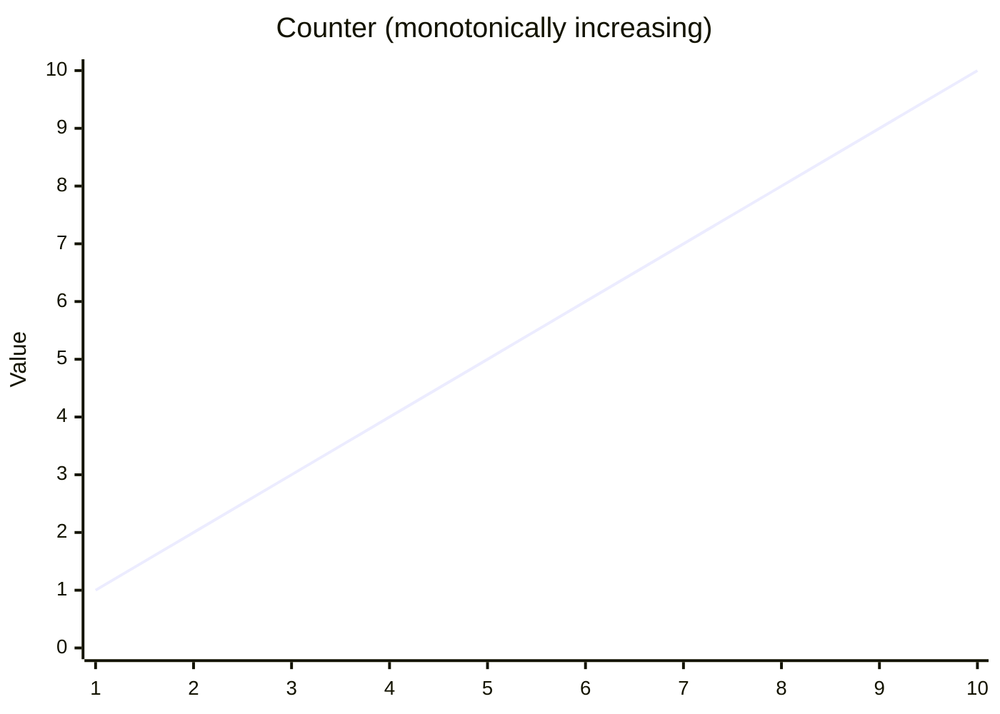
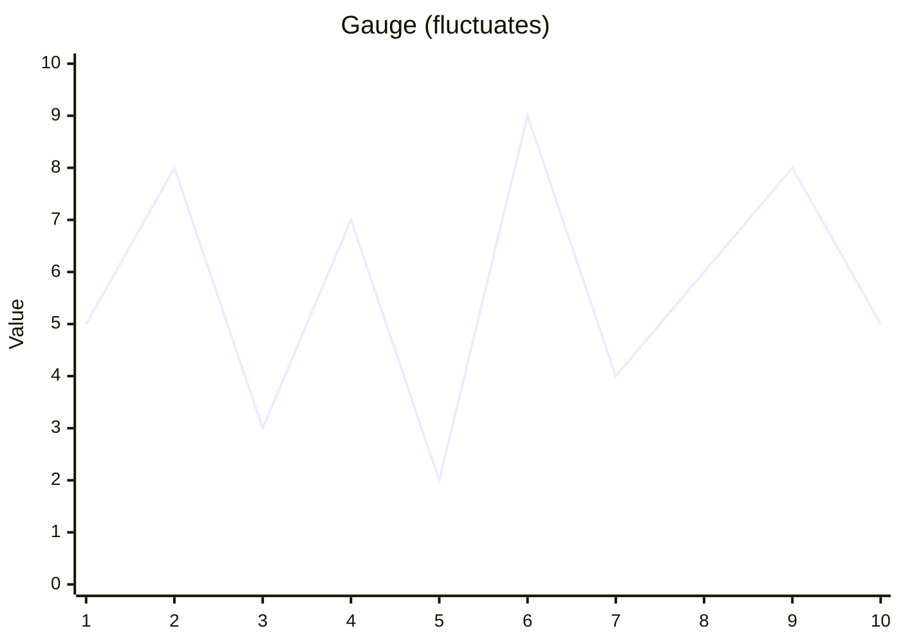
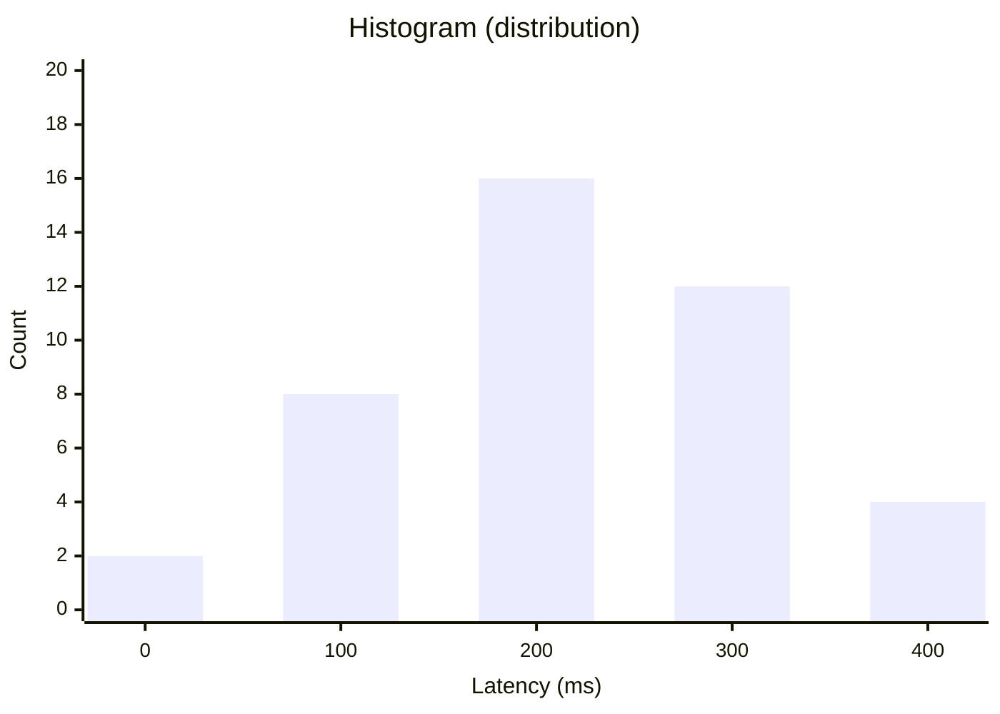
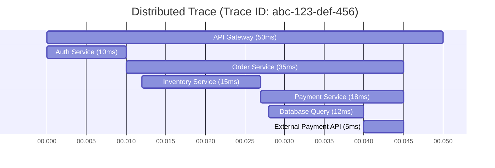
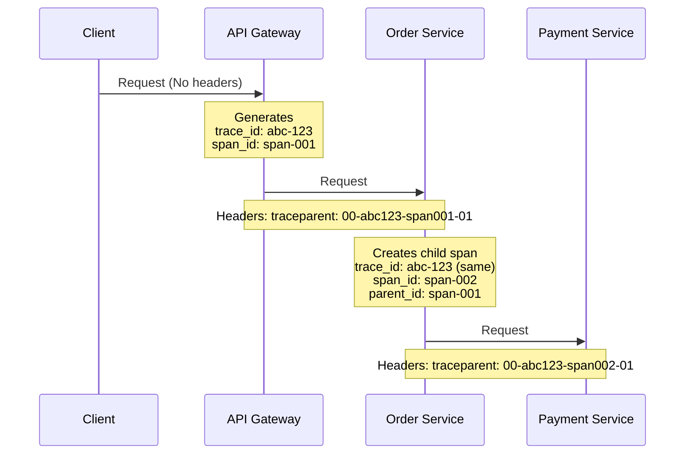
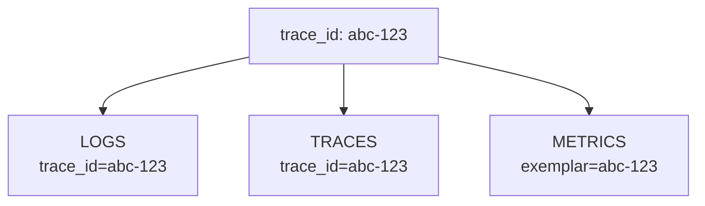
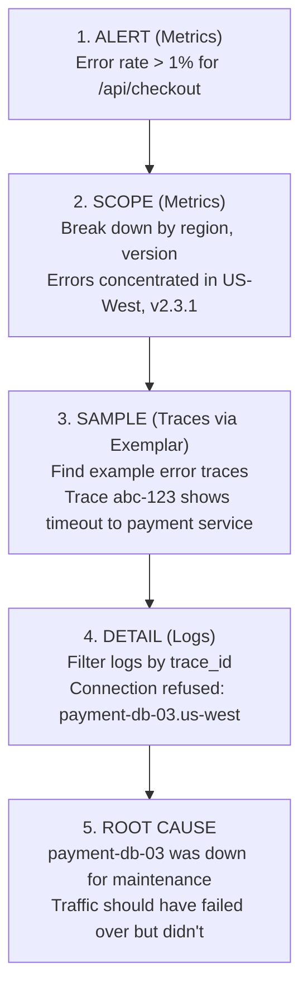
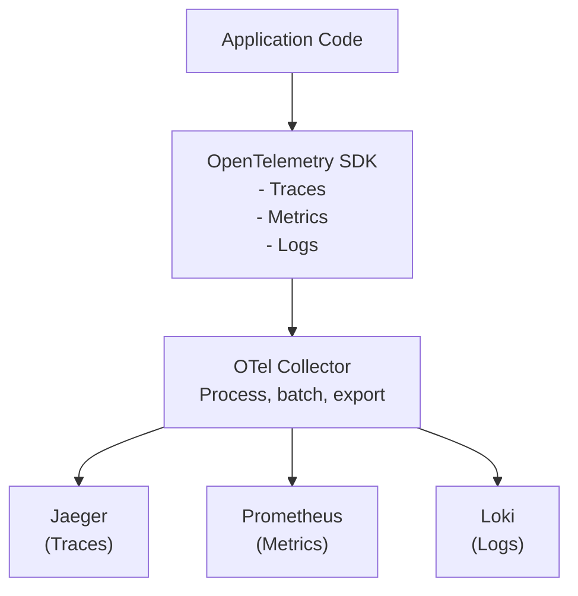
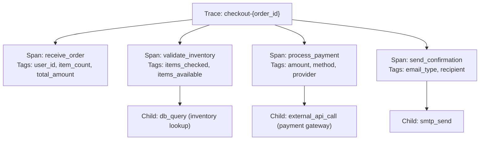

> **Complexity**: `[MEDIUM]`
>
> **Time to Complete**: 35-40 minutes
>
> **Prerequisites**: [Module 3.1: What is Observability?](../module-3.1-what-is-observability/)
>
> **Track**: Foundations

### What You'll Be Able to Do

After completing this module, you will be able to:

1. **Analyze** when to use metrics, logs, or traces for a given debugging scenario and explain the strengths and blind spots of each
2. **Design** a correlated observability pipeline where trace IDs connect metrics anomalies to log entries to distributed traces
3. **Evaluate** whether existing observability coverage has gaps that leave specific failure modes invisible
4. **Implement** a strategy for combining the three pillars so they reinforce each other rather than creating three isolated data silos

---

## The Engineer Who Had Everything and Nothing

**October 2015. A Major Rideshare Company. 7:43 PM on New Year's Eve.**

The platform is about to handle 440% of normal traffic. The engineering team has prepared for months. They have comprehensive Prometheus metrics on every service. They have Elasticsearch with 2TB of logs. They have distributed tracing through Jaeger. All three pillars, best-in-class tooling.

At 11:52 PM, surge pricing stops working.

The on-call engineer opens Grafana. Latency spike on the pricing service—p99 jumped from 150ms to 8 seconds. Great, the metrics show *that* something is wrong.

She switches to Jaeger to find slow traces. But the trace UI only lets her search by trace ID or service name. She doesn't have a trace ID. She searches for "pricing-service" and gets 2 million results in the last hour. No way to filter by duration. No way to find the slow ones.

She pivots to Elasticsearch. Searches for "pricing" and "error." 847,000 results. None have trace IDs—the team never added them to logs. She can see errors happened but can't connect them to specific requests or traces.

**90 minutes**. That's how long it took to find the root cause: a database connection pool exhaustion that only manifested under New Year's Eve load. The fix was a single config change. But finding it required manually correlating timestamps across three disconnected tools.

**Cost**: $12.4 million in lost surge pricing revenue. 340,000 customer complaints. A PR crisis that took weeks to contain.

> **Stop and think**: If the team had all three tools (metrics, logs, traces) running perfectly, why couldn't they solve the problem quickly? What specific piece of information was missing that would have bridged the gap between the tools?

### The Three Pillars Paradox

| What the Team Had | What They Could Do |
|-------------------|--------------------|
| ☑ Prometheus metrics (2M series) | ✗ Find which specific requests failed |
| ☑ Elasticsearch logs (2TB/day) | ✗ Connect a log to its trace |
| ☑ Jaeger traces (100M spans/day) | ✗ Find traces matching a metric spike<br/>✗ Query logs by `trace_id`<br/>✗ Drill down from aggregate to specific |

**The Reality:** Having the pillars ≠ Having observability.

**What They Added After the Incident:**
- ✓ `trace_id` in every log line
- ✓ Exemplars linking p99 metrics to sample traces
- ✓ Duration-based trace search
- ✓ Unified query UI that links all three

**Result:** Same tools. 10-minute resolution time for similar incidents.

---

## Why This Module Matters

You've learned what observability is. Now, how do you actually achieve it?

The industry has converged on three complementary data types—**logs**, **metrics**, and **traces**—often called the "three pillars." Each has strengths and weaknesses. Used together with proper correlation, they give you the visibility to understand any system behavior.

This module teaches you what each pillar provides, when to use which, and critically—how to connect them so you can move seamlessly between different views of the same problem.

> **The Crime Scene Analogy**
>
> Investigating an incident is like investigating a crime. **Logs** are witness statements—detailed accounts of what happened. **Metrics** are statistics—how many, how often, trends over time. **Traces** are the timeline—reconstructing the sequence of events. A good investigator uses all three: statistics to find patterns, witnesses for details, timelines to understand causation.

---

## What You'll Learn

- What each pillar provides and its limitations
- When to use logs vs. metrics vs. traces
- How the three pillars work together
- The importance of correlation (trace IDs, request IDs)
- Modern alternatives and the "single pane of glass"

---

## Part 1: Logs

### 1.1 What Are Logs?

**Logs** are timestamped records of discrete events. They capture what happened, when, and context about the event. Each log entry is a snapshot of a moment in time.

```text
2024-01-15T10:32:15.123Z level=info msg="Request received" method=POST path=/api/checkout user_id=12345 request_id=abc-123
2024-01-15T10:32:15.456Z level=info msg="Payment processed" amount=99.99 currency=USD request_id=abc-123 duration_ms=333
2024-01-15T10:32:15.789Z level=error msg="Inventory check failed" item_id=SKU-789 error="connection timeout" request_id=abc-123
```

### 1.2 Structured vs. Unstructured Logs

**Unstructured Log (hard to query)**
```text
[2024-01-15 10:32:15] ERROR: Payment failed for user 12345, order #789, amount $99.99 - connection timeout
```
- Human readable but hard to parse programmatically
- Can't easily filter by `user_id` or `order` without slow Regex extraction

**Structured Log (easy to query)**
```json
{
  "timestamp": "2024-01-15T10:32:15.789Z",
  "level": "error",
  "message": "Payment failed",
  "user_id": 12345,
  "order_id": 789,
  "amount": 99.99,
  "currency": "USD",
  "error": "connection timeout",
  "request_id": "abc-123",
  "service": "payment-api",
  "version": "2.3.1"
}
```
- Machine parseable
- Easy to filter: `WHERE user_id = 12345`
- Easy to aggregate: `COUNT BY error`
- Context preserved as queryable fields

### 1.3 Log Strengths and Weaknesses

| Strengths | Weaknesses |
|-----------|------------|
| Rich detail and context | High storage cost |
| Flexible schema | Can be noisy |
| Good for debugging specifics | Hard to see patterns |
| Audit trail | Performance overhead if excessive |
| Natural for developers | Query can be slow at scale |

### 1.4 When to Use Logs

- **Debugging specific issues**: "What happened to request abc-123?"
- **Audit trails**: "Who did what when?"
- **Error details**: Stack traces, error messages, context
- **State changes**: "User X upgraded to premium"
- **Unusual events**: Things that don't happen often enough for metrics

> **Pause and predict**: If you only had logs and no metrics, how would you know if your error rate suddenly doubled? What would be the performance impact of trying to calculate that from logs in real-time?

> **Try This (2 minutes)**
>
> Look at a recent log line from your system. Does it have:
> - [ ] Timestamp with timezone
> - [ ] Log level
> - [ ] Request/trace ID
> - [ ] User identifier
> - [ ] Structured format (JSON)
>
> Each missing item reduces your ability to query and correlate.

---

## Part 2: Metrics

### 2.1 What Are Metrics?

**Metrics** are numeric measurements collected over time. They're optimized for aggregation and trending. Each metric consists of a name, labels (dimensions), and a numeric value over time.

```text
http_requests_total{method="POST", path="/api/checkout", status="200"} 45623
http_requests_total{method="POST", path="/api/checkout", status="500"} 127

http_request_duration_seconds{quantile="0.99"} 0.456
http_request_duration_seconds{quantile="0.50"} 0.089

db_connections_active 47
db_connections_max 100
```

### 2.2 Metric Types

| Type | What It Measures | Example |
|------|------------------|---------|
| **Counter** | Cumulative total (only goes up) | Total requests, total errors |
| **Gauge** | Current value (goes up and down) | Active connections, queue depth |
| **Histogram** | Distribution of values | Request latency distribution |
| **Summary** | Similar to histogram, pre-calculated quantiles | p50, p99 latencies |







### 2.3 Metric Strengths and Weaknesses

| Strengths | Weaknesses |
|-----------|------------|
| Low storage cost | Loses individual event detail |
| Fast queries | Limited cardinality |
| Good for trends and alerting | Can't debug specific requests |
| Efficient aggregation | Pre-aggregated, can't re-aggregate differently |
| Compact representation | Choosing what to measure is hard |

### 2.4 When to Use Metrics

- **Alerting**: "Error rate above threshold"
- **Dashboards**: Real-time system health
- **Capacity planning**: Trends over time
- **SLI measurement**: Availability, latency percentiles
- **Business KPIs**: Requests per second, revenue per minute

> **Gotcha: The Cardinality Trap**
>
> Metrics with high-cardinality labels (user_id, request_id) explode storage costs. A metric with labels for 1 million users creates 1 million time series. Use logs for high-cardinality data, metrics for bounded dimensions (endpoint, region, status_code).

> **Pause and predict**: Why can't you just add a `user_id` label to your Prometheus metrics to track which users are experiencing errors?

---

## Part 3: Traces

### 3.1 What Are Traces?

**Traces** capture the journey of a request through a distributed system. A trace is a tree of **spans**, each representing work done by a service.



### 3.2 Trace Components

| Component | What It Is | Example |
|-----------|------------|---------|
| **Trace** | Full request journey | trace_id: abc-123 |
| **Span** | Single unit of work | "Database query", "HTTP call" |
| **Parent Span** | The span that triggered this one | Order Service is parent of Payment Service |
| **Tags/Attributes** | Metadata on spans | http.status=200, db.query="SELECT..." |
| **Events/Logs** | Timestamped annotations within span | "Cache miss", "Retry attempt 2" |

### 3.3 Trace Propagation

For traces to work across services, trace context must be propagated:

> **Stop and think**: If service A calls service B, and service B calls service C, how does service C know it's part of the same transaction as service A?



All spans share the `trace_id` and are linked logically by parent relationships.

### 3.4 Trace Strengths and Weaknesses

| Strengths | Weaknesses |
|-----------|------------|
| Shows request flow across services | Storage cost (many spans per request) |
| Identifies slow components | Sampling often required |
| Reveals dependencies | Instrumentation overhead |
| Debug specific requests | Requires propagation (can break) |
| Shows parallelism and waiting | Complex to implement well |

### 3.5 When to Use Traces

- **"Where did the time go?"**: Identifying slow spans
- **Dependency mapping**: What calls what?
- **Debugging specific requests**: "What happened to request X?"
- **Finding bottlenecks**: Which service is the problem?
- **Understanding system architecture**: Visualizing flow

> **Did You Know?**
>
> Google processes over 10 billion requests per day. Even with aggressive sampling (0.01%), that's 1 million traces daily. Dapper, their tracing system, was designed around sampling from the start. Most tracing systems sample to control costs—you don't need every trace, just representative ones.

---

## Part 4: Connecting the Pillars

### 4.1 The Correlation Problem

Each pillar alone has blind spots:

**Logs Alone:**
- ✅ "Error occurred in payment service"
- ❌ "Was this the slow request? What called payment service?"

**Metrics Alone:**
- ✅ "Error rate increased at 3pm"
- ❌ "Which specific requests failed? What was the error?"

**Traces Alone:**
- ✅ "Request took 500ms, 400ms in database"
- ❌ "Is this normal? How many requests are affected?"

**Connected (The True Power):**
- ✅ Metric alert fires (error rate up)
- ✅ Drill into traces (which requests are errors)
- ✅ Look at logs (what's the error message)
- ✅ Full picture: "Database connection pool exhausted, affecting 5% of checkout requests"

### 4.2 Correlation via IDs

The key to connecting pillars is **shared identifiers**.



**Query**: "Show me everything for trace abc-123"
- → Logs from all services for this request
- → Trace showing timing and flow
- → Metrics at the time of this request

### 4.3 Exemplars: Connecting Metrics to Traces

**Exemplars** link aggregated metrics back to specific traces. 

Without an exemplar: *"p99 latency is high, but which requests?"*
With an exemplar: *"p99 latency is high, here's a trace showing one: abc-123"*

```text
# Prometheus Exemplar format:
http_request_duration_seconds{path="/checkout"} 0.45 # {trace_id="abc-123"} 0.48
```
By clicking on `trace_id="abc-123"` in a dashboard, you immediately see the full trace of a slow request that contributed to the p99 metric.

### 4.4 The Correlation Workflow



> **Try This (3 minutes)**
>
> Map your current investigation workflow:
>
> | Step | Your Tool/Method | What's Missing? |
> |------|------------------|-----------------|
> | Alert | | |
> | Scope | | |
> | Sample | | |
> | Detail | | |
>
> Where do you get stuck? That's your correlation gap.

> **War Story: The $6.7 Million Investigation Gap**
>
> **2018. A Major Trading Platform. Monday Morning, Market Open.**
>
> At 9:31 AM Eastern, order execution latency jumped from 3ms to 400ms. For a high-frequency trading platform, this was catastrophic. Every millisecond of delay meant lost arbitrage opportunities. Customers were losing money—and switching to competitors in real-time.
>
> The platform had excellent tooling: Prometheus metrics with 50,000 time series, Elasticsearch ingesting 500GB of logs daily, and Zipkin handling 10 million spans per hour. On paper, world-class observability.
>
> **9:31 AM**: Alert fires. P99 latency above threshold.
> **9:34 AM**: Engineer opens Grafana. Confirms latency spike. Can see *which* services are slow but not *why*.
> **9:41 AM**: Switches to Zipkin. Searches for "order-execution" service. Gets 847,000 traces. No way to filter to just the slow ones. No latency-based search.
> **9:52 AM**: Opens Elasticsearch. Searches for "order" and "slow." 2.3 million results. Logs have timestamps but no trace IDs. Can't correlate to traces.
> **10:14 AM**: Resorts to manually comparing timestamps across tools. Tedious, error-prone.
> **10:47 AM**: Finally identifies pattern—slow requests all touched a specific Redis cluster.
> **10:52 AM**: Root cause found—Redis master failover during maintenance window wasn't announced. Connections were timing out during reconnection.
> **10:54 AM**: Fix applied—bump connection pool retry settings.
>
> **Time to resolution: 83 minutes.** Fix took 2 minutes. Finding the problem took 81.
>
> **Financial Impact**:
> - Lost trading volume during outage: $847,000
> - Customer churn (3 major clients left): $5.8 million annual revenue
> - Regulatory fine for execution delay: $120,000
> - **Total: $6.77 million**
>
> **The Postmortem**:
>
> | What They Had | What They Couldn't Do |
> |---------------|----------------------|
> | 50,000 Prometheus metrics | Find slow traces from metric spikes |
> | 500GB/day logs in Elasticsearch | Search logs by trace_id |
> | 10M spans/hour in Zipkin | Filter traces by duration |
> | Three world-class tools | Navigate between them |
>
> **What They Built After**:
> - Added trace_id to every log line (2 hours of work)
> - Added exemplars to latency histograms (4 hours)
> - Built unified search UI linking all three (2 weeks)
> - Next similar incident: 9 minutes to resolution
>
> **The math**: $6.77M cost ÷ 2 weeks engineering time = worth it.

---

## Part 5: Beyond the Three Pillars

### 5.1 The Pillars Critique

The "three pillars" framing has critics who argue it encourages bad habits. 

**Siloed Thinking**
When teams treat tools as silos ("We have a logging system, a metrics system, a tracing system"), they end up with three separate UIs, three separate queries, and slow, manual correlation during incidents.

**The Real Need**
Systems simply generate "events" that describe their behavior. These events can be viewed individually as logs, aggregated over time into metrics, or contextually connected into traces. They are the exact same underlying data, just filtered through different lenses.

### 5.2 Events-Based Observability

Modern observability thinking centers on rich **events**:

```json
{
  "timestamp": "2024-01-15T10:32:15.789Z",
  "trace_id": "abc-123",
  "span_id": "span-001",
  "service": "payment-api",
  "operation": "process_payment",
  "duration_ms": 333,
  "user_id": "12345",
  "amount": 99.99,
  "status": "success",
  "db_queries": 3,
  "cache_hit": false
}
```

From this single event representation, you can:
- → View as a **LOG**: Read the full detailed context of this specific operation.
- → Compute **METRICS**: Automatically calculate `avg(duration_ms)` and `count` by status.
- → Build a **TRACE**: Connect the event visually via its `trace_id` and `span_id`.

One data model, multiple views.

### 5.3 OpenTelemetry: Unified Approach

**OpenTelemetry** (OTel) is becoming the industry standard for observability instrumentation. It solves the correlation problem at the source.



**Benefits**:
- Vendor-neutral instrumentation
- Consistent correlation (`trace_id` attached everywhere automatically)
- One standard library for all signals
- Easy to swap backend vendors without changing application code

---

## Did You Know?

- **Netflix streams over 1 billion hours of video per week** and traces every request. They sample aggressively but keep 100% of traces for errors—you always want the full picture when something goes wrong.

- **The W3C Trace Context standard** defines how trace IDs propagate in HTTP headers. Before this standard, every tracing system had its own headers (Zipkin used B3, AWS used X-Amzn-Trace-Id). Now `traceparent` and `tracestate` are standard.

- **Logs are the oldest pillar**—Unix systems have had syslog since the 1980s. Metrics became common in the 2000s (RRDtool, Graphite). Traces emerged in the 2010s with Dapper and microservices. The history reflects increasing system complexity.

- **Uber built their own tracing system** called Jaeger (German for "hunter") in 2015, then open-sourced it. It was designed to handle their scale: billions of spans per day across thousands of microservices. Jaeger became a CNCF project and is now one of the most popular tracing backends.

---

## Common Mistakes

| Mistake | Problem | Solution |
|---------|---------|----------|
| No trace propagation | Traces break at service boundaries | Use OTel SDK, verify headers |
| High-cardinality metrics | Storage explosion, slow queries | Use logs for high-cardinality, metrics for bounded |
| Unstructured logs | Can't query or correlate | JSON with consistent fields |
| No request ID in logs | Can't find logs for a trace | Add trace_id to every log line |
| Separate tools, no correlation | Manual jumping between UIs | Use exemplars, linked IDs |
| Logging everything | Noise, cost, performance | Log meaningful events with context |

---

## Quiz

1. **You are investigating a customer report that they cannot complete their checkout. Your dashboard shows a 5% increase in 500 errors on the `/checkout` endpoint, but you don't know why. Which observability pillar should you turn to next, and why?**
   <details>
   <summary>Answer</summary>

   You should turn to **logs** (or traces leading to logs) to find the specific error details. 
   Metrics are excellent for alerting you that the 500 error rate has spiked to 5%, but they strip away the high-cardinality context needed to understand individual failures. Logs, on the other hand, contain the rich, specific context (like error messages, stack traces, and user IDs) for those exact failing requests. By finding the logs associated with the failing checkouts, you can see the precise cause—such as a database connection timeout or an invalid payload—which metrics alone cannot reveal.
   </details>

2. **Your microservices architecture consists of an API Gateway, an Auth Service, and a Data Service. A request takes 4 seconds to complete, but when you look at Jaeger, you see three separate, disconnected traces for the same request, each lasting a fraction of a second. What concept is missing from your implementation, and why does this happen?**
   <details>
   <summary>Answer</summary>

   Your implementation is missing **trace context propagation** between the services. 
   When a request enters the system, a trace ID is generated, but for a distributed trace to be reconstructed, this ID must be passed (propagated) via HTTP headers to every downstream service. Because your API Gateway isn't forwarding the `traceparent` header to the Auth and Data services, they assume they are the start of a new, independent request and generate their own trace IDs. Without context propagation, the tracing backend has no way to stitch the individual spans together, leaving you unable to see the full, end-to-end journey of the request.
   </details>

3. **Your on-call engineer gets an alert that the p99 latency for the inventory service has exceeded 2 seconds. They open Grafana and see the spike, but then spend 20 minutes manually searching Jaeger for traces that took longer than 2 seconds during that time window. What feature could they implement to eliminate this manual search, and how does it work?**
   <details>
   <summary>Answer</summary>

   They should implement **exemplars** in their metrics pipeline. 
   Exemplars bridge the gap between aggregated metrics and individual traces by attaching a specific, representative trace ID to a metric data point at the time it is recorded. When the p99 latency spike appears on the dashboard, an exemplar provides a direct link to a trace that actually experienced that high latency. This eliminates the need to manually hunt across time windows and query interfaces, dramatically reducing the time it takes to pivot from knowing *that* there is a problem to understanding *why* the problem occurred.
   </details>

4. **A newly hired Director of Engineering insists on buying three separate, best-in-class enterprise tools: one strictly for logs, one for metrics, and one for traces. They argue this satisfies the "three pillars" of observability. Based on modern observability principles, why is this isolated approach likely to fail during a high-pressure incident?**
   <details>
   <summary>Answer</summary>

   This isolated approach is likely to fail because it treats the three pillars as **silos rather than interconnected views of the same events**. 
   During an incident, engineers need to move rapidly from a metric alert to a specific trace, and then to the logs for that trace to find the root cause. If the tools are completely separate and lack shared identifiers (like trace IDs), engineers are forced to manually correlate timestamps and guess which log matches which metric spike. Modern observability relies on an events-first model where logs, metrics, and traces are deeply integrated and derived from the same contextual data, allowing seamless pivoting and correlation.
   </details>

5. **Your high-traffic e-commerce platform processes 10,000 requests per second. To save on tracing costs, your team implements a strict 1% random head-based sampling policy. During a major outage, 0.5% of all checkout requests fail with a critical database error, but your engineers complain they can't find any traces of the failures. Why did this tracing strategy fail, and how should you adjust it?**
   <details>
   <summary>Answer</summary>

   The strategy failed because a flat 1% random sampling rate means there is a **99% chance that any given failed request is simply discarded**. 
   When dealing with rare but critical events like a 0.5% failure rate, random sampling will capture very few, if any, of the problematic traces you actually need for debugging. To fix this, you should implement tail-based sampling or rules-based sampling that guarantees 100% of requests resulting in an error (or exceeding a latency threshold) are kept, while only sampling a small percentage of the successful, fast requests. This ensures you control storage costs without losing the critical diagnostic data required during an incident.
   </details>

6. **To track per-user API limits, a developer adds a `user_id` label to the `http_requests_total` Prometheus metric. The application has 5 million active users. Within an hour, the Prometheus server crashes due to out-of-memory errors. What observability anti-pattern caused this, and what is the correct alternative?**
   <details>
   <summary>Answer</summary>

   This is a textbook example of the **high-cardinality trap** in metrics systems. 
   Every unique combination of labels in Prometheus creates a completely new time series, meaning the `user_id` label just forced the system to track millions of new, individual metrics simultaneously, exhausting its memory. Metrics are designed for bounded dimensions (like HTTP status codes or regions) and cannot handle boundless, high-cardinality data like user IDs or session tokens. The correct alternative is to record the `user_id` in structured logs or trace attributes, which are designed to handle high-cardinality event data without a multiplicative storage penalty.
   </details>

7. **A startup proudly announces they have achieved "full observability" because they migrated all their services to output structured JSON logs, which are centralized in Elasticsearch. However, when a complex microservice transaction fails, it still takes them hours to reconstruct the timeline of what happened. Why is structured logging alone insufficient for their claim?**
   <details>
   <summary>Answer</summary>

   Structured logging is insufficient because it provides rich context but lacks **correlation and flow visibility** across distributed services. 
   While JSON logs allow for easy parsing and searching of discrete events, they do not automatically link those events together into a cohesive journey. Without trace IDs tying the logs of the Gateway, Auth, and downstream services together, engineers cannot easily reconstruct the lifecycle of a single user request. True observability requires not just structured event data, but the ability to aggregate it (metrics), trace its path (traces), and seamlessly navigate between these dimensions using shared identifiers.
   </details>

8. **You are analyzing a distributed trace for a checkout request that took a total of 850ms. The trace shows five child spans for downstream calls (inventory, pricing, payment, shipping, notification) that add up to 675ms of execution time. However, there is a 175ms gap in the timeline where no child spans are active. What does this gap likely represent, and how should you investigate it?**
   <details>
   <summary>Answer</summary>

   The 175ms gap represents **un-instrumented time spent within the parent checkout service itself**. 
   A trace only visualizes the operations that have been explicitly wrapped in spans; any time not accounted for by a child span is time the parent service spent executing its own logic, such as data validation, payload parsing, or simply waiting in a thread queue. To investigate this gap, you should add more granular, custom spans within the checkout service's internal code to measure these local operations. This will reveal exactly where the missing 175ms is being spent and highlight potential local bottlenecks.
   </details>

---

## Key Takeaways

### Three Pillars Essentials Checklist

**Understanding Each Pillar**
- [x] **Logs** = detailed events (what happened, high cardinality OK)
- [x] **Metrics** = numeric aggregates (how many, low cardinality required)
- [x] **Traces** = request journey (where time went, shows dependencies)

**When To Use What**
- [x] Debugging specific requests → Logs + Traces
- [x] Alerting on thresholds → Metrics
- [x] Finding patterns across users → Logs with structured fields
- [x] Identifying slow components → Traces
- [x] Capacity planning → Metrics (trends over time)

**The Correlation Imperative**
- [x] `trace_id` in EVERY log line (non-negotiable)
- [x] Exemplars connecting metrics to sample traces
- [x] Same timestamp format across all pillars
- [x] Unified UI or linked navigation between tools

**Cardinality Rules**
- [x] **Metrics:** bounded dimensions only (endpoint, region, status_code)
- [x] **Logs:** high cardinality welcome (user_id, request_id, session_id)
- [x] **Traces:** sampling for volume control, 100% for errors

**The Events Perspective**
- [x] Pillars are views, not silos
- [x] Same underlying data, different lenses
- [x] OpenTelemetry unifies instrumentation
- [x] Goal: answer questions you didn't anticipate

---

## Hands-On Exercise

**Task**: Design an observability strategy using all three pillars.

**Scenario**: You're building a checkout service that:
- Receives orders from users
- Validates inventory
- Processes payments
- Sends confirmation emails

**Part 1: Design Structured Logs (10 minutes)**

For each key event, define the log structure:

| Event | Log Level | Key Fields |
|-------|-----------|------------|
| Order received | INFO | timestamp, trace_id, user_id, order_id, items[], total |
| Inventory checked | INFO | timestamp, trace_id, order_id, items_available, items_unavailable |
| Payment attempt | INFO | timestamp, trace_id, order_id, amount, payment_method |
| Payment failed | ERROR | timestamp, trace_id, order_id, error_code, error_message |
| Email sent | INFO | timestamp, trace_id, order_id, email_type, recipient |

Add 2-3 more events relevant to your scenario:

| Event | Log Level | Key Fields |
|-------|-----------|------------|
| | | |
| | | |
| | | |

**Part 2: Design Metrics (10 minutes)**

Define metrics for monitoring and alerting:

| Metric Name | Type | Labels | Purpose |
|-------------|------|--------|---------|
| checkout_requests_total | Counter | status, payment_method | Track volume and success rate |
| checkout_duration_seconds | Histogram | step (validate, pay, email) | Track latency by phase |
| inventory_availability | Gauge | item_category | Monitor stock levels |
| payment_failures_total | Counter | error_code, provider | Track payment issues |

Add 2-3 more metrics:

| Metric Name | Type | Labels | Purpose |
|-------------|------|--------|---------|
| | | | |
| | | | |
| | | | |

**Part 3: Design Traces (10 minutes)**

Define the span structure for a checkout request:



Add timing expectations:
- Total checkout: ____ms expected
- Which span is likely the bottleneck? ____

**Part 4: Correlation Plan (5 minutes)**

How will you connect the three pillars?

| Correlation Need | Solution |
|------------------|----------|
| Find logs for a trace | Include trace_id in every log |
| Find traces for a metric spike | Use exemplars with trace_id |
| Find metrics for a time window | Query by timestamp range |
| | |

**Success Criteria**:
- [ ] At least 5 meaningful log events defined with fields
- [ ] At least 4 metrics with appropriate types and labels
- [ ] Trace structure with at least 4 spans
- [ ] Correlation strategy defined (trace_id in logs, exemplars)

---

## Further Reading

- **"Distributed Systems Observability"** - Cindy Sridharan. Excellent coverage of all three pillars.

- **OpenTelemetry Documentation** - https://opentelemetry.io/docs/. The emerging standard for instrumentation.

- **"Three Pillars with Zero Answers"** - Charity Majors (blog post). The critique of pillar-centric thinking.

---

## Next Module

[Module 3.3: Instrumentation Principles](../module-3.3-instrumentation-principles/) - How to add observability to your code: what to instrument, where, and how.