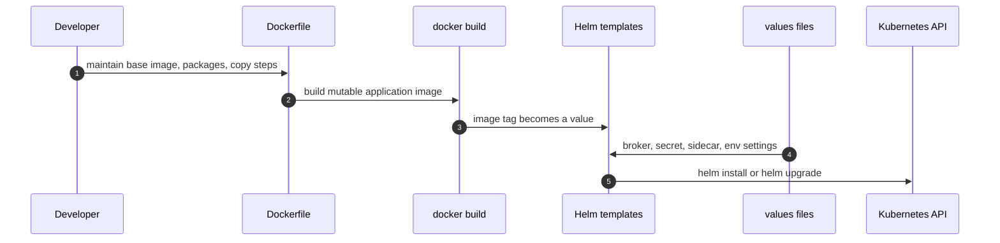
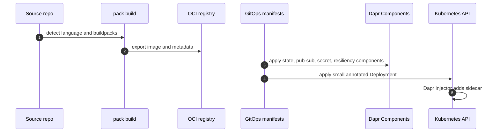

> **Toolkit Track** | Complexity: `[COMPLEX]` | Time: 60-70 min
>
> **Prerequisites**: [Module 2.4: Helm & Kustomize](../module-2.4-helm-kustomize/), [GitOps Discipline](../../../../disciplines/delivery-automation/gitops/), comfort with container images and Kubernetes manifests

---

## Prerequisites

Before starting this module, make sure you can read the application package
and the runtime contract separately. Module 2.4 introduced Helm and
Kustomize as deployment configuration tools. This module asks a different
question: what does application packaging look like when Helm is too
template-heavy or too cluster-bound?

- Complete [Module 2.4: Helm & Kustomize](../module-2.4-helm-kustomize/)
  so you can compare templates, values files, overlays, and plain manifests.
- Review [GitOps Discipline](../../../../disciplines/delivery-automation/gitops/)
  so Git remains the source of truth for both build and runtime declarations.
- Be comfortable reading Kubernetes Deployments, Services, annotations,
  custom resources, and namespace-scoped configuration.
- Be able to explain what a container image tag points to and why a mutable
  tag such as `latest` is risky in a promoted environment.
- Have working knowledge of HTTP request paths, local ports inside a Pod,
  and how sidecars communicate with an application container.
- Know the difference between building an image and deploying an image; this
  module deliberately separates those two decisions.

## Learning Outcomes

After completing this module, you will be able to make a defensible platform
decision when an application definition no longer fits comfortably inside a
Helm chart:

- **Analyze** Helm template sprawl and identify which concerns belong to image
  construction, runtime building blocks, cluster packaging, or environment
  customization.
- **Implement** a Buildpacks-based image build with `pack build`, a curated
  builder, reproducible layers, SBOM output, and no Dockerfile in the
  application repository.
- **Design and debug** Dapr Component manifests, sidecar annotations, service
  invocation, state calls, pub-sub subscriptions, secret access, and
  resiliency policy.
- **Compare** a Helm chart, a plain-manifest GitOps directory, and a mixed
  Helm-plus-Dapr-plus-Buildpacks path using reviewability, ownership,
  rollback behavior, and operational blast radius.
- **Estimate and evaluate** the cost impact of Buildpacks cache behavior,
  image layer reuse, Dapr sidecar resource requests, review overhead, and
  stop conditions where Helm, Dockerfiles, or direct SDKs remain better.

## Why This Module Matters

Hypothetical scenario: a platform team owns a shared Helm chart for a fleet of
small services. At first the chart is a success. Every service gets the same
labels, the same probes, the same Service shape, the same NetworkPolicy, and
the same deployment strategy. Six months later the chart has become a dense
decision tree. One service needs a Redis state store, another needs a RabbitMQ
publisher, another needs Vault secrets, and another needs a sidecar. Values
files now contain broker names, secret paths, lifecycle hooks, feature flags,
image build assumptions, and conditionals that only make sense to the chart
maintainers.

The failure is not that Helm is bad. Helm is doing exactly what it was asked
to do: render a release from templates and values. The problem is that the
application definition now contains more than Kubernetes resources. It
contains build method, base-image policy, runtime dependencies, state access,
messaging semantics, secret-store choice, retry behavior, and sidecar
coupling. When all of that is squeezed into templates, review becomes a hunt
through conditionals. Partial updates break because a values change rerenders
resources whose state machines did not expect to be touched. OS-image CVE
patches become Dockerfile rebuild chores spread across teams that would
rather be shipping application logic.

There is a cleaner split available. Buildpacks define how source becomes an
OCI image without forcing every application repository to carry a Dockerfile.
Dapr defines runtime building blocks through Kubernetes custom resources and
Pod annotations, so state stores, pub-sub brokers, secret stores, bindings,
configuration, actors, workflow, and resiliency policy live as platform
components instead of application-specific template fragments. Helm can still
package complex releases. It just no longer has to be the place where every
build concern and every runtime dependency is encoded.

The thesis of this module is direct: Dapr defines runtime concerns as
platform components; Buildpacks defines build concerns without a Dockerfile;
together they shift application definition from "imperative template tree" to
"declarative component graph plus declarative build."

## 1. Helm's Unfinished Application-Definition Problem

Helm is excellent at packaging Kubernetes resources. A chart can bundle a
Deployment, Service, ConfigMap, Secret, Ingress, HorizontalPodAutoscaler,
RBAC, CRDs, and tests into a versioned artifact. It can expose safe defaults,
ship dependencies, render environment-specific manifests, and maintain
release history. For platform releases such as a monitoring stack, service
mesh, inference platform, or database operator, that release model is still
hard to beat.

Use this section as the analysis lens for Helm template sprawl. The point is
not to reject charts, but to identify whether a confusing value is really an
image-construction concern, a runtime-building-block concern, a cluster
packaging concern, or a legitimate environment customization concern. Once
the concern has a name, the placement decision becomes easier to defend in a
design review.

The pressure begins when teams use Helm as the universal application
definition language. A chart can say which image to deploy, but it does not
describe how the image was built. A chart can template a Secret reference,
but it does not decide whether the application should know Vault, Kubernetes
Secrets, cloud secret managers, or a local development file. A chart can
template a broker connection string, but it does not create a stable
application contract for publish and subscribe semantics. A chart can enable
a sidecar, but it does not automatically separate sidecar policy from the
application release.

This distinction matters because application ownership and platform ownership
move at different speeds. Application teams change code, endpoints, and
feature behavior. Platform teams change base images, state-store defaults,
message brokers, secret stores, retry budgets, and sidecar policy. When all
of those concerns live in a chart values file, the values file stops being a
small environment difference and becomes a hidden platform API.

```text
HELM DOES PACKAGE MANIFESTS, BUT IT DOES NOT SET EVERY BOUNDARY
────────────────────────────────────────────────────────────────────
Concern                         Helm can render it?     Better owner
────────────────────────────────────────────────────────────────────
Deployment shape                Yes                     App + platform
Service and ports               Yes                     App + platform
Image repository and tag        Yes                     Release process
How the image was built         Not by itself           Build platform
State-store implementation      Only as config          Runtime platform
Pub-sub broker choice           Only as config          Runtime platform
Secret-store integration        Only as config          Runtime platform
Retry and circuit policy        Only as config          Runtime platform
OS-image CVE rebase             Not by itself           Build platform
────────────────────────────────────────────────────────────────────
```

The common failure pattern is template sprawl. A chart begins with a clean
Deployment template. Then the team adds conditional probes, optional sidecars,
feature-specific volumes, alternate security contexts, two service types,
three ingress modes, a secret path table, and several broker variations. Each
conditional is defensible alone. Together they make the chart hard to reason
about because the rendered output depends on a large cross-product of values.

```yaml
# A simplified smell, not a recommended pattern.
{{- if .Values.dapr.enabled }}
metadata:
  annotations:
    dapr.io/enabled: "true"
    dapr.io/app-id: {{ .Values.dapr.appId | quote }}
    dapr.io/app-port: {{ .Values.service.targetPort | quote }}
{{- end }}
{{- if .Values.redis.enabled }}
env:
  - name: REDIS_HOST
    value: {{ .Values.redis.host | quote }}
{{- end }}
{{- if .Values.rabbitmq.enabled }}
env:
  - name: RABBITMQ_URL
    valueFrom:
      secretKeyRef:
        name: {{ .Values.rabbitmq.secretName | quote }}
        key: url
{{- end }}
```

The YAML shown above is not broken. The smell is that state, messaging, and
sidecar contracts are now hidden inside chart rendering logic. A reviewer
cannot inspect the runtime platform contract without evaluating templates and
values together. A platform engineer cannot change the broker abstraction
without touching application packaging. An application engineer cannot tell
which fields are app-owned and which fields are platform-owned.

Values files also hide dependency assumptions. A production values file might
contain `redis.enabled: false` and `redis.host: redis-prod.platform.svc`.
That looks harmless until a lower environment accidentally uses the embedded
chart dependency while production uses an external managed service. The same
template now describes two different operational architectures. The rendered
Deployment may look similar, but the failure modes differ completely.

Upgrade behavior adds another layer. Helm upgrades are template rerenders plus
release state transitions. That is exactly what you want for many releases.
It is less comfortable when a small values change rerenders resources that
represent stateful workflows, broker subscriptions, or sidecar behavior. A
template engine does not understand the application-level state machine; it
only knows the next desired manifest. The more platform policy you place in
the chart, the more often a normal application upgrade risks changing
runtime machinery by accident.

The alternative in this module is not "never use Helm." The alternative is
to move two classes of concern out of the chart when they are better expressed
elsewhere. Buildpacks describe how source becomes an image. Dapr Components
describe runtime building blocks. The Deployment can then stay small: it names
the image, requests the Dapr sidecar, and exposes the application port.





Pause and predict: in the first flow, where would you patch a base OS CVE?
Where would you change a state store from Redis to a cloud service? In the
second flow, those two changes land in different places. The CVE patch is a
builder or run-image concern. The state-store change is a Dapr Component
concern. The application Deployment does not need to grow a new conditional
for either change.

Helm still wins in several important cases. If you are installing Prometheus,
Istio, KServe, cert-manager, or a database operator, you often want the
upstream chart because it packages many resources, CRDs, RBAC rules,
webhooks, dashboards, and upgrade notes as one release. If your organization
uses chart repositories as the distribution channel for supported platform
packages, Helm is a natural artifact. If Flux `HelmRelease` objects are the
audited boundary for production changes, the chart release may remain the
right unit of control.

The decision is therefore about boundaries, not tool identity. Use Helm when
the chart is the clean release artifact. Use Dapr Components when the runtime
dependency contract should be a platform graph. Use Buildpacks when the build
method should be curated centrally and repeated consistently. Use all three
when the release boundary, runtime contract, and build boundary are separate
but compatible.

## 2. Buildpacks: Declarative Builds Without Dockerfiles

Cloud Native Buildpacks solve the build half of the application-definition
problem. Instead of every repository carrying a Dockerfile that chooses a base
image, installs packages, copies files, sets users, configures entrypoints,
and decides layer boundaries, the build platform runs a lifecycle. The
lifecycle detects what kind of app is present, chooses buildpacks, builds the
app, and exports an OCI image with metadata. The repository still owns source
code. The platform owns the builder policy.

The simplest mental model is a professional kitchen. The application team
brings ingredients. The builder contains the kitchen rules, tools, approved
base images, and recipes for common stacks. The lifecycle inspects the
ingredients, chooses the right recipe, cooks the application, labels the
result, and packages it for delivery. The application team can still influence
the build through supported files and environment variables, but it does not
hand-write the kitchen layout in every project.

The `pack` CLI is the common local entry point. It talks to a container
runtime, pulls a builder image, runs the lifecycle, and writes the final OCI
image. The `--builder` flag selects the curated builder. Paketo, Heroku, and
Google Cloud all provide Buildpacks ecosystems, and the builder choice is a
platform decision with security and support consequences.

```bash
pack build my-app:0.1.0 \
  --builder paketobuildpacks/builder:base \
  --path .
```

That one command does several things. It pulls the builder if needed. It
detects whether the source tree matches one or more buildpacks. It restores
cache layers when available. It runs build logic such as dependency
installation and compilation. It exports the final image with launch layers,
process metadata, labels, and SBOM information when supported by the buildpack
and lifecycle. The result is an OCI image that can be pushed, scanned,
promoted, signed, and deployed like any other image.

```text
CLOUD NATIVE BUILDPACKS LIFECYCLE
────────────────────────────────────────────────────────────────────
Source directory
  │
  ▼
Detect
  ├── Which buildpacks apply?
  └── Is this Python, Go, Java, Node.js, or another supported app?
  │
  ▼
Analyze and restore
  ├── Which previous image layers can be reused?
  └── Which dependency cache entries still apply?
  │
  ▼
Build
  ├── Install dependencies
  ├── Compile or package the app
  └── Create launch and build layers
  │
  ▼
Export
  ├── Write OCI image
  ├── Add process metadata
  ├── Add labels and SBOM data where supported
  └── Push or store the image
────────────────────────────────────────────────────────────────────
```

Buildpacks documentation often describes builders, build images, run images,
and stack concepts. The names matter because they define who controls the
operating-system layer. The builder contains buildpacks plus the lifecycle and
the build-time base image. The run image is the smaller base used when the app
launches. Older docs and many platform conversations call the build/run image
pair a stack. If a CVE is fixed in the run image, a platform can rebase app
images onto the patched run image without rebuilding application source.

That rebase capability is one of the strongest reasons to care. A Dockerfile
usually bakes the application and base image together during `docker build`.
When the base image needs a CVE fix, teams often rebuild many applications.
Buildpacks separate launch layers so the platform can swap the run image when
the base layer changes and the app layers are still compatible. Rebase does
not remove the need for testing, signing, or promotion. It changes the work
from "every team rebuilds from source" to "the platform rebases compatible
images and promotes the result through the same gates."

```bash
pack rebase my-app:0.1.0 \
  --run-image paketobuildpacks/run:base-cnb
```

SBOM output is another platform-grade feature. Buildpacks can emit software
bill of materials data for build and launch layers, giving scanners and
policy engines a clearer dependency inventory than a hand-written Dockerfile
with opaque install commands. The exact SBOM formats and locations depend on
the lifecycle and buildpacks in use, so a production platform should document
how SBOMs are extracted, stored, signed, and reviewed.

A tiny Python service shows the developer workflow. There is no Dockerfile.
The application declares its runtime shape through source files the Python
buildpack understands, and a `Procfile` declares the launch command.

```text
order-service/
├── main.py
├── Procfile
├── requirements.txt
└── runtime.txt
```

```python
from http.server import BaseHTTPRequestHandler, HTTPServer
import json
import os


class Handler(BaseHTTPRequestHandler):
    def do_GET(self):
        if self.path != "/healthz":
            self.send_response(404)
            self.end_headers()
            return
        body = json.dumps({"status": "ok"}).encode()
        self.send_response(200)
        self.send_header("content-type", "application/json")
        self.send_header("content-length", str(len(body)))
        self.end_headers()
        self.wfile.write(body)


if __name__ == "__main__":
    port = int(os.environ.get("PORT", "8080"))
    HTTPServer(("0.0.0.0", port), Handler).serve_forever()
```

```text
web: python main.py
```

```text
python-3.12.*
```

```text
# Empty on purpose for the smallest standard-library example.
```

```bash
pack build 127.0.0.1:5001/order-service:0.1.0 \
  --builder paketobuildpacks/builder:base \
  --path . \
  --publish
```

The `--publish` flag pushes directly to the registry named in the image
reference. Without `--publish`, the image lands in the local container daemon.
For local kind clusters, a registry at `127.0.0.1:5001` is a common pattern.
For team workflows, the registry should be the same promoted registry your
GitOps controller can pull from, with immutable tags or digest references.

Buildpacks are not one monolithic implementation. Paketo Buildpacks are a
community distribution with many language buildpacks and a strong Kubernetes
platform fit. Heroku Buildpacks come from the Heroku platform lineage and are
still relevant for Heroku-style app deployment workflows. Google Cloud
Buildpacks integrate with Google Cloud build and run services. The common
contract is the Cloud Native Buildpacks specification and lifecycle model; the
operational behavior comes from the builder you choose.

```text
BUILDPACK DISTRIBUTION CHOICES
────────────────────────────────────────────────────────────────────
Distribution           Typical fit                 Platform question
────────────────────────────────────────────────────────────────────
Paketo                 Kubernetes platform teams   Which builder line is approved?
Heroku                 Heroku-style workflows      Does it match the target platform?
Google Cloud           Google Cloud deployment     Is the cloud integration desired?
Custom builder         Regulated internal stack    Who patches and tests it?
────────────────────────────────────────────────────────────────────
```

kpack moves the Buildpacks workflow into Kubernetes. Instead of a developer
or CI job running `pack build`, the cluster watches source and builder
definitions through CRDs. A `ClusterBuilder` or `Builder` defines the builder
policy. An `Image` resource points at source and a target image. kpack then
builds when source changes or when a relevant builder/run-image update
requires a rebuild. That is powerful for platform teams that want image
builds to be reconciled like other Kubernetes resources.

```yaml
apiVersion: kpack.io/v1alpha2
kind: ClusterBuilder
metadata:
  name: paketo-base
spec:
  serviceAccountRef:
    name: kpack-service-account
    namespace: kpack
  tag: registry.example.com/builders/paketo-base:0.1.0
  stack:
    name: io.buildpacks.stacks.jammy
    kind: ClusterStack
  store:
    name: paketo-store
    kind: ClusterStore
  order:
    - group:
        - id: paketo-buildpacks/python
```

```yaml
apiVersion: kpack.io/v1alpha2
kind: Image
metadata:
  name: order-service
  namespace: apps
spec:
  tag: registry.example.com/apps/order-service:0.1.0
  serviceAccountName: kpack-service-account
  builder:
    kind: ClusterBuilder
    name: paketo-base
  source:
    git:
      url: https://github.com/example/order-service
      revision: main
```

Before adopting kpack, decide whether builds belong inside the cluster. Some
organizations prefer CI runners because build isolation, credential scope, and
build logs already live there. Others prefer kpack because the platform can
rebuild many apps after builder updates without asking each app repository to
merge a CI change. Both choices can be GitOps-friendly. The key is to make
the build contract explicit and auditable.

Pause and predict: if the Python application above adds a `requirements.txt`
entry for `flask==3.0.3`, which layers should change on the next Buildpacks
build? The source layer changes because files changed. The dependency layer
also changes because the buildpack must install Flask. The run image does not
need to change unless the builder or run image changed. That layer separation
is the cost and security lever.

Buildpacks do not remove every reason to keep Dockerfiles. You may need a
Dockerfile when you have unusual system packages, native build toolchains,
custom entrypoint behavior, language features unsupported by your approved
builder, or an app that deliberately uses a distroless or scratch image with
hand-tuned content. The platform decision should not be dogmatic. Use
Buildpacks for the apps that match the supported contract; keep Dockerfiles
where the build truly needs low-level control.

## 3. Dapr: Runtime Building Blocks as Components

Dapr solves the runtime half of the application-definition problem. It gives
an application a local API for common distributed-systems capabilities, then
maps those calls to platform-managed components. Instead of application code
knowing Redis, RabbitMQ, Vault, Kafka, cloud queues, or a specific state-store
SDK, the application calls Dapr over HTTP or gRPC. The Dapr sidecar handles
the component implementation.

This is not magic and it is not a service mesh replacement. It is an
application runtime layer. Dapr can provide state management, pub-sub,
service-to-service invocation, bindings, secrets, configuration, actors,
workflow, and distributed lock. Those features run through a sidecar and a
set of control-plane services. In Kubernetes, a mutating admission webhook
injects the sidecar when a Pod template asks for it through annotations.

```text
DAPR KUBERNETES SHAPE
────────────────────────────────────────────────────────────────────
Namespace: orders

  Component: statestore
  ├── type: state.redis
  ├── version: v1
  └── metadata: redisHost, redisPassword, keyPrefix

  Component: orderpubsub
  ├── type: pubsub.rabbitmq
  ├── version: v1
  └── metadata: host, durable, deletedWhenUnused

  Component: vault
  ├── type: secretstores.hashicorp.vault
  ├── version: v1
  └── metadata: vaultAddr, vaultToken, vaultKVPrefix

  Deployment: order-service
  ├── annotation: dapr.io/enabled = true
  ├── annotation: dapr.io/app-id = order-service
  ├── annotation: dapr.io/app-port = 8080
  └── injected container: daprd
────────────────────────────────────────────────────────────────────
```

The application sees a stable local API. For service invocation, it can call
the sidecar on port `3500`:

```bash
curl -X POST \
  http://localhost:3500/v1.0/invoke/inventory-service/method/reserve \
  -H "content-type: application/json" \
  -d '{"sku":"demo-1","quantity":2}'
```

Inside a Pod, `localhost` means the shared network namespace of the app
container and the sidecar container. That is why the application can call the
Dapr sidecar without knowing the sidecar's Pod IP. Outside the Pod, you
normally port-forward or call through a Service depending on the test path.

The component model is where Dapr becomes a platform boundary. A Component is
a Kubernetes custom resource with a `metadata.name`, a `spec.type`, a
`spec.version`, and metadata fields specific to the implementation. The
application refers to the component by name, such as `statestore` or
`orderpubsub`. The platform owns the implementation details.

```yaml
apiVersion: dapr.io/v1alpha1
kind: Component
metadata:
  name: statestore
  namespace: orders
spec:
  type: state.redis
  version: v1
  metadata:
    - name: redisHost
      value: redis-master.redis.svc.cluster.local:6379
    - name: redisPassword
      secretKeyRef:
        name: redis-auth
        key: password
    - name: keyPrefix
      value: name
auth:
  secretStore: kubernetes
```

```yaml
apiVersion: dapr.io/v1alpha1
kind: Component
metadata:
  name: orderpubsub
  namespace: orders
spec:
  type: pubsub.rabbitmq
  version: v1
  metadata:
    - name: host
      secretKeyRef:
        name: rabbitmq-connection
        key: amqp-url
    - name: durable
      value: "true"
    - name: deletedWhenUnused
      value: "false"
auth:
  secretStore: kubernetes
```

```yaml
apiVersion: dapr.io/v1alpha1
kind: Component
metadata:
  name: vault
  namespace: orders
spec:
  type: secretstores.hashicorp.vault
  version: v1
  metadata:
    - name: vaultAddr
      value: https://vault.platform.svc.cluster.local:8200
    - name: vaultToken
      secretKeyRef:
        name: vault-bootstrap
        key: token
    - name: vaultKVPrefix
      value: order-service
auth:
  secretStore: kubernetes
```

The examples above intentionally use placeholder names and Kubernetes Secret
references. Do not commit real broker URLs, Vault tokens, cloud credentials,
or production passwords into Component manifests. The Component should define
the runtime contract and where credentials are resolved, not expose the
credentials themselves.

Dapr also has a Resiliency resource. This lets the platform define timeouts,
retries, and circuit breakers for Dapr operations without changing
application code. That is a major ownership improvement over embedding retry
logic in every service. It also requires restraint: a platform-wide retry
policy can amplify load if the timeout and retry budget are too aggressive.

```yaml
apiVersion: dapr.io/v1alpha1
kind: Resiliency
metadata:
  name: order-service-resiliency
  namespace: orders
spec:
  policies:
    timeouts:
      short:
        duration: 2s
    retries:
      state-retry:
        policy: constant
        duration: 500ms
        maxRetries: 3
    circuitBreakers:
      pubsub-breaker:
        maxRequests: 1
        timeout: 30s
        trip: consecutiveFailures >= 5
  targets:
    components:
      statestore:
        outbound:
          timeout: short
          retry: state-retry
      orderpubsub:
        outbound:
          circuitBreaker: pubsub-breaker
```

The minimum Pod-side contract is an annotated workload. The sidecar injector
looks for `dapr.io/enabled: "true"`, assigns the app identity from
`dapr.io/app-id`, and uses `dapr.io/app-port` for callbacks into the
application. The application container can then call the Dapr API locally.

```yaml
apiVersion: apps/v1
kind: Deployment
metadata:
  name: order-service
  namespace: orders
  labels:
    app.kubernetes.io/name: order-service
spec:
  replicas: 2
  selector:
    matchLabels:
      app.kubernetes.io/name: order-service
  template:
    metadata:
      labels:
        app.kubernetes.io/name: order-service
      annotations:
        dapr.io/enabled: "true"
        dapr.io/app-id: order-service
        dapr.io/app-port: "8080"
    spec:
      containers:
        - name: app
          image: registry.example.com/apps/order-service:0.1.0
          ports:
            - name: http
              containerPort: 8080
          readinessProbe:
            httpGet:
              path: /healthz
              port: http
            initialDelaySeconds: 5
            periodSeconds: 10
```

After mutation, the Pod has the application container and a `daprd` sidecar.
This is a simplified view of the resulting Pod shape, not a manifest you
should hand-author. Kubernetes admission controllers and the Dapr injector add
fields, labels, environment variables, volumes, probes, and container
arguments according to the control-plane configuration.

```yaml
apiVersion: v1
kind: Pod
metadata:
  name: order-service-demo
  namespace: orders
  annotations:
    dapr.io/enabled: "true"
    dapr.io/app-id: order-service
    dapr.io/app-port: "8080"
spec:
  containers:
    - name: app
      image: registry.example.com/apps/order-service:0.1.0
      ports:
        - name: http
          containerPort: 8080
    - name: daprd
      image: docker.io/daprio/daprd:edge
      args:
        - /daprd
        - --app-id
        - order-service
        - --app-port
        - "8080"
        - --dapr-http-port
        - "3500"
        - --dapr-grpc-port
        - "50001"
```

This side-by-side view is the Dapr trade-off. The Deployment stays small and
platform concerns move into Components, but every Dapr-enabled Pod gets an
extra container. That sidecar consumes CPU and memory, emits logs, opens
ports, participates in readiness, and can fail independently from the app.
The operational model is cleaner only if your platform monitors the sidecar
as part of the workload.

Service invocation is one building block. State is another. A service can
write state through the local Dapr API:

```bash
curl -X POST \
  http://localhost:3500/v1.0/state/statestore \
  -H "content-type: application/json" \
  -d '[{"key":"order-1001","value":{"status":"accepted"}}]'
```

The same local API lets the service read state back without importing a
backend-specific client. That simplicity is useful, but the operation still
depends on the Component, the sidecar, and the backend being healthy:

```bash
curl \
  http://localhost:3500/v1.0/state/statestore/order-1001
```

Pub-sub follows the same shape. The application publishes to a named
component and topic, while the Component decides whether the actual backend is
RabbitMQ, Redis, Kafka, a cloud pub-sub service, or another supported
implementation:

```bash
curl -X POST \
  http://localhost:3500/v1.0/publish/orderpubsub/orders.created \
  -H "content-type: application/json" \
  -d '{"order_id":"order-1001","status":"accepted"}'
```

The application subscribes either through declarative subscription resources
or through a `/dapr/subscribe` endpoint that returns subscription metadata.
Declarative subscriptions are usually easier to review in GitOps because the
topic route is visible as a manifest.

```yaml
apiVersion: dapr.io/v2alpha1
kind: Subscription
metadata:
  name: order-created
  namespace: orders
spec:
  topic: orders.created
  routes:
    default: /events/orders-created
  pubsubname: orderpubsub
scopes:
  - order-service
```

Before running a Dapr workload in production, practice the failure path. What
happens if the Component exists in the wrong namespace? What happens if the
secret store cannot resolve a credential? What happens if the sidecar is
injected but `dapr.io/app-port` points to the wrong port? Those are not
application bugs, but the application sees them as runtime failures. Good
runbooks start with the boundary.

```bash
kubectl get components -n orders
kubectl describe component statestore -n orders
kubectl get resiliencies -n orders
kubectl get pods -n orders -l app.kubernetes.io/name=order-service
kubectl logs -n orders deploy/order-service -c daprd
kubectl logs -n orders deploy/order-service -c app
```

Dapr pays off when many small services share the same runtime needs. The
platform can provide a Redis-backed state store in development, a managed
cloud store in production, a RabbitMQ pub-sub broker in one cluster, and a
Kafka broker in another while the application continues to call the Dapr API.
That portability is not free. It is a contract with limits. Application teams
still need to understand delivery guarantees, idempotency, partitioning,
payload size, latency, and broker-specific behavior exposed through Dapr
metadata.

## 4. Combining Dapr and Buildpacks in Plain Manifests

Now combine the two halves. The reference application is an `order-service`.
It accepts an order, writes the order status to a state store, publishes an
`orders.created` event, and reads a secret through a Dapr secret store. The
repository has no Dockerfile and no Helm chart. The image comes from
Buildpacks. The runtime dependencies come from Dapr Components. The workload
is a small Deployment and Service.

```text
order-service-platform/
├── apps/
│   └── order-service/
│       ├── main.py
│       ├── Procfile
│       ├── requirements.txt
│       └── runtime.txt
└── deploy/
    └── orders/
        ├── namespace.yaml
        ├── components/
        │   ├── statestore-redis.yaml
        │   ├── orderpubsub-redis.yaml
        │   └── vault-secretstore.yaml
        ├── resiliency.yaml
        ├── deployment.yaml
        ├── service.yaml
        └── kustomization.yaml
```

The application code knows Dapr URLs and component names. It does not import a
Redis client, a RabbitMQ client, or a Vault SDK. In a larger service, you
would wrap these calls in a small internal module so handlers do not repeat
HTTP details. For the teaching example, plain Python keeps the contract
visible.

```python
from http.server import BaseHTTPRequestHandler, HTTPServer
import json
import os
import urllib.error
import urllib.request


DAPR_HTTP_PORT = os.environ.get("DAPR_HTTP_PORT", "3500")
DAPR_URL = f"http://127.0.0.1:{DAPR_HTTP_PORT}/v1.0"
STATE_STORE = os.environ.get("STATE_STORE", "statestore")
PUBSUB = os.environ.get("PUBSUB", "orderpubsub")
TOPIC = os.environ.get("TOPIC", "orders.created")


def dapr_post(path, body):
    data = json.dumps(body).encode("utf-8")
    request = urllib.request.Request(
        f"{DAPR_URL}{path}",
        data=data,
        headers={"content-type": "application/json"},
        method="POST",
    )
    with urllib.request.urlopen(request, timeout=5) as response:
        return response.status


def write_state(order_id, order):
    return dapr_post(f"/state/{STATE_STORE}", [{"key": order_id, "value": order}])


def publish_event(order):
    return dapr_post(f"/publish/{PUBSUB}/{TOPIC}", order)


class Handler(BaseHTTPRequestHandler):
    def _json(self, status, body):
        payload = json.dumps(body).encode("utf-8")
        self.send_response(status)
        self.send_header("content-type", "application/json")
        self.send_header("content-length", str(len(payload)))
        self.end_headers()
        self.wfile.write(payload)

    def do_GET(self):
        if self.path == "/healthz":
            self._json(200, {"status": "ok"})
            return
        self._json(404, {"error": "not found"})

    def do_POST(self):
        if self.path != "/orders":
            self._json(404, {"error": "not found"})
            return
        length = int(self.headers.get("content-length", "0"))
        body = self.rfile.read(length)
        try:
            order = json.loads(body.decode("utf-8"))
            order_id = order["order_id"]
            order["status"] = "accepted"
            write_state(order_id, order)
            publish_event(order)
            self._json(202, {"order_id": order_id, "status": "accepted"})
        except (KeyError, json.JSONDecodeError) as exc:
            self._json(400, {"error": str(exc)})
        except urllib.error.URLError as exc:
            self._json(503, {"error": f"dapr call failed: {exc}"})


if __name__ == "__main__":
    port = int(os.environ.get("PORT", "8080"))
    HTTPServer(("0.0.0.0", port), Handler).serve_forever()
```

The build files stay small. The platform's approved builder supplies the
runtime and image layout. The `Procfile` tells the builder how to launch the
web process.

```text
web: python main.py
```

```text
python-3.12.*
```

```text
# Empty for this standard-library sample.
```

Build and push the image after the source files are in place. This is the
moment where the application repository proves that the builder can detect the
Python app, choose the right buildpacks, export an OCI image, and push it to
the registry without a Dockerfile:

```bash
cd apps/order-service
pack build 127.0.0.1:5001/order-service:0.1.0 \
  --builder paketobuildpacks/builder:base \
  --publish
```

Then deploy plain manifests. The namespace is ordinary Kubernetes YAML, which
is intentional because the namespace is a cluster boundary, not an application
template decision that needs Helm logic for this example:

```yaml
apiVersion: v1
kind: Namespace
metadata:
  name: orders
  labels:
    app.kubernetes.io/part-of: order-platform
```

The state store Component is separate from the workload so a reviewer can
inspect the state backend, key behavior, and credential path without opening
the Deployment:

```yaml
apiVersion: dapr.io/v1alpha1
kind: Component
metadata:
  name: statestore
  namespace: orders
spec:
  type: state.redis
  version: v1
  metadata:
    - name: redisHost
      value: redis.orders.svc.cluster.local:6379
    - name: redisPassword
      value: ""
    - name: keyPrefix
      value: name
```

The pub-sub Component is also separate, which keeps message-broker ownership
out of the application container definition and makes backend changes visible
as runtime contract changes:

```yaml
apiVersion: dapr.io/v1alpha1
kind: Component
metadata:
  name: orderpubsub
  namespace: orders
spec:
  type: pubsub.redis
  version: v1
  metadata:
    - name: redisHost
      value: redis.orders.svc.cluster.local:6379
    - name: redisPassword
      value: ""
```

The Deployment references only the image and Dapr annotations. That narrow
scope is the main review advantage of this pattern because the workload shape
does not also hide state-store or broker metadata:

```yaml
apiVersion: apps/v1
kind: Deployment
metadata:
  name: order-service
  namespace: orders
  labels:
    app.kubernetes.io/name: order-service
    app.kubernetes.io/part-of: order-platform
spec:
  replicas: 2
  selector:
    matchLabels:
      app.kubernetes.io/name: order-service
  template:
    metadata:
      labels:
        app.kubernetes.io/name: order-service
        app.kubernetes.io/part-of: order-platform
      annotations:
        dapr.io/enabled: "true"
        dapr.io/app-id: order-service
        dapr.io/app-port: "8080"
    spec:
      containers:
        - name: app
          image: 127.0.0.1:5001/order-service:0.1.0
          imagePullPolicy: IfNotPresent
          ports:
            - name: http
              containerPort: 8080
          env:
            - name: STATE_STORE
              value: statestore
            - name: PUBSUB
              value: orderpubsub
          readinessProbe:
            httpGet:
              path: /healthz
              port: http
            initialDelaySeconds: 5
            periodSeconds: 10
```

The Service remains plain because nothing about Dapr or Buildpacks changes the
basic Kubernetes contract for exposing the application container to other
cluster workloads:

```yaml
apiVersion: v1
kind: Service
metadata:
  name: order-service
  namespace: orders
  labels:
    app.kubernetes.io/name: order-service
spec:
  selector:
    app.kubernetes.io/name: order-service
  ports:
    - name: http
      port: 80
      targetPort: http
```

Apply the directory one layer at a time in the lab so failures point to the
right boundary. In production GitOps, the controller would reconcile these
files from Git:

```bash
kubectl apply -f deploy/orders/namespace.yaml
kubectl apply -f deploy/orders/components/
kubectl apply -f deploy/orders/resiliency.yaml
kubectl apply -f deploy/orders/deployment.yaml
kubectl apply -f deploy/orders/service.yaml
```

Compare that to the equivalent Helm chart. You would likely have a
`values.yaml` section for the image, another for Dapr annotations, another for
Redis, another for pub-sub, another for Vault, another for resiliency, and
conditionals in several templates. That may be acceptable when the chart is
the platform's application contract. It is unnecessary when the simpler
contract is a Buildpacks-built image plus runtime Components.

```text
HELM-CENTERED VERSION
────────────────────────────────────────────────────────────────────
chart/
├── values.yaml
│   ├── image.repository
│   ├── image.tag
│   ├── dapr.enabled
│   ├── dapr.appId
│   ├── redis.enabled
│   ├── redis.host
│   ├── pubsub.type
│   ├── vault.enabled
│   └── resiliency.*
└── templates/
    ├── deployment.yaml       conditionals for annotations and env
    ├── service.yaml          optional ports
    ├── components.yaml       conditionals for Dapr Components
    └── resiliency.yaml       generated runtime policy

PLAIN-MANIFEST VERSION
────────────────────────────────────────────────────────────────────
deploy/orders/
├── deployment.yaml           image plus sidecar annotations
├── service.yaml              network entrypoint
├── components/statestore.yaml
├── components/orderpubsub.yaml
├── components/vault.yaml
└── resiliency.yaml
```

The plain-manifest version has more files, but each file is small and
reviewable. That is the trade-off. You give up a templating layer and a single
chart release artifact. You gain visible ownership boundaries: build policy in
the builder, runtime dependency contract in Components, workload shape in the
Deployment, and synchronization in the GitOps controller.

For GitOps, the ApplicationSet can point at a directory tree of manifests
instead of a chart. This is useful when the same service pattern is repeated
across clusters but the actual runtime Components are cluster-owned.

```yaml
apiVersion: argoproj.io/v1alpha1
kind: ApplicationSet
metadata:
  name: order-services
  namespace: argocd
spec:
  generators:
    - list:
        elements:
          - cluster: dev
            url: https://kubernetes.default.svc
            path: deploy/orders/overlays/dev
          - cluster: prod
            url: https://prod-api.example.com
            path: deploy/orders/overlays/prod
  template:
    metadata:
      name: '{{cluster}}-order-service'
    spec:
      project: default
      source:
        repoURL: https://github.com/example/order-service-platform
        targetRevision: main
        path: '{{path}}'
      destination:
        server: '{{url}}'
        namespace: orders
      syncPolicy:
        automated:
          prune: true
          selfHeal: true
```

The ApplicationSet does not care that the image was built by Buildpacks. It
does not care that Dapr injects a sidecar. It reconciles the manifests in Git.
That is the point: the build contract, runtime contract, and deployment
contract are each explicit without being tangled into one template tree.

## 5. When This Pays Off and When Helm Still Wins

The Dapr plus Buildpacks pattern pays off when many small services share
similar runtime needs but are written in different languages. A Java service,
Python service, Go service, and Node.js service can all be built with approved
builders and can all call Dapr APIs for state, pub-sub, secrets, and service
invocation. The platform team can standardize the base images and runtime
building blocks without forcing every service into the same framework.

It also pays off when Helm debugging has become a tax. If a reviewer spends
more time understanding values precedence than the actual application change,
the chart may be doing too much. If every environment has a different branch
of template logic, the chart may be hiding environment architecture rather
than expressing it. If a broker change requires editing a chart helper
template, an application values file, and a secret convention, the runtime
contract is probably in the wrong place.

Buildpacks help when CVE-rebase discipline is more important than
hand-crafted Dockerfile control. Platform teams can publish approved builders,
track run-image updates, and rebuild or rebase many applications through a
known process. Application teams can still own source and dependencies, but
they no longer choose base images casually in each repository.

Dapr helps when runtime dependencies should be swappable behind a stable API.
In a local kind cluster, the state store might be Redis. In production, it
might be a managed store. In one cluster, pub-sub might be RabbitMQ; in
another, it might be Kafka. The application contract is the Dapr component
name and API shape. The platform contract is the Component implementation and
metadata.

Helm still wins for bundled platform releases. Prometheus community charts,
Istio installation charts, KServe charts, ingress-controller charts, and
operator charts often represent a tested upstream release. They include CRDs,
webhooks, service accounts, roles, default dashboards, validation templates,
and upgrade notes. Replacing that with hand-curated plain manifests usually
increases risk, not clarity.

Helm also wins when the chart itself is the distribution artifact. If a vendor
ships a chart, your organization mirrors approved charts, and Flux
`HelmRelease` objects are the audit boundary, then Helm belongs in the
platform. You can still build your own images with Buildpacks and use Dapr
Components for runtime dependencies. The release boundary can remain Helm.

The mixed path is common and reasonable because most organizations migrate by
concern, not by slogan. A team can standardize image builds first, move
runtime dependencies into Components second, and keep Helm where release
history or an existing audit boundary still matters:

```text
MIXED APPLICATION DEFINITION
────────────────────────────────────────────────────────────────────
Build path
  Source → pack build → registry image digest

Runtime path
  Dapr Components → state, pub-sub, secret, resiliency contracts

Deployment path
  Option A: plain manifests through ArgoCD or Flux
  Option B: Helm chart for workload shape and release history
  Option C: Kustomize overlays for environment-specific patches
────────────────────────────────────────────────────────────────────
```

Keep Dockerfiles when the build truly needs them. A security-sensitive
distroless image, a compiled app with custom native dependencies, a GPU image
with precise driver libraries, or a tool image that intentionally contains a
bespoke filesystem layout may not fit the approved builder. Buildpacks are a
platform default, not a law of physics.

Reject sidecar-based design when the overhead is unacceptable. Dapr adds a
sidecar to each enabled Pod. For latency-sensitive, memory-constrained, or
massively replicated services, that cost can dominate the benefit. If a
function runs as hundreds of tiny Pods with short lifetimes, adding a sidecar
may be operationally wrong. If a service needs broker-specific behavior that
Dapr abstracts away, direct SDK usage may be clearer.

The decision should be made with evidence. Render the Helm chart and inspect
the real diff. Build with `pack` and compare image size, cache reuse, build
time, and SBOM quality. Deploy with Dapr and measure sidecar CPU, memory,
latency, startup time, and error behavior. A good platform standard survives
measurement.

## 6. Cost Lens: Images, Sidecars, Caches, and Reviews

Cost is not only cloud billing. It is also storage, bandwidth, CI minutes,
review time, failed rollouts, and the operational surface area you ask teams
to support. Dapr and Buildpacks can reduce some of those costs, but they add
others. Treat the cost model as part of the architecture, not as an appendix.

Buildpacks can save bandwidth and storage when layer reuse is healthy. If the
run image stays the same and only a small application source layer changes,
registries and nodes can reuse dependency and base layers. If a run-image CVE
patch can be handled through rebase, the platform may avoid recompiling app
code. That matters when many services share the same builder and run image.

The exact savings depend on language and dependencies. Official Paketo
material shows why measuring matters for Java and Spring workloads: one
Spring Boot performance comparison reports memory numbers such as 391.8 MiB
for a sample Petclinic case and 309.5 MiB in an AOT cache-image case, with an
AOT build cache image of 133 MB. Those numbers are not a universal layer-reuse
benchmark. They are a reminder to capture your own `pack build` logs,
`docker history`, registry storage, startup time, and memory measurements for
the application class you actually run.

```bash
pack build registry.example.com/apps/order-service:0.1.1 \
  --builder paketobuildpacks/builder:base \
  --path apps/order-service \
  --cache-image registry.example.com/cache/order-service:build

docker history registry.example.com/apps/order-service:0.1.1
```

The `--cache-image` option matters on hosted runners because local build cache
usually disappears after the job. A registry cache can make repeat builds
faster, but it also consumes registry storage and must be garbage-collected.
On self-hosted runners, local cache can be fast and cheap, but it can fill
disks if jobs build many branches. Cache policy belongs in the platform
standard, not in tribal knowledge.

Dapr sidecar cost scales per Pod. Dapr's Kubernetes annotations let you set
sidecar CPU and memory requests and limits, and platform defaults vary by
installation. A simple planning exercise is enough to avoid surprise: if a
Dapr sidecar requests 100 millicores and 250 MiB, then 1000 Dapr-enabled Pods
reserve about 100 vCPU and 250000 MiB before the application containers are
counted. That may be fine for a platform with large shared node pools. It may
be unacceptable for tiny services that use only a small amount of memory.

```yaml
metadata:
  annotations:
    dapr.io/enabled: "true"
    dapr.io/app-id: order-service
    dapr.io/app-port: "8080"
    dapr.io/sidecar-cpu-request: 100m
    dapr.io/sidecar-memory-request: 250Mi
    dapr.io/sidecar-cpu-limit: 300m
    dapr.io/sidecar-memory-limit: 500Mi
```

Those annotations are not a recommendation for every workload. They are a
starting point for discussion. Some services need higher limits because
pub-sub throughput or state calls are heavy. Some services can use lower
requests after measurement. The important practice is to make the request
visible in review and to include the sidecar in capacity planning.

Sidecars also affect logging cost. A Dapr-enabled Pod emits application logs
and sidecar logs. If the sidecar logs connection retries, component loading
errors, pub-sub warnings, and health messages at high volume, centralized log
storage can grow quickly. The fix is not to hide logs. The fix is to set log
levels deliberately, index only useful labels, and create runbooks that tell
engineers which sidecar log lines matter.

The operational cost trade-off is review shape. Plain manifests create more
files. That can feel heavier than one chart. The advantage is that each file
has a narrow concern. Reviewers can inspect a state-store Component without
rendering a chart. They can inspect a Deployment without reading broker
metadata. They can inspect the builder policy without reading Kubernetes YAML.
The cost shifts from template debugging to manifest inventory.

```text
COST TRADE-OFFS
────────────────────────────────────────────────────────────────────
Choice                  Cost it reduces             Cost it adds
────────────────────────────────────────────────────────────────────
Buildpacks              Dockerfile drift            Builder governance
Run-image rebase        Source rebuild work         Rebase testing gates
Registry cache image    Hosted build time           Registry storage
Dapr Components         App-specific SDK coupling   Component ownership
Dapr sidecars           Runtime boilerplate         Per-Pod CPU and memory
Plain manifests         Template debugging          More files in Git
Helm release boundary   Manifest inventory          Template and values drift
────────────────────────────────────────────────────────────────────
```

Before standardizing, run a small benchmark. Build the same service twice with
and without a dependency change. Capture build duration, pushed bytes, image
size, SBOM availability, and cache size. Deploy with and without Dapr.
Capture Pod memory, sidecar CPU, p95 latency for Dapr API calls, startup time,
log volume, and number of manifests touched in a normal review. The winning
architecture is the one whose trade-offs are explicit and acceptable.

## Patterns and Anti-Patterns

| Pattern | When to Use It | Why It Works | Scaling Consideration |
|---|---|---|---|
| Buildpacks as the default app-image path | Most services fit supported language buildpacks and do not need custom OS packages | The platform owns builders, run images, SBOM policy, and rebase discipline | Publish approved builders, track builder updates, and test representative apps before fleet rebuilds |
| Dapr Components as platform-owned runtime contracts | Many services share state, pub-sub, secret, binding, or resiliency needs | Application code calls stable Dapr APIs while Components map to actual infrastructure | Namespace ownership, component scoping, secrets, and sidecar capacity must be monitored |
| Plain manifests for app-specific deployment shape | The workload only needs a Deployment, Service, Components, and small overlays | Reviewers see the actual runtime graph without rendering templates | Directory conventions and ownership labels prevent manifest sprawl |
| Mixed Helm plus Buildpacks | A chart remains the release artifact but Dockerfiles are unnecessary | Build policy and release packaging are separated without forcing a full migration | Chart values should reference immutable image digests, not recreate build settings |
| Mixed Helm plus Dapr Components | Existing Helm releases deploy workloads, but runtime dependencies move to Dapr | The chart stays focused on workload shape while Components describe state and messaging | Component lifecycle must be coordinated with release rollout order |

| Anti-Pattern | What Goes Wrong | Why Teams Fall Into It | Better Alternative |
|---|---|---|---|
| Turning one Helm chart into a platform programming language | Values files become hidden dependency graphs and upgrades touch too much | Each new service variation looks like one more small conditional | Move runtime dependencies into Dapr Components or split charts by real product boundary |
| Treating Buildpacks as magic builds | Teams cannot explain builder contents, SBOM output, or cache behavior | `pack build` works locally, so nobody documents the platform contract | Version approved builders, publish build policy, and require build evidence in CI |
| Enabling Dapr sidecars on every Pod by default | Capacity, logs, startup time, and failure modes grow across the cluster | Sidecar injection feels like a harmless annotation | Enable Dapr only where a building block is needed and size sidecars from metrics |
| Hiding Component credentials in Git | Secret material leaks or gets copied between environments | Component YAML looks like normal configuration | Use secret references and a reviewed secret-store boundary |
| Replacing all Dockerfiles without exceptions | Specialized builds become fragile or impossible | Standardization is mistaken for uniformity | Keep Dockerfiles for apps that need low-level image control and document the exception |
| Treating Dapr abstraction as broker equivalence | Delivery guarantees, ordering, throughput, and payload limits surprise the app | The API looks portable, so teams assume semantics are identical | Document component-specific behavior and test the broker class used in production |

## Decision Framework

Use the framework below as a design review tool. The goal is not to crown a
single winner. The goal is to place each concern where the next engineer can
find it quickly.

```text
APPLICATION DEFINITION DECISION FLOW
────────────────────────────────────────────────────────────────────
Are you installing a complex third-party platform release?
├── Yes → Use Helm or the vendor-supported installer.
│        Keep CRDs, webhooks, RBAC, and upgrade semantics together.
│
└── No → Are you defining your own application workload?
     ├── No → Re-check ownership; this module may not apply.
     │
     └── Yes → Does the app need a custom image build?
          ├── No → Use Buildpacks with an approved builder.
          │
          └── Yes → Keep a Dockerfile and document the reason.
               The deployment can still use Dapr or plain manifests.

Does the app need state, pub-sub, secrets, bindings, workflow, or retries?
├── Yes → Consider Dapr Components if the platform can own the runtime graph.
│
└── No → A normal Deployment and Service may be enough.

Is Helm the audit or release boundary in your organization?
├── Yes → Keep Helm for the release, but avoid putting build policy inside it.
│        Use Buildpacks for images and Dapr Components for runtime contracts.
│
└── No → Plain manifests or Kustomize overlays may be easier to review.

Is the sidecar overhead acceptable after measurement?
├── Yes → Use Dapr where the runtime building block is valuable.
│
└── No → Prefer direct SDK integration, shared libraries, or platform services
         without per-Pod sidecars.
────────────────────────────────────────────────────────────────────
```

| Situation | Recommended Path | Reason |
|---|---|---|
| You are deploying Prometheus, Istio, KServe, or a database operator | Helm wins | These releases bundle many resources, CRDs, and upgrade expectations |
| You are deploying many small internal services with similar state and pub-sub needs | Dapr plus Buildpacks wins | Build and runtime policy become reusable platform contracts |
| You already use Flux `HelmRelease` as the production audit boundary | Helm and Buildpacks coexist | The chart remains the release object; the image build is still standardized |
| You need unusual system packages, a hand-tuned base, or a GPU runtime image | Keep the Dockerfile | Buildpacks should not hide unsupported build complexity |
| You run thousands of tiny, memory-constrained Pods | Avoid default sidecar injection | Per-Pod sidecar requests can dominate resource planning |
| You need broker-specific ordering, partitioning, or streaming semantics | Test Dapr carefully or use a direct SDK | A portable API does not make every backend semantically identical |

When the team disagrees, ask for artifacts instead of opinions. Show a
rendered Helm diff. Show a plain-manifest diff. Show `pack build` output,
image history, SBOM location, and cache behavior. Show Pod resource requests
with the Dapr sidecar included. Show the rollback path. The best design is
usually obvious after the evidence is on the table.

## Did You Know?

1. Dapr moved to the CNCF Graduated maturity level in 2024; the CNCF Dapr
   project page lists its maturity as Graduated and records its move date as
   October 30, 2024.
2. The CNCF Buildpacks project page lists Cloud Native Buildpacks as
   Incubating, with an accepted date of October 3, 2018 and an Incubating move
   date of November 18, 2020, so treat any "graduated" claim as something to
   verify against the primary CNCF page.
3. Dapr service invocation over HTTP uses the local sidecar API on port 3500,
   while the sidecar also exposes a gRPC API on port 50001 by default.
4. A Dapr sidecar request of 250 MiB across 1000 Pods reserves about 250000
   MiB before application containers are counted, which is why sidecar sizing
   belongs in capacity planning.

## Common Mistakes

| Mistake | Why It Happens | How to Fix It |
|---|---|---|
| Putting build policy in Helm values | The chart already has an image section, so teams keep adding build assumptions there | Keep image construction in Buildpacks, CI, or kpack; let Helm or manifests reference an immutable image |
| Treating Dapr Component names as environment details only | The component name looks small, but it becomes part of the application contract | Choose stable component names such as `statestore` and change implementation metadata per environment |
| Injecting Dapr without setting the correct app port | The sidecar starts, but callbacks and subscriptions fail | Set `dapr.io/app-port` to the application container port and verify sidecar logs |
| Using mutable image tags with `pack build` | Local examples use friendly tags, then production reuses the pattern | Promote by digest or immutable release tag and record the builder version used |
| Assuming rebase means no testing | The app code did not compile again, so the change feels safe | Treat rebased images as new deployable artifacts and run smoke, vulnerability, and rollout gates |
| Committing Component secrets directly | Component manifests look like normal YAML | Use `secretKeyRef`, Kubernetes Secrets, or a Dapr secret store; never place real credentials in Git |
| Ignoring sidecar logs and metrics | Teams monitor only the app container | Add dashboards and alerts for `daprd` restarts, component load failures, retries, and latency |
| Replacing Helm charts for platform releases with hand-written YAML | The team wants "no templates" everywhere | Keep Helm where upstream release packaging is valuable; apply this module to app definitions that benefit from separation |

## Quiz

<details>
<summary>Your team has a Helm chart with values for image tags, Redis hosts, RabbitMQ URLs, Vault paths, and optional Dapr annotations. A reviewer says the chart is too hard to reason about. What would you separate first, and why?</summary>

Separate build policy and runtime dependency policy before changing the
workload shape. Image construction belongs in Buildpacks, CI, or kpack, not in
chart values beyond the final image reference. Runtime dependency contracts
such as state, pub-sub, and secrets can move into Dapr Components so reviewers
can inspect them directly. The Helm chart may remain for the Deployment and
release history if that is still useful.
</details>

<details>
<summary>A Buildpacks-built Python service works locally, but a hosted CI run takes much longer than the second local build. What should you check?</summary>

Check whether CI has any cache persistence. Local `pack build` can reuse local
cache layers, while hosted runners often start with an empty workspace and
container cache. Consider `--cache-image` for registry-backed cache, but also
track registry storage and cleanup. Compare build logs to see which layers are
restored and which are rebuilt.
</details>

<details>
<summary>A Dapr-enabled Pod starts two containers, but state writes return errors about a missing component. The Component manifest exists in Git. What do you inspect?</summary>

Check the namespace first. Dapr Components are discovered in a scope that must
match the workload's runtime context, and a Component in the wrong namespace
will not be available to the sidecar. Then inspect the Component name used by
the application, the `spec.type`, metadata fields, secret references, and the
`daprd` logs. The Deployment annotation can be correct while the runtime graph
is still wrong.
</details>

<details>
<summary>A platform team wants to migrate every Dockerfile to Buildpacks in one sprint. Which exception would make you slow down?</summary>

Slow down for images that need unusual system packages, special native
toolchains, GPU libraries, distroless or scratch layouts, or entrypoint
behavior not supported by the approved builder. Buildpacks are a strong
default when the app fits the builder contract. They are not a reason to hide
real build complexity. A good migration keeps documented Dockerfile
exceptions.
</details>

<details>
<summary>A cluster has many small services, and a proposal enables Dapr sidecars on every Pod. What evidence should the design review request before approving?</summary>

Request sidecar CPU and memory requests, measured runtime usage, startup-time
impact, Dapr API latency, log volume, and the number of Pods expected at
moderate scale. A sidecar that looks small per Pod can reserve large aggregate
capacity across a fleet. The review should also show which services actually
use Dapr building blocks. Enabling sidecars where they provide no value is
capacity waste.
</details>

<details>
<summary>An application publishes through Dapr to RabbitMQ in production and Redis pub-sub in development. Tests pass in both places, so the team says the backends are equivalent. What is the risk?</summary>

The Dapr API can make the application code portable, but it does not erase
backend semantics. Ordering, persistence, delivery guarantees, payload limits,
dead-letter behavior, and operational failure modes may differ. Development
with Redis can be useful, but production assumptions must be tested against
RabbitMQ. Document the component-specific behavior the application relies on.
</details>

<details>
<summary>A Helm chart installs a complex third-party platform with CRDs, webhooks, RBAC, dashboards, and upgrade notes. A teammate wants to replace it with plain YAML for consistency with this module. How do you respond?</summary>

Keep Helm unless there is a specific failure the chart causes. Complex
platform releases are one of Helm's strongest use cases because the chart is a
tested release artifact with upgrade semantics. This module is about moving
application build and runtime contracts out of overgrown charts. It is not an
argument for hand-maintaining every upstream platform release.
</details>

## Hands-On Exercise

Exercise scenario: you are creating a small `order-service` for a platform
team that wants an end-to-end deployment without writing a Dockerfile or a
Helm chart. The service will build with Paketo Buildpacks, push to a local
registry, run on kind, use Dapr for state and pub-sub, and expose a simple HTTP
endpoint. The exercise uses Redis for both state and pub-sub because it keeps
the local setup small; production should use a store and broker chosen for the
workload's durability and throughput needs.

### Directory Layout

Create this layout in a scratch repository so the source tree, build input,
cluster setup, and deployment manifests are easy to review separately during
the exercise:

```text
order-service-platform/
├── apps/
│   └── order-service/
│       ├── main.py
│       ├── Procfile
│       ├── requirements.txt
│       └── runtime.txt
├── cluster/
│   └── kind-registry.yaml
└── deploy/
    └── orders/
        ├── namespace.yaml
        ├── redis.yaml
        ├── components/
        │   ├── statestore-redis.yaml
        │   └── orderpubsub-redis.yaml
        ├── deployment.yaml
        └── service.yaml
```

### Task 1: Create the Application

```bash
mkdir -p order-service-platform/apps/order-service
cd order-service-platform/apps/order-service
touch requirements.txt
printf 'python-3.12.*\n' > runtime.txt
printf 'web: python main.py\n' > Procfile
```

Create `main.py` with the complete service below. The handlers are deliberately
small so the Dapr state and pub-sub calls are visible instead of hidden behind
a framework:

```python
from http.server import BaseHTTPRequestHandler, HTTPServer
import json
import os
import urllib.error
import urllib.request


DAPR_HTTP_PORT = os.environ.get("DAPR_HTTP_PORT", "3500")
DAPR_URL = f"http://127.0.0.1:{DAPR_HTTP_PORT}/v1.0"
STATE_STORE = os.environ.get("STATE_STORE", "statestore")
PUBSUB = os.environ.get("PUBSUB", "orderpubsub")
TOPIC = os.environ.get("TOPIC", "orders.created")


def dapr_post(path, body):
    data = json.dumps(body).encode("utf-8")
    request = urllib.request.Request(
        f"{DAPR_URL}{path}",
        data=data,
        headers={"content-type": "application/json"},
        method="POST",
    )
    with urllib.request.urlopen(request, timeout=5) as response:
        return response.status


def dapr_get(path):
    request = urllib.request.Request(f"{DAPR_URL}{path}", method="GET")
    with urllib.request.urlopen(request, timeout=5) as response:
        return json.loads(response.read().decode("utf-8"))


class Handler(BaseHTTPRequestHandler):
    def json_response(self, status, body):
        payload = json.dumps(body).encode("utf-8")
        self.send_response(status)
        self.send_header("content-type", "application/json")
        self.send_header("content-length", str(len(payload)))
        self.end_headers()
        self.wfile.write(payload)

    def do_GET(self):
        if self.path == "/healthz":
            self.json_response(200, {"status": "ok"})
            return
        if self.path.startswith("/orders/"):
            order_id = self.path.rsplit("/", 1)[-1]
            try:
                state = dapr_get(f"/state/{STATE_STORE}/{order_id}")
                self.json_response(200, state)
            except urllib.error.URLError as exc:
                self.json_response(503, {"error": f"dapr state read failed: {exc}"})
            return
        self.json_response(404, {"error": "not found"})

    def do_POST(self):
        if self.path != "/orders":
            self.json_response(404, {"error": "not found"})
            return
        length = int(self.headers.get("content-length", "0"))
        try:
            order = json.loads(self.rfile.read(length).decode("utf-8"))
            order_id = order["order_id"]
            order["status"] = "accepted"
            dapr_post(f"/state/{STATE_STORE}", [{"key": order_id, "value": order}])
            dapr_post(f"/publish/{PUBSUB}/{TOPIC}", order)
            self.json_response(202, {"order_id": order_id, "status": "accepted"})
        except (KeyError, json.JSONDecodeError) as exc:
            self.json_response(400, {"error": str(exc)})
        except urllib.error.URLError as exc:
            self.json_response(503, {"error": f"dapr call failed: {exc}"})


if __name__ == "__main__":
    port = int(os.environ.get("PORT", "8080"))
    HTTPServer(("0.0.0.0", port), Handler).serve_forever()
```

Use these success criteria before moving on so you know the application
contract is in place before you introduce Buildpacks, kind, or Dapr:

- [ ] The application directory contains no `Dockerfile`.
- [ ] `main.py` writes state through the Dapr state API.
- [ ] `main.py` publishes events through the Dapr pub-sub API.
- [ ] The web process is declared in `Procfile`.

<details>
<summary>Solution notes</summary>

The service intentionally uses Python's standard library so the Buildpacks
behavior is easy to see. In a production service you would usually use a web
framework and a Dapr SDK or a small internal client wrapper. The important
boundary is that the code calls Dapr APIs and names Dapr components; it does
not import Redis or broker clients directly.
</details>

### Task 2: Create a kind Cluster with a Local Registry

From the repository root, create the kind configuration that teaches the nodes
how to pull from the local registry running on your workstation:

```bash
mkdir -p cluster
cat > cluster/kind-registry.yaml <<'EOF'
kind: Cluster
apiVersion: kind.x-k8s.io/v1alpha4
containerdConfigPatches:
  - |-
    [plugins."io.containerd.grpc.v1.cri".registry.mirrors."127.0.0.1:5001"]
      endpoint = ["http://kind-registry:5000"]
nodes:
  - role: control-plane
EOF
```

Create the registry and cluster. These commands assume Docker, kind, and
kubectl are already installed and that the registry name is not already used
by another local lab:

```bash
docker run -d \
  --restart=always \
  -p 127.0.0.1:5001:5000 \
  --name kind-registry \
  registry:2

kind create cluster \
  --name dapr-buildpacks \
  --config cluster/kind-registry.yaml

docker network connect kind kind-registry
```

Use these success criteria to confirm the cluster can reach the registry
before you spend time debugging image pull errors at the Deployment layer:

- [ ] `docker ps` shows a `kind-registry` container.
- [ ] `kubectl cluster-info --context kind-dapr-buildpacks` returns cluster
  information.
- [ ] The kind nodes can pull from `127.0.0.1:5001`.

<details>
<summary>Solution notes</summary>

If the registry already exists, `docker run` will fail with a name conflict.
That is acceptable; inspect the existing container and reuse it if it maps
`127.0.0.1:5001` to registry port `5000`. If `docker network connect` says
the endpoint already exists, continue.
</details>

### Task 3: Build and Push with Buildpacks

```bash
cd apps/order-service
pack build 127.0.0.1:5001/order-service:0.1.0 \
  --builder paketobuildpacks/builder:base \
  --publish
cd ../..
```

Inspect the image so the build remains an auditable artifact rather than a
black box. The metadata should show the builder and buildpacks that
participated:

```bash
pack inspect-image 127.0.0.1:5001/order-service:0.1.0
```

Use these success criteria to verify the build boundary before you install
Dapr. A broken image build should be fixed before runtime components enter the
debugging path:

- [ ] The build completes without a Dockerfile.
- [ ] The image is pushed to `127.0.0.1:5001/order-service:0.1.0`.
- [ ] `pack inspect-image` shows buildpack metadata.
- [ ] The build logs show detect, build, and export activity.

<details>
<summary>Solution notes</summary>

If detection fails, confirm that `runtime.txt`, `requirements.txt`, and
`Procfile` are in the directory passed to `pack build`. If the push fails,
confirm the registry container is running and the image reference includes the
local registry host and port.
</details>

### Task 4: Install Dapr and Redis

Install the Dapr control plane in the kind cluster. This sets up the injector
and Dapr system services that later mutate the annotated workload:

```bash
dapr init --kubernetes --wait
kubectl get pods -n dapr-system
```

Create the deployment manifests directory. The exercise keeps Redis and the
application in the same namespace to reduce lab setup, but production
ownership may split infrastructure and apps differently:

```bash
mkdir -p deploy/orders/components
```

`deploy/orders/namespace.yaml` declares the application namespace explicitly
so every later manifest has an obvious home:

```yaml
apiVersion: v1
kind: Namespace
metadata:
  name: orders
```

`deploy/orders/redis.yaml` creates a small in-cluster Redis for the lab. Treat
it as disposable teaching infrastructure, not a production Redis pattern:

```yaml
apiVersion: apps/v1
kind: Deployment
metadata:
  name: redis
  namespace: orders
spec:
  replicas: 1
  selector:
    matchLabels:
      app.kubernetes.io/name: redis
  template:
    metadata:
      labels:
        app.kubernetes.io/name: redis
    spec:
      containers:
        - name: redis
          image: redis:7-alpine
          ports:
            - name: redis
              containerPort: 6379
---
apiVersion: v1
kind: Service
metadata:
  name: redis
  namespace: orders
spec:
  selector:
    app.kubernetes.io/name: redis
  ports:
    - name: redis
      port: 6379
      targetPort: redis
```

Apply the base runtime resources before Dapr Components so the Component
metadata points at a Service that already exists:

```bash
kubectl apply -f deploy/orders/namespace.yaml
kubectl apply -f deploy/orders/redis.yaml
kubectl rollout status deployment/redis -n orders
```

Use these success criteria to confirm the Dapr control plane and lab Redis are
ready before Components try to connect to Redis:

- [ ] Dapr system Pods are running in `dapr-system`.
- [ ] Redis is running in the `orders` namespace.
- [ ] `kubectl get service redis -n orders` shows port `6379`.

<details>
<summary>Solution notes</summary>

This Redis deployment is for the lab. Production Redis needs persistence,
authentication, topology, backup, monitoring, and security review. The lab is
using Redis only to keep the Dapr state and pub-sub Components easy to run on
kind.
</details>

### Task 5: Define Dapr Components

`deploy/orders/components/statestore-redis.yaml` defines the state contract the
application will use when it calls the Dapr state API:

```yaml
apiVersion: dapr.io/v1alpha1
kind: Component
metadata:
  name: statestore
  namespace: orders
spec:
  type: state.redis
  version: v1
  metadata:
    - name: redisHost
      value: redis.orders.svc.cluster.local:6379
    - name: redisPassword
      value: ""
    - name: keyPrefix
      value: name
```

`deploy/orders/components/orderpubsub-redis.yaml` defines the pub-sub contract
the application will use when it publishes order events:

```yaml
apiVersion: dapr.io/v1alpha1
kind: Component
metadata:
  name: orderpubsub
  namespace: orders
spec:
  type: pubsub.redis
  version: v1
  metadata:
    - name: redisHost
      value: redis.orders.svc.cluster.local:6379
    - name: redisPassword
      value: ""
```

Apply the Components and inspect them before the workload starts. This
separates Component syntax mistakes from sidecar injection mistakes:

```bash
kubectl apply -f deploy/orders/components/
kubectl get components -n orders
kubectl describe component statestore -n orders
kubectl describe component orderpubsub -n orders
```

Use these success criteria to verify that Dapr can discover the runtime
contracts in the same namespace as the application:

- [ ] `statestore` exists as a Dapr Component in `orders`.
- [ ] `orderpubsub` exists as a Dapr Component in `orders`.
- [ ] Both Components point to `redis.orders.svc.cluster.local:6379`.

<details>
<summary>Solution notes</summary>

The component names are the application contract. The Redis host is the
environment implementation. In another environment you could keep the name
`statestore` while changing the Component type and metadata to a different
backend supported by Dapr.
</details>

### Task 6: Deploy the Annotated Workload

`deploy/orders/deployment.yaml` is the complete workload definition. Notice
that the Pod template contains the sidecar annotations and the image tag, but
not the Redis connection details:

```yaml
apiVersion: apps/v1
kind: Deployment
metadata:
  name: order-service
  namespace: orders
  labels:
    app.kubernetes.io/name: order-service
spec:
  replicas: 1
  selector:
    matchLabels:
      app.kubernetes.io/name: order-service
  template:
    metadata:
      labels:
        app.kubernetes.io/name: order-service
      annotations:
        dapr.io/enabled: "true"
        dapr.io/app-id: order-service
        dapr.io/app-port: "8080"
    spec:
      containers:
        - name: app
          image: 127.0.0.1:5001/order-service:0.1.0
          imagePullPolicy: IfNotPresent
          ports:
            - name: http
              containerPort: 8080
          env:
            - name: STATE_STORE
              value: statestore
            - name: PUBSUB
              value: orderpubsub
          readinessProbe:
            httpGet:
              path: /healthz
              port: http
            initialDelaySeconds: 5
            periodSeconds: 10
```

`deploy/orders/service.yaml` exposes the application container through a
normal ClusterIP Service, keeping the network entrypoint independent from the
Dapr sidecar API:

```yaml
apiVersion: v1
kind: Service
metadata:
  name: order-service
  namespace: orders
spec:
  selector:
    app.kubernetes.io/name: order-service
  ports:
    - name: http
      port: 80
      targetPort: http
```

Apply and verify the workload. At this point the Dapr injector should mutate
the Pod template and add the `daprd` sidecar:

```bash
kubectl apply -f deploy/orders/deployment.yaml
kubectl apply -f deploy/orders/service.yaml
kubectl rollout status deployment/order-service -n orders
kubectl get pods -n orders -l app.kubernetes.io/name=order-service
```

Confirm the sidecar by reading the actual Pod spec. Do not assume the
annotation worked just because the Deployment was accepted:

```bash
kubectl get pod -n orders \
  -l app.kubernetes.io/name=order-service \
  -o jsonpath='{.items[0].spec.containers[*].name}'
```

Use these success criteria to prove both containers are running before you
send traffic through the service:

- [ ] The Deployment reaches `Available`.
- [ ] The Pod contains both `app` and `daprd` containers.
- [ ] `kubectl logs deploy/order-service -n orders -c daprd` shows component
  loading without errors.
- [ ] `kubectl logs deploy/order-service -n orders -c app` shows no startup
  failures.

<details>
<summary>Solution notes</summary>

If the Pod has only one container, check that the Dapr control plane is
running and that the annotations are under `spec.template.metadata`, not the
Deployment's top-level metadata. If the sidecar starts but Components fail,
inspect the namespace and Redis service name.
</details>

### Task 7: Invoke the Service and Observe State

Port-forward the service so you can exercise the application through
Kubernetes networking while the application itself continues to talk to Dapr
through the sidecar:

```bash
kubectl port-forward service/order-service -n orders 8080:80
```

From another terminal, create an order. The application should write state and
publish an event as part of handling this one HTTP request:

```bash
curl -s -X POST \
  http://127.0.0.1:8080/orders \
  -H "content-type: application/json" \
  -d '{"order_id":"order-1001","sku":"demo-1","quantity":2}'
```

Read the order back through the service so you verify the full path from
client to app, app to sidecar, sidecar to Component, and Component to Redis:

```bash
curl -s http://127.0.0.1:8080/orders/order-1001
```

Inspect sidecar logs when the request path fails. The app may only know that a
local Dapr call failed, while `daprd` usually knows which Component or backend
operation caused the failure:

```bash
kubectl logs deploy/order-service -n orders -c daprd --tail=80
```

Use these success criteria as the final proof that the Helm-free path worked
end to end, from source build through runtime Components:

- [ ] Creating an order returns HTTP `202` with status `accepted`.
- [ ] Reading the order returns the stored order body.
- [ ] Sidecar logs show no component loading or publish failures.
- [ ] You can explain which manifest owns the image, state store, pub-sub
  broker, and sidecar injection.

<details>
<summary>Solution notes</summary>

If the POST returns a Dapr error, check Redis readiness and Component names.
If the GET returns empty state, check whether the state write succeeded and
whether `keyPrefix` changed the stored key namespace. Keep the debug path
layered: application logs first, sidecar logs second, Component metadata
third, backend service last.
</details>

### Optional Cost Marker: Measure Sidecar Requests

This step is optional because it depends on metrics tooling that may not be
installed in a lab cluster.

```bash
kubectl top pod -n orders
kubectl describe pod -n orders \
  -l app.kubernetes.io/name=order-service
```

Use these optional success criteria if metrics are available, because the
resource model is part of the deployment decision rather than an afterthought:

- [ ] You can identify application and sidecar resource requests.
- [ ] You can estimate the cluster-level reservation if this service scaled
  to hundreds of Pods.
- [ ] You can explain when the sidecar cost is worth the runtime abstraction.

### Exercise Completion Checklist

- [ ] The service repository has no Dockerfile and no Helm chart.
- [ ] `pack build` produced and pushed an OCI image.
- [ ] The kind cluster can pull the image from the local registry.
- [ ] Dapr is installed and system Pods are running.
- [ ] Redis is running in the `orders` namespace for the lab.
- [ ] Dapr `Component` resources exist for state and pub-sub.
- [ ] The Deployment has Dapr annotations under the Pod template.
- [ ] The running Pod contains `app` and `daprd` containers.
- [ ] A POST to `/orders` writes state and publishes an event through Dapr.
- [ ] A GET to `/orders/order-1001` reads state through Dapr.
- [ ] You can describe which concerns would move back into Helm if your
  organization required Helm as the release boundary.
- [ ] You can name one reason to keep a Dockerfile and one reason to reject a
  sidecar for a specific workload.

## Sources

- [Cloud Native Buildpacks documentation](https://buildpacks.io/docs/)
- [Cloud Native Buildpacks lifecycle concepts](https://buildpacks.io/docs/for-platform-operators/concepts/lifecycle/)
- [`pack build` CLI reference](https://buildpacks.io/docs/tools/pack/cli/pack_build/)
- [Paketo Buildpacks documentation](https://paketo.io/docs/)
- [Paketo Spring Boot performance post](https://blog.paketo.io/posts/spring-boot-performance/)
- [kpack repository](https://github.com/buildpacks-community/kpack)
- [Dapr documentation](https://docs.dapr.io/)
- [Dapr Components reference](https://docs.dapr.io/reference/components-reference/)
- [Dapr Kubernetes hosting documentation](https://docs.dapr.io/operations/hosting/kubernetes/)
- [Dapr Component schema](https://docs.dapr.io/reference/resource-specs/component-schema/)
- [Dapr Redis state store component](https://docs.dapr.io/reference/components-reference/supported-state-stores/setup-redis/)
- [Dapr RabbitMQ pub-sub component](https://docs.dapr.io/reference/components-reference/supported-pubsub/setup-rabbitmq/)
- [Dapr HashiCorp Vault secret store component](https://docs.dapr.io/reference/components-reference/supported-secret-stores/hashicorp-vault/)
- [Dapr resiliency overview](https://docs.dapr.io/operations/resiliency/resiliency-overview/)
- [CNCF Dapr project page](https://www.cncf.io/projects/dapr/)
- [CNCF Buildpacks project page](https://www.cncf.io/projects/buildpacks/)

## Next Module

[GitOps & Deployments Toolkit](../) is now complete. Revisit the toolkit
index to compare ArgoCD, Argo Rollouts, Flux, Helm, Kustomize, Dapr, and
Buildpacks as one deployment decision set, or continue back to
[GitOps Discipline](../../../../disciplines/delivery-automation/gitops/) to
connect these tools to organizational practice.
