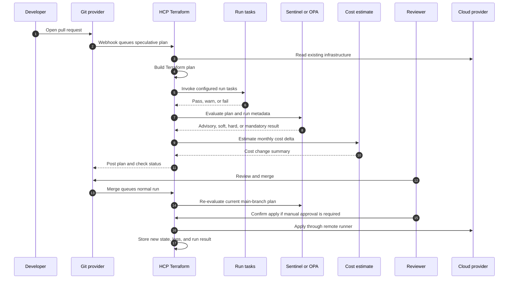

> **Complexity**: [COMPLEX]
>
> **Time to Complete**: 60-70 min
>
> **Prerequisites**: [Module 7.1: Terraform Deep Dive](../module-7.1-terraform/), [Module 7.2: OpenTofu](../module-7.2-opentofu/), and [IaC Discipline](/platform/disciplines/delivery-automation/iac/)

---

## Prerequisites

Before starting this module, you should be able to:

- Explain the Terraform state, plan, provider, module, and backend concepts
  from [Module 7.1: Terraform Deep Dive](../module-7.1-terraform/).
- Compare Terraform and [Module 7.2: OpenTofu](../module-7.2-opentofu/)
  at the level of workflow, licensing, backend compatibility, and platform
  risk.
- Apply the review, testing, and lifecycle ideas from
  [IaC Discipline](/platform/disciplines/delivery-automation/iac/) to a
  pull request that changes infrastructure.
- Read HCL comfortably enough to spot a resource replacement, a provider
  authentication boundary, and a variable whose value should be sensitive.
- Use Git pull requests as a collaboration boundary rather than treating
  infrastructure changes as private local work.

This module picks up exactly where Module 7.1 stops. Module 7.1 taught the
Terraform CLI, state, modules, providers, and planning model. This module is
about what happens when one engineer running `terraform apply` on a laptop
becomes a multi-team organizational workflow. HCP Terraform, formerly named
Terraform Cloud until HashiCorp's April 22, 2024 rebrand, adds remote runs,
shared state, VCS integration, RBAC, policy checks, run tasks, drift detection,
private registry workflows, and governance controls around the same Terraform
engine.

The goal is not to relearn HCL. The goal is to design the operating layer that
decides who can queue a run, where credentials come from, which policies can
block an apply, how reviewers see cost and drift, and how platform teams make
Terraform safe enough for many teams to use at once.

## Learning Outcomes

After completing this module, you will be able to:

- **Design** an HCP Terraform workspace model that separates state, execution,
  ownership, variables, and policy scope for a multi-team platform.
- **Implement** dynamic provider credentials with OIDC trust so HCP Terraform
  can assume cloud roles without storing long-lived access keys.
- **Compare** VCS-driven, CLI-driven, and API-driven HCP Terraform runs and
  select the workflow that fits a team, repository, and approval model.
- **Build** run-task, Sentinel, and OPA policy gates that block unsafe plans
  while preserving useful advisory feedback.
- **Evaluate and migrate** local Terraform workflows into HCP Terraform by
  weighing RUM pricing, self-hosted alternatives, drift operations, version
  pinning, state migration, and rollback paths.

## Why This Module Matters

Hypothetical scenario: a platform team manages a growing cloud estate with
ordinary Terraform repositories. The first few environments were manageable:
one engineer owned the VPC, another owned the Kubernetes cluster, and a third
owned the shared database module. Each person ran `terraform plan` locally,
copied the interesting lines into a pull request, and applied from a laptop
after a quick chat message approval.

That habit starts failing as soon as the organization grows. Two engineers
race against the same shared state file and one of them applies an old plan.
A plan log includes a generated password because a resource schema exposes a
sensitive-looking value as plain text. A production change happens during an
incident, but the audit trail says only that a laptop applied it with a user
token. A risky resource shape reaches production because no policy gate checked
tags, regions, encryption, or cost. A storage bucket is changed manually in the
cloud console, and no one notices until the next unrelated Terraform run tries
to undo it.

These are not HCL problems. They are workflow problems. The Terraform CLI can
create a plan, acquire state locks, and update infrastructure, but the CLI
does not decide how a hundred engineers should share credentials, approvals,
policy results, cost estimates, run history, or drift alerts. Once Terraform
becomes a shared production control plane, the workflow around Terraform is as
important as the code itself.

HCP Terraform exists in that operational space. It is not a different language
and it is not a magic replacement for module discipline. It is a managed runner
pool, state backend, access-control layer, VCS integration, private registry,
policy engine, run-task integration point, and organizational audit surface for
Terraform work. Used well, it turns "someone applied from a laptop" into an
explainable sequence: a pull request opened, HCP Terraform ran a speculative
plan, policies evaluated the plan, a cost estimate appeared, reviewers approved
the change, and a controlled apply ran after merge.

The trade-off is that you are adding a platform dependency. You must understand
pricing, hosted-service limits, policy-language choices, provider credential
boundaries, and the places where a self-hosted alternative may fit better. A
senior platform engineer treats HCP Terraform as an operating model decision,
not as a checkbox labeled "remote state."

## From Laptop Applies to Org-Scale Workflow

The local Terraform workflow is excellent for learning and for tiny solo
projects. A working directory contains HCL files, provider plugins, the state
backend configuration, and the CLI context needed to plan and apply. The same
person writes the change, reads the plan, owns the credentials, and performs
the apply. That tight loop is useful because feedback is fast and the mental
model is compact.

The same tight loop becomes a liability at organizational scale. A laptop is
not a reliable production change runner. It has local environment variables,
cached provider plugins, shell history, temporary files, and whatever version
of Terraform the engineer installed last month. A human can forget to pull the
latest main branch, apply a plan from an old commit, use the wrong cloud
profile, paste a sensitive value into a chat, or close the laptop halfway
through a long apply.

The operational question is simple: where should the authority to change
infrastructure live? In a mature setup, the answer should be "inside a workflow
that is visible, reviewable, policy-checked, and repeatable." HCP Terraform
supplies that workflow around Terraform Core.

```text
+---------------------------------------------------------------------+
|                 LOCAL CLI WORKFLOW FAILURE SURFACES                 |
+---------------------------------------------------------------------+
|                                                                     |
|  Laptop shell                                                       |
|  - local Terraform version                                          |
|  - local cloud profile                                              |
|  - local plan output                                                |
|  - local plugin cache                                               |
|                                                                     |
|  Shared organization                                                |
|  - many teams                                                       |
|  - many environments                                                |
|  - compliance review                                                |
|  - shared modules                                                   |
|  - audit requirements                                               |
|                                                                     |
|  Failure mode                                                       |
|  - state races if locking is weak                                   |
|  - secrets exposed in logs                                          |
|  - no durable "who approved this" trail                             |
|  - no consistent policy gate                                        |
|  - no scheduled drift signal                                        |
|  - no common cost review                                            |
|                                                                     |
+---------------------------------------------------------------------+
```

HCP Terraform changes the center of gravity. A workspace becomes the unit of
state and execution. A run becomes the durable record of a plan or apply. The
runner environment is disposable and consistent. Variables are stored in the
workspace or variable sets. VCS events can queue speculative plans before a
merge and ordinary runs after a merge. Policy checks, run tasks, cost
estimation, approvals, notifications, and drift health all attach to the run.

```text
+---------------------------------------------------------------------+
|                   HCP TERRAFORM OPERATING LAYER                     |
+---------------------------------------------------------------------+
|                                                                     |
|  Code source                 HCP Terraform workspace                |
|  - Git repository      -->   - state and run history                 |
|  - pull requests            - workspace variables                   |
|  - main branch              - variable sets                         |
|                             - Terraform version                     |
|                             - execution mode                        |
|                             - VCS connection                        |
|                             - policy sets                           |
|                             - run tasks                             |
|                             - drift and health settings             |
|                                                                     |
|  Remote run environment                                            |
|  - ephemeral worker                                                 |
|  - cloud credentials from OIDC or variables                         |
|  - provider plugins                                                 |
|  - plan, policy, cost, approval, apply                              |
|                                                                     |
+---------------------------------------------------------------------+
```

The default VCS-driven path is the one most teams adopt first. A pull request
opens against a Terraform repository. HCP Terraform detects the change through
the VCS connection and queues a speculative plan. "Speculative" means it checks
what would happen, but it cannot apply the change. Reviewers see the plan
before merge, along with policy results and any configured run-task results.
After merge, HCP Terraform queues a normal run from the main branch. If the
plan passes checks and the workspace uses manual apply, an authorized user
confirms the apply inside HCP Terraform.



This sequence is deliberately longer than `terraform apply`. That is the
point. The extra steps make organizational risk visible. A reviewer can answer
"what changed?", "who requested it?", "what policy failed?", "what changed in
cost?", "which credentials were used?", and "which run produced the current
state?" without asking someone to search a terminal scrollback.

Pause and predict: a team enables VCS-driven runs but leaves auto-apply on for
production. A pull request is approved and merged after a plan passes. What
will happen next, and which control did the team give up?

If auto-apply is enabled, the normal run queued from the merged commit can
apply automatically after successful checks. That can be appropriate for low
risk development workspaces, but it removes the explicit production approval
step inside HCP Terraform. For production, many teams keep speculative plans on
pull requests, require code review in VCS, and still require manual apply in
the HCP Terraform workspace after merge.

The workflow also changes how secrets should move. In local workflows, teams
often rely on cloud profiles, environment variables, or local secret managers.
In HCP Terraform, the runner needs credentials too, but storing long-lived
cloud keys as workspace variables is the weaker option. Dynamic provider
credentials, covered in the next section, let HCP Terraform exchange a signed
OIDC workload identity token for short-lived cloud credentials during each run.

The major design decision is not "remote or local." It is "where is the
control boundary?" HCP Terraform lets the control boundary include source
control, workspace RBAC, policy sets, variable sets, remote execution, run
history, and health assessment. If your organization needs those controls,
remote workflow is not a convenience feature. It is the infrastructure change
system.

## Workspaces, Variable Sets, and Dynamic Provider Credentials

An HCP Terraform workspace is not the same thing as a Terraform CLI workspace.
In the CLI, workspaces are usually multiple state instances for one working
directory. In HCP Terraform, a workspace is an operational object: it has a
name, state history, run history, variables, execution mode, VCS settings,
permissions, policy associations, run-task associations, health settings, and
metadata. Treat it as the unit of ownership for a root module.

The simplest workspace model is one workspace per environment for one root
module. For example, an application might have `payments-dev`,
`payments-staging`, and `payments-prod`. Each workspace points at the same
repository and working directory, but uses different variables and approvals.
This is easy to understand, easy to permission, and easy to map to cloud
accounts. It can become noisy when many applications each need many
environments.

Another model is one workspace per application and environment boundary, with
projects used to group a team or product area. A project named `payments` might
contain `payments-network-dev`, `payments-app-dev`, `payments-db-dev`, and the
matching staging and production workspaces. This works well when platform
teams want project-scoped variable sets and permissions, because a team can
own a project without owning the entire organization.

A third model is a matrix: team, application, environment, and layer. This
model is powerful but can explode if naming and ownership are sloppy. A
workspace such as `checkout-prod-network-us-east` tells a useful story. A
workspace such as `prod-2` does not. The name should make ownership, blast
radius, and environment obvious during an incident.

| Workspace pattern | Example | Use when | Trade-off |
|---|---|---|---|
| Per environment | `orders-dev`, `orders-prod` | One root module maps cleanly to each environment | Easy to start, but can hide layer boundaries |
| Per layer | `network-prod`, `cluster-prod`, `apps-prod` | Platform-owned layers are shared across teams | Strong separation, but more cross-workspace dependencies |
| Per application | `payments-prod`, `search-prod` | App teams own most infrastructure | Good autonomy, but shared infrastructure needs careful contracts |
| Matrix | `checkout-prod-db-us-east` | Many teams, regions, and layers need explicit blast radius | Precise naming, but operational sprawl is easy |

The most important workspace design rule is to keep state boundaries aligned
with operational ownership. If two teams need separate approvals, separate
credentials, or separate rollback windows, they probably should not share one
workspace. If two resource groups must always change atomically, splitting them
across workspaces may create coordination pain.

Variable scoping is the next operational layer. HCP Terraform supports
workspace-level variables, variable sets, and run-supplied values. A workspace
variable is precise and local. A variable set can apply globally, to selected
projects, or to selected workspaces. A run-level value is useful for automation
or one-off queued runs, but it should not become the hidden source of ordinary
environment configuration.

```text
+---------------------------------------------------------------------+
|                    VARIABLE SCOPE DECISION                          |
+---------------------------------------------------------------------+
|                                                                     |
|  Global variable set                                                |
|  - use for values every workspace truly needs                       |
|  - risk: accidental overexposure                                    |
|                                                                     |
|  Project variable set                                               |
|  - use for team or product defaults                                 |
|  - good fit for OIDC role ARNs and provider region defaults          |
|                                                                     |
|  Workspace variable                                                 |
|  - use for environment-specific values                              |
|  - good fit for replica count, account ID, feature flags             |
|                                                                     |
|  Run-level override                                                 |
|  - use for automation experiments and controlled break-glass runs    |
|  - risk: invisible habit if repeated manually                       |
|                                                                     |
+---------------------------------------------------------------------+
```

Mark variables sensitive when their values should not appear in the UI or logs,
but do not confuse sensitive marking with a full secret-management strategy.
Sensitive variables still exist in a platform. A better pattern for cloud
provider authentication is dynamic provider credentials. The runner receives
short-lived credentials only for the run phase, and the cloud provider decides
whether to trust the HCP Terraform workload identity token.

Dynamic provider credentials use OIDC. HCP Terraform signs a workload identity
token that includes claims such as organization, project, workspace, and run
phase. AWS, Azure, GCP, Vault, Kubernetes, or HCP validates that token and
returns temporary credentials. The run proceeds, and the disposable runner is
torn down after the plan or apply.

```text
+---------------------------------------------------------------------+
|              DYNAMIC PROVIDER CREDENTIALS WITH OIDC                 |
+---------------------------------------------------------------------+
|                                                                     |
|  HCP Terraform run                                                  |
|       |                                                             |
|       | 1. create workload identity token                           |
|       v                                                             |
|  OIDC token claims                                                  |
|       - audience: aws.workload.identity                             |
|       - subject: organization:org:project:proj:workspace:ws         |
|       - run phase: plan or apply                                    |
|       |                                                             |
|       | 2. send token to cloud STS                                  |
|       v                                                             |
|  AWS IAM OIDC provider and role trust                               |
|       |                                                             |
|       | 3. verify issuer, audience, subject, and signing key         |
|       v                                                             |
|  Temporary AWS credentials                                          |
|       |                                                             |
|       | 4. provider uses short-lived credentials for this run        |
|       v                                                             |
|  Terraform plan or apply                                            |
|                                                                     |
+---------------------------------------------------------------------+
```

The AWS side has two pieces: an IAM OIDC identity provider for
`https://app.terraform.io` and a role whose trust policy accepts the exact
organization, project, workspace, and run phase you intend. The trust policy is
the safety story. If you only check that "some token from HCP Terraform" was
signed, you have not scoped the trust enough.

```json
{
  "Version": "2012-10-17",
  "Statement": [
    {
      "Effect": "Allow",
      "Principal": {
        "Federated": "arn:aws:iam::123456789012:oidc-provider/app.terraform.io"
      },
      "Action": "sts:AssumeRoleWithWebIdentity",
      "Condition": {
        "StringEquals": {
          "app.terraform.io:aud": "aws.workload.identity"
        },
        "StringLike": {
          "app.terraform.io:sub": "organization:kubedojo-labs:project:platform-prod:workspace:network-prod:run_phase:*"
        }
      }
    }
  ]
}
```

That trust policy allows any run phase for one workspace. A stricter
production design can split plan and apply roles. The plan role can read enough
to build a plan, while the apply role can mutate infrastructure. That split is
not free: some providers need write-like permissions during planning for data
sources or validation behavior. Start strict, test real plans, and document
exceptions.

The role also needs an AWS permissions policy. Keep this example deliberately
small. It can list S3 buckets for a learning workspace and manage only buckets
whose names match a training prefix. A real production role would be generated
from your cloud account model, not copied from a tutorial.

```json
{
  "Version": "2012-10-17",
  "Statement": [
    {
      "Sid": "ListBucketsForPlan",
      "Effect": "Allow",
      "Action": [
        "s3:ListAllMyBuckets",
        "s3:GetBucketLocation"
      ],
      "Resource": "*"
    },
    {
      "Sid": "ManageTrainingBuckets",
      "Effect": "Allow",
      "Action": [
        "s3:CreateBucket",
        "s3:DeleteBucket",
        "s3:GetBucketTagging",
        "s3:PutBucketTagging"
      ],
      "Resource": "arn:aws:s3:::kubedojo-hcp-training-*"
    }
  ]
}
```

In HCP Terraform, configure environment variables for the workspace or a
project-scoped variable set. These are not AWS access keys. They tell HCP
Terraform to use its AWS OIDC integration and which role to request.

```text
TFC_AWS_PROVIDER_AUTH=true
TFC_AWS_RUN_ROLE_ARN=arn:aws:iam::123456789012:role/hcp-terraform-network-prod
AWS_REGION=us-east-1
```

The corresponding provider configuration should avoid static credential
arguments. Let HCP Terraform write the temporary credential file and let the
AWS provider read it through the dynamic credential integration.

```hcl
terraform {
  required_version = "~> 1.14"

  required_providers {
    aws = {
      source  = "hashicorp/aws"
      version = "~> 6.0"
    }
  }

  cloud {
    organization = "kubedojo-labs"

    workspaces {
      name = "network-prod"
    }
  }
}

provider "aws" {
  region = var.aws_region

  default_tags {
    tags = {
      ManagedBy   = "hcp-terraform"
      Workspace   = "network-prod"
      Environment = "prod"
    }
  }
}

variable "aws_region" {
  type    = string
  default = "us-east-1"
}
```

When multiple AWS provider aliases are needed in the same workspace, HCP
Terraform can supply a `tfc_aws_dynamic_credentials` object. Each alias maps to
a generated shared config file. That is useful for cross-account modules, but
it also raises the blast-radius question again. If a root module needs many
cloud roles, ask whether it is trying to manage too many ownership domains in
one workspace.

```hcl
variable "tfc_aws_dynamic_credentials" {
  description = "AWS dynamic credential files generated by HCP Terraform."
  type = object({
    default = object({
      shared_config_file = string
    })
    aliases = map(object({
      shared_config_file = string
    }))
  })
}

provider "aws" {
  region              = "us-east-1"
  shared_config_files = [var.tfc_aws_dynamic_credentials.default.shared_config_file]
}

provider "aws" {
  alias               = "audit"
  region              = "us-east-1"
  shared_config_files = [var.tfc_aws_dynamic_credentials.aliases["audit"].shared_config_file]
}
```

Pause and predict: a platform team puts one powerful AWS role ARN in a global
variable set because "every workspace needs AWS." What will happen when a new
experimental workspace is created by a team that should only manage a sandbox
account?

The workspace can inherit access it should not have. Dynamic credentials remove
long-lived keys, but they do not automatically solve authorization scope. The
trust policy and variable-set scope must match the ownership model. Prefer
project-scoped or workspace-scoped role variables, and make global variable
sets boring: common flags, provider cache settings, or safe defaults rather
than privileged cloud roles.

HCP Terraform can also be managed through Terraform itself with the `tfe`
provider. This is attractive once your workspace count grows. The provider can
create projects, workspaces, variable sets, variables, run tasks, and policy
sets. It also creates a bootstrapping challenge: the platform that manages HCP
Terraform needs its own secure token, review process, and recovery path.

```hcl
terraform {
  required_providers {
    tfe = {
      source  = "hashicorp/tfe"
      version = "~> 0.76"
    }
  }
}

provider "tfe" {
  organization = "kubedojo-labs"
}

resource "tfe_project" "platform_prod" {
  name = "platform-prod"
}

resource "tfe_workspace" "network_prod" {
  name              = "network-prod"
  project_id        = tfe_project.platform_prod.id
  terraform_version = "~> 1.14"
  working_directory = "infra/network"
  tag_names         = ["team:platform", "env:prod", "layer:network"]

  vcs_repo {
    identifier                 = "kubedojo-labs/infrastructure-live"
    branch                     = "main"
    github_app_installation_id = var.github_app_installation_id
  }
}

resource "tfe_variable_set" "aws_prod_oidc" {
  name        = "AWS production OIDC"
  description = "Dynamic AWS credential settings for production workspaces."
}

resource "tfe_project_variable_set" "aws_prod_oidc" {
  project_id       = tfe_project.platform_prod.id
  variable_set_id  = tfe_variable_set.aws_prod_oidc.id
}

resource "tfe_variable" "aws_auth" {
  key             = "TFC_AWS_PROVIDER_AUTH"
  value           = "true"
  category        = "env"
  variable_set_id = tfe_variable_set.aws_prod_oidc.id
}

resource "tfe_variable" "aws_role" {
  key             = "TFC_AWS_RUN_ROLE_ARN"
  value           = "arn:aws:iam::123456789012:role/hcp-terraform-network-prod"
  category        = "env"
  variable_set_id = tfe_variable_set.aws_prod_oidc.id
}
```

This HCL creates HCP Terraform resources, not cloud infrastructure. That means
it belongs in a platform administration repository with careful permissions.
Avoid letting every application team manage shared organization settings. Let
application teams own their application workspaces; let the platform team own
organization-wide controls.

## VCS-Driven, API-Driven, and CLI-Driven Runs

HCP Terraform supports several run workflows because organizations have
different collaboration surfaces. The Terraform engine is still the same, but
the event that queues a run and the human experience around that run differ.
The wrong workflow creates friction; the right workflow makes the safe path the
easy path.

VCS-driven workflow is the default for infrastructure code that lives in Git.
HCP Terraform connects to GitHub, GitLab, Bitbucket, or another supported VCS
provider. A pull request queues a speculative plan. A merge to the configured
branch queues a normal run. The workspace can restrict which directories or
file patterns trigger runs, which matters in mono-repositories.

```text
+---------------------------------------------------------------------+
|                         VCS-DRIVEN RUNS                             |
+---------------------------------------------------------------------+
|                                                                     |
|  Pull request opened                                                |
|       -> speculative plan                                           |
|       -> policy checks                                              |
|       -> run tasks                                                  |
|       -> VCS status                                                 |
|                                                                     |
|  Main branch updated                                                |
|       -> normal plan                                                |
|       -> cost estimate and policies                                 |
|       -> manual or automatic apply                                  |
|       -> state update                                               |
|                                                                     |
+---------------------------------------------------------------------+
```

Use VCS-driven runs when the repository is the collaboration boundary and the
team wants pull request checks to include Terraform plan results. This is the
best fit for most shared infrastructure. It keeps the plan near the code
review, gives reviewers a durable link to the run, and makes the main branch
the source of applyable configuration.

The VCS model has two common pitfalls. First, a plan on a pull request is not
the same as a plan from the final merged commit. Branches move. Variables can
change. Remote infrastructure can change. HCP Terraform still runs the
main-branch plan after merge, and that is the run that can apply. Second,
repository access is not workspace access. A user may be able to propose code
without being allowed to approve or apply in HCP Terraform.

CLI-driven workflow keeps the familiar local command surface while moving
state and remote operations into HCP Terraform. The user runs `terraform plan`
or `terraform apply`, but the configuration is uploaded and the run executes in
HCP Terraform by default. The local terminal streams output from the remote run.
This is useful for teams that are migrating from local workflows or that need a
human to queue runs from a controlled workstation.

```hcl
terraform {
  cloud {
    organization = "kubedojo-labs"

    workspaces {
      project = "platform-dev"
      tags = {
        layer  = "network"
        source = "cli"
      }
    }
  }
}
```

```bash
terraform login
terraform init
terraform plan
terraform apply
```

The `cloud` block links the working directory to HCP Terraform. The login step
creates a local CLI token for HCP Terraform, not a cloud provider credential.
Cloud provider credentials should still come from workspace variables,
variable sets, or dynamic provider credentials in the remote run environment.

CLI-driven runs are strongest when a platform team wants remote state, remote
execution, and policy checks without immediately redesigning every repository
around VCS webhooks. They are weaker when teams need pull request checks as the
main approval surface. A local CLI command can be a good migration bridge, but
it should not become a private backdoor around VCS review.

API-driven workflow queues configuration versions and runs through the HCP
Terraform API or through the `tfe` provider. This model fits custom portals,
internal developer platforms, release orchestrators, and compliance systems
that need to create workspaces, upload generated configuration, or coordinate
runs across systems.

```bash
curl \
  --header "Authorization: Bearer $TFC_TOKEN" \
  --header "Content-Type: application/vnd.api+json" \
  --request POST \
  --data @run.json \
  "https://app.terraform.io/api/v2/runs"
```

```json
{
  "data": {
    "attributes": {
      "message": "Queue run from platform release orchestrator",
      "auto-apply": false
    },
    "type": "runs",
    "relationships": {
      "workspace": {
        "data": {
          "type": "workspaces",
          "id": "ws-example"
        }
      }
    }
  }
}
```

Use API-driven runs when HCP Terraform is one control plane behind a larger
workflow. For example, a service catalog may collect a developer request,
validate it, create a workspace from an approved module, attach a variable set,
and queue a run. The API path can be excellent, but only if the orchestrator
does not hide plan review and policy failures behind a friendly button.

| Workflow | Best fit | Strength | Risk |
|---|---|---|---|
| VCS-driven | Shared infrastructure repositories | Pull request plan checks and merge-based applies | Requires careful repo-to-workspace mapping |
| CLI-driven | Migration bridge or expert operator workflow | Familiar commands with remote execution and state | Can bypass PR review if governance is weak |
| API-driven | Internal platforms and automation | Full orchestration and workspace lifecycle control | Custom tooling can obscure run details |

The choice can vary by workspace. A platform networking workspace may be
VCS-driven and manual-apply only. A sandbox workspace may be VCS-driven with
auto-apply. A service catalog may use API-driven runs to launch no-code module
workspaces. A migration team may use CLI-driven runs while moving old backends
into HCP Terraform.

Before running a new workflow, ask three questions. What event queues a run?
Who can approve the run? Where does a reviewer inspect the exact plan that will
apply? If those answers are fuzzy, the workflow is not ready for production.

## Run Tasks, Sentinel, OPA, and Cost Gates

HCP Terraform has several gates that can evaluate a run. Run tasks call an
external service at a configured stage. Sentinel policies evaluate Terraform
run data with HashiCorp's policy language. OPA policies evaluate JSON input
with Rego. Cost estimation estimates the monthly cost impact of supported
cloud resources before apply. The trick is to use each gate for the problem it
is best at solving.

Run tasks are integration hooks. They can fire before plan, after plan, before
apply, or after apply. A security scanner might run post-plan because it needs
the planned resource changes. A ticketing integration might run pre-apply
because it needs to confirm that a change window exists. A notification or
inventory integration might run post-apply because it cares about the final
result.

```text
+---------------------------------------------------------------------+
|                       RUN TASK LIFECYCLE                            |
+---------------------------------------------------------------------+
|                                                                     |
|  Pre-plan       -> validate configuration or request metadata        |
|  Terraform plan -> produce plan                                     |
|  Post-plan      -> scan plan with Checkov, Snyk, Wiz, Aqua, etc.    |
|  Policy checks  -> Sentinel or OPA                                  |
|  Cost estimate  -> supported cloud resource cost delta              |
|  Pre-apply      -> change ticket, freeze window, extra approval      |
|  Terraform apply -> mutate infrastructure                           |
|  Post-apply     -> inventory, CMDB, notification, evidence export    |
|                                                                     |
+---------------------------------------------------------------------+
```

Run tasks have advisory and mandatory enforcement levels. Advisory failures
show warnings but do not stop the run. Mandatory failures can stop the run.
Start new integrations as advisory until you know their false-positive rate.
Make them mandatory only when the signal is reliable and the owner has a clear
support path.

The `tfe` provider can define and attach a run task as code. The endpoint here
is an example URL, not a real scanner. In production, the URL belongs to the
third-party tool or to an internal service that understands HCP Terraform's run
task payload and callback behavior.

```hcl
variable "run_task_hmac_key" {
  type        = string
  description = "HMAC key shared with the run task receiver."
  sensitive   = true
}

resource "tfe_organization_run_task" "iac_security" {
  organization        = "kubedojo-labs"
  name                = "iac-security-post-plan"
  description         = "Post-plan IaC security scan for production workspaces."
  url                 = "https://example.com/hcp-terraform/run-task"
  enabled             = true
  hmac_key_wo         = var.run_task_hmac_key
  hmac_key_wo_version = 1
}

resource "tfe_workspace_run_task" "network_prod_iac_security" {
  workspace_id      = tfe_workspace.network_prod.id
  task_id           = tfe_organization_run_task.iac_security.id
  enforcement_level = "mandatory"
  stages            = ["post_plan"]
}
```

Sentinel is HashiCorp's policy-as-code language. In HCP Terraform, Sentinel
policies can use Terraform-specific imports for plan, configuration, state, and
run data. Sentinel policy enforcement levels are advisory, soft mandatory, and
hard mandatory. Advisory informs. Soft mandatory blocks unless an authorized
override is allowed. Hard mandatory blocks until the policy passes, unless the
policy set has an override model that explicitly permits an exception.

Sentinel fits teams that want the policy system built into HCP Terraform, want
cost-estimation data in policy checks, or prefer HashiCorp's policy model. It
is especially common for platform governance rules such as required tags,
approved instance families, forbidden public access, or module-source rules.

The following Sentinel policy blocks EC2 instances that are created or updated
without required tags. It is intentionally small enough to read during review.
Production policy libraries usually factor common resource traversal and tag
helpers into shared files.

```text
import "tfplan/v2" as tfplan

required_tags = [
  "Owner",
  "CostCenter",
  "Environment",
]

managed_instance_changes = filter tfplan.resource_changes as _, rc {
  rc.mode is "managed" and
  rc.type is "aws_instance" and
  (rc.change.actions contains "create" or rc.change.actions contains "update")
}

violations = {}

for managed_instance_changes as address, rc {
  tags = rc.change.after.tags else {}
  missing = filter required_tags as tag {
    not (tag in keys(tags))
  }

  if length(missing) > 0 {
    violations[address] = missing
    print(address, "is missing required tags:", missing)
  }
}

main = rule {
  length(violations) is 0
}
```

A policy like this should be hard mandatory only after the organization has a
tag taxonomy, a migration path for existing infrastructure, and a way to handle
exceptions. If not, it will train teams to fight the policy system. Advisory
mode can be useful for measuring blast radius before enforcement.

OPA uses Rego, a general-purpose policy language used far beyond Terraform.
HCP Terraform passes combined run and plan JSON to OPA. Your Rego query must
return an array. An empty array means the policy passed; a non-empty array
contains violations. OPA fits teams that already use Rego in Kubernetes
admission, CI, service mesh policy, or cloud governance and want a common
policy language across systems.

The following OPA policy limits regions to an approved set. It checks managed
resource changes and looks for a `region` attribute where providers expose one
directly. Some AWS resources inherit region from the provider configuration
rather than a resource argument, so production policies often combine resource
checks with provider and workspace metadata checks.

```rego
package terraform.policies.allowed_regions

import future.keywords.in
import input.plan as plan

approved_regions := {
  "us-east-1",
  "us-west-2",
  "eu-west-1",
}

write_actions := {
  "create",
  "update",
  "delete",
}

deny[msg] {
  rc := plan.resource_changes[_]
  rc.mode == "managed"
  some action in rc.change.actions
  action in write_actions

  region := object.get(rc.change.after, "region", "")
  region != ""
  not region in approved_regions

  msg := sprintf("%s uses unapproved region %s", [rc.address, region])
}
```

OPA policy enforcement levels in HCP Terraform are advisory and mandatory.
Mandatory OPA failures can be overridden by a user with the required policy
override permission. That difference matters when you compare OPA with
Sentinel. Sentinel has a more detailed enforcement vocabulary, while OPA gives
you Rego portability.

| Gate | Good for | Enforcement | Watch out for |
|---|---|---|---|
| Run task | Third-party scans and external workflow checks | Advisory or mandatory | Network dependency and external service reliability |
| Sentinel | HCP-native policy, cost-aware checks, Terraform imports | Advisory, soft mandatory, hard mandatory | Less portable outside HashiCorp workflows |
| OPA | Rego reuse across platforms | Advisory or mandatory | Query must return arrays and input shape must be tested |
| Cost estimation | Monthly cost delta before apply | Displayed check and Sentinel input in policy checks | Only estimates supported resource types and providers |

Cost estimation is not a replacement for FinOps, tagging, or budget alerts. It
is a run-time review signal. It can show whether a plan adds expensive resource
classes before the apply happens. A good platform team uses it with policy: for
example, warn on a large monthly increase in development, block oversized
compute in sandbox, or require an exception label for premium storage classes.

```text
import "tfrun"

monthly_delta_limit = 250.00

main = rule {
  tfrun.cost_estimate.delta_monthly_cost else 0.0 <= monthly_delta_limit
}
```

That example is intentionally simple. Real cost policies should handle unknown
costs, currency assumptions, environment differences, and planned replacements
that temporarily double capacity. A policy that blocks every unknown estimate
may be safe but unusable. A policy that ignores unknown estimates may allow the
most expensive changes to bypass review.

The engineering habit is to put each concern in the right gate. Use a policy
when the rule is deterministic from plan or run data. Use a run task when an
external system owns the decision. Use cost estimation for early cost signal,
then back it with budgets and cloud billing alerts after apply.

## Drift Detection, Private Registry, and Self-Service

Remote execution and policy gates handle planned changes. Production systems
also change outside planned workflows. Someone edits a security group during an
incident. A cloud service updates a default. A script deletes a resource. A
team tests a manual console change and forgets to codify it. Drift detection is
the scheduled signal that reality no longer matches Terraform configuration.

HCP Terraform health assessments include drift detection and continuous
validation. Drift detection checks whether real infrastructure still matches
the configuration. Continuous validation evaluates Terraform check blocks,
preconditions, and postconditions after provisioning. These assessments require
remote or agent execution and a workspace with at least one successful apply.

```text
+---------------------------------------------------------------------+
|                      DRIFT RESPONSE MODEL                           |
+---------------------------------------------------------------------+
|                                                                     |
|  Drift detected                                                     |
|       |                                                             |
|       +--> Was the external change intentional?                     |
|       |        |                                                    |
|       |        +--> Yes: update Terraform code and review           |
|       |        |                                                    |
|       |        +--> No: queue plan to restore desired config        |
|       |                                                             |
|       +--> Is it state drift only?                                  |
|                |                                                    |
|                +--> Yes: use refresh-only or state repair path      |
|                |                                                    |
|                +--> No: treat as config drift                       |
|                                                                     |
+---------------------------------------------------------------------+
```

Do not treat every drift alert as "Terraform should overwrite it." Sometimes
drift is an emergency fix that should become code. Sometimes it is a manual
mistake that should be reverted. Sometimes it is not configuration drift at
all, but state drift or a provider read behavior. HCP Terraform's drift result
is the start of a review, not the end of judgment.

Run triggers connect workspaces when one workspace depends on another. If a
network workspace applies successfully, it can queue runs in downstream
workspaces that consume its outputs. This is useful when the downstream
configuration reads values from an upstream workspace through `tfe_outputs` or
a remote-state pattern. HCP Terraform supports connecting a workspace to up to
20 source workspaces.

```text
+---------------------------------------------------------------------+
|                         RUN TRIGGER EXAMPLE                         |
+---------------------------------------------------------------------+
|                                                                     |
|  network-prod apply succeeds                                        |
|       |                                                             |
|       +--> cluster-prod run queued                                  |
|       |        reads VPC and subnet outputs                         |
|       |                                                             |
|       +--> observability-prod run queued                            |
|                reads private subnet outputs                         |
|                                                                     |
+---------------------------------------------------------------------+
```

Run triggers are useful, but they can create hidden coupling. If every
workspace triggers every other workspace, the organization has built a slow
distributed monolith. Use triggers for real data dependencies. Prefer explicit
workspace outputs with narrow access over broad state sharing. The `tfe_outputs`
data source is usually safer than `terraform_remote_state` because consumers do
not need full state access to read selected outputs.

The private registry solves a different organizational problem: how teams share
approved modules and providers. Public modules are convenient, but production
platforms need curation, versioning, documentation, and ownership. HCP
Terraform's private registry supports private modules and providers for an
organization, plus synchronized public modules that the platform team wants to
bless for internal use.

```text
+---------------------------------------------------------------------+
|                    PRIVATE REGISTRY OPERATING MODEL                 |
+---------------------------------------------------------------------+
|                                                                     |
|  Module repository                                                  |
|  - terraform-aws-vpc                                                |
|  - semantic version tags                                            |
|  - examples and README                                              |
|  - tests before release                                             |
|                                                                     |
|             publish                                                 |
|                |                                                    |
|                v                                                    |
|  HCP Terraform private registry                                     |
|  - searchable documentation                                         |
|  - version list                                                     |
|  - usage visibility                                                 |
|  - no-code-ready designation where appropriate                      |
|                                                                     |
|             consume                                                 |
|                |                                                    |
|                v                                                    |
|  Application workspaces                                             |
|  - pin module versions                                              |
|  - receive update signals                                           |
|  - satisfy policy rules                                             |
|                                                                     |
+---------------------------------------------------------------------+
```

Consuming a private registry module looks like consuming a public registry
module, except the source address uses the HCP Terraform organization namespace.
Pin versions deliberately. A platform team should not break production by
moving an implicit latest version under an application team.

```hcl
module "service_bucket" {
  source  = "app.terraform.io/kubedojo-labs/s3-service-bucket/aws"
  version = "1.3.2"

  name        = "payments-artifacts-prod"
  environment = "prod"
  owner       = "payments"
}
```

Private registry governance is not only about storage. It is about contracts.
The module author promises inputs, outputs, defaults, upgrade notes, and
deprecation behavior. The consuming team promises version pins, review, and
timely upgrades. HCP Terraform can show usage, but platform teams still need
release discipline.

No-code modules take registry governance one step further. A no-code-ready
module lets a user provision infrastructure through HCP Terraform without
writing Terraform configuration. HCP Terraform creates a workspace from the
module, prompts for allowed inputs, and queues a run. This can be a powerful
self-service pattern for application teams that need approved infrastructure
quickly.

The governance trade-off is obvious: no-code makes the easy path very easy.
That is good if the module is tightly scoped, variables have safe defaults,
provider credentials are project-scoped, and cost boundaries are enforced. It
is risky if the module exposes broad cloud choices, inherits a powerful global
credential set, or auto-applies expensive resources without review.

```hcl
variable "environment" {
  type        = string
  description = "Deployment environment."

  validation {
    condition     = contains(["dev", "staging", "prod"], var.environment)
    error_message = "Environment must be dev, staging, or prod."
  }
}

variable "bucket_purpose" {
  type        = string
  description = "Purpose label for the bucket."

  validation {
    condition     = can(regex("^[a-z0-9-]{3,30}$", var.bucket_purpose))
    error_message = "Use lowercase letters, numbers, and hyphens."
  }
}

resource "aws_s3_bucket" "this" {
  bucket = "kubedojo-${var.environment}-${var.bucket_purpose}"

  tags = {
    Owner       = "platform"
    CostCenter  = "training"
    Environment = var.environment
  }
}
```

The best no-code modules are boring. They provide a paved path for common
requests: a standard bucket, a standard queue, a standard database sandbox, or
a standard service account. They should not be a disguised cloud console with
every possible knob exposed. When a user needs unusual control, route them back
to code review and a normal workspace.

## Migration from Local Terraform to HCP Terraform

Migration is a state and workflow operation, not a search-and-replace. The
configuration may barely change, but the authority over state, credentials,
variables, and applies moves to HCP Terraform. A safe migration proves the new
workspace can reproduce the current plan before anyone retires the old backend.

Start with inventory. Identify the current backend, Terraform version, provider
versions, state object, cloud credentials, CI jobs, manual runbooks, and
workspace naming pattern. If the repository already uses Terraform CLI
workspaces, decide how those names map to HCP Terraform workspaces. HCP
Terraform workspaces need globally unique names inside an organization.

```bash
terraform version
terraform providers
terraform state list
terraform plan -out=before-hcp.tfplan
terraform show -no-color before-hcp.tfplan > before-hcp-plan.txt
```

The pre-migration plan should be reviewed before any backend change. If the
current configuration already wants to replace production resources, do not
move state first and debug later. Fix or accept the current plan in the old
workflow, then migrate a stable state.

Next, create or select the target HCP Terraform organization, project, and
workspace. Configure the Terraform version in the workspace settings rather
than letting it float silently. Configure provider credentials, ideally through
dynamic provider credentials. Attach variable sets, policy sets, and run tasks
in advisory mode until the first migration plan is understood.

Add a `cloud` block to the Terraform configuration. Do not keep an old backend
block next to it. The configuration should have one state authority.

```hcl
terraform {
  required_version = "~> 1.14"

  cloud {
    organization = "kubedojo-labs"

    workspaces {
      name = "payments-prod"
    }
  }
}
```

Then authenticate to HCP Terraform and initialize with state migration. The
exact prompts depend on whether the old state is local, an object-storage
backend, or the legacy remote backend. Read the prompt. Do not script a
production migration blindly the first time.

```bash
terraform login
terraform init -migrate-state
terraform plan -out=after-hcp.tfplan
terraform show -no-color after-hcp.tfplan > after-hcp-plan.txt
```

The expected result is a no-op plan or a plan whose differences are explained
by known environment changes. If the migrated plan differs from the old plan,
stop and compare inputs. Common causes include missing workspace variables,
different provider credentials, a different working directory, an unpinned
Terraform version, or a local file that was not uploaded to HCP Terraform.

```bash
diff -u before-hcp-plan.txt after-hcp-plan.txt
```

For VCS-driven migration, connect the workspace to the repository only after
state migration and variable setup are correct. Enable speculative plans first.
Open a pull request that changes a harmless output or comment and verify that
HCP Terraform posts the expected plan. Then merge a controlled change and
confirm the normal run behavior. Keep manual apply on until the team has
operated the workspace for a while.

```text
+---------------------------------------------------------------------+
|                       MIGRATION SEQUENCE                            |
+---------------------------------------------------------------------+
|                                                                     |
|  1. Inventory current backend, versions, credentials, and CI         |
|  2. Capture pre-migration plan                                      |
|  3. Create HCP Terraform project and workspace                      |
|  4. Configure variables and dynamic credentials                     |
|  5. Add cloud block                                                 |
|  6. Run terraform init -migrate-state                               |
|  7. Capture post-migration plan                                     |
|  8. Compare plans and resolve differences                           |
|  9. Connect VCS and run speculative plan                            |
| 10. Perform controlled normal run                                   |
| 11. Retire old backend and old CI apply path                        |
|                                                                     |
+---------------------------------------------------------------------+
```

A dual-run period can help, but define what "dual" means. Do not let two
systems apply to the same state. A safe dual-run period often means HCP
Terraform is the only system allowed to apply, while old CI still runs
read-only validation or has its apply job disabled. If two systems can mutate
the same infrastructure, you have not migrated; you have created a race.

Rollback is mostly about state authority. Before migration, back up the old
state through the backend's supported mechanism. After migration, know how to
download state versions from HCP Terraform and who has permission to do so. If
you must roll back to the old backend, stop HCP Terraform runs, restore the
known-good state to the old backend, remove the `cloud` block, restore the old
backend block, and run a no-op plan before applying anything.

Common migration pitfalls are predictable. Teams forget sensitive environment
variables that existed only in CI. They rely on local files not uploaded during
CLI-driven remote runs. They leave `terraform.workspace` assumptions in code
even though HCP Terraform workspace names are full names. They enable policies
as hard mandatory before measuring existing violations. They connect VCS too
early and queue runs before credentials are ready.

The migration is complete only when the old apply path is retired. A README
that says "use HCP Terraform" is not enough. Disable old CI apply jobs, revoke
old long-lived cloud keys, update runbooks, and tell incident responders where
to find run history, state versions, policy results, and drift alerts.

## Cost Lens: Plans, RUM, and Operating Alternatives

HCP Terraform pricing is based on managed resources, often called Resources
Under Management or RUM. A managed resource is a managed-mode Terraform
resource in an HCP Terraform-managed state file, counted starting from the
first plan or apply. The count is not the number of cloud accounts, engineers,
or repositories. It is the number of Terraform-managed resource instances
recorded in state, with some special resource types excluded by HashiCorp's
pricing definitions.

As of May 19, 2026, the public HashiCorp/IBM pricing pages use the names
Essentials, Standard, Premium, and Enterprise Self Managed. Older contract and
Flex materials may still use Plus. In this module, "Plus/Premium" refers to
that higher SaaS governance tier when you are comparing with older materials.
Use the live pricing page before making procurement decisions.

| Edition on current public page | Price signal as of May 19, 2026 | Practical meaning |
|---|---|---|
| Free | 500 managed resources at no charge on the enhanced free tier | Good for learning, small teams, pilots, and low-risk workspaces |
| Essentials | ten cents per resource per month, rated hourly at $0.00013 | Paid entry tier for professional teams adopting HCP Terraform |
| Standard | forty-seven cents per resource per month, rated hourly at $0.00064 | Governance tier for standardized infrastructure automation |
| Premium, formerly compared with Plus in older material | ninety-nine cents per resource per month, rated hourly at $0.00135 | Higher tier for self-service and advanced lifecycle workflows |
| Enterprise Self Managed | Custom pricing | Private self-managed deployment for strict control requirements |

The free tier can be enough for a small platform pilot. It includes important
workflow features such as remote state, remote runs, VCS connections, private
registry access, SSO, policy enforcement, and run tasks, but it is bounded by
the managed-resource limit and operational limits such as run concurrency. Free
is a good learning and proof-of-value tier. It is not a guarantee that a
growing production estate stays free.

Standard becomes attractive when the organization needs capabilities such as
health assessments, audit logging, drift detection, no-code provisioning, and
more mature governance. The key question is not "is Standard expensive?" The
question is "which production risks are we paying to reduce, and how many
resources will this billing model count?"

Plus/Premium becomes relevant when the organization needs advanced self-service
and lifecycle controls, higher governance capability, agent-based features, or
the product features that HashiCorp places above Standard. Enterprise Self
Managed becomes worth evaluating when data residency, isolated networking,
self-managed control, internal compliance, or procurement requirements make the
hosted SaaS model unacceptable.

RUM pricing makes resource modeling a cost concern. A module that creates one
cloud service may still manage many Terraform resources: IAM roles, policies,
attachments, log groups, alarms, buckets, keys, and access grants. That may be
the correct design, but the platform team should know the RUM count. Hiding
security controls outside Terraform to reduce RUM can create worse operational
risk. The better path is to design modules intentionally and measure usage.

Here is a simple Standard-tier estimate written without the problematic price
digits from the public page. If a production estate has 2,000 managed resources
and Standard is forty-seven cents per resource per month, the platform portion
is about $940 per month before taxes, discounts, or contract terms. If the same
estate has 10,000 managed resources, the simple public-rate estimate is about
$4,700 per month. Contracted pricing and tiered hourly tables can change the
number, so use this only as a planning model.

Self-hosted Atlantis looks cheaper at first glance. A small EC2 instance in
us-east-1 can run for roughly $15 per month on demand for a Linux `t3.small`,
before storage, backups, load balancer, DNS, logs, monitoring, patching, and
engineering time. A 30 GiB gp3 root volume adds only a few dollars. Even with a
small load balancer and logs, the cloud bill for a tiny Atlantis deployment may
look far below HCP Terraform Standard.

That comparison is incomplete unless you price operations. Someone owns
Atlantis upgrades, webhook secrets, VCS app permissions, locking behavior,
state backend hardening, IAM federation, audit evidence, policy integrations,
backups, incident response, and high availability. If one platform engineer
spends four hours per month maintaining the stack at $100 per hour fully loaded,
that is $400 of labor before incident cost. If the team needs high availability
and compliance evidence, the labor number is usually more important than the
EC2 bill.

| Option | Direct monthly cost at small scale | Hidden or operational cost | Best fit |
|---|---|---|---|
| HCP Terraform Free | No charge up to 500 managed resources | Feature and scale limits still shape design | Learning, pilots, small teams |
| HCP Terraform Standard | RUM-based SaaS cost | Vendor dependency and resource-count exposure | Teams that value managed workflow and governance |
| Atlantis on small EC2 | Roughly low tens of dollars for basic compute and storage | Maintenance, security, HA, audit, policy wiring | Teams that want self-hosted PR automation and own ops |
| OpenTofu plus Spacelift | Vendor pricing plus OpenTofu governance choice | Migration, provider compatibility, platform dependency | Teams standardizing on OpenTofu with SaaS orchestration |
| Terragrunt plus CI/CD | CI minutes and self-managed state backend | Glue code, policy consistency, reviewer UX | Teams with strong existing CI platform and simple governance |

Cost guardrails should live in both policy and workflow. Policy-as-code can
block expensive instance families in development, require lifecycle tags, or
reject storage classes outside approved tiers. Cost estimation can put the
monthly delta into the run review. Cloud budgets and anomaly alerts should
catch post-apply reality. No single gate is enough.

```rego
package terraform.policies.block_large_sandbox_compute

import future.keywords.in
import input.plan as plan
import input.run as run

blocked_types := {
  "m7i.4xlarge",
  "m7i.8xlarge",
  "r7i.4xlarge",
}

deny[msg] {
  run.workspace.name == "sandbox"
  rc := plan.resource_changes[_]
  rc.type == "aws_instance"
  some action in rc.change.actions
  action in {"create", "update"}
  instance_type := rc.change.after.instance_type
  instance_type in blocked_types
  msg := sprintf("%s uses blocked sandbox instance type %s", [rc.address, instance_type])
}
```

The free tier suffices when the team is learning, the resource count is small,
and governance requirements are light. Standard is usually the minimum serious
production tier once audit logging, drift detection, and no-code workflows are
part of the operating model. Premium or Enterprise is a procurement and control
decision: choose it when the advanced features or self-managed deployment
requirements clearly reduce more risk than they add.

## Patterns and Anti-Patterns

| Pattern | When to use | Why it works | Scaling consideration |
|---|---|---|---|
| Project-scoped variable sets for credentials | Teams own projects with distinct cloud accounts | Keeps dynamic credential role scope aligned with ownership | Requires consistent project naming and IAM role provisioning |
| VCS-driven speculative plans for shared infrastructure | Pull requests are the review boundary | Reviewers see plan, policy, and run-task results before merge | Mono-repos need trigger patterns and workspace mapping |
| Manual apply for production | Production changes require a final operational checkpoint | Separates code approval from apply approval | Define who can approve applies during incidents |
| Policy rollout from advisory to mandatory | New rules may have unknown false positives | Measures impact before blocking delivery | Track exceptions and clean up advisory debt |
| Private registry with semantic versioning | Many teams consume platform modules | Module contracts become discoverable and upgradeable | Requires ownership, release notes, and deprecation practice |
| Drift triage runbook | Manual cloud changes or provider drift are expected | Turns alerts into decisions rather than noise | Needs ownership by workspace and environment |

| Anti-pattern | What goes wrong | Why teams fall into it | Better alternative |
|---|---|---|---|
| One global cloud admin role | Every workspace can mutate too much infrastructure | It is fast during initial setup | Use workspace or project-scoped dynamic credential roles |
| Auto-apply everywhere | Production applies happen without a final run review | Development convenience leaks into production | Use auto-apply only for low-risk workspaces |
| One mega-workspace | Plans become huge and ownership is unclear | Teams start with one root module and never split | Align workspaces with ownership and blast radius |
| Hard mandatory policies on day one | Existing code blocks all delivery | Platform team wants governance immediately | Start advisory, fix violations, then enforce |
| Run tasks as a dumping ground | External checks become slow and unreliable | Every tool wants to be in the path | Use deterministic policy for plan rules and run tasks for external systems |
| Ignoring RUM count | A module design surprise becomes a bill surprise | Engineers think only cloud cost matters | Track managed resource count in module review |
| State sharing without output contracts | Consumers gain broad access to upstream state | `terraform_remote_state` feels convenient | Prefer narrow outputs and `tfe_outputs` where possible |

## Decision Framework

Start with the operating requirement, not the product name. If a team only
needs remote state for a tiny internal project, HCP Terraform Free may be
enough. If the team needs pull request plans, drift detection, audit logs,
policy checks, and a private registry, HCP Terraform Standard or Premium may
save more operational effort than it costs. If the team needs to own the entire
control plane, evaluate Enterprise Self Managed or a self-hosted alternative.

```text
+---------------------------------------------------------------------+
|                       WORKFLOW SELECTION                            |
+---------------------------------------------------------------------+
|                                                                     |
|  Need hosted workflow, policy, drift, registry, and RBAC?            |
|       |                                                             |
|       +--> Yes: evaluate HCP Terraform tiers                        |
|       |                                                             |
|       +--> No                                                       |
|            |                                                        |
|            +--> Need PR automation around Terraform/OpenTofu only?  |
|            |      |                                                 |
|            |      +--> Yes: evaluate Atlantis                       |
|            |                                                        |
|            +--> Need OpenTofu SaaS workflow and policy?             |
|            |      |                                                 |
|            |      +--> Yes: evaluate OpenTofu plus Spacelift        |
|            |                                                        |
|            +--> Existing CI/CD is the control plane?                |
|                   |                                                 |
|                   +--> Yes: evaluate Terragrunt plus CI/CD          |
|                                                                     |
+---------------------------------------------------------------------+
```

| Choice | Choose when | Avoid when |
|---|---|---|
| HCP Terraform Free | You are learning, piloting, or under the free managed-resource limit | You need production-scale audit, drift, and support expectations |
| HCP Terraform Standard | You need managed runs, audit, drift detection, no-code modules, and governance | RUM cost is unacceptable or SaaS dependency is blocked |
| HCP Terraform Premium or older Plus comparison | You need advanced self-service, lifecycle features, and higher-tier governance | Standard features already satisfy the operating model |
| Terraform Enterprise Self Managed | You need self-managed control for compliance, locality, or private infrastructure | You do not have a team to run the platform |
| Atlantis self-hosted | You want PR-based Terraform automation with self-hosted control | You need managed policy, registry, drift, and audit without building them |
| OpenTofu plus Spacelift | You want OpenTofu governance with hosted orchestration | You cannot adopt another SaaS platform |
| Terragrunt plus CI/CD | You already have strong CI templates and need repository composition | You need a first-class Terraform run UI and managed policy layer |

Sentinel versus OPA is a separate decision. Sentinel is strongest when your
policy target is HCP Terraform itself and you want HashiCorp-native imports,
enforcement levels, and cost-estimation access. OPA is strongest when your
organization already uses Rego across Kubernetes admission, CI, API gateways,
or other control points. Avoid choosing both everywhere unless you have a clear
division of labor.

| Policy choice | Use it for | Main trade-off |
|---|---|---|
| Sentinel | HCP-native Terraform policies, cost-aware policy checks, nuanced enforcement levels | Less portable outside the HashiCorp ecosystem |
| OPA/Rego | Cross-platform policy reuse and teams already fluent in Rego | HCP Terraform OPA policies use advisory or mandatory enforcement |
| Run task | External service decisions such as scanner, ticket, or CMDB checks | Availability and latency of the external service affect runs |

The tier decision should be made with a small spreadsheet. Count managed
resources by workspace. List which features are required, which are nice, and
which are explicitly not needed. Estimate human maintenance cost for
self-hosted alternatives. Then decide. A tool that looks expensive on the bill
may be cheaper than two weeks of platform maintenance per quarter. A tool that
looks cheap may be expensive if it shifts every governance feature onto your
team.

## Did You Know?

- Effective April 22, 2024, Terraform Cloud became HCP Terraform; the product
  workflow stayed recognizable, but the name aligned with HashiCorp Cloud
  Platform.
- The enhanced HCP Terraform Free tier includes 500 managed resources with no
  charge, so a small pilot can test remote runs, policy, and registry workflows
  before procurement.
- HCP Terraform run triggers can connect a workspace to up to 20 source
  workspaces, which is useful for dependency runs but dangerous if used as a
  broad fan-out mechanism.
- HCP Terraform health assessments require Terraform 0.15.4 or later for
  drift detection and Terraform 1.3.0 or later for drift detection plus
  continuous validation.

## Common Mistakes

| Mistake | Why It Happens | How to Fix It |
|---|---|---|
| Treating HCP Terraform workspaces like CLI workspaces | The word "workspace" is overloaded | Model HCP workspaces as state, execution, permission, and run-history boundaries |
| Storing long-lived AWS keys as sensitive variables | It is faster than setting up OIDC | Use dynamic provider credentials and scope trust by organization, project, workspace, and phase |
| Enabling VCS runs without trigger filters in a mono-repo | The first setup uses default behavior | Set working directories and trigger patterns so unrelated commits do not queue runs |
| Making every policy hard mandatory immediately | Governance pressure turns into blocking pressure | Start advisory, measure violations, fix modules, then enforce |
| Letting no-code modules expose too many choices | Teams try to make one universal self-service form | Build narrow modules with safe defaults and allowed values |
| Ignoring drift alerts because "Terraform will fix it later" | Alerts are noisy without ownership | Route each workspace to an owner and triage whether to revert, accept, or repair state |
| Comparing HCP Terraform only to EC2 cost for Atlantis | Compute is easy to price and labor is not | Include patching, HA, audit, policy, secrets, and support labor in the comparison |
| Leaving the old CI apply path active after migration | Teams fear losing rollback options | Disable old applies, keep read-only checks if needed, and document a state rollback process |

## Quiz

<details>
<summary>Your team opens a pull request that changes a production database instance size. The speculative plan passes, but after merge the normal HCP Terraform run shows a different replacement plan. What do you check first?</summary>

Check whether the main branch changed between the speculative plan and the
merge, whether workspace variables changed, and whether remote infrastructure
changed during the review window. A speculative plan is useful review evidence,
but it is not the authority for the final apply. The normal run from the merged
commit is the run that matters. If the final plan differs, stop and review it
as a new production change.
</details>

<details>
<summary>A platform team stores one admin AWS role ARN in a global variable set so every workspace can use dynamic credentials. Why is this still risky?</summary>

Dynamic credentials remove long-lived access keys, but they do not guarantee
least privilege. A global admin role can give new or experimental workspaces
access to accounts they should not control. The trust policy and variable-set
scope must match workspace ownership. Use project-scoped or workspace-scoped
roles and keep global variable sets limited to safe defaults.
</details>

<details>
<summary>An advisory run task for a scanner reports many false positives, and a manager asks you to make it mandatory anyway. What is the safer rollout?</summary>

Keep the task advisory while you classify false positives, tune scanner rules,
and define an owner for failures. Mandatory gates should be reliable enough
that engineers trust the block. If the organization needs enforcement quickly,
start with a narrow mandatory rule for a high-confidence finding and leave the
broader scanner advisory until it is ready.
</details>

<details>
<summary>A workspace health assessment reports drift on a bucket policy after an incident. What are the two valid response paths?</summary>

If the incident change was intentional and should remain, update Terraform code
to match the new policy and review that change through the normal workflow. If
the change was accidental or temporary, queue a plan that restores the desired
configuration from code. Do not blindly apply either direction until the owner
decides whether the drift represents desired reality or an unauthorized change.
</details>

<details>
<summary>A team wants Rego because it already uses OPA for Kubernetes admission. Another team wants Sentinel because HCP Terraform cost policies need cost-estimation data. How do you decide?</summary>

Use OPA where policy portability and existing Rego knowledge are the main
benefits. Use Sentinel where HCP Terraform-specific imports, enforcement
levels, or cost-estimation data are required. It is reasonable to use both if
the boundary is explicit, such as Sentinel for cost-aware Terraform checks and
OPA for organization-wide rules shared with other platforms.
</details>

<details>
<summary>After migrating a local backend to HCP Terraform, the plan is no longer a no-op. The code did not change. What likely changed?</summary>

The execution context changed. HCP Terraform may be using different workspace
variables, provider credentials, Terraform version, working directory, or files
uploaded to the remote run. Compare the pre-migration and post-migration plans,
inspect workspace variables, verify provider authentication, and pin the
Terraform version before applying anything.
</details>

<details>
<summary>A cost review shows HCP Terraform Standard is more expensive than a tiny Atlantis EC2 instance. Why might Standard still be the better production choice?</summary>

The EC2 instance price does not include the operational cost of running
Atlantis: patching, backups, webhook security, IAM federation, audit evidence,
policy integration, high availability, and support. If HCP Terraform replaces a
meaningful amount of platform maintenance and gives required governance
features, its RUM cost may be justified. The decision should compare total
operating cost, not only infrastructure cost.
</details>

## Hands-On Exercise

Exercise scenario: you are onboarding a small platform team to HCP Terraform.
You will create a VCS-driven workflow, test a free no-cloud path with the
`random` provider, optionally configure AWS dynamic credentials, attach a
Sentinel tag policy, observe a failing pull request, then fix it and observe
the apply gate. The AWS path can create cloud resources; the random-provider
path does not.

### What Costs Money?

The HCP Terraform Free tier itself can be used at no charge within its managed
resource limit. The `random_pet` exercise creates no cloud infrastructure. The
optional AWS S3 exercise can create an S3 bucket and charge small request,
storage, or logging costs if you keep objects or enable extra features. Delete
the bucket and destroy the workspace when you are done. Drift detection for a
real remote object requires the optional cloud path; `random_pet` has no remote
API object to drift.

### Repository Layout

Create a small GitHub repository named `hcp-terraform-workflow-lab` with this
layout. Keeping the files small makes each HCP Terraform run easy to inspect,
and keeping the policy files beside the Terraform code makes the review
relationship visible:

```text
hcp-terraform-workflow-lab/
  README.md
  versions.tf
  variables.tf
  main.tf
  optional-aws-s3.tf.disabled
  policies/
    required-aws-tags.sentinel
    sentinel.hcl
```

### Step 1: Add the Base Terraform Configuration

Create `versions.tf`. Replace `YOUR_HCP_ORG` and `YOUR_WORKSPACE_NAME` after
you create the HCP Terraform organization and workspace, because the `cloud`
block is what binds this local repository to the remote workspace:

```hcl
terraform {
  required_version = "~> 1.14"

  required_providers {
    random = {
      source  = "hashicorp/random"
      version = "~> 3.7"
    }

    aws = {
      source  = "hashicorp/aws"
      version = "~> 6.0"
    }
  }

  cloud {
    organization = "YOUR_HCP_ORG"

    workspaces {
      name = "YOUR_WORKSPACE_NAME"
    }
  }
}
```

Create `variables.tf` with defaults that are safe for a training repository.
These values are intentionally boring so the first remote run proves workflow
plumbing rather than cloud complexity.

```hcl
variable "environment" {
  type        = string
  description = "Environment name used by the lab."
  default     = "dev"

  validation {
    condition     = contains(["dev", "staging", "prod"], var.environment)
    error_message = "Environment must be dev, staging, or prod."
  }
}

variable "owner" {
  type        = string
  description = "Human or team owner for tagged resources."
  default     = "platform"
}

variable "cost_center" {
  type        = string
  description = "Cost center used by tag policies."
  default     = "training"
}

variable "aws_region" {
  type        = string
  description = "AWS region for the optional bucket exercise."
  default     = "us-west-2"
}

variable "bucket_suffix" {
  type        = string
  description = "Short suffix for the optional S3 bucket name."
  default     = "workflow-lab"
}
```

Create `main.tf` with a no-cost `random_pet` resource. This verifies remote
plans, state storage, outputs, and VCS integration without touching a cloud
account.

```hcl
resource "random_pet" "workspace" {
  length    = 2
  separator = "-"
}

output "workspace_pet_name" {
  value       = random_pet.workspace.id
  description = "No-cost random name proving the remote workflow ran."
}
```

Create `optional-aws-s3.tf.disabled`. Leave the `.disabled` suffix until you
are ready for the optional AWS path, because enabling this file changes the lab
from workflow-only validation into a real cloud plan.

```hcl
provider "aws" {
  region = var.aws_region

  default_tags {
    tags = {
      Owner       = var.owner
      CostCenter  = var.cost_center
      Environment = var.environment
      ManagedBy   = "hcp-terraform"
    }
  }
}

resource "aws_s3_bucket" "workflow_lab" {
  bucket = "kubedojo-hcp-training-${var.bucket_suffix}-${random_pet.workspace.id}"

  tags = {
    Owner       = var.owner
    CostCenter  = var.cost_center
    Environment = var.environment
  }
}

output "workflow_lab_bucket" {
  value       = aws_s3_bucket.workflow_lab.bucket
  description = "Optional AWS bucket created by the HCP Terraform workflow."
}
```

### Step 2: Create the HCP Terraform Organization and Workspace

In HCP Terraform, create the remote side of the workflow before merging code.
This order keeps the repository from referencing an organization or workspace
that does not exist yet:

1. Sign up or sign in at `https://app.terraform.io`.
2. Create an organization for the lab.
3. Create a project named `workflow-lab`.
4. Create a workspace named `hcp-workflow-lab`.
5. Choose VCS-driven workflow and connect the GitHub repository.
6. Set the working directory to the repository root.
7. Keep apply method set to manual apply.
8. Leave auto-apply disabled.
9. Save the workspace.

Then update `versions.tf` with your organization and workspace names, commit,
and push to a feature branch. The branch should produce a speculative plan, not
an apply, because the workspace remains in pull-request review mode:

```bash
git checkout -b lab/base-workflow
git add versions.tf variables.tf main.tf optional-aws-s3.tf.disabled
git commit -m "Add HCP Terraform workflow lab base"
git push -u origin lab/base-workflow
```

Open a pull request. HCP Terraform should queue a speculative plan. Because the
base path uses only the `random` provider, it should not need cloud provider
credentials and should not create cloud resources.

### Step 3: Add a Variable Set

In HCP Terraform:

1. Go to the organization settings.
2. Open Variable Sets.
3. Create a variable set named `workflow-lab-defaults`.
4. Scope it to the `workflow-lab` project.
5. Add Terraform variables:
   - `environment` = `dev`
   - `owner` = `platform`
   - `cost_center` = `training`
6. Save the variable set.

Open the workspace Variables page and verify that the variable set applies to
the workspace. Then queue a new speculative plan from the pull request by
pushing an empty commit.

```bash
git commit --allow-empty -m "Trigger HCP Terraform plan"
git push
```

### Step 4: Optional AWS Dynamic Credentials

Skip this step if you want a no-cloud-spend lab. Complete it only if you have
an AWS account where you can create an IAM OIDC provider and role.

In AWS IAM, create an OIDC provider:

```text
Provider URL: https://app.terraform.io
Audience: aws.workload.identity
```

Create an IAM role named `hcp-terraform-workflow-lab` with this trust policy.
Replace `YOUR_AWS_ACCOUNT_ID`, `YOUR_HCP_ORG`, and `YOUR_HCP_PROJECT` with your
values. Keep the workspace name aligned with the HCP Terraform workspace.

```json
{
  "Version": "2012-10-17",
  "Statement": [
    {
      "Effect": "Allow",
      "Principal": {
        "Federated": "arn:aws:iam::YOUR_AWS_ACCOUNT_ID:oidc-provider/app.terraform.io"
      },
      "Action": "sts:AssumeRoleWithWebIdentity",
      "Condition": {
        "StringEquals": {
          "app.terraform.io:aud": "aws.workload.identity"
        },
        "StringLike": {
          "app.terraform.io:sub": "organization:YOUR_HCP_ORG:project:workflow-lab:workspace:hcp-workflow-lab:run_phase:*"
        }
      }
    }
  ]
}
```

Attach a limited permissions policy for the lab bucket. Replace
`YOUR_AWS_ACCOUNT_ID` only if you extend the policy later; S3 bucket ARNs do
not include account IDs.

```json
{
  "Version": "2012-10-17",
  "Statement": [
    {
      "Sid": "ListBuckets",
      "Effect": "Allow",
      "Action": [
        "s3:ListAllMyBuckets",
        "s3:GetBucketLocation"
      ],
      "Resource": "*"
    },
    {
      "Sid": "ManageWorkflowLabBuckets",
      "Effect": "Allow",
      "Action": [
        "s3:CreateBucket",
        "s3:DeleteBucket",
        "s3:GetBucketTagging",
        "s3:PutBucketTagging"
      ],
      "Resource": "arn:aws:s3:::kubedojo-hcp-training-*"
    }
  ]
}
```

In the HCP Terraform variable set, add environment variables that enable AWS
dynamic credentials. These values are not AWS keys; they tell HCP Terraform
which short-lived role to request during the run:

```text
TFC_AWS_PROVIDER_AUTH=true
TFC_AWS_RUN_ROLE_ARN=arn:aws:iam::YOUR_AWS_ACCOUNT_ID:role/hcp-terraform-workflow-lab
AWS_REGION=us-east-1
```

Rename the optional file and open a pull request. This is the moment where the
lab intentionally moves from no-cost workflow validation to an optional cloud
resource plan:

```bash
git checkout -b lab/optional-aws-s3
git mv optional-aws-s3.tf.disabled optional-aws-s3.tf
git commit -m "Add optional AWS S3 workflow lab"
git push -u origin lab/optional-aws-s3
```

The speculative plan should show an S3 bucket create. Do not apply yet; first
prove that policy can block a bad plan and allow a corrected plan through the
same review path.

### Step 5: Add a Sentinel Policy That Fails First

Create `policies/required-aws-tags.sentinel`. This policy checks only S3 bucket
tags so the exercise has a focused, observable failure instead of a broad
governance library.

```text
import "tfplan/v2" as tfplan

required_tags = [
  "Owner",
  "CostCenter",
  "Environment",
]

aws_buckets = filter tfplan.resource_changes as _, rc {
  rc.mode is "managed" and
  rc.type is "aws_s3_bucket" and
  (rc.change.actions contains "create" or rc.change.actions contains "update")
}

violations = {}

for aws_buckets as address, rc {
  tags = rc.change.after.tags else {}
  missing = filter required_tags as tag {
    not (tag in keys(tags))
  }

  if length(missing) > 0 {
    violations[address] = missing
    print(address, "is missing required tags:", missing)
  }
}

main = rule {
  length(violations) is 0
}
```

Create `policies/sentinel.hcl` to define the policy package metadata. In a
larger organization, this file would live in a dedicated policy repository
connected to HCP Terraform as a version-controlled policy set.

```hcl
policy "required-aws-tags" {
  source            = "./required-aws-tags.sentinel"
  enforcement_level = "hard-mandatory"
}
```

In HCP Terraform, attach the policy to the lab scope. Manual setup is fine for
the exercise, while production teams should move policy sets into VCS or the
`tfe` provider after the pattern is proven:

1. Go to Organization Settings.
2. Open Policies.
3. Create a Sentinel policy set.
4. For a quick lab, upload or paste the policy manually.
5. Attach the policy set to the `workflow-lab` project or the workspace.
6. Set enforcement to hard mandatory for the lab.

Now intentionally break the S3 bucket tags by removing `CostCenter` from
`optional-aws-s3.tf`. A deliberate failure is useful because it proves the gate
before you rely on it for production safety.

```hcl
resource "aws_s3_bucket" "workflow_lab" {
  bucket = "kubedojo-hcp-training-${var.bucket_suffix}-${random_pet.workspace.id}"

  tags = {
    Owner       = var.owner
    Environment = var.environment
  }
}
```

Commit and push the violation. The expected result is a failed policy check,
so treat a passing run as a signal that the policy set was not attached or the
workspace did not queue the plan you expected.

```bash
git add optional-aws-s3.tf policies/required-aws-tags.sentinel policies/sentinel.hcl
git commit -m "Test required tag policy failure"
git push
```

The HCP Terraform run should fail at policy check. The PR should show a failed
status or a linked HCP Terraform run with the policy violation. This is the
expected failure.

### Step 6: Fix the Policy Violation and Apply

Restore the `CostCenter` tag.

```hcl
resource "aws_s3_bucket" "workflow_lab" {
  bucket = "kubedojo-hcp-training-${var.bucket_suffix}-${random_pet.workspace.id}"

  tags = {
    Owner       = var.owner
    CostCenter  = var.cost_center
    Environment = var.environment
  }
}
```

Commit and push.

```bash
git add optional-aws-s3.tf
git commit -m "Comply with required tag policy"
git push
```

Observe the speculative plan passing. Merge the pull request. HCP Terraform
queues a normal run from the main branch. Review the plan again, then click
Confirm and apply only if you are comfortable creating the S3 bucket.

### Step 7: Enable Drift Detection

This step requires the optional AWS bucket path. If you used only
`random_pet`, skip this step because `random_pet` does not create a remote
cloud object that HCP Terraform can detect as configuration drift.

In HCP Terraform:

1. Open the workspace.
2. Go to Settings.
3. Open Health.
4. Enable health assessments.
5. Wait for the first assessment after the successful apply.

Manually create drift by deleting the S3 bucket with the AWS CLI. Replace the
bucket name with the output from HCP Terraform.

```bash
aws s3 rb "s3://YOUR_BUCKET_NAME"
```

Wait for the next health assessment or trigger an on-demand assessment from the
workspace UI if available. HCP Terraform should report drift and propose a
change to recreate the missing bucket. Decide whether to recreate it through
Terraform or remove it from configuration and apply that deletion through the
normal workflow.

### Step 8: Clean Up

If you created AWS resources, destroy them from HCP Terraform:

1. Open the workspace.
2. Go to Settings.
3. Open Destruction and Deletion.
4. Queue a destroy plan.
5. Review the destroy plan.
6. Confirm and apply the destroy.

Then delete the lab workspace, variable set, policy set, and IAM role if you do
not need them.

### Success Criteria

- [ ] You created an HCP Terraform organization, project, and VCS-connected
  workspace.
- [ ] A pull request queued a speculative plan without a local `terraform
  apply`.
- [ ] The base `random_pet` path ran without creating cloud resources.
- [ ] A project-scoped variable set changed workspace input behavior.
- [ ] Optional: AWS dynamic credentials used OIDC role assumption instead of
  stored long-lived AWS access keys.
- [ ] Optional: an S3 bucket plan was blocked by a Sentinel required-tag
  policy.
- [ ] Optional: the compliant S3 bucket plan passed policy and reached the
  manual apply gate.
- [ ] Optional: drift detection reported a manually deleted S3 bucket.
- [ ] You destroyed any cloud resources created by the lab.

## Sources

- https://developer.hashicorp.com/terraform/cloud-docs
- https://www.ibm.com/products/hashicorp/pricing
- https://developer.hashicorp.com/terraform/cloud-docs/dynamic-provider-credentials
- https://developer.hashicorp.com/terraform/cloud-docs/dynamic-provider-credentials/aws-configuration
- https://developer.hashicorp.com/terraform/cloud-docs/workspaces/settings/run-tasks
- https://developer.hashicorp.com/terraform/cloud-docs/workspaces/policy-enforcement/manage-policy-sets
- https://developer.hashicorp.com/sentinel/docs
- https://developer.hashicorp.com/terraform/cloud-docs/workspaces/policy-enforcement/define-policies/opa
- https://www.openpolicyagent.org/docs/latest/terraform/
- https://developer.hashicorp.com/terraform/cloud-docs/registry
- https://developer.hashicorp.com/terraform/cloud-docs/workspaces/health
- https://developer.hashicorp.com/terraform/cloud-docs/workspaces/no-code-provisioning/module-design
- https://developer.hashicorp.com/terraform/cli/cloud/settings
- https://registry.terraform.io/providers/hashicorp/tfe/latest/docs
- https://www.runatlantis.io/docs/
- https://aws.amazon.com/ec2/pricing/on-demand/

## Next Module

The IaC Tools Toolkit is now complete. Continue with
[GitOps & Deployments](../../cicd-delivery/gitops-deployments/) to connect
infrastructure workflow operations with deployment controllers, pull request
promotion, and production release gates.
