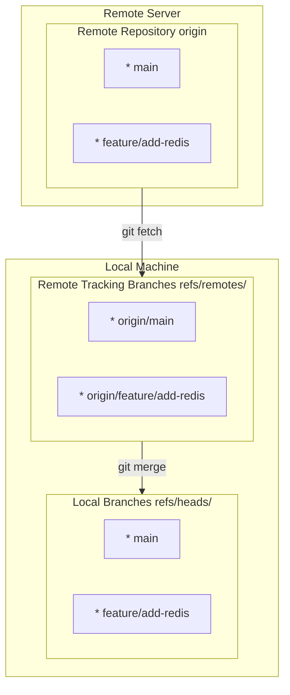
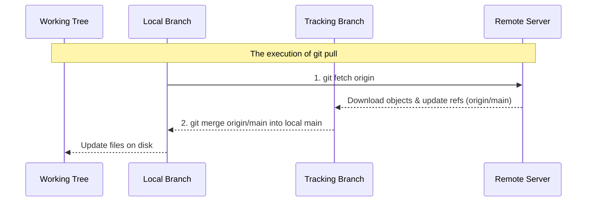
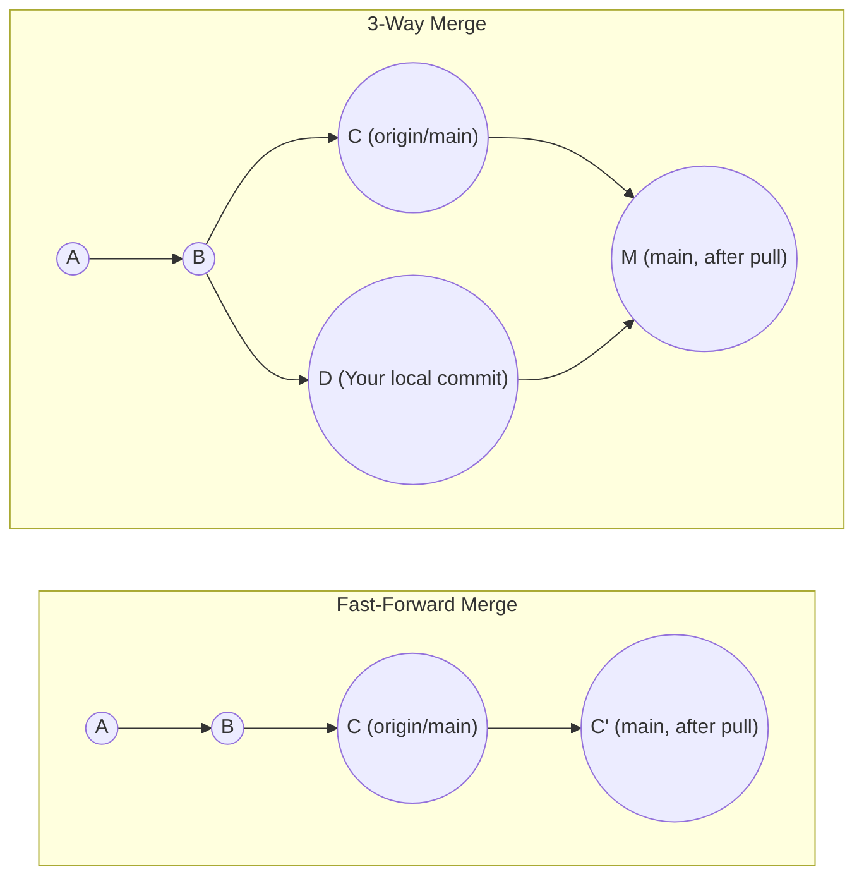
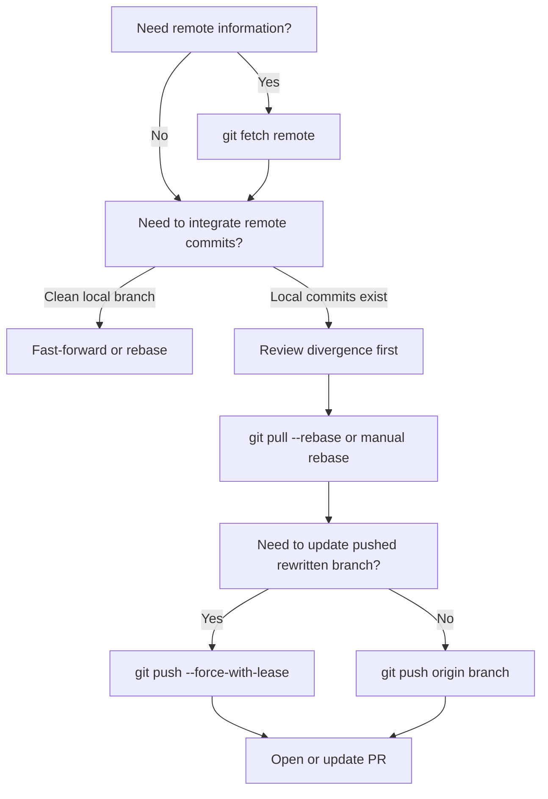

> **Complexity**: [MEDIUM]
>
> **Time to Complete**: 90 minutes
>
> **Prerequisites**: Module 6 of Git Deep Dive, comfort with branches, and basic Kubernetes manifest editing. This module uses Kubernetes 1.35+ examples and copy-paste commands that use the full `kubectl` binary name when Kubernetes validation is shown.

---

## Learning Outcomes

By the end of this module, you will be able to perform the following collaboration tasks in realistic engineering workflows:

1. **Diagnose** discrepancies between local branches, remote-tracking branches, and remote branches before integrating or rewriting shared work.
2. **Implement** a fork-and-pull workflow using separate `origin` and `upstream` remotes without confusing personal fork state with project authority.
3. **Evaluate** when `--force-with-lease` is appropriate after a rebase or amend, and choose a recovery path when the lease rejects your push.
4. **Design** atomic commits and pull requests that isolate Kubernetes manifest changes, review evidence, and rollback boundaries.
5. **Implement** conventional and signed commit practices that make review history useful to humans, release automation, and audit policies.

## Why This Module Matters

Hypothetical scenario: a platform team is preparing a routine Kubernetes 1.35+ configuration change for a backend service. One engineer updates a ConfigMap, another adjusts a Deployment, and a third opens a pull request after rebasing a stale branch. The final diff is not obviously broken, yet the branch contains unrelated manifest edits, a vague commit message, and a rewritten remote branch that nobody has fetched since review began. Nothing in that story requires an exotic Git failure; ordinary collaboration shortcuts are enough to make the reviewer guess where intent ends and accidental drift begins.

Production repositories depend on Git as more than a file transport mechanism. A good branch records who proposed a change, which remote supplied the base, how the author responded to review, and whether the final history can be understood under pressure. When the repository stores infrastructure as code, that history becomes part of the operational control plane. A reviewer deciding whether a Deployment change is safe needs a branch that separates prerequisite resources from workload behavior, not a pile of edits that happens to pass syntax checks.

This module teaches professional collaboration as a set of state-management habits. You will inspect remote-tracking branches as local cache, choose between fetch and pull based on risk, keep fork remotes distinct, rewrite review branches with leases, shape atomic pull requests, and use commit conventions that support automation. The commands are simple, but the judgment matters: every synchronization step either protects reviewer attention or spends it.

## 1. Remote State Is a Local Cache, Not a Live Window

Many engineers first learn Git on a single machine, so remote names feel like windows into a server. That mental model is dangerous because `origin/main` is not a live query to GitHub, GitLab, or any other hosting platform. It is a local reference stored in your `.git` directory, updated only when your repository communicates with the remote. If you compare your branch to a stale `origin/main`, Git will answer honestly using stale data, and the mistake is in the assumption rather than the command.

Think of a remote-tracking branch like a printed train schedule on your desk. The schedule was useful when printed, and it may still be accurate, but it cannot prove the train has not changed platforms since you last checked. `git fetch` prints a fresh schedule by downloading objects and updating remote-tracking references. Until you fetch, decisions about rebasing, deleting, or force-pushing are based on your last known view of the server rather than the server's current branch tip.



The diagram separates three owners. Local branches move when you commit, merge, rebase, reset, or check out a new position. Remote-tracking branches move when you fetch, pull, or push in ways that update your local knowledge of a remote. Remote branches move when someone successfully pushes to the server. Professional Git work starts by naming which layer is being discussed, because "my `main` is ahead of `origin/main`" is a different diagnosis from "the server is ahead of my local branch."

The mapping between a remote server and your remote-tracking namespace is configured in `.git/config`. Reading this configuration removes some mystery from Git because it shows that `origin` is a named endpoint plus a rule for copying branch positions into your local repository. The leading plus sign in the fetch refspec is about mirroring the remote-tracking reference; it does not grant permission to overwrite your local branch work.

```ini
[remote "origin"]
    url = git@github.com:kubedojo/core-platform.git
    fetch = +refs/heads/*:refs/remotes/origin/*
```

The source side, `refs/heads/*`, means "all branch heads on the remote server." The destination side, `refs/remotes/origin/*`, means "store those remote branch positions under my local remote-tracking namespace." This is why one machine can show `origin/main` at one commit while another shows it at a newer commit. They are not disagreeing about Git truth; they have fetched at different times.

You can inspect remote configuration without opening the config file, and you should do it whenever a repository has more than one collaboration path. A surprising number of review mistakes start with an engineer assuming `origin` points to the central repository when it actually points to a personal fork, a stale mirror, or a temporary migration remote. The command is harmless and gives you the map before you start moving state.

```bash
git remote -v
```

The healthy single-remote output shows matching fetch and push URLs. When fetch and push URLs differ intentionally, teams should document that convention because it changes how people reason about where branches appear after a push. In a normal repository, the output looks like this:

```text
origin  git@github.com:kubedojo/core-platform.git (fetch)
origin  git@github.com:kubedojo/core-platform.git (push)
```

Pause and predict: if you run `git commit` while checked out on local `main`, what branch reference moves, and what branch reference stays still? Your local `main` moves to the new commit, while `origin/main` remains unchanged until a fetch, pull, or push updates your local knowledge. That is why `git status` can report that your branch is ahead of its upstream without proving anything new happened on the server since your last fetch.

This distinction is the foundation for safe diagnosis. Before rebasing a feature branch, deleting a remote branch, or deciding that a teammate has not pushed work, run `git fetch --all --prune` and then inspect the updated references. Fetching does not merge incoming commits into your working tree; it updates evidence. Treat that step as reconnaissance in the same way you would check the current cluster context before applying a Kubernetes manifest.

## 2. Fetch, Pull, and the Shape of History

Synchronization has two separate concerns: updating what you know about the remote and integrating that information into your current work. `git fetch` handles the first concern and stops. It downloads missing objects and updates names such as `origin/main`, but it does not rewrite your working tree, stage files, or move your current local branch. That makes fetch the safest first command when you are unsure whether the remote moved.

`git pull` handles both concerns in one command. It fetches first, then integrates the fetched remote-tracking branch into your current branch by merge or rebase depending on configuration and flags. The command is not bad; the risk is that it hides two decisions inside one word. During routine work the shortcut may be fine, but during branch repair, incident response, or review cleanup, you usually want to inspect before you integrate.



The hidden integration step is where teams accidentally create noisy merge commits. If your local branch has commits that the remote branch does not have, and the remote branch has commits that your local branch does not have, a merge-based pull must connect the histories with a new merge commit. That merge commit can be technically valid while adding no useful design information to a review branch. Reviewers then need to separate real feature decisions from synchronization noise.



Modern review-oriented teams often prefer a linear feature history because it lets reviewers read the branch as a sequence of decisions. Rebasing local commits on top of the latest remote state preserves that shape by replaying your work after the commits that already exist upstream. The tradeoff is that rebasing changes commit hashes, so it is appropriate for your own unpublished or review-branch work but should be treated carefully on branches other people may push to.

```bash
# Fetch and rebase your local commits on top of the remote updates
git pull --rebase origin main
```

You can configure this behavior as your default, which reduces accidental merge commits when you pull updates into local feature branches. This is a personal or team preference rather than a universal law, so a repository contribution guide should say what reviewers expect. The key is consistency: a branch history that follows one clear policy is easier to audit than a branch that alternates between merge bubbles and rebased commits without explanation.

```bash
git config --global pull.rebase true
```

Before running a pull during real work, ask a sharper question: "Do I want only current information, or do I want to modify my current branch now?" If you only need information, fetch. If you are ready to integrate and know the expected history shape, pull with the appropriate integration mode. That pause prevents the common panic where an engineer thinks Git destroyed work when it actually performed the integration they requested without realizing the branch had diverged.

Consider a Kubernetes example. Suppose you are editing `deployment.yaml` for a backend rollout and a teammate has just changed `configmap.yaml` on `origin/main`. Running `git fetch origin` lets you inspect the teammate's commit before your local files move. You can compare branch tips, read the diff, and decide whether to rebase now or finish your local commit first. After the history is intentionally updated, validate the manifest with a server-side dry run such as `kubectl apply --dry-run=server -f deployment.yaml` rather than treating tidy history as proof that the cluster will accept the object.

Before running this, what output do you expect from `git status` after a fetch when your working tree has uncommitted edits? The files should remain exactly as they were, while the upstream comparison may change because the remote-tracking reference moved. If you expected files to change, you were thinking of pull, merge, checkout, or rebase rather than fetch. This difference is the reason fetch is the safest first command in uncertain collaboration state.

## 3. Fork-and-Pull Workflows Create a Deliberate Security Boundary

In enterprise environments and open-source projects, contributors often should not have direct write access to the central repository even when they are trusted. The fork-and-pull model creates a deliberate buffer between personal work and authoritative history. Your fork is the place where you can push review branches freely, experiment with rebases, and update pull requests. The upstream repository is the controlled integration point where branch protection, required reviews, signed commits, and CI checks decide what becomes official.

This model is often called the triangle workflow because your local repository talks to two server-side repositories. `origin` usually points to your writable fork, while `upstream` points to the canonical project. That naming is convention rather than law, but it is so common that following it reduces cognitive load for every reviewer and teammate who helps you debug a remote problem. Clear names make state visible before anyone opens the hosting UI.

```bash
# Add the central repository as a remote
git remote add upstream git@github.com:kubedojo/core-platform.git

# Verify the configuration
git remote -v
```

The expected output makes the fork boundary visible by showing your writable `origin` separately from the authoritative `upstream` project. In real hosted workflows, the upstream push URL may be unusable for contributors because permission rules or branch protection blocks direct writes. That is the point. The remote name still gives you a fetch path for authoritative history while the fork remains your safe write target.

```text
origin    git@github.com:yourname/core-platform.git (fetch)
origin    git@github.com:yourname/core-platform.git (push)
upstream  git@github.com:kubedojo/core-platform.git (fetch)
upstream  git@github.com:kubedojo/core-platform.git (push)
```

The operational loop is simple: fetch from the authority, branch locally, push your proposal to your fork, then open a pull request against upstream. This is not bureaucracy for its own sake. It ensures that the same review path handles employees, contractors, and external maintainers, and it prevents a single mistaken push from bypassing the controls that protect production repositories.

```bash
# 1. Fetch all updates from the central repository
git fetch upstream

# 2. Ensure you are on your local main branch
git checkout main

# 3. Update your local main to match upstream exactly
git rebase upstream/main

# 4. Push the synchronized state to your personal fork
git push origin main
```

Pause and predict: if you accidentally run `git push upstream main` from a repository where you lack direct write permissions, what output do you expect and why? The expected result is a permission rejection from the hosting platform, often an HTTP permission error or an SSH authorization failure. That rejection is not a nuisance. It is the security boundary doing its job by forcing changes through pull requests instead of direct mutation.

The fork workflow also gives you cleaner diagnostic language. If your branch is missing a teammate's merged work, ask whether you fetched from `upstream`, not whether "GitHub is behind." If your pull request does not update after a push, ask whether you pushed to `origin` and whether the PR source branch points to that fork. If local `main` differs from both `origin/main` and `upstream/main`, ask which one represents your personal mirror and which one represents the project authority.

There is one subtle tradeoff: two remotes create two kinds of staleness. Your local repository can be stale relative to upstream, and your fork can be stale relative to both upstream and your local work. The synchronization loop closes that gap by updating local `main` from upstream and then pushing the synchronized `main` back to origin. In professional review flows, that extra push is useful because future feature branches and web-based comparisons begin from a clean fork state.

Teams that skip fork synchronization often discover the cost later, when a contributor opens a pull request whose base comparison includes months of unrelated upstream history. The code may be correct, but review becomes noisy because the hosting platform is comparing from a stale fork branch. Keeping `origin/main` aligned with `upstream/main` protects reviewer attention, keeps conflict resolution close to the author, and makes the eventual pull request show only the intended branch delta.

## 4. Safe History Rewriting Depends on Leases

Rebasing, squashing, and amending are normal parts of preparing a clean pull request. They are not dishonest when used on a review branch; they are editing the proposed story before it becomes project history. The danger appears when a rewritten branch has already been pushed, because the old commit hashes still exist on the remote while your local branch now contains replacement commits. A normal push is rejected because the remote cannot fast-forward from the old history to your rewritten history.

The blunt tool is `--force`, which tells the remote to accept your local branch position regardless of what currently exists on the server. The concrete danger is data loss for collaborators. If another engineer or automation process pushed commits to the same branch after your last fetch, an unconditional force push can remove their commits from the branch tip even though you never saw them locally. Git will do exactly what the command requested.

Hypothetical scenario: two engineers are repairing a shared branch named `feature/helm-migration`. One engineer rebases locally to clean up review history and immediately runs a raw force push. Another engineer had pushed a test fix to that same remote branch earlier in the morning. The server accepts the forced update, the test fix disappears from the branch tip, and the team now has to recover work from reflogs or local clones instead of continuing review.

The safer tool is `--force-with-lease`, which turns the push into a conditional update. The lease says, in effect, "rewrite the remote branch only if it still points to the commit that my local remote-tracking branch says it points to." If the server has moved since your last fetch, the lease fails and the push is rejected. That rejection is a feature, because it tells you your mental model is stale before you overwrite someone else's work.

```bash
git push --force-with-lease origin feature/helm-migration
```

Stop and think: why does the lease check use your remote-tracking branch instead of trusting your memory of the branch? Git can compare object IDs precisely, while human memory collapses branch state into phrases like "I fetched recently." A lease converts "recently" into a specific expected commit. If the server does not match that expected commit, Git refuses to proceed until you fetch and inspect the new state.

When a lease is rejected, the correct response is not to fall back to `--force`. Fetch the remote, inspect the new commits, and decide how to incorporate them. A typical repair loop is `git fetch origin`, `git log origin/feature/helm-migration`, and then a deliberate rebase or merge that includes the teammate's work. Only after your local branch is based on the updated remote state should you try `--force-with-lease` again.

The lease mechanism is also a social signal. If a branch rejects your push, Git is telling you that your assumption of sole ownership is no longer guaranteed. That does not always mean a teammate intentionally collaborated on your branch; automation might have updated it, a maintainer might have pushed a fix, or another machine you use might have moved the same branch. In all cases, investigation is cheaper than reconstructing lost review work.

This habit matters during pull request review because review branches are often rewritten in response to feedback. You might amend a Kubernetes Deployment commit after a reviewer asks for a resource limit, squash a noisy typo fix into the original documentation change, or rebase on a newly merged security patch. Those are reasonable operations when you own the branch. They become risky only when the branch is shared and the push command ignores whether the server changed while you were editing.

## 5. Pull Requests Are Reviewable Stories, Not File Dumps

A pull request is a structured argument. It says, "Here is the problem, here is the smallest coherent change that solves it, here is how I tested it, and here is the evidence reviewers need to trust it." The quality of that argument is determined largely by the commits it contains. If each commit does one logical thing and leaves the repository in a working state, reviewers can evaluate design decisions instead of untangling the author's afternoon.

An atomic commit does exactly one logical thing and keeps the repository functional. In infrastructure code, that often means separating a ConfigMap data change from a Deployment wiring change, or separating a Service port change from an application code change. The point is operational reversibility, not aesthetic purity. During an incident, `git revert` is only surgical if the original commit was surgical.

Consider a change that updates a Kubernetes Deployment to consume a new ConfigMap. A monolithic approach modifies `deployment.yaml`, `configmap.yaml`, `service.yaml`, and a helper script, then commits everything as `fix: update environment setup`. If the rollout fails because the ConfigMap contains an invalid key, the team must either revert unrelated valid work or manually craft a forward fix while production is degraded. The commit has made the rollback decision harder than the configuration problem.

The better approach is to stage the work by intent. Use `git add -p` when one file contains multiple unrelated hunks, and use explicit file paths when files naturally map to separate logical changes. This is a review skill as much as a Git skill. You are shaping the evidence so reviewers can verify one claim at a time.

```bash
git add -p deployment.yaml
```

Git will present hunks of code and ask what you want to stage. That interaction turns one messy file edit into a set of intentional review decisions. It may feel slow at first, but it is faster than asking several reviewers to reverse-engineer which lines belong together. It also lets you build a branch where each commit can be checked out, tested, and reverted independently.

```text
diff --git a/deployment.yaml b/deployment.yaml
@@ -14,6 +14,9 @@
     spec:
       containers:
       - name: api
+        envFrom:
+        - configMapRef:
+            name: app-config
         image: internal.registry.com/finance/payment:v1.2.4

Stage this hunk [y,n,q,a,d,s,e,?]? 
```

Commit one adds only the new ConfigMap variables, so reviewers can evaluate configuration data without also reasoning about Deployment wiring. The example uses ordinary ConfigMap data, not credentials; values that behave like secrets belong in Kubernetes Secrets or an external secret manager. Keeping that distinction visible in review helps security feedback land before deployment.

```yaml
# configmap.yaml
apiVersion: v1
kind: ConfigMap
metadata:
  name: app-config
data:
  ENABLE_NEW_FEATURE: "true"
  CACHE_TIMEOUT_SECONDS: "300"
```

Commit two mounts the ConfigMap in the Deployment, which is a separate runtime integration decision with a different rollback profile. A reviewer can now ask whether the workload should tolerate a missing ConfigMap, whether the namespace is correct, or whether the rollout needs extra validation without mixing those questions into the data-change review. The API versions shown are stable for Kubernetes 1.35+ clusters.

```yaml
# deployment.yaml
apiVersion: apps/v1
kind: Deployment
metadata:
  name: backend-api
spec:
  selector:
    matchLabels:
      app: backend-api
  template:
    metadata:
      labels:
        app: backend-api
    spec:
      containers:
      - name: api
        envFrom:
        - configMapRef:
            name: app-config
        image: internal.registry.com/finance/payment:v1.2.4
```

Commit three can update the application logic or tests, keeping behavior separate from Kubernetes resource definition changes in the review history. After the branch contains the intended commits, validate the manifest shape with `kubectl apply --dry-run=server -f deployment.yaml` against an appropriate cluster context. Validation does not replace review, but it gives reviewers stronger evidence that the proposed history is not merely tidy; it is also deployable.

Before opening a pull request, read your branch with the reviewer in mind. Does the first commit establish a prerequisite? Does the second commit use it? Does the final commit update tests, documentation, or automation in a way that follows from the earlier changes? If the branch reads like a sequence of clean engineering decisions, reviewers can focus on architecture, security, resilience, and observability instead of asking the author to split the work after the fact.

This is where atomic commits become a mentoring tool rather than a private preference. A reviewer can leave a focused comment on the Deployment commit, approve the ConfigMap commit, and ask for a test adjustment in the script commit without mixing concerns. The author receives clearer feedback, and the team builds a shared vocabulary for change size. Over time, those habits reduce review latency because small, well-labeled commits make it easier to distinguish real risk from ordinary implementation detail.

## 6. Conventional and Signed Commits Turn History into Automation Evidence

Commit messages are part of the product interface for future maintainers. A vague message like `updates` forces every later reader to open the diff and infer intent. A conventional message gives automation and humans a compact summary of the kind of change being made, the area affected, and whether the change should influence release notes or version numbers. This is especially valuable in platform repositories where infrastructure, application code, policy, and documentation often live together.

Conventional Commits provide a lightweight grammar. The type communicates intent, the optional scope points to the affected subsystem, the description names the behavior change, and the body or footer explains context that does not fit on one line. The format is simple enough to write by hand but structured enough for changelog generators and release pipelines.

```text
<type>[optional scope]: <description>

[optional body]

[optional footer(s)]
```

Common types and their semantic-versioning implications give both humans and automation a shared vocabulary for release impact. `fix:` indicates a bug fix and often maps to a patch release. `feat:` indicates a new capability and often maps to a minor release. `docs:`, `chore:`, and `refactor:` commonly do not trigger product releases by themselves. A `BREAKING CHANGE:` footer or a `!` after the type communicates a major compatibility change.

This example shows how a concise subject, explanatory body, and issue reference combine into a commit message that supports review and later auditing. The subject tells the reviewer which subsystem changed. The body explains the operational intent. The footer connects the commit to a tracked work item, which helps future readers move from history to context without guessing.

```text
feat(ingress): add TLS termination for backend services

Configured the cert-manager annotations on the primary ingress route
to automate Let's Encrypt certificate provisioning.

Resolves: #812
```

Signed commits answer a different question: not "what kind of change is this?" but "can we verify who created this commit?" Git commit metadata includes a name and email address, but those values are easy to configure locally and are not proof of identity. Cryptographic signing ties the commit to a private key, allowing hosting platforms and CI policies to detect spoofed authorship or unsigned changes in protected branches.

Historically, many teams avoided signing because GPG key management felt heavy. As of Git 2.34, standard SSH keys can be used for commit signing, which fits the authentication material many engineers already maintain. The setup is still security-sensitive, but it is no longer an exotic workflow reserved for release managers. Teams should document where public keys are registered and what branch protection rules require, because a verified badge is only useful when everyone knows what policy it represents.

```bash
# Configure Git to use SSH for signing
git config --global gpg.format ssh

# Point Git to your public SSH key
git config --global user.signingkey ~/.ssh/id_ed25519.pub

# Tell Git to sign all commits automatically
git config --global commit.gpgsign true
```

Now every commit can carry verifiable authorship, and platforms such as GitHub and GitLab can display a trusted verification badge when the signature matches a registered public key. That badge is not a substitute for code review, tests, or threat modeling. It removes one class of impersonation from the reviewer's threat model and gives branch protection policies an identity signal they can enforce consistently.

## 7. Reviewing Pull Requests as a Production Control

Submitting a pull request is only half the collaboration loop; reviewing someone else's work is the other half. Effective review catches design mismatches, unclear rollback paths, missing operational evidence, and accidental scope expansion before they reach production. The best reviewers are not trying to prove they are clever. They are trying to decide whether the change is understandable, safe, observable, and maintainable.

Low-value review comments usually belong to automation. Formatting, spacing, generated files, import sorting, missing semicolons, and simple style consistency should be handled by linters, formatters, and CI checks. Human attention is expensive, so use it on architecture, security, resilience, observability, migration safety, and whether the pull request tells a coherent story. If a Kubernetes Deployment gains a new container without resource limits, if a Secret-like value appears in a ConfigMap, or if rollback would remove unrelated work, those are human review findings.

Tone matters because review is a technical control performed by humans who must keep working together. Instead of saying, "This is wrong, use a Secret instead of a ConfigMap," say, "Since this value behaves like a credential, we should move it to a Kubernetes Secret so it is not exposed through ConfigMap reads or plaintext logs. Can you split that into its own commit?" The second version is still rigorous, but it explains the risk and gives the author a concrete path to repair.

| Anti-Pattern | Description | How to Fix It |
|--------------|-------------|---------------|
| **The Rubber Stamp** | Approving a PR purely based on trust or because "it's just a config change." | Pull the branch locally when risk warrants it, read the diff, and check the relevant evidence. |
| **The Syntax Sniper** | Focusing entirely on tabs vs spaces, variable names, or other linting errors. | Configure automated linting so humans can focus on design, risk, and maintainability. |
| **The Ghost Reviewer** | Leaving comments on a PR but never returning after the author makes the requested changes. | Set a re-review expectation, such as the next working day after an update. |
| **The Monolith Approver** | Reviewing a 3,000-line PR and giving up halfway through, then approving it to clear the queue. | Ask the author to split the work into smaller, atomic PRs with clear rollback boundaries. |

Reviewers should also know when to test locally. A documentation-only change might be safe to read in the web diff, but a Kubernetes manifest update deserves schema validation and often a dry run against an appropriate cluster context. The goal is not to create ceremony around every pull request. The goal is to match verification effort to blast radius and to make sure the branch structure gives reviewers enough evidence to do that work efficiently.

Which approach would you choose here and why: a reviewer asks for a one-line label fix in the last commit of your PR, while another teammate says they are testing your branch locally? If the teammate is only reading and you own the branch, amend and push with a lease. If the teammate might push to the same branch, coordinate first or ask them to open a separate branch, because Git cannot infer team intent from a branch name.

## Patterns & Anti-Patterns

Professional Git collaboration becomes repeatable when teams standardize patterns around branch ownership, synchronization, review size, and history rewriting. These patterns are not rigid law; they are defaults that reduce ambiguity under pressure. When a team intentionally deviates from them, the deviation should be documented in the pull request or repository contribution guide so the next engineer understands the rule being applied.

| Pattern | When to Use It | Why It Works | Scaling Consideration |
|---------|----------------|--------------|-----------------------|
| Fetch-before-decide | Before rebasing, force pushing, deleting branches, or diagnosing divergence. | It refreshes remote-tracking branches so decisions use current server state. | Make it part of review-branch repair playbooks and incident checklists. |
| Fork-and-pull triangle | When contributors should not push directly to the authoritative repository. | It separates personal write access from protected integration history. | Keep `origin` and `upstream` names consistent across onboarding docs. |
| Atomic PR commits | When a change touches multiple manifests, services, scripts, or docs. | It lets reviewers validate and revert one logical decision at a time. | Enforce smaller PRs socially before adding heavy policy gates. |
| Lease-based rewriting | When amending, squashing, or rebasing a branch that has been pushed. | It prevents stale local state from overwriting newer remote commits. | Teach `--force-with-lease` as the default rewrite push, not as an advanced option. |

Anti-patterns usually appear when speed is mistaken for simplicity. A monolithic pull request may feel fast for the author because it postpones organization, but it transfers complexity to reviewers and incident responders. A direct push to protected history may feel efficient until it bypasses the evidence trail that explains why the change was accepted. A raw force push may feel like the quickest way through a rejection, but it removes Git's chance to warn you that the server changed.

| Anti-Pattern | What Goes Wrong | Better Alternative |
|--------------|-----------------|--------------------|
| Treating `origin/main` as live truth | You rebase or compare against stale tracking data. | Run `git fetch` before synchronization decisions and inspect the updated refs. |
| Using `git pull` as a reflex | You merge or rebase before understanding incoming changes. | Fetch first when risk is high, then choose merge or rebase deliberately. |
| Sharing one mutable feature branch broadly | Multiple people rewrite or push to the same branch and create ownership confusion. | Use separate contributor branches, or agree explicitly when a shared branch is required. |
| Squashing unrelated work before review | Reviewers cannot isolate risk, and rollback becomes imprecise. | Use `git add -p` and explicit paths to create atomic commits before opening the PR. |

The pattern that matters most is explicit ownership. If a branch is yours, you can amend and rebase it during review as long as you push with a lease. If a branch is shared, rewriting it requires coordination because leases protect object IDs, not team agreements. If a branch represents protected project history, do not rewrite it casually; use pull requests, review evidence, and branch protection so everyone can reconstruct why the final state was accepted.

## Decision Framework

The most useful Git decision is often not "which command can do this?" but "what state am I protecting?" If you are protecting uncommitted working-tree changes, avoid commands that modify files until you have committed, stashed, or inspected. If you are protecting teammate commits, avoid unconditional force pushes. If you are protecting production history, avoid direct pushes and require review, signatures, and CI.



| Situation | Prefer | Avoid | Reason |
|-----------|--------|-------|--------|
| You want to see whether teammates pushed new work | `git fetch origin` | `git pull` as a reflex | Fetch updates knowledge without touching your branch or working tree. |
| Your feature branch has local commits and upstream moved | `git pull --rebase` or explicit `git rebase upstream/main` | Merge commits that add no design meaning | A linear review branch is easier to read and bisect. |
| You amended a pushed review commit | `git push --force-with-lease origin branch` | `git push --force` | The lease protects teammate commits that appeared after your last fetch. |
| You need a reviewer to understand Kubernetes manifest risk | Atomic commits plus validation notes | One huge commit with unrelated YAML and code | Reviewers can test and revert one operational decision at a time. |
| You are contributing through a fork | Push to `origin`, open PR to `upstream` | Direct push to upstream main | The fork boundary preserves protected integration history. |

Use the framework from left to right. First decide whether you need information, integration, publication, or review. Then choose the command that changes only the layer you intend to change. This is the same operational discipline you use in Kubernetes: inspect current state, plan the smallest safe change, apply it through the expected control path, and leave enough evidence for the next engineer to understand what happened.

## Did You Know?

1. The Linux kernel project still relies heavily on patch email workflows built around Git tooling, which is why commands such as `git format-patch` remain important outside web-based pull request systems.
2. Git does not track empty directories as first-class objects; a directory appears in a checkout only when at least one tracked file exists inside it.
3. The Conventional Commits specification was influenced by the Angular project's commit guidelines, which were formalized in 2014 to support readable changelogs and automated release reasoning.
4. SSH keys can be used to sign Git commits natively as of Git 2.34, removing the need for separate GPG keys in teams that already standardize on SSH authentication.

## Common Mistakes

| Mistake | Why It Happens | How to Fix It |
|---------|----------------|---------------|
| Running `git pull` on a diverged branch | Git may merge the remote-tracking branch into the local branch, creating an unnecessary merge commit in review history. | Configure the expected pull mode, fetch first when state matters, and rebase only when the branch is safe to rewrite. |
| Pushing with `git push --force` | A rebased local branch rejects a normal push, so the author bypasses the warning without checking whether the server moved. | Use `git push --force-with-lease`, and treat a lease rejection as a prompt to fetch and inspect. |
| Committing secrets to a branch | Credentials or environment files were staged before `.gitignore` or secret scanning caught them. | Remove the file from the index, rotate exposed credentials, and follow an agreed history-rewrite recovery plan. |
| Vague commit messages | The author treats commit messages as chores instead of durable communication for reviewers and automation. | Use Conventional Commits and explain why the change exists when the subject alone is not enough. |
| Pushing directly to upstream `main` | Write access exists, so the contributor bypasses the same PR path everyone else uses. | Protect the default branch and require pull requests, checks, and review before integration. |
| Squashing unrelated changes before review | The author groups an afternoon of work into one save point, which hides rollback boundaries. | Use explicit staging or `git add -p` to create commits with one operational purpose each. |
| Panicking when a lease is rejected | The safe command blocks a stale rewrite, and the author interprets the rejection as an obstacle. | Stop, fetch, inspect the new remote commits, incorporate them deliberately, and retry the lease only when state is clear. |
| Reviewing only the web diff for high-risk manifests | Browser diffs make it easy to skim YAML without validating API acceptance or rollout assumptions. | Pull the branch when risk warrants it, run relevant tests, and validate Kubernetes manifests with `kubectl apply --dry-run=server` where appropriate. |

## Quiz

<details>
<summary>Question 1: You are starting a feature and know `upstream/main` changed overnight. What sequence gives you a clean starting point, and what are you diagnosing before creating your branch?</summary>

Answer: Fetch from `upstream` first so your remote-tracking branch reflects the current authoritative repository. Then check out local `main` and rebase it onto `upstream/main`, or use the team-approved pull-rebase shortcut if the branch has no unexpected local work. You are diagnosing whether local `main` was stale, ahead, or diverged before the feature begins. Starting from a current upstream base keeps the pull request focused on your change rather than yesterday's synchronization drift.
</details>

<details>
<summary>Question 2: You rebased your review branch to clean up commits, but `git push origin my-feature` is rejected. How do you evaluate whether `--force-with-lease` is safe, and what should you do if the lease fails?</summary>

Answer: A normal push rejects after a rebase because the rewritten commits no longer fast-forward from the remote branch. `--force-with-lease` is appropriate when you own the branch and your local remote-tracking reference still matches the server's current tip. If the lease fails, do not use raw force; fetch the remote, inspect the new commits, and integrate them deliberately. The lease failure is evidence that someone or something moved the branch after your last known state.
</details>

<details>
<summary>Question 3: Your working tree contains a new Redis Deployment, a Service port change, and a README typo. How should you design the commits so the pull request remains reviewable?</summary>

Answer: Create separate commits for each logical purpose: one for the Redis Deployment, one for the Service port change, and one for the README typo. Use explicit file staging or `git add -p` if unrelated changes are mixed within a file. This design lets reviewers evaluate operational risk independently and lets incident responders revert only the failing component if needed. A single commit would hide unrelated risk behind one approval decision.
</details>

<details>
<summary>Question 4: You have uncommitted local edits and your teammate just pushed a breaking change to `origin/main`. You run `git fetch origin`. What changes locally, and why is this the right first diagnostic step?</summary>

Answer: Your working directory and local branch do not change; Git downloads objects and updates remote-tracking references such as `origin/main`. Fetch is the right first step because it replaces stale evidence with current remote state without touching your uncommitted files. You can inspect the incoming diff, commit or stash your own edits, and then choose a merge or rebase deliberately. This preserves your local work while preventing decisions based on old remote data.
</details>

<details>
<summary>Question 5: You cloned your personal fork of an open-source Kubernetes controller, and a maintainer merged a major feature into the central repository. Which remote do you fetch from, which remote do you push to, and why does that separation matter?</summary>

Answer: Fetch from `upstream`, because it represents the central authoritative repository, and push your branch or synchronized fork state to `origin`, because that is your writable fork. This separation preserves the security boundary that prevents contributors from mutating protected history directly. It also clarifies troubleshooting: missing maintainer work means you need upstream synchronization, while a pull request that does not update usually means you pushed to the wrong fork or branch. The fork-and-pull model turns access control into a visible workflow.
</details>

<details>
<summary>Question 6: A reviewer asks you to change a label in a Kubernetes Deployment manifest that belongs in your previous commit. How do you update the pull request without creating a noisy "fix label" commit, and what safety command protects collaborators?</summary>

Answer: Stage the label change, amend the previous commit with `git commit --amend --no-edit`, and update the remote review branch with `git push --force-with-lease origin branch-name`. Amending keeps the commit history aligned with the final intended change rather than preserving every review iteration as noise. The lease matters because the branch has already been pushed and might have changed on the server. If another contributor pushed to the same branch, the lease fails before their work is overwritten.
</details>

<details>
<summary>Question 7: Your CI pipeline uses commit prefixes to decide release behavior, and a teammate pushes `chore(deps): bump helm to 3.16`. Should that commit trigger a production feature release, and what would change the answer?</summary>

Answer: It should not trigger a feature release by itself because `chore` indicates maintenance rather than a user-visible feature or bug fix. Conventional Commits let automation distinguish dependency housekeeping from release-worthy behavior changes. The answer would change if the commit used `feat`, `fix`, or an explicit breaking-change marker because those types communicate different release implications. The pipeline should follow the structured intent while reviewers still verify whether the chosen type is honest.
</details>

<details>
<summary>Question 8: A suspicious commit appears with your name and email on a deployment script, but the hosting platform does not mark it verified. How do signed commits help reviewers evaluate the risk?</summary>

Answer: Git names and emails are local configuration values and can be spoofed, but a valid cryptographic signature requires access to the private key associated with your registered public key. If the commit is unsigned or signed by an untrusted key, reviewers should not treat the author metadata as proof of identity. Signed commits add an identity verification signal to the review process. They do not prove the code is correct, but they help detect impersonation and support stronger branch protection policies.
</details>

## Hands-On Exercise

In this exercise, you will simulate a professional fork-and-pull workflow by creating atomic commits and navigating a pull request review loop. The lab uses local bare repositories instead of GitHub so you can practice the remote mechanics without network access, permissions, or cleanup risk. Treat `upstream.git` as the protected central project, `origin.git` as your personal fork, and `k8s-pr-lab` as the working repository on your laptop.

Setup instructions: run the commands from a scratch directory, not from an existing production repository. The goal is to see branch movement clearly, so avoid adding extra files beyond the manifests requested in the tasks. The bare repositories behave like remote servers because they contain Git object data and references but no editable working tree.

### Task 1: Setup the Simulated Remotes

Execute the following commands to create a workspace, the server repositories, and your local repository. This gives you two remote endpoints without depending on hosted permissions or network access. You will still use the same Git commands that a fork workflow uses on a real platform.

```bash
# Create a workspace directory
mkdir git-collab-workspace
cd git-collab-workspace

# Create the upstream central repository
mkdir upstream.git
cd upstream.git
git init --bare
cd ..

# Create your personal fork repository
mkdir origin.git
cd origin.git
git init --bare
cd ..
```

Now create and link your working repository to these remotes. Notice that your local repository can push to both remotes in the lab, even though a real upstream repository would usually be protected by permissions and branch rules. The important lesson is the shape of the workflow, not the specific hosting platform.

```bash
# Initialize working repository
mkdir k8s-pr-lab
cd k8s-pr-lab
git init -b main
git remote add origin ../origin.git
git remote add upstream ../upstream.git

# Verify remotes as a checkpoint
git remote -v

# Create an initial commit so branches exist
echo "# Core Platform" > README.md
git add README.md
git commit -m "chore: initial project setup"
git push origin main
git push upstream main
```

### Task 2: Create a Feature Branch

You are defining infrastructure, so create a new feature branch for adding an NGINX deployment rather than committing directly on `main`. That branch boundary is the local version of a future pull request. If you usually use shell shortcuts interactively, keep them out of copied lab commands so scripts and transcripts stay runnable for everyone.

```bash
git checkout -b feat/nginx-deployment
```

### Task 3: Make Atomic Commits

Create the Kubernetes manifests using two distinct, atomic commits with conventional commit messages. The namespace establishes the destination for later resources, and the Deployment consumes that namespace in a separate commit. Keeping those changes separate lets a reviewer verify the dependency order and revert one layer without rewriting the other.

Create the namespace manifest first. Keeping the namespace in its own file lets reviewers verify the target scope before they inspect workload settings that depend on it:

```yaml
# namespace.yaml
apiVersion: v1
kind: Namespace
metadata:
  name: web-tier
```

Commit only the namespace prerequisite. This makes the first commit a small, reversible change with one clear purpose:

```bash
git add namespace.yaml
git commit -m "feat(k8s): add web-tier namespace"
```

Create the deployment manifest as a separate review unit. Its diff should show the workload, replica count, labels, and image without mixing in namespace setup:

```yaml
# deployment.yaml
apiVersion: apps/v1
kind: Deployment
metadata:
  name: nginx
  namespace: web-tier
spec:
  replicas: 2
  selector:
    matchLabels:
      app: nginx
  template:
    metadata:
      labels:
        app: nginx
    spec:
      containers:
      - name: nginx
        image: nginx:1.27-alpine
```

Commit only the workload. The second commit now tells reviewers exactly when application runtime configuration entered the branch:

```bash
git add deployment.yaml
git commit -m "feat(k8s): add nginx deployment"
```

### Task 4: Push to Your Fork

Push your feature branch to your personal `origin` repository. In a hosted workflow, this branch would become the source branch for a pull request into the upstream project. The branch name and commit messages should make the review intent obvious before anyone opens a diff.

```bash
git push origin feat/nginx-deployment
```

### Task 5: Respond to Review Feedback

Imagine a reviewer requested that you increase the `replicas` value to `3`. Instead of making a new "fix replicas" commit, you will amend your previous work to keep the history clean. This is appropriate because the branch is still under review and the change belongs to the existing Deployment commit rather than a new design decision.

Modify `deployment.yaml` and change `replicas: 2` to `replicas: 3`, treating the edit as a refinement of the Deployment commit rather than a new feature.

```bash
sed -i.bak 's/replicas: 2/replicas: 3/' deployment.yaml
rm deployment.yaml.bak

# Stage the change
git add deployment.yaml

# Fold it into the previous commit
git commit --amend --no-edit

# Safely force push the rewritten commit to your fork
git push --force-with-lease origin feat/nginx-deployment
```

### Task 6: Review and Merge via Squash

In the real world, you would open a PR on GitHub. Here, you will simulate the repository maintainer reviewing and merging your code using a squash merge. A squash merge takes all commits from your feature branch, squashes them into a single new commit, and places it on the `main` branch, which keeps the main branch history concise while preserving review discussion in the pull request record.

Checkout `main` and prepare a squash merge. The index will contain the combined branch result, but Git will not create the final integration commit yet:

```bash
git checkout main
git merge --squash feat/nginx-deployment
```

Check the prepared squashed result before committing. This is the maintainer's last local chance to confirm that only the reviewed namespace and Deployment files are staged:

```bash
git status
```

Commit the squashed changes with a new conventional commit message that summarizes the entire PR rather than repeating the lower-level branch commits:

```bash
git commit -m "feat(web): introduce nginx deployment and namespace

This adds the core web-tier namespace and the nginx deployment 
configured for 3 replicas based on review feedback.

Resolves PR #1"
```

### Task 7: Cleanup

Push the newly squashed commit to upstream, simulating the maintainer hitting "Merge PR." Then delete your local feature branch to keep your workspace clear and complete the triangle synchronization loop so your fork's `main` follows the central project again.

```bash
git push upstream main
```

Now delete your local feature branch to keep your workspace clean after the integration branch contains the accepted change:

```bash
git branch -d feat/nginx-deployment
```

Fetch from upstream and sync your fork's `main`. The final rebase makes your fork reflect the accepted upstream history instead of leaving a stale local integration state:

```bash
git fetch upstream
git rebase upstream/main
git push origin main
```

### Success Criteria Checklist

- [ ] You have two remote repositories configured (`origin` and `upstream`).
- [ ] Your feature branch contains exactly two new commits, one for namespace and one for deployment.
- [ ] The deployment commit message strictly follows the conventional commit format.
- [ ] You successfully utilized `--force-with-lease` to update a remote branch after an amend operation.
- [ ] You successfully squashed the feature branch into the `main` branch, resulting in a single clean commit.

### Solutions

<details>
<summary>View the commands to verify your repository state</summary>

Run `git remote -v` to check remotes:

```text
origin    ../origin.git (fetch)
origin    ../origin.git (push)
upstream  ../upstream.git (fetch)
upstream  ../upstream.git (push)
```

Run `git log --oneline` to verify the atomic commits before squashing:

```text
a1b2c3d (HEAD -> feat/nginx-deployment, origin/feat/nginx-deployment) feat(k8s): add nginx deployment
e4f5g6h feat(k8s): add web-tier namespace
i7j8k9l (upstream/main, origin/main, main) chore: initial project setup
```

Run `git log --oneline main` to verify the squashed state:

```text
m0n1o2p (HEAD -> main, upstream/main, origin/main) feat(web): introduce nginx deployment and namespace
i7j8k9l chore: initial project setup
```

Your commit hashes will differ, but the branch relationships and commit purposes should match the output above.
</details>

## Sources

- [Git documentation: git-fetch](https://git-scm.com/docs/git-fetch)
- [Git documentation: git-pull](https://git-scm.com/docs/git-pull)
- [Git documentation: git-push](https://git-scm.com/docs/git-push)
- [Git documentation: git-config](https://git-scm.com/docs/git-config)
- [Git documentation: git-add](https://git-scm.com/docs/git-add)
- [Git documentation: git-commit](https://git-scm.com/docs/git-commit)
- [Pro Git: Remote Branches](https://git-scm.com/book/en/v2/Git-Branching-Remote-Branches)
- [GitHub Docs: Collaborating with pull requests](https://docs.github.com/en/pull-requests/collaborating-with-pull-requests)
- [GitHub Docs: Telling Git about your signing key](https://docs.github.com/en/authentication/managing-commit-signature-verification/telling-git-about-your-signing-key)
- [Conventional Commits specification](https://www.conventionalcommits.org/en/v1.0.0/)
- [GitHub Docs: About pull requests](https://docs.github.com/en/pull-requests/collaborating-with-pull-requests/about-pull-requests)
- [GitHub Docs: Managing branches in your repository](https://docs.github.com/en/repositories/configuring-branches-and-merges-in-your-repository/managing-branches-in-your-repository)

## Next Module

Ready to apply these collaboration habits to large repositories with expensive test suites and many moving parts? Move on to [Module 8: Efficiency at Scale](../module-8-scale/) and learn how to keep Git fast and reviewable when the repository itself becomes part of the challenge.
