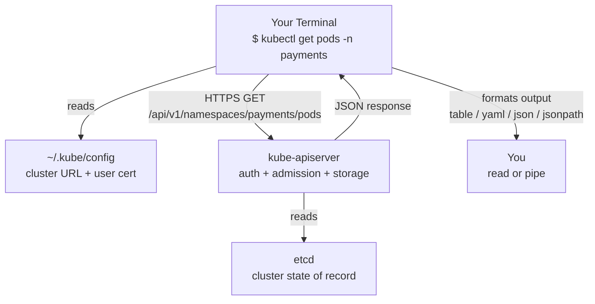
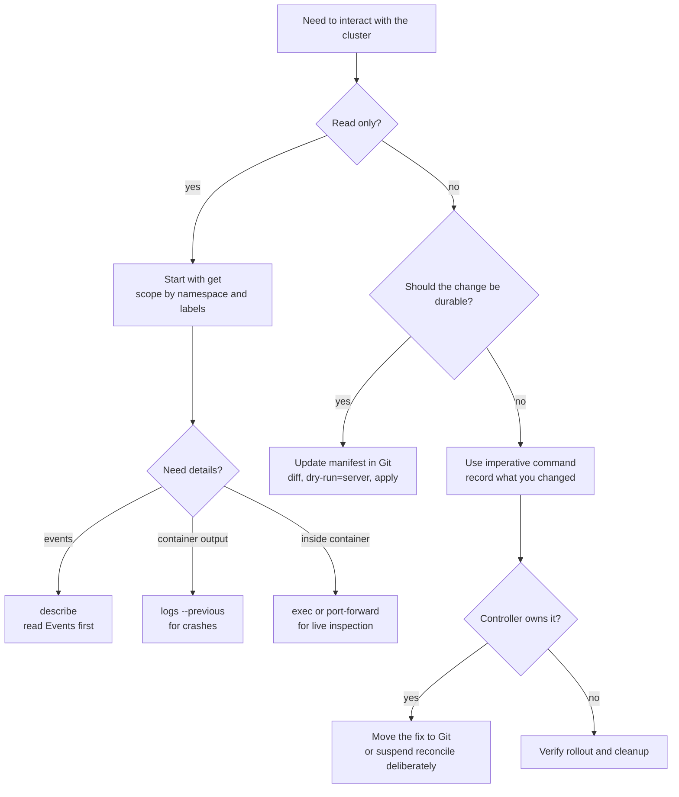

> **Complexity**: `[MEDIUM]` - Essential commands to master.
>
> **Time to Complete**: 60-75 minutes.
>
> **Prerequisites**: Module 1.1 (a working kind or minikube cluster), basic familiarity with the Linux shell, and a `kubectl` binary on your `$PATH` matching your Kubernetes 1.35+ cluster within one minor version.

---

## What You'll Be Able to Do

After completing this module, you will be able to debug, compare, design, evaluate, and implement practical `kubectl` workflows against a Kubernetes 1.35+ cluster:

- **Debug** a non-running pod end-to-end by chaining `kubectl get`, `kubectl describe`, `kubectl logs --previous`, and rollout commands to isolate whether the failure is scheduling, image pull, readiness, or runtime behavior.
- **Compare** imperative commands, declarative manifests, and Server-Side Apply, then justify which workflow fits a local experiment, a shared staging change, or a production GitOps environment.
- **Design** a safe namespace and context workflow that prevents wrong-cluster changes by using explicit namespaces, current-context checks, server dry-runs, and repeatable cleanup.
- **Evaluate** `kubectl get` output formats such as `wide`, `yaml`, `json`, `jsonpath`, and `custom-columns` so scripts extract stable fields instead of grepping human tables.
- **Implement** a full beginner operations loop: create a namespace, deploy workloads, inspect resource ownership, break and repair an image rollout, tunnel traffic with `port-forward`, and remove the lab cleanly.

## Why This Module Matters

Hypothetical scenario: it is early in an incident, a service owner says the staging checkout API is not responding, and the only shared fact in the chat is that "Kubernetes looks broken." You have a terminal, a kubeconfig, and several possible failure layers between your laptop and the application: the API server might be unreachable, the namespace might be wrong, the Deployment might have created no pods, the pods might be unscheduled, the image might not pull, or the application might be crashing after it starts. A fluent `kubectl` user does not guess. They turn the cluster into evidence, one read-only command at a time, until the failure has a name.

That discipline matters because `kubectl` is the everyday control surface for Kubernetes. Dashboards, GitOps controllers, Helm, Kustomize, and platform portals all matter, but the human operator still reaches for `kubectl` when they need to verify what the API server actually stores and what the controllers are doing with it. The same command family can read harmless inventory, start a port-forward, update an image, or delete a namespace. That power is useful only when paired with habits that keep cluster, namespace, verb, and output format explicit.

This module teaches the command surface as an operating workflow rather than as a memorization list. You will start with the mental model of `kubectl` as a typed HTTPS client, then practice the read-only verbs that separate broad inventory from detailed diagnosis. From there you will compare imperative and declarative changes, learn how dry-runs and Server-Side Apply reduce risk, and finish with a hands-on lab that deliberately breaks a rollout so you can repair it using the same evidence-first sequence you would use during real support work.

## The Mental Model: kubectl Is a Typed API Client

The most useful sentence in this module is simple: every `kubectl` command becomes a request to the Kubernetes API server. The binary on your laptop reads kubeconfig, chooses a context, loads credentials, builds a REST request, sends it over TLS, and formats the response. It does not schedule pods, pull images, create containers, or edit etcd directly. Those jobs belong to the API server, controllers, scheduler, kubelet, and storage layer, which is why a failed command is often telling you about one of those components rather than about the CLI itself.

The flow below is worth studying because it explains many beginner surprises. If `kubectl get pods` says the server is unreachable, your first suspect is connectivity or kubeconfig, not the pods. If `kubectl apply` is rejected even though the YAML looks correct, an admission controller or schema rule on the API server may be responsible. If `kubectl logs` returns nothing for a container that keeps restarting, the current container instance may not be the one that crashed. The command output is evidence from a distributed system, not just text on a terminal.



The verbs map to API behavior in a regular way. `kubectl get` is a read request, `kubectl create` sends a new object, `kubectl apply` patches desired state, and `kubectl delete` asks the API server to remove an object according to Kubernetes deletion rules. The exact endpoint depends on the resource type and namespace, but the principle stays stable. Once you see the CLI as an API client, the difference between a read-only inspection and a persistent cluster change becomes much clearer.

The same model also explains why `kubectl` output sometimes lags behind your intention. When you create a Deployment, the API server stores the Deployment object quickly, but that does not mean pods are already running. The Deployment controller must observe the new object, create a ReplicaSet, the ReplicaSet controller must create Pods, the scheduler must assign those Pods to nodes, and kubelets must pull images and start containers. A successful `kubectl apply` confirms the desired state was accepted, not that every downstream controller has finished its work.

That separation is one reason Kubernetes commands often come in pairs: one command changes desired state, and another command verifies observed state. `kubectl set image` may update a Deployment immediately, but `kubectl rollout status` tells you whether the controller managed to replace old pods with ready new pods. `kubectl delete namespace` may mark the namespace for deletion immediately, but `kubectl get namespace` later tells you whether finalizers and cleanup completed. Treat command success as the beginning of verification, not the end of operational thinking.

There is a practical security lesson here too. Because `kubectl` talks to the API server with your identity, every command is subject to authentication, authorization, and admission. A cluster may let you read pods while blocking deletes, or let you create ConfigMaps while rejecting privileged pods through policy. When a command is denied, do not work around it with a more powerful credential by reflex. First decide whether the policy is protecting the cluster from exactly the kind of change you are trying to make.

> **Pause and predict:** if `kubectl` is only an API client, what happens when your kubeconfig points at a healthy cluster but your credential has expired?
> **Answer:** the cluster can keep reconciling and pods can keep running, but your command fails before reading objects because auth is denied.

That distinction is operationally important because it prevents you from treating every `kubectl` error as an application outage.

## Command Anatomy and Read-Only Inspection

Most `kubectl` commands have the same shape: binary, verb, resource type, optional resource name, and flags. The verb tells Kubernetes what kind of API action you want, the type selects the resource collection, the name narrows the target to one object, and the flags refine namespace, output, filtering, sorting, or safety behavior. Beginners often experience the command surface as a wall of special cases, but the structure is steady enough that you can infer many commands before you memorize them.

```text
kubectl    get        pods       nginx          -n web -o yaml
   |        |          |           |               |
 binary    verb       type        name          flags
 (HTTP    (HTTP      (REST     (resource    (namespace,
  client)  method:   path       identifier)   output, etc.)
            GET)     segment)
```

The read-only verbs should become your default entry point because they reduce uncertainty without changing the cluster. `kubectl get` answers "what exists and what is its headline state?" while `kubectl describe` answers "what does one object report about its status, conditions, owners, and recent events?" `kubectl explain` answers a different question: "what fields does this resource type support on this cluster?" You will use all three in the lab, and the order matters because broad inventory prevents you from wasting time on the wrong object.

```bash
# What exists in this namespace?
# Show all pods in the current namespace.
kubectl get pods
# Show pods in all namespaces.
kubectl get pods -A
# Focus on a specific namespace.
kubectl get pods -n kube-system
# Add networking and node metadata.
kubectl get pods -o wide
# Inspect one full object as YAML.
kubectl get pod nginx -o yaml

# What's the state of this specific thing?
# Inspect pod status, owners, conditions, and Events.
kubectl describe pod nginx
# Inspect node-level status from the API object.
kubectl describe node kind-control-plane

# What fields does this resource even have?
# See the fields available on Pod containers.
kubectl explain pod.spec.containers
# Expand nested resource definitions recursively.
kubectl explain pod.spec.containers.resources --recursive
```

The Events section at the bottom of `kubectl describe` is one of the highest-value debugging surfaces in Kubernetes. A pod that is `Pending` may be unschedulable because of node selectors, resource pressure, taints, or volume problems, and the Events list is where the scheduler and kubelet report those facts. A pod in `ImagePullBackOff` usually has a registry, credential, or tag problem, and the Events list often includes the exact image reference and error class. Reading Events before restarting anything is the difference between diagnosis and button pressing.

The broad-to-narrow habit also protects you from generated names. Deployments create ReplicaSets, ReplicaSets create Pods, and those child objects receive names with hashes and suffixes that are not meaningful to memorize. A label selector such as `-l app=web` lets you inspect the related objects without copying a generated pod name from one command into another too early. Once the failing object is obvious, then you can describe or log that specific pod with confidence.

Resource short names are helpful, but they are not a substitute for understanding resource kinds. `kubectl api-resources` shows the full kind, plural name, short names, API group, namespaced scope, and supported verbs for every resource the cluster exposes. Running it on a cluster with controllers installed can reveal Custom Resource Definitions for certificates, rollouts, backups, policies, or cloud resources. That discovery step matters because `kubectl get pods` tells you only about core workloads, while a real platform may be shaped by many custom controllers.

The namespace default is another reason read commands can mislead beginners. `kubectl get pods` without `-n` reads only the namespace configured on the current context, or `default` if none is configured. In a local lab that may be fine, but in a shared cluster it can make a healthy application look missing. When the question is "what is running anywhere?" start with `-A`; when the question is "what is wrong with this one team space?" name the namespace explicitly.

`kubectl explain` is easy to ignore until you need it, then it becomes a permanent habit. It reads schema information from the API server, so the answer matches the Kubernetes version and Custom Resource Definitions installed on the cluster in front of you. That means you can ask for `kubectl explain deployment.spec.strategy --recursive` while authoring a manifest and get a field map without leaving the terminal. The tool is not a tutorial, but it is an accurate dictionary for the object model you are editing.

> **Stop and predict:** before you run `kubectl get all -n kube-system`, what objects do you expect to see?
> **Answer:** `all` returns a curated set of common workload resources, not every Secret, ConfigMap, Role, ServiceAccount, or CRD.

It does not include every Secret, ConfigMap, Role, ServiceAccount, CRD instance, or policy object, so it is not an audit command. When completeness matters, ask for the specific resource types you need or use `kubectl api-resources` to discover what the cluster supports.

## Output Formats, Filtering, and Automation

Default `kubectl get` output is designed for a human scanning a terminal. That makes it excellent for a first look and fragile for automation. A script that pipes the default table to `grep` is depending on column layout, headers, spacing, and incidental text, all of which are less stable than the underlying JSON object. Kubernetes stores resources as typed objects, and `kubectl` can render those objects as YAML, JSON, JSONPath projections, or custom tables when you need precision.

```bash
# The five formats you will actually use.
# Human-scanned table.
kubectl get pods
# Extra context for quick triage.
kubectl get pods -o wide
# Full object for inspection.
kubectl get pod nginx -o yaml
# Exact JSON for script pipelines.
kubectl get pod nginx -o json | jq '.status.podIP'

# JSONPath: extract a single field
kubectl get pod nginx -o jsonpath='{.status.podIP}'

# JSONPath: extract a list
kubectl get pods -o jsonpath='{.items[*].metadata.name}'

# JSONPath: per-line output for shell loops
kubectl get pods -o jsonpath='{range .items[*]}{.metadata.name}{"\n"}{end}'

# Custom columns: tabular, scriptable, and readable
kubectl get pods -o custom-columns=NAME:.metadata.name,STATUS:.status.phase,NODE:.spec.nodeName
```

Use `-o wide` when you need a little more context without giving up readability, such as pod IPs and node names. Use YAML when a human needs to inspect the full resource and JSON when a tool like `jq` will transform it. Use JSONPath when you need one or two fields directly from the object, especially in certification tasks and shell loops. Use custom columns when you want a stable table whose columns you chose instead of a default view that may hide the field you care about.

Filtering deserves the same care as formatting because the place where filtering happens changes both correctness and performance. `--field-selector=status.phase=Pending` asks the API server to return only matching objects, which is efficient and avoids downloading data you will discard. A JSONPath projection happens client-side after the objects arrive, which is fine for small lists but not a substitute for server-side selectors on large clusters. Label selectors sit between those ideas: they are server-side filters based on metadata that teams intentionally design for operations.

Sorting is another underused form of signal extraction. `--sort-by=.metadata.creationTimestamp` helps you find the oldest stuck pod, while sorting by a status or spec field can make a noisy namespace readable during an investigation. Sorting still happens after the API server returns objects, so it is not a replacement for selectors, but it changes a long unordered list into a story. In practice, a good command often combines all three ideas: select the right objects, sort the list into a useful order, and project only the fields the next human or script needs.

Be careful with output that looks stable only because your current cluster is small. A default pod table may appear easy to parse when there are three pods, short names, and no restarts, but the same command becomes brittle when names wrap, statuses include longer reasons, or multiple namespaces are involved. Machine-readable output is not overengineering for a shell script; it is the difference between asking the API for a field and asking your terminal layout to behave. The more important the automation, the less it should depend on what a human table happens to look like today.

The JSONPath dialect in `kubectl` is useful, but it is not a complete data-processing language. For simple projections such as names, IPs, images, and node assignments, it is fast and portable. For grouping, joins, arithmetic, or complicated filters, pipe JSON to `jq` and make the transformation explicit. The rule of thumb is easy to remember: selectors reduce the object set, JSONPath extracts fields, and `jq` performs richer transformation when a shell one-liner needs more logic.

Output choices also affect how well teammates can review your work. A ticket comment that says "pods broken" is weak evidence, while a command plus precise output tells the next engineer exactly what you saw. For example, `kubectl get pods -n staging -l app=web -o custom-columns=NAME:.metadata.name,STATUS:.status.phase,NODE:.spec.nodeName` is both readable and reproducible. It gives enough context for review without dumping a full YAML object full of unrelated fields.

## Imperative, Declarative, and Server-Side Apply

You can create Kubernetes objects imperatively or declaratively, and the difference is bigger than syntax. Imperative commands tell the cluster to do one action now: run this pod, create this Deployment, expose this Service, scale this workload. Declarative workflows describe the desired end state in a manifest and let the API server and controllers reconcile toward that state. Both styles are legitimate, but they belong in different operational situations.

```bash
# Imperative: fast, ephemeral, and useful for practice or one-off debugging
kubectl run nginx --image=nginx:1.27.0
kubectl create deployment web --image=httpd:2.4 --replicas=3
kubectl expose deployment web --port=80 --target-port=80
kubectl scale deployment web --replicas=5

# Declarative: slower to write, but reviewable and repeatable
kubectl apply -f deployment.yaml
kubectl apply -f .
kubectl apply -f https://example.com/app.yaml
kubectl apply -f deployment.yaml --server-side

# The bridge: generate YAML imperatively, then commit it
kubectl create deployment web --image=httpd:2.4 --replicas=3 \
  --dry-run=client -o yaml > deployment.yaml
```

The bridge command in the last line is the practical answer to a common beginner fear: nobody expects you to write every Deployment manifest from memory. `--dry-run=client -o yaml` asks the client to build the object it would have sent, print it as YAML, and stop before contacting the API server. You get correct structure, indentation, API version, and required fields, then you edit the result and treat the file as source material. That workflow is faster and safer than copying an outdated manifest from a random search result.

Imperative commands still have a legitimate place. During an exam, a throwaway lab, or a quick diagnostic session, `kubectl run` and `kubectl create deployment` help you create a known object quickly and then inspect how Kubernetes represents it. The danger starts when a temporary command becomes undocumented production state. If another engineer cannot find the desired state in Git, they cannot review it, reproduce it in another environment, or understand why the live cluster differs from the declared system.

Declarative manifests have their own failure modes, so the lesson is not that YAML is automatically safe. A manifest can still be wrong, too broad, copied from an old API version, or applied to the wrong context. What declarative workflows give you is a stable artifact that can be reviewed, tested, diffed, and reapplied. That review surface is why production Kubernetes work usually treats manifests as code rather than as terminal leftovers.

```yaml
apiVersion: apps/v1
kind: Deployment
metadata:
  name: web
spec:
  replicas: 3
  selector:
    matchLabels:
      app: web
  template:
    metadata:
      labels:
        app: web
    spec:
      containers:
        - name: web
          image: httpd:2.4
```

Declarative workflows also make review and rollback possible. A manifest in Git can be discussed in a pull request, compared against live state with `kubectl diff`, applied repeatedly without changing the intended outcome, and restored after an accidental manual edit. An imperative command can be appropriate during a lab or emergency, but if the change should survive beyond your terminal session, it should become a manifest change. The cluster should not depend on somebody remembering what they typed last Wednesday.

The word "idempotent" is useful here because it describes a property you want in operations work. If applying the same manifest twice has the same intended result as applying it once, then retries are less scary and automation becomes simpler. Imperative commands can be safe when they are read-only or temporary, but durable infrastructure benefits from actions that can be repeated predictably. This is one reason GitOps systems are built around declared desired state rather than around logs of human commands.

Server-Side Apply is the modern form of this idea for shared resources. Traditional client-side apply relies on local diffing and an annotation that tracks the last applied configuration, which can become awkward when controllers, admission webhooks, and humans all modify different fields. Server-Side Apply moves merge and field ownership tracking into the API server, where conflicts can be detected explicitly. When multiple actors manage the same object, a clear conflict is better than a silent overwrite.

Field ownership can sound abstract until you imagine two actors editing the same Deployment. A human may own the image tag, a rollout controller may own strategy fields, an autoscaler may influence replicas, and an admission webhook may add labels or defaults. Server-Side Apply lets the API server remember which field manager last asserted ownership of a field, so a conflicting change can be reported instead of quietly replacing somebody else's intent. For a beginner, the practical takeaway is simple: prefer server-side previews and be cautious when several tools manage one object.

Pause and predict: you use `kubectl scale deployment web --replicas=5` during a spike, but your GitOps controller still has `replicas: 3` in Git. What happens at the next reconciliation? The controller moves the live object back to the declared value because Git is its source of truth. The right fix is to update the manifest, use an autoscaler, or intentionally suspend reconciliation with a documented plan, not to keep repeating the manual scale command.

## Safe Changes, Deletion, and Context Control

Changing a live object is not one operation in Kubernetes; it is a family of choices with different risk profiles. `kubectl apply` updates the object from a file, `kubectl edit` opens the live object in your editor, `kubectl patch` sends a targeted patch, and `kubectl set image` changes a common field without forcing you to write JSON by hand. The safe choice depends on whether the change is durable, reviewed, automated, or a temporary intervention during troubleshooting.

```bash
# The four ways to change a live resource
kubectl apply -f updated-deployment.yaml
kubectl edit deployment web
kubectl patch deployment web -p '{"spec":{"replicas":3}}'
kubectl set image deployment/web web=nginx:1.27.0

# Scaling
kubectl scale deployment web --replicas=5
kubectl scale deployment web --replicas=5 --current-replicas=3

# Annotation and label tweaks
kubectl label pod nginx env=prod
kubectl annotate pod nginx owner=team-payments
```

Deletion deserves extra respect because Kubernetes deletion is a coordinated process, not just removal from a database. A normal pod deletion sets a deletion timestamp, lets the kubelet send `SIGTERM`, waits for the grace period, and then completes removal when cleanup is done. Force deletion skips important parts of that coordination from the API server's perspective. If the node is actually gone, force may be necessary; if the node is healthy and a finalizer is stuck, force can hide the object while leaving the underlying cleanup problem unsolved.

```bash
# Graceful deletion is the default
kubectl delete pod nginx
kubectl delete -f deployment.yaml

# Bulk deletion within a namespace
kubectl delete pods --all -n test
kubectl delete pods -l app=stale-experiment

# The high-risk escape hatch, only after diagnosis
kubectl delete pod nginx --grace-period=0 --force

# The safer node-level workflow before planned maintenance
kubectl drain kind-worker --ignore-daemonsets --delete-emptydir-data
```

Wrong-target changes are the beginner mistake that experienced engineers still fear. A context combines cluster, user, and default namespace; your active context determines where the next command goes. A namespace narrows work inside one cluster, but it does not protect you from using the wrong cluster. For any destructive or persistent change, make the target visible before the command and keep namespaces explicit until you are confident the shell is scoped correctly.

There are two common styles for context safety. Some engineers use one merged kubeconfig with many contexts and rely on visible prompts, explicit `--context`, and careful switching. Others keep separate kubeconfig files per environment and set `KUBECONFIG` per terminal session so a production shell and a local shell do not share mutable context state. Both can work, but the second style reduces accidental switching because changing clusters becomes a deliberate act of opening or configuring a shell rather than a remembered command.

Namespace defaults are useful for focused work, but they should not hide the target from you. Setting a default namespace for a practice session saves typing and makes examples cleaner, while using explicit `-n` flags in runbooks and scripts makes the target obvious to reviewers. A good compromise is to set the namespace during interactive lab work and keep explicit namespaces in anything copied into documentation, automation, or incident notes. That way convenience stays local and the durable record remains clear.

```bash
# Namespace operations
kubectl get namespaces
kubectl create namespace payments-staging
kubectl get pods -n payments-staging
kubectl get pods --all-namespaces
kubectl config set-context --current --namespace=payments-staging

# Context operations: clusters, users, and default namespace
kubectl config get-contexts
kubectl config current-context
kubectl config use-context kind-kind
```

Dry-runs and diffs give you safer ways to ask "what would happen?" before you change shared state. Client dry-run checks what the local client can construct without contacting the API server. Server dry-run sends the request through authentication, authorization, schema validation, defaulting, and admission, then discards the write. `kubectl diff` builds on that server-side path to show a unified diff between live state and the manifest you plan to apply.

Dry-run output can still be misunderstood if you forget which layer performed the check. Client dry-run is excellent for quickly generating starter YAML or catching obvious local construction problems, but it cannot know about quotas, validating policies, admission webhooks, or resources that already exist on the cluster. Server dry-run is slower because it talks to the API server, yet it gives a higher-fidelity answer for shared environments. Choose the preview that matches the risk of the change.

Deletion has a similar "which layer owns this?" question. If a Pod has an owner reference pointing to a ReplicaSet, deleting the Pod does not change the Deployment's desired replica count, so a replacement appears. If a namespace contains resources with finalizers, deleting the namespace starts cleanup but does not complete until those finalizers finish. In both cases, the surprising behavior becomes predictable once you ask which controller is still reconciling desired state.

```bash
# The two safety previews to learn early
kubectl apply -f deployment.yaml --dry-run=client
kubectl apply -f deployment.yaml --dry-run=server

# A high-signal production preview
kubectl diff -f deployment.yaml

# The debugging escape hatch for seeing client-server traffic
kubectl get pods --v=8 2>&1 | grep -E 'curl|http'
```

Which approach would you choose here and why: editing a production Deployment live with `kubectl edit`, or changing the manifest, running `kubectl diff`, and applying after review? The live edit may feel faster, but it creates an undocumented drift that a GitOps controller may undo. The manifest workflow has more ceremony because it preserves the decision in the place where the team can review and repeat it.

The safest operators are not the ones who never type destructive commands. They are the ones who make destructive commands boring by checking context, narrowing scope, previewing when possible, and verifying afterward. That mindset scales because every later Kubernetes topic, from Services to RBAC to storage, still passes through the same API-server gate. If you build the habit here, future modules will feel like new resource types layered on a familiar operating loop rather than entirely new ways of working.

## Debugging Workflow and Worked Example

Day-to-day Kubernetes debugging usually follows a small set of commands rather than an encyclopedic tour of the CLI. `kubectl logs` answers what the container wrote to stdout and stderr. `kubectl exec` lets you run a command inside the container when the image contains the tools you need. `kubectl port-forward` creates a temporary local tunnel through the API server so you can reach an internal pod or service without exposing it publicly.

```bash
# Logs: the first thing you check when an app misbehaves
# Logs: the first thing to check when an app misbehaves.
kubectl logs nginx # current container output
kubectl logs nginx -f # follow output while behavior evolves
kubectl logs nginx --tail=200 # inspect recent history
kubectl logs nginx --since=10m # focus on the last 10 minutes
kubectl logs nginx -c sidecar # inspect sidecar container logs
kubectl logs nginx --previous # inspect terminated instance logs
kubectl logs -l app=web --tail=50 # combine pod selector with latest logs

# Exec: run commands inside the container
# Run a command inside the container.
kubectl exec nginx -- ls /etc/nginx
# Open an interactive shell when available.
kubectl exec -it nginx -- bash
# Use a fallback shell if bash is missing.
kubectl exec -it nginx -- sh
# Run shell against a specific container.
kubectl exec -it nginx -c sidecar -- sh

# Port-forward: tunnel a local port to a pod, service, or deployment
# Validate pod-level reachability.
kubectl port-forward pod/nginx 8080:80
# Validate service-level reachability.
kubectl port-forward svc/api 9090:80
# Validate deployment-level reachability.
kubectl port-forward deploy/web 8080:80
```

The `--previous` flag is the important detail in CrashLoopBackOff investigations. When a container crashes, the kubelet starts a new container instance if the restart policy allows it. Plain `kubectl logs` reads the current instance, which may contain only a startup banner because it has not reached the failing line yet. `kubectl logs --previous` reads the terminated instance, which is often where the stack trace, panic, missing environment variable, or fatal configuration error appears.

Logs are only one signal, and absence of logs is not absence of failure. A container can fail before the application initializes logging, be killed by the kernel for memory pressure, fail a liveness probe, or never start because the image cannot be pulled. That is why the reliable sequence is `get` for status, `describe` for events and last state, then `logs --previous` when the object history says a container actually ran and exited. Each step answers a different question, so skipping one can create a false conclusion.

Label-based logs are helpful when a Deployment has several replicas. `kubectl logs -l app=web --tail=50` can show recent output across matching pods, which is useful when the failing request may have landed on any replica. For deeper log analysis, production teams usually rely on centralized logging, but the direct `kubectl` command is still valuable during local labs, fresh clusters, and cases where the logging pipeline itself is part of the problem. Use it as a first responder tool, not as a replacement for durable observability.

`kubectl exec` is powerful but not guaranteed. Many production images are intentionally minimal, and a distroless image may not include `sh`, `bash`, `curl`, `ps`, or package managers. When that happens, the failure is not proof that the pod is broken; it means the image has no shell to execute. Later Kubernetes debugging modules cover ephemeral debug containers, but for this beginner module the lesson is simpler: use `exec` when the tool exists, and do not mistake a missing shell for an application failure.

Port-forwarding is similarly useful because it creates temporary reachability without changing the cluster's public surface. The traffic flows through your authenticated API-server connection, which means the tunnel ends when your command ends. That makes it ideal for checking a local browser against an internal admin page, testing a service before adding Ingress, or connecting a local client to a database during a short investigation. It is not a production access pattern, because it depends on a human terminal session and bypasses the normal service exposure design.

Exercise scenario: a teammate says `web-frontend` in the `staging` namespace is not responding after a deployment. You have never seen this workload before, so you start by proving the target cluster before you inspect resources. This is not busywork; it is a guardrail against applying the right command to the wrong place. It also records the first fact in the investigation: which cluster your evidence came from.

```bash
$ kubectl config current-context
kind-staging
```

Now use a broad read to inspect the related pods, Deployment, and Service together. The label selector is important because it narrows the view without requiring you to know generated ReplicaSet or Pod names ahead of time. Starting with `describe` against a guessed pod name would be slower and more error-prone because it assumes you already know where the failure lives.

```bash
$ kubectl get pods,deploy,svc -n staging -l app=web-frontend
NAME                                READY   STATUS              RESTARTS   AGE
pod/web-frontend-6c5f9b7d8-2xqpk    0/1     ImagePullBackOff    0          11m
pod/web-frontend-6c5f9b7d8-9xsvm    0/1     ImagePullBackOff    0          11m
pod/web-frontend-6c5f9b7d8-fpvtd    0/1     ImagePullBackOff    0          11m

NAME                            READY   UP-TO-DATE   AVAILABLE   AGE
deployment.apps/web-frontend    0/3     3            0           11m

NAME                    TYPE        CLUSTER-IP      EXTERNAL-IP   PORT(S)
service/web-frontend    ClusterIP   10.96.142.18    <none>        80/TCP
```

The table already tells a useful story. The Deployment exists and created three pods, so the controller is active. The Service exists, but it cannot serve traffic because no pod is ready. Every pod is in `ImagePullBackOff`, which points away from application code and toward image name, tag, credentials, registry access, or node pull behavior. One `describe` on one failing pod should now be enough to confirm the exact reason.

```bash
$ kubectl describe pod web-frontend-6c5f9b7d8-2xqpk -n staging
[... lots of output above ...]
Events:
  Type     Reason     Age                From     Message
  ----     ------     ----               ----     -------
  Normal   Scheduled  11m                default  Successfully assigned staging/...
  Normal   Pulling    9m (x4 over 11m)   kubelet  Pulling image "myregistry.local/web-frontend:v2.1.0"
  Warning  Failed     9m (x4 over 11m)   kubelet  Failed to pull image: rpc error: code = NotFound
                                                   desc = manifest for myregistry.local/web-frontend:v2.1.0 not found
  Warning  Failed     9m (x4 over 11m)   kubelet  Error: ErrImagePull
  Normal   BackOff    1m (x12 over 11m)  kubelet  Back-off pulling image
```

The events make the failure concrete: the requested image tag does not exist. That means the pod was scheduled, the kubelet attempted the pull, and the registry returned a not-found response. You can confirm the Deployment's requested image with JSONPath, which is a precise field extraction rather than a manual scan through a long YAML object. This is also the kind of command you can paste into a ticket because it shows exactly what Kubernetes is trying to run.

```bash
$ kubectl get deployment web-frontend -n staging -o jsonpath='{.spec.template.spec.containers[*].image}'
myregistry.local/web-frontend:v2.1.0
```

The immediate repair can use `kubectl set image` if you are in a lab or staging environment and need to verify the diagnosis quickly. The durable repair should still be a manifest change in Git, because otherwise the next declarative reconcile may restore the bad image tag. Notice how the command sequence verifies rollout completion rather than assuming the API accepted command means the application is healthy.

```bash
$ kubectl set image deployment/web-frontend -n staging web-frontend=myregistry.local/web-frontend:v2.0.9
deployment.apps/web-frontend image updated

$ kubectl rollout status deployment/web-frontend -n staging
Waiting for deployment "web-frontend" rollout to finish: 1 of 3 updated replicas are available...
deployment "web-frontend" successfully rolled out

$ kubectl get pods -n staging -l app=web-frontend
NAME                              READY   STATUS    RESTARTS   AGE
web-frontend-7d4c8f6b9-abc12      1/1     Running   0          45s
web-frontend-7d4c8f6b9-def34      1/1     Running   0          40s
web-frontend-7d4c8f6b9-ghi56      1/1     Running   0          35s
```

The reasoning chain is the asset to keep from this worked example. You checked context, scoped by namespace and label, read broad state, inspected events, extracted the exact field, changed one thing, and verified rollout. That sequence is repeatable across image failures, readiness probe failures, crash loops, and many service routing problems. The commands vary slightly, but the habit of moving from safe evidence to narrow mutation is the transferable skill.

If the same example had shown `Running` pods with zero ready endpoints, the next branch would have been different. You would inspect readiness probes, Service selectors, and endpoint slices rather than image tags. If the pods were `Pending`, you would inspect scheduling events and node resources. If the pods were ready but users still saw errors, you might port-forward to the Service and compare in-cluster behavior with external routing. The `kubectl` workflow does not force every incident into one answer; it gives you a disciplined way to choose the next question.

## Patterns & Anti-Patterns

`kubectl` fluency is less about memorizing every subcommand and more about choosing stable operating patterns under pressure. A good pattern narrows uncertainty without increasing risk: confirm the target, read broad state, drill into one suspect, preview mutations, then verify the outcome. These moves may feel slow in a toy cluster, but they become faster than guesswork as soon as a namespace contains many controllers, generated names, and partial failures.

The patterns below deliberately combine technical commands with human workflow. Context checks are not only a CLI trick; they are a way to make the blast radius visible before action. Generated manifests are not only faster YAML; they are a way to move from a private terminal session to a reviewable artifact. Server-side validation is not only a flag; it is a way to ask the same API server that will enforce the real change to evaluate your plan first.

| Pattern | Use It When | Why It Works | Scaling Consideration |
|---|---|---|---|
| Context-first safety check | Any command can delete, overwrite, or expose a resource. | It catches stale kubeconfig state before the API server obeys the wrong request. | Put the current context and namespace in the shell prompt for every production terminal. |
| Read-wide, drill-narrow debugging | A workload is unhealthy but the exact layer is unknown. | `get` shows the map, while `describe` and `logs --previous` explain one suspect. | Add label selectors early so large namespaces stay readable and API calls stay cheap. |
| Generate-then-commit manifests | You need a new Deployment, Service, Job, or ConfigMap. | `--dry-run=client -o yaml` creates valid structure, then Git becomes the reviewable source of truth. | Pair generated manifests with `kubectl diff` or `--dry-run=server` before applying to shared clusters. |
| Server-side validation before apply | Admission webhooks, quotas, or managed fields may alter the object. | The API server evaluates the same path a real apply would take, then discards the write. | Use Server-Side Apply for shared resources so field ownership conflicts are visible instead of accidental. |

Anti-patterns usually save keystrokes by spending safety. Grepping a human table feels convenient until a script matches the wrong field. Deleting a pod owned by a Deployment feels decisive until the ReplicaSet recreates it. Editing a live object feels quick until GitOps reconciles it away. The better alternatives are not bureaucratic rituals; they are ways to keep the cluster's source of truth and your team's mental model aligned.

You will still see these anti-patterns in real environments because they often work during demonstrations. A small namespace makes table greps appear reliable, a local cluster makes force deletion seem harmless, and a team without GitOps may not immediately punish live edits. The risk appears when scale, automation, or shared ownership enters the picture. The goal is to practice the safer alternative before the shortcut has become muscle memory.

| Anti-pattern | What Goes Wrong | Better Alternative |
|---|---|---|
| Treating `default` as the whole cluster | Workloads vanish from view because they live in another namespace. | Use `-A` for inventory and `kubectl config set-context --current --namespace=...` for focused work. |
| Grepping human tables in scripts | Column changes, headers, or coincidental text produce false matches. | Use `--field-selector`, `-o jsonpath`, `-o custom-columns`, or `jq` against JSON. |
| Making live-only fixes on GitOps resources | The controller reconciles back to Git and the incident repeats. | Update the manifest in Git, or suspend reconciliation intentionally with a written rollback plan. |
| Using `--force --grace-period=0` as a cleanup shortcut | The API object can disappear while the real process or external resource remains. | Read finalizers and node health first, then force only when the risk is known and documented. |

## Decision Framework

When choosing a `kubectl` command, start with two questions: am I reading state or mutating it, and should this change survive beyond this terminal session? Read-only work starts broad with `get` and narrows into `describe`, `logs`, `exec`, or `port-forward` as the evidence demands. Temporary mutation may use imperative commands when the risk is low and the cleanup is clear. Durable mutation belongs in manifests, reviewed changes, server-side previews, and repeatable apply workflows.



The decision tree is conservative by design because Kubernetes accepts many commands that are syntactically valid and operationally foolish. A local practice namespace, a shared staging environment, and a production cluster may all accept the same `delete` or `apply`, but they do not deserve the same level of confidence. When you are tired, use the matrix below to slow the decision just enough to choose the right command family.

Another way to use the framework is to name the source of truth before choosing the command. If the source of truth is "the live cluster for a five-minute lab," an imperative command followed by cleanup is fine. If the source of truth is "Git plus a controller," live mutation is only a temporary diagnostic move unless it is followed by a Git change. If the source of truth is "an external controller owns this field," your job may be to change that controller's inputs rather than to patch the child object directly.

| Situation | Preferred Command Family | Why | Avoid |
|---|---|---|---|
| You need inventory across a namespace. | `get` with namespace, labels, `-o wide`, or `-A`. | It is read-only and gives a broad map before detail work. | Starting with `describe` on a guessed resource name. |
| You need to diagnose a failed rollout. | `get`, `describe`, `rollout status`, and `logs --previous`. | These commands separate scheduling, image, readiness, and runtime failures. | Restarting or deleting pods before reading Events. |
| You need a new repeatable resource. | `create ... --dry-run=client -o yaml`, then `apply`. | The manifest becomes reviewable and portable. | Hand-writing YAML from memory or copying outdated examples. |
| You need a production change preview. | `kubectl diff` and `--dry-run=server`. | The API server applies validation and admission without persisting. | Trusting client-only validation when webhooks are involved. |
| You need emergency debugging access. | `exec` or `port-forward` with a narrow target. | Access ends when the command stops and does not expose a Service publicly. | Creating temporary LoadBalancers for one-person investigations. |

## Did You Know?

1. **The Kubernetes CLI predates the stable 1.0 release.** Early Kubernetes development included a command-line tool named `kubecfg`, and the modern `kubectl` name arrived during the pre-1.0 evolution toward the resource-oriented API used today. That history explains why many older blog posts and examples feel different from current Kubernetes practice: the API and its tooling changed quickly before the project stabilized.

2. **`kubectl explain` is version-aware because it reads schema from the API server.** When you ask for fields under `pod.spec.containers`, the answer is based on the OpenAPI schema served by the cluster. That same mechanism can describe installed Custom Resource Definitions when their authors provide schema descriptions, which makes `explain` useful beyond built-in resource types.

3. **`kubectl diff` uses server-side dry-run to preview changes.** The command does not merely compare your local file with a cached copy; it asks the API server to evaluate what the object would look like after admission and defaulting, then displays the difference against live state. That makes it especially valuable in clusters with mutating webhooks or defaulting behavior.

4. **The `kubectl` binary is built on the same client libraries used by controllers.** The CLI wraps Kubernetes API client behavior in terminal-friendly commands, but the underlying model is not special. Controllers, operators, and custom tools can watch resources, patch fields, and perform apply operations through the same API concepts that `kubectl` exposes interactively.

## Common Mistakes

| Mistake | Why It Happens | How to Fix It |
|---|---|---|
| Running destructive commands in the wrong context. | Stale `current-context` from previous work; no visual prompt indicator. | Run `kubectl config current-context` before destructive operations and keep the context visible in your shell prompt. |
| Forgetting `--namespace` and assuming the cluster is empty. | `kubectl get pods` defaults to `default`, which is often not where workloads live. | Use `-n <namespace>` explicitly, use `-A` for inventory, or set a temporary namespace on the current context. |
| Reading plain `kubectl logs` on a CrashLoopBackOff pod and seeing nothing useful. | The current container instance may have just restarted and not reached the failing line yet. | Use `kubectl logs <pod> --previous`, then read `kubectl describe pod <pod>` Events if previous logs are empty. |
| Editing Deployments live and forgetting to update Git. | The change works temporarily, but the durable source of truth still contains the old value. | Update the manifest, run `kubectl diff`, and apply through the same workflow your team uses for durable changes. |
| Mixing manual `kubectl scale` with a GitOps-managed Deployment. | The controller reconciles the object back to the replica count stored in Git. | Change Git, introduce an HPA, or intentionally suspend reconciliation with a documented rollback plan. |
| Deleting a Pod owned by a Deployment and being surprised it comes back. | The ReplicaSet controller sees the desired replica count is unmet and creates a replacement. | Delete or change the highest-level resource you own, and inspect `ownerReferences` when ownership is unclear. |
| Using `--force --grace-period=0` as routine cleanup. | It feels fast but can bypass normal termination and finalizer-driven cleanup. | Diagnose finalizers and node health first, then force only when the remaining risk is understood. |
| Hand-writing YAML manifests from memory. | Beginners assume fluent engineers memorize every required field and indentation detail. | Generate a skeleton with `--dry-run=client -o yaml`, then edit, review, diff, and apply the manifest. |

## Quiz

1. **Your team reports that `checkout-api` in the `payments` namespace is in `CrashLoopBackOff`. Plain `kubectl logs checkout-api -n payments` shows only a startup banner. What do you run next, and why?**
   <details>
   <summary>Answer</summary>

   Run `kubectl logs checkout-api -n payments --previous` because the current container instance may not be the one that failed. CrashLoopBackOff means the kubelet has already started at least one replacement container, so plain logs often show only the new instance. The previous logs are where the stack trace, fatal configuration error, or panic usually appears. If previous logs are also empty, use `kubectl describe pod checkout-api -n payments` and read Events for probe failures, OOM kills, image problems, or scheduling messages.
   </details>

2. **A teammate scaled `deployment/web` to ten replicas with `kubectl scale`, but an hour later it is back at three replicas. The workload is managed by a GitOps controller. What happened, and what is the correct durable fix?**
   <details>
   <summary>Answer</summary>

   The GitOps controller reconciled live state back to the manifest stored in Git, where `replicas` still says three. The manual scale command changed the live object, but it did not change the declared source of truth. The durable fix is to update the manifest, merge the reviewed change, or introduce an autoscaler if the replica count should vary. Repeating the manual scale command only creates a fight with the controller.
   </details>

3. **You need a script to print one pod name per line for all pods currently in `Pending` state across every namespace. Which command shape is safer than grepping the default table, and why?**
   <details>
   <summary>Answer</summary>

   Use a server-side field selector with a machine-readable projection: `kubectl get pods -A --field-selector=status.phase=Pending -o jsonpath='{range .items[*]}{.metadata.name}{"\n"}{end}'`. The field selector asks the API server to return only matching pods, and JSONPath extracts the stable metadata field. Grepping the human table depends on formatting and can match unrelated text. If you also need namespaces, add `{.metadata.namespace}{"/"}{.metadata.name}` inside the range.
   </details>

4. **You are about to apply a production manifest in a cluster with admission webhooks that add defaults and sometimes reject objects. Which preview should you run, and what does it catch that client dry-run cannot?**
   <details>
   <summary>Answer</summary>

   Run `kubectl diff -f manifest.yaml` or `kubectl apply -f manifest.yaml --dry-run=server` before the real apply. Server dry-run sends the request through the API server path, including validation, defaulting, and admission, then discards the write. Client dry-run can build the object locally, but it cannot see webhook mutations, quota behavior, or server-side validation that depends on cluster state. `diff` is often the best human-facing preview because it shows exactly what would change.
   </details>

5. **A pod remains in `Terminating` even though its owning Deployment is gone. The node is healthy and the kubelet is responding. What should you inspect before using force deletion, and why?**
   <details>
   <summary>Answer</summary>

   Inspect finalizers with a command such as `kubectl get pod <name> -o yaml` and look for the `metadata.finalizers` field. A finalizer means some controller registered cleanup work that must finish before deletion completes. Force deletion can remove the API object without allowing that cleanup to happen, which may leave external resources or node-level state behind. Once you know which finalizer is stuck, investigate the responsible controller before deciding whether force is acceptable.
   </details>

6. **A new engineer is copying outdated Deployment YAML from old search results and hitting validation errors. What workflow do you teach them for starting a manifest, and why is it better?**
   <details>
   <summary>Answer</summary>

   Teach them to generate a skeleton with `kubectl create deployment myapp --image=nginx:1.27.0 --replicas=3 --dry-run=client -o yaml > deployment.yaml`. That creates a valid starting object with current API versions and correct indentation, then lets the engineer edit intentional fields instead of inventing the whole structure. Pair it with `kubectl explain` to discover optional fields. The result is easier to review, repeat, and apply than a copied snippet of unknown age.
   </details>

7. **You need to implement the full beginner operations loop in a safe practice namespace: create the namespace, deploy workloads, break and repair an image rollout, tunnel traffic briefly, and clean up. What order should you follow, and why does that order reduce risk?**
   <details>
   <summary>Answer</summary>

   Start by checking `kubectl config current-context`, then create and select the practice namespace, deploy the imperative and declarative workloads, inspect them with `get`, break the image, diagnose with `describe` Events, repair with `set image`, verify rollout, use `port-forward` only after pods are healthy, and finally delete the namespace. That order reduces risk because target verification comes before mutation, broad inspection comes before detailed diagnosis, and cleanup happens after you have verified the learning objective. It also mirrors real operations work: scope first, change narrowly, prove the result, then remove temporary resources. Skipping the early context or namespace steps is how a harmless lab command turns into a wrong-cluster change.
   </details>

8. **You ran a destructive command and only afterward wondered whether your context was still set to production. What should your immediate verification sequence be, and what habit would have prevented the uncertainty?**
   <details>
   <summary>Answer</summary>

   First run `kubectl config current-context` to identify the cluster your shell is currently targeting, then explicitly query the affected resource with `--context` for both the intended and feared clusters if both contexts exist. That tells you where the resource now exists or no longer exists. The preventive habit is to run `kubectl config current-context` before destructive commands and keep context plus namespace visible in your shell prompt. Kubernetes has no general undo button, so target verification belongs before mutation, not after it.
   </details>

## Hands-On Exercise

Exercise scenario: you will create a namespace, deploy two small workloads, deliberately break one image rollout, diagnose the failure, repair it, practice structured output extraction, open a temporary port-forward, and clean up. Use a local kind or minikube cluster rather than a shared environment. The goal is not to memorize every flag; it is to rehearse a complete operations loop with explicit target checks, safe inspection, precise mutation, verification, and cleanup.

Before you start, confirm your kubeconfig is pointing at a non-production cluster. If the next command returns anything other than a local practice cluster, stop and switch contexts before continuing. Every later step creates or deletes resources, so this pre-flight check is part of the exercise rather than optional ceremony.

Keep a short note beside your terminal while you work through the lab. For each step, write the question the command answered, not just whether the command succeeded. For example, the namespace step answers "where will my objects go by default?" while the bad image step answers "can I distinguish a registry or tag failure from a crashed application?" This habit turns a sequence of commands into a troubleshooting playbook you can reuse.

```bash
# Pre-flight check: build this habit before destructive work
kubectl config current-context
# Expected: something like "kind-kind" or "minikube"
```

### Step 1: Set up a working namespace and make it your default for this shell

```bash
kubectl create namespace kubectl-practice
kubectl config set-context --current --namespace=kubectl-practice
kubectl config view --minify | grep namespace:
# Expected: namespace: kubectl-practice
```

<details>
<summary>Solution notes</summary>

The namespace should appear in `kubectl get namespaces`, and the minified config view should show `namespace: kubectl-practice`. If the namespace line is missing, repeat the `set-context --current --namespace=kubectl-practice` command and verify you did not change contexts in another terminal.
</details>

### Step 2: Deploy two workloads, one imperatively and one declaratively

```bash
# Imperative
kubectl create deployment imperative-web --image=nginx:1.27.0 --replicas=2

# Generate a manifest declaratively, then apply it
kubectl create deployment declarative-web --image=httpd:2.4 --replicas=2 \
  --dry-run=client -o yaml > declarative-web.yaml
kubectl apply -f declarative-web.yaml

# Inspect both
kubectl get deploy,rs,pod -o wide
```

<details>
<summary>Solution notes</summary>

You should see two Deployments, two ReplicaSets, and four Pods once both rollouts settle. The important comparison is not that both workloads run, but that `declarative-web.yaml` gives you a file you can inspect, edit, commit, and apply again.
</details>

### Step 3: Break something on purpose, then debug it

```bash
# Push a bad image tag. This should fail.
kubectl set image deployment/imperative-web nginx=nginx:does-not-exist
kubectl rollout status deployment/imperative-web --timeout=30s
# Expected: timeout, deployment stuck

# Diagnose
kubectl get pods -l app=imperative-web
# Look for ImagePullBackOff
kubectl describe pod -l app=imperative-web | tail -30
# Read the Events at the bottom

# Fix it
kubectl set image deployment/imperative-web nginx=nginx:1.27.0
kubectl rollout status deployment/imperative-web
```

<details>
<summary>Solution notes</summary>

The failed rollout should produce an `ImagePullBackOff` or `ErrImagePull` event that names the missing image tag. The fix is complete only after `kubectl rollout status` reports success and `kubectl get pods -l app=imperative-web` shows ready pods.
</details>

### Step 4: Practice information extraction

```bash
# Get just pod names, one per line
kubectl get pods -o jsonpath='{range .items[*]}{.metadata.name}{"\n"}{end}'

# Custom columns view
kubectl get pods -o custom-columns=NAME:.metadata.name,STATUS:.status.phase,NODE:.spec.nodeName,IP:.status.podIP

# Sort by age
kubectl get pods --sort-by=.metadata.creationTimestamp
```

<details>
<summary>Solution notes</summary>

The JSONPath command should print only pod names, one per line, while the custom-columns command should print a compact table with the fields you chose. This is the habit to use in automation instead of grepping the default human table.
</details>

### Step 5: Exec into a pod and confirm internal state

```bash
POD=$(kubectl get pod -l app=imperative-web -o jsonpath='{.items[0].metadata.name}')
kubectl exec -it "$POD" -- sh -c 'nginx -v && hostname && cat /etc/hostname'
```

<details>
<summary>Solution notes</summary>

The command should print an nginx version and a hostname that matches the pod's internal hostname. If it fails because the pod is not ready, check the pod status first; if it fails because the shell is missing, the image is too minimal for this particular `exec` example.
</details>

### Step 6: Port-forward and verify connectivity from your laptop

```bash
kubectl port-forward deployment/imperative-web 8080:80 &
sleep 2
curl -s http://localhost:8080 | head -5
# You should see HTML from nginx
kill %1
```

<details>
<summary>Solution notes</summary>

The `curl` output should start with HTML from nginx, proving that your laptop can reach a pod through the API-server-backed tunnel. Killing the background job closes the tunnel, so there is no Service, Ingress, firewall rule, or cloud resource left behind.
</details>

### Step 7: Clean up

```bash
kubectl config set-context --current --namespace=default
kubectl delete namespace kubectl-practice
# Wait for it to fully terminate before moving on
kubectl get namespace kubectl-practice 2>&1 | grep NotFound
```

<details>
<summary>Solution notes</summary>

The namespace deletion can take a little time because Kubernetes removes the resources inside it before removing the namespace object. The cleanup is complete when the final command reports `NotFound`, and your current context points back at the `default` namespace.
</details>

### Success criteria

- [ ] You ran `kubectl config current-context` before doing anything destructive and confirmed you were on a local cluster.
- [ ] You created the `kubectl-practice` namespace and set it as the default namespace for your shell.
- [ ] You used read-only inspection (`kubectl get`, `kubectl describe`, `kubectl logs --previous`) before the repair step in the lab.
- [ ] You deployed `imperative-web` with an imperative `kubectl create deployment` command and `declarative-web` from a generated YAML manifest.
- [ ] You broke `imperative-web` by setting a non-existent image tag, observed the resulting `ImagePullBackOff`, and used `kubectl describe` Events to confirm the cause.
- [ ] You fixed the broken Deployment by re-setting a valid image and confirmed via `kubectl rollout status` that the rollout succeeded.
- [ ] You extracted pod names using `-o jsonpath` with a `range` block, producing one name per line.
- [ ] You used `kubectl exec -it` to run a multi-command shell snippet inside a pod.
- [ ] You used `kubectl port-forward` to access the workload from your laptop on `localhost:8080` and saw a real HTTP response.
- [ ] You cleaned up by deleting the namespace and confirmed it no longer exists.

## Sources

- Kubernetes kubectl command reference: https://kubernetes.io/docs/reference/kubectl/
- Kubernetes kubectl cheat sheet: https://kubernetes.io/docs/reference/kubectl/cheatsheet/
- Kubernetes command-line tool overview: https://kubernetes.io/docs/reference/kubectl/kubectl/
- Kubernetes API concepts: https://kubernetes.io/docs/reference/using-api/api-concepts/
- Kubernetes OpenAPI service reference: https://kubernetes.io/docs/concepts/overview/kubernetes-api/
- Kubernetes resource management with kubectl: https://kubernetes.io/docs/tasks/manage-kubernetes-objects/
- Kubernetes imperative object management: https://kubernetes.io/docs/tasks/manage-kubernetes-objects/imperative-command/
- Kubernetes declarative object management: https://kubernetes.io/docs/tasks/manage-kubernetes-objects/declarative-config/
- Kubernetes Server-Side Apply: https://kubernetes.io/docs/reference/using-api/server-side-apply/
- Kubernetes JSONPath support: https://kubernetes.io/docs/reference/kubectl/jsonpath/
- Kubernetes debug running pods: https://kubernetes.io/docs/tasks/debug/debug-application/debug-running-pod/
- Kubernetes debug services: https://kubernetes.io/docs/tasks/debug/debug-application/debug-service/

## Next Module

[Module 1.3: Pods](../module-1.3-pods/) — the atomic unit of Kubernetes scheduling, the smallest object you can create, and the next concept you need before deployments, services, and everything else makes sense.
