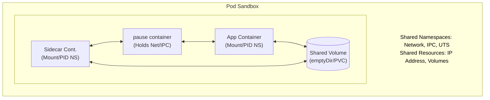
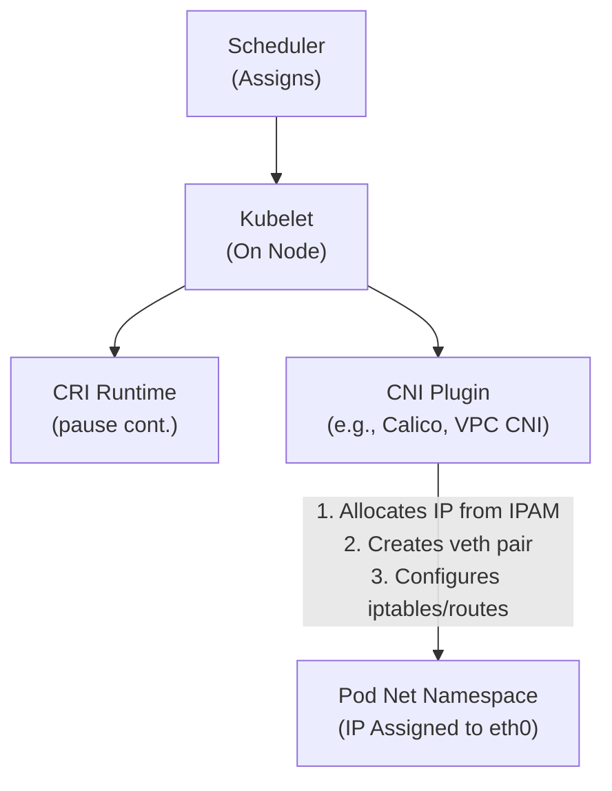
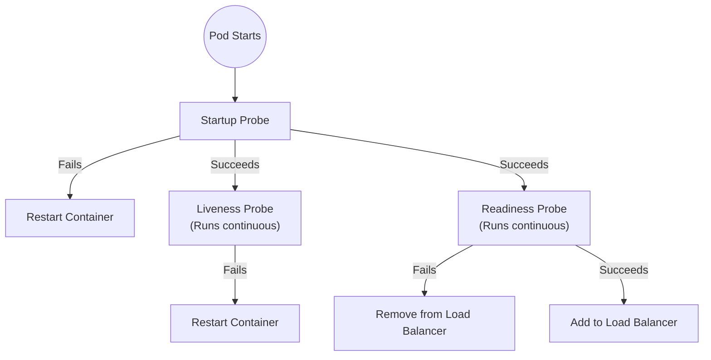
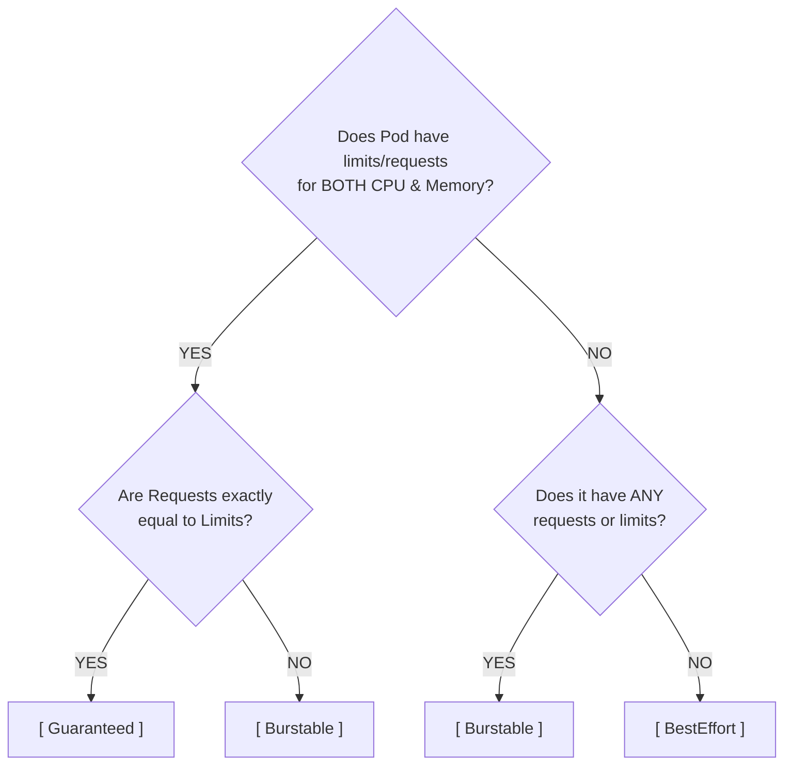

# Module 1.3: Pods - The Atomic Unit
**Complexity**: [MEDIUM]
**Time to Complete**: 60-75 minutes
**Prerequisites**: Module 1.2 (kubectl Basics)

## Learning Outcomes
- Diagnose complex Pod initialization and runtime failures (such as `CrashLoopBackOff`, `ImagePullBackOff`, `CreateContainerConfigError`, `CreateContainerError`, and `OOMKilled`) using native Kubernetes inspection tools and an intimate understanding of Linux exit codes.
- Design advanced multi-container Pod architectures implementing the sidecar, ambassador, adapter, and init container patterns to solve real-world logging, proxying, and bootstrapping challenges without modifying legacy application code.
- Evaluate the impact of resource requests and limits on Pod scheduling algorithms, node stability, and the Linux kernel's Completely Fair Scheduler (CFS) and Out Of Memory (OOM) killer mechanisms.
- Categorize Pods into their respective Quality of Service (QoS) classes (Guaranteed, Burstable, BestEffort) and predict how the Kubelet will prioritize them during node resource starvation and eviction events.
- Compare imperative command-line creation versus declarative YAML manifest management, justifying the industry preference for declarative workflows in GitOps-driven CI/CD pipelines.
- Implement shared storage (via `emptyDir` and `hostPath`) and low-latency intra-pod network communication strategies between multiple coupled containers residing within the same network and IPC namespaces.
- Configure, tune, and evaluate Readiness, Liveness, and Startup probes to govern a Pod's condition transitions, prevent premature termination of slow-starting legacy apps, and guarantee zero-downtime production traffic routing.
- Formulate secure pod architectures utilizing the `securityContext` to enforce least-privilege principles, drop Linux kernel capabilities, mandate read-only root filesystems, and mitigate potential container escape vulnerabilities.

## Why This Module Matters
In late 2021, a scaling e-commerce platform—let's call them "GlobalTradeX"—attempted to modernize their infrastructure by migrating their monolithic inventory management system to Kubernetes ahead of the Black Friday shopping season. Eager to lift-and-shift their architecture with minimal code refactoring, the team misunderstood a fundamental Kubernetes concept: they treated Kubernetes Pods like traditional Virtual Machines. 

Instead of decoupling their architecture into discrete microservices, they created a single Pod specification containing seven different application containers. Inside this Pod lived the Next.js web frontend, the Java Spring Boot backend API, an in-memory Redis cache, a Celery background worker, a Fluentd logging agent, a Prometheus metrics exporter, and a cron job process. They believed they were being efficient by keeping everything together just as it had been on their legacy physical servers.

When the Black Friday traffic spike hit, the Java backend API container started consuming heavy CPU to process the incoming database transactions. Because all seven software components were locked inside the same Pod abstraction, Kubernetes could not scale the Java API independently of the other components. 

To handle the CPU load, the Horizontal Pod Autoscaler (HPA) was forced to duplicate the entire Pod as a single unit. It began spinning up unnecessary copies of the Redis cache, the frontend web server, and the background workers just to get more capacity for the Java API. This rapid scaling quickly exhausted the cluster's physical memory capacity. 

Within an hour, the EC2 worker nodes began crashing due to system-level resource starvation and Out Of Memory panics. The inventory system went dark. The external database connections were exhausted by the duplicated background workers. The company lost an estimated $2.4 million over a four-hour outage, and the engineering team spent the weekend manually rolling back the deployment to their legacy Virtual Machine infrastructure.

This architectural failure stemmed from a misunderstanding of what a Pod is and what it is not. A Pod is not a virtual machine. It is not a dumping ground for disparate application components. A Pod is the smallest, atomic, indivisible unit of execution and scheduling in the Kubernetes ecosystem. 

By mastering Pods, you gain the ability to predictably schedule workloads, isolate failures, and design microservices that scale precisely when and how they need to. You will learn how to forensically debug failures when a container refuses to start, how to couple helper processes without compromising application modularity, and how to speak the declarative YAML language the Kubernetes control plane expects. You will transition from seeing Kubernetes as a black box to understanding it as an orchestrator of Linux primitives.

## A Brief History: From Chroot to Pods
Before we dive into the Linux mechanisms that power a Kubernetes Pod, we must establish the historical context that necessitated its invention. The evolution of the Pod did not occur in a vacuum; it was the result of decades of trial and error in isolated computing.

In 1979, the concept of process isolation was born with the introduction of the `chroot` system call in Unix Version 7. `chroot` allowed a system administrator to permanently change the apparent root directory for a specific running process and its children. This was revolutionary because a process could no longer physically traverse the filesystem to access other directories, providing a rudimentary form of isolation.

Fast forward to 2000, and the introduction of FreeBSD Jails brought the concept of `chroot` to its logical extreme. Jails isolated not only the filesystem but also the network stack and the process view, creating "virtual machines" that shared a single kernel. This was followed by Solaris Zones in 2004, which brought advanced resource control to these environments. 

In 2008, the Linux community merged Linux Control Groups (cgroups) into the mainline kernel. Developed by engineers at Google, cgroups provided the accounting required to limit how much CPU, Memory, Disk I/O, and Network bandwidth a specific group of processes could consume. When combined with Linux Namespaces, the foundational building blocks for modern Linux containers were complete.

In 2013, Docker democratized this Linux technology. Docker took the difficult-to-configure low-level primitives and wrapped them in an elegant Command Line Interface (CLI) and image packaging format. Suddenly, any developer could build an isolated Linux container in seconds.

However, as companies scaled Docker into production data centers, a complex new problem arose: orchestration. Managing tens of thousands of individual Docker containers scattered across physical servers was a logistical nightmare. Google, having run containerized workloads internally for a decade, knew that managing single containers was structurally flawed.

Google engineers understood that in distributed systems, applications almost never exist in perfect isolation. A web server needs a log forwarder. A cache needs a metrics scraper. A proxy needs an encryption layer. If you orchestrate single containers, you force these components to communicate over the routed public network, introducing latency and security risks.

To solve this, when Google open-sourced Kubernetes in 2014, they introduced their most brilliant architectural decision: The Pod. They rejected the idea of scheduling raw containers. Instead, they invented the Pod—a logical sandbox designed to house a cohesive group of interdependent containers that must run on the same host machine, sharing the same IP address and local disk volume.

## What a Pod Actually Is (A Deep Dive into Linux Primitives)
When you first learn about containerization, you are taught that a container is an isolated process running on a shared host Linux machine. It has its own dedicated filesystem, isolated network stack, and restricted access to underlying CPU and memory. So, why doesn't Kubernetes manage containers directly? Why did the engineers create this abstraction layer called a "Pod"?

To understand this design decision, we must look at how the Linux kernel achieves container isolation. A "container" is not a physical construct; it is an illusion created by a combination of Linux Kernel Namespaces and Control Groups (cgroups).

**Namespaces** limit what a specific process can *see*. They provide the illusion that a process has the operating system to itself.
- **PID (Process ID) Namespace:** Ensures that processes inside one container cannot see or send signals to processes in another container. To a containerized application, its main process always appears as Process ID (PID) 1.
- **Network Namespace:** Provides an isolated network stack, including its own virtual network interfaces, unique IP address, routing tables, and full port space (0-65535).
- **Mount Namespace:** Gives the container its own isolated filesystem hierarchy, distinct from the host machine's `/` directory.
- **UTS (UNIX Time-Sharing) Namespace:** Allows the isolated container to have its own independent hostname and domain name.
- **IPC (Inter-Process Communication) Namespace:** Isolates shared memory segments and Inter-Process Communication mechanisms, preventing cross-container memory snooping.
- **User Namespace:** Allows a process to have root privileges *inside* the container, while remaining an unprivileged user on the host system.

**Control Groups (cgroups)** limit what a process can *use*. They act as the accountants of the Linux kernel.
- They ensure a container cannot consume more than its allotted CPU time slice or physical RAM. If a container exceeds its memory cgroup limit, the kernel terminates it to protect the host.

If Kubernetes only managed individual containers, low-latency collaboration between processes would be difficult, inefficient, and insecure. Imagine a main application container that needs a helper process to compress its log files, or a proxy container to encrypt outbound network traffic. 

If these were separate containers managed directly by Kubernetes, they would have different IP addresses, isolated file systems, and no high-performance way to communicate over local inter-process communication (IPC) or shared memory without traversing the physical network stack.

A Pod solves this architectural problem by creating a shared environment. A Pod is a logical enclosure that wraps one or more physical containers. Containers within the same Pod share specific namespaces while keeping others isolated.



Specifically, containers within the same Pod share:
1. **The Network Namespace:** They share the same IP address and port space. They can communicate with each other using the `localhost` loopback interface. 
2. **The IPC Namespace:** They can utilize SystemV IPC or POSIX message queues to communicate directly in shared memory, bypassing the TCP/IP network stack.
3. **The UTS Namespace:** They share the same internal hostname.
4. **Storage Volumes:** They can mount the same physical or virtual storage volumes to read and write shared files simultaneously.

However, they do *not* automatically share the PID namespace or the Mount namespace. Each container retains its own isolated filesystem containing its specific application binaries, preventing dependency hell.

### The Secret "Pause" Container: The Unsung Hero of Kubernetes
To hold these shared Linux namespaces together without relying on the application containers themselves, Kubernetes does something clever. When the Kubernetes Scheduler assigns a Pod to a worker node, the node's Kubelet instructs the Container Runtime Interface (CRI) to build the Pod sandbox. It doesn't just start your application container directly. 

Instead, the first action the runtime takes is to start a tiny, invisible container known as the `pause` container (or "infrastructure container"). 

The `pause` container's only job is to request and claim the network, IPC, and UTS namespaces from the Linux kernel, and then go to sleep by executing the `pause()` system call. Your actual application containers are then launched and joined to the `pause` container's already-existing namespaces. 

Imagine if your Pod only had one application container responsible for holding the network namespace. If that application crashed, the Linux namespace repair would be destroyed, the IP address released, and when the application restarted, it would be assigned a completely new IP address. This constant churn would destroy cluster networking. 

Because the `pause` container literally does nothing but sleep, it never crashes. It holds the network namespace open indefinitely, acting as an anchor. This means that if your application container crashes and restarts a hundred times, the Pod's IP address never changes.

> **Pause and predict**: If Container A in a multi-container Pod starts a web server bound to port 8080, and Container B in the same Pod attempts to start and bind to port 8080 to serve metrics, what will happen and why?
> *(Because both containers share the same network namespace, loopback interface, and IP address provided by the `pause` container, Container B will crash with an `Address already in use` error. In a multi-container Pod, port numbers must be unique across all containers, just as they must be unique on a single developer laptop.)*

## The PLEG (Pod Lifecycle Event Generator) and the Kubelet Sync Loop
To comprehend how Pods operate, we must look at the Kubelet daemon running on every worker node. The Kubelet is a state machine manager. Its mandate is to compare the "desired state" of the Pods assigned to its node against the actual reality of the containers running via the local CRI runtime. 

If the API Server desires a Pod with two running containers, but the CRI reports only one container is running because it crashed, the Kubelet intervenes to reconcile the physical reality back to the desired state.

Historically, the Kubelet would actively poll the underlying Docker daemon every second, asking, "Is container X running?" In a cluster with thousands of pods per node, this polling volume destroyed node CPU performance.

To solve this scalability bottleneck, Kubernetes architects introduced the **Pod Lifecycle Event Generator (PLEG)**. 

The PLEG is an embedded subsystem within the Kubelet's binary. Instead of polling every container directly, the PLEG leverages low-level Linux Kernel features to subscribe to an asynchronous stream of system events originating from the CRI runtime. 

When a container crashes, the CRI fires a low-latency event directly to the PLEG. The PLEG registers the state change, translates the event into a Pod Lifecycle Event, and pushes it onto the Kubelet's primary sync loop queue. The Kubelet wakes up, reads the event, evaluates the Pod's `restartPolicy`, and commands the CRI to rebuild and restart the container process.

This event-driven architecture ensures that the Kubelet reacts to pod failures in milliseconds with zero polling overhead. Understanding the PLEG is crucial for administrators. If the PLEG becomes starved for CPU or overwhelmed by a storm of container crash events, it will log `PLEG is not healthy` errors. When the PLEG fails, the Kubelet goes blind; it stops reporting pod statuses back to the control plane, causing node failures.

## Why Do Pods Even Exist? Advanced Architectural Patterns
If statistical telemetry shows that over 90% of the time a Pod only contains a single application container, why mandate this abstraction? The answer lies in the remaining 10% of critical edge cases where coupled processes are architecturally necessary to solve complex distributed systems problems.

### 1. The Sidecar Pattern (Augmentation without Modification)
The Sidecar pattern is widely utilized. Imagine you are tasked with modernizing a legacy application written in C++. It hardcodes its operational logs to be written to a local file at `/var/log/legacy-app/audit-trail.log`. However, your Kubernetes observability stack uses Fluent-bit to scrape logs exclusively from standard output (`stdout`) and route them to a centralized Datadog cluster.

Instead of painfully rewriting the legacy application's C++ source code, you can deploy a **Sidecar Container** alongside it in the same Pod sandbox.

The main container runs the legacy C++ application and writes its logs to a shared `emptyDir` volume mount. The sidecar container mounts that same volume and runs a simple shell script: `tail -f /shared-logs/audit-trail.log`. Because the sidecar outputs the results of the `tail` command directly to its own isolated `stdout` stream, the cluster's logging daemon can capture the legacy logs perfectly. 

### 2. The Ambassador Pattern (Network Proxying)
The Ambassador pattern utilizes a secondary container to route and secure network traffic to and from the main application container. Imagine your main application needs to connect to an external database, and the connection requires mutual TLS (mTLS) certificate exchange and connection pooling.

Rather than building this complex networking logic directly into your application code, you deploy an Ambassador container (like Envoy proxy) inside the Pod. 

Your application makes a plain-text, unencrypted local HTTP request directly to `localhost:5432`. The Ambassador container, actively listening on that loopback port, intercepts the traffic, encrypts it on the fly with mTLS, manages the connection pool, and forwards the payload securely to the external database. This pattern is the bedrock upon which modern Service Meshes are built.

### 3. The Adapter Pattern (Data Normalization)
The Adapter pattern is used to standardize and normalize the varied output of multiple applications. Suppose you operate ten different microservices. They all expose performance metrics, but in conflicting formats (JSON, XML, and text). You want to monitor them all using a modern Prometheus stack, which expects a standard text-based format.

Instead of a company-wide rewrite, you deploy an Adapter container in each application's Pod. The Adapter container polls the main application's metrics endpoint via `localhost`, translates the format on the fly, and exposes a new endpoint on a new port that Prometheus can seamlessly scrape.

### 4. Init Containers (Strict Bootstrapping)
Sometimes, an application requires a specific environment to be prepared before it can safely boot. Perhaps a database schema must be migrated, or the application must wait until an external API is confirmed to be online.

**Init Containers** are specialized containers that run *before* the main application containers are allowed to start. They are executed sequentially. Init Container 1 must complete successfully (exit code of 0) before Init Container 2 begins. Only when all Init Containers have completed will the Kubelet authorize the start of the main application containers.

If an Init Container fails, Kubernetes will repeatedly restart the Pod until the Init Container succeeds. This provides a robust mechanism to delay application startup until dependencies are satisfied. Init Containers can also contain powerful tools (like the `aws-cli` or database migration binaries) that you do not want to package inside your main application container image.

### 5. Ephemeral Containers (Live Production Debugging)
A powerful feature in Kubernetes is the **Ephemeral Container**. Historically, if a production Pod was crashing and the image was built securely without a shell (e.g., distroless images), you could not use `kubectl exec` to debug it.

Ephemeral Containers solve this. They allow an administrator to attach a temporary container to a Pod *that is already running*. You can attach a debugging image (like `busybox` or `netshoot`) to a running distroless production Pod. Because the Ephemeral Container joins the existing Pod's shared network and IPC namespaces, you can run `tcpdump` inside the ephemeral container to sniff the live network traffic of your application container in real-time.

## Pod Networking: The CNI and IP Allocation
Unlike Docker running on your laptop, where networking is relatively straightforward, Kubernetes operates across distributed clusters of physical servers. How does a Pod get a unique IP address that can communicate with any other Pod located on any other node?

This magic is facilitated by the **Container Network Interface (CNI)**. Kubernetes itself does not handle IP address allocation or physical routing. Instead, Kubernetes strictly defines a programmatic interface (the CNI specification) and relies on third-party plugin providers (like Calico, Cilium, Flannel, or AWS VPC CNI) to execute network manipulation.



When the Kubernetes Scheduler assigns your Pod to a worker node, the following sequence occurs:
1. The Kubelet commands the local CRI runtime to establish the Pod Sandbox via the `pause` container.
2. Before the Kubelet allows any application containers to boot, it physically calls the configured CNI plugin binary executable residing on the node.
3. The CNI plugin evaluates its configuration and securely allocates a unique IP address from the cluster's CIDR block designated for that node.
4. The CNI plugin executes Linux networking commands to dynamically create a virtual ethernet interface pair (a `veth` pair). It inserts one end of the `veth` pair inside the Pod's network namespace (assigning it the requested IP address as `eth0`) and binds the opposing end to the host machine's network bridge.
5. The CNI plugin programs the host node's `iptables` rules or eBPF maps to guarantee that network packets destined for that IP address are routed from the physical ethernet card directly into the Pod's interface.
6. The CNI successfully returns the IP address back to the waiting Kubelet. The Kubelet records this IP in the Pod's API Status object and authorizes the CRI to commence booting the primary application containers.

> **Stop and think**: If the CNI plugin binary is missing or misconfigured on a worker node, what happens when the Scheduler assigns a new Pod to that node? Will the containers start?
> *(The Kubelet will fail to configure the network namespace because it cannot execute the CNI plugin to allocate an IP address or configure the routing. The Pod will remain in a `ContainerCreating` or `NetworkPluginNotReady` state, and the application containers will not be permitted to boot until the network is established.)*

## Advanced Pod Scheduling: Taints, Tolerations, and Affinity
The Kubernetes Scheduler is a powerful algorithmic engine. By default, it attempts to distribute your Pods evenly across the cluster to maximize resource utilization. However, you frequently require precise control over where your atomic units are placed. You might possess specialized nodes featuring expensive GPUs, NVMe drives, or nodes mandated for compliance zones.

### 1. Node Taints and Pod Tolerations (Repelling Workloads)
Imagine you possess worker nodes equipped with GPUs intended exclusively for machine learning inference. By default, the Scheduler will haphazardly schedule mundane web servers directly onto these nodes, wasting computational resources.

To solve this, you apply a **Taint** to the physical Node object. A Taint repels Pods. If you apply the taint `accelerator=nvidia-gpu:NoSchedule` to the node, the Scheduler will refuse to place any standard Pod on that host.

To allow a machine learning Pod to schedule onto that node, you configure a **Toleration** inside the Pod's YAML. The Toleration mathematically declares, "I tolerate the `accelerator=nvidia-gpu` taint." When the Scheduler evaluates the node, it recognizes the valid Toleration and permits the Pod to land.

### 2. Node Affinity (Attracting Workloads)
While Taints repel workloads, **Node Affinity** allows you to attract Pods to specific nodes based on logical expressions. It represents an architectural upgrade over the rudimentary `nodeSelector` parameter.

Node Affinity features two primary operational modes:
- `requiredDuringSchedulingIgnoredDuringExecution`: This is a hard rule. If you mandate that a Pod MUST be scheduled on a node with the label `zone=us-east-1a`, and no nodes with that label have sufficient CPU resources available, the Pod will remain permanently trapped in the `Pending` state.
- `preferredDuringSchedulingIgnoredDuringExecution`: This is a flexible, "soft" preference. You can instruct the Scheduler, "I prefer this Pod to land on a node with `disk-type=nvme`, but if none are available, gracefully schedule it onto standard nodes."

### 3. Pod Affinity and Anti-Affinity (Spreading for High Availability)
The pinnacle of scheduling control lies in **Pod Affinity** and **Pod Anti-Affinity**. Instead of calculating placement based on node labels, these rules calculate placement based strictly on the labels of the *other Pods* actively running on the node.

- **Pod Anti-Affinity (Spreading):** This is crucial for extreme high availability. If you are deploying three replicas of your `payment-gateway` web application, you do not want the Scheduler to place all three Pods onto the same physical worker node. By configuring `podAntiAffinity` against the label `app=payment-gateway` with a topology key of `kubernetes.io/hostname`, you force the Scheduler to spread the three Pods across different physical servers.
- **Pod Affinity (Colocation):** Conversely, if you have a web application Pod that makes ten thousand micro-requests per second to a caching Pod, you want those two separate Pods placed on the same physical node. By configuring `podAffinity`, the Scheduler ensures they dynamically land together, communicating securely over the local loopback interface.

| Feature | Target | Action | Use Case |
|---|---|---|---|
| Taints & Tolerations | Nodes (Taint), Pods (Tolerate) | Repels pods from nodes | Dedicate nodes to specific workloads (e.g., GPUs) |
| Node Affinity | Pods | Attracts pods to specific nodes | Ensure pods run in specific zones or on specific hardware |
| Pod Affinity | Pods | Attracts pods to other pods | Co-locate tightly coupled services to reduce latency |
| Pod Anti-Affinity | Pods | Repels pods from other pods | Spread replicas across hosts/zones for high availability |

## Pod Security: Hardening the Atomic Unit
The power of containerization inherently comes with security risks. Because containers share the underlying host Linux kernel, a severe vulnerability could allow an attacker who compromises a web application Pod to break out, gain root access to the physical worker node, and pivot laterally to compromise the entire cluster.

To mitigate this, Kubernetes provides the **Security Context**, a set of deeply embedded Linux kernel configurations applied directly to the Pod or container YAML spec.

A hardened Security Context includes:
- `runAsNonRoot: true`: This setting forbids the container runtime from executing the application process as the `root` user (UID 0). If the Dockerfile entrypoint incorrectly attempts to run as root, the Kubelet will refuse to start the container.
- `readOnlyRootFilesystem: true`: A critical security control. It forcefully mounts the container filesystem layer as completely read-only. If an attacker successfully exploits a remote code execution (RCE) vulnerability, they will be unable to download a malicious payload or modify binary scripts. (Note: You must thoughtfully mount an `emptyDir` volume specifically at `/tmp` if your application requires a scratch space).
- `allowPrivilegeEscalation: false`: This setting modifies the `no_new_privs` bit. It ensures that no child process created by the container can acquire greater privileges than its parent process, rendering malicious `setuid` binaries useless.
- `capabilities: drop: ["ALL"]`: By default, Linux containers retain a subset of root privileges grouped into "capabilities" (like `CAP_NET_RAW`). A hardened production application rarely requires these capabilities. By explicitly dropping all capabilities, you drastically shrink the viable attack surface area.

> **Pause and predict**: You configure `runAsNonRoot: true` in your Pod manifest. However, the Dockerfile used to build the image ends with `USER root`. What will happen when Kubernetes attempts to start this Pod?
> *(The Kubelet will inspect the image metadata and see that the process intends to run as UID 0 (root). Because the Pod specification explicitly forbids this via `runAsNonRoot: true`, the Kubelet will refuse to start the container, throwing a `CreateContainerConfigError` and keeping the Pod from running.)*

## Storage in Pods: Volumes and Persistence
Pods are inherently ephemeral, meaning any file written directly to the container's root filesystem is lost the moment the container crashes or the Pod is evicted. To preserve state or share data between containers within the same Pod, Kubernetes introduces the concept of **Volumes**.

A Volume is essentially a directory accessible to the containers in a Pod. The medium backing that directory depends entirely on the specific Volume Type you configure.

### 1. emptyDir (Ephemeral Scratch Space)
An `emptyDir` volume is created the exact moment a Pod is assigned to a Node. It is initially empty. All containers within the Pod can read and write identically to the same files in the `emptyDir` volume. When a Pod is removed from a node, the data in the `emptyDir` is permanently deleted. It is perfect for scratch space or sidecar log sharing.

### 2. hostPath (Dangerous Node Access)
A `hostPath` volume fiercely mounts a file or directory from the underlying physical host node's filesystem into your Pod. This is dangerous. If you mount `/var/run/docker.sock` into a Pod, that Pod now has total root control over the entire node. `hostPath` is rarely used in secure production environments except by highly privileged system daemons that require raw access to node-level logs.

### 3. PersistentVolumes (Stateful Durability)
For true data persistence (like a PostgreSQL database file), you must use **PersistentVolumeClaims (PVCs)**. A PVC is an explicit request for permanent storage. When a Pod claims a PVC, Kubernetes provisions an external block storage device (like an AWS EBS volume) and attaches it to the worker node. Even if the Pod is destroyed, the physical cloud disk remains intact. When the Pod is rescheduled to a completely different node, Kubernetes seamlessly reattaches it to the new node, preserving the data indefinitely.

## The Pod Lifecycle, State Machine, and Probes
A Pod is an inherently ephemeral entity. It is born, it lives, it performs its configured duty, and it dies. Once a Pod is dead, it is finalized; it is never resurrected. If a worker node suffers a kernel panic, the Pods currently running on that specific node are lost forever. Kubernetes controllers (like Deployments) must step in to create entirely *new* Pods to replace the dead ones.

To truly understand what a Pod is currently doing at a system level, you must understand its rigid lifecycle phases:

1. **Pending**: The Pod specification has been formally accepted by the Kubernetes API server and written to the `etcd` database. However, one or more of its containers has not been created by the runtime yet. This phase encompasses the time spent waiting for the Scheduler to execute its bin-packing algorithms, and the time spent downloading the container images. If a Pod is stuck in Pending for hours, it is a scheduling constraint issue or an image pull authorization error.
2. **Running**: The Pod has been bound to a specific Node. The `pause` container has secured the network sandbox. All containers have been successfully initialized. At least one container is still actively running, or is in the process of starting up. 
3. **Succeeded**: All containers in the Pod have successfully terminated gracefully (returning a Linux exit code of precisely 0), and the Pod's restart policy dictates that they will not be restarted. This phase is common for one-off tasks, cron jobs, or batch processing workflows.
4. **Failed**: All containers in the Pod have terminated, and at least one container has terminated in failure (returning an exit code other than zero, or was forcefully terminated by the OOM killer). 
5. **Unknown**: The true state of the Pod could not be reliably obtained by the Kubernetes control plane. This is almost universally due to a network communication failure between the API server and the specific Kubelet daemon on the node.

### Pod Conditions and Probes: The True Measure of Readiness
While the high-level `Phase` provides a broad summary of the Pod's existence, Kubernetes also rigorously tracks highly specific **Conditions** that give a deep view of the Pod's readiness to serve live traffic:
- `PodScheduled`: Has the Pod been assigned to a worker node by the Scheduler?
- `Initialized`: Have all sequential Init Containers completed their tasks with an exit code 0?
- `ContainersReady`: Are all the primary application containers fully booted?
- `Ready`: Is the Pod officially ready to be added to the load balancer and serve HTTP requests?

It is entirely possible for a Pod to be in the `Running` phase, but have a `Ready` condition stuck at `False`. This happens if the application inside the container is actively running as a Linux process, but takes 60 seconds to boot its Spring Boot context and establish connection pools.

To manage this orchestration, Kubernetes utilizes **Probes**—active health checks executed systematically by the Kubelet against your containers:



1. **Liveness Probes**: "Is the application deadlocked or frozen?" The Kubelet checks if the application is healthy. If the Liveness Probe fails repeatedly, the Kubelet restarts the container process to attempt to clear the deadlock and restore service.
2. **Readiness Probes**: "Is the application fully ready to receive user traffic?" The Kubelet checks if the app has finished booting. If a Readiness Probe fails, the container is *not* restarted. Instead, the Pod's `Ready` condition is set to `False`, and the Pod's IP address is removed from all Kubernetes Services and cloud load balancers. Traffic is routed away to healthy pods until the probe succeeds again.
3. **Startup Probes**: "Has the slow application finished its initial boot sequence?" This probe disables all Liveness and Readiness checks until it passes. This prevents the Kubelet from prematurely killing a slow-starting legacy application because its Liveness probe timed out before it even had a fair chance to finish loading.

These probes are configured with specific mathematical parameters:
- `initialDelaySeconds`: How long to wait after the container starts before launching the first probe.
- `periodSeconds`: How often to execute the probe.
- `failureThreshold`: How many consecutive times the probe must fail before Kubernetes takes action.
- `successThreshold`: How many consecutive times a failed probe must succeed to be marked healthy again.

## Anatomy of a Pod Specification: The Master Manifest
In Kubernetes, you define exactly what you want the cluster architecture to look like using structured YAML manifests. A Pod manifest has four critical top-level sections: `apiVersion`, `kind`, `metadata`, and `spec`. 

Let's dissect an enterprise-grade production Pod specification:

```yaml
apiVersion: v1
kind: Pod
metadata:
  name: financial-processor-pod
  namespace: payments-prod
  labels:
    app: payment-gateway
    environment: production
    tier: backend
    security-zone: pci-dss
  annotations:
    prometheus.io/scrape: "true"
    prometheus.io/port: "8443"
spec:
  restartPolicy: Always
  serviceAccountName: processor-vault-accessor
  priorityClassName: mission-critical-high
  nodeSelector:
    disk-type: nvme-ssd
    compliance: pci-dss-certified
  tolerations:
    - key: "dedicated"
      operator: "Equal"
      value: "payments"
      effect: "NoSchedule"
  affinity:
    podAntiAffinity:
      requiredDuringSchedulingIgnoredDuringExecution:
      - labelSelector:
          matchExpressions:
          - key: app
            operator: In
            values:
            - payment-gateway
        topologyKey: "kubernetes.io/hostname"
  volumes:
    - name: tmp-scratch-data
      emptyDir:
        sizeLimit: 1Gi
  initContainers:
    - name: vault-bootstrap
      image: hashicorp/vault-agent:1.16
      command: ["/bin/sh", "-c", "vault pull-secrets > /shared/secrets.env"]
      volumeMounts:
        - name: tmp-scratch-data
          mountPath: /shared
  containers:
    - name: main-processor
      image: registry.example.com/payment-processor:v2.4.1
      imagePullPolicy: IfNotPresent
      command: ["/app/start-processor.sh"]
      ports:
        - containerPort: 8443
          name: https-metrics
          protocol: TCP
      securityContext:
        runAsUser: 1000
        runAsGroup: 3000
        runAsNonRoot: true
        readOnlyRootFilesystem: true
        allowPrivilegeEscalation: false
        capabilities:
          drop:
            - ALL
      volumeMounts:
        - name: tmp-scratch-data
          mountPath: /var/scratch
      livenessProbe:
        httpGet:
          path: /health/live
          port: 8443
        initialDelaySeconds: 30
        periodSeconds: 15
        failureThreshold: 3
      readinessProbe:
        httpGet:
          path: /health/ready
          port: 8443
        initialDelaySeconds: 15
        periodSeconds: 10
        successThreshold: 2
      resources:
        requests:
          cpu: "500m"
          memory: "256Mi"
        limits:
          cpu: "1000m"
          memory: "512Mi"
```

### Breaking Down the Complex Master Spec
1. **Metadata**: The `name` uniquely identifies the Pod within its `namespace`. `labels` are crucial to the Kubernetes architecture. They are key-value pairs used to organize and select resources. Without accurate labels, Kubernetes Services would have no mathematical way to dynamically select which Pods they are routing traffic to. `annotations` are similar to labels but are used for non-identifying metadata, often read by external infrastructure tools.
2. **nodeSelector and Tolerations**: This instructs the Scheduler. The `nodeSelector` demands the Pod *only* be placed on worker nodes that possess the exact matching labels. The `tolerations` block allows this Pod to bypass a node's "Taint". 
3. **affinity**: This `podAntiAffinity` block forces the Scheduler to ensure that no two `payment-gateway` pods are *ever* scheduled on the exact same physical host machine. This guarantees high availability.
4. **serviceAccountName**: Explicitly grants the Pod a specific cryptographic identity, allowing it to dynamically authenticate against the Kubernetes API or major cloud providers without hardcoding static credentials inside the container image.
5. **securityContext**: This block hardens the container at the Linux kernel level. It forces the application to run as an unprivileged user, forbids the process from running as the `root` user, drops ALL Linux kernel capabilities, and mounts the entire container filesystem as Read-Only to guarantee attackers cannot download malicious payloads.
6. **Volumes**: We define an `emptyDir` volume with a strict 1Gi size limit. This is a scratch directory dynamically created when the Pod is assigned to a node. It exists only as long as the Pod exists on that node and is shared securely among all containers.
7. **Resource Requests and Limits**: This is the most important section for cluster stability and preventing cascading node failures.

## The Importance of Requests and Limits
When you ask Kubernetes to schedule a Pod, the Scheduler's bin-packing algorithm needs to mathematically prove if a Node has enough physical room to accommodate it.

- **Requests (The Guarantee)**: This is exactly what the container is guaranteed to get by the cluster. If a container requests `256Mi` of memory, the Scheduler will exclusively place this Pod on a Node that has at least `256Mi` of unallocated memory. It is used *exclusively* for scheduling calculations.
- **Limits (The Hard Ceiling)**: This is the maximum threshold the container is permitted to use by the Linux kernel's cgroups. 
    - **CPU Limits:** If a container attempts to consume more CPU than its limit, the kernel's Completely Fair Scheduler (CFS) actively throttles (slows down) the application. The container will not crash, but it will suffer severe latency. 
    - **Memory Limits:** If a container attempts to allocate more physical memory than its limit, the host Linux kernel immediately terminates the main application process via the OOM (Out Of Memory) Killer, resulting in a container crash and an exit code of `137`.



Based on how you configure these two values, Kubernetes categorizes your Pod into one of three **Quality of Service (QoS)** classes:
1. **Guaranteed**: The Pod sets both Requests and Limits for both CPU and Memory, and they are exactly equal. These are the highest priority pods. They will be the last to be killed if the node runs out of memory.
2. **Burstable**: The Pod has Requests defined that are strictly lower than its Limits. It is guaranteed a baseline, but can "burst" up to its limit if the node has spare resources. If the node runs out of memory, Burstable pods that are exceeding their requests are killed before Guaranteed pods.
3. **BestEffort**: The Pod has zero Requests and zero Limits defined. It is allowed to use whatever resources are freely available, but if the node experiences the slightest memory pressure, BestEffort pods are terminated immediately to protect the system.

> **Pause and predict**: Look at the following specification: CPU Request: 250m, CPU Limit: 500m, Memory Request: 512Mi, Memory Limit: 512Mi. What QoS class will Kubernetes assign to this Pod?
> *(Kubernetes will assign the `Burstable` QoS class. Even though the memory request and limit are equal, the CPU request is strictly less than the CPU limit. For a Pod to be classified as `Guaranteed`, both CPU and memory must have requests perfectly equal to limits.)*

## Imperative vs. Declarative Management
There are two distinct, philosophically opposed ways to instruct Kubernetes to manage a Pod.

**Imperative Management** involves typing commands directly into your terminal, explicitly telling the Kubernetes API *what specific action to perform right now*.
`kubectl run my-nginx-test --image=nginx:1.27-alpine --port=80 --labels=env=dev`
This approach is fast and excellent for rapidly generating YAML templates via dry-runs. However, it is an anti-pattern for production environments. If a junior engineer accidentally deletes the Pod, there is zero historical record of how it was created. It is not version-controlled, auditable, or repeatable in a disaster recovery scenario.

**Declarative Management** involves writing a detailed YAML file defining *the exact state you desire*, and asking Kubernetes to autonomously make physical reality match your file.
`kubectl apply -f pod-manifest.yaml`
This is the universally accepted industry standard. The YAML file is securely committed to a Git repository (a practice known as GitOps). Any changes to the infrastructure must go through a formal pull request and peer code review. If the entire data center burns to the ground, you simply re-apply the repository of YAML files to a new cluster, and your architecture is restored autonomously.

### War Story: The Ephemeral Ghost in the Machine
At a major international news agency during a breaking news event, a site reliability engineer manually updated the container image of a critical caching Pod using a fast imperative command (`kubectl set image pod/cache-pod cache=redis:7.2-alpine`). They fixed the bug instantly, restored service, and went home for the weekend. 

However, on Sunday morning, a node hardware failure caused the imperative caching Pod to be automatically evicted and forcefully rescheduled onto a healthy node. Because the engineer's imperative change was completely ephemeral and was never saved to the declarative YAML manifests, the cluster automatically pulled the *old*, buggy image definition directly from the Git repository to recreate the new Pod instance. The application broke again, the entire website went down, and the platform team learned a hard lesson: **If it isn't defined in Git, it simply does not exist.** Never use imperative commands to alter production state.

## Diagnosing Pod Failures: The Deep Detective Work
When a Pod fails to start, crashes repeatedly, or mysteriously goes offline, Kubernetes provides a wealth of forensic clues. Your job is to interpret them using the `kubectl` toolset.

### 1. The `Pending` State (Scheduling and Pull Errors)
If you apply a Pod manifest and it fails to ever reach the `Running` phase, the very first command you must execute is:
`kubectl describe pod <pod-name>`
Do not look at the YAML output; scroll directly to the bottom to the **Events** section. This is the chronological log of what the Control Plane and the Scheduler attempted to do.

- **Insufficient Resources**: If the event says `0/50 nodes are available: 50 Insufficient memory`, your Pod mathematically requested more guaranteed memory than any single node in your cluster can provide. You must lower your CPU/Memory requests, delete other pods to free up space, or add larger nodes to the cluster.
- **Taint / Affinity Mismatch**: If it says `0/50 nodes are available: 50 node(s) had taint {dedicated: database}, that the pod didn't tolerate`, the scheduler is refusing to place your web pod on a node reserved exclusively for databases.
- **ImagePullBackOff / ErrImagePull**: If the event says `Failed to pull image "my-company/backend:v99": rpc error: code = NotFound`, the Kubelet cannot download the image. Kubernetes is desperately trying to pull the image and exponentially backing off before trying again. 
  - **The Fix:** Rigorously check for typos in the image name, verify the image tag exists in the remote registry, and ensure the cluster has the correct authentication secrets (`imagePullSecrets`) to securely access private registries.

### 2. The `CreateContainerConfigError` and `CreateContainerError`
Sometimes the image pulls successfully, but the container refuses to begin executing.
If you see these errors in the Events, you have asked the Kubelet to do something logically impossible.
- **Root Cause:** You defined an environment variable that references a Kubernetes Secret or ConfigMap that literally does not exist in the namespace. The Kubelet refuses to start the container because it cannot fulfill the configuration contract.
- **The Fix:** Verify that your ConfigMaps and Secrets are created *before* you deploy the Pod that depends on them.

### 3. The `CrashLoopBackOff`
This is arguably the most common error for Kubernetes beginners. The Pod reaches the `Running` state, meaning scheduling, networking, and image pulling were all executed perfectly. However, the application inside the container crashes (it exits with a non-zero Linux exit code like 1, 2, or 255). 

The Kubelet restarts the container process. It crashes again immediately. The Kubelet restarts it again. To prevent the node from burning 100% of its CPU cycles restarting a broken app, Kubernetes introduces an exponential backoff delay. It waits 10 seconds, then 20 seconds, then 40, up to a strict maximum limit of exactly 5 minutes between restarts. This cycle is known as `CrashLoopBackOff`.

**How to systematically diagnose:** Do *not* use `describe` here. The container actually started successfully, so the scheduling events are totally fine. You need to see exactly what the application process printed to the console standard output mere milliseconds before it died.
`kubectl logs <pod-name> --previous` (The `--previous` flag shows the logs of the *last* crashed container instance).
If the logs state `FATAL: Unable to connect to database - Connection Refused` or `SyntaxError: Unexpected token`, you have successfully found your root cause. It is an application code bug, a missing environment variable, or a networking error, and not a Kubernetes scheduling error.

### 4. The Silent Killer: `OOMKilled` (Exit Code 137)
If a poorly written application leaks memory over time, it will eventually hit the hard memory limit defined in its `resources.limits.memory` specification. When this threshold is crossed, the Linux kernel aggressively terminates the offending process to protect the rest of the node's stability.

If an application Pod restarts unexpectedly without a single error log being printed to standard output, you must check the system exit code immediately. 
`kubectl describe pod <pod-name>`
Look closely at the `Last State` block of the specific container. If you see `Reason: OOMKilled` and `Exit Code: 137`, your application ran completely out of its permitted memory and was assassinated by the kernel.
**The Fix:** You must fix the architectural memory leak in the application's source code, or edit the Pod YAML to significantly increase the physical memory limit (e.g., from `512Mi` to `1024Mi`).

### 5. Interactive Debugging with `exec` and `port-forward`
Sometimes simply reading static logs isn't enough to solve a highly complex, intermittent networking issue. You need to get physically inside the container's isolated network and filesystem namespace to see exactly what it sees.
`kubectl exec -it <pod-name> -- /bin/sh`
This command drops you directly into an interactive shell *inside* the live, running container process. From here, you can execute `nslookup` to test internal cluster DNS resolution, `ping` remote databases to verify routing, or read local configuration files physically mounted on the container disk.

Furthermore, if you need to test a web application running inside a Pod but you haven't set up complex public routing (Services, Ingresses) yet, you can tunnel traffic directly from your local laptop into the Pod's network namespace over the encrypted API server connection:
`kubectl port-forward pod/<pod-name> 8080:80`
Now, opening `http://localhost:8080` in your local web browser will route the HTTP request through the encrypted Kubernetes API server tunnel and directly into port 80 of your deeply isolated Pod.

## Did You Know?
1. The foundational concept and terminology of the "Pod" was inspired by the biological term for a tight-knit group of whales, fitting perfectly with Docker's iconic whale logo and Kubernetes' broader nautical and maritime theme.
2. The `pause` container image, which quietly holds the vital network namespace open for every Pod across your entire global cluster, is incredibly tiny and optimized—compiled purely from low-level C, the resulting binary is typically far less than 700 kilobytes.
3. In Kubernetes 1.28+, native support for true "Sidecar Containers" was finally introduced as a core built-in feature, fundamentally changing how init containers can be powerfully configured. They can now be formally instructed to run indefinitely alongside main workloads without blocking the startup sequence, solving an architectural headache for Service Meshes.
4. If a container process unexpectedly exits with the exact code `137`, it mathematically means it received a highly fatal `SIGKILL` (signal 9) from the host Linux operating system. In a Kubernetes context, this undeniably guarantees the process was abruptly terminated by the node's OOM (Out Of Memory) Killer mechanism.

## Common Mistakes

| Mistake | Why It Happens | How to Fix It |
| :--- | :--- | :--- |
| **Treating Pods exactly like physical VMs** | Misunderstanding the shared lifecycle. Placing a web frontend, backend API, and a database inside one single Pod. | Break disparate, independently scalable applications into separate single-container Pods unless they are physically coupled and share local disk space. |
| **Deploying naked, unmanaged Pods in production** | Falsely believing Pods are inherently resilient. They are ephemeral and will not be resurrected if a physical node dies. | Always wrap Pods in higher-level, resilient controllers like Deployments, DaemonSets, or StatefulSets to ensure high availability. |
| **Forgetting Resource Requests and Limits entirely** | Laziness, rushing features to production, or a lack of application performance profiling. | Always strictly define memory and CPU limits. Without limits, a single severe memory leak in one rogue Pod can crash the entire multi-tenant worker node. |
| **Misunderstanding `localhost` in multi-container Pods** | Forgetting that all containers inside a Pod strictly share the exact same network namespace, routing table, and IP address. | Use distinct, different ports for each individual container within the Pod to completely avoid `Address already in use` OS-level bind errors. |
| **Using `latest` Docker image tags** | Developer convenience during local development dangerously leaking into production manifests. | Always pin images to specific SHAs or immutable version tags (e.g., `v2.1.4`) to prevent unpredictable rollouts and `ImagePullBackOff` disasters. |
| **Using `exec` to manually fix live production problems** | Treating ephemeral containers like mutable Linux servers. Manual changes are lost instantly the very moment the Pod restarts. | Pods are strictly immutable. Fix the configuration centrally in Git or the Dockerfile, build a brand new image, and redeploy it declaratively via CI/CD. |
| **Overusing Init Containers for continuous polling tasks** | Misunderstanding that Init Containers must completely exit (code 0) before the main app can begin to start booting. | Use background sidecar containers for continuous polling tasks; strictly reserve Init Containers only for finite, pre-flight, boot-time setup scripts. |
| **Ignoring Liveness and Readiness Probes completely** | Assuming the underlying framework will handle health naturally, or simple oversight. | Unmonitored pods will receive live traffic before they finish booting, causing massive 502 errors and dropping critical production requests. |

## Quiz

<details>
<summary>1. Scenario: You have an entrenched legacy application that hardcodes its critical audit logs to a local file `/var/log/app.log`. Your organization's strict monitoring standard requires all logs to be streamed to standard output (`stdout`) for Fluentd collection. How should you architect the Pod to meet this requirement without rewriting a single line of the legacy application's C++ source code?</summary>

**Answer:** Implement the Sidecar architectural pattern to solve this without modifying the legacy code. Deploy a multi-container Pod where the legacy application writes its logs to a shared `emptyDir` volume mount. Next, deploy a second sidecar container within the same Pod that mounts this shared volume and runs a continuous command like `tail -f /var/log/app.log`. Because the sidecar reads the file and outputs the data to its own `stdout` stream, the cluster's logging daemon can scrape it seamlessly. This approach successfully isolates the legacy codebase from modern infrastructure requirements.
</details>

<details>
<summary>2. Scenario: Your new microservice Pod has been stuck in a `Pending` state for over 15 minutes. You run `kubectl describe pod my-microservice` and see the event: `0/50 nodes are available: 50 Insufficient cpu`. What is the root cause, and what are your two architectural options to resolve it?</summary>

**Answer:** The root cause is that the Pod's requested CPU is higher than the available, unallocated CPU capacity on any single worker node across the cluster. The Scheduler evaluates these constraints mathematically and cannot find a node with enough space to accommodate it. To resolve this, you can decrease the CPU `requests` in the Pod's YAML specification if the application does not actually need that much compute. Alternatively, you can add a larger worker node to the cluster or trigger an autoscaling event to provide enough physical capacity. Both options ensure the Scheduler's resource equation can be satisfied.
</details>

<details>
<summary>3. Scenario: You are designing a Pod that needs to download a 500MB machine learning model from an S3 bucket before the main Python inference application starts serving traffic. What Kubernetes feature should you implement to guarantee the file is downloaded before the web server boots?</summary>

**Answer:** You should use an Init Container for this strict bootstrapping requirement. Define an Init Container with the `aws-cli` tool and mount an `emptyDir` volume shared with the main Python application. The Init Container runs the S3 download command into the shared volume and exits with a code of 0. Kubernetes guarantees the main container will not start until the Init Container successfully finishes, preventing the application from booting without its required data. By sharing the volume, the downloaded model is immediately available to the main container once it begins initialization.
</details>

<details>
<summary>4. Scenario: A developer complains that their Node.js application restarts randomly under load. You inspect the Pod and see a Restart Count of 14, with the Last State indicating `Reason: OOMKilled` and `Exit Code: 137`. What kernel subsystem terminated the container, and what modification is required?</summary>

**Answer:** The Linux kernel's Out Of Memory (OOM) Killer terminated the container. This occurred because the Node.js process attempted to allocate more RAM than permitted by the container's cgroup hard limit. To fix this permanently, you must edit the Pod's declarative YAML manifest and increase the `resources.limits.memory` value. However, you should also ensure the application is not suffering from a continuous memory leak before simply raising the limit. Addressing the underlying memory usage is just as important as adjusting the cgroup boundary.
</details>

<details>
<summary>5. Scenario: Two separate containers are defined in the same Pod. Container A runs an Nginx web server on port 80. Container B runs a Prometheus metrics exporter that needs to scrape the status page from Container A. What hostname and port should Container B use in its HTTP request to connect to Container A?</summary>

**Answer:** Container B should make its HTTP request directly to `http://localhost:80`. This is perfectly possible because all containers within a single Pod share the same network namespace provided by the `pause` container. They can communicate with each other over the loopback interface just as if they were isolated processes running on the exact same physical server. There is no need to use complex external service names or external cluster IPs. This shared networking model significantly simplifies intra-Pod architecture and reduces communication latency.
</details>

<details>
<summary>6. Scenario: You notice a production Pod is stuck in `CrashLoopBackOff`. You run `kubectl logs my-failing-pod`, but the terminal output is completely blank. Why might the logs be empty, and how can you determine why the container failed to start?</summary>

**Answer:** The logs might be blank because the application crashed before it could initialize and write any data to standard output. This often happens if the container image is physically missing the entrypoint executable or if a file permission error prevents the process from launching. To investigate, you should use `kubectl describe pod my-failing-pod` and look deeply at the State and Events sections. These sections will reveal the raw exit code or any underlying container runtime errors that definitively explain the failure. Diagnosing these early failures is critical because application-level logs simply cannot be generated if the process fails to start.
</details>

<details>
<summary>7. Scenario: You used the imperative command `kubectl run test-pod --image=nginx` to test network connectivity. Ten minutes later, the worker node your Pod was scheduled on suffers a hardware failure and loses power. What will happen to your `test-pod`?</summary>

**Answer:** Your `test-pod` will be permanently lost and will not recover on its own. Because the Pod was created imperatively as a naked, unmanaged resource, it is not monitored or governed by a higher-level autonomous controller like a Deployment or ReplicaSet. The control plane will eventually notice the node is dead and mark the Pod's state as `Terminating`. It will not automatically recreate or reschedule the Pod onto a healthy node. This demonstrates exactly why declarative management and controllers are strictly required for production workloads.
</details>

<details>
<summary>8. Scenario: A security audit reveals that an attacker escaped an application container and executed a remote code payload because the container was running as the root user. What YAML configuration must you add to the Pod manifest to prevent this?</summary>

**Answer:** You must add a `securityContext` block to the Pod or container specification to implement least privilege. Specifically, add `runAsNonRoot: true` to mandate that the container runtime executes the process as an unprivileged user. Additionally, setting `readOnlyRootFilesystem: true` forcefully prevents an attacker from downloading destructive payload binaries directly onto the container disk. These settings drastically reduce the viable attack surface area by constraining what the compromised process can physically do. Properly applying these context rules hardens the overall cluster against dangerous lateral movement.
</details>

## Hands-On Exercise: The Ultimate Multi-Container Debugging Challenge

In this hands-on exercise, you will create a multi-container Pod, physically inspect its shared namespaces using native tools, intentionally introduce a fatal configuration error, and systematically use native diagnostic commands to uncover the deep root cause of the failure.

<details>
<summary>Task 1: Declarative Multi-Container Creation</summary>

Write a declarative YAML manifest named `multi-pod.yaml` that creates a single Pod containing two communicating containers. 
- The Pod name should be `web-logger`.
- Container 1: Name it `nginx-server`, use the `nginx:1.27-alpine` public image, and mount a shared volume named `html-dir` at the path `/usr/share/nginx/html`.
- Container 2: Name it `content-writer`, use the `busybox:1.36.1` public image. It must mount the same `html-dir` volume at the path `/data`. Its primary command should be a continuous shell loop that writes the current date and time to `/data/index.html` every 5 seconds. *(Hint for the command array: `["/bin/sh", "-c", "while true; do date > /data/index.html; sleep 5; done"]`)*
- The shared volume must be of type `emptyDir: {}`.

**Solution:**
```yaml
apiVersion: v1
kind: Pod
metadata:
  name: web-logger
spec:
  volumes:
    - name: html-dir
      emptyDir: {}
  containers:
    - name: nginx-server
      image: nginx:1.27-alpine
      volumeMounts:
        - name: html-dir
          mountPath: /usr/share/nginx/html
    - name: content-writer
      image: busybox:1.36.1
      command: ["/bin/sh", "-c", "while true; do date > /data/index.html; sleep 5; done"]
      volumeMounts:
        - name: html-dir
          mountPath: /data
```
</details>

<details>
<summary>Task 2: Apply and Verify the Architecture</summary>

Apply the declarative manifest to your local cluster. Verify that the Pod systematically transitions through the `Pending` phase into the `Running` state and that *both* containers are reported as ready. Finally, use port-forwarding to dynamically create a secure tunnel and continuously view the generated webpage on your local browser.

**Solution:**
```bash
# Apply the declarative manifest to the API Server
kubectl apply -f multi-pod.yaml

# Wait for the pod to become fully ready
kubectl wait --for=condition=Ready pod/web-logger --timeout=60s
```

Open a new terminal window, or background the port-forward process to test it:

```bash
# Establish a secure port-forward tunnel to the Pod in the background
kubectl port-forward pod/web-logger 8080:80 &

# Wait a moment for the tunnel to establish
sleep 2

# Curl the local port to verify
curl http://localhost:8080
# You should see the current date and time printed, updating every 5 seconds!

# Terminate the background port-forward process
kill %1
```
</details>

<details>
<summary>Task 3: Interactive Namespace Exploration</summary>

The `content-writer` container is continuously overwriting the physical file on the shared disk. Use `kubectl exec` to securely drop into an interactive root shell inside the `nginx-server` container. Once inside, manually install the `curl` utility and make a local HTTP request perfectly to `localhost:80`. Why does this miraculously work across container boundaries?

**Solution:**
```bash
# Execute an interactive shell inside the specific container
kubectl exec -it web-logger -c nginx-server -- /bin/sh
```

Once inside the container's interactive shell, execute the following:

```bash
# Inside the container's isolated mount namespace, quickly install curl
apk add --no-cache curl

# Curl the incredibly local network interface
curl http://localhost:80

# Exit the container gracefully
exit
```
*Exactly why it works: Even though we executed directly into the `nginx-server` container's specific filesystem namespace, it is actively listening on port 80 of the overall Pod's shared network namespace. The fast local loopback interface (`localhost`) is shared equally among all active containers residing within the Pod thanks to the foundational `pause` container architecture.*
</details>

<details>
<summary>Task 4: Intentionally Triggering an OOMKilled Event</summary>

Let's intentionally break a new Pod to intimately observe harsh kernel behavior. Create a completely new file called `oom-pod.yaml`. Define a Pod that runs the `polinux/stress` image to generate load. Give it a strict memory limit of `50Mi`. Set the container command explicitly to `["stress", "--vm", "1", "--vm-bytes", "150M", "--vm-hang", "1"]`. Apply the file and watch its lifecycle status.

**Solution:**
```yaml
# oom-pod.yaml
apiVersion: v1
kind: Pod
metadata:
  name: memory-hog
spec:
  containers:
    - name: stress-test
      image: polinux/stress:1.0.4
      command: ["stress", "--vm", "1", "--vm-bytes", "150M", "--vm-hang", "1"]
      resources:
        limits:
          memory: "50Mi"
```
```bash
# Apply the doomed pod to the cluster
kubectl apply -f oom-pod.yaml

# Watch the carnage unfold (wait a few seconds for the crash)
sleep 5
kubectl get pod memory-hog
```
*You will briefly see it change to `Running`, and then almost immediately transition permanently to `OOMKilled`, followed by the frustrating `CrashLoopBackOff` cycle. The container software explicitly asked the Linux kernel to allocate precisely 150 Megabytes of RAM, but Kubernetes configured the cgroup hard limit to exactly 50 Megabytes. The kernel instantly terminated the rogue process.*
</details>

<details>
<summary>Task 5: Forensically Diagnosing the Death</summary>

Use the incredibly detailed `kubectl describe` command to forensically prove exactly *why* the `memory-hog` Pod died. Find the exact mathematical Exit Code and String Reason to present to your senior engineering team.

**Solution:**
```bash
# Extract the forensic log of the dead pod
kubectl describe pod memory-hog
```
*Scroll down to the `Containers:` section, carefully locate the `stress-test` container definition, and look intimately at the `Last State:` data block. You will clearly see `Reason: OOMKilled` directly alongside `Exit Code: 137`. This is the exact smoking gun you desperately look for in massive production outages.*
</details>

<details>
<summary>Task 6: Systematic Clean Up</summary>

Cleanly delete both completely broken Pods created during this exercise to immediately free up valuable cluster resources for your colleagues.

**Solution:**
```bash
# Delete the pods, returning the cluster to a clean state
kubectl delete pod web-logger memory-hog --force --grace-period=0
```
</details>

## Next Module
Now that you comprehensively understand the absolute atomic unit of execution in the Kubernetes ecosystem, you might be legitimately wondering: "If Pods are ephemeral and die when underlying nodes fail, how do I reliably keep my enterprise application running smoothly? How do I effortlessly scale from exactly 1 Pod to 1,000 Pods without ever writing 1,000 separate YAML files?" 

The profound, architectural answer lies purely in higher-level, highly autonomous control loops. In **[Module 1.4: Deployments](/prerequisites/kubernetes-basics/module-1.4-deployments/)**, we will formally and deeply introduce the immensely powerful Kubernetes Deployment object—the algorithmic engine that tirelessly watches over your Pods, resurrects them when they inevitably die, and seamlessly enables zero-downtime rolling updates to your entire fleet.
---