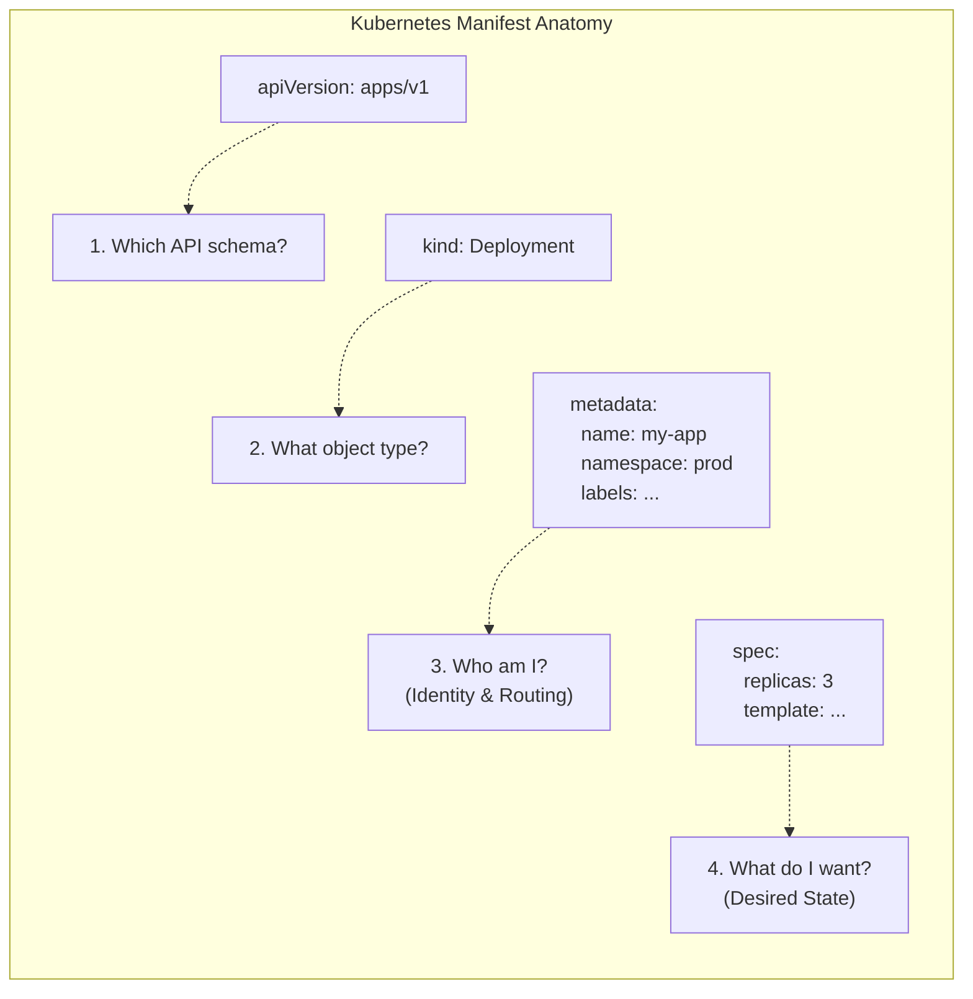

```

# Module 1.8: YAML for Kubernetes

**Complexity:** [MEDIUM]  
**Time to Complete:** 45-60 minutes  
**Prerequisites:** Modules 1.1-1.7 (familiarity with K8s resources)

---

## Learning Outcomes

By the end of this comprehensive module, you will be able to:

1. **Construct** structurally sound Kubernetes manifests using fundamental YAML syntax, including scalars, sequences, mappings, and complex multi-line strings.
2. **Deconstruct** the four mandatory fields of every Kubernetes resource (`apiVersion`, `kind`, `metadata`, `spec`) to evaluate their distinct roles in declarative state management.
3. **Diagnose** structural, schema, and type validation errors in YAML files by interpreting output from `kubectl apply --dry-run` and traversing the cluster's OpenAPI schema using `kubectl explain`.
4. **Design** complex, multi-resource deployment configurations utilizing advanced YAML patterns like document separators, environment variable injections, and persistent volume mounts.
5. **Compare** client-side and server-side validation strategies to implement safe, reliable continuous deployment pipelines for Kubernetes applications.

---

## Why This Module Matters

In 2021, a highly publicized production incident struck a rapidly growing fintech platform during a period of peak transaction volume. While attempting to scale their backend processing services to handle a massive influx of user traffic, a platform engineer deployed an updated Kubernetes manifest. The deployment was intended to increase pod replicas and adjust resource limits safely. However, a single, misplaced space in the YAML file shifted a critical container argument from a sequence item into a nested dictionary key. The Kubernetes API server accepted the technically valid YAML, but the container runtime failed to parse the execution arguments, causing the transaction pods to fall into a continuous CrashLoopBackOff state. This tiny syntactical error resulted in a 45-minute outage during a critical trading window, costing the company an estimated $2.5 million in lost revenue and causing significant reputational damage.

**War Story: The Folded Certificate Catastrophe**
In another infamous incident at a major European banking institution in 2019, an infrastructure engineer updated a TLS certificate stored as a Secret in their production Kubernetes cluster. Instead of using the literal block scalar (`|`) to precisely preserve the certificate's strict newlines, they accidentally used the folded block scalar (`>`). When Kubernetes mounted this Secret into the Ingress controller, the entire certificate was parsed as a single, massive string separated by spaces instead of the required newlines. The Ingress controller, completely unable to parse the malformed PEM data, crashed repeatedly. Because this was the primary ingress for the entire banking API, it caused a two-hour total global outage, preventing millions of users from accessing their funds. A single character difference (`>` vs `|`) completely bypassed basic YAML syntax checks because the YAML itself was structurally valid—it just silently corrupted the application data.

YAML (YAML Ain't Markup Language) is the undisputed lingua franca of Kubernetes. It is the exclusive language you use to communicate your precise desired state to the control plane. While the Kubernetes API server can technically consume JSON payloads, YAML is the human-readable standard embraced by the entire cloud-native ecosystem. However, its heavy reliance on significant whitespace and subtle syntactical rules makes it a dangerous minefield for the uninitiated. Mastering YAML is not just about learning a configuration language; it is about learning how to safely, precisely, and predictably interface with the Kubernetes API. This module will transform YAML from a source of endless frustration into a powerful, predictable tool for declarative infrastructure management.

---

## 1. YAML Fundamentals for Infrastructure

Before diving into the complex, nested schemas specific to Kubernetes, you must first master the core data structures of the YAML specification. YAML is a data serialization language explicitly designed to be directly readable by humans while mapping effortlessly to native data structures in modern programming languages (such as dictionaries, lists, and strings). It removes the visual clutter of brackets and braces found in JSON, replacing them with strict indentation rules.

### Scalars, Mappings, and Sequences

At its absolute lowest level, every YAML file is constructed from exactly three primitive data structures. By combining and nesting these structures, you can represent incredibly complex architectural states.

1. **Scalars:** These are single, irreducible values. They represent strings of text, integers, floating-point numbers, or booleans. They are the leaves of the data tree, holding the actual configuration values.
2. **Mappings (Dictionaries/Hashes):** These are collections of key-value pairs. They define the properties and attributes of an object. In Kubernetes, you will use mappings constantly to define metadata, labels, and specifications.
3. **Sequences (Lists/Arrays):** These are ordered collections of items. You use sequences whenever a configuration field expects multiple values, such as a list of containers inside a pod, or a list of ports exposed by a service.

These foundational structures can be infinitely nested to represent the complex systems required by modern microservices architectures:

```yaml
# This is a Mapping at the root level
server: nginx
port: 8080
is_active: true # Boolean scalar

# This is a Sequence (List) of scalars
allowed_origins:
  - https://example.com
  - https://api.example.com

# This is a Mapping containing a Sequence of Mappings
users:
  - name: alice
    role: admin
    permissions:
      - read
      - write
  - name: bob
    role: editor
    permissions:
      - read
```

**Crucial Rule:** YAML relies entirely on spaces for indentation to denote hierarchy and structure. **Tabs are strictly, unequivocally forbidden.** A standard and unbreakable convention in the Kubernetes ecosystem is to use exactly **two spaces** per indentation level. A single misaligned space will fundamentally change the entire data structure, often leading to schema validation failures or, worse, unexpected runtime behavior.

> **Pause and predict**: 
> Look at the `users` block above. How many items are in the `users` sequence? What type of data does the `permissions` key hold?
> <details>
> <summary>Reveal Answer</summary>
> The `users` sequence has 2 items (mappings for alice and bob). The `permissions` key holds a Sequence (list) of string scalars.
> </details>

### Multi-Line Strings: The `|` and `>` Operators

When passing complex configuration files, bash scripts, or cryptographic certificates into Kubernetes ConfigMaps or Secrets, you will frequently need to embed multi-line strings directly into your YAML manifests. YAML provides two distinct block scalar indicators for managing multi-line text:

*   **Literal Block Scalar (`|`):** This operator preserves all newlines and exact formatting precisely as written. This is what you must use 99% of the time for embedded scripts, configuration files (like `nginx.conf`), or TLS certificates.
*   **Folded Block Scalar (`>`):** This operator folds consecutive newlines into spaces, creating a single long string, unless it encounters a completely blank line. This is primarily useful for writing long, readable descriptions that should be treated as a single continuous paragraph by the application.

```yaml
# Literal (|) - Preserves structure perfectly for a script
setup_script: |
  #!/bin/bash
  echo "Starting setup..."
  apt-get update
  apt-get install -y curl

# Folded (>) - Good for long descriptions that should be a single paragraph
description: >
  This is a very long description that I want to type
  across multiple lines in my editor for readability,
  but I want the application to see it as a single,
  continuous string of text.
```

Understanding the distinct behavior of these two operators is critical for preventing the kind of catastrophic data corruption detailed in the war story at the beginning of this module.

> **Stop and think**: 
> If you are embedding a `.pem` certificate key into a Kubernetes Secret, which multi-line operator MUST you use and why?
> <details>
> <summary>Reveal Answer</summary>
> You MUST use the literal block scalar (`|`). Certificates rely on strict newline boundaries (e.g., `-----BEGIN CERTIFICATE-----` followed by a newline). If you use `>`, it will fold the certificate into one invalid line.
> </details>

### Advanced YAML: Anchors (`&`) and Aliases (`*`)

While less common in standard, vanilla Kubernetes manifests due to the heavy industry preference for external templating tools like Helm or Kustomize, native YAML explicitly supports DRY (Don't Repeat Yourself) principles through the use of anchors and aliases. 

An anchor (denoted by `&`) defines a reusable chunk of YAML, assigning it a name. An alias (denoted by `*`) injects that exact chunk of YAML elsewhere in the document. When combined with the merge key (`<<`), you can powerfully compose and inherit configurations without duplicating lines of code.

```yaml
# Define an anchor named 'common_labels'
base_labels: &common_labels
  app: web-tier
  environment: production
  managed-by: platform-team

frontend_pod:
  metadata:
    # Use the merge key (<<) to inject the alias
    <<: *common_labels
    name: react-frontend

backend_pod:
  metadata:
    <<: *common_labels
    name: node-api
```

When the YAML parser processes this document, it resolves the alias and expands the data structure. The resulting output, if converted to JSON, demonstrates how the inherited labels are merged alongside the unique `name` field:

```json
> {
>   "app": "web-tier",
>   "environment": "production",
>   "managed-by": "platform-team",
>   "name": "react-frontend"
> }
> ```

> **Pause and predict**: 
> Look at the `frontend_pod` structure above. If you were to convert that YAML into JSON, what would the resulting JSON object look like for `frontend_pod.metadata`?
> <details>
> <summary>Reveal Answer</summary>
> 
> ```json
> {
>   "app": "web-tier",
>   "environment": "production",
>   "managed-by": "platform-team",
>   "name": "react-frontend"
> }
> ```
> The merge key expands the dictionary inline.
> </details>

---

## 2. The Anatomy of a Kubernetes Manifest

Every single resource you create, modify, or delete in Kubernetes—from a simple stateless Pod to a massively complex CustomResourceDefinition (CRD) managing a database cluster—requires exactly four root-level fields. If any one of these four fields is missing or malformed, the Kubernetes API server will reject the payload immediately before any deeper validation occurs. Understanding these four foundational pillars is the master key to declarative state management.



Let us deconstruct each of these four mandatory fields to thoroughly understand their role in the Kubernetes reconciliation loop:

### 1. `apiVersion`
This field explicitly tells the Kubernetes API server which exact version of the schema it must use to validate the payload. The Kubernetes APIs are constantly evolving. A new resource type might be introduced in `v1alpha1`, graduate after testing to `v1beta1`, and finally stabilize as `v1`. The `apiVersion` dictates exactly what fields are allowed in the rest of the manifest. API Group names are also included here (for example, `apps/v1` for Deployments, or `networking.k8s.io/v1` for Ingresses). If there is no slash present, the resource belongs to the legacy "core" group (e.g., just `v1` for Pods, Services, and ConfigMaps).

*Worked Example:* If you attempt to create a `Deployment` object but specify `apiVersion: v1`, the API server will reject it outright because Deployments are strictly governed by the `apps/v1` schema, not the core API group. Always verify your API versions, especially when upgrading to newer Kubernetes versions like v1.35.

### 2. `kind`
This field declares the specific type of object you are attempting to create (e.g., `Pod`, `Service`, `Deployment`, `StatefulSet`, `Ingress`, `Job`). It is always formatted in PascalCase (capitalized camel case). The `kind` tells the API server which specific controller should take ownership of this resource.

### 3. `metadata`
This field contains the critical data that uniquely identifies the object and allows the cluster to organize, track, and route traffic to it.
*   **`name`**: This must be completely unique within the namespace for that specific `kind` of object. You cannot have two Deployments named `web-app` in the same namespace.
*   **`namespace`**: The virtual cluster partition the object belongs to. It defaults to `default` if omitted. If you forget to specify this in your manifest, you might accidentally deploy production workloads into a testing environment!
*   **`labels`**: These are arbitrary key-value pairs used for organizing and selecting subsets of objects (e.g., `tier: frontend`, `env: production`). Labels are functional and absolutely critical for routing traffic. Services use label selectors to find the pods they should route traffic to.
*   **`annotations`**: These are non-identifying metadata key-value pairs used by external tools, operators, or controllers (e.g., `build-commit: 4a2b9c`, `nginx.ingress.kubernetes.io/rewrite-target: /`). They are descriptive and usually do not directly affect standard Kubernetes internal routing, but are essential for toolchains.

### 4. `spec` (Specification)
This is the true heart of the manifest. The `spec` declares your **desired state**. Every different `kind` of object has a drastically different, highly specific `spec` schema. A Pod's `spec` defines the exact container images, resource limits, and volumes. A Service's `spec` defines the exposed network ports and the label selectors used to discover pods. The entire Kubernetes control plane is essentially a collection of infinite loops that continuously read your `spec` and work tirelessly to make the actual physical state of the cluster match the desired state you declared here.

*(Note: A few specific data-centric objects, such as `ConfigMap` and `Secret`, use a `data` or `stringData` field instead of a `spec`, but the underlying declarative principle remains exactly the same).*

> **Pause and predict**: 
> You are creating a `ConfigMap`. Which of the 4 standard root fields will be replaced, and what is its name?
> <details>
> <summary>Reveal Answer</summary>
> The `spec` field is replaced by `data` (or `binaryData`). ConfigMaps and Secrets don't have a "specification" of desired state; they just hold raw data.
> </details>

---

## 3. Exploring the Schema (Mastering `kubectl explain`)

You cannot, and should not try to, memorize the entire Kubernetes API schema. There are thousands of nested fields, and the introduction of Custom Resource Definitions (CRDs) adds thousands more unique fields to every modern cluster. When you need to know exactly how to configure a readiness probe, mount a persistent volume claim, or set pod anti-affinity rules, you do not need to search the web or rely on outdated blog posts. You have the official, exact, version-matched documentation built directly into your terminal via the `kubectl explain` command.

`kubectl explain` directly queries the OpenAPI schema hosted by your specific cluster's API server. This means it is always 100% accurate for your exact cluster version.

### Traversing the Data Structure

Want to know exactly what fields are available at the top level of a Pod's `spec` block?

```bash
# General syntax: kubectl explain <kind>.<field>.<field>
kubectl explain pod.spec
```

The output of this command provides a high-level description of the `spec` block and lists all available fields immediately within it, strictly defining their expected data types (such as `<string>`, `<[]Object>`, `<map[string]string>`).
*   `<string>`: Indicates the parser expects a simple scalar string (e.g., `restartPolicy: Always`).
*   `<[]Object>`: The `[]` explicitly means it expects a Sequence (list). In YAML, this means you must use hyphens to denote items (e.g., `containers:`).
*   `<map[string]string>`: Indicates it expects a Mapping (dictionary) of strings to strings. You must provide key-value pairs (e.g., `nodeSelector:`).

### Drilling Deeply into the API

You can chain fields together with dots to traverse deeply into the schema hierarchy. Let's find out how to configure the specifics of a liveness probe for a container.

```bash
kubectl explain pod.spec.containers.livenessProbe
```

**Output snippet:**
```text
KIND:       Pod
VERSION:    v1

RESOURCE:   livenessProbe <Probe>

DESCRIPTION:
     Periodic probe of container liveness. Container will be restarted if the
     probe fails. Cannot be updated...

FIELDS:
   exec <ExecAction>
     Exec specifies the action to take.

   httpGet      <HTTPGetAction>
     HTTPGet specifies the http request to perform.
...
```

You can continue drilling down even further to see the exact parameters required for an HTTP-based liveness probe:

```bash
kubectl explain pod.spec.containers.livenessProbe.httpGet
```

### The `--recursive` Flag

If you want to quickly see the entire structural skeleton of a complex object all at once without the verbose descriptions, use the `--recursive` flag. This is incredibly useful for visually grasping the nested hierarchy of deeply complex objects like Deployments or StatefulSets before you begin writing YAML.

```bash
kubectl explain deployment --recursive
```

```bash
> kubectl explain pod.spec.nodeSelector
> ```

> **Stop and think**: 
> Use your terminal (or imagine using it). You need to add a "node selector" to ensure a Pod only runs on nodes with SSDs. What exact `kubectl explain` command would you run to find the documentation for the node selector field inside a Pod?
> <details>
> <summary>Reveal Answer</summary>
> 
> ```bash
> kubectl explain pod.spec.nodeSelector
> ```
> This will show you that `nodeSelector` expects a `<map[string]string>`, meaning you provide key-value pairs representing node labels.
> </details>

By mastering `kubectl explain`, you achieve true independence as a Kubernetes engineer. You can author manifests in completely air-gapped environments without internet access, confidently relying on the cluster's own OpenAPI specifications as your ultimate source of truth.

---

## 4. Common YAML Patterns in Kubernetes

Let us meticulously examine how the fundamental YAML structures we learned earlier directly map to everyday Kubernetes configurations. Misunderstanding these specific structures is the number one cause of broken deployments and frustrating schema validation errors.

### Environment Variables (Sequences of Mappings)

Defining environment variables for a container is a classic area where beginners stumble. In the Kubernetes schema, the `env` field expects a Sequence (list) of Mappings (dictionaries). Each dictionary item in this list must have at least a `name` key and a `value` key. Furthermore, you can dynamically inject values from existing ConfigMaps or Secrets using the `valueFrom` structure.

```yaml
apiVersion: v1
kind: Pod
metadata:
  name: env-demo
spec:
  containers:
  - name: my-app
    image: nginx:alpine
    env:                   # The 'env' field takes a Sequence (List)
      - name: DATABASE_URL # First item in the list, direct value
        value: "postgres://db:5432"
      - name: LOG_LEVEL    # Second item in the list
        value: "debug"
      - name: API_KEY      # Third item, value injected from a Secret
        valueFrom:
          secretKeyRef:
            name: app-secrets
            key: api-key
```

Notice how every item under `env:` begins with a hyphen. If you omit the hyphen, you are creating a single mapping instead of a sequence, and the API server will immediately reject your manifest with a type mismatch error.

### Volume Mounts (Connecting the Pieces)

Attaching storage to a pod involves a strict two-step process in YAML, requiring precision. First, you must explicitly define the volume at the Pod level within the `spec.volumes` sequence. Second, you must mount that volume into specific individual containers within the `spec.containers[].volumeMounts` sequence. Both are sequences, and the `name` identifiers must match perfectly.

```yaml
apiVersion: v1
kind: Pod
metadata:
  name: volume-demo
spec:
  containers:
  - name: app-container
    image: busybox
    command: ["sleep", "3600"]
    volumeMounts:          # Where does the container see the volume?
    - name: config-store   # Must match the volume name below exactly!
      mountPath: /etc/config
      readOnly: true
  volumes:                 # What is the actual volume backing this?
  - name: config-store     # The identifier
    configMap:             # The volume type (populates files from a ConfigMap)
      name: my-app-config
```

If the `name: config-store` in the `volumeMounts` section does not perfectly match the `name: config-store` in the `volumes` section, the pod will fail to start, throwing a `MountVolume.SetUp failed` event in the cluster logs.

### Labels and Selectors (Mappings)

Labels are simple key-value mappings used for identification. Selectors are used by higher-level resources, like Services and Deployments, to dynamically find other resources based on those exact labels. For advanced matching, Deployments utilize `matchLabels` or highly expressive `matchExpressions`.

```yaml
# A Service looking for specific pods
apiVersion: v1
kind: Service
metadata:
  name: frontend-svc
spec:
  selector:              # The Service will route traffic to any Pod...
    app: frontend        # ...that has this exact label
    tier: web            # ...AND this exact label.
  ports:
  - port: 80
```

The Service defined above will automatically load-balance network traffic to any pod in the namespace that possesses BOTH the `app: frontend` label AND the `tier: web` label. If a pod only has one of those labels, it will be completely ignored by the Service. This decoupled label-selector mechanism is the architectural foundation of Kubernetes' dynamic routing capabilities.

---

## 5. Multi-Resource Files and CI/CD

In modern production environments, an application is rarely deployed as a single resource. A functional microservice typically requires a Deployment for compute, a Service for internal networking, a ConfigMap for environment variables, and an Ingress for external access. 

Instead of painstakingly managing a dozen separate, fragile YAML files, you can elegantly combine multiple distinct Kubernetes resources into a single unified YAML file. You achieve this by utilizing the YAML document separator: `---` (three consecutive hyphens on a completely blank line).

```yaml
apiVersion: v1
kind: ConfigMap
metadata:
  name: app-config
data:
  color: "blue"
---
apiVersion: apps/v1
kind: Deployment
metadata:
  name: my-app
spec:
  replicas: 2
  # ... deployment details ...
---
apiVersion: v1
kind: Service
metadata:
  name: my-app-svc
spec:
  # ... service details ...
```

When you execute `kubectl apply -f combined.yaml`, the Kubernetes API server reads the stream, splits it at every `---` separator, and processes all documents sequentially in a single transaction. This is a critical pattern for Continuous Integration and Continuous Deployment (CI/CD) pipelines, ensuring that all interdependent components of an application are deployed together.

> **Stop and think**: 
> Does the order of documents separated by `---` matter when you run `kubectl apply -f combined.yaml`?
> <details>
> <summary>Reveal Answer</summary>
> Technically, `kubectl apply` processes them in the order they appear. However, because Kubernetes reconciles state continuously, if a Deployment is created before the ConfigMap it depends on, the Pods will simply fail to start and crash-loop until the ConfigMap is created moments later. It eventually resolves itself, but it is best practice to put dependencies (ConfigMaps, Secrets, PVCs) at the top of the file!
> </details>

It is crucial to understand that while `kubectl` sends the resources to the API server in the order they appear, the control plane is asynchronous. If your Deployment pods start faster than the ConfigMap is created, they may crash initially. However, the Kubernetes reconciliation loop will continuously retry until the ConfigMap exists, eventually bringing the system into the desired state. Regardless, best practice dictates placing dependencies (Namespaces, ConfigMaps, Secrets) at the absolute top of the multi-document file.

---

## 6. Validating YAML and Real Debugging

Writing basic YAML is relatively easy; debugging complex, 1000-line Kubernetes manifests is notoriously difficult. The Kubernetes API server is incredibly strict. You must rigorously validate your files before attempting to apply them to a live cluster, especially in production environments.

### Client-Side Validation

The absolute fastest way to check your fundamental YAML syntax and structural schema correctness without impacting the remote cluster state is to utilize the client-side dry run feature. This executes locally on your machine, leveraging the `kubectl` binary's built-in schema definitions.

```bash
kubectl apply -f my-pod.yaml --dry-run=client
```

If successful, the terminal will cleanly output `pod/my-pod created (dry run)`. If it fails due to a structural error, `kubectl` will usually point you to the exact line number containing the indentation fault.

### Server-Side Validation

Client-side validation is fast, but it is dangerously incomplete. It has no knowledge of the actual cluster state. It does not know if a specific Custom Resource Definition (CRD) actually exists on the remote cluster, if the target namespace is missing, or if a dynamic admission webhook (like an OPA Gatekeeper security policy) will ultimately reject your mutation. 

Server-side dry-run solves this by sending the entire payload across the network to the API server for exhaustive, complete validation, running through all admission controllers, but stopping just short of actually persisting the new object into the etcd database.

```bash
kubectl apply -f my-pod.yaml --dry-run=server
```

Server-side validation is the gold standard for CI/CD pipelines. If a manifest passes a server-side dry run, you can be highly confident it will deploy successfully.

### The `kubectl diff` Command

Before applying changes to a live, existing resource, you must ALWAYS use the `kubectl diff` command. This powerful tool shows you exactly what fields will change in the live cluster, outputting a standard patch format (using `+` for additions and `-` for deletions). This simple step prevents accidental, catastrophic destructive updates, such as modifying a critical label selector that might suddenly orphan thousands of production pods.

```bash
kubectl diff -f my-updated-deployment.yaml
```

### Decoding Error Messages

When validation inevitably fails, Kubernetes error messages can initially seem cryptic and overwhelming. Let us methodically decode the most common errors encountered by engineers:

**Error 1: The Indentation Trap**
```text
error: error parsing deployment.yaml: error converting YAML to JSON: yaml: line 15: mapping values are not allowed in this context
```
*   **Diagnosis:** This message almost universally means you have an indentation error. Specifically, you likely missed a required hyphen for a list item, or you have incorrect spacing around a colon. The YAML parser hit a structural wall. Check line 15 and the lines immediately preceding it.

**Error 2: The Type Mismatch**
```text
The Deployment "my-app" is invalid: spec.replicas: Invalid value: "3": spec.replicas must be an integer
```
*   **Diagnosis:** You provided a quoted string `"3"` where the strict schema demanded an integer `3`. In YAML, quotes definitively force a string data type. You must remove the quotes to satisfy the schema requirement.

**Error 3: The Missing Schema**
```text
error: unable to recognize "pod.yaml": no matches for kind "Pod" in version "apps/v1"
```
*   **Diagnosis:** You declared the wrong `apiVersion` for the specified `kind`. Pods intrinsically belong to the core `v1` API group, not `apps/v1` (which is strictly reserved for higher-level controllers like Deployments and StatefulSets).

**Error 4: The Duplicate Key**
```text
error: error parsing config.yaml: error converting YAML to JSON: yaml: unmarshal errors:
  line 12: mapping key "port" already defined at line 10
```
*   **Diagnosis:** Mappings (dictionaries) require strictly unique keys at the same indentation level. You cannot define `port: 80` and then subsequently define `port: 443` in the exact same mapping block. The parser will reject it outright to prevent silent overwrites.

**Error 5: Unknown Field Validation**
```text
error: error validating "deployment.yaml": error validating data: ValidationError(Deployment.spec.template.spec): unknown field "image" in io.k8s.api.core.v1.PodSpec;
```
*   **Diagnosis:** This is a classic schema structure mismatch. You likely placed the `image` field directly under `spec`, but the OpenAPI schema dictates that `image` must belong deeply nested inside the `containers` list (`spec.containers[0].image`). Use `kubectl explain` to verify the path.

---

## Did You Know?

*   **YAML Versioning Nuances:** Kubernetes primarily utilizes YAML version 1.2 specifications, though many older client parsers relied on 1.1. In YAML 1.1, the unquoted string `NO` evaluates to a boolean `False`. This actually caused massive, widespread issues for users in Norway (country code `NO`), requiring them to strictly quote country codes in their Kubernetes manifests.
*   **The Etcd Size Limit:** The absolute maximum size of a single object you can store in etcd (and thus submit via a YAML manifest) is exactly **1.5 Megabytes**. If your ConfigMap payload exceeds this hard limit, you must rethink your architecture and utilize external volume storage.
*   **The JSON Equivalence Reality:** Because the YAML specification is officially designed as a strict superset of JSON, any properly formatted JSON document is automatically a perfectly valid YAML document. You can confidently execute `kubectl apply -f manifest.json` and the API server will process it natively.
*   **The Y2K of YAML 1.1:** The unquoted string `22:22` in YAML 1.1 actually resolves to an integer representing base-60 format (like a sexagesimal clock), evaluating to `1342`. In YAML 1.2, it is safely evaluated as a string. To avoid unexpected runtime surprises, always strictly quote your timestamps and version numbers!

---

## Common Mistakes

| Mistake | Why It Happens | How to Fix It |
| :--- | :--- | :--- |
| **Using Tabs for Indentation** | Copy-pasting from web browsers or using misconfigured editors. YAML parsers will violently reject tabs. | Configure your IDE to convert tabs to spaces. Use exactly 2 spaces per indentation level. |
| **Wrong `apiVersion`** | Guessing the API group instead of checking. Deployments are `apps/v1`, Ingress might be `networking.k8s.io/v1`. | Always verify with `kubectl api-resources \| grep <Kind>` to see the correct API group. |
| **Hyphen vs No Hyphen** | Confusing sequences (lists) with mappings (dictionaries). For example, `containers:` requires a list `- name:`, but `metadata:` does not. | Read the schema. If `kubectl explain` says `<[]Object>`, use a hyphen. If it says `<Object>`, don't. |
| **String/Integer Confusion** | Port numbers in Services must be integers. Annotations must strictly be strings. `port: "80"` (string) will fail if an integer is expected. | Remove quotes for integers (`80`). Force strings with quotes if YAML might misinterpret them (`"true"` vs `true`). |
| **Forgetting `---` separator** | Putting multiple resources in one file without the document separator causes parsing to halt or overwrite data. | Always insert `---` on a blank line between distinct Kubernetes objects in a single file. |
| **Mismatched Selectors** | A Service `selector` doesn't exactly match the Deployment Pod `labels`. | Triple-check that the key and value in the Service selector are identical to the labels applied in the Pod template. |

---

## Quiz

<details>
<summary>1. Scenario: A colleague asks you to review a Pull Request where a Kubernetes Secret containing a private TLS certificate is failing to parse correctly in the Ingress controller. You notice the certificate data is defined using the `>` YAML operator. Why is this causing the Ingress controller to fail, and how do you fix it?</summary>

**Answer:** The folded block scalar (`>`) collapses newlines into spaces, which destroys the strict formatting required by PEM-encoded TLS certificates. Certificates rely on precise newline boundaries to separate different sections, such as isolating the header `-----BEGIN CERTIFICATE-----` from the base64-encoded payload. By converting the multi-line certificate into a single continuous string, the Ingress controller receives an invalid certificate structure and crashes upon parsing it. To fix this configuration, you must use the literal block scalar (`|`). This instructs the YAML parser to preserve all original newlines exactly as they appear in the source file, maintaining the required certificate format.
</details>

<details>
<summary>2. Scenario: During a critical production incident, a junior engineer attempts to apply a hotfix via `kubectl apply -f hotfix.yaml` but receives the error `error converting YAML to JSON: yaml: line 22: did not find expected key`. They are confused because line 22 simply contains `image: nginx:alpine`. What is structurally wrong with the manifest around this line?</summary>

**Answer:** This error occurs because the YAML parser is attempting to process a dictionary (mapping) but encountered data that breaks the expected `key: value` indentation structure. In Kubernetes manifests, strict spacing dictates the data hierarchy and relationship between fields. The most common cause for this specific error is a missing hyphen in a sequence (like under the `containers:` list) or an extra space before the key, which shifts the indentation level and confuses the parser. To resolve the issue, the engineer must ensure exactly two spaces are used per level and verify that sequence items properly start with hyphens to denote a list element. Using a linter or IDE with YAML support can easily catch these structural indentation faults before deployment.
</details>

<details>
<summary>3. Scenario: You are working in a secure, air-gapped environment with no internet access. You need to attach a PersistentVolumeClaim to a Pod but cannot remember if the field `readOnly` belongs inside the Pod's `volumes` block or the `volumeMounts` block. How can you definitively determine the correct placement without leaving your terminal?</summary>

**Answer:** You can determine the correct placement by utilizing the `kubectl explain` command to query the cluster's OpenAPI schema directly. By running `kubectl explain pod.spec.volumes.persistentVolumeClaim` and `kubectl explain pod.spec.containers.volumeMounts`, you can traverse the nested structure of the Pod object to see the valid keys for each section. This offline tool provides authoritative documentation, including expected data types and descriptions for every field, straight from the cluster's API server. It completely removes the need for web-based documentation and allows you to confidently structure your manifest. You can even use the `--recursive` flag to see the entire resource skeleton if you need broader context.
</details>

<details>
<summary>4. Scenario: You submit a newly authored Custom Resource to the API server, but it is immediately rejected before any schema validation even occurs. The error simply states it cannot parse the object. You verify your syntax is perfectly valid YAML and all indentation is correct. What fundamental structural requirement of the Kubernetes declarative model have you likely violated?</summary>

**Answer:** You have likely omitted one of the four mandatory root-level fields required by the Kubernetes API: `apiVersion`, `kind`, `metadata`, or `spec` (or `data`). The API server relies on `apiVersion` and `kind` to route the payload to the correct internal handler, while `metadata` provides essential routing and identification information like the unique name. Without this foundational structure, the control plane cannot even begin to evaluate your desired state or apply validation rules. Even for Custom Resources, this strict contract must be upheld for the server to accept the payload. If any of these fields are missing, the parser immediately rejects the manifest as fundamentally malformed.
</details>

<details>
<summary>5. Scenario: Your team has generated a massive 500-line YAML file containing a complex StatefulSet and associated services. You run `kubectl apply -f app.yaml --dry-run=client` and it reports no errors. However, when you remove the dry-run flag, the API server rejects the manifest due to a Custom Resource Definition mismatch. Why did the client-side dry run fail to catch this, and how should you validate it in the future?</summary>

**Answer:** The client-side dry run failed to catch the error because it only verifies basic YAML syntax and local schema correctness without communicating with the server's admission controllers or checking the cluster's actual state. It is entirely unaware of cluster-specific constraints, missing namespaces, or Custom Resource Definitions that reside on the control plane. To safely and accurately validate complex manifests against the actual cluster configuration without creating the objects, you must use `--dry-run=server`. This sends the entire payload to the API server for comprehensive validation without persisting the data to etcd. Utilizing server-side dry runs is a critical best practice for preventing deployment failures caused by cluster-state mismatches.
</details>

<details>
<summary>6. Scenario: A legacy deployment script automatically generates Kubernetes configuration payloads in strict JSON format. A new engineer insists that the pipeline must be rewritten to convert these files into YAML because "Kubernetes only uses YAML". Why is the engineer incorrect, and how does the API server handle the legacy JSON files?</summary>

**Answer:** The engineer is incorrect because the YAML specification is officially designed as a strict superset of JSON. This means any properly formatted JSON document is inherently a valid YAML document without any modifications. When `kubectl apply -f payload.json` is executed, the underlying parser natively understands and processes the JSON data structure without requiring any conversion utility. The Kubernetes API server itself natively consumes both formats, making it perfectly acceptable and efficient to submit JSON directly in automated pipelines. There is no technical benefit to rewriting the pipeline merely to change the serialization format.
</details>

---

## Hands-On Exercise

In this comprehensive exercise, you will build a complex multi-resource application from scratch. You will deliberately introduce specific errors, and then utilize the debugging techniques discussed in this module to methodically diagnose and fix them. 

**Prerequisites:** Ensure you have access to a running Kubernetes cluster (such as minikube, kind, or a cloud provider) and have your `kubectl` CLI configured properly.

### Task 1: The Broken Foundation
Create a local file named `dojo-app.yaml`. Paste the following intentionally broken YAML payload into it. Attempt to apply it to your cluster using `kubectl apply -f dojo-app.yaml --dry-run=client`.

```yaml
apiVersion: v1
kind: Deployment
metadata:
  name: web-app
spec:
  replicas: "2"
  selector:
    matchLabels:
      app: web
  template:
    metadata:
      labels:
        app: web
    spec:
      containers:
      name: nginx
      image: nginx:1.27
```

<details>
<summary>Solution & Diagnosis 1</summary>

You should see an error similar to: `no matches for kind "Deployment" in version "v1"`.
**Fix:** Change `apiVersion: v1` to `apiVersion: apps/v1`. Deployments do not live in the core API group.
</details>

### Task 2: The Type and Structure Failures
Apply the file again using the client dry-run. You will hit several more errors. Fix them one by one, carefully reading the error messages. Use `kubectl explain deployment.spec` if you get stuck on the expected structure.

```yaml
      containers:
      name: nginx
    ```

```yaml
      containers:
      - name: nginx
        image: nginx:1.27
    ```

<details>
<summary>Solution & Diagnosis 2</summary>

1.  **Error:** `Invalid value: "2": spec.replicas must be an integer`.
    **Fix:** Change `replicas: "2"` to `replicas: 2` (remove quotes).
2.  **Error:** `error converting YAML to JSON: yaml: line 15: mapping values are not allowed in this context` (or similar depending on parser). Look at the `containers` block.
    **Fix:** `containers` expects a sequence (list) of objects, not a direct mapping. You are missing the hyphen.
    Change:
    ```yaml
      containers:
      name: nginx
    ```
    To:
    ```yaml
      containers:
      - name: nginx
        image: nginx:1.27
    ```
</details>

### Task 3: Adding a Service Safely
Now that the Deployment schema validates successfully, append a Service object to the *bottom* of the same `dojo-app.yaml` file. The Service should expose port 80 and route traffic to your existing Pods. **Ensure you use the correct YAML document separator.**

```yaml
---
apiVersion: v1
kind: Service
metadata:
  name: web-app-svc
spec:
  selector:
    app: web
  ports:
  - port: 80
    targetPort: 80
```

<details>
<summary>Solution 3</summary>

Add `---` at the end of the file, then append the Service definition:

```yaml
---
apiVersion: v1
kind: Service
metadata:
  name: web-app-svc
spec:
  selector:
    app: web
  ports:
  - port: 80
    targetPort: 80
```
</details>

### Task 4: Adding a ConfigMap Dependency
Next, add a third critical resource at the **very top** of the file (before the Deployment): a ConfigMap named `app-config` containing a single key `welcome-message` and the value `"Hello KubeDojo!"`.

```yaml
apiVersion: v1
kind: ConfigMap
metadata:
  name: app-config
data:
  welcome-message: "Hello KubeDojo!"
---
```

<details>
<summary>Solution 4</summary>

Add this to the very top of `dojo-app.yaml` and separate it from the Deployment with `---`.

```yaml
apiVersion: v1
kind: ConfigMap
metadata:
  name: app-config
data:
  welcome-message: "Hello KubeDojo!"
---
```
</details>

### Task 5: Connecting the Pieces
Modify the Deployment from Task 2 so that the `nginx` container dynamically mounts the ConfigMap from Task 4 as an environment variable explicitly named `GREETING`. Then, execute a comprehensive server-side dry run to validate the entire application stack.

```bash
kubectl apply -f dojo-app.yaml --dry-run=server
```

```yaml
apiVersion: v1
kind: ConfigMap
metadata:
  name: app-config
data:
  welcome-message: "Hello KubeDojo!"
---
apiVersion: apps/v1
kind: Deployment
metadata:
  name: web-app
spec:
  replicas: 2
  selector:
    matchLabels:
      app: web
  template:
    metadata:
      labels:
        app: web
    spec:
      containers:
      - name: nginx
        image: nginx:1.27
        env:
        - name: GREETING
          valueFrom:
            configMapKeyRef:
              name: app-config
              key: welcome-message
---
apiVersion: v1
kind: Service
metadata:
  name: web-app-svc
spec:
  selector:
    app: web
  ports:
  - port: 80
    targetPort: 80
```

```text
configmap/app-config created (server dry run)
deployment.apps/web-app created (server dry run)
service/web-app-svc created (server dry run)
```

<details>
<summary>Solution 5</summary>

Your final, valid `dojo-app.yaml` should look exactly like this:

```yaml
apiVersion: v1
kind: ConfigMap
metadata:
  name: app-config
data:
  welcome-message: "Hello KubeDojo!"
---
apiVersion: apps/v1
kind: Deployment
metadata:
  name: web-app
spec:
  replicas: 2
  selector:
    matchLabels:
      app: web
  template:
    metadata:
      labels:
        app: web
    spec:
      containers:
      - name: nginx
        image: nginx:1.27
        env:
        - name: GREETING
          valueFrom:
            configMapKeyRef:
              name: app-config
              key: welcome-message
---
apiVersion: v1
kind: Service
metadata:
  name: web-app-svc
spec:
  selector:
    app: web
  ports:
  - port: 80
    targetPort: 80
```

When you run `kubectl apply -f dojo-app.yaml --dry-run=server`, you should see output confirming all three resources:
```text
configmap/app-config created (server dry run)
deployment.apps/web-app created (server dry run)
service/web-app-svc created (server dry run)
```
If you see this, your complex multi-resource YAML file is structurally sound and schema-compliant. You can remove `--dry-run=server` to actually deploy it!
</details>

---

## Next Module

You have now mastered the complex language of Kubernetes (YAML) and deeply understand how to construct, validate, and debug the declarative resources that run your critical workloads. But *why* is Kubernetes architected this way? Why enforce declarative YAML state definitions instead of simple imperative commands?

Continue your journey in [Philosophy and Design](/prerequisites/philosophy-design/module-1.1-why-kubernetes-won/) to understand the broader architectural picture: the autonomous control loops, the asynchronous reconciliation architecture, and the fundamental reasons why Kubernetes ultimately won the container orchestration war.