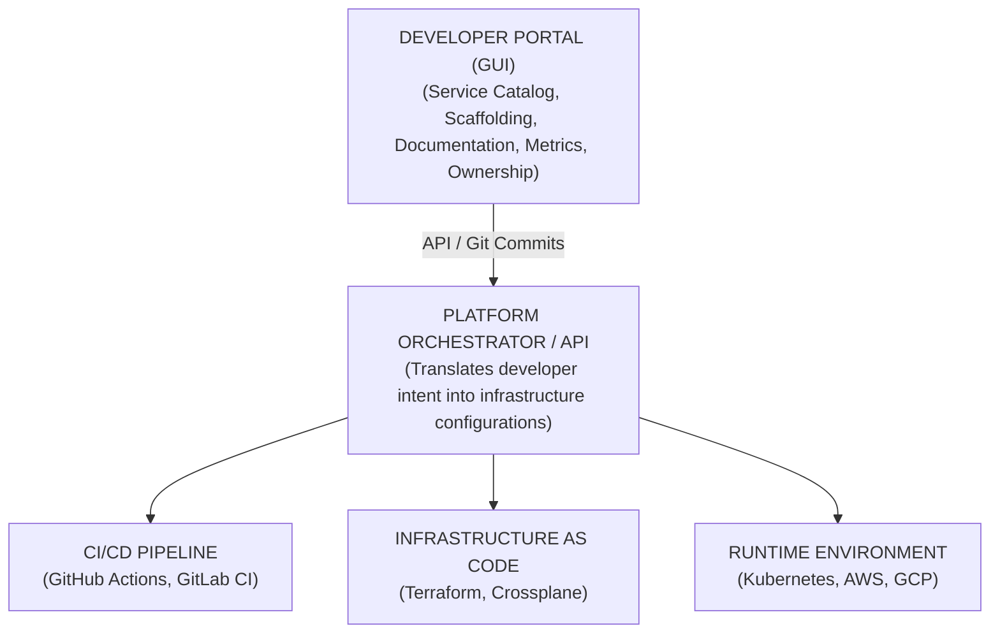

# Module 1.5: Platform Engineering Concepts

**Complexity**: [MEDIUM]
**Time to Complete**: 60-75 minutes
**Prerequisites**: Modules 1.1-1.4 (IaC, GitOps, CI/CD, Observability)

## Learning Outcomes

By the end of this module, you will be able to:

- **Design** an Internal Developer Platform architecture that reduces cognitive load while preserving developer autonomy.
- **Compare** Platform Engineering, Site Reliability Engineering, and DevOps by their customers, artifacts, and operating models.
- **Evaluate** whether an organization is ready for a platform initiative using deployment flow, ownership, and support metrics.
- **Formulate** Golden Paths that encode safe defaults without turning the platform into a cage.
- **Measure** platform adoption and developer satisfaction with product-style feedback loops and engineering metrics.

## Why This Module Matters

At a mid-sized payments company, a critical dependency vulnerability landed on a Tuesday afternoon and the security team asked every service team to patch before the end of the week. The code change was a boring version bump, but the rollout became a five-day coordination failure across 120 engineers and 15 microservice teams. Developers had to edit Dockerfiles, adjust Jenkins stages, update Helm values, wait for database migration help, find the right PagerDuty schedule, and debug Terraform state locks before a single customer-facing fix could reach production.

The company believed it had adopted DevOps because every product team owned its services in production. In practice, "you build it, you run it" had turned into "you build it, you become a part-time infrastructure specialist." The organization had no old operations wall, but it had created a maze of cloud consoles, YAML fragments, dashboards, and tribal knowledge that slowed urgent work. A one-line patch took days because the delivery system demanded expertise that most feature teams did not have time to build or maintain.

Platform Engineering exists for this exact failure mode. It treats internal infrastructure and delivery workflows as a product for developers, not as a loose pile of scripts, tickets, and wiki pages. A good platform does not remove ownership from product teams; it gives them a reliable interface for the common work of creating services, deploying changes, provisioning dependencies, and observing production behavior. This module teaches how to design that interface, when to invest in it, and how to avoid building an expensive internal product before the organization actually needs one.

## The Breaking Point of "You Build It, You Run It"

The original DevOps promise was healthy: developers and operations engineers would stop throwing work over a wall, automation would replace handoffs, and teams would own the full feedback loop from commit to production. That promise works well when the operational surface is small enough for a product team to reason about. It becomes fragile when the deployment path includes containers, Kubernetes, identity boundaries, cloud networking, policy engines, service meshes, vulnerability scanners, GitOps controllers, and several observability systems that all change independently.

Modern cloud-native work asks product developers to hold too many unrelated models in their heads at the same time. A developer building a checkout feature may need to reason about HTTP semantics, database transactions, business rules, Kubernetes resource requests, image build layers, AWS IAM policy conditions, TLS termination, Prometheus labels, and Argo CD sync behavior in the same afternoon. Some engineers enjoy that breadth, but an organization cannot assume that every product developer should become a deep specialist in every infrastructure layer.

The hidden cost is cognitive load, which is the mental effort required to keep enough context active to make a correct decision. When cognitive load rises, developers slow down, copy examples without understanding them, and avoid changing infrastructure even when it is unsafe. The organization sees symptoms that look like laziness or poor discipline, but the root cause is often an interface problem. The delivery system exposes too many knobs for routine work and provides too little guidance about which knobs matter.

Pause and predict: if a new team needs a service, a database, alerts, documentation, and a deployment pipeline, which step in that chain is most likely to require another human in your organization? The answer usually reveals where your platform gap lives. A mature platform does not make every step invisible, but it turns the standard path into a guided workflow with clear ownership, guardrails, and fast feedback.

Three anti-patterns show up repeatedly when organizations push "run it" responsibilities onto teams without providing a platform. The first is rebuilt ticket operations, where developers stop touching infrastructure and file requests with a central cloud team. The second is copy-paste infrastructure, where teams bypass the queue by cloning Terraform or Kubernetes YAML from a neighboring service. The third is the local expert bottleneck, where one engineer becomes the unofficial release engineer for the whole team and burns time debugging pipelines instead of delivering product work.

The platform response is not to centralize every decision again. The better contract is: product teams own the behavior of their services, while the platform team owns the paved interfaces that make routine operational work safe and repeatable. Developers should still understand the basic shape of Kubernetes 1.35+ workloads, resource limits, health checks, and observability signals, but they should not need to handcraft every manifest, policy, and pipeline every time they create a standard service.

This course uses `kubectl` directly in later modules, and the shorthand alias is `alias k=kubectl`; when you see a command such as `k get deployments`, read it as a Kubernetes 1.35+ command using that alias. Platform Engineering does not eliminate the need to learn Kubernetes, but it changes which details are part of everyday work. The platform should make common operations boring while leaving a documented escape hatch for teams that truly need lower-level control.

## What Platform Engineering Is

Platform Engineering is the discipline of designing, building, and operating internal self-service capabilities for software delivery. The phrase sounds infrastructure-heavy, but the center of gravity is product thinking. A platform team studies developer workflows, discovers repeated friction, defines opinionated defaults, automates the high-volume paths, measures adoption, and iterates based on feedback. The customer is the internal developer, and the product is the set of interfaces that let that developer move from idea to reliable production change with less unnecessary effort.

This distinction matters because many teams rename their DevOps or cloud operations group "platform" without changing how work flows. If the team still receives tickets, manually provisions resources, and publishes long wiki pages that developers must interpret, it is not yet operating as a platform product team. A real platform converts repeatable requests into APIs, templates, workflows, and documented service contracts. Developers should be able to express intent, receive useful validation, and get a working result without waiting for a queue.

Treating the platform as a product also changes the platform team's accountability. Product managers for external software do not measure success by how elegant the backend architecture feels to the builders; they measure whether customers use the product and achieve their goals. Platform teams need the same humility. Voluntary adoption, onboarding time, lead time for changes, self-service completion rate, failed provisioning rate, and developer sentiment all matter because they expose whether the platform reduces real friction or merely moves the friction behind a different interface.

An effective platform is opinionated, but it must not be authoritarian. The goal is not to ban every non-standard architecture or force every team into identical code. The goal is to offer a path that is so well supported, observable, secure, and fast that most teams choose it voluntarily for ordinary work. When a team has an unusual need, it can step away from the paved road, but it also accepts more operational responsibility for the choices that the platform does not support.

The useful analogy is city infrastructure. City planners do not decide where every resident goes, but they make common journeys safer with roads, signage, traffic lights, bus routes, and maintenance crews. Residents can still choose a remote trail or private road, but they should not expect the same guarantees there. Platform Engineering creates that civic layer for software teams: reliable routes for the common journeys, clear boundaries for unsupported routes, and feedback loops that tell planners where the next road should be built.

The "Platform as a Product" mindset also prevents a common emotional trap. Infrastructure engineers often build the platform they wish developers wanted, full of elegant abstractions and deep configurability. Product developers usually want fewer decisions, faster feedback, and confidence that the default is compliant. The platform team succeeds when it translates infrastructure sophistication into a simple intent-driven experience, not when it exposes every provider feature through a prettier form.

Before running this thought experiment, write down what a new service requires in your current environment. Include repository setup, CI, deployment, secrets, dashboards, alerts, ownership metadata, and production readiness review. If your list crosses several tools and several teams, the problem is not that developers need more documentation. The problem is that the organization lacks a coherent product boundary around software delivery.

## Golden Paths and the Shape of a Good Abstraction

A Golden Path is a supported, automated, well-tested way to build and operate a common class of software inside an organization. It is sometimes called a paved road or supported highway, but the phrase matters less than the contract. A Golden Path says, "If your service fits this shape, the platform will give you scaffolding, security checks, deployment automation, observability, and operational support with minimal custom work." The path is a deal between product teams and the platform team.

The strongest Golden Paths begin with a narrow workload, not a grand universal framework. A payments company might begin with a transactional HTTP API using Node.js or Java, a managed PostgreSQL database, Redis for caching, GitHub Actions for CI, Argo CD for deployment, and standard OpenTelemetry instrumentation. That scope is not glamorous, but it probably covers a large share of new services. The platform can make that one path excellent before it tries to support batch jobs, streaming pipelines, mobile backends, and machine learning serving.

Good Golden Paths encode decisions that teams repeatedly get wrong under pressure. They choose base images, container users, vulnerability scanning gates, CPU and memory defaults, readiness probes, logging formats, dashboard labels, alert severities, repository layout, CODEOWNERS, and production readiness checks. Developers still write business logic and own service behavior, but the platform removes the recurring infrastructure trivia that creates drift. The tradeoff is that the platform team must maintain those defaults as cloud, Kubernetes, and security expectations evolve.

The abstraction level is the hardest design decision. If the platform exposes raw Kubernetes manifests, it may not reduce cognitive load enough. If it hides every operational detail, developers may be unable to debug production behavior or make informed tradeoffs. The right abstraction reveals intent and consequences. A developer should be able to request a database tier, see the cost and availability implications, understand who will be paged, and inspect the generated lower-level resources when deeper debugging becomes necessary.

Consider the difference between "fill out this form to get a Postgres database" and "the platform grants a durable Postgres dependency to this service in staging with backups, encryption, ownership metadata, and a clear promotion path to production." The second version is a richer product contract. It connects infrastructure to service ownership, lifecycle, cost, compliance, and deployment flow. Platform Engineering is at its best when those concerns are handled together instead of scattered across separate tickets.

Which approach would you choose here and why: a platform that hides Kubernetes completely, or a platform that generates Kubernetes resources but lets developers inspect them? Most organizations should choose the second model for medium-complexity services. Hiding everything feels friendly on day one, but it becomes dangerous during incidents. Inspection preserves learning and debugging while still keeping routine work simple.

Golden Paths must have an escape hatch, but the escape hatch should be explicit. If a team wants an unusual graph database, a niche runtime, or a custom networking model, the platform should not pretend to support it casually. The team can proceed, yet it must own custom Terraform, custom pipelines, runbooks, alert tuning, and incident response for the unsupported parts. That boundary protects the platform team from becoming a help desk for every experiment while preserving the technical freedom needed for real innovation.

The platform also needs a deprecation policy. Golden Paths that never change become outdated, insecure, and expensive. If Kubernetes 1.35+ changes default behavior, if a scanner starts flagging a common base image, or if a cloud provider replaces an older database class, the platform team must update templates and help teams migrate. A Golden Path is a living product surface, not a one-time scaffold that can be abandoned after repository creation.

## Internal Developer Platform Architecture

An Internal Developer Platform, or IDP, is the system that delivers the platform experience. The industry sometimes uses IDP to mean "Internal Developer Portal," which is only the front door. In this module, IDP means the broader platform system: portal, catalog, templates, orchestrator, CI/CD integrations, infrastructure automation, policy checks, and runtime connections. The portal matters, but the deeper value comes from the workflows behind it.

A useful IDP architecture has four layers. The first layer is the developer portal, where teams discover services, launch templates, review scorecards, find documentation, and trigger self-service actions. The second layer is the service catalog, which records ownership, lifecycle, dependencies, compliance context, and operational links. The third layer is scaffolding and templates, which create repositories and delivery pipelines with the organization's defaults already embedded. The fourth layer is orchestration, which translates developer intent into infrastructure changes, GitOps commits, cloud resources, and Kubernetes objects.

Those layers should reinforce each other. A software template should not merely create a repository; it should also register the service in the catalog, attach the owning team, create the initial documentation skeleton, configure deployment workflows, and connect observability defaults. A database provisioning action should not merely run Terraform; it should update catalog metadata, attach the resource to the consuming service, record the environment, and expose runbook links. Integration is what turns a collection of tools into a platform.



The diagram shows why a portal alone is not enough. A beautiful UI that opens a Jira ticket for a human operator has not changed the operating model; it has only dressed the old queue in better colors. The orchestrator is the engine that makes self-service real. It accepts an approved request, performs validation, applies policy, produces infrastructure changes, and records the result. Without that engine, the platform cannot reduce lead time or remove manual bottlenecks.

Backstage is the most recognizable open source portal and catalog framework. Spotify created it internally to manage a large service ecosystem, open sourced it in March 2020, and later donated it to the Cloud Native Computing Foundation. Its power comes from extensibility: catalog metadata, software templates, TechDocs, and plugin integrations can bring GitHub, CI, dashboards, on-call schedules, and security findings into one developer-facing surface. Its cost is that teams effectively operate a React and TypeScript application, not a turnkey appliance.

```yaml
# Example: Backstage catalog-info.yaml
apiVersion: backstage.io/v1alpha1
kind: Component
metadata:
  name: payment-routing-service
  description: Handles all credit card processing, PCI tokenization, and external gateway routing
  tags:
    - java
    - spring-boot
    - pci-compliant
    - tier-1
  links:
    - url: https://admin.paymentgateway.com
      title: Gateway Admin Console
      icon: dashboard
  annotations:
    github.com/project-slug: acme-corp/payment-routing-service
    pagerduty.com/integration-key: "xyz123abc_critical_alerts"
    prometheus.io/rule: "payment-service-high-latency-alerts"
    snyk.io/org-id: "security-org-123-finance"
    backstage.io/techdocs-ref: dir:.
spec:
  type: service
  lifecycle: production
  owner: group:checkout-core-team
  system: payment-system
  dependsOn:
    - component:user-auth-service
    - resource:payment-postgres-db
```

This file is small, but it changes incident response. During a payment outage, an incident commander can identify the owning team, related services, dashboard entry points, documentation location, lifecycle, and dependency map without waking several people to ask where the truth lives. Because the metadata sits beside the application code, the team can update it through the same review process it uses for code. The catalog becomes less stale than a central spreadsheet because maintenance is attached to normal engineering work.

Port represents a different tradeoff: a SaaS developer portal with catalog, scorecards, and self-service actions. It reduces the operational burden of running the portal itself and can be attractive when the platform team is strong in infrastructure automation but light on frontend capacity. The tradeoff is product dependency and customization limits. A SaaS portal can help a team move faster, but the organization still needs a clear platform model, service ownership rules, and automation behind the actions.

Humanitec focuses on orchestration rather than portal experience. Its model lets developers declare workload needs in an abstract specification, while the platform resolves those needs differently per environment. That separation is valuable because development, staging, and production often need different infrastructure implementations even when the developer intent is identical. The service asks for Postgres and Redis; the platform decides whether that means containers, shared clusters, or managed production services.

```yaml
# Example: Humanitec Score Specification (score.yaml)
apiVersion: score.dev/v1b1
metadata:
  name: user-profile-api
containers:
  user-profile:
    image: myregistry.com/user-profile:latest
    variables:
      DB_CONNECTION_STRING: ${resources.db.connection_string}
resources:
  db:
    type: postgres
  cache:
    type: redis
```

The same declaration can be cheap in development and resilient in production. Locally, the orchestrator might map the database to a lightweight container and the cache to an ephemeral Redis instance. In staging, it might use a shared managed cluster with limited capacity. In production, it can provision an isolated Multi-AZ database, configure backups, generate secrets, and attach the service through Kubernetes. The developer expresses the dependency once, while the platform handles environment-specific implementation details.

Kratix takes a Kubernetes-native path by letting platform teams define "Promises" that developers request as custom resources. A Promise can represent a database, message broker, cache, environment, or higher-level capability. This approach fits organizations that already trust GitOps and Kubernetes control loops because the platform interface itself becomes declarative. Developers request a capability, and the platform pipeline produces the resources needed to honor it.

```yaml
# Example: Developer requesting a Kratix Promise
apiVersion: postgres.marketplace.kratix.io/v1alpha1
kind: PostgreSQL
metadata:
  name: user-database
  namespace: checkout-team-namespace
spec:
  size: small
  backup:
    enabled: true
    retention_days: 30
  high_availability: false
  version: "16.2"
  encryption: "kms-managed"
```

The key is not that Kratix uses custom resources; Kubernetes has many custom resources. The key is that the custom resource represents a product-level promise with support expectations, policy, and lifecycle. A checkout developer should not need to understand the storage class, backup tool, cloud IAM role, or Terraform module used behind that request. The platform team owns the implementation path and exposes a small, stable API that matches the way internal customers think about their work.

Backstage, Port, Humanitec, and Kratix are not direct substitutes in every organization. One team may need a catalog first because nobody knows service ownership. Another may need orchestration because infrastructure requests are stuck in tickets. A third may start with templates because new service creation is inconsistent and insecure. Tool selection should follow the sharpest workflow pain, not the loudest conference talk.

## Role Clarity: Platform Engineering, SRE, and DevOps

Platform Engineering overlaps with DevOps and SRE in tools, but the disciplines answer different questions. DevOps asks how teams can build, test, and release software through automated collaboration instead of handoffs. SRE asks how production services remain reliable enough for users while engineering teams continue to change them. Platform Engineering asks how internal developers can use the organization's delivery and infrastructure capabilities without absorbing every detail of those capabilities.

Confusion is expensive because it creates impossible team charters. If leadership asks SREs to own reliability, incident response, developer portal UX, self-service templates, Terraform modules, documentation, and every urgent developer support request, reliability work will lose focus. If a platform team is measured only on uptime, it will naturally prefer strict controls over developer flow. The organization needs boundaries that let these groups collaborate without making one team responsible for every aspect of software delivery.

| Characteristic | Traditional DevOps / Cloud Ops | Site Reliability Engineering (SRE) | Platform Engineering |
| :--- | :--- | :--- | :--- |
| **Primary Core Goal** | Bridge the historical gap between writing code and deploying code. Architect and automate the software delivery pipeline. | Ensure large-scale systems are reliable, available, and performant. Protect users from outages. | Maximize product developer productivity. Reduce cognitive load. Treat infrastructure as a curated product. |
| **Primary Customer** | The delivery pipeline, the codebase, and the business. | The end user and the production service experience. | The internal software developer and the product team workflow. |
| **Core Artifacts & Deliverables** | CI/CD configuration, Terraform modules, configuration management, deployment scripts. | SLOs, SLIs, error budgets, incident runbooks, chaos experiments, observability practices. | Developer portals, service catalogs, Golden Paths, software templates, self-service APIs. |
| **Engagement & Operating Model** | Embedded, project-based, or centralized automation support. Can degrade into ticket operations. | Embedded or consultative reliability practice with authority to slow risky change when error budgets are exhausted. | Product-based platform delivery with user research, adoption metrics, and iterative self-service workflows. |
| **Key Performance Indicators** | Deployment frequency, lead time for changes, build reliability, infrastructure cost efficiency. | Availability, latency, MTTR, incident frequency, error budget burn. | Voluntary adoption, time-to-first-commit, self-service success rate, developer satisfaction. |

The table is not a rigid staffing chart. In a small organization, one person may wear all three hats in the same week. The distinction becomes important as the organization grows because different incentives shape different products. SREs should deeply influence platform defaults around alerts, rollbacks, SLOs, and production readiness. DevOps automation experience should inform delivery pipelines. Platform Engineering should integrate those practices into a developer-facing product that is easy to adopt and hard to misuse.

A practical way to test role clarity is to inspect an incident. If the database cluster is unhealthy and customers are seeing errors, the SRE function should drive reliability response. If developers cannot figure out which team owns the service or where the dashboards live, the platform catalog is failing. If releases are blocked because every deployment requires manual pipeline edits, the DevOps automation layer is weak. Mature organizations can name the failure domain instead of throwing every problem at one "infrastructure" team.

The automotive analogy is still useful when applied carefully. DevOps is the assembly line and drivetrain that make delivery mechanically possible. SRE is the braking, telemetry, and safety system that keeps the journey survivable. Platform Engineering is the steering wheel, dashboard, and navigation system that let the driver operate the machine without understanding every internal component. A good car needs all three, but nobody wants the airbag team to design the dashboard alone.

## When Not to Build a Platform

Platform Engineering is powerful, but it is also expensive. It pulls senior engineers away from customer-facing features and asks them to build an internal product that requires design, documentation, support, upgrades, security maintenance, and roadmap decisions. The cost is justified when repeated delivery friction is slowing many teams. It is wasteful when the organization is small enough that a simpler toolchain and clear documentation can solve the problem.

Premature platforming often starts with a sincere desire to avoid future pain. A Series-A startup reads about Backstage, Golden Paths, and internal platforms at large technology companies, then assigns several senior engineers to build a portal before the product has stabilized. The team produces a technically impressive system, but the company needed customer discovery, product features, and faster iteration more than internal abstraction. The platform solved a coordination problem that had not yet appeared.

The "platform of one" anti-pattern is easy to recognize. If a company has a dozen engineers, one backend service, a small frontend, and a shared chat channel where everyone knows who owns what, a custom IDP is usually a poor investment. A managed PaaS, a simple CI workflow, a clear repository template, and a small set of Terraform modules may be enough. The organization should pay for boring external platforms until the pain of coordination becomes larger than the cost of building an internal one.

Headcount is not the only signal, but it is a useful starting point. Platform return on investment usually becomes plausible once the organization crosses roughly 40-50 software engineers, multiple teams are creating services independently, and tribal knowledge no longer travels through conversation. Below that threshold, there are exceptions, but the burden of proof should be high. A regulated company with complex compliance needs may need stronger internal tooling earlier, while a simple SaaS product may thrive on managed services for much longer.

Deployment flow is another signal. If lead time is growing because teams wait days for database provisioning, DNS changes, IAM policies, or production approvals, self-service automation can recover real engineering capacity. If lead time is already short and failures are rare, a platform team may be optimizing the wrong constraint. Platform Engineering should be a response to measured friction, not a prestige project.

Onboarding time exposes hidden complexity. When a new engineer needs several weeks to make a production change, the organization is likely carrying too much undocumented workflow knowledge. Some of that can be fixed with better docs, pairing, and simplification. If the same confusion repeats across many teams, templates and a portal can turn onboarding from archaeology into a guided path. The platform investment becomes stronger when the same questions appear in every new hire's first month.

The shadow operations tax is the clearest warning sign. If product engineers spend a quarter of their week fighting Helm values, Terraform state, CI edge cases, and dashboard wiring, the organization is paying for platform work without naming it. Worse, the work is distributed unevenly across the engineers who happen to know the tools. A platform team can centralize the product responsibility for that shared workflow while still allowing product teams to own their services.

Incident response chaos is also a platform readiness signal. During a serious outage, the first questions should be about symptoms, blast radius, rollback options, and customer impact. If the first half hour is spent asking who owns the service, where the repository lives, whether a dashboard exists, and which deployment changed last, the service catalog and operational metadata are missing. That is a platform problem even if the runtime infrastructure itself is stable.

## Patterns & Anti-Patterns

The first durable pattern is to start with one narrow, high-volume Golden Path and make it excellent. Choose a workload that many teams actually create, such as a transactional API with a standard database and standard deployment target. The platform team can then invest in strong defaults, documentation, observability, and support for that path. Scaling comes from repeating success, not from announcing support for every architecture before any path is delightful.

The second pattern is to make ownership metadata part of the delivery workflow. A service catalog is only valuable when it stays current, and it stays current when updates are attached to normal code review. Templates should ask for owning team, lifecycle, system, dependencies, dashboards, and on-call routing at creation time. Later changes should be reviewed like code because stale ownership data becomes operational debt.

The third pattern is to keep the platform inspectable. Developers should not need to handwrite every Kubernetes or Terraform object for routine work, but they should be able to see what the platform generated and understand the operational consequences. Inspection helps teams debug incidents, build judgment, and trust the platform. A black-box platform may look simpler, but it can create learned helplessness when anything behaves unexpectedly.

The fourth pattern is to use product feedback loops instead of mandates. Platform teams should conduct interviews, observe developers using workflows, inspect failure logs, measure self-service completion, and publish roadmap decisions. Adoption should be earned by reducing friction. Executive sponsorship matters, but forced migration can hide poor fit and turn the platform into a compliance exercise rather than a tool people want.

The biggest anti-pattern is building a portal over a manual queue. If a "Provision Database" button merely opens a ticket for a database administrator, the organization has improved discoverability but not self-service. That may still be a transitional step, but it should not be sold as a mature platform. The platform team must automate the request path or explicitly label the workflow as assisted service.

Another anti-pattern is trying to boil the ocean. Platform teams often want to support every language, every deployment target, every database, every compliance tier, and every cloud provider immediately. That ambition spreads the team thin and produces mediocre support everywhere. It is better to be excellent for the common path, clear about unsupported paths, and deliberate about when a new path earns platform support.

A subtler anti-pattern is treating the platform as finished after launch. Cloud services change, Kubernetes releases evolve, vulnerabilities appear, teams create new workloads, and developer expectations rise. An IDP that is not maintained becomes another legacy system. Platform Engineering is a product lifecycle with backlog triage, incident response, migration planning, documentation work, and user research, not a one-time modernization project.

## Decision Framework

Use a platform investment decision when the organization is deciding whether to buy, build, or delay. Start with the pain, not with the tool. If the pain is discoverability and ownership, a portal and catalog may be the first move. If the pain is slow infrastructure provisioning, orchestration and self-service APIs matter more. If the pain is inconsistent new services, templates and Golden Paths may deliver the highest return. If the pain is production reliability, SRE practices may be the missing layer rather than a portal.

Evaluate scale next. A small team with simple services should bias toward managed PaaS and minimal custom automation. A growing organization with dozens of engineers should standardize CI, infrastructure modules, service templates, and ownership metadata before creating a large internal platform group. A larger engineering organization with many teams, repeated service creation, compliance requirements, and high operational variance can justify a dedicated platform team, especially when friction metrics show that product engineers are losing meaningful delivery time.

Then inspect the existing automation boundary. If developers express intent in Git and automation reliably creates the result, the platform may need a better front door rather than a new orchestrator. If developers still wait for humans to run commands or approve standard requests, the core problem is workflow automation. A portal should sit on top of a working engine, not hide the absence of one.

Finally, decide where to buy. Many organizations should buy the commodity interface and build the differentiating automation. A SaaS portal can handle catalog UI and scorecards, while the platform team builds the company-specific infrastructure workflows behind self-service actions. Backstage may be a better fit when extensibility and internal control matter. Building a completely custom portal from scratch should be rare because the unique value usually lives in policies, templates, and orchestration, not in another internal web app.

The decision can be summarized as a set of operational questions. Do developers lose time on the same infrastructure tasks every week? Do incidents suffer because ownership and dependencies are unclear? Can standard requests complete without human intervention? Are teams voluntarily copying unsupported YAML because the official path is slower? Would a narrower Golden Path cover a large share of new work? If the answers are mostly yes, platform investment is likely justified. If the answers are mostly no, improve documentation and managed-service usage first.

## Did You Know?

- Backstage was open sourced by Spotify in March 2020 and later entered the CNCF, which helped turn an internal portal pattern into a broad ecosystem.
- Team Topologies, published in 2019, popularized the idea of platform teams serving stream-aligned teams with internal products that reduce cognitive load.
- Gartner predicted in 2023 that by 2026, 80% of large software engineering organizations would establish platform teams to support software delivery.
- The DORA research program has consistently connected faster, safer delivery with practices that reduce handoffs, improve feedback, and automate repeatable work.

## Common Mistakes

| Mistake | Why It Happens | How to Fix It |
| :--- | :--- | :--- |
| **Mandating the Platform** | Leaders want visible return on investment and force migration before the platform has earned trust. | Measure voluntary adoption, interview resisting teams, and improve the path until teams choose it because it saves time. |
| **Building a Beautiful UI over a Slow Jira Queue** | The portal is easier to fund and demo than the automation needed behind it. | Treat self-service completion as the product goal. A standard request should finish through automation, not disappear into a hidden manual queue. |
| **Premature Platforming** | Teams copy patterns from large companies before they have comparable coordination pain. | Use PaaS, managed services, simple templates, and documentation until measured friction justifies a dedicated platform team. |
| **Trying to Support Every Path** | Platform teams fear blocking innovation and promise equal support for every language, database, and runtime. | Define a narrow Golden Path, publish escape-hatch rules, and add new supported paths only when demand and support capacity justify them. |
| **Ignoring Developer Feedback** | Infrastructure engineers design from architectural preference instead of observing product teams under delivery pressure. | Run user interviews, shadow deployments, inspect failed self-service workflows, and make roadmap decisions from evidence. |
| **Confusing SRE with Platform Engineering** | The same tools appear in both disciplines, so leaders assign every infrastructure problem to one team. | Separate reliability accountability from developer experience accountability while ensuring both teams contribute to platform defaults. |
| **Treating the IDP as Done** | Launch energy fades and the portal becomes another internal system with stale plugins and broken links. | Fund platform maintenance as product work, including upgrades, migrations, documentation, support, and adoption analysis. |

## Quiz

<details><summary>1. Your team wants to launch a graph-database-backed recommendation service that does not fit the current Golden Path. What should the platform contract say?</summary>

The team should be allowed to proceed, but it should understand the operational tax of leaving the supported path. The platform team can provide general guidance, but it should not promise full support for custom infrastructure that has not been productized. The team must own its bespoke provisioning, monitoring, runbooks, and incident response until the pattern becomes common enough to justify platform support. This preserves innovation without turning the platform team into a support desk for every exception.
</details>

<details><summary>2. An engineering director at a 12-person startup proposes spending the next quarter deploying Backstage and Crossplane. How would you evaluate that plan?</summary>

This is likely premature platforming unless the startup has unusually heavy compliance or infrastructure complexity. At that scale, the company can usually get more value from a PaaS, a simple repository template, managed cloud services, and clear documentation. The opportunity cost of dedicating senior engineers to an internal platform is high because those engineers are not building customer-facing product. The better move is to track friction and revisit platform investment when coordination costs become measurable.
</details>

<details><summary>3. A CTO asks for the strongest evidence that the platform is working after six months. Which metrics would you bring and why?</summary>

Bring voluntary adoption rate, time-to-first-commit, self-service success rate, and developer satisfaction rather than only counting portal visits. Voluntary adoption shows whether teams prefer the platform when they have a choice. Time-to-first-commit and self-service success show whether the platform reduces workflow friction. Satisfaction data adds qualitative context so the team can tell whether the numbers reflect genuine value or forced compliance.
</details>

<details><summary>4. A developer currently opens three tickets for a PostgreSQL database, DNS record, and IAM role. How should a mature platform change this workflow?</summary>

The platform should turn those standard requests into a self-service workflow backed by automation and policy checks. The developer expresses intent through a portal, API, template, or declarative resource, and the orchestrator creates the required infrastructure without manual handoff. Security and compliance are enforced in the workflow instead of by late human review. The outcome is faster delivery with fewer one-off configuration mistakes.
</details>

<details><summary>5. During an incident, nobody knows who owns a payment service or where its dashboards live. Which platform capability addresses this, and what makes it reliable?</summary>

A service catalog addresses the ownership and discoverability problem. It becomes reliable when metadata is stored close to the service, reviewed through normal code workflows, and connected to templates that create new services. The catalog should include owner, lifecycle, dependencies, documentation, alert routes, and operational links. If catalog updates require a separate manual process, the data will drift and lose trust.
</details>

<details><summary>6. Production is unstable, but developers also complain that deployment templates are confusing. How do SRE and Platform Engineering responsibilities divide here?</summary>

SRE should lead the reliability response because its primary customer is the end user affected by production instability. Platform Engineering should improve the confusing templates because its primary customer is the internal developer using those workflows. The teams should collaborate so platform defaults include reliability practices such as probes, alerts, rollbacks, and SLO context. Clear responsibility prevents one infrastructure group from being pulled between conflicting priorities without a product model.
</details>

<details><summary>7. A platform team has created a Golden Path, but adoption is low and leaders want to mandate migration. What should the team do first?</summary>

The team should investigate why developers are not choosing the platform before forcing migration. Low adoption may indicate missing capabilities, confusing documentation, poor performance, weak support, or a path that does not match real workloads. User interviews, shadowing, failed-workflow analysis, and comparison against the current workflow will reveal the friction. Mandates can be appropriate for hard compliance deadlines, but they are a poor substitute for product fit.
</details>

## Hands-On Exercise: Designing the Internal Developer Platform

In this exercise, you are the platform product lead for FinTech-Fast, a growing financial technology company with 80 developers across eight product teams. The company is drowning in custom Helm charts, database tickets have a four-day service-level target, Terraform state locks are common because infrastructure is managed from one large state file, and production deployments still require manual approval from a central operations group. Your task is to design a first platform slice that removes the highest-friction work without pretending to solve every future problem.

### Task 1: Establish the Golden Path for Microservices

Design a Golden Path for a standard transactional API. FinTech-Fast primarily writes Node.js APIs and Python data processors, uses AWS, and deploys to Kubernetes. Define what the platform provides out of the box, including repository structure, CI, deployment target, database default, observability, ownership metadata, and support boundaries.

<details><summary>Solution</summary>

Start with a Node.js transactional API because it covers a common service shape and lets the platform team deliver one excellent path. The platform should provide repository scaffolding with NestJS, strict TypeScript configuration, linting, tests, CODEOWNERS, a rootless multi-stage Dockerfile, a GitHub Actions pipeline, image scanning, deployment through Argo CD to Amazon EKS, and a managed PostgreSQL dependency through a self-service workflow. It should also register the service in the catalog, create default dashboards, attach the owning team to PagerDuty routing, and publish an escape-hatch policy for unsupported databases or runtimes. The platform's promise is that a standard service can reach a production-ready baseline quickly without hand-written Terraform or Kubernetes YAML.
</details>

### Task 2: Service Catalog Metadata Definition

Select one fictional microservice for FinTech-Fast and write a robust catalog definition. Include its name, description, owner group, lifecycle stage, system, dependencies, APIs, and annotations for external integrations.

<details><summary>Solution</summary>

```yaml
apiVersion: backstage.io/v1alpha1
kind: Component
metadata:
  name: user-auth-service
  description: Manages user authentication, JWT issuance, MFA verification, and secure session state.
  tags:
    - nodejs
    - nestjs
    - security-critical
    - tier-1
    - pci-compliant
  annotations:
    # Source Code Integration
    github.com/project-slug: fintech-fast/user-auth-service
    
    # Observability Integration
    datadoghq.com/dashboard-url: "https://app.datadoghq.com/dashboard/auth-service-prod"
    prometheus.io/rule: "auth-team-critical-alerts"
    
    # Incident Management
    pagerduty.com/integration-key: "auth-team-critical-alerts"
    pagerduty.com/service-id: "P123456"
    
    # Security Integration
    snyk.io/org-id: "fintech-fast-security"
    snyk.io/project-id: "abc-123-def-456"
    
    # Documentation
    backstage.io/techdocs-ref: dir:.
spec:
  type: service
  lifecycle: production
  owner: group:identity-and-access-team
  system: core-banking-system
  dependsOn:
    - resource:auth-postgres-db
    - resource:auth-redis-cache
  providesApis:
    - api:jwt-validation-api
```

This catalog entry turns service knowledge into reviewed metadata instead of hallway memory. During an incident, the owning team, system, dependencies, dashboard, alert rule, and documentation pointer are immediately discoverable. The catalog file should live with the service so updates travel through normal pull requests. That placement makes the catalog more likely to stay current than a separate spreadsheet or manually maintained wiki page.
</details>

### Task 3: The Buy vs. Build Decision Matrix

Your VP of Engineering asks whether FinTech-Fast should dedicate three senior engineers to build a custom developer portal from scratch using React, or adopt Backstage. Compare the options across time to market and total cost of ownership, then make a recommendation.

<details><summary>Solution</summary>

| Approach | Time to Market (TTM) | Total Cost of Ownership (TCO) and Maintenance Burden |
| :--- | :--- | :--- |
| **Adopt Backstage (Open Source)** | **Fast/Medium:** The core framework already exists. Time goes into integrating plugins, writing templates, creating `catalog-info.yaml` files, and customizing the experience. | **Medium/High:** The team must operate a React and TypeScript application, manage plugin compatibility, and keep pace with ecosystem updates. |
| **Build Custom Portal (In-House)** | **Extremely Slow:** The team must design UX, authentication, metadata schemas, third-party integrations, scorecards, and a plugin model from scratch. | **Extremely High:** The platform team owns every UI bug, API integration, authorization edge case, and accessibility issue indefinitely. |

The recommendation is to adopt Backstage or evaluate a SaaS portal such as Port rather than building a custom portal from scratch. FinTech-Fast's differentiating work is not the portal shell; it is the financial services compliance, infrastructure automation, Golden Path defaults, and self-service orchestration behind the interface. Buying or adopting the portal layer lets the platform team spend scarce senior engineering time on those domain-specific workflows.
</details>

### Task 4: Define the Abstraction Level

Describe how provisioning a PostgreSQL database works in a ticket-driven model, then describe the mature platform model. Pay attention to what the developer sees, what the platform validates, and where security policy is enforced.

<details><summary>Solution</summary>

In the ticket-driven model, the developer discovers they need a database, searches for an old Terraform example, guesses at subnet and security group settings, opens a pull request, pings an operations channel, waits for review, fixes rejected configuration, and eventually copies connection details into the application path. In the platform model, the developer requests a database for a named service and environment through a portal, API, or declarative resource. The orchestrator validates size, environment, owner, encryption, backups, and access policy before provisioning through approved modules. Secrets are injected through the standard runtime path, catalog metadata is updated, and the developer receives a clear completion state instead of a ticket thread.
</details>

### Task 5: Platform Metrics and Measurement

Define at least three key performance indicators that prove whether the first platform slice is working. Include one adoption metric, one workflow metric, and one sentiment metric.

<details><summary>Solution</summary>

Use voluntary adoption rate for newly created services as the adoption metric because it shows whether teams choose the Golden Path when they are not coerced. Use time-to-first-production-change or self-service provisioning completion time as the workflow metric because the platform should reduce waiting and setup friction. Use developer satisfaction or eNPS as the sentiment metric, but pair it with interviews so the platform team understands why scores move. A useful dashboard combines these metrics with failed template runs, ticket volume reduction, and production readiness score trends.
</details>

### Task 6: Design the Feedback Loop

Create a feedback strategy that does not depend only on long surveys. Include direct observation, lightweight in-product feedback, and a mechanism for roadmap prioritization.

<details><summary>Solution</summary>

The platform team should shadow product developers during real service creation and deployment work because observation reveals friction that surveys miss. It should add a lightweight "report friction" action in the portal that captures context and opens a discussion without requiring a formal ticket. It should also create a small rotating advisory group with developers from backend, frontend, data, and security-heavy teams to review roadmap tradeoffs. This combination gives the platform team evidence from behavior, fast feedback from users, and a structured way to prioritize improvements.
</details>

### Success Criteria

- [ ] Design an IDP architecture that includes portal, catalog, templates, orchestration, CI/CD, infrastructure automation, and runtime integration.
- [ ] Compare Platform Engineering, SRE, and DevOps responsibilities when assigning ownership for reliability and developer workflow issues.
- [ ] Evaluate readiness for platform investment using FinTech-Fast's ticket delays, Terraform state locks, manual approvals, and team scale.
- [ ] Formulate a Golden Path for transactional APIs with clear support boundaries and an escape hatch.
- [ ] Measure adoption, workflow speed, and developer satisfaction with metrics that can guide product decisions.

## Next Module

You have learned how Platform Engineering turns scattered infrastructure work into a product interface for developers, how Golden Paths reduce cognitive load without banning autonomy, and how to decide whether an organization is ready for the investment. The next module moves into security as a continuous delivery concern rather than a late review gate.

[Proceed to Module 1.6: DevSecOps](/prerequisites/modern-devops/module-1.6-devsecops/) - Learn how to build security checks directly into CI/CD, platform workflows, and production delivery practices.

## Sources

- [CNCF Platforms White Paper](https://tag-app-delivery.cncf.io/whitepapers/platforms/)
- [CNCF Platform Engineering Maturity Model](https://tag-app-delivery.cncf.io/whitepapers/platform-eng-maturity-model/)
- [Backstage Documentation](https://backstage.io/docs/overview/what-is-backstage/)
- [Backstage Software Catalog](https://backstage.io/docs/features/software-catalog/)
- [Backstage Software Templates](https://backstage.io/docs/features/software-templates/)
- [Score Specification](https://docs.score.dev/docs/score-specification/score-spec-reference/)
- [Humanitec Platform Orchestrator Documentation](https://docs.humanitec.com/platform-orchestrator/)
- [Kratix Documentation](https://docs.kratix.io/)
- [Kubernetes Documentation](https://kubernetes.io/docs/home/)
- [DORA Research Program](https://dora.dev/research/)
- [Team Topologies Key Concepts](https://teamtopologies.com/key-concepts)
