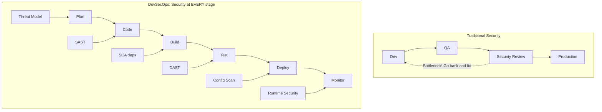
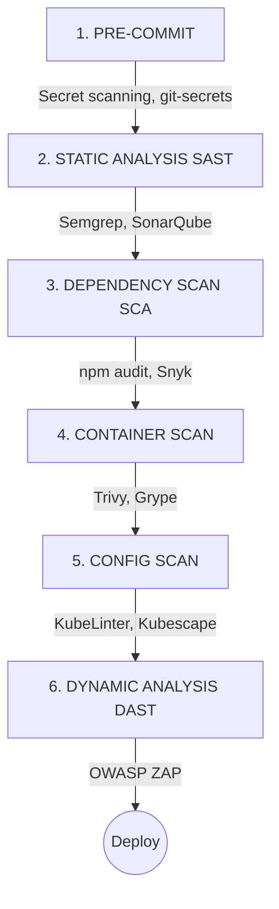
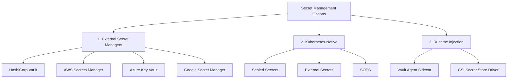
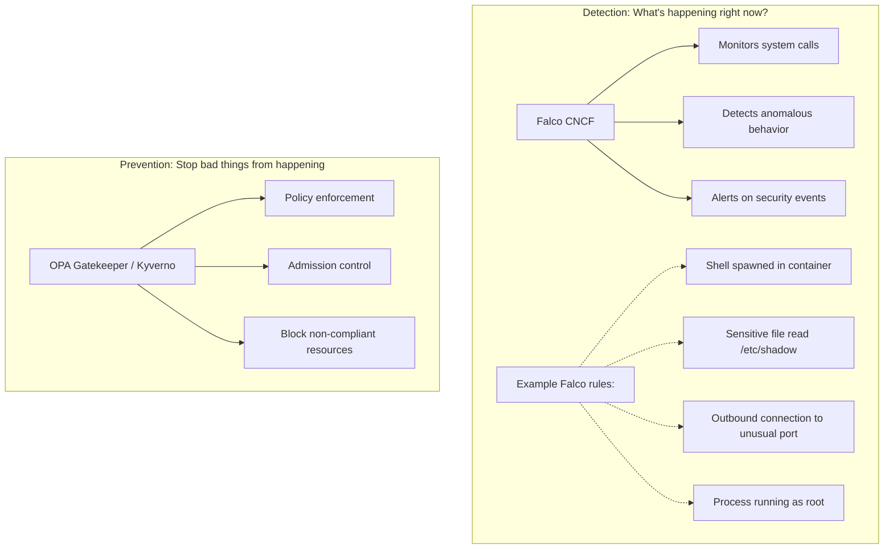

> **Complexity**: `[MEDIUM]` - Essential security mindset
>
> **Time to Complete**: 60-75 minutes
>
> **Prerequisites**: CI/CD concepts (Module 3)

## What You'll Be Able to Do

After completing this comprehensive module, you will be able to:
- **Design** a comprehensive DevSecOps CI/CD pipeline that integrates automated security scanning without halting developer velocity.
- **Diagnose** common Kubernetes workload misconfigurations that lead to container escapes and cluster compromise.
- **Implement** Pod Security Standards (PSS) to systematically restrict container privileges at the namespace boundary.
- **Evaluate** the difference between static analysis (SAST), software composition analysis (SCA), and dynamic analysis (DAST) in identifying vulnerabilities.
- **Implement** a zero-trust network posture by designing default-deny Kubernetes NetworkPolicies.
- **Compare** native and external secret management solutions to securely inject credentials into workloads.

## Why This Module Matters

In 2019, a massive financial institution experienced one of the most devastating data breaches in modern history. An external attacker exploited a server-side request forgery (SSRF) vulnerability in a misconfigured Web Application Firewall (WAF). However, the initial breach was only the beginning. The compromised server had been assigned an overly permissive Identity and Access Management (IAM) role. The attacker leveraged this excessive privilege to list and download sensitive storage buckets containing over 100 million credit card applications. The resulting financial impact exceeded hundreds of millions of dollars in regulatory fines, legal settlements, and reputational damage. This incident was a stark reminder that boundary defenses are insufficient; security must be deeply integrated into the infrastructure and application configuration itself.

In modern cloud-native and Kubernetes environments, the stakes are identically high, and the attack surface is significantly more complex. The abstraction layers that make Kubernetes powerful—Pods, Services, ServiceAccounts, and Controllers—also introduce myriad configuration points where a single oversight can lead to catastrophe. A developer casually adding `privileged: true` to a Pod specification to bypass a stubborn file permission issue inadvertently grants that container direct access to the host worker node's kernel capabilities. If an attacker breaches that container through a web vulnerability, they can execute a container escape, harvest the kubelet's credentials, and assume control over the entire cluster. 

DevSecOps is the systemic answer to this challenge. It is the philosophy and practice of embedding security guardrails directly into the software development lifecycle, ensuring that misconfigurations and vulnerabilities are caught automatically, long before they are deployed to production. Security transforms from a reactive gateway at the end of the release cycle into a continuous, automated process that empowers developers to build secure systems by default.

## The Paradigm Shift: What is DevSecOps?

Historically, security testing was a localized, manual phase situated at the very end of the software delivery pipeline. Development teams would write code, QA teams would verify functionality, and only then would the security team perform audits, penetration tests, and vulnerability assessments. This traditional model inherently positioned security as a bottleneck. When the security team discovered a critical flaw just days before a scheduled release, the entire project would be thrown back to the development phase, causing massive friction, blown deadlines, and an adversarial relationship between developers and security professionals.

DevSecOps dismantles this siloed approach. It mandates that security practices must be integrated into every single phase of the DevOps lifecycle—from initial planning and threat modeling, through coding and building, all the way to deployment and runtime monitoring. By automating security controls and distributing responsibility, DevSecOps ensures that software is secure by design.



The core tenet underlying this transformation is the concept of "Shifting Left."

### The Economics of Shifting Left

In a standard deployment timeline moving from left to right—from a developer's local workstation to a live production cluster—the cost and complexity of fixing a security vulnerability grow exponentially the further right it is discovered.

> **Stop and think**: If a developer hardcodes a password in a feature branch, at what stage of the pipeline should it ideally be caught to minimize cost and risk?

If a developer introduces a vulnerability (such as an outdated dependency or a hardcoded secret) and discovers it locally within minutes, the cost to fix it is near zero. They simply delete the secret, update the package, and proceed. If that same vulnerability is caught during a Pull Request review, it requires a context switch, a new commit, and another CI run—costing tens of dollars in engineering time. If the vulnerability makes it to a staging environment, it might require a coordinated effort between QA and development to reproduce and resolve, costing hundreds. 

However, if that vulnerability reaches production and is discovered by a malicious actor, the cost is catastrophic. It encompasses incident response, system downtime, customer notifications, regulatory fines, and irreparable brand damage. Shifting left means moving the detection of these issues as far left as mathematically possible.

```mermaid
flowchart LR
    A[Code] -- "$" --> B[Build]
    B -- "$$" --> C[Test]
    C -- "$$$" --> D[Stage]
    D -- "$$$$" --> E[Production]
    E -- "$$$$$$$" --> F[Breach!]

    classDef default fill:#f9f9f9,stroke:#333,stroke-width:2px;
    style F fill:#ff9999,stroke:#cc0000,stroke-width:3px;
```

## Security Integration in the CI/CD Pipeline

To operationalize the Shift Left philosophy, security tools must be integrated directly into the CI/CD pipeline. The goal is to provide fast, actionable feedback to developers without requiring them to become security experts. A modern DevSecOps pipeline utilizes multiple distinct layers of analysis, as each tool is specialized to catch different classes of vulnerabilities.



### 1. Pre-Commit and Secret Scanning
The first line of defense exists before code ever leaves a developer's laptop. Pre-commit hooks execute lightweight scans specifically looking for high-entropy strings, API keys, AWS credentials, and private keys. Tools like `git-secrets` or `trufflehog` analyze the diff of the impending commit. If a secret is detected, the commit is outright rejected, preventing the sensitive data from ever entering the Git history. 

### 2. Static Application Security Testing (SAST)
Once code is pushed to a repository, SAST tools parse the source code without executing it. They build an Abstract Syntax Tree (AST) to understand the logic and data flow, searching for well-known dangerous patterns such as SQL injection vulnerabilities, cross-site scripting (XSS) vectors, or the use of insecure cryptographic hashing algorithms (like MD5). Because SAST operates on raw source code, it provides developers with exact line numbers where flaws exist.

### 3. Software Composition Analysis (SCA)
Modern applications are rarely written from scratch; they assemble hundreds of open-source libraries. SCA tools map out the entire dependency tree (including transitive dependencies) and cross-reference them against databases of known vulnerabilities (CVEs). If your application imports a library with a known remote code execution flaw, the SCA tool will flag it and often suggest the minimum version required to patch the issue.

### 4. Container Scanning
Applications deploy inside containers, meaning the operating system packages shipped within the container image must also be scrutinized. Container scanners unpack the Docker image layers and inspect installed OS packages (like `glibc`, `openssl`, or `curl`) for vulnerabilities. 

### 5. Infrastructure as Code (IaC) Configuration Scanning
In Kubernetes, your infrastructure is defined by YAML manifests. Configuration scanners analyze these manifests to ensure they comply with security best practices. They will fail the pipeline if a Deployment attempts to run as the root user or if a Service is inadvertently exposed as a public LoadBalancer without authentication.

### 6. Dynamic Application Security Testing (DAST)
Finally, DAST tools operate in a fundamentally different manner. They treat the running application as a black box and actively interact with it over the network. DAST scanners simulate automated attacks, sending malformed HTTP requests, manipulating headers, and attempting injection attacks to observe how the application responds in its actual compiled, running state.

## Hardening the Container Image Layer

The container image is the foundational artifact of cloud-native deployments. A poorly constructed container image expands the attack surface significantly, providing an attacker with a rich toolkit of utilities to further their exploitation if they manage to breach the application layer.

### 1. Image Security and Minimal Attack Surfaces

Consider a standard development practice: using a full-featured base image like `ubuntu:latest`. While convenient because it contains every utility a developer might need (like `curl`, `wget`, `netcat`, and package managers), it is a security nightmare. If an attacker gains shell execution inside the container, they have immediate access to all these tools to download malicious payloads or map the internal network.

Furthermore, running the main process as the root user inside the container means that if the kernel isolation boundaries are bypassed, the attacker has root access on the host node.

```dockerfile
# BAD: Large attack surface, runs as root
FROM ubuntu:latest
RUN apt-get update && apt-get install -y nginx
COPY app /app
CMD ["nginx"]

# GOOD: Minimal image, non-root user
FROM nginx:1.25-alpine
RUN adduser -D -u 1000 appuser
COPY --chown=appuser:appuser app /app
USER appuser
EXPOSE 8080
```

The "GOOD" example demonstrates defense in depth. It uses an Alpine Linux base, which is drastically smaller and lacks many common attack utilities. It explicitly creates a dedicated, unprivileged user (`appuser`) and switches to it before executing the application. If this container is compromised, the attacker is trapped as an unprivileged user inside a barren operating system environment.

### 2. Continuous Image Scanning

Vulnerabilities are discovered daily. An image that was perfectly secure when built on Monday might have three critical CVEs reported against its packages by Friday. Container scanning must be a continuous process, executing not just during the CI build, but on a schedule against images stored in the registry.

```bash
# Trivy - most popular open-source scanner
trivy image nginx:1.25

# Example output:
# nginx:1.25 (debian 12.0)
# Total: 142 (UNKNOWN: 0, LOW: 89, MEDIUM: 45, HIGH: 7, CRITICAL: 1)
```

### 3. Image Signing and Provenance

The Software Supply Chain is increasingly under attack. If an attacker breaches your container registry, they could replace a legitimate image with a malicious one bearing the exact same tag. When Kubernetes pulls the image, it executes the malicious payload. Image signing creates a cryptographic signature of the image digest. Kubernetes can be configured via Admission Controllers to verify this signature before allowing the Pod to start, ensuring the image has not been tampered with since it left the CI/CD pipeline.

```bash
# Sign images to ensure they haven't been tampered with
# Using cosign (sigstore)
cosign sign myregistry/myapp:v1.0

# Verify before deploying
cosign verify myregistry/myapp:v1.0
```

## Securing the Kubernetes Workload Configuration

Even if your container image is pristine, the way you command Kubernetes to run that container can introduce catastrophic vulnerabilities. Kubernetes is designed for flexibility and interoperability, which means its default settings are often overly permissive.

### Common Manifest Misconfigurations

The Pod `securityContext` is the most critical block of YAML for workload security. It defines the privilege and access control settings for a Pod or Container.

```yaml
# BAD: Overly permissive pod
apiVersion: v1
kind: Pod
metadata:
  name: insecure-pod
spec:
  containers:
  - name: app
    image: myapp
    securityContext:
      privileged: true          # Never do this!
      runAsUser: 0              # Don't run as root
    volumeMounts:
    - name: host
      mountPath: /host          # Don't mount host filesystem
  volumes:
  - name: host
    hostPath:
      path: /

# GOOD: Secure pod configuration
apiVersion: v1
kind: Pod
metadata:
  name: secure-pod
spec:
  securityContext:
    runAsNonRoot: true
    runAsUser: 1000
    fsGroup: 1000
  containers:
  - name: app
    image: myapp
    securityContext:
      allowPrivilegeEscalation: false
      readOnlyRootFilesystem: true
      capabilities:
        drop:
        - ALL
    resources:
      limits:
        memory: "128Mi"
        cpu: "500m"
```

In the "BAD" configuration, `privileged: true` disables essentially all kernel-level isolation mechanisms (like cgroups and namespaces) that keep the container contained. The container processes can see and manipulate the host node's hardware devices. Combined with mounting the host filesystem (`hostPath: /`), an attacker inside this Pod can easily chroot into the host node, gaining full command over the underlying EC2 instance or virtual machine.

The "GOOD" configuration explicitly enforces that the container must run as a non-root user. It prevents privilege escalation via `setuid` binaries. Crucially, it sets `readOnlyRootFilesystem: true`, meaning even if an attacker achieves remote code execution, they cannot write malicious scripts or binaries to the container's disk, severely hindering their ability to establish persistence. Finally, dropping all Linux capabilities ensures the process has only the absolute bare minimum kernel privileges required to run.

### Enforcing Pod Security Standards (PSS)

Relying on developers to perfectly craft `securityContext` blocks in every manifest is unrealistic. Kubernetes provides a native, cluster-level mechanism to enforce these rules dynamically: Pod Security Standards (PSS), implemented via the Pod Security Admission controller.

PSS allows cluster administrators to apply labels to namespaces that dictate the minimum security posture allowed within that boundary.

```yaml
# Enforce security standards at namespace level
apiVersion: v1
kind: Namespace
metadata:
  name: production
  labels:
    pod-security.kubernetes.io/enforce: restricted
    pod-security.kubernetes.io/warn: restricted
    pod-security.kubernetes.io/audit: restricted
```

Kubernetes defines three standardized profiles:

| Level | Description |
|-------|-------------|
| privileged | No restrictions (dangerous) |
| baseline | Minimal restrictions, prevents known escalations |
| restricted | Highly restrictive, follows best practices |

By setting the `enforce: restricted` label, the Kubernetes API server will actively reject any API request attempting to create a Pod that violates the restricted profile (e.g., trying to run as root or mount a host path). The `warn` label sends a warning back to the user applying the manifest, while `audit` logs the violation for security monitoring.

## Secret Management Architectures

A perennial challenge in declarative infrastructure is handling secrets (passwords, API tokens, TLS certificates). Because GitOps mandates that all cluster state should be declared in version control, teams often struggle with where to store the sensitive data that enables the applications to connect to databases or third-party APIs.

### The Fundamental Problem

```yaml
# NEVER DO THIS
apiVersion: v1
kind: ConfigMap
metadata:
  name: app-config
data:
  DATABASE_PASSWORD: "supersecret123"  # In Git history forever!
```

Placing plain-text secrets in Git is a fatal error. Git history is immutable and distributed; once a secret is pushed, anyone who clones the repository has it forever. Even native Kubernetes `Secret` resources are dangerous to store in Git, as they only encode data in Base64—which is an encoding scheme, not encryption. Base64 can be decoded instantly by anyone.

### Architectural Solutions

There are three primary architectural patterns for solving the secret management problem in cloud-native environments.



**1. Kubernetes-Native (Asymmetric Encryption):** Tools like Bitnami Sealed Secrets solve the GitOps problem using asymmetric cryptography. The cluster operator deploys the Sealed Secrets controller, which generates a public/private key pair. Developers use the public key to encrypt their secrets locally via a CLI tool. The resulting encrypted artifact, a `SealedSecret`, is mathematically impossible to decrypt without the private key. Therefore, the `SealedSecret` can be safely committed to a public GitHub repository. When applied to the cluster, the controller uses the private key to decrypt it and dynamically create a standard Kubernetes `Secret` in memory.

```bash
# Install sealed-secrets controller
# Then create sealed secrets that can be committed to Git

kubeseal --format yaml < secret.yaml > sealed-secret.yaml

# sealed-secret.yaml can be committed
# Only the cluster can decrypt it
```

**2. External Secret Synchronization:** Tools like External Secrets Operator (ESO) allow organizations to store the actual secrets in enterprise-grade vaults (like AWS Secrets Manager or HashiCorp Vault). ESO runs in the cluster, authenticates to the external vault, fetches the secret data, and automatically synchronizes it into a native Kubernetes `Secret`.

**3. Runtime Injection:** For the highest security posture, secrets never touch the Kubernetes `Secret` API at all. The Secrets Store CSI Driver allows pods to mount secrets from external vaults directly into the container's in-memory filesystem as ephemeral volumes. When the pod terminates, the secret vanishes completely from the node.

## Network Security and Microsegmentation

By default, Kubernetes networks are entirely flat. Every pod in every namespace can communicate with every other pod without restriction. From an attacker's perspective, this is a dream scenario. If they manage to exploit a minor vulnerability in an internally facing analytics dashboard, they can freely map the network and open connections to the critical financial database pods located in a completely different namespace.

To implement a Zero-Trust architecture, operators must utilize NetworkPolicies to enforce microsegmentation.

> **Pause and predict**: If you apply a default-deny NetworkPolicy to a namespace, what happens to the existing pods that are currently communicating with each other?

When a NetworkPolicy is applied, it immediately begins dropping traffic that is not explicitly permitted. Existing connections that violate the new policy will be severed, which is why NetworkPolicies must be implemented methodically, often starting with a dry-run or logging phase.

```yaml
# Network Policy: Only allow specific traffic
apiVersion: networking.k8s.io/v1
kind: NetworkPolicy
metadata:
  name: api-network-policy
  namespace: production
spec:
  podSelector:
    matchLabels:
      app: api
  policyTypes:
  - Ingress
  - Egress
  ingress:
  - from:
    - podSelector:
        matchLabels:
          app: frontend
    ports:
    - protocol: TCP
      port: 8080
  egress:
  - to:
    - podSelector:
        matchLabels:
          app: database
    ports:
    - protocol: TCP
      port: 5432
```

This specific policy demonstrates extreme precision. It isolates any pod labeled `app: api`. It explicitly declares that the API pods may only receive incoming connections on port 8080, and only if those connections originate from a pod labeled `app: frontend`. Conversely, the API pods are restricted in what they can reach out to; their egress traffic is confined solely to port 5432 on pods labeled `app: database`. All other traffic attempting to reach or leave the API pods is silently dropped by the underlying Container Network Interface (CNI) plugin.

## Infrastructure Configuration Scanning Tooling

Validating the endless parameters of Kubernetes YAML manifests requires automation. Several open-source tools dominate this ecosystem.

### KubeLinter

KubeLinter is a focused, fast static analysis tool created by StackRox (now Red Hat). It takes your YAML files and checks them against a built-in series of best practices. It's incredibly fast, making it ideal for immediate developer feedback in pre-commit hooks or fast CI pipelines.

```bash
# Scan Kubernetes YAML for issues
kube-linter lint deployment.yaml

# Example output:
# deployment.yaml: (object: myapp apps/v1, Kind=Deployment)
# - container "app" does not have a read-only root file system
# - container "app" is not set to runAsNonRoot
```

### Kubescape

Kubescape is a more comprehensive platform. While it can scan local YAML files, it excels at analyzing entire running clusters. It evaluates your actual running state against rigorous compliance frameworks established by government and security agencies, such as the NSA/CISA Kubernetes Hardening Guidance or the MITRE ATT&CK framework.

```bash
# Full security scan against frameworks like NSA-CISA
kubescape scan framework nsa

# Scans for:
# - Misconfigurations
# - RBAC issues
# - Network policies
# - Image vulnerabilities
```

### Trivy

Trivy has evolved from a simple container image scanner into a massive, multi-purpose security platform. It can scan images for CVEs, scan IaC files (Terraform, Kubernetes YAML) for misconfigurations, scan repositories for hardcoded secrets, and even assess running clusters. Its versatility makes it a staple in modern DevSecOps pipelines.

```bash
# Scan container image
trivy image myapp:v1

# Scan Kubernetes manifests
trivy config .

# Scan running cluster
trivy k8s --report summary cluster
```

## Runtime Security: Defending the Live Cluster

All the prevention in the world cannot stop zero-day exploits or compromised credentials. Runtime security assumes the cluster will eventually be breached and focuses on detecting anomalous behavior as it happens in real-time.



The flagship project for runtime detection in cloud-native environments is Falco. Created by Sysdig and donated to the CNCF, Falco operates deep within the Linux kernel using eBPF (Extended Berkeley Packet Filter). eBPF allows Falco to safely execute sandbox programs inside the kernel to observe every single system call executed by every container, without modifying the kernel source code or risking a kernel panic.

If a standard Nginx web server container suddenly spawns a `/bin/bash` process, or attempts to read the highly sensitive `/etc/shadow` file, or tries to overwrite a system binary in `/usr/bin`, Falco detects this abnormal system call instantly. It compares the behavior against its ruleset and generates a high-severity alert to security operations teams. This deep introspection makes it nearly impossible for an attacker to operate stealthily on a node.

On the prevention side, Admission Controllers like OPA Gatekeeper or Kyverno intercept requests sent to the Kubernetes API server before they are persisted to the database (etcd). They evaluate the incoming JSON payload against complex logical policies and can definitively reject requests that violate organizational rules, acting as a programmable firewall for the cluster infrastructure itself.

## Identity and Access Management (RBAC) Best Practices

Role-Based Access Control (RBAC) determines who can do what within the Kubernetes cluster. The golden rule of RBAC is the Principle of Least Privilege: identities (whether human developers or machine service accounts) must be granted only the exact minimum permissions required to perform their intended function, and nothing more.

Excessive permissions drastically expand the blast radius of a compromised credential.

```yaml
# Principle of least privilege
# Give only the permissions needed

# BAD: Cluster admin for everything
apiVersion: rbac.authorization.k8s.io/v1
kind: ClusterRoleBinding
metadata:
  name: developer-admin
subjects:
- kind: User
  name: developer@company.com
roleRef:
  kind: ClusterRole
  name: cluster-admin    # Too much power!
```

Granting a developer (or a CI pipeline) `cluster-admin` privileges is catastrophic if their token is leaked. The attacker would have absolute authority to delete namespaces, read any secret, and deploy malicious DaemonSets across all nodes.

Instead, permissions should be tightly scoped. Roles should limit access to a specific namespace, restrict the types of resources that can be manipulated, and restrict the specific actions (verbs) allowed.

```yaml
# GOOD: Namespace-scoped, minimal permissions
apiVersion: rbac.authorization.k8s.io/v1
kind: Role
metadata:
  namespace: development
  name: developer
rules:
- apiGroups: ["apps"]
  resources: ["deployments"]
  verbs: ["get", "list", "create", "update"]
- apiGroups: [""]
  resources: ["pods"]
  verbs: ["get", "list"]
```

```yaml
# GOOD: RoleBinding applying the Role
apiVersion: rbac.authorization.k8s.io/v1
kind: RoleBinding
metadata:
  name: developer-binding
  namespace: development
subjects:
- kind: User
  name: developer@company.com
roleRef:
  kind: Role
  name: developer
```

In the "GOOD" configuration, the developer has authority only within the `development` namespace. They are permitted to manage Deployments, but they can only passively view Pods. They cannot read Secrets, they cannot modify NetworkPolicies, and they have absolutely zero access to the `production` namespace.

---

## Did You Know?

- **Over 90% of Kubernetes security incidents** are caused by misconfiguration, not zero-day exploits. The infamous 2018 Tesla breach happened simply because an administrative Kubernetes dashboard was left exposed to the internet without a password, allowing attackers to deploy cryptomining pods.
- **The Capital One Breach (2019)** resulted in the theft of 100 million credit card applications due to an overly permissive IAM role, highlighting exactly why the principle of least privilege (like strict RBAC) is critical in cloud architectures.
- **The Codecov Supply Chain Attack (2021)** occurred when sophisticated attackers managed to modify a simple bash script to exfiltrate CI/CD environment variables from customer environments, emphasizing why secret management and dependency scanning must be deeply integrated into automated pipelines.
- **Falco processes billions of events** every day at hyper-scale companies like Shopify. At that immense scale of data ingestion, it can still detect a malicious anomaly—such as a reverse shell being unexpectedly spawned in a production container—within milliseconds.

---

## Common Mistakes

| Mistake | Why It Hurts | Solution |
|---------|--------------|----------|
| Secrets in Git | Permanent, immutable exposure of credentials to anyone with read access. | Use specialized secret managers like Sealed Secrets or Vault. |
| Running as root | Grants a compromised container elevated privileges, risking a full node escape. | Always enforce `runAsNonRoot: true` in Pod security contexts. |
| No network policies | Creates a flat network, allowing unhindered lateral movement after a breach. | Implement default-deny policies, opening only explicit ingress/egress. |
| Using the latest tag | Bypasses vulnerability tracking and guarantees unexpected breaking changes. | Pin specific, immutable version tags (e.g., `nginx:1.25.1-alpine`). |
| No image scanning | Deploys known, publicly documented vulnerabilities directly into production. | Mandate automated image scanning as a blocking step in CI/CD. |
| Cluster-admin everywhere | Maximizes the blast radius if an account token is compromised. | Enforce strict, namespace-bound Role-Based Access Control (least privilege). |

---

## Quiz

1. **Your team is planning a new microservice. The lead developer suggests running security scans only on the final container image right before production deployment to save CI time. Why is this approach risky in a DevSecOps culture?**
   <details>
   <summary>Answer</summary>
   This approach violates the "Shift Left" principle, which advocates finding security issues as early in the development lifecycle as possible. Waiting until the final container image is built means any discovered vulnerabilities (like outdated dependencies or insecure code) will require sending the work all the way back to the development phase. Fixing issues in production or staging is significantly more expensive and time-consuming than catching them during local development or at the pull request stage. By shifting left, teams can address flaws when the context is still fresh in the developer's mind.
   </details>

2. **A developer creates a Pod manifest that sets `runAsUser: 0` because their application needs to install a package at startup. If this container is compromised, what is the primary risk, and how should it be mitigated?**
   <details>
   <summary>Answer</summary>
   Setting `runAsUser: 0` means the container runs as the root user, which creates a severe security risk if an attacker gains execution capabilities inside the container. If a vulnerability is exploited, the attacker would have root-level permissions, making it much easier to escape the container boundary and compromise the underlying Kubernetes worker node. To mitigate this, the container image should be built with all necessary packages installed during the CI phase, not at runtime. The Pod manifest should enforce `runAsNonRoot: true` and specify a non-privileged user ID to limit the blast radius of any potential compromise.
   </details>

3. **You need to implement security checks in your CI/CD pipeline. Your manager asks you to choose between SAST (Static Application Security Testing) and DAST (Dynamic Application Security Testing) because of budget constraints. How do you explain the different threats each one addresses?**
   <details>
   <summary>Answer</summary>
   SAST and DAST are complementary tools that address different types of security threats, so choosing only one leaves a significant blind spot. SAST analyzes the static source code before it is compiled or run, making it excellent for catching hardcoded secrets, dangerous function calls, and logic flaws early in the development cycle. Conversely, DAST interacts with the running application from the outside, simulating an attacker to find runtime vulnerabilities like cross-site scripting (XSS), misconfigured HTTP headers, or authentication bypasses. Because they evaluate the application in entirely different states, a robust DevSecOps pipeline requires both to ensure comprehensive coverage.
   </details>

4. **A junior engineer proposes committing a Kubernetes `Secret` manifest containing database credentials directly to the Git repository, arguing that the repository is private and secure. What is the fundamental flaw in this reasoning, and what is a better alternative?**
   <details>
   <summary>Answer</summary>
   Committing raw secrets to any version control system, even a private one, is fundamentally flawed because Git retains a permanent history of all changes. Once a secret is committed, anyone with read access to the repository—or anyone who gains access in the future—can retrieve the credentials from the commit history, even if the file is later deleted. A better alternative is to use a tool like Sealed Secrets, which uses asymmetric cryptography to encrypt the secret so that it can be safely committed to Git. Only the Kubernetes cluster holds the private key required to decrypt the SealedSecret back into a usable Kubernetes Secret object.
   </details>

5. **Your organization wants to enforce a policy where no pods can run in the `production` namespace with privileged access or host-level mounts. How can you implement this natively in Kubernetes v1.35 without installing third-party admission controllers?**
   <details>
   <summary>Answer</summary>
   You can achieve this natively by configuring Pod Security Standards (PSS) at the namespace level using specific labels. By applying the label `pod-security.kubernetes.io/enforce: restricted` to the `production` namespace, the Kubernetes built-in admission controller will automatically reject any Pod creation requests that violate the restricted profile. This profile explicitly forbids privileged containers, host network namespaces, and hostpath volumes, among other insecure configurations. This native approach requires no additional tooling and ensures that misconfigured pods are blocked before they are ever scheduled onto a node.
   </details>

6. **A developer accidentally commits an AWS access key to their local Git repository. They realize the mistake before pushing to the remote repository, but they want to ensure this never happens again. What DevSecOps practice should be implemented to prevent this specific scenario?**
   <details>
   <summary>Answer</summary>
   The team should implement pre-commit scanning using a tool like `git-secrets` or `trufflehog` configured to run as a Git pre-commit hook. This practice intercepts the commit process locally on the developer's machine and scans the staged files for patterns matching known sensitive data formats, such as API keys or passwords. If a secret is detected, the hook aborts the commit, providing immediate feedback to the developer and preventing the secret from ever entering the local Git history. This is a prime example of "shifting left," as it addresses the vulnerability at the earliest possible moment in the development lifecycle.
   </details>

7. **An attacker compromises a frontend web pod and immediately attempts to connect to the backend database pod on port 5432. By default, Kubernetes allows this traffic. What specific resource must you write to block this unauthorized lateral movement?**
   <details>
   <summary>Answer</summary>
   You must write a Kubernetes `NetworkPolicy` resource to explicitly control and restrict pod-to-pod communication. By default, all pods in a Kubernetes cluster can communicate with each other freely, which facilitates lateral movement during a breach. By defining a default-deny NetworkPolicy and then explicitly allowing only ingress traffic from the frontend pod to the database pod on port 5432, you create a zero-trust network boundary. This ensures that even if an attacker compromises a pod in a different part of the cluster, they cannot reach the database because the network layer will drop the unauthorized packets.
   </details>

---

## Hands-On Exercise

**Task**: Practice Kubernetes security scanning and configuration hardening. In this exercise, you will create an inherently insecure workload, evaluate it against manual security best practices, and then construct a hardened, secure equivalent.

```bash
# 1. Create an insecure deployment
cat << 'EOF' > insecure-deployment.yaml
apiVersion: apps/v1
kind: Deployment
metadata:
  name: insecure-app
spec:
  replicas: 1
  selector:
    matchLabels:
      app: insecure
  template:
    metadata:
      labels:
        app: insecure
    spec:
      containers:
      - name: app
        image: nginx:latest
        securityContext:
          privileged: true
          runAsUser: 0
        ports:
        - containerPort: 80
EOF

# 2. Scan with kubectl (basic check)
kubectl apply -f insecure-deployment.yaml --dry-run=server
# Note: This won't catch security issues, just syntax

# 3. If you have trivy installed:
# trivy config insecure-deployment.yaml

# 4. Manual security checklist:
echo "Security Review Checklist:"
echo "[ ] Image uses specific tag (not :latest)"
echo "[ ] Container runs as non-root"
echo "[ ] privileged: false"
echo "[ ] Resource limits set"
echo "[ ] readOnlyRootFilesystem: true"
echo "[ ] Capabilities dropped"

# 5. Create a secure version
cat << 'EOF' > secure-deployment.yaml
apiVersion: apps/v1
kind: Deployment
metadata:
  name: secure-app
spec:
  replicas: 1
  selector:
    matchLabels:
      app: secure
  template:
    metadata:
      labels:
        app: secure
    spec:
      securityContext:
        runAsNonRoot: true
        runAsUser: 1000
        fsGroup: 1000
      containers:
      - name: app
        image: nginx:1.25-alpine
        securityContext:
          allowPrivilegeEscalation: false
          readOnlyRootFilesystem: true
          capabilities:
            drop:
            - ALL
        ports:
        - containerPort: 8080
        resources:
          limits:
            memory: "128Mi"
            cpu: "500m"
          requests:
            memory: "64Mi"
            cpu: "250m"
EOF

# 6. Compare the two
echo "=== Insecure vs Secure ==="
diff insecure-deployment.yaml secure-deployment.yaml || true

# 7. Cleanup
rm insecure-deployment.yaml secure-deployment.yaml
```

**Success criteria**: Understand the granular differences between insecure vs secure configurations, specifically focusing on the `securityContext` settings. Ensure you can articulate why dropping capabilities and using read-only filesystems prevents runtime exploitation.

---

## Next Steps

You've now completed the foundational knowledge required for securing cloud-native delivery systems! The combination of automated pipelines, GitOps, and integrated DevSecOps provides a robust, professional-grade platform. Now, it's time to dive into the core engine of cloud-native architectures: Kubernetes itself. We will begin by exploring the historical context and technical decisions that led to Kubernetes dominating the container orchestration space.

**Next Module:** [Philosophy & Design](/prerequisites/philosophy-design/module-1.1-why-kubernetes-won/) - Discover the design principles that allowed Kubernetes to defeat Docker Swarm and Mesos in the container orchestration wars.

- [CKA Curriculum](/k8s/cka/part0-environment/module-0.1-cluster-setup/)
- [CKAD Curriculum](/k8s/ckad/part0-environment/module-0.1-ckad-overview/)