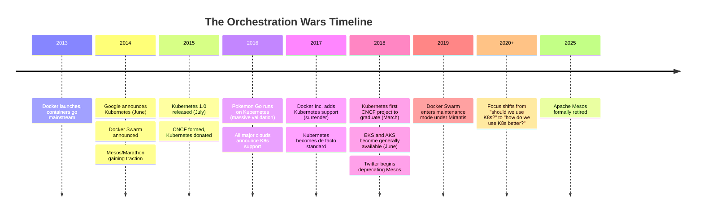
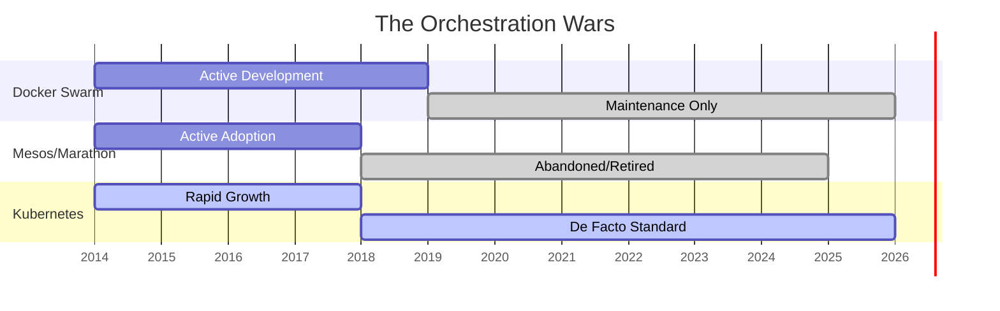

> **Complexity**: `[QUICK]` - Conceptual understanding, no hands-on
>
> **Time to Complete**: 25-30 minutes
>
> **Prerequisites**: None - this is where everyone starts

---

## What You'll Be Able to Do

After this module, you will be able to:
- **Explain** why Kubernetes won over Docker Swarm, Mesos, and Nomad with specific technical and ecosystem reasons
- **Identify** the patterns that make a technology "win" (community, extensibility, cloud provider adoption)
- **Evaluate** new technology claims by asking "does this have the ecosystem markers that Kubernetes had?"
- **Describe** the timeline from Borg to Kubernetes and why Google open-sourced it

---

## Why This Module Matters

It was 3 AM on Black Friday 2014. A developer at a fast-growing e-commerce startup stared at 47 terminal windows, each SSH'd into a different server. Their flash sale had gone viral — 10x the expected traffic. Docker containers were crashing faster than he could restart them. "Scale up server 23... no wait, 23 is full, try 31... 31 is down, when did that happen?" By 4 AM, the site was offline. By Monday, the CEO was asking why they'd lost $340,000 in sales.

That developer's nightmare is exactly why Kubernetes exists. Not as an academic exercise, not as a Google vanity project — but because **manually managing containers at scale is a problem that will eat you alive.**

As of 2025, roughly 82% of organizations run Kubernetes in production (up from 66% in 2023). Kubernetes didn't win by accident. Understanding the orchestration wars helps you appreciate why certain patterns exist and why alternatives failed.

---

## The Problem: Container Orchestration

By 2014, containers had proven their value. Docker made them accessible. But a new problem emerged:

**How do you run thousands of containers across hundreds of machines?**

> **Stop and think**: How would you update 100 running containers to a new version without causing any downtime for your users if you had to do it manually? 

Manual management doesn't scale. You need:
- Automated scheduling (where should this container run?)
- Self-healing (what happens when a container dies?)
- Scaling (how do I handle more traffic?)
- Networking (how do containers find each other?)
- Updates (how do I deploy without downtime?)

This is **container orchestration**.

---

## The Contenders

### Docker Swarm

**The Simple Choice**

Docker Inc.'s answer to orchestration. Built into Docker itself.

```text
Pros:
- Simple to set up
- Native Docker integration
- Familiar Docker Compose syntax
- "It just works" for small deployments

Cons:
- Limited feature set
- Poor multi-cloud support
- Vendor lock-in to Docker Inc.
- Scaling limitations
```

**What Happened**: Docker Inc. bet everything on Swarm. When Kubernetes won, Docker Inc. eventually pivoted (acquired by Mirantis in 2019). Swarm Mode is now in a maintenance-only status—while Mirantis has committed to supporting it until at least 2030, there is no active development of new features.

### Apache Mesos + Marathon

**The Enterprise Choice**

Born at UC Berkeley, used by Twitter and Airbnb. Marathon provided the container orchestration layer on top of Mesos.

```text
Pros:
- Battle-tested at massive scale (Twitter)
- Flexible (runs containers AND other workloads)
- Two-level scheduling architecture
- Proven in production

Cons:
- Complex to operate
- Steep learning curve
- Smaller ecosystem
- Required separate components (Marathon, Chronos)
```

**What Happened**: Twitter deprecated Mesos in 2020, moving to Kubernetes. Mesosphere (the company) pivoted to become D2iQ and now sells Kubernetes. Apache Mesos was formally retired and moved to the Apache Attic in August 2025 due to inactivity. Marathon is abandoned.

### HashiCorp Nomad

**The Pragmatic Choice**

HashiCorp's orchestrator, released in 2015. Designed as a single binary that handles both containers and non-containerized workloads.

```text
Pros:
- Incredibly simple to deploy (single binary)
- Runs non-containerized workloads (like Java or binaries) easily
- Integrates tightly with the HashiCorp ecosystem (Consul, Vault)
- Lower operational overhead than Kubernetes

Cons:
- Smaller ecosystem compared to Kubernetes
- Less momentum for pure container-first architectures
```

**What Happened**: Nomad didn't "lose" in the same way Swarm or Mesos did. It survived by carving out a strong, profitable niche for organizations that prioritize simplicity or need to orchestrate mixed workloads without the immense complexity of Kubernetes.

### Kubernetes

**The Google Choice**

Google's internal system "Borg" had orchestrated containers for over a decade. Kubernetes was Borg's open-source successor, donated to the newly-formed CNCF.

```text
Pros:
- Google's decade of experience
- Declarative model (desired state)
- Massive ecosystem
- Cloud-native foundation
- Strong community governance

Cons:
- Complex
- Steep learning curve
- "Too much" for simple deployments
```

**What Happened**: It won. Decisively.

---

## Why Kubernetes Won

### 1. The Declarative Model

Kubernetes introduced a fundamentally different approach:

```text
Imperative (Swarm/Traditional):
"Start 3 nginx containers on server-1"
"If one dies, start another"
"If traffic increases, start 2 more"

Declarative (Kubernetes):
"I want 3 nginx replicas running. Always."
(Kubernetes figures out the rest)
```

> **Pause and predict**: If you define the state as "3 replicas" and someone manually logs into a server and deletes 2 of them, what will the declarative system do? 
> *(Answer: It immediately detects the state mismatch and spins up 2 new replicas to restore the desired state.)*

This shift is profound. You describe *what you want*, not *how to get there*. Kubernetes continuously reconciles reality with your desired state.

### 2. Google's Experience

Google had run containers at scale for over a decade with Borg. Kubernetes embodied lessons learned from:
- Billions of container deployments per week
- Failures at every possible level
- What actually works at scale

This wasn't a startup's first attempt—it was Google's third-generation system. Google chose to open-source it to commoditize the container orchestration layer, preventing competitors like AWS from locking developers into proprietary infrastructure and ensuring workloads could more easily migrate to Google Cloud.

### 3. The Ecosystem Effect & The Spotify Case Study

Kubernetes made smart architectural decisions:
- **Extensible**: Custom Resource Definitions (CRDs) let anyone extend K8s
- **Pluggable**: Container runtimes, networking, storage all pluggable
- **API-first**: Everything is an API, enabling tooling

**The Spotify Case Study:**
Consider Spotify's migration in 2018. They had built their own open-source orchestrator called Helios. Why did they abandon it for Kubernetes? Because while Helios deployed containers, Kubernetes offered an entire ecosystem. Spotify wanted to use industry-standard tools for logging, monitoring (Prometheus), and service mesh, all of which natively integrated with Kubernetes. 

> **Pause and predict**: If a company builds a proprietary orchestration tool, how likely are their competitors to build integrations for it compared to a CNCF-governed open-source project?

By 2019, Kubernetes held over 75% of the container orchestration market share, making homegrown solutions impossible to justify. *(Note: While some secondary sources today claim Kubernetes holds roughly 92% market share, this specific figure is unverified by primary analysts. However, the 2025 CNCF Annual Survey definitively confirms that 93% of organizations are now using or evaluating Kubernetes.)*

### 4. Cloud Provider Adoption

By 2017, all major cloud providers offered managed Kubernetes:
- Google Kubernetes Engine (GKE)
- Amazon Elastic Kubernetes Service (EKS)
- Azure Kubernetes Service (AKS)

> **Stop and think**: Why would AWS want to offer a managed service based on a tool originally created by Google? 

This was unprecedented. Competitors usually don't adopt each other's technology. But Kubernetes was:
- Open source (no single vendor owns it)
- Governed by CNCF (neutral foundation)
- Becoming the standard (couldn't ignore it)

### 5. Community & Governance

The CNCF (Cloud Native Computing Foundation) provided:
- Neutral governance (not controlled by Google)
- Vendor-neutral certification
- Clear contribution guidelines
- Trademark protection

This meant companies could invest in Kubernetes without fearing vendor lock-in.

---

## Applying the Framework: The Orchestrator Survival Checklist

When evaluating any new foundational infrastructure technology today (like WebAssembly platforms or AI orchestrators), apply the "Kubernetes Framework" to predict its survival. Does it have:

- [ ] **Declarative State Management**: Does it rely on continuous reconciliation rather than imperative commands?
- [ ] **Extensible Architecture**: Can users add their own custom resources without modifying the core codebase?
- [ ] **Neutral Governance**: Is it hosted by a foundation (like CNCF) rather than controlled by a single vendor?
- [ ] **Pluggable Interfaces**: Can the networking, storage, and runtimes be easily swapped out?
- [ ] **Cloud Provider Buy-in**: Are multiple competing cloud providers offering it as a managed service?

---

## The Timeline



---

## Visualization



---

## Did You Know?

- **Kubernetes means "helmsman" or "pilot" in Ancient Greek.** It is also the etymological root of "cybernetics". The abbreviation **K8s** results from counting the 8 letters between the "K" and the "s".

- **The logo is a ship's wheel, but the 7 spokes are a sci-fi reference.** They are a homage to the Star Trek character "Seven of Nine", reflecting the project's original internal codename at Google: *Project Seven of Nine* (a nod to Borg).

- **Kubernetes was created by Craig McLuckie, Joe Beda, and Brendan Burns at Google.** It was publicly announced at the first DockerCon on June 10, 2014, with the first GitHub commit containing just 250 files.

- **Borg was named after Star Trek.** Google's internal predecessor to Kubernetes. Another Google project followed: Omega. The *Borg, Omega, and Kubernetes* paper (2016) details how these systems inspired K8s.

- **Pokemon Go's launch was a K8s milestone.** When it launched in 2016, traffic was 50x expected. Kubernetes scaled the backend automatically. This was the "proof point" that convinced many enterprises.

- **Docker tried to buy Kubernetes.** Before Kubernetes was open-sourced, Docker approached Google about acquiring it. Google declined and donated it to CNCF instead.

---

## Common Misconceptions

| Misconception | Reality |
|---------------|---------|
| "K8s won because Google" | Google helped, but neutral governance was key. AWS wouldn't adopt a Google-controlled product. |
| "Swarm lost because Docker" | Swarm lost because it couldn't match K8s features or ecosystem. Company issues accelerated it. |
| "Mesos was inferior technology" | Mesos was powerful but too complex. Technology alone doesn't win—ecosystem and simplicity matter. |

---

## Common Mistakes

When learning about container orchestration history and applying its lessons, beginners often make these conceptual errors:

| Mistake | Why It's a Mistake | Better Approach |
|---------|-------------------|-----------------|
| Treating K8s as just "Docker Swarm but bigger" | It fundamentally changes the paradigm from imperative commands to declarative reconciliation loops. | Understand K8s as a state-matching engine, not a script runner. |
| Choosing K8s for a simple 2-container app | The operational overhead of managing a cluster often outweighs the benefits for trivial workloads. | Start with Docker Compose or PaaS (like Heroku/Render) until you need K8s' scale. |
| Believing vendor-locked orchestrators are safer | History shows tools owned by a single company (like Docker Swarm) struggle to gain broad ecosystem support. | Prioritize CNCF-backed or open-governance tools for long-term infrastructure. |
| Ignoring the CNCF ecosystem | Trying to build custom logging or monitoring instead of using standard K8s integrations wastes the platform's main advantage. | Leverage ecosystem tools like Prometheus and Fluentd that integrate natively. |
| Focusing only on Google's role | While Google started it, the neutral CNCF governance was the actual catalyst for AWS and Azure adoption. | Recognize the importance of open foundations in enterprise tech adoption. |
| Assuming Kubernetes replaces Docker | K8s orchestrates containers, but it still needs a container runtime (like containerd) to run them. | Differentiate between the container image/runtime and the orchestrator. |
| Trying to learn K8s without understanding the "Why" | Jumping straight into YAML without understanding the problems K8s solves leads to rote memorization. | Learn the history and the declarative philosophy first. |

---

## Why This History Matters for Learning

Understanding why Kubernetes won helps you:

1. **Appreciate declarative design**: The reconciliation loop isn't arbitrary—it's the core innovation.
2. **Understand the ecosystem**: Knowing why CRDs exist helps you use them effectively.
3. **Avoid dead ends**: You won't waste time on deprecated approaches.
4. **Speak the language**: In interviews and work, this context demonstrates deeper understanding.

---

## Quiz

1. **Scenario**: Your startup is migrating from a single server to a multi-node architecture. The lead developer suggests writing a Python script that SSHes into servers to start Docker containers, checks if they are running every 5 minutes, and restarts them if they fail. Based on the history of orchestration, why is this approach risky?
   <details>
   <summary>Answer</summary>
   This approach represents a primitive imperative system, similar to early attempts before Docker Swarm. It is risky because building a reliable reconciliation loop (monitoring state, handling network partitions, managing server failures) is incredibly difficult. Kubernetes already solves this with a robust declarative model based on a decade of Google's experience. Rebuilding it from scratch will lead to edge-case failures, massive technical debt, and a system that requires constant human intervention to maintain uptime during unexpected outages.
   </details>

2. **Scenario**: A major tech company releases a new, proprietary container orchestrator that boasts faster scheduling than Kubernetes. They offer it for free, but it only runs on their specific cloud platform. Based on why Kubernetes won, why is this new tool likely to fail in the broader market?
   <details>
   <summary>Answer</summary>
   The new tool lacks neutral governance and broad cloud provider adoption, which were critical to Kubernetes' success under the CNCF. Enterprises avoid vendor lock-in for foundational infrastructure, meaning a tool tied to a single cloud will struggle to gain widespread trust. Without an open, extensible ecosystem where competitors can also contribute, the proprietary tool will struggle to build the massive community and tooling ecosystem that made Kubernetes the industry standard. Furthermore, relying on a single cloud provider restricts hybrid and multi-cloud strategies, which many modern organizations require for resilience and compliance.
   </details>

3. **Scenario**: Your team is debating between Docker Swarm and Kubernetes for a new enterprise application that will eventually span across AWS and on-premises servers. An engineer argues for Swarm because "it's simpler to set up." What historical context should you provide to counter this?
   <details>
   <summary>Answer</summary>
   While Swarm is indeed simpler initially, it is in a maintenance-only status with no new features being actively developed by Mirantis. It struggled in the orchestration wars specifically because it could not handle complex, multi-cloud enterprise use cases as well as its competitors. Kubernetes won because its extensible, declarative architecture handles complex networking, storage scaling, and hybrid deployments far better out of the box. Choosing a technology that lacks an active, growing ecosystem for a new enterprise project introduces severe long-term support and integration risks that outweigh the initial ease of setup.
   </details>

4. **Scenario**: During an interview, you are asked: "If you have a container crashing repeatedly, how does a declarative orchestrator handle it differently than a sysadmin writing an imperative script?" How do you respond?
   <details>
   <summary>Answer</summary>
   An imperative script executes a series of rigid steps (e.g., "start container, check status, restart if down") and can easily fail if an unexpected state occurs, like the underlying server running out of disk space or memory. A declarative orchestrator, like Kubernetes, constantly compares the current actual state of the cluster to the desired state (e.g., "always have 3 replicas running"). It continuously works to reconcile the two, utilizing built-in intelligence to reschedule the container on a healthier node without manual intervention. This continuous reconciliation loop is far more resilient than one-off imperative commands because it handles the "how" dynamically based on real-time cluster conditions.
   </details>

5. **Scenario**: Your company uses Kubernetes, but a developer complains that writing YAML files is tedious and wants to go back to manually starting containers using `docker run`. What fundamental feature of Kubernetes' design are they failing to leverage?
   <details>
   <summary>Answer</summary>
   The developer is missing the power of the declarative model, which is the foundational innovation of Kubernetes. While writing YAML can be tedious, it serves as version-controlled, executable documentation of the desired state that the orchestration system can read and enforce. By using `docker run`, they are reverting to a fragile imperative approach that cannot be easily scaled, audited, or self-healed by the orchestrator during node failures. The YAML files allow Kubernetes to automatically maintain the system's health and scalability dynamically, effectively acting as the source of truth that outlives any single container or manual command.
   </details>

6. **Scenario**: You are evaluating a new observability tool for your cluster. Tool A is a standalone product built by a small startup. Tool B is a CNCF-incubating project built specifically using Kubernetes Custom Resource Definitions (CRDs). Why might Tool B be the safer long-term choice based on orchestration history?
   <details>
   <summary>Answer</summary>
   Tool B leverages Kubernetes' extensible architecture (CRDs) and is part of the CNCF ecosystem, similar to the pattern of how Kubernetes itself succeeded. The CNCF backing ensures neutral governance and community-driven development, significantly reducing the risk of the project being abruptly abandoned or locked behind a restrictive paywall. Its native integration with the Kubernetes API means it will likely work seamlessly with other standard ecosystem tools, avoiding friction during upgrades or expansions. Adopting ecosystem-aligned tools ensures your team benefits from the collective troubleshooting and operational experience of the broader community rather than fighting isolated bugs.
   </details>

7. **Scenario**: A CTO looks at a diagram of Apache Mesos and Kubernetes. They note that Mesos was successfully used by Twitter at massive scale, yet it lost to Kubernetes. They ask you why the "best technology" doesn't always win. How do you explain the outcome?
   <details>
   <summary>Answer</summary>
   Technology doesn't exist in a vacuum; ecosystem, extensibility, and usability are just as critical for long-term platform survival. Mesos was incredibly powerful and proven at scale, but possessed a steep learning curve and was difficult to operate out of the box, often requiring separate components like Marathon just to run containers. Kubernetes struck the right balance by offering Google-grade orchestration concepts while cultivating an unmatched, open ecosystem that invited massive community contribution. The neutral CNCF governance encouraged every major cloud provider to adopt it as a managed service, creating a snowball effect of accessibility that Mesos couldn't match. Ultimately, an accessible platform with standard API abstractions and massive community momentum will outcompete a technically superior but fragmented or complex alternative.
   </details>

---

## Hands-On Exercise: Orchestration Architecture Reflection

While this module is conceptual, applying the historical lessons to a modern scenario solidifies your understanding. 

**Scenario:** Your company's CTO wants to build a proprietary, internal orchestration system for your microservices because Kubernetes "feels too complex." You need to prepare a counter-argument based on the Orchestration Wars.

**Task:** Draft a brief (3-4 point) technical argument against building a custom orchestrator, referencing specific historical lessons from Docker Swarm and Mesos.

### Success Criteria

- [ ] You have identified at least one risk related to building a custom ecosystem (referencing the CNCF or K8s ecosystem).
- [ ] You have explained the difference between imperative and declarative models in your argument.
- [ ] You have referenced the maintenance burden, citing Google's decade of experience with Borg.
- [ ] You have provided a concrete example of a company (like Docker or Twitter) that abandoned their own orchestrator.

---

## Summary

Kubernetes won the orchestration wars because:
- **Declarative model**: Define desired state, let K8s handle the rest
- **Google's experience**: Decade of production learnings from Borg
- **Ecosystem**: Extensible architecture enabled massive tooling ecosystem
- **Governance**: CNCF neutrality enabled industry-wide adoption
- **Cloud adoption**: All major providers offering managed K8s

The alternatives didn't fail because they were bad—they failed because Kubernetes was better positioned for industry-wide adoption.

---

## Next Module

[Module 1.2: Declarative vs Imperative](../module-1.2-declarative-vs-imperative/) - The philosophy that makes Kubernetes different.