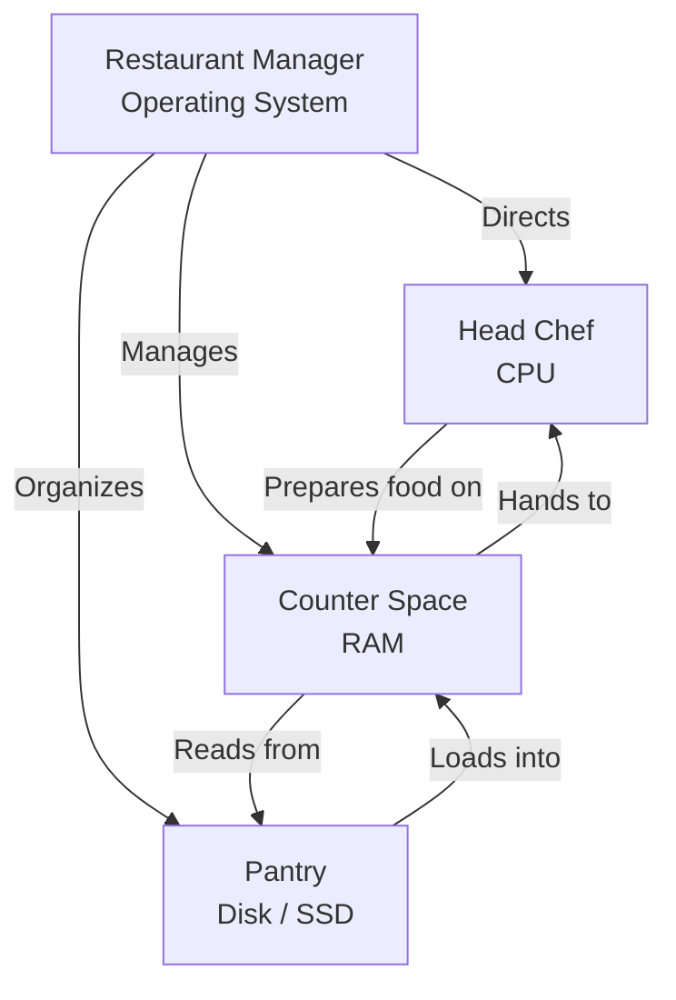

> **Complexity**: `[QUICK]` - No technical experience needed
>
> **Time to Complete**: 35 minutes
>
> **Prerequisites**: None. Seriously, none. If you can read this, you're ready.

---

## What You'll Be Able to Do

After this module, you will be able to:

- **Diagnose** whether a slow computer is more likely constrained by CPU, RAM, disk, or operating-system pressure.
- **Compare** RAM and storage using the kitchen model, then predict what is lost or preserved when power disappears.
- **Evaluate** why Linux is common in cloud and Kubernetes environments while recognizing where Windows worker nodes fit.
- **Implement** a personal spec inventory that records your CPU, RAM, disk capacity, operating system, and current resource pressure.
- **Predict** what happens when RAM, disk space, or CPU time is exhausted during everyday and server-side workloads.

---

## Why This Module Matters

Hypothetical scenario: you join a beginner-friendly operations team and someone says, "The app is down because the server is out of memory." Another person says the disk is full, a third person says the CPU is pegged, and a fourth suggests restarting everything. If all four sentences sound like vague computer drama, you cannot yet choose the next diagnostic step. If you can tell the difference between memory, storage, processing, and the operating system, the same incident becomes a structured problem instead of a panic.

Every single thing you will learn in this curriculum runs on computers. Kubernetes, containers, terminals, shell scripts, cloud servers, laptops, phones, Raspberry Pi boards, and managed databases all depend on the same basic bargain: instructions need a processor, active work needs memory, durable information needs storage, and everything needs an operating system to coordinate access. The vocabulary changes as systems get larger, but the physical constraints do not disappear.

This module gives you a mental model that will keep paying rent. Later, when Kubernetes restarts a container because it exceeded a memory limit, you will already know why temporary working space matters. When a node reports disk pressure, you will already know why "more memory" is the wrong fix. When a Linux terminal appears in the next module, you will know that it is not magic, just a direct way to ask the operating system to do work.

---

## The Kitchen Model: A Whole Computer Before the Parts

Imagine a restaurant kitchen. Not a fancy one, just a regular, busy kitchen that needs to take orders, prepare food, keep ingredients organized, clean up after itself, and serve customers without mixing up dishes. A computer works in a similar way because it has separate parts with separate responsibilities. The point of the analogy is not that a computer literally cooks; the point is that good kitchens and good computers both need coordination, temporary workspace, long-term storage, and workers that execute instructions.

Most beginners learn computer parts as isolated vocabulary words, which makes the subject feel more complicated than it is. CPU, RAM, disk, and operating system sound like separate flashcards until you watch them cooperate. The restaurant model lets you see the cooperation first, then attach names to each responsibility. Once the whole system is visible, the individual parts become easier to remember and much easier to diagnose.



The restaurant manager is the operating system. The manager does not personally chop onions, but the kitchen becomes chaos without someone assigning work, controlling access to counter space, and deciding where ingredients belong. In a computer, the operating system performs that coordination for programs, hardware devices, files, memory, network connections, screens, keyboards, and background tasks.

The head chef is the CPU, which stands for Central Processing Unit. The chef is the part that actually follows instructions and transforms inputs into outputs. If the recipe says slice, mix, heat, compare, copy, or calculate, the chef is responsible for doing that work. A chef can only work with ingredients that are close enough to reach, which is why the counter matters.

The counter space is RAM, which stands for Random Access Memory. RAM holds the active ingredients and half-finished dishes that the chef needs right now. It is much faster to use than the pantry, but it is temporary. When the kitchen closes, the counter is cleared, and in a computer, RAM is cleared when power disappears.

The pantry is disk storage, usually an SSD in modern laptops and servers. Storage keeps recipes, ingredients, photos, documents, programs, operating-system files, and logs after the machine is turned off. The pantry is slower than the counter, but it is durable. A kitchen with no pantry can work only for a moment, while a kitchen with no counter can barely work at all.

Programs are recipes. A web browser is a recipe for requesting pages, decoding data, drawing tabs, storing cookies, playing media, and responding to your clicks. A text editor is a recipe for displaying characters, saving changes, and tracking cursor movement. The terminal, which appears in the next module, is a recipe for talking directly to the operating system through typed commands.

Pause and predict: if a chef has plenty of recipes and ingredients in the pantry but almost no counter space, what happens during a busy dinner service? The chef may still be skilled, and the pantry may still be full, but work slows down because every task requires constant shuffling. That is the shape of a computer that has enough storage but not enough RAM for the programs currently open.

```
Think of it this way:

  Order comes in: "Make a sandwich"
  Chef reads the recipe:
    Step 1: Get bread         done
    Step 2: Add lettuce       done
    Step 3: Add tomato        done
    Step 4: Serve             done
```

The original module used this sandwich example because it captures something important: computers do not "understand" a program in the human sense. They carry out many small instructions at enormous speed. The magic is not that any one instruction is clever; the magic is that billions of simple operations can be coordinated into useful behavior.

The kitchen model also helps explain failure. If orders pile up while the chef is constantly busy, CPU capacity may be the bottleneck. If the chef keeps clearing and reloading the counter, RAM may be the bottleneck. If ingredients are missing or the pantry is overflowing, disk storage may be the bottleneck. If nobody knows which order should be handled next, the operating system or program behavior may be the bottleneck.

This is also the first step toward thinking like an operator rather than a consumer. A consumer says, "My computer is slow." An operator asks, "Which resource is saturated, what is waiting on it, and what changed recently?" You do not need advanced tools yet. You only need the habit of mapping symptoms to the part of the kitchen most likely to be under pressure.

## CPU and RAM: Active Work and Temporary Space

The CPU is the part of the computer that executes instructions. When you click a button, type a letter, open a browser tab, compress a file, install a package, or run a script, the CPU is involved. It reads instructions, performs arithmetic and comparisons, moves data around, and decides which branch of a program should run next. A faster CPU is like a faster chef because it can complete more steps in the same amount of time.

Modern CPUs are usually described by brand names, model families, clock speeds, and core counts. You might see "Intel Core Ultra," "Apple M5," or "AMD Ryzen 5" on a laptop description. Those names are not skills you need to memorize today. The practical idea is that a core is like one working chef, so a CPU with several cores can handle several streams of work at the same time if the software is designed to use them.

Clock speed is often measured in gigahertz, which means billions of cycles per second, but clock speed is not the whole story. A newer CPU can sometimes do more useful work per cycle than an older one, and a CPU with more cores can keep many tasks moving even if one task is busy. That is why "four gigahertz" is not automatically better than "three gigahertz" in every situation. Architecture, cores, power limits, cooling, and workload shape the real result.

RAM is the fast temporary workspace that keeps active data close to the CPU. When you open a program, the operating system loads the program's instructions and working data from storage into RAM because the CPU cannot efficiently work straight from the pantry for every tiny step. RAM is fast enough for active work, but it is not durable. If power disappears before a document is saved, the unsaved changes in RAM disappear too.

```
More RAM = More counter space = More things open at once

  4 GB RAM   -> You can chop vegetables OR boil pasta, but not both well
  8 GB RAM   -> You can comfortably prep a full meal
  16 GB RAM  -> You can prep multiple meals simultaneously
  32 GB RAM  -> You're running a professional kitchen
```

Those numbers are not universal rules, but they are useful beginner anchors. A small machine can feel fine with light browsing and document editing, then feel miserable during video calls, browser-heavy research, development tools, and virtual machines. The change is not mysterious. Every open program asks for counter space, and the operating system has to make promises with a finite amount of RAM.

When RAM fills up, the operating system has several unpleasant choices. It can compress memory, discard cached data that can be recreated, move less active data to disk, or in severe cases terminate programs. Moving data between RAM and disk is called swapping or paging, depending on the system. Swapping can keep a machine alive, but it is much slower than working directly in RAM, especially if the disk is also busy.

> **Pause and predict**: You have 8 GB of RAM and you open a web browser with 30 tabs, a video editor, and a music player all at once. What do you think happens? If you guessed "the computer gets painfully slow," you are right. Each program needs counter space, and a browser with many tabs open can easily use several gigabytes of RAM. The OS starts shuffling data between RAM and disk, and everything feels delayed.

This is why "my computer is slow" is not enough information for a good diagnosis. A slow video call with a fast network may point toward CPU pressure if the machine cannot encode or decode video smoothly. A slow laptop after opening many applications may point toward RAM pressure if the system is swapping. A slow file search may point toward disk performance or indexing. The symptom matters, but the resource under pressure matters more.

Before running this, what output do you expect from your own machine: a CPU model name, a large byte count for memory, or a percentage of current usage? The command depends on the operating system, but the conceptual result is the same. You are asking the manager to identify the chef, report the amount of counter space, and describe how busy the kitchen is right now.

```bash
# See your CPU info on macOS
sysctl -n machdep.cpu.brand_string

# See your RAM on macOS, in bytes
sysctl -n hw.memsize

# See your disk space on macOS
df -h /
```

The first command asks macOS for the CPU brand string, which is a human-readable description of the processor. The second prints memory size in bytes, so a large number is expected. The third command shows filesystem usage in a readable format, including the root filesystem mounted at `/`. You do not need to memorize these commands today; you need to notice that CPU, RAM, and disk can be inspected separately.

On Linux, the commands look different because the operating system exposes information through different tools, but the same questions are being asked. `lscpu` summarizes the processor, `free -h` summarizes memory, and `df -h` summarizes filesystem space. These commands are common on servers, which is one reason learning Linux basics matters for Kubernetes work.

```bash
# See your CPU info on Linux
lscpu

# See your RAM
free -h

# See your disk space
df -h
```

Notice that none of these commands fix anything by themselves. They make the invisible visible, which is the first move in almost every technical diagnosis. A good engineer does not begin with an upgrade recommendation. A good engineer asks what is saturated, confirms it with evidence, and only then chooses a fix that matches the bottleneck.

## Disk, SSD, and Files: Permanent Storage

The disk is the durable pantry. It stores the operating system, applications, photos, documents, downloads, source code, cached files, logs, configuration, and many things you never see directly. If RAM is cleared when the power goes out, disk storage is the opposite: it is built to remember. That difference is the reason saving matters. Saving copies work from temporary counter space into durable pantry space.

People often use several words for storage. "Disk" is the generic word you will hear in operations conversations, even when the storage device is not a spinning disk. "Hard drive" usually means an HDD, a device with spinning platters and moving mechanical parts. "SSD" means Solid State Drive, which stores data in electronic memory chips with no moving arm. "Storage" is the everyday word for the amount of durable space available.

```
Two types of pantry:

  HDD (Hard Disk Drive):
    - Like a big walk-in pantry
    - Lots of space, affordable
    - Slower to find things because mechanical parts move

  SSD (Solid State Drive):
    - Like a well-organized shelf right outside the kitchen
    - Faster to find things because there are no moving parts
    - More expensive per shelf
    - This is what most modern computers use
```

Storage capacity is usually measured in gigabytes or terabytes. A gigabyte is roughly one billion bytes, and a terabyte is roughly one thousand gigabytes in decimal storage marketing terms. A typical laptop may have hundreds of gigabytes or a few terabytes of storage, while a small cloud server might have far less. The exact size matters less than the distinction between durable capacity and active working memory.

The difference between RAM and storage becomes obvious during a power failure. Suppose you are writing a document and the power goes out before autosave runs. The original saved file survives because it was already in the pantry. The unsaved changes disappear because they were on the counter. The CPU does not remember your words, and RAM cannot keep them without power.

When disk space fills up, failures look different from RAM pressure. You may be unable to save files, install updates, download packages, write logs, create temporary files, or let the operating system swap memory to disk. The system may still have a fast CPU and enough RAM for current work, but the pantry has no free shelf. That is why a full disk can break programs that seem unrelated to file storage.

The same idea appears in Kubernetes as "disk pressure" on a node. A node is just a computer running Kubernetes components and workloads. If container images, logs, temporary files, and application data fill the node's storage, the node cannot safely keep accepting work. Kubernetes has mechanisms to notice and respond, but the underlying problem is still the pantry: durable storage has become too full for reliable operation.

Storage also teaches an important lesson about speed versus capacity. A pantry can be enormous and still badly organized, far away from the cook, or slow to access during a rush. In computer terms, a large HDD may hold many files but still feel slow when opening applications, searching directories, or loading many small files. A smaller SSD can feel faster because access time is much lower, even if its total capacity is not as impressive on a product label.

That distinction matters when you evaluate upgrades. If the disk is nearly full, more capacity or cleanup is the obvious fix. If the disk has plenty of space but every file operation feels sluggish on an older machine, the type of storage may matter more than the amount. If the computer pauses only when many programs are open, storage type is secondary because RAM pressure is probably forcing the operating system to use disk as emergency counter space.

Backups add one more layer to the pantry idea. Durable storage survives a normal shutdown, but it is not indestructible. A laptop can be stolen, an SSD can fail, a file can be deleted by mistake, and ransomware can encrypt data. A backup is a second pantry in another location, not just a larger shelf in the same kitchen. This module does not teach backup design, but it should make clear why "saved to disk" and "safe forever" are not the same statement.

```
1. You double-click "vacation.jpg"

2. The OS (manager) sees your request
   -> "Customer wants to see a photo"

3. The OS loads the photo viewer program from disk (pantry) into RAM (counter)
   -> "Get the photo recipe and ingredients ready"

4. The OS loads vacation.jpg from disk into RAM
   -> "Grab that specific dish from storage"

5. The CPU (chef) processes the image data
   -> "Follow the recipe to prepare the photo for display"

6. The result appears on your screen
   -> "Dish served!"
```

This sequence is worth slowing down. The photo viewer program lives on disk when it is not running. The image file also lives on disk. When you double-click the image, both the program and the file are brought into active memory so the CPU can process them. The screen output is the result of storage, memory, CPU, graphics, and operating-system coordination.

> **Stop and think**: Which approach would you choose here and why: deleting old downloads, buying more RAM, or replacing an HDD with an SSD? If the disk is full, deleting or moving files addresses the immediate problem. If the disk is not full but everything pauses while many programs are open, more RAM may help. If the machine has an older HDD and file operations are slow, an SSD can improve responsiveness even when capacity is unchanged.

Beginners often say "memory" when they mean storage because product pages and casual conversations blur the words. In operations work, that blur causes real mistakes. A server with 256 GB of storage and 8 GB of RAM does not have "256 GB of memory" in the sense Kubernetes means when it schedules a workload. Kubernetes memory limits refer to RAM-like working memory, not the pantry where files are stored.

The safest habit is to use precise nouns. Say "RAM" when you mean temporary working memory. Say "disk" or "storage" when you mean durable file space. Say "CPU" when you mean instruction processing. Say "operating system" when you mean the software layer coordinating hardware and programs. Precision sounds picky at first, but it prevents expensive misunderstandings later.

## Operating Systems and Programs: The Coordination Layer

The operating system is the restaurant manager. It does not cook your photo, write your document, or render your web page by itself, but it makes those activities possible. It starts programs, allocates memory, schedules CPU time, handles input from keyboard and mouse, sends output to the display, organizes files, enforces permissions, manages network connections, and keeps many programs from trampling over each other.

```
The three main operating systems:

  Windows  -> The most common desktop OS in many market-share reports
  macOS    -> Apple's system, used on Macs
  Linux    -> The open-source family used heavily in servers and cloud infrastructure
```

The operating system matters because programs are not allowed to do absolutely anything they want. A text editor should not overwrite another program's memory. A browser tab should not read every private file on disk. A background updater should not take all CPU time forever. The OS provides boundaries, scheduling, permissions, and common services so many programs can share one machine without constant conflict.

That coordination is why a restart can fix some temporary problems. Restarting clears RAM, stops processes, reloads the operating system, and gives background services a clean starting point. It does not make a weak CPU stronger or a small disk larger, but it can remove accumulated temporary state. The important point is to treat restart as a diagnostic and recovery tool, not as a substitute for understanding the underlying resource pressure.

A program, also called an application or app, is a set of instructions. When you open a web browser, you ask the operating system to start the browser program, reserve memory for it, load its code from disk, give it CPU time, and connect it to input, display, storage, and network services. The browser then follows its own recipe for handling tabs, pages, images, extensions, and media playback.

```
Some "recipes" you use every day:

  Web browser (Chrome, Firefox)  -> Recipe for displaying web pages
  Text editor (Word, Notepad)    -> Recipe for editing text
  Terminal                       -> Recipe for talking directly to the OS
```

The terminal deserves special attention because it is the next door in this curriculum. A graphical interface lets you ask for work through windows, menus, icons, and buttons. A terminal lets you ask for work through text commands. Both paths reach the operating system, but the terminal is easier to automate, easier to document precisely, and common on remote servers where there is no graphical desktop.

Linux is common in cloud and Kubernetes environments for practical reasons. It is scriptable, widely available, open source, efficient for server workloads, familiar to infrastructure tooling, and deeply integrated into container workflows. That does not mean Windows is irrelevant. Kubernetes supports Windows worker nodes for Windows workloads, while the control plane remains Linux-based according to the Kubernetes documentation.

Here is the part that matters a lot for your Kubernetes journey: many examples assume Linux commands, Linux paths, Linux process behavior, and Linux container images. If you use macOS or Windows on your laptop, you can still learn Kubernetes. You will simply spend time inside Linux-like environments, remote shells, containers, or virtual machines because the server-side ecosystem speaks that language so often.

Checked April 15, 2026: [StatCounter Desktop OS Market Share Worldwide](https://gs.statcounter.com/os-market-share/desktop/worldwide/) and [Kubernetes Windows in Kubernetes](https://kubernetes.io/docs/concepts/windows/).

The operating system also decides how hardware is presented to programs. A program usually does not talk directly to the storage chips or network card. It asks the OS to open a file, allocate memory, create a network connection, or start another process. That indirection is valuable because it keeps programs simpler and lets the operating system enforce rules.

Permissions are one example of those rules. When a program asks to read a file, the operating system can allow or deny the request based on ownership, user identity, and security settings. When a program asks for more memory, the operating system decides whether that request can be satisfied without harming the rest of the machine. This is why the OS is more than a friendly launcher; it is also the referee that keeps shared resources from becoming a free-for-all.

Scheduling is another example. Many programs may want CPU time at once, but a CPU core can execute only one thread of instructions at an instant. The operating system rapidly switches attention among runnable tasks so the machine feels responsive. When the system is healthy, that switching is too fast for a beginner to notice. When the system is overloaded, the switching becomes visible as lag, stutter, delayed typing, or applications that take a long time to respond.

Hypothetical scenario: your browser freezes while a music player keeps playing and your mouse still moves. That symptom tells you the entire computer may not be dead. One program may be stuck, while the operating system and other programs are still making progress. If the whole screen stops updating, input stops responding, and audio loops or cuts out, the problem may be broader than one application.

The distinction between a program problem and an operating-system problem becomes important on servers. A single application can crash while the machine remains healthy. A machine can also become unhealthy because memory, disk, CPU, or kernel-level services are under pressure. Operators learn to ask whether the recipe failed, the manager failed, or the kitchen ran out of a shared resource.

## From One Laptop to Kubernetes Nodes

Kubernetes sounds much larger than one laptop, but it does not escape the kitchen model. A Kubernetes cluster is a collection of computers, usually called nodes, coordinated to run workloads. Each node has CPU, RAM, disk, an operating system, networking, and background agents. Kubernetes adds a scheduling and reconciliation layer above those computers, but it still depends on their ordinary hardware limits.

The easiest way to connect this module to Kubernetes is to imagine many restaurant kitchens in one delivery network. Kubernetes decides which kitchen should prepare which order, checks whether kitchens are healthy, moves work when something fails, and helps add capacity when demand grows. It cannot make a kitchen with no counter space behave like a kitchen with unlimited counter space. Scheduling decisions are only as good as the resources actually available.

Cloud providers add another layer of naming, but they still sell combinations of the same resources. A virtual machine type might advertise vCPUs, memory, local storage, network performance, and sometimes specialized hardware. Those labels can sound abstract, yet they map back to chefs, counter space, pantry space, doors for communication, and tools for specialized work. When you choose an instance size later, you are choosing a kitchen shape for a workload.

Containers also do not remove these limits. A container packages a program and its dependencies so it can run predictably, but it still consumes CPU time, memory, disk, and network resources from the host computer. If ten containers share one node, they share one kitchen. Kubernetes can set rules about how much each container may request or consume, but the total still has to fit within the node's physical and virtual capacity.

When you later read about Kubernetes requests and limits, you will see CPU and memory again. A workload may request enough CPU and memory to run properly, and Kubernetes uses those requests when choosing a node. If a workload exceeds a memory limit, it may be terminated because it has used more temporary working space than promised. That is not arbitrary punishment; it is resource protection for the rest of the kitchen.

Disk also reappears in Kubernetes. Container images have to be stored before they can run. Logs consume space. Applications may write temporary files or durable data. Nodes need enough storage for system components and workloads. If the pantry fills, workloads can fail even though CPU and RAM look fine. The name changes to node storage, ephemeral storage, or persistent volume, but the underlying idea remains durable capacity.

The operating system also remains central. Kubernetes does not run directly on bare metal without an OS layer doing ordinary OS work. Linux nodes run Linux processes, use Linux filesystems, and rely on Linux networking behavior. Windows worker nodes exist for Windows workloads, but Kubernetes control plane components are Linux-based. This is why the curriculum moves from "what is a computer" to "what is a terminal" and then toward Linux fundamentals.

```bash
# A later Kubernetes command will look like this when you inspect nodes.
# You do not need to run it yet.
kubectl get nodes
```

That command is included only as a preview, but it shows the language you will eventually use. A Kubernetes node is not an abstract cloud ghost. It is a computer known to the cluster, with resources that can be reported, scheduled, consumed, exhausted, and repaired. The cluster may hide some hardware details, but the physics remain underneath.

Pause and predict: if a Kubernetes node has plenty of CPU available but almost no free memory, should a scheduler place a memory-hungry workload there? The answer should now feel obvious. A smart scheduler must consider the resource a workload actually needs, not just the resource that happens to be available. A kitchen with idle chefs but no counter space is still a bad place to prepare a large banquet.

This one-to-many jump is the reason the module starts at the beginner level but still matters for advanced work. Cloud infrastructure is not a separate universe. It is a way of renting, connecting, automating, and managing computers owned by someone else. Once you understand one computer, you have the vocabulary needed to reason about fleets, clusters, and failures at larger scale.

## Reading Symptoms Like an Operator

A useful mental model becomes powerful when it changes what you do under pressure. If someone says "slow," your next question should be about the kind of slowness. Is the machine slow to start programs, slow during video calls, slow when switching between apps, slow when saving files, or slow when loading websites? Each symptom points toward a different part of the kitchen.

Slow application startup often involves disk and operating-system work because the program must be loaded from storage into RAM. Slow switching between many open applications often involves RAM pressure because the OS may be moving inactive data out of memory and back in again. Slow calculations, video encoding, compression, and game simulation often involve CPU pressure. Slow web pages may involve network latency, browser CPU use, DNS, remote servers, or local memory pressure.

The goal is not to guess perfectly on the first try. The goal is to form a testable hypothesis. If you suspect RAM pressure, open the system's resource monitor and look for memory usage and swap activity. If you suspect disk fullness, check free storage. If you suspect CPU pressure, look for a process consuming processor time. If you suspect one program is broken, compare it with other programs that are still healthy.

A good hypothesis includes both a resource and a reason. "It is slow because computers are annoying" cannot be tested. "It is slow because memory is full and the OS is swapping" can be checked with a monitor. "The update failed because the disk is full" can be checked with free-space tools. Precise hypotheses keep troubleshooting calm because every next step either supports the idea or rules it out.

| Symptom | Likely First Check | Why That Check Fits |
|---|---|---|
| Many apps open and everything pauses | RAM and swap usage | The counter may be full, causing disk shuffling |
| File saves fail or updates will not install | Free disk space | The pantry may have no shelf space left |
| Video call freezes while network speed is fine | CPU usage by call app | Real-time video can be processor-heavy |
| One app freezes but others work | Application process state | One recipe may be stuck while the OS continues |
| Website loads slowly on all devices | Network path or remote service | The local computer may not be the bottleneck |

This table is a decision aid, not a law of nature. Real incidents can involve several resources at once. A browser can consume CPU, RAM, disk cache, and network bandwidth in the same session. A full disk can make memory pressure worse by limiting swap. A hot laptop can slow its CPU to protect itself. The operator's job is to keep asking which resource is constrained and what evidence supports that claim.

Worked example: your laptop has 16 GB of RAM and a large SSD, but everything becomes jerky during a video export. You open the system monitor and see the video editor using most CPU time while memory still has room and disk free space is healthy. The best first explanation is CPU-bound work. Closing unrelated CPU-heavy programs or waiting for the export makes more sense than buying a bigger disk.

Now try the same reasoning with a different symptom. Your laptop has a fast CPU and plenty of storage, but after opening many browser tabs, a code editor, a chat app, and a virtual meeting, switching windows takes several seconds. The system monitor shows memory nearly full and swap activity rising. The best first explanation is RAM pressure, so closing memory-heavy apps or adding RAM is more relevant than upgrading the CPU.

This habit also prevents expensive but ineffective upgrades. Buying a larger drive will not make a CPU-bound calculation faster. Buying more RAM will not fix a weak Wi-Fi connection. Reinstalling the operating system will not create durable space if logs and downloads immediately fill the disk again. Diagnosis is how you avoid changing the wrong part of the kitchen.

## Patterns & Anti-Patterns

Because this is a quick introductory module, the main pattern is simple: keep the four resources separate in your head, then map symptoms to resources before choosing an action. The anti-pattern is treating "computer problem" as one vague category and applying generic fixes. That habit may work by accident on a personal laptop, but it fails quickly when you operate servers, cloud systems, or Kubernetes clusters.

| Pattern | When to Use It | Why It Works |
|---|---|---|
| Name the resource before naming the fix | Any time a computer is slow, full, hot, or unreliable | It forces diagnosis before spending time or money |
| Compare RAM and storage explicitly | Any time someone says "memory" ambiguously | It prevents confusing temporary workspace with durable files |
| Inspect first, then change | Before upgrades, restarts, deletions, or scaling decisions | Evidence reduces guesswork and protects unrelated work |

| Anti-Pattern | What Goes Wrong | Better Alternative |
|---|---|---|
| "Just restart it" as the only strategy | Temporary relief hides recurring CPU, RAM, disk, or program problems | Restart when useful, then inspect what pressure returns |
| "Buy a bigger hard drive" for every slow machine | Storage capacity may not affect CPU or RAM bottlenecks | Check CPU, memory, disk fullness, and disk type separately |
| "Linux is only for experts" | Learners avoid the environment used by many servers and Kubernetes labs | Treat Linux commands as normal operating-system conversations |

The pattern scales from one laptop to many nodes. On one laptop, you inspect Activity Monitor, Task Manager, or terminal commands. On a Kubernetes cluster, you inspect node conditions, pod resource usage, logs, events, and scheduling decisions. The tools become more advanced, but the first question remains humble: which part of the kitchen is limiting progress right now?

The anti-pattern also scales. Teams waste time when they argue from favorite fixes instead of shared evidence. One person wants to add CPU, another wants to add memory, and another wants to restart services. The useful conversation begins when someone shows that the process is CPU-bound, the node is under memory pressure, the disk is full, or the problem is outside the machine entirely.

## When You'd Use This vs Alternatives

Use the kitchen model when you need a beginner-friendly way to reason about everyday computer behavior. It is especially useful for first diagnoses, hardware shopping, cloud instance sizing, and reading Kubernetes resource language for the first time. It gives you a stable map without requiring you to understand electrical engineering, CPU cache hierarchies, kernel internals, or distributed scheduling algorithms.

Use more detailed models when the kitchen analogy stops answering the question. Performance engineers care about CPU caches, instruction pipelines, NUMA topology, filesystem behavior, I/O queues, network interrupts, and container runtime details. Those topics are real, and you will meet some of them later. For now, the kitchen model is enough to prevent the most common beginner mistakes.

| If the question is... | Use this model | Move beyond it when... |
|---|---|---|
| "Why is my laptop slow?" | CPU, RAM, disk, OS, program | You need precise profiling or hardware-level tuning |
| "Why did my unsaved work disappear?" | RAM is temporary, disk is durable | You need filesystem recovery or backup design |
| "Why does Kubernetes care about memory?" | Nodes have finite counter space | You need cgroups, limits, eviction, and QoS classes |
| "Why learn Linux?" | Many servers and Kubernetes tools expect it | You need kernel, networking, or security internals |

The model is not a substitute for measurement. It is a way to choose the first measurement. If the model suggests RAM pressure, measure memory. If it suggests storage pressure, measure disk capacity and I/O. If it suggests CPU pressure, measure processor usage. If it suggests one stuck program, inspect that process before blaming the whole machine.

## Did You Know?

- **Your phone is a computer too.** A modern smartphone is dramatically more capable than the computers used in the Apollo era; for perspective, the Apollo Guidance Computer worked with only tens of kilobytes of memory.

- **RAM was once magnetic.** Early computers used tiny magnetic rings called core memory for RAM. Each ring stored a single bit, and a full megabyte would have required millions of rings.

- **SSDs have no moving parts.** Traditional hard drives use spinning disks and a moving arm, while SSDs store data in electronic circuits, which is why they are usually faster and more shock-resistant.

- **The first computer bug was an actual bug.** In 1947, engineers working on the Harvard Mark II found a moth stuck in a relay and taped it into the logbook as an actual bug.

## Common Mistakes

| Mistake | Why It Happens | How to Fix It |
|---|---|---|
| Confusing RAM and storage | Product pages and casual speech both use the word "memory" loosely | Say RAM for temporary counter space and storage or disk for durable pantry space |
| Buying more storage to fix every slow computer | A bigger pantry does not make the chef cook faster | Check CPU use, RAM pressure, disk fullness, and disk type before upgrading |
| Ignoring RAM when many apps are open | The machine still has free disk space, so the real bottleneck is easy to miss | Check memory and swap usage, then close or reduce memory-heavy programs |
| Blaming CPU speed for internet lag | Slow pages feel local even when the delay is network or remote-service related | Compare other devices, check network quality, and inspect CPU only if local work is heavy |
| Never restarting the operating system | Sleep and wake feel like shutdown, but temporary state can accumulate | Restart as a recovery step, then investigate if the same pressure returns |
| Judging a CPU only by clock speed | Simple numbers are easier to compare than cores, architecture, and workload | Consider cores, generation, cooling, power limits, and the kind of work being done |
| Treating Linux as optional trivia | Desktop habits hide how common Linux is on servers and in Kubernetes examples | Learn basic Linux commands as part of learning how cloud systems are operated |

## Quiz

<details>
<summary>1. Your computer has a fast CPU and 512 GB of free storage, but it slows down whenever you open a browser with many tabs, a meeting app, and a code editor. What resource do you diagnose first, and why?</summary>

Diagnose RAM first because the symptom appears when many active programs need counter space at the same time. The large amount of free storage tells you the pantry is not full, but it does not prove the counter is large enough. A fast CPU can still sit idle while the operating system swaps data between RAM and disk. The next step is to inspect memory and swap usage rather than buying a bigger drive.
</details>

<details>
<summary>2. A teammate says their unsaved document disappeared after a power outage, but older saved files are still present. How do you compare RAM and storage in this situation?</summary>

The unsaved changes were likely in RAM, which is temporary and requires power to hold active work. The older files were already saved to storage, which is durable and survives shutdowns and power loss. The kitchen comparison is counter space versus pantry space: the counter is wiped when the kitchen closes, while the pantry remains. This is why saving and autosave features matter even on reliable machines.
</details>

<details>
<summary>3. A future Kubernetes node reports that it has CPU available but is under memory pressure. Should the scheduler place a memory-heavy workload there?</summary>

No, not if the scheduler has a healthier option, because the workload needs the resource that is already scarce. CPU availability only means the chefs have time; memory pressure means the counter space is crowded. A memory-heavy workload placed there may be killed, swapped, or degraded. This is the same laptop reasoning scaled up to a cluster node.
</details>

<details>
<summary>4. Your video call freezes, but other websites load quickly and your speed test is healthy. Which bottleneck would you evaluate next?</summary>

Evaluate CPU pressure and local application behavior next because real-time video can require constant encoding and decoding. A healthy network result weakens the case that bandwidth is the only problem. RAM pressure can also contribute if the machine is overloaded, so checking both CPU and memory is reasonable. The key is that "internet slow" is no longer the only explanation.
</details>

<details>
<summary>5. You are choosing between two used laptops for beginner Kubernetes labs. One has a small SSD and 16 GB of RAM; the other has a large HDD and 4 GB of RAM. Which tradeoff matters more for running several tools at once?</summary>

The 16 GB of RAM matters more for running several active tools at once because those tools need temporary working space. The small SSD could become limiting if it is nearly full, but an HDD with lots of capacity does not solve active memory pressure. For labs, you want enough RAM for browsers, terminals, containers, editors, and background services. Storage still matters, but RAM is usually the first constraint in that comparison.
</details>

<details>
<summary>6. A learner says Linux is unrelated to Kubernetes because they use Windows on their laptop. How would you evaluate that claim?</summary>

The claim is too narrow because Kubernetes and container tooling commonly assume Linux behavior, even if a learner's desktop is Windows. Windows worker nodes are supported for Windows workloads, but the Kubernetes control plane runs on Linux and many examples use Linux commands. A Windows laptop can still be a fine learning machine through terminals, remote systems, WSL, containers, or cloud labs. The practical conclusion is to learn Linux basics, not to abandon Windows.
</details>

## Hands-On Exercise: Check Your Computer's Specs

The purpose of this exercise is to turn the kitchen model into evidence from your own machine. You will identify the CPU, RAM, disk, and operating system, then make one small diagnosis about current resource pressure. You do not need to change settings, install software, or optimize anything. The goal is to build the habit of inspecting before guessing.

Use the instructions for your operating system. If you are on a managed school or work computer, some screens may be restricted, but the read-only commands are safe. If one command is unavailable, use the graphical path instead and keep moving. The important result is a short spec inventory that you can explain in plain language.

### Task 1: Implement a personal spec inventory

- [ ] Record your CPU model or processor name.
- [ ] Record how much RAM your computer has.
- [ ] Record total storage size and approximate free space.
- [ ] Record your operating system name and version.

<details>
<summary>Solution guidance for Task 1</summary>

On macOS, click the Apple menu and open **About This Mac**. On Windows, open **Settings > System > About** or search for **System Information**. On Linux, use your system settings panel or run `lscpu`, `free -h`, and `df -h` from a terminal. Write the result as plain text, for example: "CPU: Apple M-series chip; RAM: 16 GB; Storage: 512 GB SSD with 210 GB free; OS: macOS."
</details>

### Task 2: Compare RAM and storage on your machine

- [ ] Write one sentence explaining which number is RAM.
- [ ] Write one sentence explaining which number is storage.
- [ ] Predict what would be lost if power disappeared before saving an open document.

<details>
<summary>Solution guidance for Task 2</summary>

RAM is the smaller temporary workspace number, commonly 8 GB, 16 GB, 32 GB, or another installed-memory value. Storage is the larger durable file-space number, commonly hundreds of gigabytes or more. Unsaved document changes are at risk because they live in active memory until saved, while previously saved files should remain on storage.
</details>

### Task 3: Diagnose current pressure

- [ ] Open Activity Monitor on macOS, Task Manager on Windows, or `top` on Linux.
- [ ] Identify one process using noticeable CPU.
- [ ] Identify one process using noticeable memory.
- [ ] Decide whether your machine currently looks CPU-bound, memory-bound, disk-bound, or mostly idle.

<details>
<summary>Solution guidance for Task 3</summary>

On macOS, Activity Monitor has CPU and Memory tabs. On Windows, Task Manager has Processes and Performance views. On Linux, `top` shows CPU and memory activity, while desktop tools may show friendlier graphs. A mostly idle machine has low CPU usage and comfortable free memory. A CPU-bound machine has one or more busy processes. A memory-bound machine has very high memory use or swap activity.
</details>

### Task 4: Predict an upgrade correctly

- [ ] Write a hypothetical symptom for a CPU bottleneck.
- [ ] Write a hypothetical symptom for a RAM bottleneck.
- [ ] Write a hypothetical symptom for a disk-space bottleneck.
- [ ] Choose one upgrade or cleanup action that matches each symptom.

<details>
<summary>Solution guidance for Task 4</summary>

A CPU bottleneck might look like slow video export or a choppy video call while memory and disk are healthy. A RAM bottleneck might look like slow window switching after many apps are open. A disk-space bottleneck might look like failed updates or inability to save files. Matching actions could include closing CPU-heavy work, reducing memory-heavy applications or adding RAM, and deleting or moving files to free storage.
</details>

### Task 5: Connect your laptop to Kubernetes language

- [ ] Rewrite your CPU as "compute capacity" in one sentence.
- [ ] Rewrite your RAM as "memory capacity" in one sentence.
- [ ] Rewrite your disk as "storage capacity" in one sentence.
- [ ] Explain why a Kubernetes node still has ordinary computer limits.

<details>
<summary>Solution guidance for Task 5</summary>

Example: "My laptop has compute capacity provided by its CPU, memory capacity provided by 16 GB of RAM, and storage capacity provided by a 512 GB SSD." A Kubernetes node is also a computer, so it has finite CPU, memory, and storage. Kubernetes can schedule and manage workloads, but it cannot ignore the physical limits of the node.
</details>

### Success Criteria

- [ ] You can name your CPU, RAM, storage capacity, free storage, and operating system.
- [ ] You can explain why RAM and storage are different without using the word "memory" ambiguously.
- [ ] You can diagnose whether one simple symptom points first toward CPU, RAM, disk, network, or a single stuck program.
- [ ] You can explain why Kubernetes nodes are still computers with finite resources.

## Sources

- [StatCounter Desktop OS Market Share Worldwide](https://gs.statcounter.com/os-market-share/desktop/worldwide)
- [Kubernetes: Windows in Kubernetes](https://kubernetes.io/docs/concepts/windows/)
- [Kubernetes: Intro to Windows support](https://kubernetes.io/docs/concepts/windows/intro/)
- [MDN Web Docs: tabs.discard()](https://developer.mozilla.org/en-US/docs/Mozilla/Add-ons/WebExtensions/API/tabs/discard)
- [AWS Well-Architected Framework: Select the correct resource type, size, and number](https://docs.aws.amazon.com/wellarchitected/latest/cost-optimization-pillar/select-the-correct-resource-type-size-and-number.html)
- [Apple Support: Find out how much storage is available on your Mac](https://support.apple.com/en-us/102212)
- [Microsoft Support: How to check your PC's full specifications on Windows](https://support.microsoft.com/windows/how-to-check-your-pc-s-full-specifications-on-windows-7a62a74a-0ad6-3ffc-6853-c124b5a5f73f)
- [Ubuntu Manpage: lscpu](https://manpages.ubuntu.com/manpages/noble/en/man1/lscpu.1.html)
- [Ubuntu Manpage: free](https://manpages.ubuntu.com/manpages/noble/en/man1/free.1.html)
- [Ubuntu Manpage: df](https://manpages.ubuntu.com/manpages/noble/en/man1/df.1.html)
- [Magnetic-core memory](https://en.wikipedia.org/wiki/Magnetic-core_memory)
- [Harvard Mark II](https://en.wikipedia.org/wiki/Harvard_Mark_II)
- [Apollo Guidance Computer](https://en.wikipedia.org/wiki/Apollo_Guidance_Computer)
- [Computer](https://en.wikipedia.org/wiki/Computer)
- [Operating system](https://en.wikipedia.org/wiki/Operating_system)
- [Random-access memory](https://en.wikipedia.org/wiki/Random-access_memory)

## Next Module

In [Module 0.2: What is a Terminal?](../module-0.2-what-is-a-terminal/), you will learn what the terminal is, why it exists alongside the graphical interface, and how it lets you talk directly to the operating system.
