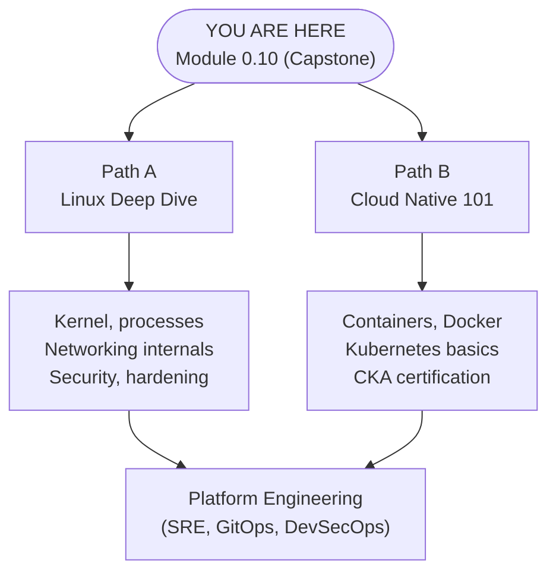

> **Complexity**: `[MEDIUM]` - Capstone project
>
> **Time to Complete**: 55-70 minutes
>
> **Prerequisites**: [Module 0.1](../module-0.1-what-is-a-computer/) through [Module 0.10](/prerequisites/zero-to-terminal/module-0.10-what-is-the-cloud/) -- all of them

---

## What You'll Be Able to Do

After this module, you will be able to:

- **Deploy** a terminal-driven web server using either a local container or a cloud VM, then explain which process is listening for requests.
- **Trace** an HTTP request from a browser through ports, networking, nginx, the filesystem, and the response path back to the user.
- **Diagnose** common first-server failures with `curl`, `docker ps`, `systemctl`, port checks, firewall checks, and careful path inspection.
- **Compare** local Docker deployment and cloud VM deployment, choosing the safer option for a learning goal, a demo, or a real public test.

---

## Why This Module Matters

Hypothetical scenario: you have just finished the first ten modules in this track, and a friend asks whether all that terminal work can actually produce something visible. You could describe files, ports, SSH, packages, and cloud VMs one topic at a time, but the stronger answer is to put a page on a server and let them open it. This capstone turns abstract skills into a running system, which is why the module is about deploying, testing, breaking, and fixing a tiny website rather than reading one more definition.

That small website is not a toy in the sense that it uses different fundamentals from professional systems. A production platform has more layers, stricter security, automation, monitoring, TLS certificates, multiple environments, and usually Kubernetes 1.35+ somewhere later in the KubeDojo journey. Underneath those layers, though, the same chain still appears: a program listens on a port, receives an HTTP request, reads or generates content, and sends a response back over the network.

You have two deployment paths because "server" can mean more than one useful thing for a beginner. Option A runs nginx locally in a container, so you can practice safely without signing up for a cloud account or exposing anything to the public internet. Option B installs nginx on a cloud VM, so you can experience SSH, package management, public IP addresses, and cloud firewalls in one focused exercise. Both paths teach the same request flow, and the important skill is not memorizing either command sequence but learning how to reason about the system when something does not respond.

---

## The Skills You've Built

This module is a capstone because it asks earlier concepts to work together at the same time. A web server is not separate from files, commands, networking, cloud, or SSH; it is where those ideas meet in a concrete workflow. If any earlier module felt isolated, this is the place where it should start to feel connected, because one browser refresh depends on almost every skill you have practiced so far.

| Module | Skill | How You'll Use It |
|--------|-------|-------------------|
| 0.1 | How computers work | Understanding what the server is actually doing |
| 0.2 | The terminal | Your only interface for this entire project |
| 0.3 | Commands | Navigating, creating files, checking status |
| 0.4 | Files and directories | Creating your website's HTML file |
| 0.5 | Editing files | Writing your web page with nano |
| 0.6 | Networking | Understanding ports, IPs, and how browsers find servers |
| 0.7 | Servers and SSH | Knowing what a server is and connecting to one in Option B |
| 0.8 | Packages | Installing software on a server |
| 0.9 | The cloud | Understanding where your server lives in Option B |

The table is also a diagnostic map. When the browser cannot load your page, you can ask which layer is failing instead of guessing randomly. A file-path problem points back to Modules 0.4 and 0.5, a port problem points back to Module 0.6, a remote-login problem points back to Module 0.7, and an installation problem points back to Module 0.8. Good troubleshooting is often just disciplined memory: name the layer, test that layer, then move to the next one.

Before you continue, pick a path for the first pass. Choose the local container path if you want the fastest and safest proof that a server can run on your own machine. Choose the cloud VM path if you specifically want the experience of publishing a page that someone else can reach from another network. You can do both, and doing both is valuable because the differences make the shared concepts easier to see.

---

## What a Web Server Actually Does

A web server is a program that waits for network requests and sends back responses. That sounds almost too simple, but the simplicity is the point: the web works because browsers and servers agree on a common protocol, HTTP, for asking and answering. Your browser does not magically read files from another computer. It opens a network connection, sends a structured request, and waits for a server program to decide what response should be returned.

nginx, pronounced "engine-X," is the server program you will use today. It is popular because it was designed around efficient connection handling, simple static-file serving, and flexible configuration, which makes it useful for tiny exercises and large production systems. In this module nginx will do one narrow job: listen for HTTP traffic, map a URL path to an HTML file, read that file from disk, and send it back with the headers your browser expects.

The restaurant analogy from earlier modules still helps, as long as you do not stretch it too far. The browser is the customer asking for a dish, nginx is the waiter receiving the order, the filesystem is the kitchen shelf where prepared dishes are stored, and the HTML file is the dish served to the table. The important detail is that the waiter must be actively on duty. A beautiful HTML file sitting on disk is not a website until a server process is listening for requests and returning it.

When you type a URL, several decisions happen quickly. If the URL contains a domain, DNS turns the name into an IP address; if the URL contains a raw IP address, that step is already done. The browser chooses a port, usually port 80 for HTTP and port 443 for HTTPS, then opens a TCP connection to the server. After the connection exists, the browser sends an HTTP request such as "GET /", and nginx turns that slash path into a file lookup.

Pause and predict: if nginx is running correctly but the file it expects is missing, what do you think the browser should show? Your answer should separate the network layer from the application layer. A missing file is different from a closed port, and a closed port is different from a cloud firewall timeout, even though all three can feel like "the website is broken" when you are staring at a browser tab.

The request path for your first server looks like this. Notice that every arrow has a test you can run later, which is why diagrams are not decoration in operations work. If a system is confusing, draw the path, write the expected handoff at each step, and test the handoffs one at a time.

| Step | Component | Question to Ask | First Test |
|------|-----------|-----------------|------------|
| 1 | Browser | Did I request the correct host and port? | Recheck the URL and port number |
| 2 | Network | Can traffic reach that IP and port? | Use browser error details or `curl` |
| 3 | Server process | Is nginx actually running? | Use `docker ps` or `systemctl status` |
| 4 | Filesystem | Is the file in the path nginx serves? | Inspect the configured web root |
| 5 | Response | Did the server return the expected HTML? | Use `curl` before blaming the browser |

This request model is the same whether nginx runs in a local container or on a cloud VM. The local path adds Docker's port mapping between your host and the container. The cloud path adds SSH, a public IP address, a provider firewall, and a package-managed nginx service. Those additions matter, but they do not change the central idea that an HTTP request must reach a listening process and that process must know which file to serve.

---

## Option A: Local Server with Docker

The local option uses a container runtime to run nginx without permanently installing nginx directly into your operating system. Docker, Podman, OrbStack, and Rancher Desktop package the application and its filesystem into an isolated environment called a container. You do not need to master container internals yet, but you do need the operational idea: a container has its own process space and filesystem, while your computer remains the host that forwards traffic into it.

Choose one container runtime and install it before running the commands. Docker Desktop is the most common path for beginners, OrbStack is a macOS-focused option, Podman Desktop emphasizes a daemonless and rootless model, and Rancher Desktop includes a Kubernetes option for later exploration. The commands in this exercise use `docker` because the official nginx image documents that workflow clearly, but the mental model applies across runtimes.

| Tool | Best for | License |
|------|----------|---------|
| [Docker Desktop](https://www.docker.com/products/docker-desktop/) | Most popular, biggest community | Free for personal/small business |
| [OrbStack](https://orbstack.dev/) | macOS option | Free for personal use |
| [Podman Desktop](https://podman-desktop.io/) | No daemon, rootless by default | Free and open source |
| [Rancher Desktop](https://rancherdesktop.io/) | Includes K8s built-in | Free and open source |

On macOS or Windows, install one of those desktop tools and start it before using the terminal. On Linux, you can install Docker or Podman through your package manager, then return to a normal shell. The Docker path may require logging out and back in after adding your user to the Docker group, because group membership is loaded when your login session starts.

```bash
# Option A: Docker
sudo apt update && sudo apt install docker.io -y
sudo systemctl start docker
sudo usermod -aG docker $USER

# Option B: Podman (no daemon, no root needed)
sudo apt update && sudo apt install podman -y
```

If you install Podman, the commands are conceptually identical, but you type `podman` instead of `docker`. Some engineers make an interactive shell shortcut so old Docker examples call Podman, but shortcuts are not a learning requirement and they can make copied examples less clear. In this module, the command examples keep the explicit `docker` name so each line shows the tool being invoked.

Verify that your runtime command is available before starting the server. This is a small habit with a big payoff: test the tool itself before testing the system built with the tool. If this command fails, the problem is installation or shell path configuration, not nginx, HTTP, ports, or your HTML file.

```bash
docker --version
```

Now run nginx in the background and publish it on your host's port 8080. The command looks dense the first time, but every flag expresses one concrete operational decision. You are creating a container, letting it keep running after the command returns, connecting a host port to a container port, assigning a friendly name, and using the official nginx image as the application package.

```bash
docker run -d -p 8080:80 --name my-website nginx
```

The `-p 8080:80` part is the most important beginner detail. The first number is the port on your computer, which is the port your browser will contact. The second number is the port inside the container, where nginx listens by default. Docker receives traffic on the host side and forwards it into the container side, which lets a containerized service appear as if it were listening directly on your machine.

> **Stop and think**: Consider the concept of network ports from Module 0.6. If a port acts as a dedicated receiving dock for network traffic on your machine, what happens at the operating system level when Docker attempts to bind to port 8080 while another background application is already actively listening on that exact same port?

Use the browser only after you have a reason to believe the process started. A browser is a friendly interface, but it compresses many different failures into a few vague messages. When you visit the local URL, you are asking the host side of Docker's port mapping to forward an HTTP request into nginx inside the container.

```
http://localhost:8080
```

You should see the default nginx welcome page. That page proves several facts at once: the container image was downloaded if necessary, the container process is running, Docker successfully bound host port 8080, nginx is listening inside the container on port 80, and the default HTML file exists where nginx expects it. One browser tab has just validated a chain of terminal, package, networking, process, and filesystem concepts.

Before you customize the page, make a prediction about file serving. Does nginx load every HTML file into memory once at startup, or does it read the requested file when a request arrives? The practical consequence matters: if nginx reads the file on request, replacing `index.html` should change the next browser refresh without restarting the container. If nginx cached the file permanently at startup, your edit would not appear until the server restarted.

Create your own HTML file on the host machine. This file begins outside the container because editing in your home directory is simple and safe. After the file exists, you will copy it into the container's web root, which is the directory nginx uses when it maps the root URL to a file.

```bash
nano ~/index.html
```

Paste this page into nano, then save with `Ctrl + O`, press Enter, and exit with `Ctrl + X`. The HTML is intentionally plain so the lesson stays focused on the server path rather than front-end design. You can customize colors and text later after you have confirmed the deployment mechanics.

```html
<!DOCTYPE html>
<html>
<head>
    <title>My First Server</title>
    <style>
        body {
            font-family: Arial, sans-serif;
            max-width: 600px;
            margin: 80px auto;
            text-align: center;
            background-color: #1a1a2e;
            color: #eee;
        }
        h1 { color: #00d4ff; }
        p { font-size: 1.2em; line-height: 1.6; }
        .badge {
            display: inline-block;
            background: #00d4ff;
            color: #1a1a2e;
            padding: 8px 20px;
            border-radius: 20px;
            font-weight: bold;
            margin-top: 20px;
        }
    </style>
</head>
<body>
    <h1>Hello, Internet!</h1>
    <p>This page is running on a server that I set up myself,
       using nothing but the terminal.</p>
    <p>I went from "what is a computer" to "I deployed a website"
       in ten modules.</p>
    <div class="badge">Zero to Terminal: Complete</div>
</body>
</html>
```

Copy the file into the running container. The destination path is not arbitrary: the official nginx Docker image serves static content from `/usr/share/nginx/html/` unless its configuration is changed. The command uses the container name you assigned earlier, which is why naming the container was more than cosmetic.

```bash
docker cp ~/index.html my-website:/usr/share/nginx/html/index.html
```

Refresh `http://localhost:8080` after the copy completes. If your page appears, you have deployed a local web server with a custom document. If the welcome page still appears, do not rerun random commands. Check whether you copied to the container named `my-website`, whether the destination path includes `/usr/share/nginx/html/index.html`, and whether the browser tab is still pointed at port 8080.

When you are done with the local server, stop and remove the container. Stopping halts the running process, while removing deletes the container instance. Your `~/index.html` file remains on the host, because that file lives outside the container in your home directory.

```bash
docker stop my-website
docker rm my-website
```

This local path is excellent for practice because mistakes are cheap. You can remove the container, rerun it with a different port, copy the page again, and repeat until the request path feels familiar. That repetition builds the mental reflex you will need later when containers run in a cluster and `kubectl` replaces a single local Docker command.

---

## Option B: Cloud Server with SSH and nginx

The cloud option changes the visibility of your work. Instead of serving a page only to your own machine through `localhost`, you create a VM with a public IP address, connect with SSH, install nginx using the operating system package manager, and let outside browsers reach port 80. This is closer to traditional server administration, and it exposes two new failure points that local Docker hides: provider firewall rules and cloud billing limits.

Free tiers change over time, so treat every provider console as the source of truth for pricing and eligibility. Oracle Cloud documents always-free resources, Google Cloud documents its free-credit and free-tier programs, and AWS EC2 free-tier eligibility depends on account cohort and current plan rules. The safe operational habit is to read the current provider page, choose the smallest eligible Linux VM, and destroy or stop resources you no longer need.

Sign up only if you are comfortable with the provider's account requirements and billing model. Create the smallest free-eligible Ubuntu VM you can find, download the SSH private key when prompted, and allow inbound SSH on port 22 plus inbound HTTP on port 80. Save the public IP address because it is the address your browser will contact after nginx is installed.

When you download the SSH key, your computer may save it with permissions that are too open for SSH to accept. The `chmod` command restricts the key file so only your user can read it, which protects the credential and satisfies SSH's safety checks. Then the `ssh` command uses that key to authenticate to the remote Ubuntu account on your VM.

```bash
chmod 400 ~/Downloads/my-key.pem
ssh -i ~/Downloads/my-key.pem ubuntu@YOUR_PUBLIC_IP
```

Replace `YOUR_PUBLIC_IP` with the actual IP address assigned to your VM, and replace the key path with the real path where your browser saved the file. If the command succeeds, the prompt changes because your terminal is now controlling a shell on the remote server. That shift is subtle but important: commands after SSH run on the cloud VM, not on your laptop.

Install nginx with the package manager. `apt update` refreshes the package index so the VM knows what versions are available, and `apt install nginx -y` installs nginx without prompting for confirmation. On Ubuntu, the package usually starts the nginx service automatically after installation, which means a running server can exist before you edit any files.

```bash
sudo apt update
sudo apt install nginx -y
```

Check the service state from the VM before opening a browser. `systemctl` talks to the service manager on the Linux machine, so it answers the question "is the nginx process supposed to be running here?" It does not prove the provider firewall allows outside traffic, and that distinction is exactly why we test one layer at a time.

```bash
sudo systemctl status nginx
```

Pause and predict: you have verified that nginx is active on the VM, but your browser at home cannot load the public IP. Which layer should you suspect first, the nginx process or the cloud firewall? A good answer explains why a local test from inside the VM can prove the backend works even while outside traffic remains blocked.

Open your browser on your own computer and visit the public IP using plain HTTP. Do not use `localhost` for the cloud path, because `localhost` always points back to the machine where the browser runs. The public IP is the address of the VM, so it is the name of the remote destination your browser must contact.

```
http://YOUR_PUBLIC_IP
```

If the default nginx page appears, the service is running and the provider firewall is open enough for HTTP. If the browser times out, the most likely problem is a security group, virtual cloud network rule, or provider firewall blocking inbound port 80. If the browser refuses the connection immediately, nginx may not be listening or may have stopped after installation. Different error shapes point to different layers, so read the message before changing configuration.

Edit the default page on the VM. Ubuntu's nginx package serves files from `/var/www/html/` by default, which differs from the official nginx Docker image path you used earlier. That difference is not a contradiction; it is configuration. The same nginx program can serve different directories depending on how it was packaged and configured.

```bash
sudo nano /var/www/html/index.html
```

Delete the default content and paste the cloud version of your page. The HTML is nearly the same as the local option, but the text states that the server is a cloud VM reached through SSH. Keeping the pages similar makes it easier to compare deployment paths without confusing the result with unrelated styling changes.

```html
<!DOCTYPE html>
<html>
<head>
    <title>My First Cloud Server</title>
    <style>
        body {
            font-family: Arial, sans-serif;
            max-width: 600px;
            margin: 80px auto;
            text-align: center;
            background-color: #1a1a2e;
            color: #eee;
        }
        h1 { color: #00d4ff; }
        p { font-size: 1.2em; line-height: 1.6; }
        .badge {
            display: inline-block;
            background: #00d4ff;
            color: #1a1a2e;
            padding: 8px 20px;
            border-radius: 20px;
            font-weight: bold;
            margin-top: 20px;
        }
    </style>
</head>
<body>
    <h1>Hello, Internet!</h1>
    <p>This page is running on a real cloud server that I set up myself,
       using nothing but SSH and the terminal.</p>
    <p>I went from "what is a computer" to "I deployed a website
       on the internet" in ten modules.</p>
    <div class="badge">Zero to Terminal: Complete</div>
</body>
</html>
```

Refresh `http://YOUR_PUBLIC_IP` after saving. If the custom page appears, your browser is crossing the internet to a VM, nginx is receiving the request on port 80, nginx is reading `/var/www/html/index.html`, and the response is returning successfully. That is a real deployment, even though the page is intentionally small.

Stop and think: the web server translates URL paths into filesystem paths under a configured web root. If nginx maps the root URL `/` to `/var/www/html/`, what browser path would request an image saved at `/var/www/html/assets/logo.png`? The answer is not the full Linux path, because the browser never sees the server's private directory layout; it sees the URL path that nginx maps into that directory.

Use `curl` when the browser result is ambiguous. A browser renders HTML, caches resources, hides some headers, and may retry requests in ways that obscure the simple request-response exchange. `curl` makes the exchange plain by sending an HTTP request and printing the response body or status information in the terminal, which is why it is a favorite first diagnostic tool for web servers.

For the cloud path, run `curl http://localhost` from inside the SSH session when you want to test nginx without involving the provider firewall. If that works, nginx and the filesystem are healthy on the VM. Then run `curl http://YOUR_PUBLIC_IP` from your own machine when you want to test the external path. Those two tests separate "server works locally" from "outside traffic can reach the server."

When the exercise is done, disconnect from SSH and clean up the cloud resource according to your provider's console. A local container left running costs battery and a little memory; a cloud VM left running can cost money if it exceeds a free tier or if an attached resource is not covered. Treat cleanup as part of deployment discipline, not as an optional afterthought.

```bash
exit
```

---

## Reading Server Symptoms Like an Operator

Once you have seen both deployment paths, the most valuable practice is learning to read symptoms without panic. A server failure usually gives you clues about which layer rejected, ignored, or never received the request. Beginners often collapse every symptom into "nginx is broken," but an operator separates the path into client, host, port, process, configuration, and file. That separation is what turns troubleshooting from superstition into a repeatable method.

Start with the wording and timing of the failure. A fast "connection refused" usually means the client reached the host, but nothing accepted the connection on that port. A long timeout often means traffic disappeared before reaching a listener, which is why cloud firewalls and provider security rules are common suspects. A rendered nginx error page means the network path and process are alive, so the remaining question is usually about the requested path, permissions, or served file.

The local Docker path gives you a clean place to practice this reading. If `localhost:8080` refuses the connection, you should ask whether Docker published host port 8080 and whether the container is running. If `localhost:9090` works after you accidentally started the container with `-p 9090:80`, the server was healthy and only the client URL was wrong. If the nginx welcome page appears after you copy your custom file, the port path works but the file path or copy destination is wrong.

The cloud VM path adds a different diagnostic split. If `curl http://localhost` succeeds inside the SSH session while your browser at home times out, nginx is serving locally and the outside network path is blocked. If local `curl` fails on the VM, the provider firewall is not the first issue because the request never leaves the machine. That is why inside-out testing is not merely tidy; it prevents you from changing a cloud rule when the service is stopped or editing an HTML file when port 80 is closed.

It also helps to name the authority for each fact. Docker is the authority for whether a container exists and which host ports are published. `systemctl` is the authority for whether Ubuntu thinks the nginx service is active. The cloud console is the authority for provider firewalls and public IP assignment. The filesystem is the authority for whether `index.html` exists in the web root. `curl` is the authority for what a simple HTTP client receives from a specific URL at a specific moment.

Before running another fix command, ask yourself which authority can answer the next question. If the question is "did my browser request the right port," the answer is in the URL and Docker's published ports. If the question is "does nginx read my custom page," the answer is in the web-root path and the `curl` response. If the question is "can the internet reach my VM," the answer is in external testing plus the provider firewall, not in the text editor.

This discipline is the beginning of production thinking. Real deployments have load balancers, TLS certificates, service discovery, container orchestration, health probes, logs, metrics, and rollout strategies, but the habit stays the same. You define the expected path, test the nearest layer, and move outward only after the inner layer is proven. A small nginx page is enough to teach that habit because the path is simple enough to hold in your head.

There is one more reason to practice symptom reading here: it reduces fear. The first time a server does not answer, it can feel like the whole system is opaque. After you have intentionally broken a port mapping and intentionally moved an index file out of the web root, the same failures become recognizable shapes. Recognition is powerful because it lets you slow down, gather evidence, and make one targeted change instead of many nervous changes.

Think of the server as a series of doors. The browser must knock on the right address, the network must deliver the knock to the right machine, the port must have a listener behind it, nginx must know which shelf to check, and the file must be on that shelf. If a door is closed, the fix is not to repaint every door. The fix is to identify which door is closed, open that one, and test the path again.

This is also why the capstone asks you to break the deployment on purpose. Controlled failure teaches more than a lucky first success because it gives you a known cause and an observable effect. When you change only the host port, you learn how a wrong URL behaves. When you rename `index.html`, you learn how a healthy server behaves when the expected file is absent. Those memories become reference points for future debugging.

Finally, keep your explanations concrete. "The server is down" is too vague to be useful unless you already know which server process, which machine, and which port you mean. "nginx is running on the VM, local `curl` returns my HTML, but external HTTP times out" is a useful sentence because it narrows the fault to outside reachability. The more precise sentence is not fancy; it is simply a better tool.

When you can produce that kind of sentence, you are no longer just following the module. You are practicing the same reasoning that will later help with containers, Kubernetes Services, ingress controllers, cloud load balancers, and production incident response. The tools will change and the systems will get larger, but the first move remains familiar: trace the request, test the layer, and explain the evidence before changing the system.

---

## Patterns & Anti-Patterns

The strongest pattern in this module is to test from the inside outward. First prove the server process is running, then prove it serves the expected file locally, then prove the correct port is reachable from the client side. This pattern prevents a common beginner spiral where someone edits HTML, changes firewall rules, restarts services, and reruns containers without knowing which layer failed.

Another useful pattern is to keep names and paths explicit while learning. Naming the container `my-website`, typing the full web-root path, and writing the intended URL in your notes may feel slow, but explicitness gives you handles for diagnosis. Later, when tools automate deployment, the same precision will show up as service names, labels, manifests, and routing rules.

A third pattern is choosing the smallest environment that proves the thing you need to learn. If your learning goal is "how does nginx respond to a browser request," local Docker is enough and avoids cloud account risk. If your learning goal is "how do SSH, public IPs, and cloud firewalls affect a server," a VM is the right environment because local Docker hides those layers.

| Pattern | When to Use It | Why It Works |
|---------|----------------|--------------|
| Test inside-out | Browser cannot reach a page | Separates server health from external network reachability |
| Keep paths explicit | Learning a new runtime or package layout | Prevents Docker and Ubuntu nginx paths from blending together |
| Prefer the smallest useful environment | Practicing a concept for the first time | Reduces cost, risk, and unrelated failure modes |

The matching anti-pattern is troubleshooting from the outside only. If you refresh a browser twenty times without checking whether the process is running, you are asking the least precise tool to answer the most important question. Browsers are excellent clients, but they are not complete diagnostic instruments, and they are especially weak when multiple layers can produce similar visible failures.

Another anti-pattern is treating defaults as universal facts. Docker's nginx image uses `/usr/share/nginx/html/`, while Ubuntu's nginx package commonly uses `/var/www/html/`. Neither path is the "real" nginx path in all situations. The real path is the path configured in that installation, which is why professional engineers inspect configuration and documentation rather than relying only on memory.

The final anti-pattern is leaving public resources around because the exercise felt small. A VM with a public IP is infrastructure, not a worksheet. It may have billing consequences, security exposure, or stale software if forgotten. The better habit is to decide before you create the resource whether it will be stopped, terminated, or kept for a specific next task.

---

## Decision Framework

Use the local container path when you want fast feedback, a reversible setup, and no public exposure. It is the best first choice if your main objective is to connect files, ports, nginx, and browser requests. It also lets you practice breaking and fixing the deployment repeatedly, because removing a container is low risk and rebuilding it takes only one command.

Use the cloud VM path when the learning objective includes remote administration. SSH key permissions, package installation, service state, public IP addresses, and cloud firewalls are not side details; they are the reason to choose the VM path. The tradeoff is that you must be more careful with billing, cleanup, and public reachability.

Use both paths if you want the clearest mental model. Run local Docker first, then deploy to a VM and compare what changed. You will see that nginx, HTTP, ports, and files are common to both paths, while container port publishing, SSH, provider firewalls, and package-managed services are environment-specific details.

| Decision | Choose Local Docker | Choose Cloud VM |
|----------|---------------------|-----------------|
| Need no signup | Yes | No |
| Need a public page | No | Yes |
| Want to practice SSH | No | Yes |
| Want fastest reset | Yes | Sometimes |
| Need to avoid billing risk | Yes | No |
| Want infrastructure realism | Partial | Stronger |

Which approach would you choose here and why: you need to demonstrate to a nontechnical friend that your terminal can publish a visible page within ten minutes, but you do not want to create any accounts or risk charges. The best answer is local Docker, because the goal is visibility on your own machine and the constraints make public reachability unnecessary. If the friend must open the page from their phone on another network, the answer changes because the requirement changes.

---

## Did You Know?

- [**The first website ever made is still online.**](https://home.cern/tags/first-website) Tim Berners-Lee created the first website at CERN during the Web's earliest days. It was [served from a NeXT computer with a handwritten note taped to it: "This machine is a server. DO NOT POWER IT DOWN!!"](https://home.cern/science/computing/birth-web/short-history-web), and you can still visit the historical copy at [info.cern.ch](http://info.cern.ch).
- **nginx was created to solve a scaling problem.** In 2002, Igor Sysoev began work connected to the "C10K problem," the challenge of serving 10,000 simultaneous connections on one server. The [official nginx site](https://nginx.org/en/) and the [official NGINX engineering write-up](https://blog.nginx.org/blog/inside-nginx-how-we-designed-for-performance-scale) explain the event-driven architecture behind that design.
- **Port 80 is conventional, not magical.** HTTP clients assume port 80 when a URL starts with `http://` and does not specify a port, but a server can listen on another port if the client includes it explicitly. That is why `localhost:8080` works for the Docker path while the cloud path uses `http://YOUR_PUBLIC_IP` without a port suffix.
- **The same nginx binary can serve different directories.** The official nginx Docker image serves from `/usr/share/nginx/html/` by default, while Ubuntu's nginx package commonly serves from `/var/www/html/`. That difference is a packaging and configuration choice, not a contradiction in how web servers work.

---

## Common Mistakes

| Mistake | Why It Happens | How to Fix It |
|---------|----------------|---------------|
| Forgetting to open port 80 in the cloud firewall | SSH works on port 22, so the VM feels reachable even while HTTP is blocked | Allow inbound HTTP on port 80 in the provider security group or firewall, then test again |
| Using `http://localhost` for the cloud option | `localhost` always means the machine running the browser, not the remote VM | Use the VM's public IP address when testing from your own computer |
| Editing the wrong `index.html` path | Docker and Ubuntu package layouts use different web roots | Use `/usr/share/nginx/html/index.html` for the official nginx container and `/var/www/html/index.html` for Ubuntu nginx |
| Forgetting `sudo` on the cloud VM | Web files under `/var/www/html/` are usually owned by root | Use `sudo nano /var/www/html/index.html` or adjust ownership deliberately in a later, more advanced setup |
| Mapping the wrong Docker ports | The host port and container port look similar but mean different things | Use `-p 8080:80` for this exercise and visit `http://localhost:8080` |
| Blaming the browser before testing the server | Browser errors hide whether the failure is process, port, firewall, or file path | Use `docker ps`, `systemctl status nginx`, and `curl` to isolate the failing layer |
| Leaving a cloud VM running after practice | Free tiers have rules, limits, and resources that can outlive the lesson | Stop or terminate the VM when the exercise is complete unless you intentionally need it for the next task |

---

## Quiz

<details>
<summary>1. Your local Docker deployment says the container started, but `http://localhost:8080` gives a connection error. How do you diagnose the path without guessing?</summary>

Start with `docker ps` to verify the container is still running and to inspect the published port mapping. If the mapping is not `0.0.0.0:8080->80/tcp` or similar, your browser is probably knocking on the wrong host port. If the container is absent, check whether it exited immediately and inspect logs in a later Docker lesson; for this exercise, recreate it with the known-good command. This answer matters because it separates container state from browser behavior before you edit files that may already be correct.
</details>

<details>
<summary>2. You copied `index.html` into `/var/www/html/index.html` inside the official nginx container, but the welcome page still appears. What went wrong, and how do you fix it?</summary>

The official nginx container serves static files from `/usr/share/nginx/html/` by default, so you copied the file into a directory nginx is not using. The fix is to copy the file to `my-website:/usr/share/nginx/html/index.html` or to change nginx configuration in a more advanced exercise. This is not a browser cache problem by default; it is a configuration-path problem. The lesson is that file paths belong to specific environments, and Docker image defaults can differ from Ubuntu package defaults.
</details>

<details>
<summary>3. Your cloud VM shows `active (running)` for nginx, but a coworker on another network sees a timeout when visiting the public IP. What should you check next?</summary>

A timeout after the service is confirmed running usually points to network reachability, especially a provider firewall or security group that blocks inbound port 80. Run `curl http://localhost` from inside the VM to prove nginx serves a response locally, then inspect the cloud firewall rule for HTTP. If local `curl` fails, fix nginx or the file path first; if local `curl` succeeds, focus on external routing. This sequence prevents you from restarting a healthy service when the real issue is outside the VM.
</details>

<details>
<summary>4. You need to explain the request path for `http://YOUR_PUBLIC_IP` to a teammate. What steps should your explanation include?</summary>

Because the URL uses a raw IP address, DNS lookup is not the main event, although domain-based sites would need DNS first. The browser opens a TCP connection to that IP on port 80, sends an HTTP GET request for `/`, and nginx receives it because it is listening on that port. nginx maps `/` to the configured web root, reads `index.html`, and sends an HTTP response back through the same connection. The explanation should mention the browser, TCP, port 80, nginx, the filesystem, and the response, because leaving out one layer makes troubleshooting harder later.
</details>

<details>
<summary>5. You are choosing between local Docker and a cloud VM for a first demo. The demo must be safe, free, and repeatable, but it does not need to be visible outside your laptop. Which option should you choose?</summary>

Choose local Docker for that demo because it satisfies the learning goal with less risk and fewer unrelated variables. It still teaches the core server model: nginx listens on a port, Docker forwards traffic, and the browser receives HTML. The cloud VM would add SSH, provider networking, public exposure, and billing considerations that are not required by the scenario. A cloud VM becomes the better choice only when public reachability or remote administration is part of the goal.
</details>

<details>
<summary>6. You edited the cloud page with nano and saved it, but the browser still shows the old default page. What exact checks help you decide whether this is a file, service, or URL issue?</summary>

First confirm you edited `/var/www/html/index.html` on the VM, not a local file or the container path from Option A. Next run `curl http://localhost` inside the SSH session to see whether nginx returns your new HTML from the server itself. If local `curl` returns the new page while the browser does not, check whether the browser is pointed at the correct public IP and refresh carefully. If local `curl` returns the old page, the file path or save operation is wrong, not the outside network.
</details>

<details>
<summary>7. You intentionally broke the Docker exercise by running `docker run -d -p 9090:80 --name broken-site nginx`, then visited `localhost:8080`. Why does that fail, and what is the clean repair?</summary>

It fails because the host port changed to 9090, while your browser is still requesting 8080. Docker is forwarding host port 9090 into container port 80, so port 8080 no longer has the nginx listener behind it. The clean repair is either to visit `http://localhost:9090` for the broken-site container or recreate the container with `-p 8080:80` if the exercise requires the original URL. This is a port-mapping problem, not an HTML problem.
</details>

---

## Hands-On Exercise: Make It Yours

Exercise scenario: you have deployed the template page and now need to prove that you can customize, test, break, diagnose, and repair a first server without relying on a GUI website builder. Choose either the local Docker path or the cloud VM path from the module, then keep a short troubleshooting log as you work. The log can be a few lines in a text file, but it should record the URL you tested, the symptom you observed, the command you ran, and the conclusion you reached.

### Task 1: Customize the Page

Update your page so it includes your name or a pseudonym, three things you learned in this track, and one link to a site you would actually revisit. The goal is not visual polish; the goal is proving that you can edit a file, place it in the correct web root, and make nginx serve the version you intended.

```html
<a href="https://kubedojo.dev" style="color: #00d4ff;">KubeDojo</a>
```

<details>
<summary>Solution guidance</summary>

For the local Docker path, edit `~/index.html`, save it, and copy it into `my-website:/usr/share/nginx/html/index.html`. For the cloud path, connect with SSH and edit `/var/www/html/index.html` using `sudo nano`. After saving, refresh the correct URL and use `curl` if the browser result is unclear. If you are unsure whether you edited the right file, add a very obvious temporary sentence to the HTML and test again.
</details>

### Task 2: Test Before You Trust the Browser

Use a terminal-based HTTP test before relying on the browser. For local Docker, test the host URL you published, such as `http://localhost:8080`. For the cloud VM, test `http://localhost` from inside the SSH session and then test the public IP from your own machine if you want to confirm external reachability.

<details>
<summary>Solution guidance</summary>

The expected result is the raw HTML of your page or an HTTP response that clearly indicates nginx answered. If the terminal returns your custom `<h1>` text, nginx is serving the correct file and the browser is no longer your only evidence. If the terminal cannot connect, return to the process and port checks before editing HTML again.
</details>

### Task 3: Break the Deployment Deliberately

Introduce one controlled failure and write down the symptom before fixing it. For Option A, stop and remove your working container, then start a replacement with a different host port such as `docker run -d -p 9090:80 --name broken-site nginx`; visiting the old 8080 URL should fail. For Option B, rename `/var/www/html/index.html` to `/var/www/html/broken.html`; the root URL should no longer show the custom page.

<details>
<summary>Solution guidance</summary>

The Docker failure teaches host-port mapping, so the diagnosis should mention that 8080 no longer forwards to nginx. The cloud failure teaches web-root file lookup, so the diagnosis should mention that nginx still runs but no longer finds the expected `index.html` at the root path. In both cases, the failure is intentional, which means you should be able to explain it before repairing it.
</details>

### Task 4: Repair and Explain the System

Repair the deployment so the original expected URL works again. Then explain the request path out loud or in writing, starting with the browser and ending with the HTML response. Include the port, nginx, and the filesystem path in the explanation, because those are the layers most beginners accidentally skip.

<details>
<summary>Solution guidance</summary>

For Docker, recreate or replace the container with the intended `-p 8080:80` mapping and copy the page back to `/usr/share/nginx/html/index.html`. For the cloud VM, rename the file back to `/var/www/html/index.html` or recreate it with `sudo nano`, then test with `curl http://localhost` before using an outside browser. A strong explanation names both what failed and why the repair addressed that exact layer.
</details>

### Success Criteria

- [ ] Your custom page loads in a browser at either `http://localhost:8080` or the VM public IP.
- [ ] The page includes your name or pseudonym, three track takeaways, and at least one link.
- [ ] You edited the page through the terminal and placed it in the correct nginx web root.
- [ ] You used a terminal HTTP test to confirm the server response before or alongside the browser.
- [ ] You deliberately broke the server, recorded the symptom, diagnosed the layer, and repaired it.
- [ ] You can compare the local Docker path with the cloud VM path using ports, files, SSH, and firewall concepts.

The success criteria are intentionally broader than "the page loaded once." A first server is useful only if you can reason about it when it stops working. If you can explain why a wrong port causes one error, why a wrong file path causes another, and why a cloud firewall can block an otherwise healthy server, you have moved beyond copying commands into actual operations thinking.

---

## Sources

- [Docker Desktop](https://www.docker.com/products/docker-desktop/)
- [Docker Personal Subscription](https://www.docker.com/products/personal/)
- [Docker run reference](https://docs.docker.com/reference/cli/docker/container/run/)
- [nginx Docker Official Image overview](https://hub.docker.com/_/nginx)
- [nginx official site](https://nginx.org/en/)
- [Inside NGINX: How We Designed for Performance & Scale](https://blog.nginx.org/blog/inside-nginx-how-we-designed-for-performance-scale)
- [A typical HTTP session](https://developer.mozilla.org/en-US/docs/Web/HTTP/Guides/Session?hl=en-US)
- [Oracle Cloud Free Tier FAQ](https://www.oracle.com/cloud/free/faq/)
- [Oracle Cloud Free](https://cloud.oracle.com/free)
- [Google Cloud free tier](https://cloud.google.com/free/docs/gcp-free-tier)
- [Google Cloud Free](https://cloud.google.com/free)
- [Amazon EC2 Free Tier](https://docs.aws.amazon.com/AWSEC2/latest/UserGuide/ec2-free-tier-usage.html)
- [AWS Free Tier](https://aws.amazon.com/free)
- [The first website](https://home.cern/tags/first-website)
- [A short history of the Web](https://home.cern/science/computing/birth-web/short-history-web)
- [The birth of the Web](https://home.cern/science/computing/birth-web)
- [First website historical copy](http://info.cern.ch)

---

## Next Module

You have finished **Zero to Terminal**. From here, choose [Linux Fundamentals](/linux/) if you want to go deeper into operating systems, or start [Cloud Native 101](/prerequisites/cloud-native-101/module-1.1-what-are-containers/) if you want to turn this first server into a foundation for containers and Kubernetes.



Both paths build on the same request-response model you practiced here. Linux deepens your understanding of processes, filesystems, permissions, and networking internals, while Cloud Native 101 shows how containers and orchestration turn single-server lessons into repeatable deployment patterns. Pick the path that makes you want to open a terminal again, and keep the habit this module taught: trace the system before you change it.
