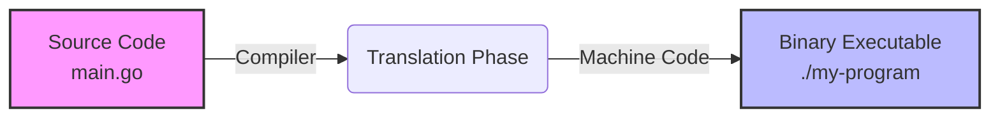
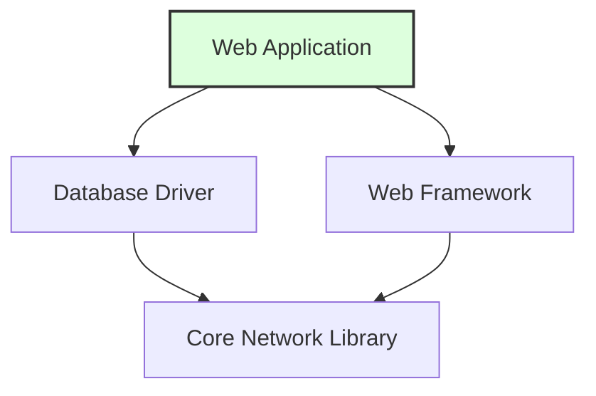

> **Complexity**: `[QUICK]` - Absolute beginner
>
> **Time to Complete**: 25-30 minutes
>
> **Prerequisites**: [Module 0.7: What is Networking?](/prerequisites/zero-to-terminal/module-0.7-what-is-networking/) - You should be comfortable with the terminal, files, and basic networking concepts.

---

## What You'll Be Able to Do

After this module, you will be able to install useful command-line tools, choose the right package-management workflow for your operating system, and inspect what a package brings onto your machine before you trust it in daily engineering work.

- **Execute** software installations from the terminal using your OS's package manager.
- **Compare** package managers such as `apt`, `brew`, and `dnf` so you can choose the right tool for a given operating system.
- **Evaluate** the security and stability implications of updating or removing packages on a development machine or server.
- **Diagnose** dependency requirements by extracting package metadata about installed software and its supporting libraries.

## Why This Module Matters

Hypothetical scenario: You are onboarding to a Kubernetes 1.35+ learning environment, and the setup guide asks you to install `kubectl`, `helm`, `kind`, `htop`, and a text editor. If you treat each tool as a separate website download, every machine becomes a slightly different snowflake: one laptop has an older binary, another has the wrong CPU build, and a server is missing a support library that nobody remembered to document. Package managers reduce that chaos by turning installation into repeatable commands that can be reviewed, copied, automated, and updated later.

The same habit matters outside labs. Engineers use package managers to patch vulnerable utilities, install diagnostics during incidents, keep development laptops close to production environments, and remove tools that no longer belong on a host. A package manager is not magic, and it is not risk-free, but it gives you a controlled path through a messy problem: software is made of files, versions, permissions, repositories, dependencies, signatures, and installation scripts. Learning that path early will make future container, cloud, and Kubernetes modules feel much less mysterious.

In this module you will build a practical mental model for software installation from the terminal. You will see how source code becomes a program, why packages exist, what `sudo` changes, how dependencies are resolved, and how to install, update, remove, search, and inspect small tools. The goal is not to memorize every package-manager flag. The goal is to recognize the workflow well enough that a new command such as `brew info`, `apt show`, or `dnf install` feels like a variation on a pattern you already understand.

## Software, Source Code, and Executables

Software is a set of instructions that tells a computer what to do, but that simple definition hides several layers. When you open a browser, play a video, run `ls`, or start a Kubernetes client, you are asking the operating system to load files from disk into memory and execute instructions through the processor. Some of those instructions were written by people as readable text, some were generated by build tools, and some arrived on your machine already packaged by another maintainer.

Here is the smallest possible kind of software example in Python. The line is ordinary text, and you can read the instruction without knowing much about how processors work. Python itself does the work of interpreting that text and asking the operating system to display a result.

```python
print("Hello, World!")
```

That one line gives you the first important separation: source code is for humans and tools, while running programs are for the operating system and processor. A programming language is like a recipe language with strict grammar. The computer is an extremely literal cook; it will follow valid instructions quickly, but it will not guess what you meant when punctuation, indentation, filenames, permissions, or dependency versions are wrong.

Some languages produce an executable file before you run them. Go, C, C++, and Rust commonly follow this model, which means source code is translated into machine code by a compiler. The example below is still readable by a human, but your processor does not execute the words `package`, `import`, or `fmt.Println` directly.

```go
package main

import "fmt"

func main() {
    fmt.Println("Hello from Go!")
}
```

The journey from readable code to a program you can run has several stages. You do not need to become a compiler expert to install tools, but you do need to know that an executable is the output of a build process, not just a random file with a friendly name. That distinction explains why package maintainers spend so much effort building software for specific operating systems, CPU architectures, and dependency versions.

```
Source Code  ->  Compiler  ->  Binary (executable)
(recipe)        (translator)  (the finished dish, ready to serve)
```



Once the binary exists, execution is much simpler from the user's point of view. The operating system checks whether the file is executable, loads it, and starts the process. That is why many tools can be run by typing a path or command name after installation.

```bash
./my-program
```

The terminal might then print the result the program was written to produce. If you compiled the Go example above into `my-program`, the visible output would be the text below, and the program would exit after doing exactly one job.

```bash
Hello from Go!
```

Not every language makes you compile first. Python is usually interpreted, JavaScript may be interpreted or compiled just in time, and many cloud-native tools are distributed as ready-made binaries that you never build yourself. The important beginner lesson is that installation means placing the right executable files, libraries, metadata, and support files where the operating system and shell can find them reliably.

Pause and predict: if a processor ultimately runs machine instructions, what has to be true before a command like `htop` can work from any terminal window? Think through the path from source code, to packaged files, to an executable location, to your shell finding the command name without you typing a full path.

## Packages and Package Managers

Installing from source manually is possible, but it is a poor default for beginners and a fragile default for teams. Without a package, you would download source code, install the correct compiler, choose build options, compile for your CPU, move files into system directories, record what you installed, and remember how to remove or update everything later. That is a lot of hidden work for a single tool, and every manual step creates another place where two machines can drift apart.

A package wraps that work into a structured bundle. It usually contains already-built files, metadata about the version and maintainer, dependency declarations, checksums or signatures, and instructions for where files should land. A package is like a meal kit: the ingredients and recipe are still real, but someone prepared a consistent box so you do not have to rediscover the whole supply chain every time you want dinner.

A package manager is the tool that knows where packages live, how to download them, how to verify them, how to install them, and how to reverse or upgrade the installation later. Instead of browsing a website, choosing a download button, and hoping you picked the right file, you ask the package manager to install a named package from a configured catalog. That catalog is called a repository in many Linux systems and a tap or formula source in Homebrew.

```bash
sudo apt install htop
brew install htop
```

Those two commands express the same goal on different platforms. On Ubuntu or Debian, `apt` installs software into system-managed locations and normally needs administrator privileges. On macOS, Homebrew usually installs into a Homebrew-managed prefix and is designed to work without `sudo` for normal package operations. The details differ, but the pattern is stable: search the catalog, resolve dependencies, download files, install them, and record what happened.

| Package Manager | Operating System | Install Command |
|-----------------|------------------|-----------------|
| **apt** | Ubuntu, Debian (Linux) | `sudo apt install package-name` |
| **dnf** / **yum** | Fedora, RHEL, CentOS (Linux) | `sudo dnf install package-name` |
| **brew** (Homebrew) | macOS (and Linux) | `brew install package-name` |
| **pacman** | Arch Linux | `sudo pacman -S package-name` |
| **choco** | Windows | `choco install package-name` |

This curriculum mostly uses `apt` on Linux and `brew` on macOS because those are common choices for the environments you will encounter early. That does not make the other tools unimportant. Fedora's `dnf`, Arch's `pacman`, and Windows package managers solve the same family of problems with different commands, policies, and repository ecosystems. Once you recognize the concepts, learning a new package manager becomes a translation exercise instead of a new discipline.

Package managers also create an audit trail. You can ask what is installed, which version you have, which repository it came from, and which other packages it needs. That is much better than relying on memory or a folder full of downloaded installers. When a future module asks you to install `kubectl`, you should immediately think about the same questions: which package source is trusted, which version do I need, what else is installed with it, and how will I update it when Kubernetes moves forward?

Exercise scenario: You are preparing two laptops for a study group. One runs Ubuntu, and the other runs macOS. You want both learners to install `htop`, `tree`, and eventually Kubernetes tooling without creating a pile of manual steps. The right answer is not one universal command; the right answer is one repeatable package-management workflow per operating system, written down clearly enough that each learner can run it and inspect the result.

The package manager also helps you communicate setup instructions as engineering artifacts rather than personal memory. A written command such as `sudo apt install tree` can be reviewed, versioned in documentation, repeated in a lab, and compared with a teammate's command history. A sentence like "I downloaded the tool from the website" leaves too many questions unanswered: which website, which file, which version, which architecture, and which update path?

## Privilege, Trust, and `sudo`

Package installation changes files that affect more than one terminal session. On a Linux system, installing a package may write into `/usr/bin`, `/usr/lib`, `/etc`, service directories, manual pages, desktop integration paths, and package databases. Regular users are not allowed to change those locations by default because a mistake there can break the operating system or create a security problem for every user on the machine.

That is where `sudo` enters the workflow. The name is commonly explained as "superuser do": run this one command with elevated privileges after checking that the current user is allowed to do so. You authenticate with your normal user password, the command runs with administrator-level authority, and `sudo` can log the privileged action for auditing. It is a temporary key, not a permanent personality change.

```bash
apt install htop
sudo apt install htop
```

The first command is intentionally missing `sudo`, so on a typical Ubuntu or Debian system it fails when the package manager tries to modify protected locations. The second command asks for temporary administrative privileges and can proceed if your user is permitted. This is not busywork. It is a safety boundary that forces you to notice when a command is about to change the system rather than only your home directory.

When `sudo` prompts for a password, the terminal usually shows no dots, stars, or placeholder characters while you type. That silence is deliberate. It prevents someone nearby, or someone watching a screen share, from learning the length of your password. Type the password carefully and press Enter; the keyboard is still working even though the screen does not echo the characters.

Homebrew takes a different path for day-to-day package management. Its normal design is to install packages into a Homebrew-managed location that your user can write to, so you usually do not put `sudo` in front of `brew install`. Using `sudo` with Homebrew can create permission mismatches that make future installs and upgrades harder. Different package managers have different privilege models, so copy commands with context instead of treating `sudo` as decoration.

```bash
brew install htop
```

Trust is the other half of privilege. A package manager may run maintainer scripts, place binaries on your `PATH`, start services, or install libraries that other programs will load. That does not mean package managers are unsafe; it means installation is a security decision. Prefer official repositories, vendor documentation, and well-known package sources, and be especially cautious with commands copied from random comments or scripts that pipe a network download directly into a shell.

Before running this, what output do you expect from `apt install tree` without `sudo` on a Linux system? Write down your prediction first, then try it in a disposable lab or local machine where you are allowed to test. Reading the exact error message teaches you more than memorizing a warning, because real troubleshooting starts with what the system actually said.

Privilege should feel deliberate, not scary. The healthiest habit is to pause when a command asks for administrator authority and ask what protected resource it needs. Installing a system package is a reasonable use of that authority; editing random files under `/usr` by hand usually is not. This pause becomes more important when you later install container runtimes, cloud CLIs, and Kubernetes helpers that can affect networking, credentials, or background services.

## Dependencies and Version Constraints

Software rarely works alone. A web application might depend on a database driver, a command-line tool might depend on a terminal UI library, and a Python application depends on Python plus additional packages. These supporting pieces are dependencies. They are not optional extras; they are part of what makes the requested software run correctly.



A package manager reads dependency metadata and builds an installation plan. If you ask for one program, the plan may include several libraries, helper tools, certificates, language runtimes, or data packages. Beginners sometimes worry that the package manager is doing something suspicious because it downloads more than they typed. In many cases, that extra work is exactly the reason you are using the package manager in the first place.

```bash
sudo apt install some-program
```

A typical package manager output may show additional packages before asking for confirmation. The exact names will vary by distribution, repository state, and package version, but the shape of the message is important: the manager is explaining the dependency chain before it changes the system.

```bash
Reading package lists... Done
The following additional packages will be installed:
  dependency-1 dependency-2 dependency-3
```

Dependencies become difficult when versions disagree. Program A may require version 1.0 of `libfoo`, while Program B requires version 2.0 of the same library. If the operating system permits only one global version in the relevant location, one program may break when the other is satisfied. This family of problems is often called dependency hell, and it is one reason containers, virtual environments, and language-specific package managers became central to modern engineering.

Package managers cannot remove all version tension, but they can make it visible and manageable. They maintain databases of installed versions, calculate compatible dependency sets, refuse impossible upgrades, and show which packages will be installed, removed, or held back. That is a major improvement over a manual folder of downloaded binaries, where you may not even know which file introduced an incompatible library.

Dependency inspection is a diagnostic skill, not trivia. When a production host suddenly behaves differently after an update, engineers ask what package changed, what dependency changed with it, and whether a service is now loading a different library. When a development laptop cannot run a tool, engineers check whether a dependency is missing or pinned to the wrong version. The package manager's metadata gives you the starting evidence for those questions.

Pause and predict: imagine one command-line app strictly requires `libfoo` version 1.0 and another strictly requires `libfoo` version 2.0. If your operating system has one shared library location for that dependency, which app becomes risky to install second, and why might a container or isolated environment make the conflict easier to manage?

This is also why "it installed successfully" is not the same as "the system is in the desired state." A package can install while pulling in a newer library than expected, leaving an old configuration file untouched, or enabling a service that still needs manual setup. Package managers handle a large part of the mechanical work, but verification remains your responsibility. The right question after an install is what changed and whether the tool now behaves as required.

## Installing, Updating, Removing, and Searching

Package managers normally separate refreshing metadata from installing packages. On Ubuntu and Debian, `apt update` downloads the latest package indexes from configured repositories. It does not upgrade every installed package by itself; it refreshes the local catalog so later install or upgrade commands are based on current information. That distinction matters when a package was released recently or a security fix has just arrived.

```bash
sudo apt update
```

On macOS, Homebrew has its own metadata update workflow. If Homebrew is not installed yet, the official installer command is published by the Homebrew project. Treat commands like this with respect because they download and execute an installer; use the official documentation, read the command, and understand why it is different from installing an ordinary formula.

```bash
/bin/bash -c "$(curl -fsSL https://raw.githubusercontent.com/Homebrew/install/HEAD/install.sh)"
```

Once Homebrew is present, update its package metadata before installing or upgrading tools. This is the Homebrew equivalent of refreshing the catalog so your local machine knows about current formula definitions.

```bash
brew update
```

Now you can install a small monitoring tool. `htop` is useful because it gives a live terminal view of CPU usage, memory usage, running processes, process IDs, and resource consumption. It is also a good beginner package because the installation is small, the command is easy to launch, and quitting is simple once you know the key.

```bash
sudo apt install htop
```

The same package on macOS uses Homebrew's command shape. Notice that the package name stays the same while the package manager and privilege model change. That is the comparison habit you want to develop.

```bash
brew install htop
```

After installation, launch the program from the terminal. You will see an interactive display with process rows and resource bars. Press `q` to quit when you are done exploring, because terminal programs often have keyboard controls rather than graphical close buttons.

```bash
htop
```

The next tool, `tree`, helps you visualize directories. Earlier modules asked you to create files and folders; `tree` turns that nested structure into a readable outline. It is especially useful when you need to explain a project layout, compare expected files with actual files, or include a directory snapshot in troubleshooting notes.

```bash
sudo apt install tree
```

On macOS, use the Homebrew form. Again, do not treat the Linux and macOS commands as interchangeable, because the operating systems use different package stores and privilege assumptions.

```bash
brew install tree
```

Once installed, run `tree` against a practice directory. If you completed the earlier file-system exercise, the path below should produce a small recipe-style structure. If that directory does not exist on your machine, the command will fail with a clear "No such file or directory" style message, which is useful feedback rather than a disaster.

```bash
tree ~/kubedojo-practice
```

A possible output might look like this. The exact home directory prefix and files depend on your machine, but the visual shape is the point: each branch represents a nested directory or file, so you can inspect structure without clicking through folders one by one.

```bash
/home/yourname/kubedojo-practice
└── recipes
    ├── appetizers
    │   └── bruschetta.txt
    ├── desserts
    │   └── tiramisu.txt
    └── main-courses
        └── pasta-carbonara.txt
```

Updating installed software is a separate operational decision. On Ubuntu and Debian, you normally refresh metadata first and then apply available upgrades. The first command asks what is available now; the second changes installed packages based on that refreshed view.

```bash
sudo apt update
sudo apt upgrade
```

You will often see the two commands joined with `&&`. The operator means "run the second command only if the first command succeeds," which is helpful because upgrading from a failed metadata refresh would be a poor signal.

```bash
sudo apt update && sudo apt upgrade
```

Homebrew uses a similar two-step shape with different verbs. `brew update` refreshes Homebrew's metadata, while `brew upgrade` upgrades installed formulae that have newer versions available.

```bash
brew update && brew upgrade
```

Removing software should also go through the package manager when possible. If you installed a package with `apt`, let `apt` remove it so the package database stays accurate. Manually deleting binaries can leave configuration files, dependencies, service units, or package records behind, which makes later troubleshooting harder.

```bash
sudo apt remove package-name
```

Homebrew has the same idea with a different verb. If you installed a formula with Homebrew, uninstall it with Homebrew so the Cellar, links, and package records are handled consistently.

```bash
brew uninstall package-name
```

Searching is how you avoid guessing package names. If you only remember that you want a system monitor, search for a keyword and read the results. This is safer than repeatedly mistyping names or downloading a similarly named tool from an untrusted source.

```bash
apt search keyword
```

Homebrew search works the same way conceptually. It searches Homebrew's formulae and casks for names that match your term, then you can use `brew info` to inspect a candidate before installation.

```bash
brew search keyword
```

Which approach would you choose here and why: installing a tool immediately because a blog post says its name, or searching the package manager and inspecting the package metadata first? The second path takes a few more seconds, but it gives you evidence about the package source, version, dependencies, and maintenance status before you grant it a place on your machine.

Updates and removals deserve the same discipline as installs because they change the dependency graph too. An upgrade can replace a library used by several tools, and a removal can leave an automatically installed dependency behind because another package still needs it. When the package manager displays a plan, treat it as a change request in miniature. Read the packages to be installed, upgraded, removed, or left unchanged, then decide whether the plan matches your intention.

## Reading Package Metadata

Installing a tool is only half the skill. The other half is reading the package manager's explanation of what it knows. Package metadata answers questions such as which version is available, which repository provides it, which dependencies it needs, what description the maintainer published, and sometimes which files or services are involved. This is the difference between "I ran a command" and "I can diagnose what the command changed."

On Ubuntu and Debian systems, `apt show` displays metadata for a package. Use it before installing when you want a quick read, and use it after installing when you want to confirm the version or dependency list. The output is text, so you can scroll it, copy it into notes, or search within it.

```bash
apt show htop
```

On macOS, Homebrew's equivalent inspection command is `brew info`. It shows the formula description, installed status, version, dependencies, install path, and related caveats when they exist. The exact fields vary by formula, but the habit is the same: inspect before you assume.

```bash
brew info htop
```

You can also inspect installed packages broadly. On Ubuntu and Debian, `apt list --installed` prints installed package records. Piping the output to `head` keeps the first practice run manageable, because a normal system may have many installed packages and you do not need to flood the terminal while learning.

```bash
apt list --installed | head -20
```

Homebrew's list command shows installed formulae. On a fresh machine this might be short; on a developer laptop it can reveal years of accumulated tools. Reading the list is a good way to find packages that should be upgraded, documented, or removed.

```bash
brew list
```

Version checks are a practical habit because bug reports and setup guides often depend on exact versions. Many command-line tools support `--version`, `-v`, or a similar flag. When a teammate says "it works for me," the next useful question is often "which version are you running?"

```bash
htop --version
```

For deeper dependency inspection on Debian-based systems, you may also see `apt-cache depends`. It focuses on dependency relationships rather than the broader package description. You do not need to memorize every line, but you should recognize that package metadata is queryable evidence.

```bash
apt-cache depends htop
```

Metadata reading becomes more important as the tools become more powerful. Installing `tree` is low risk, but installing a database, container runtime, cloud CLI, or Kubernetes tool can add services, credentials paths, completion scripts, configuration directories, and transitive dependencies. The inspection habit you practice here scales into real operational caution later.

Exercise scenario: A teammate says their `htop` screen looks different from yours, and both of you insist the tool is installed correctly. Before reinstalling anything, compare package metadata and version output on both machines. If the package version, repository source, or build differs, you have a concrete explanation to investigate instead of arguing from screenshots.

Metadata also teaches humility about cross-platform instructions. A package name can exist on multiple platforms while still producing different versions, compile options, default paths, or dependency sets. That does not make one package manager wrong. It means your documentation should name the operating system, package manager, command, expected version when it matters, and verification command. Good setup instructions are specific enough to reproduce, but not so brittle that they pretend every platform is identical.

## Patterns & Anti-Patterns

The strongest beginner pattern is to use the operating system's package manager first for system tools. It gives you a known repository, a record of installed files, a standard update path, and a common vocabulary for troubleshooting. You should still read the output, but you are starting from a workflow that the operating system ecosystem expects.

Another good pattern is to inspect before you install when the tool is unfamiliar or security-sensitive. Search for the package, read its metadata, check the official vendor or project documentation, and notice the dependencies. This does not turn you into a security auditor overnight, but it prevents the most avoidable mistake: running installation commands without knowing what they claim to install.

A third pattern is to separate development convenience from production stability. On a laptop, upgrading a small utility during the day is often fine. On a production server, updates should be planned, tested, monitored, and reversible because even a legitimate bug fix can change behavior. Package managers make updates easy to execute, but engineering judgment decides when and where to execute them.

| Pattern | Use It When | Why It Works |
|---------|-------------|--------------|
| Prefer the platform package manager | You need common system tools such as `htop`, `tree`, `curl`, or editors | The package manager records versions, dependencies, and files so upgrades and removals remain manageable. |
| Inspect package metadata first | The package is unfamiliar, privileged, network-facing, or part of a setup guide | Metadata reveals dependencies, descriptions, versions, and source information before the install changes your machine. |
| Update metadata before install or upgrade | The system is new, recently offline, or responding to a security advisory | A fresh catalog prevents stale "newest version" answers when the local package index is old. |

The matching anti-pattern is copying random installation commands without context. A command that downloads a script and runs it may be legitimate when it comes from an official project page, but the same shape from a comment thread deserves skepticism. Package management is partly about trust boundaries: where did this package come from, who maintains it, and what privileges will it receive?

Another anti-pattern is mixing installation methods for the same tool without a reason. If you install one `kubectl` binary manually, another with Homebrew, and a third with a language-specific tool, your shell may find a different one than you expect. That creates version confusion, especially when future Kubernetes 1.35+ exercises depend on a specific client behavior.

A final anti-pattern is treating updates as either always safe or always dangerous. Never updating leaves known vulnerabilities and bugs in place. Blindly updating critical servers can break workloads at bad times. The professional habit is to evaluate risk, test changes where possible, update metadata, read the plan, apply the update deliberately, and verify the result.

| Anti-Pattern | What Goes Wrong | Better Alternative |
|--------------|-----------------|--------------------|
| Copying installer commands from untrusted pages | You may run code with your user's privileges or administrator privileges without knowing its source | Prefer official docs, platform repositories, and package metadata you can inspect. |
| Mixing package manager and manual installs for one tool | Your shell may run a different version than the one you meant to use | Pick one installation method per tool unless you have a documented reason. |
| Ignoring update output | You miss removals, held packages, dependency changes, or authentication failures | Read the planned changes before confirming and verify versions afterward. |

## When You'd Use This vs Alternatives

Use the system package manager when the tool belongs to the operating system environment, should be available from the terminal, and benefits from normal system updates. `htop`, `tree`, shells, editors, network utilities, and many database clients fit this pattern. The package manager gives you consistent installation, removal, and metadata commands, which are more valuable than a one-time download.

Use a vendor installer when the vendor's official documentation requires it or when the platform repository is too old for the task. Some tools publish their own repositories because they release faster than an operating system distribution. In that case, still keep the same questions: is this the official source, how are updates handled, what keys or signatures are used, and how will you remove the tool later?

Use language-specific package managers for project dependencies rather than system tools. Python, Node.js, Go, and Rust all have ecosystem-specific workflows, and those workflows are useful when dependencies belong to one application instead of the whole machine. This is why a future app might use `npm` or `pip` inside a project while the machine itself still uses `apt` or `brew` for system utilities.

Use isolation when two tools have legitimate but incompatible requirements. A container, virtual environment, or project-specific toolchain can let one application use the dependency version it needs without forcing the entire host to agree. This is not a replacement for system package management; it is a complement. The operating system still needs trusted base tools, while projects may need narrower environments for their own dependency decisions.

| Situation | Prefer | Reason |
|-----------|--------|--------|
| Installing a common terminal utility | `apt`, `dnf`, `pacman`, or `brew` | The tool is part of the machine environment and should be updated with the machine. |
| Installing a fast-moving vendor CLI | Official vendor repository or installer | The operating system repository may lag behind the vendor's supported version. |
| Installing libraries for one application | Project-level package manager or isolated environment | The dependency belongs to the project, not every user and service on the host. |
| Diagnosing what is already installed | Package metadata commands | The package database gives evidence about versions, dependencies, and install source. |

The practical decision framework is simple enough to remember. Start with the platform package manager, verify the package and version meet your need, inspect dependencies if the tool is unfamiliar, and only switch to a vendor or project-specific installer when you can explain why the platform package is insufficient. That explanation matters because future you, a teammate, or an incident responder will inherit the installation choices you make today.

If you are unsure, write down the reason for the installation before you run it: the tool name, the source you trust, the package manager you will use, the command, and the command you will use to verify success. This tiny checklist turns a risky impulse into an inspectable decision. It is the same professional move you will later use when changing cluster add-ons, cloud credentials, or automation scripts: state the intended change, perform it deliberately, and verify the outcome.

## Did You Know?

1. Homebrew uses beer-themed terms such as "formula", "tap", and "Cellar"; the terminology is playful, but the underlying package metadata and installation paths are serious operational details.
2. `sudo` was created to let trusted users run selected privileged commands without sharing the root password, and modern `sudo` deployments can log commands for later review.
3. Debian-based systems separate `apt update` from `apt upgrade`, which is why a machine can claim a package is current when its local package index is actually stale.
4. The phrase "dependency hell" became common because shared libraries, strict version requirements, and global installation paths can make two individually valid programs incompatible on one machine.

## Common Mistakes

| Mistake | Why It Happens | How to Fix It |
|---------|----------------|---------------|
| Forgetting `sudo` with `apt install` on Linux | The learner remembers the package name but forgets that system directories require administrator privileges. | Re-run the install as `sudo apt install package-name`, then read the prompt and package plan before confirming. |
| Using `sudo` with normal Homebrew installs | The learner assumes every install command needs administrator privileges because Linux examples often use `sudo`. | Use `brew install package-name` without `sudo` unless official Homebrew documentation says otherwise for a special case. |
| Installing before refreshing package metadata | The local package index is stale, especially on a new machine or after a long offline period. | Run `sudo apt update` or `brew update` first so installs and upgrades use current catalog information. |
| Ignoring the dependency list | Extra packages look like noise, so the learner confirms without reading what else will be installed. | Pause at the install plan and scan dependencies, removals, upgrades, and disk usage before accepting. |
| Typing a package name from memory | Similar names and typos can produce failed installs or risky lookalike-package situations. | Use `apt search keyword` or `brew search keyword`, then inspect the candidate with `apt show` or `brew info`. |
| Deleting installed files by hand | The learner sees a binary path and removes it without updating the package database. | Remove software with the same package manager that installed it, such as `sudo apt remove package-name` or `brew uninstall package-name`. |
| Treating updates as harmless on servers | Package managers make updates easy, so it is tempting to apply them without testing or reading the plan. | Test important updates in a safe environment, read the proposed changes, apply them deliberately, and verify versions afterward. |

## Quiz

Use these scenarios to test whether you can reason about package management rather than only recall command names. Each answer explains the operational tradeoff, because real troubleshooting usually depends on why the command is appropriate.

<details><summary>Question 1: You need to execute software installations for `htop`, `tree`, and a Kubernetes client on an Ubuntu learning machine. A friend suggests downloading random binaries from search results because it seems faster. What package-management approach should you choose first, and why?</summary>

Start with the operating system package manager or the official vendor installation instructions, not random search-result binaries. A package manager gives you a repeatable command, dependency handling, version metadata, and a removal or upgrade path. For Kubernetes tooling, official documentation matters because client version compatibility can affect later Kubernetes 1.35+ exercises. The faster-looking manual download creates more uncertainty about source, updates, and which binary your shell will run.

</details>

<details><summary>Question 2: You compare package managers across two machines: Ubuntu uses `apt`, macOS uses `brew`, and Fedora documentation mentions `dnf`. What should stay conceptually the same even though the commands differ?</summary>

The shared concept is that each package manager searches a configured catalog, resolves dependencies, downloads packages, installs files, records metadata, and provides update or removal commands. The command syntax and privilege model differ by operating system, so copying `sudo apt install` onto macOS is the wrong translation. A good comparison focuses on the workflow: refresh metadata, inspect package details, install from a trusted source, and verify the result. Once that pattern is clear, `apt`, `brew`, and `dnf` become platform-specific versions of the same operational habit.

</details>

<details><summary>Question 3: A new Linux server says `E: Unable to locate package nginx`, but you know `nginx` exists in the configured repositories. What is the most likely package-manager step you missed?</summary>

The most likely missed step is refreshing the local package index with `sudo apt update`. A new or stale machine may not have current metadata, so `apt install` can only search an outdated local catalog. Running the metadata update teaches the package manager which packages and versions are currently available from its repositories. After that, retrying the install has a much better chance of finding the package.

</details>

<details><summary>Question 4: You evaluate a security update for a command-line tool on a shared development server. Why is "always auto-upgrade everything immediately" too simplistic, and what safer workflow should you use?</summary>

Automatic upgrades can apply legitimate fixes at times when nobody is watching, and even legitimate fixes can change behavior or restart services. The safer workflow is to refresh metadata, read the proposed upgrade plan, test important changes where possible, apply the update deliberately, and verify the installed version afterward. That still treats security updates as important, but it adds stability controls. Package managers make execution easy; engineers still own timing, testing, and verification.

</details>

<details><summary>Question 5: You install a small weather CLI and the package manager plans to install several dependencies, including a networking library. Should you cancel just because extra packages appear?</summary>

Not automatically. Extra packages often mean the package manager is resolving required dependencies, such as libraries for HTTP requests, terminal output, or language runtimes. You should read the dependency list and decide whether it is reasonable for the tool, especially if the package is unfamiliar or privileged. Cancel when the plan looks surprising or untrusted, but do not assume every dependency is a problem.

</details>

<details><summary>Question 6: You need to diagnose dependency requirements for `htop` before documenting a lab setup. Which commands would you use on Ubuntu and macOS, and what information are you looking for?</summary>

On Ubuntu, use `apt show htop` and optionally `apt-cache depends htop`; on macOS, use `brew info htop`. You are looking for the package version, description, installation status, dependency list, and source information. That metadata tells you what the package manager will install and helps you explain differences between machines. It also gives you concrete evidence if a learner's tool behaves differently because their version or dependency set is not the same.

</details>

## Hands-On Exercise: Your First Software Installations

This exercise asks you to update package metadata, install two small utilities, run them, search for related packages, and inspect dependency information. Use either the Ubuntu/Debian path or the macOS path depending on your machine. If you are using a temporary lab environment, it is normal for the package lists and installed package counts to differ from your personal computer.

### Task 1: Refresh the Package Catalog

On Ubuntu or Debian, refresh the package list before installing anything. Read the output and notice that this command downloads metadata rather than installing every available update.

```bash
sudo apt update
```

On macOS, refresh Homebrew's metadata. If Homebrew is not installed on your machine, use the official Homebrew installation documentation before continuing rather than copying installer commands from an unrelated page.

```bash
brew update
```

<details><summary>Solution notes for Task 1</summary>

The successful result is not a particular package count. The important sign is that the command completes without authentication, network, or repository errors. If Linux asks for your password after `sudo`, type it even though the terminal does not display characters.

</details>

### Task 2: Install and Run `htop`

On Ubuntu or Debian, install `htop` with `apt`. The `-y` flag automatically answers yes to confirmation prompts, which is convenient in labs but should be used carefully on important machines because it skips a manual confirmation moment.

```bash
sudo apt install htop -y
```

On macOS, install the same tool with Homebrew. Notice again that the package name is the same while the package manager and privilege model differ.

```bash
brew install htop
```

Run `htop` after installation. Explore the CPU bars, memory usage, process list, and process IDs, then press `q` to quit the interactive screen.

```bash
htop
```

<details><summary>Solution notes for Task 2</summary>

A successful run opens the interactive `htop` interface rather than printing "command not found." If the command is missing, verify that the install completed successfully and that you are using the same terminal environment where the package manager placed the executable.

</details>

### Task 3: Install and Use `tree`

On Ubuntu or Debian, install `tree` through `apt`. This utility is small, but it teaches the same install pattern you will later use for more important tools.

```bash
sudo apt install tree -y
```

On macOS, install `tree` through Homebrew. If the package is already installed, Homebrew should tell you instead of installing a duplicate copy.

```bash
brew install tree
```

Run `tree` against the practice directory from earlier modules if it exists. The command prints a visual directory outline, which is useful when you want to reason about project structure from the terminal.

```bash
tree ~/kubedojo-practice
```

If that directory does not exist, use your home directory with a depth limit so the output stays readable. The `-L 1` flag means "show only one level deep."

```bash
tree ~ -L 1
```

<details><summary>Solution notes for Task 3</summary>

The successful result is a directory tree, not a specific set of filenames. If `~/kubedojo-practice` is missing, that is a file-system state issue rather than a package issue, so test `tree` against another directory before reinstalling the package.

</details>

### Task 4: Search, List, and Check Versions

On Ubuntu or Debian, list a small sample of installed packages. The pipe to `head` keeps the output short enough to inspect without scrolling through the entire package database.

```bash
apt list --installed | head -20
```

On macOS, list Homebrew-managed formulae. A new Homebrew installation may have only a few entries, while a long-used developer machine may have many.

```bash
brew list
```

Search by keyword instead of guessing exact package names. This Ubuntu/Debian example looks for packages related to system monitoring.

```bash
apt search "system monitor"
```

Use the Homebrew version of the same search habit on macOS. The exact results will differ because the catalogs are not identical.

```bash
brew search "monitor"
```

Check the version of the tool you installed. Version output is one of the first facts to collect when two machines behave differently.

```bash
htop --version
```

<details><summary>Solution notes for Task 4</summary>

The expected outcome is that you can produce package lists, search results, and a version string. If search results differ between machines, that can be normal because package repositories, operating systems, and metadata freshness differ.

</details>

### Task 5: Inspect Dependencies

On Ubuntu or Debian, inspect package metadata for `htop`. Look for fields such as version, description, repository source, and dependencies.

```bash
apt show htop
```

For a dependency-focused view on Debian-based systems, inspect the dependency relationship directly. This can help you explain why installing one package may bring in several supporting packages.

```bash
apt-cache depends htop
```

On macOS, inspect the same package with Homebrew. Look for dependency lines, install status, caveats, and version information.

```bash
brew info htop
```

<details><summary>Solution notes for Task 5</summary>

You are not expected to memorize every dependency. The success condition is that you can find metadata and explain at least one dependency or package detail in your own words. That explanation is the bridge between running commands and diagnosing package behavior.

</details>

### Success Criteria

- [ ] Execute software installations for `htop` and `tree` using the package manager for your operating system.
- [ ] Compare the Ubuntu/Debian and macOS command shapes for update, install, search, list, and inspect workflows.
- [ ] Evaluate update and removal commands by explaining what changes they make and when you would be cautious.
- [ ] Diagnose dependency requirements for an installed package using `apt show`, `apt-cache depends`, or `brew info`.
- [ ] Run `htop`, quit it with `q`, and confirm its installed version.
- [ ] Use `tree` to display a directory and explain whether any error is a package problem or a missing-directory problem.

## Sources

- [OWASP CI/CD-SEC-03: Dependency Chain Abuse](https://owasp.org/www-project-top-10-ci-cd-security-risks/CICD-SEC-03-Dependency-Chain-Abuse)
- [MDN: Package management basics](https://developer.mozilla.org/en-US/docs/Learn_web_development/Extensions/Client-side_tools/Package_management)
- [Wikipedia: Package manager](https://en.wikipedia.org/wiki/Package_manager)
- [Wikipedia: Dependency hell](https://en.wikipedia.org/wiki/Dependency_hell)
- [Ubuntu Server documentation: Package management](https://ubuntu.com/server/docs/package-management)
- [Ubuntu manpage: apt](https://manpages.ubuntu.com/manpages/noble/man8/apt.8.html)
- [Debian Reference: Debian package management](https://www.debian.org/doc/manuals/debian-reference/ch02.en.html)
- [Homebrew Documentation: Installation](https://docs.brew.sh/Installation)
- [Homebrew Documentation: Manpage](https://docs.brew.sh/Manpage)
- [Fedora quick docs: DNF](https://docs.fedoraproject.org/en-US/quick-docs/dnf/)
- [ArchWiki: pacman](https://wiki.archlinux.org/title/Pacman)
- [Chocolatey documentation: choco install](https://docs.chocolatey.org/en-us/choco/commands/install/)
- [sudo manual](https://www.sudo.ws/docs/man/sudo.man/)
- [Kubernetes documentation: Install tools](https://kubernetes.io/docs/tasks/tools/)

## Next Module

**Continue to**: [Module 0.10: What is the Cloud?](/prerequisites/zero-to-terminal/module-0.10-what-is-the-cloud/) - You now have the package-management foundation you need to install cloud and Kubernetes tooling without treating every setup guide as a mystery.
