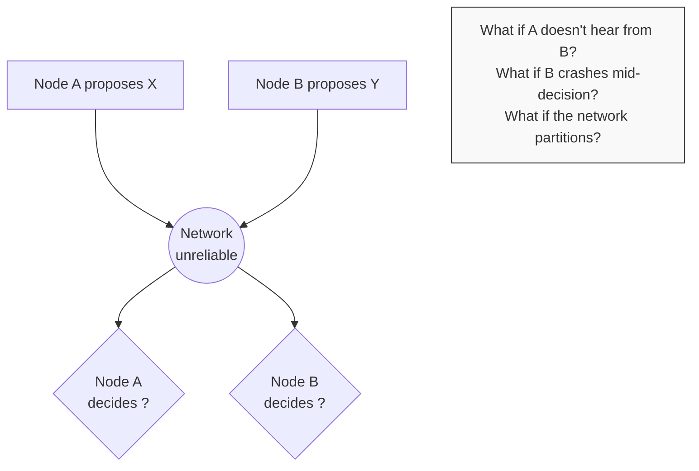
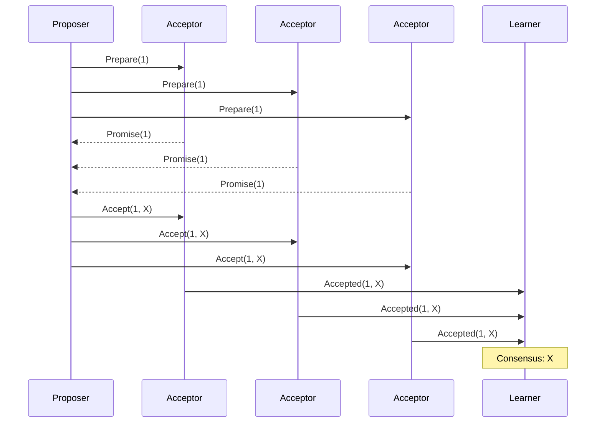
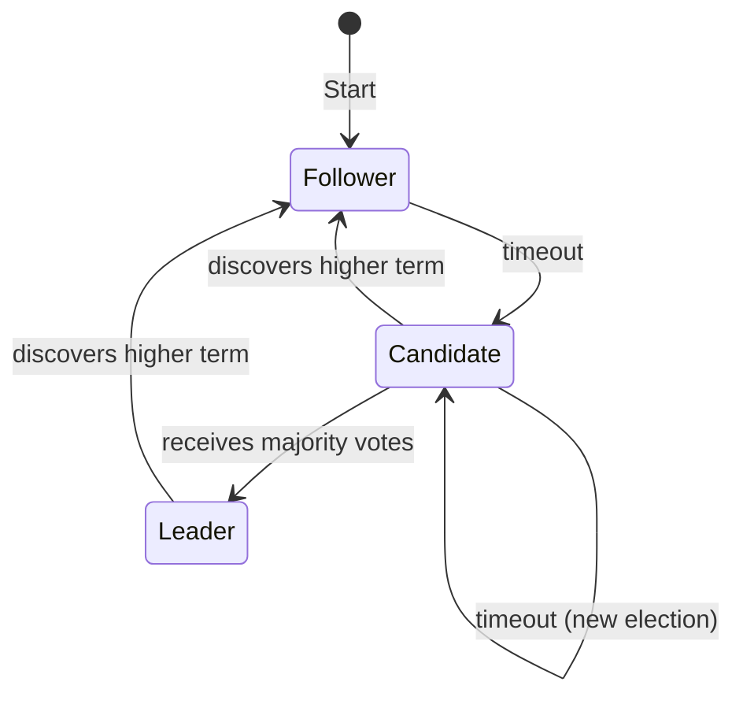
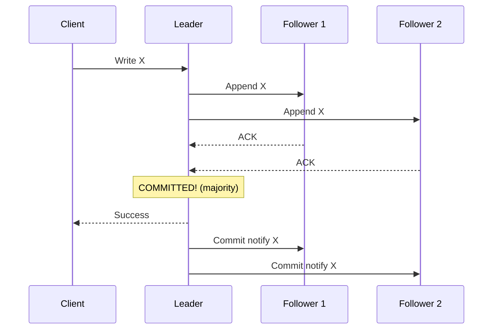
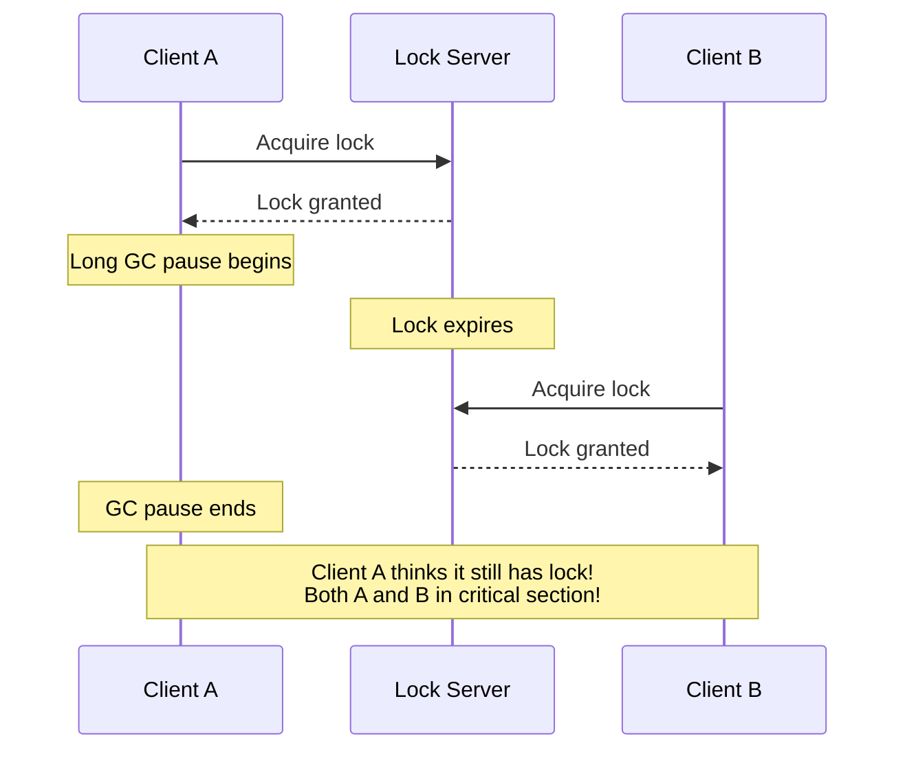

> **Складність**: `[COMPLEX]`
>
> **Час на проходження**: 35-40 хвилин
>
> **Попередні вимоги**: [Модуль 5.1: Що робить системи розподіленими](../module-5.1-what-makes-systems-distributed/)
>
> **Трек**: Foundations

### Що ви зможете зробити

Після завершення цього модуля ви зможете:

1. **Пояснити**, як Raft та Paxos досягають консенсусу та чому теорема про неможливість FLP обмежує всі протоколи консенсусу
2. **Оцінити** системи на основі консенсусу (etcd, ZooKeeper, Consul), аналізуючи їхні вимоги до кворуму, стійкість до збоїв та запобігання split-brain
3. **Спроєктувати** патерни координації (leader election, distributed locks, barrier synchronization), які відповідають різним вимогам до узгодженості
4. **Діагностувати** збої консенсусу, аналізуючи сценарії втрати кворуму, розділення мережі (network partitions) та шторми виборів лідера (leader election storms) у production-системах

---

**24 листопада 2014 року. Рутинна міграція бази даних у великій фінансовій компанії спровокувала один із найдорожчих збоїв консенсусу в історії банківської справи.**

Компанія керувала розподіленою торговельною системою з п'ятьма вузлами бази даних, що використовували реплікацію на основі Paxos. Під час міграції через неправильну конфігурацію мережі три вузли втратили зв'язок один з одним — але кожен із них усе ще міг зв'язатися з деякими з двох інших вузлів. Реалізація Paxos мала неочевидну помилку: за такого специфічного патерну розділення два різні вузли одночасно вважали, що досягли кворуму.

**Протягом 45 хвилин торговельна система мала двох лідерів, які приймали конфліктуючі записи.** Один лідер опрацював ордери на купівлю на суму 127 мільйонів доларів. Інший — опрацював ордери на продаж тих самих цінних паперів на суму 89 мільйонів доларів. Коли мережа відновилася і вузли спробували узгодити дані, конфлікт виявився нерозв'язним — журнал аудиту показав угоди, які не могли відбутися одночасно.

**Загальні збитки: 23 мільйони доларів миттєвих втрат від скасованих угод, 31 мільйон доларів регуляторних штрафів за порушення цілісності книги заявок та 180 мільйонів доларів виплат за позовами клієнтів.** Першопричиною була не мережа, а реалізація алгоритму консенсусу, яку не протестували на сценарії візантійського розділення.

Цей модуль розповідає про консенсус: як розподілені системи досягають згоди, чому це оманливо складно і чому помилки в цьому можуть коштувати більше, ніж більшість компаній заробляє за рік.

---

## Чому це важливо

Як змусити кілька комп'ютерів дійти згоди щодо чогось? Звучить просто — доки розділення мережі не розірве зв'язок між ними, повідомлення не загубляться, а вузли не вийдуть з ладу посеред прийняття рішення. Проте згода є життєво необхідною: який вузол є лідером? Чи зафіксовано цю транзакцію (committed)? Яка поточна конфігурація?

**Консенсус** — це фундамент надійних розподілених систем. Без нього ви не можете мати узгоджені репліковані бази даних, надійний leader election або стійку до збоїв координацію. Розуміння консенсусу допомагає обирати правильні інструменти та усвідомлювати їхні обмеження.

Цей модуль досліджує, як розподілені системи досягають згоди — алгоритми, компроміси та те, де ви стикатиметеся з консенсусом на практиці.

> **Аналогія з комітетом**
>
> Уявіть комітет, який має голосувати за рішення, але його члени перебувають у різних містах і можуть спілкуватися лише поштою. Листи губляться. Деякі учасники не відповідають. Комітет все одно повинен приймати рішення. Як їм переконатися, що всі згодні з тим, що було вирішено? Це і є проблема консенсусу, яка ускладнюється тим, що немає голови, якому б усі довіряли.

---

## Що ви дізнаєтесь

- Що означає консенсус і чому це складно
- Основні алгоритми консенсусу (Paxos, Raft)
- Як працює вибір лідера
- Розподілені блокування та координація
- Як etcd та ZooKeeper реалізують консенсус
- Коли вам потрібен консенсус (а коли ні)

---

## Частина 1: Проблема консенсусу

### 1.1 Що таке консенсус?

```
CONSENSUS DEFINITION
═══════════════════════════════════════════════════════════════

Consensus: Getting multiple nodes to agree on a single value.

REQUIREMENTS
─────────────────────────────────────────────────────────────
1. AGREEMENT: All non-faulty nodes decide on the same value
2. VALIDITY: The decided value was proposed by some node
3. TERMINATION: All non-faulty nodes eventually decide

SOUNDS SIMPLE, BUT...
─────────────────────────────────────────────────────────────
```



### 1.2 Чому консенсус — це складно

```
THE FLP IMPOSSIBILITY RESULT
═══════════════════════════════════════════════════════════════

Fischer, Lynch, and Paterson proved (1985):

    In an asynchronous system where even ONE node might crash,
    there is NO algorithm that guarantees consensus.

ASYNCHRONOUS = No timing assumptions
    - Messages can take arbitrarily long
    - You can't tell if a node crashed or is just slow

THE PROBLEM
─────────────────────────────────────────────────────────────
You're waiting for Node B's vote. No response.

Option 1: Wait forever
    Problem: If B crashed, you never decide (no termination)

Option 2: Proceed without B
    Problem: B might be alive and decide differently (no agreement)

Option 3: Use timeouts
    Problem: You might timeout a live node, or wait for a dead one

There's no perfect solution. Every algorithm makes trade-offs.

PRACTICAL IMPLICATIONS
─────────────────────────────────────────────────────────────
FLP says: Can't guarantee consensus in all cases.
Reality: Consensus is highly probable with good algorithms.

Algorithms like Paxos and Raft work in practice because:
- True asynchrony is rare (most messages arrive quickly)
- Random backoff prevents live-lock
- Timing assumptions usually hold
```

> **Зупиніться та подумайте**: Якщо математично неможливо гарантувати консенсус у всіх ситуаціях, як такі системи, як Kubernetes, надійно працюють у продакшені щодня? Які припущення вони роблять, яких не враховує теорема FLP?

### 1.3 Варіанти використання консенсусу

```
WHERE YOU NEED CONSENSUS
═══════════════════════════════════════════════════════════════

LEADER ELECTION
─────────────────────────────────────────────────────────────
"Who is the leader?"

Only one node should be leader at a time.
All nodes must agree on who it is.
If leader fails, elect a new one.

    Examples:
    - Kubernetes controller-manager
    - Database primary
    - Message queue broker

DISTRIBUTED LOCKS
─────────────────────────────────────────────────────────────
"Who holds the lock?"

Only one client can hold a lock at a time.
All nodes must agree on current holder.
If holder crashes, lock must be released.

    Examples:
    - Preventing duplicate processing
    - Coordinating batch jobs
    - Resource allocation

REPLICATED STATE MACHINES
─────────────────────────────────────────────────────────────
"What is the current state?"

All replicas apply the same operations in the same order.
Must agree on operation ordering.

    Examples:
    - etcd (Kubernetes configuration)
    - Replicated databases
    - Configuration management

ATOMIC COMMIT
─────────────────────────────────────────────────────────────
"Should this transaction commit?"

All participants must agree: commit or abort.
Can't have some commit and some abort.

    Examples:
    - Distributed transactions
    - Two-phase commit
    - Saga coordination
```

> **Спробуйте це (2 хвилини)**
>
> Подумайте про системи, які ви використовуєте. Де відбувається консенсус?
>
> | Система | Консенсус для | Що, якщо він вийде з ладу? |
> |--------|---------------|-------------------|
> | Kubernetes | Вибір лідера, etcd | |
> | | | |
> | | | |

---

## Частина 2: Алгоритми консенсусу

### 2.1 Paxos: Оригінал

```
PAXOS (Leslie Lamport, 1989)
═══════════════════════════════════════════════════════════════

The first proven consensus algorithm.
Famous for being difficult to understand.
Basis for many production systems.

ROLES
─────────────────────────────────────────────────────────────
PROPOSERS: Suggest values (can be multiple)
ACCEPTORS: Vote on values (majority must agree)
LEARNERS: Learn the decided value

BASIC PAXOS (Single Value)
─────────────────────────────────────────────────────────────
Phase 1: PREPARE
    Proposer → Acceptors: "Prepare proposal number N"
    Acceptors → Proposer: "Promise to not accept < N"
                          (plus any already-accepted value)

Phase 2: ACCEPT
    If majority promised:
    Proposer → Acceptors: "Accept value V with number N"
    Acceptors → Learners: "Accepted V"

    If majority accept: Consensus reached!
```



```
WHY IT'S COMPLEX
─────────────────────────────────────────────────────────────
- Multiple proposers can conflict
- Must handle old proposals
- Single-decree Paxos decides ONE value
- Multi-Paxos for sequences (even more complex)
```

### 2.2 Raft: Зрозумілий консенсус

```
RAFT (Diego Ongaro, 2014)
═══════════════════════════════════════════════════════════════

Designed for understandability.
Equivalent to Paxos but easier to implement.
Used by etcd, Consul, CockroachDB.

KEY INSIGHT
─────────────────────────────────────────────────────────────
Instead of symmetric nodes, use a leader.
Leader orders all decisions.
Consensus becomes: "elect leader" + "follow leader"

THREE SUB-PROBLEMS
─────────────────────────────────────────────────────────────
1. LEADER ELECTION: Choose a leader
2. LOG REPLICATION: Leader replicates log to followers
3. SAFETY: Ensure consistency despite failures

NODE STATES
─────────────────────────────────────────────────────────────
```



**Переходи станів:**
- **Start**: Усі вузли є Followers
- **Timeout**: Follower стає Candidate, надсилає запит на голосування
- **Majority**: Candidate стає Leader
- **Failure**: Leader не відповідає вчасно (таймаут), нові вибори

### 2.3 Raft: Детальний огляд

```
RAFT: LEADER ELECTION
═══════════════════════════════════════════════════════════════

TERMS
─────────────────────────────────────────────────────────────
Time divided into terms (epochs).
Each term has at most one leader.
Term number increases monotonically.

    Term 1: Node A is leader
    Term 2: Node A fails, Node B elected
    Term 3: Node B fails, Node C elected
```

> **Зупиніться та подумайте**: Якщо фрагментація мережі (network partition) ділить кластер з 5 вузлів на групу з 3 і групу з 2, що станеться з лідером, якщо він був у групі з 2?

```
ELECTION PROCESS
─────────────────────────────────────────────────────────────
1. Follower doesn't hear from leader (timeout)
2. Increments term, becomes candidate
3. Votes for itself, requests votes from others
4. Others vote if:
   - Haven't voted this term
   - Candidate's log is at least as up-to-date
5. Majority votes → becomes leader
6. No majority → timeout, new election with random delay

SPLIT VOTE PREVENTION
─────────────────────────────────────────────────────────────
Random election timeouts (150-300ms).
Unlikely two candidates timeout simultaneously.
If they do, random backoff ensures one wins next round.

RAFT: LOG REPLICATION
═══════════════════════════════════════════════════════════════

Leader receives client requests.
Appends to local log.
Replicates to followers.
Once majority acknowledge, entry is "committed."
Leader notifies followers of commit.
```



```
LOG CONSISTENCY
─────────────────────────────────────────────────────────────
Leader's log is authoritative.
Followers must match leader.
If mismatch, leader sends earlier entries until sync.
```

> **Історія з життя: Split-Brain у etcd вартістю 4,2 мільйона доларів**
>
> **Червень 2019 року. Фінтех-стартап втрачає 4,2 мільйона доларів за один вихідний через неправильну конфігурацію etcd у їхньому кластері Kubernetes.**
>
> Компанія розгорнула платформу обробки платежів на Kubernetes. Їхній кластер etcd з 3 вузлів був розміщений в одній зоні доступності, що порушувало всі найкращі практики високої доступності. Коли мережевий комутатор, який обслуговував вузол A, вийшов з ладу, кластер розділився: вузол A був ізольований, тоді як вузли B і C залишалися з'єднаними.
>
> **Хронологія катастрофи:**
> - **П'ятниця 18:42**: Збій мережевого комутатора, ізоляція вузла A
> - **П'ятниця 18:42**: Вузли B і C виявляють відсутність сигналу heartbeat, починають вибори
> - **П'ятниця 18:43**: Вузол B виграє вибори з терміном 42 (більшість: B+C = 2/3)
> - **П'ятниця 18:43 - Неділя 02:00**: Система працює стабільно на B+C
> - **П'ятниця 18:42 - Неділя 02:00**: Вузол A продовжує приймати записи від неправильно налаштованих клієнтів
>
> **Критична помилка**: Деякі мікросервіси були налаштовані безпосередньо на IP-адресу вузла A, оминаючи балансувальник навантаження. Ці сервіси продовжували записувати на вузол A, який приймав записи, незважаючи на відсутність кворуму — **у цій версії etcd був баг, через який застарілі лідери приймали операції читання, але не запису, за винятком застарілого (deprecated) API, який використовували мікросервіси**.
>
> **Коли мережа відновилася в неділю вранці:**
> - Вузол A приєднався з терміном 41 (застарілим)
> - Записи вузла A за 33 години були відхилені — термін 42 > термін 41
> - 142 000 записів про платежі існували лише на вузлі A
> - Дані вузла A були перезаписані авторитетним журналом вузлів B+C
>
> **Вартість помилки:**
> - 3,1 мільйона доларів на відшкодування клієнтам за втрачені підтвердження платежів
> - 1,2 мільйона доларів на екстрені інженерні роботи (тарифи вихідного дня, консультанти)
> - 400 000 доларів нормативних штрафів за збої в обробці платежів
>
> **Рішення**: Компанія перейшла на кластер etcd з 5 вузлів у 3 зонах доступності, змусила весь трафік проходити через балансувальник навантаження з перевірками працездатності (health checks) і впровадила моніторинг кінцевих точок etcd, який сповіщає про втрату кворуму протягом 30 секунд.

---

## Частина 3: Вибір лідера

### 3.1 Чому потрібні лідери?

```
WHY USE LEADERS?
═══════════════════════════════════════════════════════════════

LEADERLESS (all nodes equal)
─────────────────────────────────────────────────────────────
    Every request needs coordination
    Complex conflict resolution
    Higher latency (wait for quorum)
    No single point of failure

LEADER-BASED
─────────────────────────────────────────────────────────────
    Leader orders all operations
    Simple decision making
    Lower latency (leader decides alone)
    Must handle leader failure

COMPARISON
─────────────────────────────────────────────────────────────
```

| Характеристика | Без лідера | З лідером |
|---------|------------|--------------|
| **Записи** | Будь-який вузол | Лише лідер |
| **Координація** | Кожен запис | Вибір лідера |
| **Затримка (Latency)** | Вища | Нижча |
| **Доступність (Availability)** | Вища | Нижча (під час виборів) |
| **Складність** | Складні зчитування | Складне відновлення (failover) |
| **Приклади** | Cassandra | etcd, ZooKeeper |

### 3.2 Механізми вибору лідера

```
LEADER ELECTION APPROACHES
═══════════════════════════════════════════════════════════════

BULLY ALGORITHM
─────────────────────────────────────────────────────────────
Highest ID wins. Simple but not partition-tolerant.

    Node 1 (ID=1): "I want to be leader"
    Node 2 (ID=2): "I have higher ID, step aside"
    Node 3 (ID=3): "I have highest ID, I'm leader"

CONSENSUS-BASED (Raft/Paxos)
─────────────────────────────────────────────────────────────
Nodes vote. Majority wins. Partition-tolerant.

    - Requires quorum for election
    - Leader has "lease" (term)
    - New election on leader failure

LEASE-BASED
─────────────────────────────────────────────────────────────
Leader holds time-limited lease. Must renew.

    Leader acquires lease (e.g., 15 seconds)
    Leader renews every 5 seconds
    If leader crashes, lease expires
    Others can acquire after expiry

    # Kubernetes leader election uses leases
    kubectl get leases -n kube-system

EXTERNAL COORDINATION
─────────────────────────────────────────────────────────────
Use external system (etcd, ZooKeeper) for coordination.

    Component → etcd: "I'm leader" (with lease)
    etcd: "OK, you're leader until lease expires"
    Other components: Watch etcd for current leader
```

### 3.3 Вибір лідера у Kubernetes

```
KUBERNETES LEADER ELECTION
═══════════════════════════════════════════════════════════════

HOW IT WORKS
─────────────────────────────────────────────────────────────
Uses Lease objects in etcd.
Leader creates/renews lease.
Others watch lease, take over if expired.

EXAMPLE: CONTROLLER-MANAGER
─────────────────────────────────────────────────────────────
# View current leader
kubectl get lease kube-controller-manager -n kube-system -o yaml

apiVersion: coordination.k8s.io/v1
kind: Lease
metadata:
  name: kube-controller-manager
  namespace: kube-system
spec:
  holderIdentity: master-1_abc123    # Current leader
  leaseDurationSeconds: 15           # Lease validity
  renewTime: "2024-01-15T10:30:00Z"  # Last renewal

IMPLEMENTATION FOR YOUR APPS
─────────────────────────────────────────────────────────────
# Using client-go leader election

import (
    "k8s.io/client-go/tools/leaderelection"
)

leaderelection.RunOrDie(ctx, leaderelection.LeaderElectionConfig{
    Lock: &resourcelock.LeaseLock{
        LeaseMeta: metav1.ObjectMeta{
            Name:      "my-app-leader",
            Namespace: "default",
        },
    },
    LeaseDuration: 15 * time.Second,
    RenewDeadline: 10 * time.Second,
    RetryPeriod:   2 * time.Second,
    Callbacks: leaderelection.LeaderCallbacks{
        OnStartedLeading: func(ctx context.Context) {
            // I'm the leader, do leader work
        },
        OnStoppedLeading: func() {
            // I'm no longer leader
        },
    },
})
```

---


## Частина 4: Розподілені блокування та координація

### 4.1 Розподілені блокування

```
DISTRIBUTED LOCKS
═══════════════════════════════════════════════════════════════

PURPOSE
─────────────────────────────────────────────────────────────
Ensure only one process does something at a time.
Coordinate access to shared resources.

LOCAL LOCK (single machine)
─────────────────────────────────────────────────────────────
    mutex.Lock()
    // Critical section
    mutex.Unlock()

    Simple. Process crashes → OS releases lock.

DISTRIBUTED LOCK (multiple machines)
─────────────────────────────────────────────────────────────
    // Acquire lock from coordination service
    lock.Acquire("resource-x")
    // Critical section
    lock.Release("resource-x")

    Complex. Process crashes → Who releases lock?

THE PROBLEM WITH DISTRIBUTED LOCKS
─────────────────────────────────────────────────────────────
```



> **Зупиніться та подумайте**: Чому розподіленому блокуванню взагалі потрібен TTL (час життя)? Що б сталося, якби клієнт отримав блокування без TTL і потім назавжди вийшов з ладу, не знявши його?

```
SOLUTION: FENCING TOKENS
─────────────────────────────────────────────────────────────
Lock server issues incrementing token with each acquisition.
Resource checks token, rejects stale tokens.

    Client A gets lock with token 33
    Client A pauses
    Lock expires, Client B gets lock with token 34
    Client A wakes, tries to write with token 33
    Resource rejects: 33 < 34 (stale)
```

### 4.2 Патерни координації

```
COORDINATION PATTERNS
═══════════════════════════════════════════════════════════════

DISTRIBUTED QUEUE
─────────────────────────────────────────────────────────────
Multiple workers, one task at a time.

    /tasks/task-001 → Worker A claims
    /tasks/task-002 → Worker B claims
    /tasks/task-003 → Worker C claims

    Workers watch for new tasks, claim by creating ephemeral node.

BARRIER (RENDEZVOUS)
─────────────────────────────────────────────────────────────
Wait until N nodes are ready, then proceed.

    Worker 1: Create /barrier/worker-1
    Worker 2: Create /barrier/worker-2
    Worker 3: Create /barrier/worker-3

    All watch /barrier. When count = N, all proceed.

    Use case: Coordinated restart, batch processing start.

SERVICE DISCOVERY
─────────────────────────────────────────────────────────────
Services register, clients find them.

    Service A: Create /services/api/instance-1 (ephemeral)
    Service A: Create /services/api/instance-2 (ephemeral)

    Client: List /services/api → [instance-1, instance-2]

    If service crashes, ephemeral node deleted automatically.

CONFIGURATION DISTRIBUTION
─────────────────────────────────────────────────────────────
Central config, all nodes watch.

    Admin: Write /config/feature-flags = {"new-ui": true}
    All nodes: Watch /config/feature-flags
    Change detected → All nodes update simultaneously
```

### 4.3 etcd та ZooKeeper

```
etcd vs ZooKeeper
═══════════════════════════════════════════════════════════════

SIMILARITIES
─────────────────────────────────────────────────────────────
Both provide:
- Distributed key-value store
- Strong consistency (linearizable)
- Watch mechanism (change notifications)
- TTL/leases (automatic expiration)
- Used for coordination, not data storage

DIFFERENCES
─────────────────────────────────────────────────────────────
```

| Характеристика | etcd | ZooKeeper |
|---------|------|-----------|
| **Протокол** | gRPC | Власний бінарний |
| **Консенсус** | Raft | Zab (схожий на Paxos) |
| **Модель даних** | Плоска ключ-значення | Ієрархічна (дерево) |
| **API** | Простий KV | ZNodes (як файли) |
| **Спостереження (Watches)** | Ефективні (потік) | Одноразові тригери |
| **Типове використання** | Kubernetes | Kafka, Hadoop |
| **Мова** | Go | Java |

```
etcd EXAMPLE
─────────────────────────────────────────────────────────────
# Set a key
etcdctl put /myapp/config '{"version": 2}'

# Get a key
etcdctl get /myapp/config

# Watch for changes
etcdctl watch /myapp/config

# Set with TTL (lease)
etcdctl lease grant 60
etcdctl put /myapp/leader "node-1" --lease=<lease-id>

ZOOKEEPER EXAMPLE
─────────────────────────────────────────────────────────────
# Create a znode
create /myapp/config '{"version": 2}'

# Get a znode
get /myapp/config

# Watch (one-time)
get /myapp/config -w

# Ephemeral node (deleted when session ends)
create -e /myapp/leader "node-1"
```

---


## Частина 5: Коли використовувати консенсус

### 5.1 Консенсус — це дорого

```
THE COST OF CONSENSUS
═══════════════════════════════════════════════════════════════

LATENCY
─────────────────────────────────────────────────────────────
Every write requires:
    1. Client → Leader
    2. Leader → Followers (parallel)
    3. Followers → Leader (acknowledgments)
    4. Leader → Client (commit confirmation)

    Minimum: 2 round trips
    With geographic distribution: 100s of milliseconds

THROUGHPUT
─────────────────────────────────────────────────────────────
All writes go through leader.
Leader is bottleneck.
Can't horizontally scale writes.

    Single leader: ~10,000-50,000 writes/second typical
    Compare to Redis: ~100,000+ writes/second (no consensus)

AVAILABILITY
─────────────────────────────────────────────────────────────
Requires quorum (majority).
3 nodes: 1 can fail
5 nodes: 2 can fail
7 nodes: 3 can fail

    More nodes = better fault tolerance
    More nodes = slower consensus (more coordination)

COMPLEXITY
─────────────────────────────────────────────────────────────
Consensus algorithms are hard to implement correctly.
Subtle bugs can cause data loss.
Use battle-tested implementations (etcd, ZooKeeper).
```

### 5.2 Коли вам потрібен консенсус

```
YOU NEED CONSENSUS WHEN
═══════════════════════════════════════════════════════════════

[YES] LEADER ELECTION
    Only one leader at a time, all must agree.
    Alternative: Live with multiple (might cause duplicates)

[YES] DISTRIBUTED LOCKS (if correctness matters)
    Only one holder, must be certain.
    Alternative: Optimistic locking with conflicts

[YES] CONFIGURATION CHANGES
    All nodes must see same config.
    Alternative: Eventual propagation (brief inconsistency)

[YES] TRANSACTION COMMIT
    All participants agree: commit or abort.
    Alternative: Sagas (compensating transactions)

[YES] TOTAL ORDERING
    All nodes process operations in same order.
    Alternative: Partial ordering or eventual consistency

YOU PROBABLY DONT NEED CONSENSUS WHEN
═══════════════════════════════════════════════════════════════

[NO] CACHING
    Stale data is acceptable.
    Use TTLs instead.

[NO] METRICS/LOGGING
    Approximate counts are fine.
    Eventual consistency is enough.

[NO] USER PREFERENCES
    Minor inconsistency is tolerable.
    Conflict-free data types (CRDTs) work well.

[NO] SHOPPING CART
    Merge conflicts on checkout.
    Eventual consistency with conflict resolution.
```

### 5.3 Альтернативи консенсусу

```
ALTERNATIVES TO CONSENSUS
═══════════════════════════════════════════════════════════════

EVENTUAL CONSISTENCY
─────────────────────────────────────────────────────────────
Changes propagate asynchronously.
All nodes converge to same state... eventually.

    Pro: Higher availability, lower latency
    Con: Temporary inconsistency

CONFLICT-FREE REPLICATED DATA TYPES (CRDTs)
─────────────────────────────────────────────────────────────
Data structures that merge automatically.
No coordination needed.

    Examples:
    - G-Counter: Only grows (add, never subtract)
    - LWW-Register: Last-write-wins by timestamp
    - OR-Set: Observed-remove set

    Pro: No coordination, always available
    Con: Limited operations, eventual consistency

OPTIMISTIC CONCURRENCY
─────────────────────────────────────────────────────────────
Assume no conflicts. Detect and retry if wrong.

    Read record with version V
    Make changes
    Write "if version still V"
    If version changed, retry

    Pro: No locks, high concurrency
    Con: Retries under contention

SINGLE LEADER (NO CONSENSUS)
─────────────────────────────────────────────────────────────
One designated leader (not elected).
Simple but single point of failure.

    Pro: Simple, no consensus needed
    Con: Manual failover, downtime during failure
```

---


## Чи знали ви?

- **Paxos двічі відхиляли** в академічних журналах, оскільки рецензенти вважали його занадто складним для розуміння. Зрештою Лемпорт опублікував його як алегорію про "парламент, що працює за сумісництвом", щоб зробити алгоритм доступнішим.

- **Назва Raft** походить від "Reliable, Replicated, Redundant, And Fault-Tolerant" (Надійний, реплікований, надлишковий та стійкий до відмов). Він був спеціально розроблений так, щоб бути зрозумілим — оригінальна стаття містить дослідження за участю користувачів, яке показує, що люди вивчають Raft швидше, ніж Paxos.

- **Сервіс Chubby від Google** (служба блокувань на базі Paxos) був настільки критичним, що коли він вийшов з ладу на 15 хвилин, зупинилося більше сервісів Google, ніж коли великий дата-центр втратив живлення. Залежність від сервісів координації може бути небезпечною.

- **etcd з'явився у CoreOS** у 2013 році як просте сховище ключ-значення для розподіленої системи ініціалізації CoreOS. Коли Kubernetes обрав його як свій "мозок", etcd став одним із найважливіших елементів інфраструктури у хмарно-орієнтованих (cloud-native) обчисленнях — зараз він працює у продакшені практично в кожній великій технологічній компанії.

---


## Типові помилки

| Помилка | Проблема | Рішення |
|---------|---------|----------|
| Використання консенсусу для всього | Повільно, складно, вузьке місце | Консенсус лише за потреби |
| Неправильний розмір кворуму | 2 із 4 вузлів — це не більшість | Використовуйте непарні числа (3, 5, 7) |
| Ігнорування часу вибору лідера | Коротка недоступність під час перемикання (failover) | Проєктуйте з урахуванням пауз на вибори |
| Розподілені блокування без огородження (fencing) | Застарілі клієнти пошкоджують дані | Використовуйте токени огородження (fencing tokens) |
| Створення власного алгоритму консенсусу | Неочевидні баги, втрата даних | Використовуйте перевірені на практиці реалізації |
| Консенсус між дата-центрами | Висока затримка, часті вибори | Віддавайте перевагу регіональному консенсусу |

---

## Контрольні запитання

1. **Сценарій**: Перед вами стоїть завдання побудувати високонадійну розподілену базу даних, де три вузли повинні дійти згоди щодо порядку транзакцій. Під час тестування ви помічаєте, що у випадку сильного перевантаження мережі система повністю зупиняється та відмовляється фіксувати (commit) нові транзакції. Чому така поведінка насправді є очікуваною, а не багом?
   <details>
   <summary>Відповідь</summary>

   Ця поведінка є очікуваною через обмеження теореми про неможливість FLP (FLP impossibility theorem), яка стверджує, що в асинхронній системі, де навіть один вузол може вийти з ладу, жоден алгоритм не може гарантувати консенсус. Оскільки система не може відрізнити вузол, що зазнав краху, від вузла, який просто повільно відповідає через перевантаження мережі, вона змушена йти на компроміс. У цьому сценарії база даних надала перевагу безпеці (узгодженості та валідності) над живучістю (завершенням). Практичні алгоритми консенсусу, такі як Raft і Paxos, припускають, що вони не можуть гарантувати завершення в усіх можливих аварійних станах, натомість обираючи призупинення операцій, щоб не ризикувати пошкодженням даних або сценаріями split-brain.
   </details>

2. **Сценарій**: У кластері etcd з 5 вузлів, який забезпечує роботу production середовища Kubernetes, поточний вузол-лідер (leader) зазнає апаратного збою та раптово виходить з ладу. Опишіть точний механізм, який використовують решта чотири вузли для відновлення та узгодження наступного стану кластера.
   <details>
   <summary>Відповідь</summary>

   Коли лідер виходить з ладу, решта вузлів-послідовників (followers) з часом перестають отримувати повідомлення heartbeat, що запускає тайм-аут виборів (election timeout) на одному або кількох із них. Перший вузол, у якого закінчився тайм-аут, збільшує свій поточний номер терміну (term number) і переходить у стан кандидата (candidate), голосуючи за себе та надсилаючи повідомлення request-vote іншим вузлам. Решта вузлів віддадуть свій голос, якщо вони ще не голосували в цьому терміні та якщо журнал (log) кандидата є принаймні таким же актуальним, як і їхній власний. Щойно кандидат отримує більшість голосів, він бере на себе роль лідера та негайно починає надсилати повідомлення heartbeat для встановлення свого авторитету. Цей процес гарантує, що кластер безпечно переходить до нового лідера без жодної єдиної точки відмови (single point of failure), яка б порушила загальний консенсус.
   </details>

3. **Сценарій**: Ви реалізуєте розподілене блокування (distributed lock), використовуючи простий ключ Redis із TTL. Розробник запитує, чому б просто не видалити ключ після завершення процесу, замість того щоб турбуватися про токени огородження (fencing tokens). Поясніть фундаментальний недолік покладання виключно на TTL та видалення для розподілених блокувань.
   <details>
   <summary>Відповідь</summary>

   Покладання виключно на TTL і видалення є фундаментально помилковим, оскільки це передбачає ідеально синхронне середовище, де процеси ніколи не зависають, а мережі ніколи не мають затримок. Якщо процес отримує блокування, але стикається з тривалою паузою garbage collection, TTL на сервері закінчиться, тоді як процес про це навіть не підозрюватиме. Коли другий процес неминуче отримає тепер уже вільне блокування, обидва процеси зрештою спробують виконати свої критичні секції одночасно, що призведе до прихованого пошкодження даних. Токени огородження (fencing tokens) необхідні, оскільки вони переносять остаточну перевірку від ненадійних клієнтських процесів до самого рівня зберігання. Гарантуючи, що ресурс відхилятиме будь-які записи від клієнта, який утримує застарілий токен, система залишається безпечною навіть тоді, коли гарантії розподіленого блокування тимчасово порушуються.
   </details>

4. **Сценарій**: Молодший інженер пропонує використовувати etcd (який покладається на консенсус Raft) для зберігання великого обсягу подій клікстріму (clickstream) та метрик користувачів у реальному часі для популярного сайту електронної комерції, аргументуючи це тим, що "нам потрібно гарантувати, що ми ніколи не втратимо жодного кліку". Поясніть, чому цей архітектурний вибір не спрацює в production, і який патерн слід використовувати натомість.
   <details>
   <summary>Відповідь</summary>

   Використання системи на основі консенсусу, як-от etcd, для великих обсягів даних клікстріму швидко стане вузьким місцем (bottleneck) системи та призведе до серйозного зниження продуктивності. Кожен запис у кластері Raft має проходити через єдиний вузол-лідер і реплікуватися на більшість послідовників, перш ніж його можна буде підтвердити, що створює значну затримку (latency) та обмежує максимальну пропускну здатність (throughput). Алгоритми консенсусу надають пріоритет строгій лінеаризовності та коректності над високою доступністю та пропускною здатністю запису, що робить їх абсолютно непридатними для транзитних даних великого обсягу, таких як метрики. Натомість команді слід використовувати систему з узгодженістю в кінцевому підсумку (eventually consistent system) або розподілену чергу повідомлень, розроблену для високої пропускної здатності. У цих альтернативних системах випадкова втрата даних або зміна їхнього порядку в аналітиці клікстріму є прийнятним компромісом заради величезного приросту продуктивності, необхідного для масштабів електронної комерції.
   </details>

5. **Сценарій**: Ви налаштовуєте новий сервіс на базі Raft і встановлюєте тайм-аут виборів на фіксовані 200 мс для всіх 5 вузлів. Під час короткочасного збою мережі, через який зникає лідер, кластер протягом кількох хвилин не може обрати нового лідера, постійно стикаючись із тайм-аутами. Яка помилка конфігурації спричинила цей каскадний збій, і як протокол вирішує це нативним чином?
   <details>
   <summary>Відповідь</summary>

   Встановлення фіксованого, однакового тайм-ауту виборів на всіх вузлах практично гарантує сценарій розділення голосів (split-vote) під час відновлення. Коли лідер виходить з ладу, у всіх послідовників тайм-аут закінчиться в один і той самий момент, вони перейдуть у стан кандидатів і проголосують за себе, не дозволяючи нікому набрати більшість. Цей цикл повторюватиметься нескінченно, оскільки всі вони одночасно перезапускатимуть свої таймери кандидатів, що повністю зупинить роботу кластера. Протокол Raft нативно вирішує це, вимагаючи рандомізованих тайм-аутів виборів (наприклад, випадкове значення від 150 мс до 300 мс) для кожного окремого вузла. Ця випадковість гарантує, що тайм-аут на одному вузлі надійно закінчиться раніше за інші, дозволяючи йому надіслати запит і отримати необхідні голоси ще до появи конкурентів.
   </details>

6. **Сценарій**: Ваша глобальна інфраструктурна команда розгортає кластер etcd з 7 вузлів, рівномірно розподілених між трьома дата-центрами: 3 вузли в US-East, 2 в EU-West і 2 в AP-South. Трансатлантичний оптоволоконний кабель перерізано, що повністю ізолює дата-центр US-East від двох інших. Чи продовжуватимуть функціонувати control planes Kubernetes у будь-якому з цих регіонів, і чому?
   <details>
   <summary>Відповідь</summary>

   Так, кластер продовжуватиме функціонувати, але лише розділ (partition), що містить EU-West та AP-South, зможе приймати записи та продовжувати роботу. Для кластера з 7 вузлів потрібен кворум із 4 вузлів, щоб досягти консенсусу та підтвердити будь-які зміни стану. Дата-центр US-East має лише 3 вузли, тому він не може утворити кворум і перейде в стан "тільки для читання" (read-only), безпечно відхиляючи всі нові зміни конфігурації для запобігання split-brain. Однак підключений розділ із EU-West та AP-South містить загалом 4 вузли, що дає їм точну більшість, необхідну для обрання нового лідера та продовження обробки записів. Це демонструє, чому ретельний розподіл вузлів між доменами відмов (fault domains) є критично важливим; якби замість цього US-East містив 4 вузли, втрата одного дата-центру призвела б до падіння всього глобального кластера.
   </details>

7. **Сценарій**: Розподілене блокування має TTL 15 секунд і heartbeat для оновлення кожні 5 секунд. Клієнт A отримує блокування, але рівно через 2 секунди стикається з серйозною 20-секундною паузою garbage collection. Опишіть точну хронологію подій, що призводить до стану split-brain, і поясніть, як токен огородження (fencing token) нейтралізує саме цю хронологію.
   <details>
   <summary>Відповідь</summary>

   У момент T=0 Клієнт A отримує блокування і починає обробку, але при T=2 він потрапляє в серйозну 20-секундну паузу garbage collection. Оскільки Клієнт A заморожений, він не може надсилати необхідні 5-секундні heartbeat для оновлення, через що сервер блокувань анулює блокування при T=15. У момент T=16 Клієнт B отримує щойно звільнене блокування і починає легітимний запис у спільний ресурс. Коли Клієнт A прокидається при T=22, він нічого не знає про паузу і все ще вважає, що володіє ексклюзивним блокуванням, що призводить до активної мутації ресурсу обома клієнтами. Токен огородження (fencing token) нейтралізує цю точну хронологію, оскільки спільний ресурс відхилить записи Клієнта A при T=22, розпізнавши, що його пов'язаний токен старіший за токен, який зараз використовує Клієнт B.
   </details>

8. **Сценарій**: Ваша організація мігрує застаріле озеро даних Hadoop на базі Java та сучасну платформу мікросервісів Kubernetes на базі Go в єдину архітектуру. Архітектурна рада хоче стандартизувати єдиний сервіс координації — ZooKeeper або etcd — для обох платформ, щоб зменшити операційні витрати. Обґрунтуйте, чому стандартизація на одному інструменті може бути помилкою в цьому конкретному контексті.
   <details>
   <summary>Відповідь</summary>

   Стандартизація на єдиному сервісі координації в цьому змішаному середовищі ігнорує нативні інтеграції та архітектурні припущення відповідних екосистем. Застарілий стек Hadoop і Java значною мірою покладається на ієрархічну модель даних znode в ZooKeeper і має глибокі, перевірені на практиці клієнтські бібліотеки, спеціально створені на основі цієї семантики. Навпаки, сучасна екосистема Kubernetes фундаментально розроблена навколо плоского сховища "ключ-значення" etcd і високоефективних потоків спостереження (watch streams) gRPC. Примушування Hadoop використовувати etcd або Kubernetes використовувати ZooKeeper вимагало б створення складних шарів трансляції, що вносить затримку і значно збільшує ризик збоїв, пов'язаних із консенсусом. Операційні витрати на підтримку обох сервісів є набагато нижчими, ніж інженерні витрати та операційний ризик боротьби з нативними паттернами проектування цих двох великих платформ.
   </details>

---

## Практична вправа

**Завдання**: **Дослідити** консенсус та координацію в Kubernetes.

**Частина 1: Спостереження за консенсусом etcd (10 хвилин)**

```bash
# If you have etcd access (e.g., kind cluster)
# List etcd members
kubectl exec -it -n kube-system etcd-<node> -- etcdctl member list

# Check etcd health
kubectl exec -it -n kube-system etcd-<node> -- etcdctl endpoint health

# Watch etcd statistics
kubectl exec -it -n kube-system etcd-<node> -- etcdctl endpoint status --write-out=table
```

Запишіть стан кластера:

| Вузол | Є лідером | Raft Term | Raft Index |
|------|-----------|-----------|------------|
| | | | |
| | | | |
| | | | |

**Частина 2: Спостереження за виборами лідера (10 хвилин)**

```bash
# View current leaders
kubectl get leases -n kube-system

# Watch leader lease for controller-manager
kubectl get lease kube-controller-manager -n kube-system -o yaml

# Observe holder identity and renew time
# Note: renewTime updates regularly while leader is healthy
```

**Частина 3: Реалізація простої координації (15 хвилин)**

Створіть ConfigMap, за яким спостерігатимуть кілька pod'ів:

```yaml
# coordination-config.yaml
apiVersion: v1
kind: ConfigMap
metadata:
  name: shared-config
  namespace: default
data:
  feature-flag: "false"
---
apiVersion: v1
kind: Pod
metadata:
  name: watcher-1
spec:
  containers:
  - name: watcher
    image: busybox
    command: ['sh', '-c', 'while true; do cat /config/feature-flag; sleep 5; done']
    volumeMounts:
    - name: config
      mountPath: /config
  volumes:
  - name: config
    configMap:
      name: shared-config
```

```bash
# Create the resources
kubectl apply -f coordination-config.yaml

# Watch the output
kubectl logs -f watcher-1

# In another terminal, update the config
kubectl patch configmap shared-config -p '{"data":{"feature-flag":"true"}}'

# Observe: Does the watcher see the change?
# (Note: ConfigMap volume updates have propagation delay)
```

**Критерії успіху**:
- [ ] Досліджено стан кластера etcd та лідера
- [ ] Зрозуміло принцип виборів лідера на основі lease
- [ ] Помічено затримку поширення конфігурації
- [ ] Зрозуміло, навіщо потрібні сервіси координації

---

## Додаткові матеріали

- **"In Search of an Understandable Consensus Algorithm"** - Diego Ongaro. Документ про Raft, спеціально написаний для легкого розуміння.

- **"Designing Data-Intensive Applications"** - Martin Kleppmann. Розділи 8-9 охоплюють консенсус, розподілені транзакції та координацію.

- **"The Raft Visualization"** - raft.github.io. Інтерактивна візуалізація консенсусу Raft.

---

## Ключові висновки

Перш ніж рухатися далі, переконайтеся, що ви розумієте:

- [ ] **Основи консенсусу**: Досягнення згоди між вузлами щодо єдиного значення з узгодженістю (однакове значення), валідністю (запропоноване значення) та завершенням (кінцеве рішення)
- [ ] **Неможливість FLP**: В асинхронних системах консенсус неможливо гарантувати навіть за наявності одного збою. Практичні алгоритми працюють, оскільки справжня асинхронність трапляється рідко
- [ ] **Механіка Raft**: Вибори лідера голосуванням більшості, реплікація журналу на послідовників, терміни для запобігання split-brain, випадкові тайм-аути для вирішення нічиїх
- [ ] **Математика кворуму**: Більшість = floor(n/2) + 1. Для 5 вузлів потрібно 3. Для 7 вузлів потрібно 4. Використовуйте непарну кількість, щоб уникнути нічиїх
- [ ] **Компроміси вибору лідера**: Системи з лідером простіші та швидші, але потребують механізму failover. Системи без лідера доступніші, але складніші
- [ ] **Небезпеки розподіленого блокування**: Паузи GC та затримки мережі можуть змусити клієнта вважати, що він утримує прострочене блокування. Токени огородження (fencing tokens) є обов'язковими
- [ ] **Вартість консенсусу**: Кожен запис потребує 2 кругових звернень (round trips) через лідера. Обмежено приблизно 10-50 тис. записів/сек. Не використовуйте для даних із високою пропускною здатністю
- [ ] **Коли уникати консенсусу**: Кешування, метрики, логи, кошики покупок — скрізь, де прийнятна eventual consistency (узгодженість у кінцевому підсумку). Збережіть консенсус для виборів лідера, строгих блокувань та комітів транзакцій

---

## Наступний модуль

[Модуль 5.3: Eventual Consistency](../module-5.3-eventual-consistency/) - Коли вам не потрібна строга узгодженість, і як змусити працювати eventual consistency.
