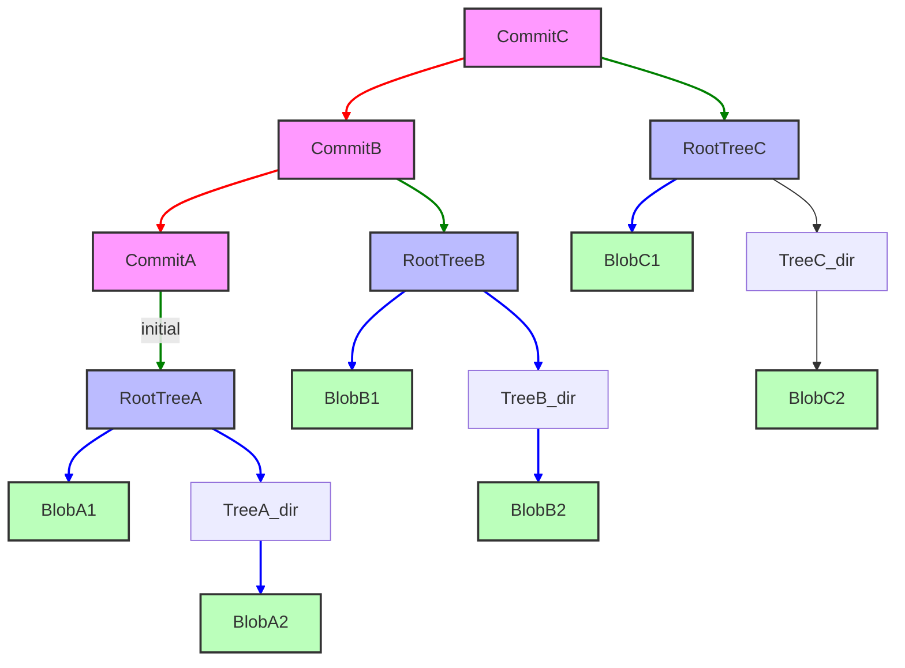

# Модуль 1: Привид у машині — Внутрішня будова Git
**Складність**: [СЕРЕДНЯ]
**Час на виконання**: 90 хвилин
**Передумови**: Модуль 0.6 "Основи Git" курсу "З нуля до терміналу" (init, add, commit, push, pull)
**Наступний модуль**: [Модуль 2: Мистецтво розгалуження](../module-2-advanced-merging/)

## Що ви зможете зробити
До кінця цього модуля ви зможете:
1.  **Діагностувати** стан репозиторію, перевіряючи директорію `.git` та її об'єкти.
2.  **Порівняти** ролі об'єктів blob, tree та commit у представленні історії проєкту.
3.  **Впровадити** зміни в область підготовки (index) та продемонструвати її проміжну роль у процесі створення commit.
4.  **Оцінити** наслідки моделі адресованого за вмістом сховища (content-addressable storage) Git для цілісності даних та історії.
5.  **Використовувати** службові (plumbing) команди Git для ручного створення та перевірки об'єктів репозиторію.

## Чому це важливо
Уявіть, що ваша команда розгортає критичне оновлення у продуктовий кластер Kubernetes. П'ятниця, вечір, усі вже мріють про вихідні. Раптом у Slack спалахує термінове повідомлення: "Продакшн лежить! Pods падають через відсутність ConfigMap!". Починається паніка. Останній deploy був успішним, але чомусь життєво важлива конфігурація зникла. Розробники гарячково намагаються зробити відкат, але знайти *точний* попередній стан не вдається. Через кілька годин болісних пошуків старший інженер зрештою відновлює втрачений елемент, ретельно досліджуючи старі логи та локальні копії. Виявилося, що хтось випадково видалив гілку локально, вважаючи, що видаляє лише вказівник, а не реальний код, і наступний force-push поширив помилку.

Цей сценарій нічного жаху, хоч і екстремальний, підкреслює загальну вразливість: брак глибокого розуміння того, як Git насправді *працює*. Багато інженерів сприймають Git як "чорну скриньку" — магічний інструмент, який якось зберігає їхній код. Вони знають `git add`, `git commit`, `git push`, але коли щось іде не так, коли історія переписується або критичний файл таємниче зникає, "чорна скринька" не дає відповідей. Без розуміння внутрішніх механізмів Git — як він зберігає дані, пов'язує історію та керує вказівниками — ви перебуваєте у владі його налаштувань за замовчуванням. Цей модуль відкриє завісу, демістифікуючи внутрішнього "привида" Git. Ви вивчите фундаментальні будівельні блоки кожного репозиторію Git, отримавши можливість не просто *використовувати* Git, а справді *розуміти*, *діагностувати* та *відновлювати* дані навіть після найбільш заплутаних збоїв системи контролю версій. Розуміючи Git на такому рівні, ви станете впевненішим, вмілішим та стійкішим інженером, готовим до будь-яких викликів у роботі з версіями.

## Основні розділи

### 1. Директорія `.git`: мозок вашого репозиторію
Кожного разу, коли ви запускаєте `git init`, Git створює приховану директорію `.git` у корені вашого проєкту. Ця директорія — не просто папка; це весь мозок вашого репозиторію. Вона містить усю інформацію, необхідну Git для керування історією вашого проєкту: від кожної версії файлу до кожного повідомлення commit, гілки та тегу. Якщо ви втратите цю директорію, ви втратите всю історію Git вашого проєкту.

Давайте зазирнемо всередину щойно ініціалізованого репозиторію.

```bash
# Створити нову порожню директорію
mkdir my-git-repo
cd my-git-repo

# Ініціалізувати репозиторій Git
git init

# Вивести вміст директорії .git
ls -F .git
```

**Очікуваний результат:**

```
HEAD		config		description	hooks/		info/		objects/	refs/
```

-   **`HEAD`**: Вказівник на поточний вибраний commit. Зазвичай він вказує на гілку.
-   **`config`**: Налаштування конфігурації, специфічні для проєкту.
-   **`description`**: Використовується GitWeb (веб-інтерфейсом для репозиторіїв Git) для опису проєкту.
-   **`hooks/`**: Скрипти на стороні клієнта або сервера, які Git може виконувати до або після команд (наприклад, pre-commit, post-receive).
-   **`info/`**: Містить глобальний файл виключень для ігнорованих шаблонів, подібний до `.gitignore`.
-   **`objects/`**: Тут Git зберігає всі ваші дані — фактичний вміст ваших файлів, директорій та метадані commit. Це сховище, адресоване за вмістом.
-   **`refs/`**: Містить вказівники на commit, зокрема для гілок (`heads`) та тегів (`tags`).

Директорія `objects/` є найважливішою. Саме тут відбувається справжня магія Git.

> **Зупиніться та подумайте**: Як ви гадаєте, що відбувається всередині директорії `objects/`, коли ви вперше виконуєте `git add` файлу? Чи збереже Git *весь* вміст файлу чи лише різницю (diff)?

### 2. Об'єкти Git: Blobs, Trees та Commits
Git — це фундаментально система керування вмістом, а не система керування файлами. Він зберігає історію вашого проєкту як серію взаємопов'язаних об'єктів, кожен з яких ідентифікується унікальним хешем SHA-1. Існує чотири основних типи об'єктів Git, але ми зосередимося на трьох головних: blob, tree та commit.

#### 2.1 Blobs (двійкові великі об'єкти)
Об'єкт blob зберігає вміст файлу. Він не зберігає ім'я файлу, шлях або будь-які метадані — лише необроблені дані. Якщо два файли у вашому репозиторії (навіть у різних директоріях) мають абсолютно однаковий вміст, Git зберігає лише один об'єкт blob для обох. Це ключова частина ефективності Git.

Давайте створимо файл і подивимося на його blob:

```bash
# Переконайтеся, що ми в my-git-repo
cd my-git-repo

# Створити зразок Kubernetes ConfigMap
cat <<EOF > configmap.yaml
apiVersion: v1
kind: ConfigMap
metadata:
  name: my-app-config
data:
  app.properties: |
    environment=dev
    database.url=jdbc:postgresql://localhost:5432/myapp_dev
  log4j.properties: |
    log4j.rootLogger=INFO, stdout
EOF

# Підготувати файл (це створить об'єкт blob)
git add configmap.yaml

# Перевірити базу даних об'єктів Git
find .git/objects -type f
```

Ви побачите новий файл у `.git/objects/`. Його назва матиме вигляд `xx/xxxxxxxxxxxxxxxxxxxxxxxxxxxxxxxxxxxxxx`, де `xx` — це перші два символи хешу SHA-1, а решта — інші 38 символів.

Тепер скористаємося службовою (plumbing) командою, щоб перевірити цей об'єкт blob. Службові команди — це низькорівневі команди, розроблені для використання скриптами або іншими командами Git. Високорівневі (porcelain) команди (як-от `git add`, `git commit`) — це зручні для користувача команди верхнього рівня.

```bash
# Отримати хеш SHA-1 підготовленого файлу
BLOB_HASH=$(git hash-object -w configmap.yaml)
echo "Blob Hash: $BLOB_HASH"

# Прочитати вміст об'єкта blob
git cat-file -p "$BLOB_HASH"
```

**Очікуваний результат (схожий на):**

```
Blob Hash: 9d8c... (ваш хеш буде іншим)
apiVersion: v1
kind: ConfigMap
metadata:
  name: my-app-config
data:
  app.properties: |
    environment=dev
    database.url=jdbc:postgresql://localhost:5432/myapp_dev
  log4j.properties: |
    log4j.rootLogger=INFO, stdout
```

Зауважте, що `git cat-file -p` вивела точний вміст `configmap.yaml` без жодної інформації про назву файлу.

#### 2.2 Trees (дерева)
Об'єкти tree подібні до записів у директорії. Вони зберігають список вказівників на blob та інші об'єкти tree разом із відповідними іменами файлів, режимами доступу (permissions) та типами об'єктів. Саме так Git відновлює стан вашого проєкту в будь-якому конкретному commit. Об'єкт tree представляє знімок (snapshot) директорії в певний момент часу.

Коли ви виконуєте `git commit`, Git бере поточний стан вашої області підготовки та перетворює його на ієрархію об'єктів tree (для директорій) та blob (для файлів).

Давайте зафіксуємо наш `configmap.yaml` і перевіримо отримане дерево:

```bash
# Зафіксувати файл (commit)
git commit -m "Add initial ConfigMap"

# Отримати хеш SHA-1 останнього commit
COMMIT_HASH=$(git rev-parse HEAD)
echo "Commit Hash: $COMMIT_HASH"

# Прочитати об'єкт commit, щоб знайти його кореневе дерево
git cat-file -p "$COMMIT_HASH"
```

Результат `git cat-file -p "$COMMIT_HASH"` покаже щось на кшталт `tree <tree_hash>`. Скопіюйте цей `<tree_hash>`.

```bash
# Прочитати вміст кореневого об'єкта tree
TREE_HASH=<the_tree_hash_from_above> # Замініть на ваш реальний хеш дерева
git cat-file -p "$TREE_HASH"
```

**Очікуваний результат (схожий на):**

```
100644 blob 9d8c...	configmap.yaml
```

Це показує, що наше кореневе дерево містить один запис: об'єкт blob (`9d8c...`) з назвою `configmap.yaml` та режимом доступу `100644`.

#### 2.3 Commits (коміти)
Об'єкти commit пов'язують усе разом. Об'єкт commit містить:
-   Вказівник на кореневий об'єкт **tree** (знімок файлів вашого проєкту в цьому commit).
-   Вказівники на один або кілька об'єктів **parent commit** (батьківських комітів), що пов'язують історію.
-   Інформацію про автора та того, хто зафіксував зміни (ім'я, email, мітка часу).
-   Повідомлення commit.

Цей ланцюжок об'єктів commit, кожен з яких вказує на свого батька, утворює спрямований ациклічний граф (DAG), який і є історією вашого проєкту.

Давайте ще раз перевіримо наш об'єкт commit:

```bash
# Прочитати об'єкт commit
git cat-file -p "$COMMIT_HASH"
```

**Очікуваний результат (схожий на):**

```
tree 1a2b3c4d5e6f7890abcdef1234567890abcdef
author Your Name <your.email@example.com> 1678886400 +0000
committer Your Name <your.email@example.com> 1678886400 +0000

Add initial ConfigMap
```

Тут `tree 1a2b3c4d...` вказує на кореневий об'єкт tree для цього commit. Якби це був не найперший commit, ви б також побачили рядок `parent <parent_commit_hash>`.

> **Зупиніться та поміркуйте**: Який підхід ви б обрали для швидкої перевірки повідомлення останнього commit: `git log` чи `git cat-file -p <commit_hash>`, і чому?

### 3. Область підготовки (Index)
Область підготовки, також відома як index, є критично важливим проміжним кроком між вашою робочою директорією та історією репозиторію. Це двійковий файл (`.git/index`), який зберігає інформацію про файли, які Git включить у *наступний* commit. Це не ваша робоча директорія і не ваш останній commit. Це пропозиція наступного commit.

Коли ви запускаєте `git add <file>`, Git не просто кладе файл у базу даних `objects/` як blob (хоча він *справді* створює blob). Натомість він оновлює index інформацією про шлях до файлу, права доступу та вказівник на об'єкт blob.

Давайте змінимо наш `configmap.yaml`, підготуємо його та подивимося на index:

```bash
# Змінити configmap.yaml
cat <<EOF > configmap.yaml
apiVersion: v1
kind: ConfigMap
metadata:
  name: my-app-config
data:
  app.properties: |
    environment=prod
    database.url=jdbc:postgresql://production.db.svc/myapp_prod
  log4j.properties: |
    log4j.rootLogger=WARN, file
EOF

# Підготувати змінений файл
git add configmap.yaml

# Перевірити index
git ls-files --stage
```

**Очікуваний результат (схожий на):**

```
100644 2f1a... 0	configmap.yaml
```

Другий стовпець `2f1a...` — це хеш SHA-1 *нового* об'єкта blob для зміненого `configmap.yaml`. Це підтверджує, що index тепер вказує на оновлений вміст. Якби ви зараз виконали `git commit`, він створив би новий об'єкт commit, що вказує на новий об'єкт tree, який, своєю чергу, вказував би на цей новий blob.

### 4. Адресоване за вмістом сховище та DAG
Дизайн Git є революційним, оскільки він є **адресованим за вмістом**. Це означає, що замість того, щоб посилатися на файли за їхніми іменами, Git посилається на їхній вміст через криптографічний хеш (SHA-1). Кожна частина даних — blob, tree, commit — зберігається як об'єкт, ім'ям якого є хеш SHA-1 його вмісту.

Це має глибокі наслідки:
-   **Цілісність:** Якщо зміниться хоча б один біт файлу, його хеш SHA-1 зміниться, і Git негайно зрозуміє, що це інша версія. Це робить Git неймовірно стійким до випадкового пошкодження даних.
-   **Ефективність:** Дублікати файлів або ідентичні версії файлів зберігаються лише один раз.
-   **Незмінність (Immutability):** Після того як об'єкт створено в базі даних об'єктів Git, його ніколи не можна змінити. Будь-яка зміна вмісту призводить до створення *нового* об'єкта.

Спосіб, у який ці незмінні об'єкти пов'язуються між собою, утворює **Спрямований ациклічний граф (Directed Acyclic Graph, DAG)**. Кожен об'єкт commit вказує на свого батька (або батьків), створюючи хронологічний ланцюжок. Ця структура дозволяє Git ефективно відстежувати історію, гілки, злиття (merges) та перебазування (rebases).



На діаграмі:
-   Рожеві прямокутники представляють **Об'єкти Commit**. Кожен вказує на свого батька (червоні стрілки) та своє кореневе дерево (зелені стрілки).
-   Сині прямокутники представляють **Об'єкти Tree** (директорії). Кожен вказує на blobs (світло-сині стрілки) або інші дерева (не показано для спрощення).
-   Зелені прямокутники представляють **Об'єкти Blob** (вміст файлів).

### 5. Refs, HEAD та гілки як вказівники
Гілки в Git — це не окремі копії вашого коду; це надзвичайно легкі вказівники (посилання, або "refs") на конкретні об'єкти commit. Гілка просто каже Git: "це поточний край цієї лінії розробки".

-   **Refs:** Зберігаються у `.git/refs/`. Зокрема, `.git/refs/heads/` містить файли, названі на честь ваших гілок, і кожен файл містить хеш SHA-1 коміту, на який вказує ця гілка. Подібним чином `.git/refs/tags/` містить вказівники для тегів.
-   **HEAD:** Цей спеціальний ref є вказівником на гілку, над якою ви зараз працюєте. Зазвичай це символічне посилання, тобто воно вказує на інший ref (гілку). Коли ви виконуєте `git checkout <branch-name>`, ви просто змінюєте те, на що вказує `HEAD`. Коли `HEAD` вказує безпосередньо на commit (а не на гілку), ви перебуваєте в стані "detached HEAD".

Давайте подивимося на наш поточний `HEAD` та посилання на гілку:

```bash
# Переглянути, на що вказує HEAD
cat .git/HEAD

# Переглянути посилання на гілку main (припускаючи, що 'main' — ваша гілка за замовчуванням)
cat .git/refs/heads/main
```

**Очікуваний результат (схожий на):**

```
# cat .git/HEAD
ref: refs/heads/main

# cat .git/refs/heads/main
2f1a... (це буде хеш вашого останнього commit)
```

Це чітко показує, що `HEAD` вказує на гілку `main`, а гілка `main` вказує на хеш SHA-1 вашого останнього commit. Коли ви робите новий commit, Git створює новий об'єкт commit, а потім *переміщує вказівник гілки* (і, відповідно, `HEAD`) на цей новий commit. Ось чому гілки в Git такі "дешеві" та швидкі.

### Повчальна історія: Зниклий ConfigMap
Один середній стартап, назвемо його "KubeFlow Inc.", мав проблеми з розбіжністю конфігурацій (configuration drift) між своїми середовищами розробки та тестування Kubernetes. Їхній основний додаток покладався на критичний `ConfigMap` для рядків підключення до бази даних та feature flags. Одного разу молодша розробниця, якій доручили очистити старі гілки функцій, вирішила видалити локальну гілку під назвою `feature/db-migration`. Вона правильно розуміла, що `git branch -d feature/db-migration` видалить *вказівник* на гілку. Проте раніше вона також виконала експериментальний `git rebase` у цій гілці, який випадково скопіював історію гілки `main`, *включно з тимчасовим commit, який видаляв критичний ConfigMap для тестування*, а потім одразу скасував це видалення. Коли вона видалила гілку, вона не усвідомила, що сам *об'єкт commit*, який був короткий час *єдиним* місцем, де на цей ConfigMap було правильне посилання в її локальному репозиторії, став кандидатом на видалення збирачем сміття (garbage collection). Вона думала, що видаляє лише мітку. Через день її локальна гілка main була примусово відправлена (force-push) до віддаленого репозиторію. Наступний deploy з `main` раптово пропустив ConfigMap, що спричинило каскад збоїв.

Інцидент зрештою вирішив старший інженер, який використав `git reflog`, щоб знайти SHA-1 "втраченого" commit перед rebase, а потім використав `git checkout <sha>`, щоб відновити файли. Цей випадок підкреслює важливість розуміння того, що `git branch -d` видаляє лише *вказівник*; базові об'єкти commit залишаються на деякий час, але якщо жоден ref не вказує на них, вони зрештою можуть бути видалені збирачем сміття. Якби цей ConfigMap існував *тільки* в тій перебазованій, а потім видаленій гілці, ситуація була б набагато гіршою без `reflog`.

## Чи знали ви?
1.  **Git був спочатку розроблений Лінусом Торвальдсом** у 2005 році для розробки ядра Linux. Він був незадоволений існуючими SCM, особливо пропрієтарними. Перший кандидат у реліз був анонсований 7 квітня 2005 року.
2.  **Вразливість до колізій SHA-1** була відомо продемонстрована Google у 2017 році за допомогою "розбитого" (shattered) PDF. Хоча для Git це теоретична загроза через специфічне використання SHA-1 (додавання префіксів типів об'єктів), проєкт Git перейшов на SHA-256 для хешів commit у версії 2.29, щоб підготуватися до майбутніх криптографічних викликів. Проте ядро моделі об'єктів все ще значною мірою покладається на SHA-1 для blobs та trees.
3.  **Директорія Git `.git/objects` використовує формат "packfile"** для ефективності. Хоча окремі об'єкти спочатку зберігаються як вільні об'єкти (один файл на об'єкт), Git періодично "пакує" їх у поодинокі файли (з розширенням `.pack`), щоб заощадити місце на диску та підвищити продуктивність. Ця техніка стиснення означає, що часто всередині цих pack-файлів зберігаються лише відмінності між версіями.
4.  **Початковою ціллю дизайну Git** була підтримка розподіленої нелінійної розробки, обробка великих проєктів (як ядро Linux) та надзвичайна швидкість. Він досягає такої швидкості частково завдяки тому, що під час типових операцій він майже повністю обмежений швидкістю дискового вводу-виводу (disk I/O), а не мережевого (network I/O), оскільки більшість історії та об'єктів зберігаються локально.

## Типові помилки

| Помилка                        | Чому це трапляється                                                                         | Як це виправити                                                                                                                                                                                                                                      |
| :----------------------------- | :------------------------------------------------------------------------------------- | :------------------------------------------------------------------------------------------------------------------------------------------------------------------------------------------------------------------------------------------------- |
| Неправильне розуміння `git add`| Віра в те, що `git add` додає файли безпосередньо в історію репозиторію.                 | Пам'ятайте, що `git add` готує зміни в index. Вона створює об'єкти blob, але не фіксує їх. Тільки `git commit` переміщує підготовлені зміни в історію репозиторію.                                                                                      |
| Втрата історії після `rebase`  | Force-push після необачного rebase, що переписує віддалену історію.                 | Розумійте, що `rebase` переписує історію. Використовуйте `git reflog`, щоб знайти втрачені коміти, якщо працюєте локально. Ніколи не робіть force-push у спільну гілку без крайньої обережності та координації з командою.                                                                 |
| Стан Detached HEAD             | Checkout конкретного хешу commit або старого тегу безпосередньо, а не гілки.               | `git status` попередить вас. Щоб повернутися до нормального стану, створіть нову гілку з вашого поточного стану detached HEAD (`git branch <new-branch-name>`), а потім `git checkout <new-branch-name>`.                                                                   |
| Видалення папки `.git`         | Думка про те, що це просто метадані або кеш, які безпечно видалити, як `node_modules`.          | **Ніколи не видаляйте `.git`!** Вона містить усю історію вашого проєкту. Якщо ви випадково видалите її, єдиний вихід — знову клонувати репозиторію з віддаленого сервера, втративши будь-яку незафіксовану локальну історію.                                           |
| Нерозуміння `HEAD`             | Плутання `HEAD` з поточною гілкою або думка, що це завжди `main`.               | `HEAD` вказує на вашу поточну гілку (наприклад, `main`), а ця гілка потім вказує на останній commit у цій гілці. `HEAD` — це фактично "де ви зараз" у графі комітів.                                                               |
| Ігнорування проблем `.gitignore`| Файли все ще відстежуються, попри те, що вони є в `.gitignore`, бо вони були додані раніше.       | `.gitignore` ігнорує лише *невідстежувані* (untracked) файли. Якщо файл уже був зафіксований, він не ігноруватиметься. Використовуйте `git rm --cached <file>`, щоб припинити його відстеження (залишивши його в робочій директорії), а потім зафіксуйте видалення.                                  |
| Сліпе використання `git reset --hard` | Надто агресивне використання `git reset --hard` без розуміння його деструктивної природи. | `git reset --hard` відкидає зміни в робочій директорії, області підготовки *та* переміщує вказівник гілки. Використовуйте `git reset --soft` (тільки переміщує вказівник, зберігаючи зміни підготовленими) або `git restore` (вибірково відкидає зміни в робочій директорії). |

## Контрольні запитання

1.  <details><summary>Ви запустили `git gc`, щоб очистити свій репозиторій. Тепер `git log` усе ще правильно показує всі останні коміти, але виконання `git show <hash>:configmap.yaml` таємничо видає помилку для одного конкретного історичного коміту. Де б ви шукали причину, щоб діагностувати, чи був базовий blob пошкоджений, чи помилково видалений збирачем сміття, і які команди підтвердили б це?</summary>
    Ви б дослідили директорію `.git/objects/`, щоб визначити точний стан відсутніх даних. Спочатку потрібно знайти хеш blob, пов'язаний з цим файлом у конкретному коміті, виконавши `git ls-tree <hash>`. Отримавши хеш SHA-1 об'єкта blob, ви можете перевірити, чи існує файл об'єкта в `.git/objects/<first-two-chars>/<rest-of-hash>`, або скористатися `git cat-file -t <blob-hash>`. Якщо файл повністю відсутній, він, ймовірно, був видалений збирачем сміття (можливо, тому що він став недоступним до запуску `gc`); якщо файл існує, але `cat-file` повертає помилку, blob був пошкоджений. Цей підхід дозволяє ізолювати, чи є першопричиною вказівник (tree) чи самі дані (blob).
    </details>

2.  <details><summary>Ви внесли зміни в маніфест Kubernetes Deployment (`deployment.yaml`) у вашій робочій директорії. Перед запуском `git commit` ви виконуєте `git add deployment.yaml`. Опишіть стан `deployment.yaml` відносно робочої директорії, області підготовки (index) та репозиторію (бази даних об'єктів) після цієї команди `git add`.</summary>
    Після виконання `git add deployment.yaml` робоча директорія зберігає ваш змінений файл точно в тому вигляді, в якому ви його зберегли, але внутрішній стан Git суттєво змінився. Область підготовки (index) оновлюється новим записом для `deployment.yaml`, який тепер вказує на щойно згенерований об'єкт blob, що представляє поточний знімок файлу. Чому Git це робить? Створюючи цей blob у базі даних `.git/objects/` негайно, Git надійно кешує саме той вміст, який ви збираєтеся зафіксувати. Таке розділення дозволяє вам продовжувати змінювати робочий файл, не впливаючи на підготовлений знімок, що дає вам точний контроль над тим, що потрапить у наступний об'єкт commit.
    </details>

3.  <details><summary>Колега примусово відправив (force-push) гілку до віддаленого репозиторію, і тепер критичний маніфест `ServiceAccount`, здається, відсутній в останньому commit у `main`. Ви підозрюєте, що маніфест існував у commit, який був перезаписаний під час force-push. Яку команду Git ви б негайно використали, щоб спробувати знайти хеш SHA-1 відсутнього commit у вашому *локальному* репозиторії, і чому ця команда особливо корисна в такому сценарії?</summary>
    Ви б використали команду `git reflog`, щоб перевірити локальну історію вказівників ваших гілок та `HEAD`. Ця команда надзвичайно корисна, оскільки вона записує хронологічну історію того, де перебували ваші локальні вказівники, замість того, щоб покладатися лише на прямих предків у графі комітів. Коли force-push переписує історію, оригінальні коміти зазвичай стають "сиротами", але не видаляються збирачем сміття негайно. Ідентифікувавши попередній хеш SHA-1 у reflog, ви можете безпечно переключитися на цей стан (detached state) і зробити cherry-pick або скопіювати відсутній маніфест `ServiceAccount`.
    </details>

4.  <details><summary>Вам потрібен необроблений вміст `service.yaml` у commit `a1b2c3d4`, але ви також хочете вручну порівняти його з версією, що була рівно двома комітами раніше. Опишіть два різні підходи з використанням команд Git для отримання цих даних і поясніть, який підхід ефективніший, якщо файл змінювався в кожному commit.</summary>
    Один із підходів — використовувати `git show a1b2c3d4:service.yaml` та `git show a1b2c3d4~2:service.yaml`, щоб безпосередньо отримати вміст файлів у цих конкретних комітах. Другий підхід із використанням службових (plumbing) команд передбачає спочатку пошук хешів tree за допомогою `git cat-file -p a1b2c3d4`, потім отримання хешів blob у цих деревах за допомогою `git ls-tree` і, нарешті, читання blobs за допомогою `git cat-file -p <blob-hash>`. Підхід `git show` значно ефективніший і менш схильний до помилок, оскільки він автоматично розв'язує шлях через об'єкти tree безпосередньо до blob. Службовий підхід вимагає ручного проходження графа дерев, що стає нудним і забирає багато часу. Проте розуміння обох методів пояснює, чому високорівневі (porcelain) команди, як-от `git show`, життєво необхідні для повсякденних операцій, попри складність базового DAG.
    </details>

5.  <details><summary>Вас попросили переглянути зміну, що включає великий ConfigMap. Розробник наполягає, що це незначна зміна, але `git diff` показує сотні рядків. Ви підозрюєте, що вони могли змінити відступи або додати коментарі, що спричинило великий diff, навіть якщо семантичний вміст переважно той самий. Яка фундаментальна причина того, що Git відстежує вміст саме так (тобто розглядає будь-яку зміну як новий blob), і в чому головна перевага?</summary>
    Фундаментальна причина того, що Git відстежує вміст саме так, полягає в його моделі сховища, адресованого за вмістом. Будь-яка зміна, якою б маленькою вона не була (наприклад, зміна відступу або новий коментар), призводить до нового хешу SHA-1 для вмісту файлу, таким чином створюючи новий об'єкт blob. Головною перевагою є цілісність та незмінність даних. Хешуючи вміст, Git гарантує, що після того, як об'єкт збережено, його неможливо змінити без зміни його хешу, що забезпечує надійний механізм виявлення пошкоджень або несанкціонованих змін. Це також робить операції, як-от перемикання між різними версіями, надзвичайно швидкими, оскільки Git потрібно лише отримати конкретні об'єкти, а не обчислювати різниці (diffs) на льоту для кожного файлу.
    </details>

6.  <details><summary>Ваша команда впроваджує Git hook для автоматичної перевірки YAML-файлів маніфестів Kubernetes перед їх зафіксуванням (commit). Ви б реалізували це як `pre-commit` hook чи `post-commit` hook, і чому? У своїй відповіді пошліться на структуру директорії `.git`.</summary>
    Ви б реалізували це як `pre-commit` hook. Директорія `hooks/` у `.git/` містить скрипти, які Git може виконувати в різних точках робочого процесу. `pre-commit` hook запускається до завершення створення commit, що означає, що він може перервати цей процес. Це дозволяє hook перевірити підготовлені зміни (які представляють вміст наступного commit) і, якщо валідація не вдалася (наприклад, `kubeval` або `yamllint` знайшли помилки), повністю скасувати commit. `post-commit` hook запускається після успішного створення commit, що було б занадто пізно, щоб запобігти запису некоректного YAML в історію репозиторію.
    </details>

## Практична вправа: Створення коміту з нуля

У цій вправі ви заглибитеся у внутрішню будову Git, вручну створюючи об'єкти Git (blobs, trees та commit) за допомогою службових (plumbing) команд. Це покаже, як Git фундаментально зберігає історію вашого проєкту. Потім ми перевіримо наш вручну створений commit за допомогою високорівневої (porcelain) команди.

**Налаштування:**

1.  Переконайтеся, що ви перебуваєте в директорії `my-git-repo` з основного контенту, або створіть нову:
    ```bash
    rm -rf my-git-repo
    mkdir my-git-repo
    cd my-git-repo
    git init
    ```

**Завдання:**

1.  **Створити об'єкт Blob:**
    Створіть файл `service.yaml` для Kubernetes Service та вручну додайте його вміст як об'єкт blob Git, зберігши отриманий хеш SHA-1.

    ```bash
    # Створити файл service.yaml
    cat <<EOF > service.yaml
    apiVersion: v1
    kind: Service
    metadata:
      name: my-webapp-service
    spec:
      selector:
        app: my-webapp
      ports:
        - protocol: TCP
          port: 80
          targetPort: 8080
    EOF

    # Вручну створити об'єкт blob із вмісту service.yaml
    # Прапорець -w записує об'єкт у базу даних
    # Прапорець --stdin зчитує вміст зі стандартного вводу
    SERVICE_BLOB_HASH=$(git hash-object -w service.yaml)
    echo "Service Blob Hash: $SERVICE_BLOB_HASH"

    # Перевірити тип об'єкта та його вміст
    git cat-file -t "$SERVICE_BLOB_HASH"
    git cat-file -p "$SERVICE_BLOB_HASH"
    ```
    *   **Критерії успіху:**
        -   `service.yaml` існує у вашій робочій директорії.
        -   Змінна `SERVICE_BLOB_HASH` містить коректний хеш SHA-1.
        -   `git cat-file -t` виводить `blob`.
        -   `git cat-file -p` виводить точний вміст `service.yaml`.

2.  **Створити об'єкт Tree:**
    Створіть об'єкт tree, який представляє директорію, що містить `service.yaml`. Це вимагатиме невеликої хитрості, оскільки `mktree` очікує специфічний формат вводу.

    ```bash
    # Підготувати ввід для git mktree
    # Формат: <mode> <type> <object_hash> <filename>
    # 100644 для звичайного файлу, blob для типу
    TREE_INPUT="100644 blob $SERVICE_BLOB_HASH	service.yaml"
    echo "$TREE_INPUT" > tree_input.txt

    # Вручну створити об'єкт tree
    ROOT_TREE_HASH=$(git mktree < tree_input.txt)
    echo "Root Tree Hash: $ROOT_TREE_HASH"

    # Перевірити тип об'єкта та його вміст
    git cat-file -t "$ROOT_TREE_HASH"
    git cat-file -p "$ROOT_TREE_HASH"
    ```
    *   **Критерії успіху:**
        -   Змінна `ROOT_TREE_HASH` містить коректний хеш SHA-1.
        -   `git cat-file -t` виводить `tree`.
        -   `git cat-file -p` виводить `100644 blob <SERVICE_BLOB_HASH>	service.yaml`.

3.  **Створити об'єкт Commit:**
    Тепер створіть об'єкт commit, який вказує на ваше щойно створене дерево.

    ```bash
    # Налаштувати фіктивні дані автора/коммітера для коміту
    export GIT_AUTHOR_NAME="KubeDojo Learner"
    export GIT_AUTHOR_EMAIL="learner@kubedojo.io"
    export GIT_COMMITTER_NAME="KubeDojo Learner"
    export GIT_COMMITTER_EMAIL="learner@kubedojo.io"

    # Вручну створити об'єкт commit
    # Прапорець -m надає повідомлення commit
    # Прапорець --tree вказує кореневе дерево для цього commit
    COMMIT_MESSAGE="Initial commit for service.yaml via plumbing commands"
    INITIAL_COMMIT_HASH=$(git commit-tree "$ROOT_TREE_HASH" -m "$COMMIT_MESSAGE")
    echo "Initial Commit Hash: $INITIAL_COMMIT_HASH"

    # Перевірити тип об'єкта та його вміст
    git cat-file -t "$INITIAL_COMMIT_HASH"
    git cat-file -p "$INITIAL_COMMIT_HASH"
    ```
    *   **Критерії успіху:**
        -   Змінна `INITIAL_COMMIT_HASH` містить коректний хеш SHA-1.
        -   `git cat-file -t` виводить `commit`.
        -   `git cat-file -p` виводить деталі commit, включно з хешем дерева та повідомленням коміту.

4.  **Спрямувати HEAD на ваш новий commit:**
    Щоб Git розпізнав цей commit як "останній", вам потрібно оновити `HEAD` та посилання на гілку, щоб вони вказували на нього.

    ```bash
    # Оновити гілку main, щоб вона вказувала на наш новий commit
    git update-ref HEAD "$INITIAL_COMMIT_HASH" # Це змушує HEAD вказувати безпосередньо на commit (detached HEAD)
    git update-ref refs/heads/main "$INITIAL_COMMIT_HASH" # Це створює/оновлює посилання на гілку 'main'
    
    # Перевірити стан
    git log --oneline
    git status
    ```
    *   **Критерії успіху:**
        -   `git log --oneline` показує ваш "Initial commit for service.yaml via plumbing commands".
        -   `git status` вказує `On branch main` та відсутність комітів (оскільки ми не додавали `service.yaml` до index за допомогою `git add` для цього процесу).

5.  **Перевірити за допомогою високорівневих (porcelain) команд:**
    Тепер, коли ваш репозиторій вказує на вручну створений commit, скористайтеся звичайними високорівневими командами для перевірки.

    ```bash
    # Отримати вміст commit у вашу робочу директорію
    # Примітка: service.yaml з вашої робочої директорії НЕ був частиною цього commit,
    # тому нам потрібно відновити його з самого commit.
    git restore --source="$INITIAL_COMMIT_HASH" -- service.yaml
    
    # Перевірити вміст файлу
    cat service.yaml

    # Видалити тимчасові файли
    rm tree_input.txt
    ```
    *   **Критерії успіху:**
        -   `cat service.yaml` показує оригінальний вміст `service.yaml`, який ви створили в Завданні 1. Це доводить, що Git успішно відновив файл із ваших вручну створених об'єктів.

**Рішення:**

<details>
<summary>Рішення до Завдання 1: Створити об'єкт Blob</summary>

```bash
cat <<EOF > service.yaml
apiVersion: v1
kind: Service
metadata:
  name: my-webapp-service
spec:
  selector:
    app: my-webapp
  ports:
    - protocol: TCP
      port: 80
      targetPort: 8080
EOF

SERVICE_BLOB_HASH=$(git hash-object -w service.yaml)
echo "Service Blob Hash: $SERVICE_BLOB_HASH"
git cat-file -t "$SERVICE_BLOB_HASH"
git cat-file -p "$SERVICE_BLOB_HASH"
```
</details>

<details>
<summary>Рішення до Завдання 2: Створити об'єкт Tree</summary>

```bash
TREE_INPUT="100644 blob $SERVICE_BLOB_HASH	service.yaml"
echo "$TREE_INPUT" > tree_input.txt
ROOT_TREE_HASH=$(git mktree < tree_input.txt)
echo "Root Tree Hash: $ROOT_TREE_HASH"
git cat-file -t "$ROOT_TREE_HASH"
git cat-file -p "$ROOT_TREE_HASH"
```
</details>

<details>
<summary>Рішення до Завдання 3: Створити об'єкт Commit</summary>

```bash
export GIT_AUTHOR_NAME="KubeDojo Learner"
export GIT_AUTHOR_EMAIL="learner@kubedojo.io"
export GIT_COMMITTER_NAME="KubeDojo Learner"
export GIT_COMMITTER_EMAIL="learner@kubedojo.io"

COMMIT_MESSAGE="Initial commit for service.yaml via plumbing commands"
INITIAL_COMMIT_HASH=$(git commit-tree "$ROOT_TREE_HASH" -m "$COMMIT_MESSAGE")
echo "Initial Commit Hash: $INITIAL_COMMIT_HASH"
git cat-file -t "$INITIAL_COMMIT_HASH"
git cat-file -p "$INITIAL_COMMIT_HASH"
```
</details>

<details>
<summary>Рішення до Завдання 4: Спрямувати HEAD на ваш новий commit</summary>

```bash
git update-ref HEAD "$INITIAL_COMMIT_HASH"
git update-ref refs/heads/main "$INITIAL_COMMIT_HASH"

git log --oneline
git status
```
</details>

<details>
<summary>Рішення до Завдання 5: Перевірити за допомогою високорівневих (porcelain) команд</summary>

```bash
git restore --source="$INITIAL_COMMIT_HASH" -- service.yaml
cat service.yaml
rm tree_input.txt
```
</details>

## Наступний модуль
Готові вийти за межі внутрішніх механізмів? У [Модулі 2: Мистецтво розгалуження](../module-2-advanced-merging/) ми дослідимо, як Git використовує свою структуру DAG для створення потужних стратегій розгалуження та злиття, розбираючи типові робочі процеси та складні техніки, як-от octopus merges.
```