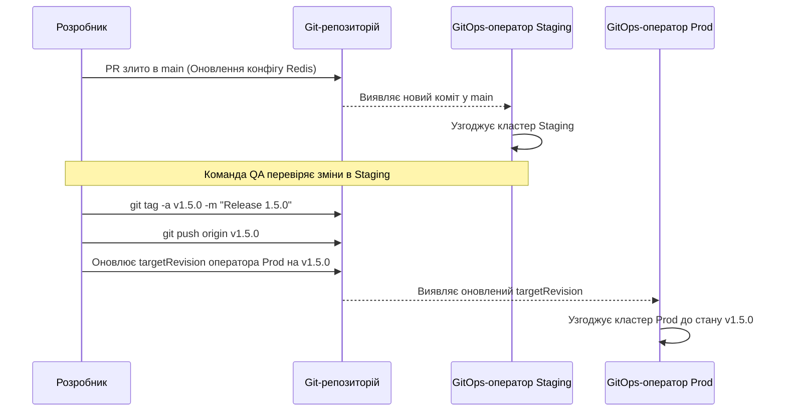

---

### План перекладу:
1.  **Фронтметер**: Переклад заголовка, збереження структури, додавання посилань на англійське джерело.
2.  **Результати навчання**: Переклад дієслів у формі **жирного інфінітива**.
3.  **Основний текст**: Переклад із залученням термінів English (kubectl, Pod тощо), дотримання глосарію (кластер, вузол).
4.  **Спеціальні блоки**: Переклад заголовків (Чи знали ви?, Типові помилки тощо).
5.  **Код та YAML**: Збереження без змін.

---

### Перекладений файл:

```markdown
---
title: "Модуль 10: Міст до GitOps — інфраструктура як джерело"
description: "Перехід від ручного керування інфраструктурою до декларативного узгодження на основі Git."
complexity: "MEDIUM"
timeToComplete: "60 хвилин"
sidebar:
  order: 10
en_commit: "ddf9c21536b1c56db9cb1ea4f42dc75bd8a351fe"
en_file: "src/content/docs/prerequisites/git-deep-dive/module-10-gitops-bridge.md"
---

# Модуль 10: Міст до GitOps — інфраструктура як джерело

## Що ви зможете зробити

- **Спроектувати** структуру репозиторію інфраструктури для кількох середовищ, використовуючи Kustomize overlays для усунення дублювання конфігурації.
- **Впровадити** процеси просування (promotion) конфігурацій на основі Git-тегів для надійного перенесення налаштувань зі staging у production.
- **Діагностувати** розбіжність станів (state drift) між працюючим кластером Kubernetes та його джерелом істини в Git-репозиторії за допомогою циклів узгодження (reconciliation loops).
- **Оцінити** переваги безпеки захисту гілок та криптографічного підпису комітів у ланцюжку постачання GitOps із нульовою довірою (zero-trust).
- **Впровадити** стратегії захисту гілок та ізоляції директорій для запобігання несанкціонованим змінам інфраструктури.

## Чому це важливо

Платіжний шлюз вийшов з ладу о 14:00 у найбільш завантажений торговий день року. Дашборди моніторингу в центрі керування спалахнули червоним, а основний API почав повертати помилки HTTP 503 Service Unavailable тисячам клієнтів щохвилини. Команда реагування на інциденти швидко виявила безпосередній симптом: у Deployment `payment-processing` була відсутня критична змінна оточення, необхідна для автентифікації в нещодавно створеному кластері бази даних. Провідний інженер платформи перевірив логи конвеєра безперервної інтеграції (CI pipeline) — кожне останнє завдання з розгортання було завершене успішно. Вона перевірила Git-репозиторій інфраструктури — необхідна змінна оточення була чітко визначена в маніфестах Kubernetes. Проте, коли вона перевірила поточний стан через командний рядок, змінна була повністю відсутня у запущених Pod.

Що ж насправді сталося? Три дні тому розробник терміново усував проблему вичерпання ресурсів у середовищі production. Щоб швидко перевірити гіпотезу, він обійшов конвеєр розгортання і вручну виконав команду редагування безпосередньо над живим об'єктом Deployment зі свого термінала, ненавмисно видаливши при цьому заплановані зміни конфігурації бази даних. Він мав намір скасувати зміну, але забув. Оскільки традиційний конвеєр розгортання "на основі проштовхування" (push-based) взаємодіє з кластером лише тоді, коли новий коміт коду запускає виконання, кластер тихо відхилився від цільового стану, визначеного у версіях Git. Бомба сповільненої дії залишалася непоміченою в production, доки стару базу даних нарешті не вивели з експлуатації, що спровокувало катастрофічний збій.

Цей сценарій ілюструє фундаментальний недолік імперативного керування інфраструктурою та традиційних push-конвеєрів розгортання. Якщо люди-оператори або зовнішні системи автоматизації мають повноваження змінювати стан кластера безпосередньо, розбіжність конфігурації (configuration drift) є не просто можливістю — це абсолютна неминучість на тривалому проміжку часу. У цьому модулі ви дізнаєтеся, як подолати прірву між вашими Git-репозиторіями та середовищами Kubernetes, прийнявши операційну модель GitOps. Ви перейдете від ставлення до Git як до пасивного механізму зберігання до забезпечення його ролі як активного, безперервно узгоджуваного єдиного джерела істини для всієї архітектури вашої платформи.

## Зміна парадигми GitOps: від Push до Pull

Протягом багатьох років галузевий стандарт доставки програмного забезпечення та інфраструктури покладався на модель "Push" (проштовхування). У push-архітектурі розробник зливає код у репозиторій, що запускає сервер безперервної інтеграції (CI). Цей сервер збирає артефакти, запускає тести, а потім бере на себе відповідальність за розгортання змін. Для цього серверу CI потрібні високопривілейовані облікові дані — часто права cluster-admin — для автентифікації в цільовому кластері Kubernetes та виконання команд на кшталт `kubectl apply -f manifests/`.

Хоча це було значним покращенням порівняно з ручним розгортанням, це створює величезні ризики для безпеки та стабільності. CI-сервер стає пріоритетною ціллю для зловмисників; компрометація системи CI надає зловмиснику ключі до всього "королівства" production. Крім того, push-модель абсолютно не бачить того, що відбувається в кластері після завершення розгортання. Якщо адміністратор вручну видалить ресурс, CI-конвеєр про це не дізнається. Стан, описаний у Git, і фактичний стан кластера розходяться, що призводить до жахливої "конфігураційної розбіжності" (drift).

GitOps впроваджує фундаментальну зміну парадигми, переходячи до моделі "Pull" (витягування). В архітектурі GitOps логіка розгортання повністю переноситься всередину самого кластера Kubernetes. Спеціалізований програмний оператор — такий як ArgoCD або Flux — постійно працює як Pod у кластері. Цей оператор налаштований на доступ лише для читання до вашого Git-репозиторію. Його єдина мета — постійно порівнювати бажаний стан (маніфести, що зберігаються в Git) із фактичним поточним станом кластера. Коли він виявляє різницю, він автоматично витягує зміни з Git і застосовує їх локально для синхронізації станів.

Уявіть цей перехід як роботу кухні ресторану. Модель Push подібна до того, як офіціант забігає на кухню і вигукує інструкції безпосередньо кухареві, іноді сам пересуваючи каструлі на плиті, щоб прискорити процес. Це працює, коли немає напливу відвідувачів, але під час пікових годин це призводить до хаосу, пропущених замовлень і конфліктних дій. Модель Pull, навпаки, є стандартною системою квитків на рейці. Офіціант (розробник) записує замовлення на квитку і кладе його на рейку (Git-репозиторій). Кухар (GitOps-оператор) постійно спостерігає за рейкою. Коли з'являється новий квиток, кухар знімає його і виконує саме так, як написано. Кухар — єдина людина, якій дозволено торкатися плити, що забезпечує контрольоване, передбачуване та перевірене середовище.

Розглянемо, як це змінює нашу взаємодію з Kubernetes. У традиційному push-середовищі скрипт конвеєра міг би виглядати як така імперативна послідовність:

```bash
# Традиційний імперативний скрипт Push-конвеєра
echo "Authenticating to Kubernetes..."
aws eks update-kubeconfig --region us-east-1 --name prod-cluster
echo "Applying manifests..."
kubectl apply -f deployment.yaml
kubectl apply -f service.yaml
echo "Checking deployment status..."
kubectl rollout status deployment/frontend -n production
```

У середовищі GitOps скрипт конвеєра взагалі не торкається Kubernetes. Конвеєр просто оновлює Git-репозиторій, можливо, змінюючи тег образу в маніфесті та створюючи коміт:

```bash
# Декларативний скрипт GitOps CI-конвеєра
echo "Updating image tag in deployment manifest..."
sed -i 's/frontend:v1.2.0/frontend:v1.2.1/g' deployment.yaml
git add deployment.yaml
git commit -m "chore: bump frontend image to v1.2.1"
git push origin main
# На цьому робота конвеєра завершується. Оператор кластера бере керування на себе.
```

> **Зупиніться та подумайте**: Уявіть сценарій, де розробник із доступом до кластера вручну виконує `kubectl delete service frontend -n production`. Що станеться далі в традиційному Push-конвеєрі? Що станеться в архітектурі GitOps Pull? Поміркуйте над станом кластера через 10 хвилин після ручного видалення в обох сценаріях.

У сценарії з проштовхуванням Service залишиться видаленим до наступного разу, коли розробник випадково злиє код, що запустить CI-конвеєр для повторного виконання `kubectl apply`. Застосунок залишатиметься непрацездатним годинами або днями. У сценарії GitOps внутрішній оператор виявить відсутній Service під час свого наступного циклу узгодження (зазвичай протягом 3 хвилин) і негайно відтворить його на основі визначення, яке все ще присутнє в Git-репозиторії, фактично самолікуючи кластер і відхиляючи ручну зміну.

## Архітектура репозиторію інфраструктури

Щоб ефективно використовувати GitOps, ви повинні спроектувати структуру репозиторію, яка може вміщувати кілька середовищ — таких як Development, Staging та Production — без дублювання тисяч рядків YAML. Якщо ви просто скопіюєте та вставите свої маніфести Deployment в окремі папки для кожного середовища, ви створите систему, яку неможливо підтримувати. Коли потрібно буде додати нову змінну оточення до всіх середовищ, інженер повинен буде вручну оновити три або більше окремих файлів, що практично гарантує, що якесь середовище буде пропущене або налаштоване неправильно.

Галузевим стандартом вирішення цієї проблеми в екосистемі Kubernetes є Kustomize — інструмент керування конфігурацією без шаблонів, вбудований безпосередньо в `kubectl`. Kustomize працює на основі концепції "Баз" (Bases) та "Накладень" (Overlays). Директорія Base містить загальні, основоположні маніфести, які застосовуються до всіх середовищ. Директорії Overlay містять лише специфічні відмінності, або патчі (patches), необхідні для конкретного середовища, такі як різна кількість реплік, специфічні ліміти ресурсів або карти конфігурації (ConfigMaps) для окремих середовищ.

При проектуванні репозиторію слід відокремлювати вихідний код застосунку від маніфестів інфраструктури. Це запобігає випадковому запуску циклів розгортання інфраструктури конвеєрами CI, які збирають бінарні файли застосунку, і навпаки.

Розглянемо оптимальну структуру директорій для репозиторію інфраструктури з кількома середовищами:

```text
infrastructure-repo/
├── platform-components/           <-- Основні додатки кластера
│   ├── ingress-nginx/
│   ├── cert-manager/
│   └── external-dns/
└── applications/                  <-- Визначення робочих навантажень
    └── frontend-service/
        ├── base/                  <-- Загальні базові маніфести
        │   ├── deployment.yaml
        │   ├── service.yaml
        │   └── kustomization.yaml <-- Оголошує базові ресурси
        └── overlays/              <-- Патчі для конкретних середовищ
            ├── dev/
            │   ├── patch-replicas.yaml
            │   ├── patch-env.yaml
            │   └── kustomization.yaml <-- Вказує на base, застосовує dev-патчі
            ├── staging/
            │   ├── patch-replicas.yaml
            │   └── kustomization.yaml
            └── prod/
                ├── patch-replicas.yaml
                ├── patch-resources.yaml
                └── kustomization.yaml
```

Давайте розглянемо, як Kustomize усуває дублювання. Файл `base/deployment.yaml` містить стандартне визначення:

```yaml
# applications/frontend-service/base/deployment.yaml
apiVersion: apps/v1
kind: Deployment
metadata:
  name: frontend
spec:
  replicas: 1 # Стандартне консервативне базове значення
  selector:
    matchLabels:
      app: frontend
  template:
    metadata:
      labels:
        app: frontend
    spec:
      containers:
      - name: web
        image: myregistry.com/frontend:latest
        ports:
        - containerPort: 8080
```

Для середовища production нам потрібна висока доступність та гарантовані обчислювальні ресурси. Замість копіювання всього файлу, ми створюємо цільовий патч у накладенні production:

```yaml
# applications/frontend-service/overlays/prod/patch-replicas.yaml
apiVersion: apps/v1
kind: Deployment
metadata:
  name: frontend
spec:
  replicas: 5 # Перевизначаємо кількість реплік для production
  template:
    spec:
      containers:
      - name: web
        resources:
          requests:
            cpu: "1000m"
            memory: "2Gi"
          limits:
            cpu: "2000m"
            memory: "4Gi"
```

Файл `kustomization.yaml` для production пов'язує їх разом, гарантуючи, що коли GitOps-оператор читає директорію `prod`, він динамічно об'єднує базу та патч у пам'яті перед застосуванням фінальної конфігурації до кластера:

```yaml
# applications/frontend-service/overlays/prod/kustomization.yaml
apiVersion: kustomize.config.k8s.io/v1beta1
kind: Kustomization
resources:
  - ../../base
patches:
  - path: patch-replicas.yaml
```

**Повчальна історія:** Один фінтех-стартап спочатку структурував свій GitOps-репозиторій, використовуючи окремі, від'єднані гілки для середовищ: гілку `dev`, гілку `staging` та гілку `main` для production. Розробникам доводилося використовувати `git cherry-pick` для перенесення змін інфраструктури між гілками. Під час великої міграції бази даних інженер переніс оновлення розгортання в гілку `main`, але зіткнувся з конфліктом злиття. Вирішуючи конфлікт, він випадково прийняв рядок підключення до бази даних `dev`. Оскільки не було єдиного перегляду всіх середовищ, помилка була непомітною під час перегляду запиту на злиття (pull request). Production підключився до бази даних розробки, що пошкодило тестові дані та спричинило серйозний інцидент із конфіденційністю. Ось чому структура на основі директорій (trunk-based infrastructure) значно краща: всі середовища видно в основній гілці, Kustomize забезпечує узгодженість, а відмінності чітко ізольовані в папках overlays.

## Керування релізами та семантичне версіонування

Коли інфраструктура повністю визначена в Git, ваші процеси Git стають вашою стратегією керування релізами. Як надійно просунути зміну конфігурації з середовища розробки через staging і, нарешті, у production? Хоча переміщення файлів між директоріями overlays є одним із методів, найбільш надійний підхід, що піддається аудиту, використовує Git-теги та семантичне версіонування (SemVer).

У зрілому середовищі GitOps оператор, що керує кластером production, не налаштований на відстеження гілки `main`. Відстеження рухомої гілки означає, що будь-який злитий pull request негайно впливає на production, що порушує принципи контрольованого керування релізами. Замість цього оператор production налаштований на відстеження конкретного Git-тегу, наприклад `v2.4.1`.

це створює свідомий, явний механізм просування. Коли інженери задоволені станом інфраструктури в гілці `main` (яка може безперервно розгортатися у кластер staging), вони створюють криптографічний Git-тег, що позначає саме цей коміт. Потім оператор GitOps для production оновлюється для націлювання на новий тег. Це гарантує, що production завжди прив'язаний до незмінного, миттєвого знімка репозиторію.

Розглянемо наступну діаграму Mermaid, що ілюструє цю архітектуру просування релізів:



Щоб реалізувати це на практиці за допомогою Kubernetes версії 1.35+ та стандартних примітивів GitOps, ви повинні визначити набір інструкцій для GitOps-оператора. Інструменти на кшталт ArgoCD розширюють API Kubernetes за допомогою користувацьких визначень ресурсів (Custom Resource Definitions, CRD), впроваджуючи нові типи об'єктів, які розуміє кластер. Найфундаментальнішим із них є ресурс `Application`. Замість прямого застосування Deployments та Services, ви надсилаєте маніфест `Application` у кластер. Цей маніфест діє як покажчик, вказуючи оператору ArgoCD, за яким саме Git-репозиторієм стежити, який шлях містить маніфести (наприклад, Kustomize overlay) і який простір імен (namespace) кластера вибрати для розгортання. У зрілій системі ви налаштовуєте цей `Application` на суворе відстеження тегу семантичної версії, а не рухомої гілки.

```yaml
# ArgoCD Application CRD, що вказує інструменту GitOps керувати frontend у production
apiVersion: argoproj.io/v1alpha1
kind: Application
metadata:
  name: frontend-production
  namespace: gitops-system
spec:
  project: default
  source:
    repoURL: 'https://github.com/myorg/infrastructure.git'
    path: applications/frontend-service/overlays/prod
    # Націлювання саме на цей тег релізу, а не на гілку
    targetRevision: v1.5.0 
  destination:
    server: 'https://kubernetes.default.svc'
    namespace: production
  syncPolicy:
    automated:
      prune: true
      selfHeal: true
```

Коли приходить час просувати наступний реліз, операційна процедура суворо визначена в Git. Інженер створює новий тег, а потім надсилає pull request, що оновлює `targetRevision` з `v1.5.0` на `v1.6.0` у маніфесті застосунку.

> **Зупиніться та подумайте**: Ви виявили критичну вразливість безпеки в контролері Ingress у production, яка потребує негайного патчу конфігурації. У вашому середовищі staging зараз тестується велике оновлення бази даних у гілці `main`. Який підхід ви оберете для розгортання виправлення в production і чому?
> А) Злити виправлення в `main`, а потім позначити `main` як новий реліз для production.
> Б) Перейти на конкретний Git-коміт, що відповідає поточному тегу production, створити від нього гілку, застосувати виправлення, поставити тег на нову гілку і спрямувати production на новий тег.
> Подумайте про ізоляцію змін перед тим, як продовжувати.

Правильний архітектурний вибір — Б. Створивши гілку від поточного тегу production, ви ізолюєте термінове виправлення безпеки від деструктивних, неперевірених змін бази даних, які зараз знаходяться в гілці `main`. У цьому полягає сила незмінних Git-тегів: вони забезпечують відомий стабільний стан, до якого можна повернутися або від якого можна створити гілку в будь-який час, абсолютно незалежно від поточної розробки.

## Безпека та відповідність у конвеєрі GitOps

Перенесення "ключів від королівства" з CI-сервера всередину кластера значно зменшує зовнішню поверхню атаки, але фундаментально зміщує межу безпеки. Тепер Git-репозиторій є основним планом керування вашою інфраструктурою. Той, хто контролює репозиторій, контролює кластер. Тому захист конвеєра GitOps вимагає застосування суворого контролю доступу та криптографічної перевірки безпосередньо до системи керування версіями.

Найкритичнішим впровадженням безпеки в архітектурі GitOps є вимога криптографічно підписаних комітів. Якщо зловмисник отримає доступ до робочої станції інженера або викраде його облікові дані Git, він може проштовхнути шкідливі зміни інфраструктури (наприклад, відкрити NodePort для експонування внутрішньої бази даних), видаючи себе за справжнього інженера.

> **Зупиніться та подумайте**: Якщо зловмисник скомпрометує облікові дані хмарного провайдера розробника (наприклад, ключ доступу AWS), але не матиме його ключа підпису Git SSH, чи зможе він успішно розгорнути шкідливе навантаження в кластері production у моделі Zero-Trust GitOps?

Ні, не зможе. Оскільки CI-конвеєр більше не проштовхує зміни, а оператор кластера є єдиним органом, що має право змінювати стан, зовнішні хмарні облікові дані марні для розгортання. Якщо зловмисник спробує проштовхнути зміни в репозиторій, правила захисту гілок відхилять коміт, оскільки він не має дійсного криптографічного підпису. Межа довіри надійно змістилася до системи керування версіями.

Щоб запобігти цій атаці на ланцюжок постачання, інженери повинні підписувати свої коміти за допомогою ключів GPG або SSH, прив'язаних до апаратних модулів безпеки або суворих провайдерів ідентифікації. Коли коміт підписаний, Git створює криптографічний підпис, який доводить, що особа, яка створила коміт, володіє приватним ключем, пов'язаним із її особистістю.

```bash
# Налаштування Git для підпису комітів за допомогою SSH-ключа
git config --global gpg.format ssh
git config --global user.signingkey ~/.ssh/id_ed25519.pub
git config --global commit.gpgsign true

# Створення підписаного коміту (Git автоматично використовує налаштований ключ)
git commit -S -m "feat: enforce network policies in production"
```

Однак локальне підписання комітів марне, якщо інфраструктура не вимагає цього. Це досягається за допомогою суворих правил захисту гілок (Branch Protection Rules), налаштованих у центральному Git-репозиторії (наприклад, GitHub, GitLab). Репозиторій GitOps із нульовою довірою повинен забезпечувати виконання таких правил для основної гілки:

1.  **Вимога підписаних комітів**: Система керування версіями повинна відхиляти будь-який коміт, надісланий до репозиторію, який не має дійсного криптографічного підпису.
2.  **Вимога перегляду pull request перед злиттям**: Жоден інженер не може проштовхувати код безпосередньо в гілку main. Потрібно мінімум два схвалення від призначених власників коду (code owners).
3.  **Вимога успішного проходження перевірок стану**: Автоматизовані скрипти валідації (такі як лінтинг YAML, перевірка схем Kubernetes та інструменти сканування безпеки, наприклад Checkov або KubeLinter) повинні пройти успішно до того, як кнопка злиття стане доступною.

Розглянемо, як межа довіри зміщується від інфраструктури CI до Git-репозиторію, як показано на наступній діаграмі:

```mermaid
graph TD
    subgraph Традиційна модель Push
        Developer1[Розробник] -->|git push| GitRepo1[(Git-репозиторій)]
        GitRepo1 -->|webhook| CIServer[CI-сервер]
        CIServer -->|kubectl apply| Cluster1((Кластер Kubernetes))
        Attacker1[Зловмисник] -.->|Компрометує| CIServer
    end

    subgraph Модель GitOps Pull (Zero-Trust)
        Developer2[Розробник] -->|Підписаний git push| GitRepo2[(Git-репозиторій)]
        GitRepo2 -.->|Захист гілок| Validated[(Перевірене джерело істини)]
        Validated <--|git pull| Operator[GitOps-оператор]
        Operator -->|Узгоджує| Cluster2((Кластер Kubernetes))
        Attacker2[Зловмисник] -.->|Немає доступу до| Operator
    end

    style CIServer fill:#f9a8d4,stroke:#be185d,stroke-width:2px
    style Operator fill:#a7f3d0,stroke:#047857,stroke-width:2px
```

Коли ці заходи впроваджені, рівень безпеки інфраструктури кардинально змінюється. Давайте порівняємо відмінності:

| Вектор безпеки | Традиційний CI/CD (Push) | Zero-Trust GitOps (Pull) |
| :--- | :--- | :--- |
| **Облікові дані кластера** | Зберігаються ззовні в CI-серверах; високий ризик викрадення. | Зберігаються виключно всередині кластера; ніколи не залишають його меж. |
| **Можливість аудиту** | Складно; вимагає зіставлення логів CI, історії Git та логів аудиту кластера. | Абсолютна; `git log` надає математично доведену точну історію всіх станів кластера. |
| **Запобігання розбіжностям** | Слабке; ручні зміни в кластері можуть існувати нескінченно до переписування. | Сильне; оператор постійно перезаписує ручні зміни істиною з Git протягом хвилин. |
| **Авторизація** | Покладається на складне відображення дозволів системи CI на Kubernetes RBAC. | Покладається виключно на дозволи Git-репозиторію та правила захисту гілок. |

Впроваджуючи захист гілок та підписані коміти, ви гарантуєте, що кожна зміна, застосована до вашого кластера, була свідомо створена перевіреною особою, рецензована уповноваженим персоналом, механічно протестована на синтаксичні та безпекові недоліки та назавжди зафіксована в незмінному реєстрі. Сам кластер стає детермінованою функцією Git-репозиторію.

## Чи знали ви?

- **Походження терміна**: Термін "GitOps" був запропонований у 2017 році Алексісом Річардсоном, генеральним директором Weaveworks, для опису операційних паттернів, які вони розробили для безпечного керування власною інфраструктурою Kubernetes.
- **За межами Kubernetes**: Хоча цей патерн став популярним завдяки Kubernetes, GitOps може керувати і зовнішніми хмарними ресурсами. Проєкти на кшталт Crossplane дозволяють визначати бази даних AWS RDS або сховища GCP як YAML у вашому Git-репозиторії, а GitOps-оператор створить їх через хмарні API.
- **Швидкість узгодження**: Стандартні цикли узгодження для популярних GitOps-операторів зазвичай запускаються кожні 3 хвилини. Однак їх можна налаштувати за допомогою вебхуків від Git-провайдера для миттєвого запуску узгодження в той момент, коли коміт злито, усуваючи затримки опитування.
- **Тест порожнього кластера**: Справжньою перевіркою зрілої реалізації GitOps є відновлення після катастроф. Якщо production-кластер буде повністю знищений, розгортання порожнього кластера Kubernetes, встановлення GitOps-оператора та спрямування його на репозиторій має призвести до повного відтворення всього стану платформи без втручання людини.

## Типові помилки

| Помилка | Чому це стається | Як виправити |
| :--- | :--- | :--- |
| **Зберігання секретів у Git** | Інженери сприймають Git як єдине джерело істини, забуваючи, що історія Git є постійною та доступною кожному, хто має доступ до репозиторію. | Використовуйте інструменти на кшталт External Secrets Operator або Mozilla SOPS для шифрування секретів перед комітом або отримуйте їх динамічно з Vault під час виконання. |
| **Використання тегів `latest`** | Розробники хочуть зручності завжди розгортати останню збірку без оновлення маніфестів. | GitOps-оператор не може виявити зміну, якщо текст тегу (`latest`) залишається незмінним. Завжди використовуйте явні унікальні теги (наприклад, SHA коміту або SemVer теги) у маніфестах. |
| **Гілка на кожне середовище** | Спроба відобразити Git-гілки безпосередньо на середовища (гілка `dev`, гілка `prod`), що призводить до складних конфліктів злиття та розбіжних історій. | Використовуйте підхід trunk-based інфраструктури з директоріями overlays (наприклад, Kustomize) в одній гілці `main`, щоб усі середовища мали спільну історію. |
| **Ручне втручання через `kubectl`** | Операційні команди обходять Git-процес під час аварійних ситуацій, створюючи розбіжність конфігурації. | Скасуйте право на запис у кластер для всіх користувачів. Інженери повинні бути змушені використовувати Git-конвеєр навіть для термінових виправлень. |
| **Ігнорування налаштування Prune** | Оператори налаштовують політики синхронізації, але забувають увімкнути автоматичне видалення (pruning) ресурсів, видалених із Git. | Явно увімкніть параметр `prune: true` у ваших маніфестах застосунків GitOps, щоб ресурси, видалені з репозиторію, активно видалялися з кластера. |
| **Змішування коду застосунку та інфраструктури** | Зберігання вихідного коду застосунку та маніфестів Kubernetes у тому самому репозиторії запускає нескінченні цикли CI/CD. | Розділіть вашу архітектуру: використовуйте один репозиторій для коду (який збирає образи) і окремий, виділений репозиторій виключно для маніфестів інфраструктури. |

## Контрольні запитання

<details>
<summary>1. Розробник оновлює код застосунку, збирає новий контейнерний образ із тегом `v3.0.0` і проштовхує його в реєстр. Він збентежений, чому production-кластер ще не оновився. У суворій архітектурі GitOps, який пропущений крок має відбутися, щоб кластер розпізнав новий образ?</summary>
Кластер працює суворо за моделлю Pull на основі репозиторію інфраструктури. Проштовхування нового образу в реєстр не змінює декларативний стан у Git. Пропущений крок полягає в тому, що потрібно зробити коміт у репозиторій інфраструктури, оновивши маніфест Deployment Kubernetes так, щоб він посилався на новий тег образу `v3.0.0`. Тільки після того, як цей коміт буде злито у відстежувану гілку (або буде створено новий тег релізу), GitOps-оператор виявить заплановану зміну і витягне новий образ у кластер.
</details>

<details>
<summary>2. О 3:00 ранку ви отримуєте сповіщення про те, що сервіс NodePort у production був випадково відкритий у публічний інтернет. Ви швидко з'ясовуєте, що молодший інженер вручну виконав команду `kubectl expose` безпосередньо у кластері. Припускаючи, що працює повністю налаштований GitOps-оператор, які дії вам потрібно вжити, щоб повернути сервіс до безпечного стану?</summary>
Вам не потрібно вживати жодних ручних дій. Основним принципом GitOps є безперервне узгодження (continuous reconciliation). GitOps-оператор, що працює в кластері, постійно порівнює поточний стан із Git-репозиторієм. Коли запуститься його наступний цикл узгодження (зазвичай протягом декількох хвилин), він виявить, що вручну створеного сервісу NodePort не існує в Git-репозиторії. Оскільки він забезпечує декларативну істину, оператор автоматично видалить або скасує несанкціонований сервіс, самолікуючи кластер.
</details>

<details>
<summary>3. Ваша організація використовує Kustomize для керування середовищами. Вам потрібно збільшити ліміт пам'яті для `inventory-service` виключно в середовищі `staging`. Базове розгортання визначає ліміт пам'яті `512Mi`. Де і як ви впровадите цю зміну?</summary>
Ви не повинні торкатися файлу `base/deployment.yaml`, оскільки це вплине на всі середовища. Замість цього ви маєте створити файл патчу в директорії `overlays/staging/` (наприклад, `patch-memory.yaml`), який цілеспрямовано обирає Deployment `inventory-service` і перевизначає ліміт пам'яті на нове значення. Потім ви посилаєтеся на цей файл патчу в `overlays/staging/kustomization.yaml` у розділі `patches`. Це гарантує, що зміна ізольована виключно середовищем staging.
</details>

<details>
<summary>4. Ваша команда переводить застарілий застосунок на GitOps. Застосунок потребує Secret Kubernetes, що містить пароль до бази даних. Інженер пропонує покласти звичайний YAML Secret безпосередньо в репозиторій інфраструктури, оскільки Git тепер є "єдиним джерелом істини". Чому це є грубим порушенням безпеки і що слід зробити натомість?</summary>
Історія Git є незмінною і часто доступною багатьом інженерам в організації. Коміт секретів у відкритому тексті робить їх доступними назавжди, навіть якщо вони будуть видалені в наступному коміті. Хоча GitOps вимагає, щоб увесь стан був декларативним, із секретами слід поводитися інакше. Вам слід використовувати рішення на кшталт Mozilla SOPS для шифрування файлу перед комітом або використовувати External Secrets Operator для оголошення посилання в Git, яке отримує реальний пароль із безпечного сховища (наприклад, AWS Secrets Manager) під час виконання всередині кластера.
</details>

<details>
<summary>5. Ви досліджуєте середовище staging, де застосунок не може підключитися до кешу. Розробник наполягає, що він злив правильне оновлення ConfigMap у накладення `staging` дві години тому. Ви перевіряєте живий кластер і бачите старі значення. Використовуючи GitOps-оператор, які конкретні діагностичні кроки ви повинні зробити, щоб визначити, чому цикл узгодження не зміг синхронізувати стан кластера?</summary>
Спочатку ви повинні перевірити статус ресурсу application в GitOps-операторі (наприклад, `kubectl describe application frontend-staging -n argocd`), щоб визначити, чи повідомляє він про стан синхронізації як 'Degraded' або 'OutOfSync'. Далі ви повинні перевірити логи контролера оператора або події ресурсу Application, щоб знайти точну помилку, яка зупинила узгодження. Найчастіше це виявляє помилку валідації схеми, відсутнє посилання на базу Kustomize або синтаксичну помилку в нещодавно злитому патчі YAML. Оскільки GitOps-оператор перевіряє весь декларативний стан перед його застосуванням, один некоректний маніфест призведе до безпечного переривання циклу узгодження, запобігаючи потраплянню помилки у кластер.
</details>

<details>
<summary>6. Під час масштабної маркетингової кампанії трафік непередбачувано зростає. Щоб впоратися з навантаженням, Horizontal Pod Autoscaler (HPA) автоматично масштабує Deployment фронтенду з 5 до 50 реплік. Однак у Git-репозиторії все ще вказано `replicas: 5` у маніфесті розгортання. Чому GitOps-оператор негайно не зменшує кількість реплік назад до 5?</summary>
Правильно налаштована система GitOps покладається на ігнорування певних полів, які, як очікується, будуть змінюватися іншими контролерами кластера. У цьому випадку GitOps-оператор повинен бути налаштований на ігнорування поля `spec.replicas` об'єкта Deployment, коли присутній HPA. Якби він не був налаштований на ігнорування цієї розбіжності, GitOps-оператор та HPA боролися б у нескінченному циклі: HPA масштабував би вгору на основі метрик, а GitOps-оператор — вниз на основі маніфесту в Git. Цей конфлікт серйозно погіршив би продуктивність кластера і завадив би застосунку масштабуватися під час піку трафіку.
</details>

<details>
<summary>7. Ви розробляєте стратегію релізів для фінансової платформи з високим рівнем регулювання. Вимоги відповідності (compliance) вимагають, щоб жодна особа не могла одноосібно внести зміну в production, а точний стан production мав бути перевірений у будь-який історичний момент часу. Як ви налаштуєте Git-репозиторій та GitOps-оператор, щоб задовольнити ці вимоги?</summary>
По-перше, ви повинні забезпечити суворі правила захисту гілок у репозиторії інфраструктури: вимагати криптографічно підписаних комітів для підтвердження особи та обов'язкового схвалення хоча б одного pull request для запобігання одноосібним змінам. По-друге, замість того, щоб оператор GitOps у production відстежував рухому гілку, як-от `main`, ви налаштовуєте його `targetRevision` на відстеження конкретних незмінних Git-тегів (наприклад, `v2.0.1`). Щоб просунути зміну, інженери створюють підписаний тег і оновлюють покажчик оператора, забезпечуючи явну простежуваність у конкретний момент часу. Це гарантує, що production завжди відповідає перевіреній, схваленій версії репозиторію.
</details>

## Практична вправа

У цій вправі ви з нуля побудуєте базову структуру репозиторію GitOps, використовуючи Kustomize для керування конфігураціями середовищ без дублювання YAML. Потім ви зсимулюєте роль GitOps-оператора, згенерувавши фінальні конфігурації, щоб перевірити, що саме буде застосовано до кластера.

### Інструкції з налаштування

Переконайтеся, що у вас встановлено сучасний термінал, `git` та інструмент `kustomize`. Крім того, якщо у вас встановлено `kubectl` (версія 1.14+), він має вбудовану функціональність Kustomize через прапорець `-k`.

Створіть нову робочу директорію для цієї вправи:
```bash
mkdir -p ~/gitops-dojo && cd ~/gitops-dojo
git init
```

### Завдання 1: Створення базової архітектури
Створіть структуру директорій для застосунку `catalog-api` з базовою конфігурацією та двома накладеннями середовищ: `staging` та `production`.

<details>
<summary>Рішення</summary>

```bash
mkdir -p catalog-api/base
mkdir -p catalog-api/overlays/staging
mkdir -p catalog-api/overlays/prod
```
</details>

### Завдання 2: Визначення спільної бази
У директорії `catalog-api/base` створіть два файли:
1.  `deployment.yaml`: Стандартний Deployment Kubernetes для `catalog-api`, що використовує образ `k8s.gcr.io/echoserver:1.4`, порт 8080 та 1 репліку.
2.  `kustomization.yaml`: Файл, що оголошує розгортання як ресурс.

<details>
<summary>Рішення</summary>

Створіть `catalog-api/base/deployment.yaml`:
```yaml
apiVersion: apps/v1
kind: Deployment
metadata:
  name: catalog-api
spec:
  replicas: 1
  selector:
    matchLabels:
      app: catalog-api
  template:
    metadata:
      labels:
        app: catalog-api
    spec:
      containers:
      - name: api
        image: k8s.gcr.io/echoserver:1.4
        ports:
        - containerPort: 8080
```

Створіть `catalog-api/base/kustomization.yaml`:
```yaml
apiVersion: kustomize.config.k8s.io/v1beta1
kind: Kustomization
resources:
  - deployment.yaml
```
</details>

### Завдання 3: Створення накладення Staging
Staging має точно відображати базу, але ми хочемо додати контейнеру специфічну змінну оточення.
У директорії `catalog-api/overlays/staging` створіть файл патчу, який додає змінну оточення `ENV_NAME` зі значенням `staging` у контейнер `api`. Потім підключіть його у `kustomization.yaml`, який посилається на базу та застосовує патч.

<details>
<summary>Рішення</summary>

Створіть `catalog-api/overlays/staging/patch-env.yaml`:
```yaml
apiVersion: apps/v1
kind: Deployment
metadata:
  name: catalog-api
spec:
  template:
    spec:
      containers:
      - name: api
        env:
        - name: ENV_NAME
          value: "staging"
```

Створіть `catalog-api/overlays/staging/kustomization.yaml`:
```yaml
apiVersion: kustomize.config.k8s.io/v1beta1
kind: Kustomization
resources:
  - ../../base
patches:
  - path: patch-env.yaml
```
</details>

### Завдання 4: Створення накладення Production
Production потребує високої доступності. У директорії `catalog-api/overlays/prod` створіть файл патчу, який збільшує кількість реплік до 3 та встановлює ліміт CPU `500m`. Створіть відповідний `kustomization.yaml` для застосування цього патчу.

<details>
<summary>Рішення</summary>

Створіть `catalog-api/overlays/prod/patch-production.yaml`:
```yaml
apiVersion: apps/v1
kind: Deployment
metadata:
  name: catalog-api
spec:
  replicas: 3
  template:
    spec:
      containers:
      - name: api
        resources:
          limits:
            cpu: "500m"
```

Створіть `catalog-api/overlays/prod/kustomization.yaml`:
```yaml
apiVersion: kustomize.config.k8s.io/v1beta1
kind: Kustomization
resources:
  - ../../base
patches:
  - path: patch-production.yaml
```
</details>

### Завдання 5: Симуляція GitOps-оператора (Валідація)
GitOps-оператор, наприклад ArgoCD, по суті виконує команди Kustomize build за лаштунками перед їх застосуванням у кластері. Перевірте свою конфігурацію, запустивши Kustomize build для обох накладень і переглянувши фінальний об'єднаний вивід YAML.

<details>
<summary>Рішення</summary>

Виконайте наступні команди та перевірте вивід, щоб переконатися, що патчі були застосовані правильно:

```bash
# Перевірка Staging (має бути 1 репліка та змінна ENV_NAME)
kubectl kustomize catalog-api/overlays/staging

# Перевірка Production (має бути 3 репліки та ліміт CPU, без змінної ENV_NAME)
kubectl kustomize catalog-api/overlays/prod
```
Якщо вивід відповідає вашим очікуванням, ваша структура директорій є математично правильною та готовою до відправлення в Git-репозиторій.
</details>

### Критерії успіху
- [ ] Ви створили ієрархічну структуру директорій, що відокремлює базові конфігурації від накладень середовищ.
- [ ] Ви не дублювали основні визначення контейнера (образ, порти) між середовищами.
- [ ] Виконання `kubectl kustomize` для накладення staging створює маніфест із доданою змінною оточення.
- [ ] Виконання `kubectl kustomize` для накладення production створює маніфест із 3 репліками та лімітами CPU.
- [ ] Базова конфігурація залишилася недоторканою та незміненою.

## Наступний модуль
[Курс Філософія та проектування](../../philosophy-design/) — зануртеся глибше в архітектурні принципи, що керують надійною та стійкою інженерією платформ.
```