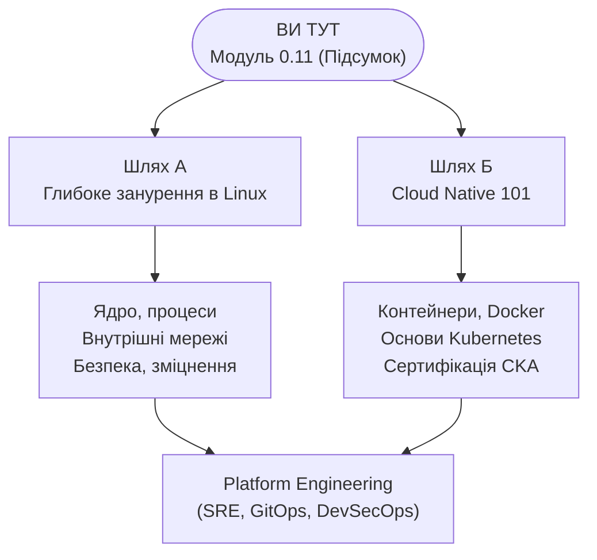

> **Складність**: `[СЕРЕДНЯ]` — Підсумковий проєкт
>
> **Час на виконання**: 40–50 хвилин
>
> **Пререквізити**: від [Модуля 0.1](../module-0.1-what-is-a-computer/) до [Модуля 0.9](/prerequisites/zero-to-terminal/module-0.10-what-is-the-cloud/) — усі без винятку

---

## Що ви зможете зробити

Після цього модуля ви зможете:
- **Розгорнути** простий вебсервер через термінал і зрозуміти, що відбувається «під капотом»
- **Відстежити** HTTP-запит від браузера до сервера і назад, пояснюючи кожен крок
- **Протестувати** запущений сервер за допомогою `curl` з командного рядка
- **Пов'язати** концепції з усіх попередніх модулів: файли, мережі, порти, SSH — тут все зійдеться воєдино

---

## Чому це важливо

Це фінальний іспит. Підсумковий проєкт. Момент, коли все стає на свої місця.

Ви збираєтеся **розгорнути вебсайт, який зможе відвідати будь-хто. Використовуючи лише термінал.**

Ніяких складних конструкторів сайтів. Жодного WordPress чи Squarespace. Тільки ви, термінал і навички, які ви здобували, починаючи з Модуля 0.1.

Згадайте, з чого ви починали. У Модулі 0.1 ви дізналися, що таке комп'ютер взагалі. Тепер ви ось-ось використаєте його, щоб викласти щось в інтернет. Це не дрібниця. Це саме те, що професіонали роблять щодня — і ви теж збираєтеся це зробити.

Цей модуль має **два варіанти**:

- **Варіант А: Локально (безкоштовно, без реєстрації)** — запустіть вебсервер на власній машині за допомогою Docker
- **Варіант Б: У хмарі (Free Tier, потребує реєстрації)** — розгорніть сайт на справжньому хмарному сервері, до якого матиме доступ увесь інтернет

Варіант А швидший і простіший. Варіант Б ближчий до того, як це відбувається в реальному світі. Обидва варіанти є правильними. Оберіть той, що вас більше цікавить, або виконайте обидва.

---

## Навички, які ви здобули

Перед початком підіб'ємо підсумки. Кожен модуль, який ви пройшли, відіграє тут свою роль:

| Модуль | Навичка | Як ви її використаєте |
|--------|-------|-------------------|
| 0.1 | Як працюють комп'ютери | Розуміння того, що насправді робить сервер |
| 0.2 | Термінал | Ваш єдиний інтерфейс для всього цього проєкту |
| 0.3 | Команди | Навігація, створення файлів, перевірка статусу |
| 0.4 | Файли та директорії | Створення HTML-файлу вашого вебсайту |
| 0.5 | Редагування файлів | Написання вашої вебсторінки за допомогою nano |
| 0.6 | Мережі | Розуміння портів, IP-адрес та того, як браузери знаходять сервери |
| 0.7 | Сервери та SSH | Розуміння того, що таке сервер (і підключення до нього у Варіанті Б) |
| 0.8 | Пакети | Встановлення програмного забезпечення на сервері |
| 0.9 | Хмара | Розуміння того, де «живе» ваш сервер (Варіант Б) |

Якщо ви пропустили якісь із цих модулів, поверніться і пройдіть їх спочатку. Цей підсумковий проєкт передбачає, що у вас готові всі дев'ять навичок.

---

## Що таке вебсервер?

Перед тим як щось розгортати, переконаємося, що ми чітко розуміємо одну концепцію.

**Вебсервер** — це програма, яка очікує на запити та надсилає у відповідь вебсторінки. Це все. Коли ви вводите `google.com` у браузері, ваш браузер надсилає запит вебсерверу Google, а сервер надсилає назад HTML, який відображає ваш браузер.

Найпопулярніший вебсервер у світі називається **nginx** (вимовляється як «енджін-ікс»). Він забезпечує роботу приблизно третини всіх сайтів в інтернеті. Ми використаємо його сьогодні.

В нашій аналогії з ресторанною кухнею: nginx — це **офіціант**. Він приймає замовлення (HTTP-запити від браузерів) і приносить їжу (HTML-сторінки) назад клієнту.

---

## Варіант А: Локальний сервер з Docker (безкоштовно, без реєстрації)

Цей варіант використовує **Docker** — інструмент, який запускає програми в ізольованих «контейнерах». Вам не потрібно зараз глибоко розуміти Docker (для цього є курс Cloud Native 101). Наразі просто сприймайте це як спосіб запустити програму без її остаточного встановлення на вашу машину.

### Крок 1: Встановіть середовище виконання контейнерів

Вам потрібен інструмент для запуску контейнерів. Оберіть **будь-який** із цих — для нашої вправи вони працюють однаково:

| Інструмент | Найкращий для | Ліцензія |
|------|----------|---------|
| [Docker Desktop](https://www.docker.com/products/docker-desktop/) | Найпопулярніший, найбільша спільнота | Безкоштовно для особистого використання / малого бізнесу |
| [OrbStack](https://orbstack.dev/) | macOS — найшвидший, найлегший, найкращий UX | Безкоштовно для особистого використання |
| [Podman Desktop](https://podman-desktop.io/) | Без демона, безправний за замовчуванням | Безкоштовно та з відкритим кодом |
| [Rancher Desktop](https://rancherdesktop.io/) | Має вбудований K8s | Безкоштовно та з відкритим кодом |

- **macOS/Windows**: Завантажте та встановіть будь-який із вищеперелічених
- **Linux**:
  ```bash
  # Варіант А: Docker
  sudo apt update && sudo apt install docker.io -y
  sudo systemctl start docker
  sudo usermod -aG docker $USER

  # Варіант Б: Podman (без демона, права root не потрібні)
  sudo apt update && sudo apt install podman -y
  ```
  (Якщо використовуєте Docker, вийдіть із системи та зайдіть знову після команди usermod.)

> **Примітка**: Якщо ви встановили Podman, команди ідентичні — просто пишіть `podman` замість `docker`. Ви навіть можете створити аліас: `alias docker=podman`

Перевірте, чи працює Docker:

```bash
docker --version
```

Ви повинні побачити щось на кшталт `Docker version 24.x.x` або новішу версію. Якщо ви бачите «command not found», Docker ще не встановлено.

### Крок 2: Запустіть nginx

Ось вона. Одна команда для запуску вебсервера:

```bash
docker run -d -p 8080:80 --name my-website nginx
```

> **Зупиніться та подумайте**: Згадайте концепцію мережевих портів із Модуля 0.6. Якщо порт діє як виділений причал для прийому мережевого трафіку на вашій машині, що станеться на рівні операційної системи, коли Docker спробує прив’язатися до порту 8080, тоді як інший фоновий додаток вже активно прослуховує цей порт?

Розберемо кожну частину цієї команди (тому що розуміння важливіше за запам'ятовування):

| Частина | Що вона робить |
|------|-------------|
| `docker run` | Запустити новий контейнер |
| `-d` | Запустити у фоновому режимі (detached), щоб ви могли далі користуватися терміналом |
| `-p 8080:80` | З'єднати порт 8080 вашого комп'ютера з портом 80 контейнера |
| `--name my-website` | Дати контейнеру зрозумілу назву |
| `nginx` | Використати образ nginx (Docker завантажить його автоматично) |

Пам'ятаєте Модуль 0.6 про мережі? Порт 80 — це стандартний порт для вебтрафіку. Ми відображаємо його на 8080 вашої машини, щоб він не конфліктував ні з чим іншим.

> **Знайдіть зв'язок**: Прапор `-p 8080:80` — це Модуль 0.6 (порти) у дії. Ваш браузер надсилає запит на порт 8080 вашої машини. Docker перенаправляє його на порт 80 всередині контейнера, де очікує nginx. Відповідь повертається тим самим шляхом. Кожна концепція з цих модулів зараз працює разом.

### Крок 3: Перевірте роботу

Відкрийте веббраузер і перейдіть за адресою:

```
http://localhost:8080
```

Ви повинні побачити сторінку з написом **"Welcome to nginx!"**

Це вебсервер, що працює на вашій машині. Ви щойно це зробили. Однією командою.

### Крок 4: Створіть власну вебсторінку

> **Зупиніться та подумайте**: Поміркуйте, як вебсервер взаємодіє з файловою системою. Чи завантажує nginx усі HTML-файли в пам'ять під час запуску, чи він зчитує файл із жорсткого диска щоразу, коли надходить новий HTTP-запит? Виходячи з вашої відповіді, як відреагує система, якщо ви перезапишете файл `index.html`, поки сервер ще працює?

Тепер замінімо цю стандартну сторінку на ту, яку зробите ви. Відкрийте термінал і створіть HTML-файл:

```bash
nano ~/index.html
```

Введіть (або вставте) це:

```html
<!DOCTYPE html>
<html>
<head>
    <title>Мій перший сервер</title>
    <style>
        body {
            font-family: Arial, sans-serif;
            max-width: 600px;
            margin: 80px auto;
            text-align: center;
            background-color: #1a1a2e;
            color: #eee;
        }
        h1 { color: #00d4ff; }
        p { font-size: 1.2em; line-height: 1.6; }
        .badge {
            display: inline-block;
            background: #00d4ff;
            color: #1a1a2e;
            padding: 8px 20px;
            border-radius: 20px;
            font-weight: bold;
            margin-top: 20px;
        }
    </style>
</head>
<body>
    <h1>Привіт, інтернет!</h1>
    <p>Ця сторінка працює на сервері, який я налаштував самостійно,
       використовуючи лише термінал.</p>
    <p>Я пройшов шлях від «що таке комп'ютер» до «я розгорнув вебсайт»
       за десять модулів.</p>
    <div class="badge">Zero to Terminal: Виконано</div>
</body>
</html>
```

Збережіть та вийдіть (`Ctrl + O`, Enter, `Ctrl + X`).

### Крок 5: Скопіюйте сторінку на сервер

Пам'ятайте, вебсервер працює всередині контейнера Docker. Вам потрібно скопіювати ваш файл туди:

```bash
docker cp ~/index.html my-website:/usr/share/nginx/html/index.html
```

Ця команда каже: «Скопіюй `index.html` з моєї домашньої директорії в контейнер під назвою `my-website`, поклавши його за шляхом `/usr/share/nginx/html/index.html`».

Шлях `/usr/share/nginx/html/` — це місце, де nginx шукає вебсторінки для обслуговування. Це просто директорія — точнісінько як ті директорії, з якими ви працювали в Модулі 0.4.

### Крок 6: Подивіться на ВЛАСНУ сторінку

Поверніться в браузер і оновіть сторінку `http://localhost:8080`.

Ви повинні побачити свою кастомну сторінку — темний фон, блакитний заголовок, ваші слова.

**Ви щойно розгорнули вебсайт.**

Ви створили файл (Модуль 0.4), відредагували його за допомогою nano (Модуль 0.5), зрозуміли, що означають порт і localhost (Модуль 0.6), і запустили його через процес сервера (Модуль 0.7). Все поєдналося.

### Очищення

Коли закінчите милуватися своєю роботою:

```bash
docker stop my-website
docker rm my-website
```

Це зупинить і видалить контейнер. Ваш файл `~/index.html` залишиться на вашій машині.

---

## Варіант Б: Хмарний сервер (Free Tier)

Цей варіант розмістить ваш вебсайт на **справжньому сервері в інтернеті** з публічною IP-адресою. Будь-хто у світі зможе відвідати його. Саме так працюють справжні вебсайти.

Вам знадобиться акаунт з безкоштовним рівнем (free tier) у хмарного провайдера. Наведені нижче інструкції використовують загальний підхід, який працює з AWS, GCP або Oracle Cloud.

### Крок 1: Отримайте безкоштовну хмарну VM

Зареєструйтеся на безкоштовному рівні в одного з цих провайдерів:

- **Oracle Cloud** (найщедріший безкоштовний рівень — Always Free VM): [cloud.oracle.com/free](https://cloud.oracle.com/free)
- **Google Cloud** ($300 безкоштовного кредиту на 90 днів): [cloud.google.com/free](https://cloud.google.com/free)
- **AWS** (можливість отримання безкоштовної VM залежить від дати створення акаунта: акаунти, створені до **15 липня 2025 року**, використовують стару програму EC2 Free Tier на 12 місяців, тоді як акаунти, створені **15 липня 2025 року** або пізніше, використовують новий план AWS з іншими лімітами): [aws.amazon.com/free](https://aws.amazon.com/free)

Створіть найменшу доступну VM на Linux (Ubuntu найпростіша для новачків). Під час налаштування:

1. Оберіть **Ubuntu** як операційну систему
2. Оберіть **найменший екземпляр (instance), який зараз доступний за програмою free-tier** у вашого провайдера. Для AWS перевірте, що консоль маркує як free-tier eligible для вашого акаунта: старіші акаунти зазвичай бачать `t2.micro` або `t3.micro`, тоді як нові можуть бачити `t3.micro`, `t3.small`, `t4g.micro`, `t4g.small`, `c7i-flex.large` або `m7i-flex.large`.
3. **Завантажте SSH-ключ**, коли запропонують — він знадобиться для підключення
4. Переконайтеся, що група безпеки (security group) / файрвол дозволяє трафік через **порт 22 (SSH)** та **порт 80 (HTTP)**

Запишіть **публічну IP-адресу** вашого нового сервера. Вона виглядатиме приблизно так: `34.123.45.67`.

### Крок 2: Підключіться через SSH

Пам'ятаєте Модуль 0.7? Ось де SSH стає реальністю:

```bash
chmod 400 ~/Downloads/my-key.pem
ssh -i ~/Downloads/my-key.pem ubuntu@YOUR_PUBLIC_IP
```

Замініть `YOUR_PUBLIC_IP` на справжню IP-адресу вашої VM. Замініть шлях до ключа на той, де ви його зберегли.

Якщо все налаштовано правильно, ви побачите вітальне повідомлення Linux і запрошення до командного рядка. Тепер ви перебуваєте всередині комп'ютера в дата-центрі десь далеко — можливо, на іншому континенті.

### Крок 3: Встановіть nginx

Тепер скористайтеся навичками керування пакетами з Модуля 0.8:

```bash
sudo apt update
sudo apt install nginx -y
```

Це все. nginx встановлено і запущено. В Ubuntu він запускається автоматично після встановлення.

Перевірте, чи він працює:

```bash
sudo systemctl status nginx
```

Ви повинні побачити `active (running)` зеленим кольором.

> **Зупиніться та подумайте**: Ви перевірили, що процес nginx запущено, але зовнішні мережеві файрволи можуть блокувати вхідний трафік. Як би ви могли використати інструмент термінала безпосередньо всередині самої VM, щоб довести, що nginx активно віддає HTML-сторінку, повністю ізолювавши тест від будь-яких зовнішніх мережевих проблем?

### Крок 4: Протестуйте стандартну сторінку

Відкрийте браузер на своєму комп'ютері та перейдіть за адресою:

```
http://YOUR_PUBLIC_IP
```

Ви повинні побачити стандартну сторінку nginx. Ця сторінка передається з машини в дата-центрі через інтернет у ваш браузер. Зупиніться на мить, щоб усвідомити це.

### Крок 5: Створіть власну сторінку

> **Зупиніться та подумайте**: Вебсервер перетворює URL-адреси на шляхи у файловій системі. Якщо nginx відображає кореневий URL (`/`) безпосередньо на директорію `/var/www/html/`, який саме шлях повинен вказати користувач у своєму браузері, щоб отримати доступ до файлу зображення, який ви завантажили в `/var/www/html/assets/logo.png`?

Все ще підключені через SSH, відредагуйте стандартну вебсторінку:

```bash
sudo nano /var/www/html/index.html
```

> **Примітка**: В Ubuntu nginx використовує шлях `/var/www/html/`, а не `/usr/share/`. Різні системи розміщують вебфайли в дещо різних місцях.

Видаліть усе з файлу (багаторазово натискайте `Ctrl + K`) і введіть свій HTML:

```html
<!DOCTYPE html>
<html>
<head>
    <title>Мій перший хмарний сервер</title>
    <style>
        body {
            font-family: Arial, sans-serif;
            max-width: 600px;
            margin: 80px auto;
            text-align: center;
            background-color: #1a1a2e;
            color: #eee;
        }
        h1 { color: #00d4ff; }
        p { font-size: 1.2em; line-height: 1.6; }
        .badge {
            display: inline-block;
            background: #00d4ff;
            color: #1a1a2e;
            padding: 8px 20px;
            border-radius: 20px;
            font-weight: bold;
            margin-top: 20px;
        }
    </style>
</head>
<body>
    <h1>Привіт, інтернет!</h1>
    <p>Ця сторінка працює на справжньому хмарному сервері, який я налаштував самостійно,
       використовуючи лише SSH та термінал.</p>
    <p>Я пройшов шлях від «що таке комп'ютер» до «я розгорнув вебсайт 
       в інтернеті» за десять модулів.</p>
    <div class="badge">Zero to Terminal: Виконано</div>
</body>
</html>
```

Збережіть та вийдіть (`Ctrl + O`, Enter, `Ctrl + X`).

### Крок 6: Подивіться на свою сторінку в інтернеті

Оновіть `http://YOUR_PUBLIC_IP` у своєму браузері.

Ваша кастомна сторінка тепер **доступна в інтернеті**. Ви можете надіслати цю IP-адресу другу, і він теж побачить вашу сторінку. Зі свого телефону, з іншої країни — звідки завгодно.

Ви зробили це за допомогою SSH (Модуль 0.7), керування пакетами (Модуль 0.8), редагування файлів (Модуль 0.5) та розуміння мереж (Модуль 0.6) і хмарних обчислень (Модуль 0.9).

### Важливо: Попередження про Free Tier

Хмарні VM можуть коштувати грошей, якщо ви перевищите ліміти безкоштовного рівня. Коли закінчите з цією вправою:

- **Зупиніть або видаліть (terminate) вашу VM** через консоль хмарного провайдера
- Або залиште її працювати, якщо ваш free tier це дозволяє (наприклад, Always Free від Oracle)
- **Ніколи не залишайте хмарний ресурс увімкненим, якщо ви про нього забули** — це одна з найпоширеніших (і найдорожчих) помилок початківців

Щоб відключитися від SSH:

```bash
exit
```

---

## Чи знали ви?

- **Перший в історії вебсайт досі доступний онлайн.** Тім Бернерс-Лі створив його в 1991 році в CERN. Він працював на комп'ютері NeXT, на якому була наклеєна записка: «Ця машина — сервер. НЕ ВИМИКАТИ ЖИВЛЕННЯ!!» Ви все ще можете відвідати його за адресою [info.cern.ch](http://info.cern.ch). Ваше сьогоднішнє налаштування сервера було складнішим, ніж те, з якого почалася Всесвітня павутина.

- **nginx був створений для вирішення проблеми масштабування.** У 2002 році Ігор Сисоєв вирішив подолати «проблему C10K» — обслуговування 10 000 одночасних з'єднань на одному сервері. На той час Apache (панівний вебсервер) мав труднощі з такою моделлю. Сисоєв витратив два роки на написання nginx, і той став відомим завдяки своїй подійно-орієнтованій архітектурі та ефективному дизайну робочих процесів. [Офіційний сайт nginx](https://nginx.org/en/) наголошує на його архітектурі та можливостях масштабування, а [офіційний інженерний звіт NGINX](https://blog.nginx.org/blog/inside-nginx-how-we-designed-for-performance-scale) пояснює, що nginx створений для високої конкурентності і за належного налаштування може витримувати сотні тисяч одночасних з'єднань.

- **Ваш вебсайт обслуговується так само як Netflix.** Серйозно. Netflix, Airbnb та Dropbox використовують nginx як свій вебсервер. Різниця між вашим налаштуванням та їхнім — лише в масштабі (у них тисячі серверів) та конфігурації (у них цілі команди інженерів підлаштовують параметри). Але фундаментальна технологія — процес, що слухає порт 80 і повертає HTML — ідентична.

---

## Типові помилки

| Помилка | Чому це проблема | Що робити замість цього |
|---------|-------------------|-------------------|
| Забули відкрити порт 80 у хмарному файрволі | Ваш сервер працює, але ніхто не може до нього достукатися | Перевірте групи безпеки / правила файрволу; дозвольте вхідний HTTP-трафік на порт 80 |
| Використання `http://localhost` для хмарного варіанта | `localhost` означає *вашу* машину, а не віддалений сервер | Використовуйте публічну IP-адресу вашої хмарної VM |
| Редагування `index.html` за неправильним шляхом | nginx не покаже ваш файл, якщо він у невірній директорії | Ubuntu використовує `/var/www/html/`, Docker використовує `/usr/share/nginx/html/` |
| Забули `sudo` під час редагування файлів на сервері | Файли вебсервера належать root; ви отримаєте «Permission denied» | Використовуйте `sudo nano /var/www/html/index.html` |
| Залишили хмарну VM працювати після вправи | Безкоштовні рівні мають ліміти; з вас можуть списати гроші | Зупиніть або видаліть VM, коли закінчите експериментувати |
| Не завантажили SSH-ключ під час створення VM | Ви не зможете підключитися до свого сервера без нього | Завжди одразу зберігайте файл ключа; деякі провайдери дозволяють завантажити його лише один раз |

---

## Контрольні запитання

1. **Ви пояснюєте роль вебсервера колезі, який налаштовує новий додаток. Він запитує: «Я написав свої HTML-файли, навіщо мені цей nginx на сервері?» Як ви поясните конкретну роль, яку відіграє nginx у доставці цих файлів користувачам?**
   <details>
   <summary>Відповідь</summary>
   Nginx діє як «офіціант» або посередник між файловою системою сервера та зовнішнім інтернетом. Хоча ваші HTML-файли лежать на жорсткому диску, браузер не може просто залізти у ваш комп'ютер і прочитати їх. Nginx активно прослуховує конкретний мережевий порт (зазвичай 80 або 443) на предмет вхідних HTTP-запитів. Коли запит надходить, nginx інтерпретує його, знаходить відповідний HTML-файл у файловій системі, запаковує його у валідну HTTP-відповідь і надсилає назад через мережу до браузера користувача. Без цього механізму активного прослуховування та відповіді ваші HTML-файли були б абсолютно недоступними для вебу.
   </details>

2. **Ви успішно виконали команду `docker run -d -p 9090:80 nginx` на локальній машині. Однак за звичкою ви відкриваєте браузер і переходите за адресою `http://localhost:8080`. Що саме станеться і чому зміна першої цифри у прапорці `-p` призвела до такого результату?**
   <details>
   <summary>Відповідь</summary>
   Ваш браузер видасть помилку «connection refused» або «site can't be reached». Прапорець `-p 9090:80` вказує Docker відобразити порт 9090 на вашій фізичній машині (хості) на порт 80 всередині ізольованого контейнера, де nginx насправді очікує запити. Переходячи на `localhost:8080`, ваш браузер стукає в мережеві двері (порт 8080), за якими жодна програма зараз не закріплена. Nginx щасливо працює всередині контейнера і чекає на трафік на своєму внутрішньому порту 80, але цей трафік тепер спрямовується виключно з порту 9090 вашої локальної машини, а не з 8080.
   </details>

3. **Ви розгортаєте вебсайт за допомогою хмарної VM (Варіант Б) і успішно копіюєте свій `index.html` у `/var/www/html/index.html`. Пізніше ви пробуєте метод з Docker (Варіант А) і копіюєте той же HTML-файл у `/var/www/html/index.html` всередині контейнера, але браузер все одно показує стандартну сторінку «Welcome to nginx!». Що пішло не так і чого це вчить вас щодо налаштування програмного забезпечення?**
   <details>
   <summary>Відповідь</summary>
   Контейнер ігнорує ваш файл, тому що офіційний образ nginx для Docker налаштований його розробниками так, щоб шукати вебфайли в іншій директорії — конкретно в `/usr/share/nginx/html/`. Програмне забезпечення на кшталт nginx не має одного універсального «магічного» місця для пошуку файлів; натомість воно покладається на файл конфігурації, який вказує точний шлях у файловій системі. Супроводжувачі пакетів для Ubuntu (Варіант Б) обрали `/var/www/html/` як свій стандарт, тоді як супроводжувачі образу Docker обрали `/usr/share/nginx/html/`. Це вчить нас тому, що шляхи — це довільний вибір конфігурації, зроблений системними адміністраторами або розробниками пакетів, і ви завжди повинні адаптуватися до конфігурації конкретного середовища, а не покладатися на універсальні припущення.
   </details>

4. **Простежте, що відбувається крок за кроком, коли ви вводите `http://YOUR_PUBLIC_IP` у браузері, а ваш nginx-сервер повертає вашу кастомну сторінку. Включіть DNS, TCP, порти, nginx та файлову систему.**
   <details>
   <summary>Відповідь</summary>
   Коли ви вводите URL, ваш браузер перевіряє, чи потрібно йому розпізнати доменне ім'я через DNS (хоча тут ми використовуємо пряму IP-адресу, пропускаючи цей крок). Далі ваш комп'ютер ініціює TCP-з'єднання з цією IP-адресою саме за портом 80 (стандартний порт для HTTP). Після завершення «рукостискання» TCP браузер надсилає HTTP GET запит на отримання кореневого документа (`/`). Вебсервер nginx, що слухає порт 80, отримує цей запит, дивиться у свою конфігурацію, щоб знайти відповідну директорію у файловій системі (наприклад, `/var/www/html/`), і зчитує там файл `index.html`. Нарешті nginx надсилає вміст цього файлу назад через TCP-з'єднання як HTTP-відповідь, яку ваш браузер перетворює на видиму вебсторінку.
   </details>

5. **Ви допомагаєте молодшому розробнику, який щойно запустив команду Docker, але його браузер одразу видає помилку «connection refused» на `localhost:8080`. Проведіть його через три найбільш імовірні точки відмови у мережевому шляху — від стану контейнера до прив'язки портів хоста — і поясніть, яку саме команду діагностики ви б використали для ізоляції кожної з них.**
   <details>
   <summary>Відповідь</summary>
   Помилка «Connection refused» зазвичай означає, що на цьому порту ніхто нічого не слухає. По-перше, контейнер Docker міг «впасти» або зупинитися; це можна перевірити командою `docker ps`, щоб побачити, чи контейнер `my-website` все ще активний. По-друге, могли бути вказані неправильні порти в команді запуску, наприклад `-p 8080:8080` замість `-p 8080:80`; це можна перевірити, глянувши на колонку PORTS у виводі `docker ps`. По-третє, інший додаток міг уже використовувати порт 8080 на вашій хост-машині, заважаючи Docker зайняти його; це можна перевірити командою на кшталт `lsof -i :8080` або `netstat`, щоб побачити, який процес тримає порт.
   </details>

6. **Ви створюєте нову хмарну VM, успішно встановлюєте nginx і через SSH підтверджуєте, що сервіс працює. Однак, коли ваш колега намагається зайти на публічну IP-адресу у своєму браузері, з'єднання переривається за таймаутом. Яка найбільш імовірна проблема з інфраструктурою і яку конкретну команду ви б виконали локально на сервері, щоб остаточно довести, що бекенд працює?**
   <details>
   <summary>Відповідь</summary>
   Найімовірніша причина — файрвол блокує вхідний вебтрафік, оскільки хмарні провайдери зазвичай за замовчуванням закривають порт 80, залишаючи відкритим лише порт 22 для SSH. Оскільки SSH працює, ми знаємо, що сервер онлайн, тож проблема саме в HTTP-трафіку. Щоб перевірити роботу самого сервера всередині, можна підключитися через SSH і виконати `curl http://localhost`. Якщо `curl` повертає HTML-код локально, це підтверджує, що nginx працює ідеально, а проблема точно в зовнішньому файрволі хмарного провайдера або налаштуваннях груп безпеки.
   </details>

7. **Ви щойно закінчили налаштування свого хмарного сервера через SSH і хочете довести, що вебсервер функціонує правильно, перш ніж розбиратися з можливими проблемами DNS або файрволу. Як використати консольний HTTP-клієнт для локальної перевірки виводу і чому цей крок критично важливий для ізоляції проблем бекенду від проблем мережі?**
   <details>
   <summary>Відповідь</summary>
   Ви можете використати команду `curl http://localhost` безпосередньо в терміналі хмарної VM, щоб симулювати простий запит браузера до nginx на його стандартному HTTP-порту `80`. Якщо ви тестуєте зі своєї власної машини, використовуйте `curl http://YOUR_PUBLIC_IP`. **Не** додавайте `:8080` для шляху до хмарного сервера, якщо тільки ви навмисно не змінили конфігурацію nginx; `:8080` стосується лише локального прикладу з Docker (Варіант А), де ми явно перенаправили порт хоста `8080` на порт контейнера `80`. Цей інструмент надсилає HTTP GET запит і виводить сирий текст відповіді прямо на екран, оминаючи графічне відображення. Ви повинні побачити сирий HTML-код вашої кастомної сторінки, наприклад теги `<h1>Привіт, інтернет!</h1>`. Якщо ви бачите очікуваний HTML, значить сервер успішно обробляє запити та віддає потрібний файл — це доводить, що бекенд справний ще до того, як за справу візьметься браузер.
   </details>

---

## Практична вправа: Зробіть це своїм

Ви розгорнули шаблонну сторінку. Тепер зробіть її **справді своєю**.

### Частина 1: Завдання на кастомізацію

Налаштуйте свою вебсторінку так, щоб вона містила:

1. **Ваше ім'я** (або псевдонім — це все ж таки інтернет)
2. **Три речі, які ви дізналися** на цьому треку і які вас здивували
3. **Посилання** на будь-який вебсайт, який вам подобається (використовуйте тег `<a href="...">`)

Ось підказка щодо синтаксису посилання:

```html
<a href="https://kubedojo.dev" style="color: #00d4ff;">KubeDojo</a>
```

### Частина 2: Завдання «Зламай та полагоди»

Тепер, коли ваш сервер працює, давайте навмисно зламаємо його і попрактикуємося в діагностиці. У реальному світі вміння знаходити несправності так само важливе, як і вміння розгортати системи.

**Крок 1: Зламайте розгортання**
Залежно від обраного варіанта, навмисно внесіть помилку в конфігурацію:
- **Варіант А (Локально)**: Зупиніть робочий контейнер (`docker stop my-website` та `docker rm my-website`). Запустіть новий із неправильним відображенням портів: `docker run -d -p 9090:80 --name broken-site nginx`.
- **Варіант Б (У хмарі)**: Підключіться до VM і навмисно перейменуйте ваш файл index на щось інше, що nginx не шукатиме: `sudo mv /var/www/html/index.html /var/www/html/broken.html`.

**Крок 2: Спостерігайте за відмовою**
- **Варіант А**: Спробуйте зайти на `http://localhost:8080` у браузері. Яке саме повідомлення про помилку видає браузер і мережа? Чому це сталося?
- **Варіант Б**: Спробуйте зайти на свою публічну IP-адресу в браузері. Яку саме помилку ви бачите? Чому це сталося?

**Крок 3: Діагностуйте та виправте**
Використайте свої навички роботи в терміналі, щоб дослідити проблему. Подумайте, як трафік іде від вашого браузера до порту, потім до сервера і, зрештою, до файлової системи. Коли зрозумієте причину, виконайте необхідні команди в терміналі, щоб виправити ситуацію і зробити ваш сайт знову доступним за правильною адресою.

### Критерії успіху

- Ваша кастомна сторінка завантажується в браузері (або через `localhost:8080`, або за публічною IP)
- Вона містить ваше ім'я, три факти, які ви вивчили, та принаймні одне посилання
- Ви редагували її за допомогою nano (а не копіювали в графічний текстовий редактор)
- Ви успішно зламали свій сервер, побачили конкретну помилку і повернули його до робочого стану
- Ви можете пояснити комусь, що робить nginx і чому сторінка відображається

### Рубрика самооцінювання

Використовуйте цю рубрику, щоб оцінити глибину свого розуміння, а не просто як відмітку «виконано/не виконано»:

- **Базовий рівень**: Ваша кастомна сторінка завантажується з вашим ім'ям та посиланням. Ви успішно зламали сервер і сліпо виконали команди, щоб його полагодити, досягнувши потрібного результату.
- **Гарний рівень**: Ваша кастомна сторінка завантажується, і ви розумієте *чому*. Ви впевнено можете пояснити різницю між локальним портом (`8080`) та портом контейнера (`80`), знаєте, навіщо було потрібно `sudo` для хмарного варіанта, і можете чітко сформулювати причину відмови у завданні «Зламай та полагоди».
- **Відмінний рівень**: Ви суттєво змінили команду nginx або HTML (наприклад, додали зображення, змінили порти або підмонтували локальну директорію замість копіювання файлу). Ви використовували `curl` у терміналі для перевірки відповіді сервера перед відкриттям браузера, довівши, що розумієте механізм HTTP. Ви навмисно зламали сервер новим, не вказаним в інструкції способом і успішно виправили це за допомогою термінальних інструментів.

Якщо ви впоралися з цим — ви підтвердили кожну навичку треку Zero to Terminal.

---

## Що далі? — Оберіть свій шлях

Ви закінчили **Zero to Terminal**. Ви пройшли шлях від «що таке комп'ютер» до «я розгорнув вебсайт» за десять модулів. Це справжнє досягнення.

Тепер у вас є вибір. Дорога розходиться на три шляхи, і всі вони правильні.

### Шлях А: Глибоке занурення в Linux

**Сподобався термінал? Йдіть глибше.**

Трек Linux проведе вас всередину самої операційної системи — ядро, керування процесами, нутрощі файлової системи, мережі «під капотом», права доступу та безпека. Це знання, які відрізняють того, хто просто *користується* Linux, від того, хто його справді *розуміє*.

Якщо ви хочете стати системним інженером, SRE або будь-ким, хто керує інфраструктурою, цей шлях зробить вас справжнім професіоналом.

> Почніть тут: [Основи Linux](/linux/)

### Шлях Б: Cloud Native

**Хочете створювати та розгортати додатки в масштабі? Це те, куди рухається індустрія.**

Трек Cloud Native починається саме там, де ви зупинилися. Ви дізнаєтеся про контейнери (технологію, що стоїть за тією командою Docker, яку ви щойно виконали), потім детально вивчите Docker, а потім Kubernetes — систему, яка автоматично керує тисячами контейнерів на сотнях серверів.

Якщо ви хочете стати хмарним інженером, DevOps-інженером або Platform-інженером, це ваш шлях.

> Почніть тут: [Cloud Native 101](/prerequisites/cloud-native-101/module-1.1-what-are-containers/)

### Шлях В: Обидва

**Більшість старших інженерів знають обидва шляхи.** Вони розуміють внутрішню будову Linux *і* володіють хмарними інструментами. Почніть з того, що вас більше надихає. Інший шлях нікуди не зникне.



Обидва шляхи сходяться у Platform Engineering. Обидва цінні. Жоден не є «кращим». Оберіть той, що викликає у вас бажання негайно відкрити термінал.

---

## Заключне слово

Ви щойно розгорнули вебсайт в інтернеті, використовуючи лише текстові команди.

Десять модулів тому ви не знали, що таке термінал.

Ви дізналися, з чого складається комп'ютер. Вперше відкрили термінал. Навчилися навігації у файловій системі, створювали файли, редагували їх. Ви зрозуміли, як мережі переносять дані по всій планеті. Підключилися до віддаленого сервера. Встановили програмне забезпечення. Зрозуміли, що насправді означає «хмара».

А потім ви поєднали все це і запустили щось реальне.

Це не рівень новачка. Це інженерія.

**Ви на своєму місці.**

---

> *"Експерт у будь-чому колись був початківцем."* — Хелен Хейз
