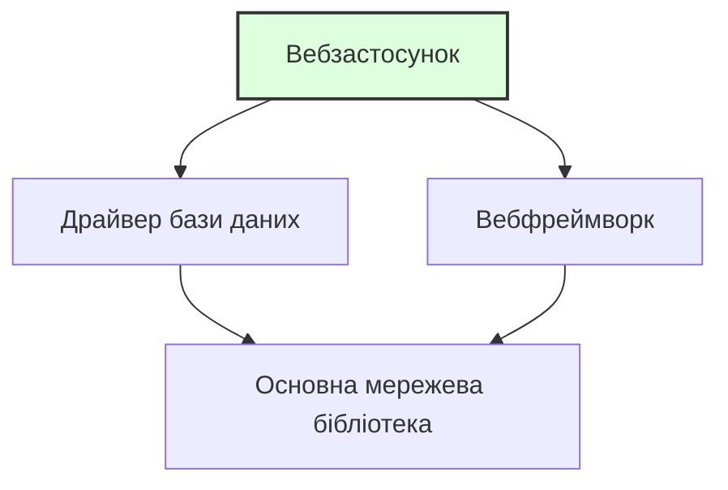

> **Складність**: `[QUICK]` — Абсолютний новачок
>
> **Час на проходження**: 25–30 хвилин
>
> **Попередні вимоги**: [Модуль 0.7: Що таке мережі?](/uk/prerequisites/zero-to-terminal/module-0.7-what-is-networking/) — ви повинні впевнено почуватися з терміналом, файлами та базовими концепціями мереж.

---

## Що ви зможете зробити

Після цього модуля ви зможете:
- **Встановлювати** програмне забезпечення через термінал за допомогою менеджера пакетів вашої ОС
- **Аналізувати** різницю між менеджерами пакетів (apt, brew, dnf), щоб обрати правильний інструмент для конкретної операційної системи
- **Оцінювати** наслідки оновлення або видалення пакетів для безпеки та стабільності системи
- **Діагностувати** вимоги до залежностей, витягуючи інформацію про встановлені пакети

---

## Чому це важливо

Для роботи з Kubernetes, Docker та хмарними інструментами вам потрібно буде **встановлювати програмне забезпечення** на свій комп'ютер — і не шляхом завантаження інсталяторів із сайтів та натискання «Далі, Далі, Готово», а за допомогою однієї команди в терміналі.

Цей модуль навчить вас, як працює ПЗ, що таке менеджери пакетів і як встановити ваші перші інструменти з командного рядка. Це навички, які ви будете використовувати буквально щодня в інженерії.

---

## Що таке програмне забезпечення?

Почнемо з самих основ.

**Програмне забезпечення (ПЗ)** — це набір інструкцій, які кажуть комп'ютеру, що робити. Коли ви відкриваєте браузер, відтворюєте відео або запускаєте команду в терміналі — це працює програмне забезпечення.

ПЗ пишеться людьми на **мовах програмування** — таких як Python, Go, Java або JavaScript, які створені бути (більш-менш) зрозумілими і людям, і комп'ютерам.

Ось крихітний приклад на Python:

```python
print("Hello, World!")
```

Це і є ПЗ. Один рядок, який каже комп'ютеру: «Виведи текст Hello, World! на екран».

> Аналогія з кухнею: ПЗ — це **рецепт**. Це інструкції для приготування страви. Комп'ютер — це шеф-кухар, який точно виконує рецепт. Мови програмування — це мова, якою написаний рецепт (українська, англійська тощо).

---

## Від вихідного коду до запущеної програми

> **Зупиніться та подумайте**: якщо процесор комп'ютера розуміє лише бінарний код (1 та 0), як він може виконати рецепт, написаний зрозумілими людині словами? Подумайте, що має статися між написанням коду та його запуском.

Кожна програма проходить шлях від «слів, надрукованих людиною» до «того, що може запустити ваш комп'ютер»:

### Крок 1: Вихідний код (Source Code)

Це те, що пишуть програмісти. Це виглядає як текст:

```go
package main

import "fmt"

func main() {
    fmt.Println("Hello from Go!")
}
```

Ви можете це прочитати. Ваш комп'ютер не може запустити це напряму.

### Крок 2: Компіляція (для деяких мов)

Деякі мови потребують **компіляції** — перекладу з людиночитаного коду в **машинний код** (бінарний код — ті самі одиниці та нулі, які розуміє процесор вашого комп'ютера).

```
Вихідний код  →  Компілятор  →  Бінарний файл (виконуваний)
(рецепт)         (перекладач)   (готова страва, яку можна подавати)
```


Результат називається **бінарним файлом (binary)** або **виконуваним файлом (executable)** — це файл, який комп'ютер дійсно може запустити.

> Аналогія з кухнею: Вихідний код — це рецепт на папері. Компіляція — це процес приготування. Бінарний файл — це готова страва, розкладена по тарілках і готова до споживання.

### Крок 3: Виконання

Ви **запускаєте** (виконуєте) бінарний файл, і комп'ютер слідує інструкціям.

```bash
$ ./my-program
Hello from Go!
```

> Не всі мови потребують компіляції. Python, наприклад, є **інтерпретованою** мовою — він читає та виконує код рядок за рядком, як шеф-кухар, який читає рецепт крок за кроком прямо під час готування. Такі мови як Go, C та Rust спочатку компілюються, а потім запускаються — як шеф-кухар, який робить усі заготовки заздалегідь.

---

## Що таке пакет?

> **Зупиніться та подумайте**: якби вам довелося встановлювати програму без графічного інсталятора, які ручні кроки знадобилися б, щоб отримати вихідний код, перекласти його та розмістити у правильній директорії?

Встановлення ПЗ з вихідного коду — це складно. Вам би довелося:

1. Завантажити вихідний код
2. Встановити потрібний компілятор
3. Скомпілювати код
4. Перемістити бінарний файл у правильне місце
5. Сподіватися, що нічого не зламалося

**Пакет** згортає все це в акуратний набір. Це вихідний код, уже скомпільований (зазвичай), упакований разом з інструкціями про те, куди його встановлювати та що ще йому потрібно для роботи.

> Аналогія з кухнею: Пакет — це **набір для приготування їжі** (як HelloFresh). Замість того, щоб іти в магазин, шукати кожен інгредієнт і вираховувати кількість, хтось уже зібрав усе докупи для вас. Просто відкрийте коробку та слідуйте простим інструкціям.

---

## Що таке менеджер пакетів?

**Менеджер пакетів** — це інструмент, який завантажує, встановлює, оновлює та видаляє пакети за вас. Це як **магазин застосунків (App Store)** для вашого термінала.

Замість того, щоб заходити на вебсайт, завантажувати файл і проходити через інсталятор, ви вводите одну команду:

```bash
$ sudo apt install htop       # На Ubuntu/Debian Linux
$ brew install htop            # На macOS
```

І менеджер пакетів:
1. Знаходить пакет у своєму каталозі
2. Завантажує його
3. Встановлює його
4. Налаштовує все так, щоб ви могли ним користуватися

### Популярні менеджери пакетів

| Менеджер пакетів | Операційна система | Команда встановлення |
|------------------|--------------------|----------------------|
| **apt** | Ubuntu, Debian (Linux) | `sudo apt install package-name` |
| **dnf** / **yum** | Fedora, RHEL, CentOS (Linux) | `sudo dnf install package-name` |
| **brew** (Homebrew) | macOS (та Linux) | `brew install package-name` |
| **pacman** | Arch Linux | `sudo pacman -S package-name` |
| **choco** | Windows | `choco install package-name` |

> У цьому курсі ми здебільшого будемо використовувати **apt** (для Linux) та **brew** (для macOS), оскільки вони є найпоширенішими у світі Kubernetes.

---

## Що таке `sudo`?

Ви помітите, що деякі команди починаються з `sudo`. Це важливо.

**`sudo`** розшифровується як **«superuser do»** (виконати від імені суперкористувача) — ця команда запускається з **правами адміністратора**.

Ваш комп'ютер має систему безпеки: звичайні користувачі не можуть встановлювати ПЗ на рівні всієї системи, змінювати системні файли або робити щось, що може зламати комп'ютер. Це зроблено навмисно. Це запобігає нещасним випадкам і зберігає вашу систему в безпеці.

Але встановлення програм потребує запису файлів у системні директорії, до яких звичайні користувачі не мають доступу. Тому ви використовуєте `sudo`, щоб тимчасово стати **суперкористувачем** (якого також називають **root** — всемогутній обліковий запис адміністратора).

```bash
$ apt install htop              # Помилка: permission denied
$ sudo apt install htop         # Працює (запитає ваш пароль)
```

> **Зупиніться та подумайте**: що саме станеться, якщо ви запустите `apt install tree` у системі Linux без `sudo`? Не просто гадайте — спробуйте запустити це та прочитайте точне повідомлення про помилку, яке видасть система.

Коли ви вводите `sudo`, вас запитають пароль. Це ваш пароль користувача — той самий, який ви використовуєте для входу в систему. Коли ви його вводите, ви не побачите жодних символів на екрані (ні крапок, ні зірочок, нічого). Це нормально і зроблено навмисно, щоб хтось, хто дивиться через плече, не міг порахувати кількість символів. Просто введіть пароль і натисніть Enter.

> Аналогія з кухнею: `sudo` — це як **ключ менеджера**. Більшість персоналу може працювати на кухні, але щоб зайти в комору або змінити налаштування термостата, потрібен ключ менеджера. `sudo` дає вам цей ключ тимчасово.

### На macOS з Homebrew

Homebrew (`brew`) спроектований так, що вам зазвичай **не потрібен `sudo`**. Він встановлює пакети у ваш користувацький простір, а не в системні директорії. Це одна з причин популярності Homebrew — менше мороки з правами доступу.

```bash
$ brew install htop             # Працює без sudo на macOS
```

---

## Залежності: програми, яким потрібні інші програми

Програмне забезпечення рідко працює саме по собі. Більшість програм потребують інших програм або бібліотек для функціонування. Вони називаються **залежностями (dependencies)**.

Наприклад:
- Вебзастосунку може знадобитися база даних
- Інструменту командного рядка може знадобитися специфічна бібліотека
- Програмі на Python потрібно, щоб сам Python був встановлений у системі



> Аналогія з кухнею: Залежності — це як **інгредієнти для інгредієнтів**. Щоб приготувати соус, вам потрібен майонез. Але щоб зробити майонез, потрібні яйця та олія. Яйця та олія є залежностями майонезу, який сам є залежністю для соусу.

### Чому залежності важливі

**Хороша новина**: менеджери пакетів обробляють залежності автоматично. Коли ви встановлюєте пакет, менеджер пакетів також встановлює все інше, що потрібно цьому пакету.

```bash
$ sudo apt install some-program
Reading package lists... Done
The following additional packages will be installed:
  dependency-1 dependency-2 dependency-3
```

Менеджер пакетів вираховує весь ланцюжок залежностей і встановлює їх усі. Вам не потрібно шукати їх самостійно.

**Менш хороша новина**: іноді залежності конфліктують між собою. Програмі А потрібна версія 1.0 бібліотеки, а програмі Б — версія 2.0. Це називається **«пеклом залежностей» (dependency hell)**, і це одна з проблем, для вирішення яких були винайдені контейнери (про які ви дізнаєтеся незабаром).

> **Зупиніться та подумайте**: уявіть, що ви налаштовуєте сервер. Програма А суворо вимагає `libfoo` версії 1.0. Програма Б суворо вимагає `libfoo` версії 2.0. Якщо ваша операційна система дозволяє встановити лише одну версію бібліотеки глобально, яку б ви встановили першою і чому? Саме ця дилема призвела до появи Docker та контейнерів, які дозволяють кожній програмі мати свій власний ізольований набір залежностей.

---

## Встановлення ваших перших пакетів

Давайте встановимо кілька корисних інструментів. Дотримуйтесь інструкцій для вашої ОС.

### Оновлення списку пакетів

> **Зупиніться та подумайте**: як ви вважаєте, чому потрібно запускати `update` перед `install`? Подумайте: менеджер пакетів має локальний каталог того, що доступно. Але нові версії виходять щодня. Якщо ви встановлюєте без оновлення, ви можете отримати стару версію — або взагалі зазнати невдачі, бо каталог ще не знає про цей пакет.

Перед встановленням будь-чого оновіть каталог вашого менеджера пакетів. Сприймайте це як оновлення списку доступних товарів:

**Ubuntu/Debian Linux:**

```bash
$ sudo apt update
```

Це не встановлює і не змінює нічого в системі — воно просто завантажує найсвіжіший список доступних пакетів та їхніх версій.

**macOS:**

По-перше, якщо у вас ще не встановлено Homebrew, встановіть його зараз:

```bash
# Встановлення Homebrew (тільки для macOS — пропустіть, якщо він уже є)
/bin/bash -c "$(curl -fsSL https://raw.githubusercontent.com/Homebrew/install/HEAD/install.sh)"
```

> Це може зайняти кілька хвилин. Система запитає ваш пароль (той самий, що для входу в систему Mac).

Після встановлення Homebrew оновіть його:

```bash
$ brew update
```

### Встановлення `htop` — системного монітора

`htop` — це візуальний інструмент, який показує, які програми зараз запущені на вашому комп'ютері, скільки процесора та пам'яті вони використовують тощо.

**Ubuntu/Debian Linux:**

```bash
$ sudo apt install htop
```

**macOS:**

```bash
$ brew install htop
```

Тепер запустіть його:

```bash
$ htop
```

Ви побачите кольоровий дисплей із використанням CPU, пам'яті та списком запущених процесів (програм). Це як дивитися на дошку замовлень у кухні — ви бачите все, що відбувається одночасно.

**Натисніть `q`, щоб вийти з htop.**

### Встановлення `tree` — візуалізатора директорій

Пам'ятаєте, як ми створювали директорії в модулі 0.4? `tree` показує структуру директорій у гарному візуальному форматі.

**Ubuntu/Debian Linux:**

```bash
$ sudo apt install tree
```

**macOS:**

```bash
$ brew install tree
```

Тепер спробуйте:

```bash
$ tree ~/kubedojo-practice
```

Ви маєте побачити щось на кшталт:

```
/home/yourname/kubedojo-practice
└── recipes
    ├── appetizers
    │   └── bruschetta.txt
    ├── desserts
    │   └── tiramisu.txt
    └── main-courses
        └── pasta-carbonara.txt
```

(Якщо ви виконали вправу в модулі 0.4. Якщо ні, `tree` все одно працюватиме — просто спробуйте на будь-якій директорії.)

---

## Оновлення та видалення програмного забезпечення

### Оновлення всіх встановлених пакетів

З часом ПЗ на вашому комп'ютері отримує оновлення — виправлення помилок, патчі безпеки, нові функції. Регулярно оновлювати систему дуже важливо.

**Ubuntu/Debian Linux:**

```bash
$ sudo apt update              # Оновити список пакетів
$ sudo apt upgrade             # Встановити доступні оновлення
```

Ви можете об'єднати їх:

```bash
$ sudo apt update && sudo apt upgrade
```

Символ `&&` означає «запустити другу команду, тільки якщо перша пройшла успішно». Сприймайте це як: «Онови список І ПОТІМ встанови оновлення».

**macOS:**

```bash
$ brew update && brew upgrade
```

### Чому оновлення важливі: повчальна історія

У 2017 році бюро кредитних історій Equifax постраждало від масового витоку даних, через який було розкрито особисту інформацію 147 мільйонів людей. Причина? Відома вразливість у програмному забезпеченні Apache Struts. Патч для її виправлення був доступний уже два місяці, але Equifax не оновив свої системи. Це одне пропущене оновлення коштувало компанії понад 1,4 мільярда доларів компенсацій і повністю зруйнувало її репутацію. В інженерному світі запуск оновлень пакетів — це не просто отримання нових фіч; це критична відповідальність за безпеку.

> **Зупиніться та подумайте**: якщо оновлення такі важливі, чому б не налаштувати сервери на автооновлення щоночі? У промислових середовищах (production) несподіване оновлення може зламати ваш застосунок. Якщо бібліотека, від якої залежить ваш код, змінить свою поведінку в новій версії, ваш застосунок може «впасти» посеред ночі. Ось чому інженери ретельно тестують оновлення в тестовому середовищі (staging), перш ніж застосовувати їх на робочих серверах.

### Видалення ПЗ

**Ubuntu/Debian Linux:**

```bash
$ sudo apt remove package-name
```

**macOS:**

```bash
$ brew uninstall package-name
```

### Пошук пакетів

Не впевнені, як називається пакет?

**Ubuntu/Debian Linux:**

```bash
$ apt search keyword
```

**macOS:**

```bash
$ brew search keyword
```

---

## Чи знали ви?

> 1. **Homebrew (менеджер пакетів для macOS) був створений у 2009 році розробником, який був розчарований відсутністю нормального менеджера пакетів у macOS.** Макс Хавелл створив його як open-source проєкт. Сьогодні він налічує понад 6 000 пакетів і використовується мільйонами розробників. Назва — це метафора пивоваріння: пакети називаються «formulae» (рецепти), місце встановлення — «Cellar» (підвал), а вся система «варить» (brews) ваше ПЗ.
>
> 2. **Менеджер пакетів `apt` на Ubuntu має доступ до понад 60 000 пакетів.** Це 60 000 програм, які можна встановити однією командою. Від текстових редакторів до баз даних, ігор та інструментів для наукових розрахунків — це один із найбільших каталогів ПЗ у світі, і все це безкоштовно.
>
> 3. **Концепція `sudo` виникла через реальну потребу в безпеці.** У 1980 році програмісти з університету Баффало шукали спосіб дозволити довіреним користувачам запускати специфічні команди від імені root без передачі їм пароля root. Вони створили `sudo` — що спочатку означало «superuser do». Система логує кожну команду `sudo`, щоб адміністратори могли перевірити, хто і що робив. Сьогодні `sudo` використовується практично на кожній системі Linux та macOS.
>
> 4. **Фраза «пекло залежностей» (dependency hell) — це офіційний технічний термін.** Він виник у спільноті Linux для опису крайнього розчарування при спробі встановити програму, яка потребує специфічної версії спільної бібліотеки, що своєю чергою ламає іншу програму, якій потрібна інша версія тієї ж самої бібліотеки.

---

## Типові помилки

| Помилка | Що відбувається | Як виправити | Наслідок у реальному світі |
|---------|-----------------|--------------|----------------------------|
| Забули `sudo` на Linux | `Permission denied` або `Operation not permitted` | Додайте `sudo` перед командою: `sudo apt install ...` | Встановлення не вдається, ви не можете використовувати потрібний інструмент. |
| Використання `sudo` з `brew` на macOS | Homebrew попереджає або встановлює неправильно | Не використовуйте `sudo` з `brew` — йому це не потрібно | Ви можете пошкодити права доступу файлів Homebrew, що потребуватиме нудного ручного виправлення в майбутньому. |
| Не запуск `apt update` спочатку | Може встановити стару версію або не знайти пакет | Завжди запускайте `sudo apt update` перед встановленням на Linux | Ви можете встановити ПЗ з відомою вразливістю або встановлення взагалі не почнеться. |
| Помилка в назві пакета | `Unable to locate package htoop` | Перевірте написання або використайте `apt search` / `brew search` | Ви можете випадково встановити шкідливий пакет, створений хакером саме в розрахунку на таку помилку (typosquatting). |
| Нечитання виводу в терміналі | Пропуск важливих попереджень або помилок | Читайте, що каже термінал! Він часто пояснює, що саме пішло не так | Ви можете повірити, що інструмент безпеки встановлено, хоча насправді він не запустився, залишаючи систему вразливою. |
| Натискання Enter у запиті пароля без введення нічого | Помилка автентифікації | Введіть пароль (символів не буде видно) і натисніть Enter | Ви марнуєте час і можете заблокувати свій обліковий запис після занадто великої кількості спроб. |

---

## Контрольні запитання

**Запитання 1**: Ви щойно прийшли в нову компанію, і вам потрібно встановити Node.js, PostgreSQL та Redis на робочий ноутбук. Колега каже вам: «Просто зайди на їхні сайти та завантаж інсталятори». Чому використання менеджера пакетів буде кращим інженерним підходом?

<details>
<summary>Показати відповідь</summary>

Використання менеджера пакетів набагато ефективніше та зручніше для підтримки, ніж ручне завантаження. Менеджер пакетів діє як централізований магазин застосунків для вашого термінала, дозволяючи встановити всі три інструменти однією-двома командами. Він також автоматично обробляє завантаження будь-яких прихованих залежностей. Крім того, коли виходять оновлення або патчі безпеки, ви можете оновити всі свої інструменти одночасно, замість того щоб знову відвідувати три різні вебсайти.

</details>

**Запитання 2**: Ситуація: ви увійшли на Linux-сервер як звичайний користувач і намагаєтеся встановити інструмент моніторингу командою `apt install htop`. Термінал повертає помилку «Permission denied». Чому система заблокувала цю дію і яку структуру команди слід використати для вирішення?

<details>
<summary>Показати відповідь</summary>

Система заблокувала дію, тому що встановлення програмного забезпечення потребує запису в системні директорії, доступ до яких обмежено для звичайних користувачів, щоб запобігти несанкціонованим або випадковим змінам. Щоб вирішити це, потрібно додати перед командою `sudo` (наприклад, `sudo apt install htop`), що тимчасово надасть вам права суперкористувача (root). Цей механізм змушує вас явно підтвердити, що ви маєте намір внести адміністративні зміни.

</details>

**Запитання 3**: Ви намагаєтеся встановити просту погодну програму для командного рядка, але вивід менеджера пакетів показує, що він також завантажує ще 15 інших пакетів, включаючи щось під назвою `python3-requests`. Чому менеджер пакетів завантажує всі ці додаткові інструменти, про які ви не просили?

<details>
<summary>Показати відповідь</summary>

Ці додаткові пакети є залежностями, які необхідні погодній програмі для коректної роботи. Програмне забезпечення рідко працює ізольовано; розробники покладаються на існуючі бібліотеки для виконання завдань (наприклад, здійснення мережевих запитів), замість того щоб писати цей код з нуля. Менеджер пакетів виконує свою роботу, автоматично ідентифікуючи та встановлюючи ці передумови. Без цього вам би довелося вручну шукати та встановлювати всі 15 бібліотек самостійно.

</details>

**Запитання 4**: Ситуація: у бюлетені безпеки оголошено про критичну вразливість в інструменті `curl`, і вам наказано негайно її виправити. Ви запускаєте `sudo apt upgrade curl`, але термінал повідомляє, що `curl is already the newest version`, хоча ви знаєте, що патч вийшов кілька годин тому. Чому менеджер пакетів не встановлює патч і як виправити цей робочий процес?

<details>
<summary>Показати відповідь</summary>

Менеджер пакетів не встановлює патч, тому що він покладається на застарілий локальний каталог доступних версій ПЗ. Команда `upgrade` лише встановлює новіші версії тих пакетів, про які вона вже знає зі своєї локальної бази даних. Щоб виправити це, спочатку потрібно запустити `sudo apt update`, щоб завантажити останній індекс пакетів із віддалених репозиторіїв. Як тільки локальний каталог оновиться, команда upgrade успішно знайде та встановить виправлення безпеки.

</details>

**Запитання 5**: Ви допомагаєте молодшому розробнику через демонстрацію екрана. Ви кажете йому запустити команду з `sudo`. Він вводить пароль, але раптом зупиняється і каже: «Моя клавіатура зламалася, нічого не друкується». Як ви поясните, що відбувається і чому система поводиться саме так?

<details>
<summary>Показати відповідь</summary>

Система навмисно приховує введення символів як вбудовану функцію безпеки. На відміну від веббраузерів, які показують зірочки або крапки, термінал не відображає абсолютно нічого під час введення паролів. Це запобігає тому, щоб хтось, хто дивиться через плече або через демонстрацію екрана, міг дізнатися навіть довжину вашого пароля. Слід сказати розробнику впевнено ввести пароль повністю та натиснути Enter, запевнивши його, що комп'ютер отримує введення.

</details>

**Запитання 6**: Ситуація: ви запускаєте `sudo apt install nginx`, щоб встановити вебсервер на абсолютно новому комп'ютері з Linux, але термінал видає помилку: `E: Unable to locate package nginx`. Ви точно знаєте, що `nginx` — це правильна назва пакета. Яка найбільш імовірна причина цієї помилки і яку команду треба запустити для виправлення?

<details>
<summary>Показати відповідь</summary>

Найбільш імовірна причина полягає в тому, що локальний каталог доступних пакетів порожній або застарілий, оскільки це нова машина. Менеджер пакетів ще не знає, звідки завантажувати пакет, бо він ще не синхронізувався з віддаленими репозиторіями ПЗ. Щіоб виправити це, спочатку запустіть `sudo apt update`, щоб завантажити останній індекс пакетів. Після оновлення каталогу повторний запуск команди встановлення знайде та завантажить пакет.

</details>

---

## Практична вправа: ваші перші встановлення програм

### Мета

Використати менеджер пакетів, щоб встановити, запустити та дослідити нове програмне забезпечення через термінал.

### Кроки

1. **Оновіть ваш менеджер пакетів:**

На Ubuntu/Debian Linux:
```bash
$ sudo apt update
```

На macOS:
```bash
$ brew update
```

2. **Встановіть htop:**

На Ubuntu/Debian Linux:
```bash
$ sudo apt install htop -y
```

На macOS:
```bash
$ brew install htop
```

Прапор `-y` (в apt) означає «так на всі запити» — він автоматично підтверджує встановлення, не питаючи «Ви впевнені? [Y/n]».

3. **Запустіть htop та дослідіть його:**

```bash
$ htop
```

Зверніть увагу:
- Смужки використання CPU вгорі
- Смужка використання пам'яті (Memory)
- Список запущених процесів
- Кожен процес має PID (Process ID — унікальний номер)

Натисніть `q`, щоб вийти.

4. **Встановіть tree:**

На Ubuntu/Debian Linux:
```bash
$ sudo apt install tree -y
```

На macOS:
```bash
$ brew install tree
```

5. **Використайте tree для візуалізації директорії:**

```bash
$ tree ~/kubedojo-practice
```

Якщо у вас немає директорії `kubedojo-practice`, спробуйте:

```bash
$ tree ~ -L 1
```

Прапор `-L 1` означає «показувати тільки на 1 рівень вглиб» — це корисно для великих директорій.

6. **Перевірте, що встановлено:**

На Ubuntu/Debian Linux:
```bash
$ apt list --installed | head -20
```

На macOS:
```bash
$ brew list
```

7. **Пошукайте пакет:**

На Ubuntu/Debian Linux:
```bash
$ apt search "system monitor"
```

На macOS:
```bash
$ brew search "monitor"
```

8. **Перевірте версію встановленого інструмента:**

```bash
$ htop --version
```

Більшість програм підтримують прапор `--version` або `-v` для показу номера версії. Це корисно при діагностиці: «Яка версія цього інструмента у мене встановлена?».

### Додаткове завдання: дослідження залежностей

Програми залежать від інших програм. Давайте простежимо ланцюжок залежностей, щоб побачити, наскільки все взаємопов'язано.

1. Оберіть пакет, який ви щойно встановили (наприклад, `tree` або `htop`).
2. Запустіть `apt show htop` (на Linux) або `brew info htop` (на macOS).
3. Подивіться на вивід і знайдіть розділ «Depends» або «Dependencies».
4. Оберіть одну з цих залежностей і запустіть команду `apt show` або `brew info` вже для неї, щоб побачити, від чого залежить *вона*.

Вміння перевіряти пакет перед встановленням — це критична навичка для оцінки безпеки та «важкості» нових інструментів.

### Критерії успіху

Ви виконали цю вправу, якщо можете:

- [ ] Оновити список пакетів вашого менеджера
- [ ] Встановити `htop` та запустити його (і вийти через `q`)
- [ ] Встановити `tree` та використати його для відображення директорії
- [ ] Шукати пакети за ключовими словами
- [ ] Перевірити версію встановленого інструмента
- [ ] Перевірити залежності пакета (додаткове завдання)

---

> Ви щойно використали інструмент, який досвідчені інженери використовують щодня. Ласкаво просимо в команду.

---

## Наступний модуль

Тепер ви знаєте, як шлях програми пролягає від коду до запуску, як встановлювати інструменти через менеджер пакетів і що робить `sudo`. Ваш інструментарій термінала зростає.

Це фундамент для вивчення контейнерів, хмарних обчислень і, зрештою, Kubernetes. Кожен інструмент в екосистемі Kubernetes — `kubectl`, `helm`, `kind`, `docker` — встановлюється саме так, як ви щойно навчилися.

**Перейти до**: [Модуль 0.10: Що таке хмара?](/uk/prerequisites/zero-to-terminal/module-0.10-what-is-the-cloud/) — дізнайтеся, що насправді являє собою хмара, як працюють дата-центри і чому компанії орендують сервери замість того, щоб купувати їх.